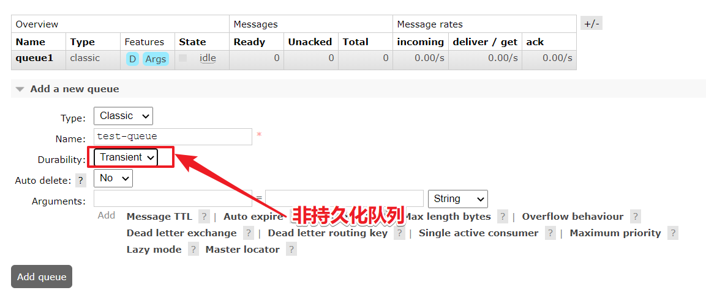

## RabbitMQ运维-持久化机制

### 01、RibbitMQ持久化

持久化就把信息写入到磁盘的过程。

### 02、RabbitMQ持久化消息


把消息默认放在内存中是为了加快传输和消费的速度，存入磁盘是保证消息数据的持久化。

### 03、RabbitMQ非持久化消息

非持久消息：是指当内存不够用的时候，会把消息和数据转移到磁盘，但是重启以后非持久化队列消息就丢失。

### 04、RabbitMQ持久化分类

RabbitMQ的持久化队列分为：
1：队列持久化
2：消息持久化
3：交换机持久化
不论是持久化的消息还是非持久化的消息都可以写入到磁盘中，只不过非持久的是等内存不足的情况下才会被写入到磁盘中。

### 05、RabbitMQ队列持久化的代码实现

队列的持久化是定义队列时的durable参数来实现的，Durable为true时，队列才会持久化。

```java
// 参数1：名字  
// 参数2：是否持久化，
// 参数3：独du占的queue， 
// 参数4：不使用时是否自动删除，
// 参数5：其他参数
channel.queueDeclare(queueName,true,false,false,null);
```

其中参数2：设置为true,就代表的是持久化的含义。即durable=true。持久化的队列在web控制台中有一个`D` 的标记


#### 测试步骤

1：可以建立一个临时队列



2：然后重启rabbit-server服务，会发现持久化队列依然在，而非持久队列会丢失。

```shell
systecmctl restart rabbitmq-server
或者
docker restart myrabbit
```

### 06、RabbitMQ消息持久化

消息持久化是通过消息的属性deliveryMode来设置是否持久化，在发送消息时通过basicPublish的参数传入。

```java
// 参数1：交换机的名字
// 参数2：队列或者路由key
// 参数3：是否进行消息持久化
// 参数4：发送消息的内容
channel.basicPublish(exchangeName, routingKey1, MessageProperties.PERSISTENT_TEXT_PLAIN, message.getBytes());
```

### 07、RabbitMQ交换机持久化

和队列一样，交换机也需要在定义的时候设置持久化的标识，否则在rabbit-server服务重启以后将丢失。

```java
// 参数1：交换机的名字
// 参数2：交换机的类型，topic/direct/fanout/headers
// 参数3：是否持久化
channel.exchangeDeclare(exchangeName,exchangeType,true);
```

