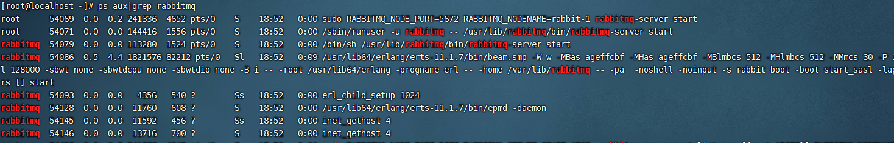
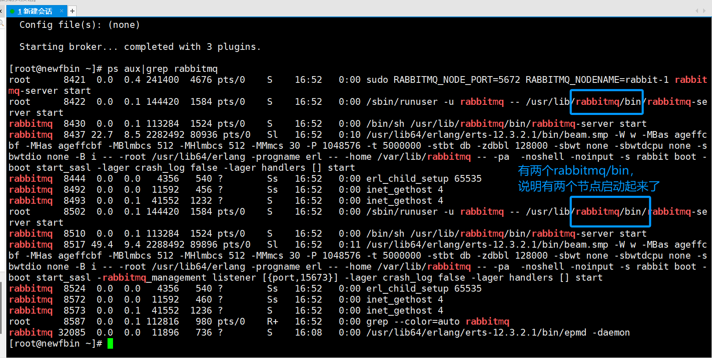
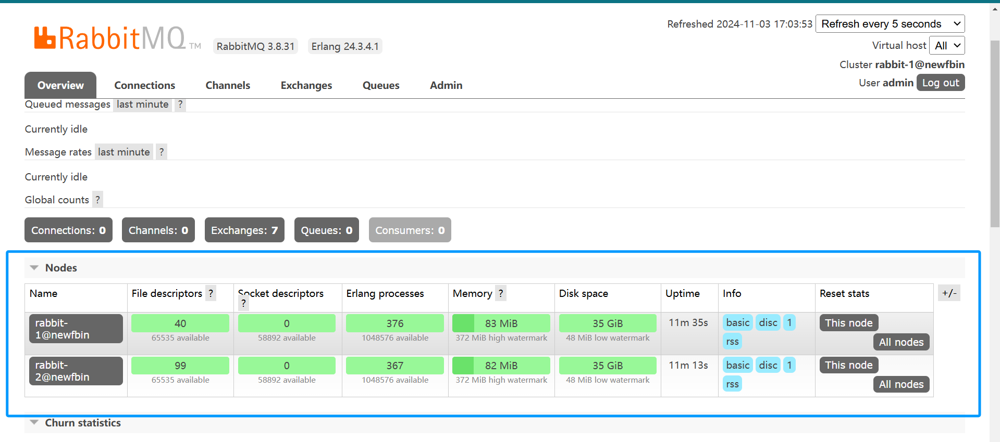

## RabbitMQ-高级-集群

### 01、RabbitMQ 集群

RabbitMQ这款消息队列中间件产品本身是基于Erlang编写，Erlang语言天生具备分布式特性（通过同步Erlang集群各节点的magic cookie来实现）。因此，RabbitMQ天然支持Clustering。这使得RabbitMQ本身不需要像ActiveMQ、Kafka那样通过ZooKeeper分别来实现HA方案和保存集群的元数据。集群是保证可靠性的一种方式，同时可以通过水平扩展以达到增加消息吞吐量能力的目的。
在实际使用过程中多采取多机多实例部署方式，为了便于同学们练习搭建，有时候你不得不在一台机器上去搭建一个rabbitmq集群，本章主要针对单机多实例这种方式来进行开展。

> 主要参考官方文档：https://www.rabbitmq.com/clustering.html

### 02、集群搭建

配置的前提是你的rabbitmq可以运行起来，比如”ps aux|grep rabbitmq”你能看到相关进程，又比如运行“rabbitmqctl status”你可以看到类似如下信息，而不报错：

执行下面命令进行查看：

```shell
ps aux|grep rabbitmq
```



或者

```bash
systemctl status rabbitmq-server
```

> 注意：确保RabbitMQ可以运行的，确保完成之后，把单机版的RabbitMQ服务停止，后台看不到RabbitMQ的进程为止

### 03、单机多实例搭建

**场景：**假设有两个rabbitmq节点，分别为rabbit-1, rabbit-2，rabbit-1作为主节点，rabbit-2作为从节点。
**启动命令**：RABBITMQ_NODE_PORT=5672 RABBITMQ_NODENAME=rabbit-1 rabbitmq-server -detached
**结束命令**：rabbitmqctl -n rabbit-1 stop

#### 03-1、**第一步**：启动第一个节点rabbit-1

```shell
> sudo RABBITMQ_NODE_PORT=5672 RABBITMQ_NODENAME=rabbit-1 rabbitmq-server start &
...............省略...................
  ##########  Logs: /var/log/rabbitmq/rabbit-1.log
  ######  ##        /var/log/rabbitmq/rabbit-1-sasl.log
  ##########
              Starting broker...
 completed with 7 plugins.
```

至此节点rabbit-1启动完成。

#### 03-2、启动第二个节点rabbit-2

> 注意：web管理插件端口占用,所以还要指定其web插件占用的端口号
> RABBITMQ_SERVER_START_ARGS=”-rabbitmq_management listener [{port,15673}]”

```shell
sudo RABBITMQ_NODE_PORT=5673 RABBITMQ_SERVER_START_ARGS="-rabbitmq_management listener [{port,15673}]" RABBITMQ_NODENAME=rabbit-2 rabbitmq-server start &
..............省略..................
  ##########  Logs: /var/log/rabbitmq/rabbit-2.log
  ######  ##        /var/log/rabbitmq/rabbit-2-sasl.log
  ##########
              Starting broker...
 completed with 7 plugins.
```

至此节点rabbit-2启动完成

#### 03-3、验证启动 “ps aux|grep rabbitmq”



#### 03-4、rabbit-1操作作为主节点

```shell
#停止应用
> sudo rabbitmqctl -n rabbit-1 stop_app
#目的是清除节点上的历史数据（如果不清除，无法将节点加入到集群）
> sudo rabbitmqctl -n rabbit-1 reset
#启动应用
> sudo rabbitmqctl -n rabbit-1 start_app
```

#### 03-5、rabbit2操作为从节点

```shell
# 停止应用
> sudo rabbitmqctl -n rabbit-2 stop_app
# 目的是清除节点上的历史数据（如果不清除，无法将节点加入到集群）
> sudo rabbitmqctl -n rabbit-2 reset
# 将rabbit2节点加入到rabbit1（主节点）集群当中【Server-node服务器的主机名】
# 我的主机名为newfbin，所以我执行的命令为：
# rabbitmqctl -n rabbit-2 join_cluster rabbit-1@'newfbin'
> sudo rabbitmqctl -n rabbit-2 join_cluster rabbit-1@'Server-node'
# 启动应用
> sudo rabbitmqctl -n rabbit-2 start_app
```

#### 03-6、验证集群状态

```shell
> sudo rabbitmqctl cluster_status -n rabbit-1

//集群有两个节点：rabbit-1@Server-node、rabbit-2@Server-node
[{nodes,[{disc,['rabbit-1@Server-node','rabbit-2@Server-node']}]},
 {running_nodes,['rabbit-2@Server-node','rabbit-1@Server-node']},
 {cluster_name,<<"rabbit-1@Server-node.localdomain">>},
 {partitions,[]},
 {alarms,[{'rabbit-2@Server-node',[]},{'rabbit-1@Server-node',[]}]}]
```

#### 03-7、Web监控


> 注意在访问的时候：web结面的管理需要给15672 node-1 和15673的node-2 设置用户名和密码。如下:

```shell
rabbitmqctl -n rabbit-1 add_user admin admin
rabbitmqctl -n rabbit-1 set_user_tags admin administrator
rabbitmqctl -n rabbit-1 set_permissions -p / admin ".*" ".*" ".*"
rabbitmqctl -n rabbit-2 add_user admin admin
rabbitmqctl -n rabbit-2 set_user_tags admin administrator
rabbitmqctl -n rabbit-2 set_permissions -p / admin ".*" ".*" ".*"
```

**Web端界面如下：**



#### 03-8、小结

> **Tips：**
> 如果采用多机部署方式，需读取其中一个节点的cookie, 并复制到其他节点（节点之间通过cookie确定相互是否可通信）。cookie存放在/var/lib/rabbitmq/.erlang.cookie。
> 例如：主机名分别为rabbit-1、rabbit-2
> 1、逐个启动各节点
> 2、配置各节点的hosts文件( vim /etc/hosts)
> ​ ip1：rabbit-1
> ​ ip2：rabbit-2
> 其它步骤雷同单机部署方式

