## RabbitMQ-高级-分布式事务

### 简述

分布式事务指事务的操作位于不同的节点上，需要保证事务的 AICD 特性。
例如在下单场景下，库存和订单如果不在同一个节点上，就涉及分布式事务。

### 01、分布式事务的方式

在分布式系统中，要实现分布式事务，无外乎那几种解决方案。

#### 一、两阶段提交（2PC）需要数据库产商的支持，java组件有atomikos等。

两阶段提交（Two-phase Commit，2PC），通过引入协调者（Coordinator）来协调参与者的行为，并最终决定这些参与者是否要真正执行事务。

###### 准备阶段

协调者询问参与者事务是否执行成功，参与者发回事务执行结果。

1.2 提交阶段
如果事务在每个参与者上都执行成功，事务协调者发送通知让参与者提交事务；否则，协调者发送通知让参与者回滚事务。
需要注意的是，在准备阶段，参与者执行了事务，但是还未提交。只有在提交阶段接收到协调者发来的通知后，才进行提交或者回滚。

###### 存在的问题

- 2.1 同步阻塞 所有事务参与者在等待其它参与者响应的时候都处于同步阻塞状态，无法进行其它操作。
- 2.2 单点问题 协调者在 2PC 中起到非常大的作用，发生故障将会造成很大影响。特别是在阶段二发生故障，所有参与者会一直等待状态，无法完成其它操作。
- 2.3 数据不一致 在阶段二，如果协调者只发送了部分 Commit 消息，此时网络发生异常，那么只有部分参与者接收到 Commit 消息，也就是说只有部分参与者提交了事务，使得系统数据不一致。
- 2.4 太过保守 任意一个节点失败就会导致整个事务失败，没有完善的容错机制。

#### 二、补偿事务（TCC） 严选，阿里，蚂蚁金服。

TCC 其实就是采用的补偿机制，其核心思想是：针对每个操作，都要注册一个与其对应的确认和补偿（撤销）操作。它分为三个阶段：

- Try 阶段主要是对业务系统做检测及资源预留
- Confirm 阶段主要是对业务系统做确认提交，Try阶段执行成功并开始执行 Confirm阶段时，默认 - - - Confirm阶段是不会出错的。即：只要Try成功，Confirm一定成功。
- Cancel 阶段主要是在业务执行错误，需要回滚的状态下执行的业务取消，预留资源释放。

> 举个例子，假入 Bob 要向 Smith 转账，思路大概是： 我们有一个本地方法，里面依次调用
> 1：首先在 Try 阶段，要先调用远程接口把 Smith 和 Bob 的钱给冻结起来。
> 2：在 Confirm 阶段，执行远程调用的转账的操作，转账成功进行解冻。
> 3：如果第2步执行成功，那么转账成功，如果第二步执行失败，则调用远程冻结接口对应的解冻方法 (Cancel)。

优点： 跟2PC比起来，实现以及流程相对简单了一些，但数据的一致性比2PC也要差一些
缺点： 缺点还是比较明显的，在2,3步中都有可能失败。TCC属于应用层的一种补偿方式，所以需要程序员在实现的时候多写很多补偿的代码，在一些场景中，一些业务流程可能用TCC不太好定义及处理。

#### 三、本地消息表（异步确保）比如：支付宝、微信支付主动查询支付状态，对账单的形式

本地消息表与业务数据表处于同一个数据库中，这样就能利用本地事务来保证在对这两个表的操作满足事务特性，并且使用了消息队列来保证最终一致性。

- 在分布式事务操作的一方完成写业务数据的操作之后向本地消息表发送一个消息，本地事务能保证这个消息一定会被写入本地消息表中。
- 之后将本地消息表中的消息转发到 Kafka 等消息队列中，如果转发成功则将消息从本地消息表中删除，否则继续重新转发。
- 在分布式事务操作的另一方从消息队列中读取一个消息，并执行消息中的操作。

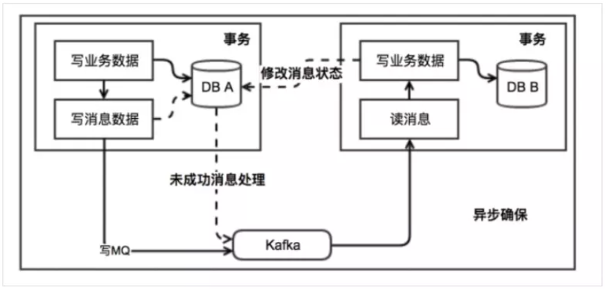

> 优点： 一种非常经典的实现，避免了分布式事务，实现了最终一致性。
> 缺点： 消息表会耦合到业务系统中，如果没有封装好的解决方案，会有很多杂活需要处理。

#### 四、MQ 事务消息 异步场景，通用性较强，拓展性较高。

有一些第三方的MQ是支持事务消息的，比如RocketMQ，他们支持事务消息的方式也是类似于采用的二阶段提交，但是市面上一些主流的MQ都是不支持事务消息的，比如 Kafka 不支持。
以阿里的 RocketMQ 中间件为例，其思路大致为：

- 第一阶段Prepared消息，会拿到消息的地址。 第二阶段执行本地事务，第三阶段通过第一阶段拿到的地址去访问消息，并修改状态。

- 也就是说在业务方法内要想消息队列提交两次请求，一次发送消息和一次确认消息。如果确认消息发送失败了RocketMQ会定期扫描消息集群中的事务消息，这时候发现了Prepared消息，它会向消息发送者确认，所以生产方需要实现一个check接口，RocketMQ会根据发送端设置的策略来决定是回滚还是继续发送确认消息。这样就保证了消息发送与本地事务同时成功或同时失败。

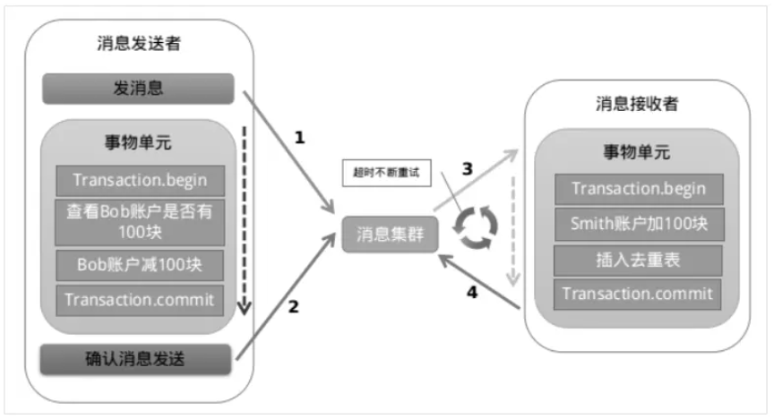

优点： 实现了最终一致性，不需要依赖本地数据库事务。
缺点： 实现难度大，主流MQ不支持，RocketMQ事务消息部分代码也未开源。

#### 五、总结

通过本文我们总结并对比了几种分布式分解方案的优缺点，分布式事务本身是一个技术难题，是没有一种完美的方案应对所有场景的，具体还是要根据业务场景去抉择吧。阿里RocketMQ去实现的分布式事务，现在也又出了很多分布式事务的协调器，比如LCN等，大家可以多去尝试。

### 02、具体实现

分布式事务的完整架构图

下面展示了冗余数据库

美团外卖架构：
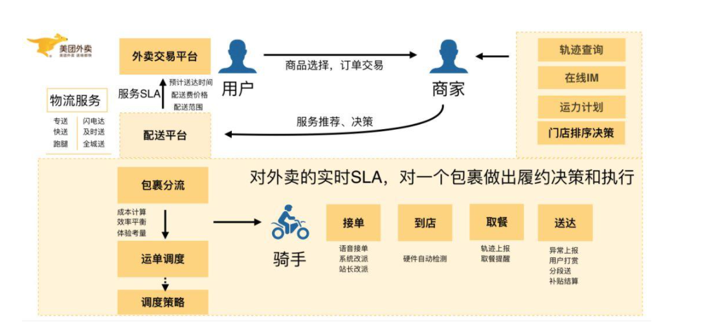

#### 2-01、系统与系统之间的分布式事务问题

#### 2-02、系统间调用过程中事务回滚问题

##### 数据库设计

订单表

运单表

##### 代码结构和部分代码

**代码结构：**

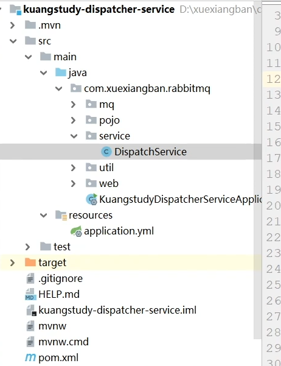

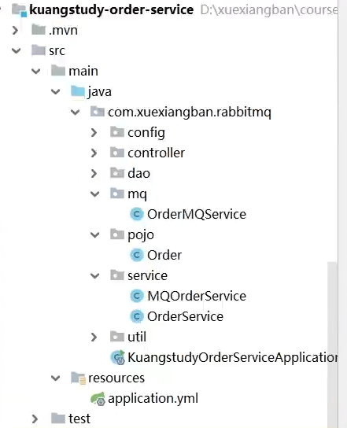

**Service层代码：**

运单服务service代码:

订单服务service代码：

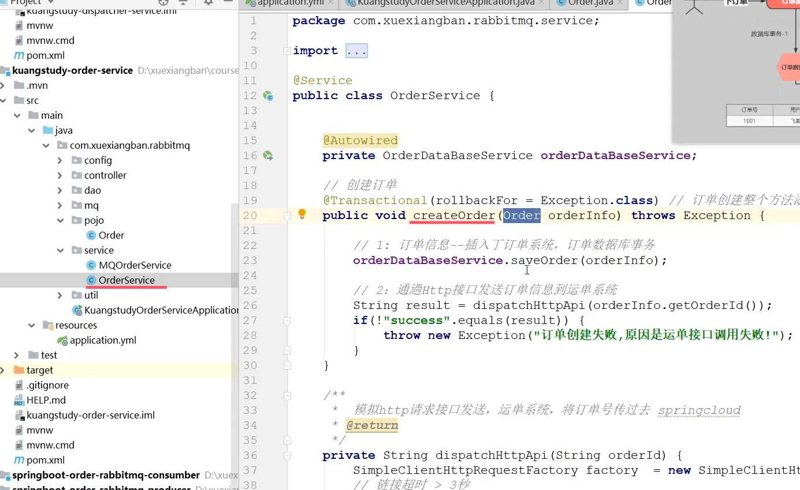

**Controller层代码：**

运单服务Controller代码：

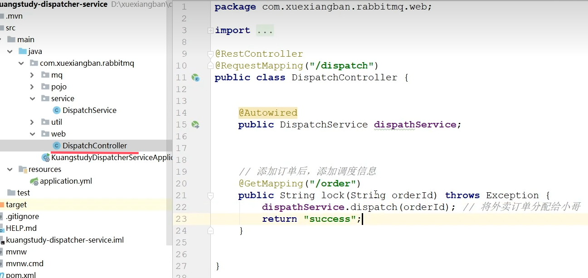

**yml配置文件**

订单系统和运单系统除了端口和数据库地址不一样，其余配置都i一样

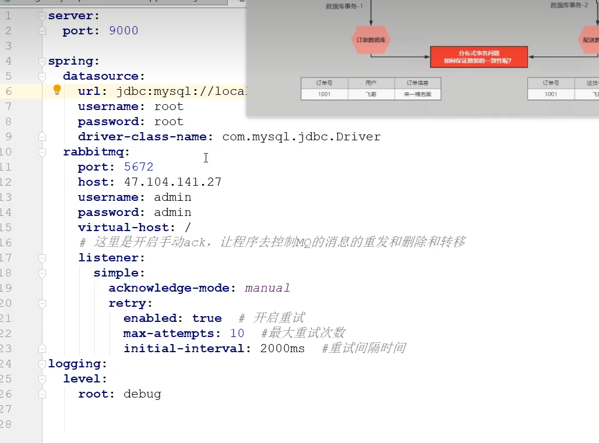

因为rabbitmq在以集群的方式运行，所以要将rabbitmq的配置修改为下图所示：

> 1. 注释掉
>    port : 5672
>
>    host: 47.104.141.27
>
> 2. 添加注释：
>    addresses ： 47.104.141.27:5672 , 47.104.141.27:5673

这样配置能够使Spring Boot在多个节点之间进行负载均衡和故障转移。

​	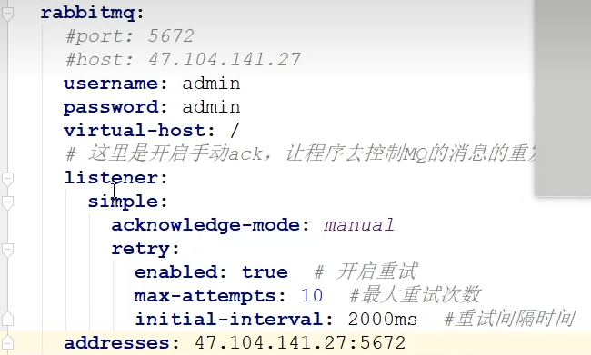

**测试用例代码:**

订单服务测试用例：

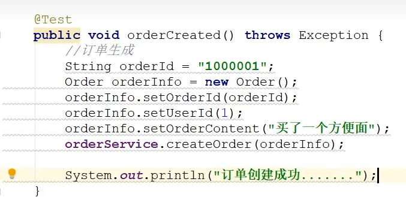

##### 运行过程和结果分析

订单服务的测试用例执行到**“订单系统”**这一步时，订单并没有被插入到数据库中，因为createOrder方法是一个事务，整个方法的每一步都是整体成功整体失败。只有当其它语句执行完且成功时，插入数据库这一步才会成功。

测试用例执行到**“运单系统的”**这一步时，订单系统数据库并没有插入信息，而运单系统数据库却插入了信息。
原因是运单系统中的方法不受订单系统中事务的控制。

现在在运单系统中模拟一个超时：

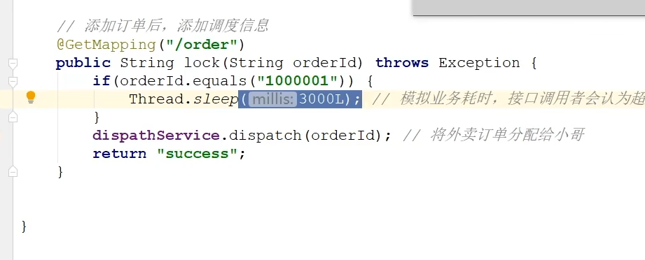

由于订单系统中处理事件最大为2秒，当运单系统设置的延迟为3秒，2秒后，订单系统因读超时而导致事务回滚，也就是订单系统数据库中没有数据。而运单系统不受订单系统的事务限制，3秒后继续执行，最终会向数据库中插入数据。
因此最终出现了数据不一致性问题：
运单系统数据库中有数据，订单系统数据库中没有数据。

#### 2-03、基于MQ的分布式事务整体设计思路

#### 2-04、基于MQ的分布式事务消息的可靠生产问题

如果这个时候MQ服务器出现了异常和故障，那么消息是无法获取到回执信息。怎么解决呢？r

###### 2-04-01、基于MQ的分布式事务消息的可靠生产问题-定时重发

#### 2-06、基于MQ的分布式事务消息的可靠消费

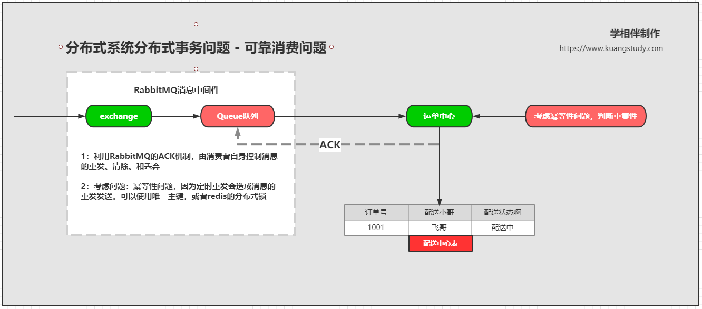

#### 2-07、基于MQ的分布式事务消息的消息重发

#### 2-08、基于MQ的分布式事务消息的死信队列消息转移 + 人工处理

如果死信队列报错就进行人工处理

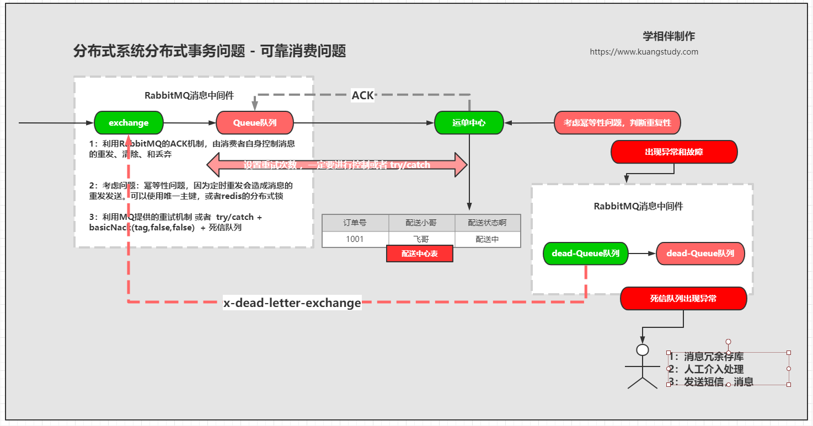

### 03、总结

#### 基于MQ的分布式事务解决方案优点：

1、通用性强
2、拓展方便
3、耦合度低，方案也比较成熟

#### 基于MQ的分布式事务解决方案缺点：

1、基于消息中间件，只适合异步场景
2、消息会延迟处理，需要业务上能够容忍

#### 建议

1、尽量去避免分布式事务
2、尽量将非核心业务做成异步

