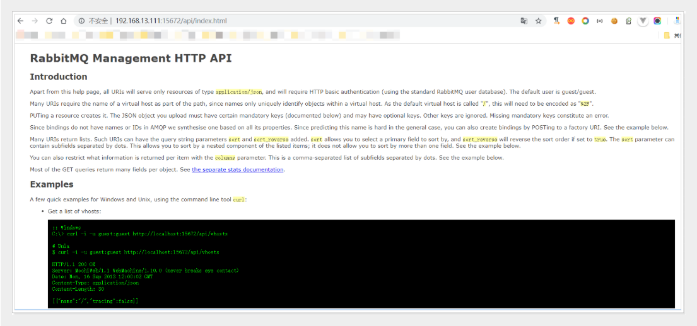

## RabbitMQ-集群监控

### 集群监控

在广大的互联网行业中RabbitMQ几乎都会有集群,那么对于集群的监控就成了企业生态中必不可少的一环。接下来我们来将讲解主要的4种监控。

### 1、管理界面监控

> 管理界面监控需要我们开启对应的插件(rabbitmq-plugins enable rabbitmq_management)
> 然后访问[http://ip:15672](http://ip:15672/)


> 在管理控制台我们就可以直观的看到集群中的每一个节点是否正常,如果为红色则表示节点挂掉了,同时可以很方便的查看到各个节点的内存、磁盘等相关的信息，使用起来也是非常方便的。但是遗憾的该功能做的比较简陋,没有告警等一些列的个性化设置,同时如果想把他接入到公司其他的监控系统统一管理也是很难做到的,所以扩展性不强，一般在小型企业的小集群中使用。

### 2、tracing日志监控

> 对于企业级的应用开发来讲,我们通常都会比较关注我们的消息,甚至很多的场景把消息的可靠性放在第一位,但是我们的MQ集群难免会出现消息异常丢失或者客户端无法发送消息等异常情况,此时为了帮助开发人员快速的定位问题,我们就可以对消息的投递和消费过程进行监控,而tracing日志监控插件帮我们很好的实现了该功能
> 消息中心的消息追踪需要使用Trace实现，Trace是Rabbitmq用于记录每一次发送的消息，方便使用Rabbitmq的开发者调试、排错。可通过插件形式提供可视化界面。Trace启动后会自动创建系统Exchange：amq.rabbitmq.trace ,每个队列会自动绑定该Exchange，绑定后发送到队列的消息都会记录到Trace日志。

#### 消息追踪启用与查看

以下是trace的相关命令和使用（要使用需要先rabbitmq启用插件，再打开开关才能使用）：

| 命令集                                        | 描述                                         |
| --------------------------------------------- | -------------------------------------------- |
| rabbitmq-plugins list                         | 查看插件列表                                 |
| rabbitmq-plugins enable rabbitmq_tracing      | rabbitmq启用trace插件                        |
| rabbitmqctl trace_on                          | 打开trace的开关                              |
| rabbitmqctl trace_on -p itcast                | 打开trace的开关(itcast为需要日志追踪的vhost) |
| rabbitmqctl trace_off                         | 关闭trace的开关                              |
| rabbitmq-plugins disable rabbitmq_tracing     | rabbitmq关闭Trace插件                        |
| rabbitmqctl set_user_tags heima administrator | 只有administrator的角色才能查看日志界面      |

安装插件并开启 trace_on 之后，会发现多个 exchange：amq.rabbitmq.trace ，类型为：topic。


### 2、日志追踪

1、发送消息

```java
rabbitTemplate.convertAndSend("spring_queue", "只发队列spring_queue的消息--01。");
```

2、查看trace


点击Tracing查看Trace log files

3、点击Tracing查看Trace log files
4、点击xuexiangban-trace.log确认消息轨迹正确性


### 3、定制自己的监控系统

> RabbitMQ提供了很丰富的restful风格的api接口,我们可以通过这些接口得到对应的集群数据,此时我们就可以定制我们的监控系统。

| **HTTP API URL**                      | **HTTP 请求类型** | **接口含义**                                                 |
| ------------------------------------- | ----------------- | ------------------------------------------------------------ |
| /api/connections                      | GET               | 获取当前RabbitMQ集群下所有打开的连接                         |
| /api/nodes                            | GET               | 获取当前RabbitMQ集群下所有节点实例的状态信息                 |
| /api/vhosts/{vhost}/connections       | GET               | 获取某一个虚拟机主机下的所有打开的connection连接             |
| /api/connections/{name}/channels      | GET               | 获取某一个连接下所有的管道信息                               |
| /api/vhosts/{vhost}/channels          | GET               | 获取某一个虚拟机主机下的管道信息                             |
| /api/consumers/{vhost}                | GET               | 获取某一个虚拟机主机下的所有消费者信息                       |
| /api/exchanges/{vhost}                | GET               | 获取某一个虚拟机主机下面的所有交换器信息                     |
| /api/queues/{vhost}                   | GET               | 获取某一个虚拟机主机下的所有队列信息                         |
| /api/users                            | GET               | 获取集群中所有的用户信息                                     |
| /api/users/{name}                     | GET/PUT/DELETE    | 获取/更新/删除指定用户信息                                   |
| /api/users/{user}/permissions         | GET               | 获取当前指定用户的所有权限信息                               |
| /api/permissions/{vhost}/{user}       | GET/PUT/DELETE    | 获取/更新/删除指定虚拟主机下特定用户的权限                   |
| /api/exchanges/{vhost}/{name}/publish | POST              | 在指定的虚拟机主机和交换器上发布一个消息                     |
| /api/queues/{vhost}/{name}/get        | POST              | 在指定虚拟机主机和队列名中获取消息，同时该动作会修改队列状态 |
| /api/healthchecks/node/{node}         | GET               | 获取指定节点的健康检查状态                                   |

> 更多API的相关信息和描述可以访问http://ip:15672/api/



> 接下来我们使用RabbitMQ Http API接口来获取集群监控数据

1. HttpClient以及Jackson的相关Jar

   ```xml
   <dependency>
       <groupId>org.apache.httpcomponents</groupId>
       <artifactId>httpclient</artifactId>
       <version>4.3.6</version>
   </dependency>
   <dependency>
    <groupId>com.fasterxml.jackson.core</groupId>
    <artifactId>jackson-databind</artifactId>
    <version>2.7.4</version>
   </dependency>
   <dependency>
    <groupId>com.fasterxml.jackson.core</groupId>
    <artifactId>jackson-annotations</artifactId>
    <version>2.7.4</version>
   </dependency>
   <dependency>
    <groupId>com.fasterxml.jackson.core</groupId>
    <artifactId>jackson-core</artifactId>
    <version>2.7.4</version>
   </dependency>
   ```

2. 创建MonitorRabbitMQ类实现具体的代码

   ```java
   package com.xuexiangban.rabbitmq;
   import com.fasterxml.jackson.databind.DeserializationFeature;
   import com.fasterxml.jackson.databind.JsonNode;
   import com.fasterxml.jackson.databind.ObjectMapper;
   import org.apache.http.HttpEntity;
   import org.apache.http.auth.UsernamePasswordCredentials;
   import org.apache.http.client.methods.CloseableHttpResponse;
   import org.apache.http.client.methods.HttpGet;
   import org.apache.http.impl.auth.BasicScheme;
   import org.apache.http.impl.client.CloseableHttpClient;
   import org.apache.http.impl.client.HttpClients;
   import org.apache.http.util.EntityUtils;
   import java.io.IOException;
   import java.util.HashMap;
   import java.util.Iterator;
   import java.util.Map;
   /**
    * RabbitMQ的监控
    */
   public class MonitorRabbitMQ {
       //RabbitMQ的HTTP API——获取集群各个实例的状态信息，ip替换为自己部署相应实例的
       private static String RABBIT_NODES_STATUS_REST_URL = "http://192.168.13.111:15672/api/nodes";
       //RabbitMQ的HTTP API——获取集群用户信息，ip替换为自己部署相应实例的
       private static String RABBIT_USERS_REST_URL = "http://192.168.13.111:15672/api/users";
       //rabbitmq的用户名
       private static String RABBIT_USER_NAME = "guest";
       //rabbitmq的密码
       private static String RABBIT_USER_PWD = "guest";
       public static void main(String[] args) {
           try {
               //step1.获取rabbitmq集群各个节点实例的状态信息
               Map<String, ClusterStatus> clusterMap =
                       fetchRabbtMQClusterStatus(RABBIT_NODES_STATUS_REST_URL, RABBIT_USER_NAME, RABBIT_USER_PWD);
               //step2.打印输出各个节点实例的状态信息
               for (Map.Entry entry : clusterMap.entrySet()) {
                   System.out.println(entry.getKey() + " : " + entry.getValue());
               }
               //step3.获取rabbitmq集群用户信息
               Map<String, User> userMap =
                       fetchRabbtMQUsers(RABBIT_USERS_REST_URL, RABBIT_USER_NAME, RABBIT_USER_PWD);
               //step4.打印输出rabbitmq集群用户信息
               for (Map.Entry entry : userMap.entrySet()) {
                   System.out.println(entry.getKey() + " : " + entry.getValue());
               }
           } catch (IOException e) {
               e.printStackTrace();
           }
       }
       public static Map<String, ClusterStatus> fetchRabbtMQClusterStatus(String url, String username, String password) throws IOException {
           Map<String, ClusterStatus> clusterStatusMap = new HashMap<String, ClusterStatus>();
           String nodeData = getData(url, username, password);
           JsonNode jsonNode = null;
           try {
               jsonNode = JsonUtil.toJsonNode(nodeData);
           } catch (IOException e) {
               e.printStackTrace();
           }
           Iterator<JsonNode> iterator = jsonNode.iterator();
           while (iterator.hasNext()) {
               JsonNode next = iterator.next();
               ClusterStatus status = new ClusterStatus();
               status.setDiskFree(next.get("disk_free").asLong());
               status.setFdUsed(next.get("fd_used").asLong());
               status.setMemoryUsed(next.get("mem_used").asLong());
               status.setProcUsed(next.get("proc_used").asLong());
               status.setSocketUsed(next.get("sockets_used").asLong());
               clusterStatusMap.put(next.get("name").asText(), status);
           }
           return clusterStatusMap;
       }
       public static Map<String, User> fetchRabbtMQUsers(String url, String username, String password) throws IOException {
           Map<String, User> userMap = new HashMap<String, User>();
           String nodeData = getData(url, username, password);
           JsonNode jsonNode = null;
           try {
               jsonNode = JsonUtil.toJsonNode(nodeData);
           } catch (IOException e) {
               e.printStackTrace();
           }
           Iterator<JsonNode> iterator = jsonNode.iterator();
           while (iterator.hasNext()) {
               JsonNode next = iterator.next();
               User user = new User();
               user.setName(next.get("name").asText());
               user.setTags(next.get("tags").asText());
               userMap.put(next.get("name").asText(), user);
           }
           return userMap;
       }
       public static String getData(String url, String username, String password) throws IOException {
           CloseableHttpClient httpClient = HttpClients.createDefault();
           UsernamePasswordCredentials creds = new UsernamePasswordCredentials(username, password);
           HttpGet httpGet = new HttpGet(url);
           httpGet.addHeader(BasicScheme.authenticate(creds, "UTF-8", false));
           httpGet.setHeader("Content-Type", "application/json");
           CloseableHttpResponse response = httpClient.execute(httpGet);
           try {
               if (response.getStatusLine().getStatusCode() != 200) {
                   System.out.println("call http api to get rabbitmq data return code: " + response.getStatusLine().getStatusCode() + ", url: " + url);
               }
               HttpEntity entity = response.getEntity();
               if (entity != null) {
                   return EntityUtils.toString(entity);
               }
           } finally {
               response.close();
           }
           return null;
       }
       public static class JsonUtil {
           private static ObjectMapper objectMapper = new ObjectMapper();
           static {
               objectMapper.disable(DeserializationFeature.FAIL_ON_UNKNOWN_PROPERTIES);
               //objectMapper.disable(SerializationFeature.FAIL_ON_EMPTY_BEANS);
           }
           public static JsonNode toJsonNode(String jsonString) throws IOException {
               return objectMapper.readTree(jsonString);
           }
       }
       public static class User {
           private String name;
           private String tags;
           @Override
           public String toString() {
               return "User{" +
                       "name=" + name +
                       ", tags=" + tags +
                       '}';
           }
           //GET/SET方法省略
           public String getName() {
               return name;
           }
           public void setName(String name) {
               this.name = name;
           }
           public String getTags() {
               return tags;
           }
           public void setTags(String tags) {
               this.tags = tags;
           }
       }
       public static class ClusterStatus {
           private long diskFree;
           private long diskLimit;
           private long fdUsed;
           private long fdTotal;
           private long socketUsed;
           private long socketTotal;
           private long memoryUsed;
           private long memoryLimit;
           private long procUsed;
           private long procTotal;
           // 此处省略了Getter和Setter方法
           public long getDiskFree() {
               return diskFree;
           }
           public void setDiskFree(long diskFree) {
               this.diskFree = diskFree;
           }
           public long getDiskLimit() {
               return diskLimit;
           }
           public void setDiskLimit(long diskLimit) {
               this.diskLimit = diskLimit;
           }
           public long getFdUsed() {
               return fdUsed;
           }
           public void setFdUsed(long fdUsed) {
               this.fdUsed = fdUsed;
           }
           public long getFdTotal() {
               return fdTotal;
           }
           public void setFdTotal(long fdTotal) {
               this.fdTotal = fdTotal;
           }
           public long getSocketUsed() {
               return socketUsed;
           }
           public void setSocketUsed(long socketUsed) {
               this.socketUsed = socketUsed;
           }
           public long getSocketTotal() {
               return socketTotal;
           }
           public void setSocketTotal(long socketTotal) {
               this.socketTotal = socketTotal;
           }
           public long getMemoryUsed() {
               return memoryUsed;
           }
           public void setMemoryUsed(long memoryUsed) {
               this.memoryUsed = memoryUsed;
           }
           public long getMemoryLimit() {
               return memoryLimit;
           }
           public void setMemoryLimit(long memoryLimit) {
               this.memoryLimit = memoryLimit;
           }
           public long getProcUsed() {
               return procUsed;
           }
           public void setProcUsed(long procUsed) {
               this.procUsed = procUsed;
           }
           public long getProcTotal() {
               return procTotal;
           }
           public void setProcTotal(long procTotal) {
               this.procTotal = procTotal;
           }
           @Override
           public String toString() {
               return "ClusterStatus{" +
                       "diskFree=" + diskFree +
                       ", diskLimit=" + diskLimit +
                       ", fdUsed=" + fdUsed +
                       ", fdTotal=" + fdTotal +
                       ", socketUsed=" + socketUsed +
                       ", socketTotal=" + socketTotal +
                       ", memoryUsed=" + memoryUsed +
                       ", memoryLimit=" + memoryLimit +
                       ", procUsed=" + procUsed +
                       ", procTotal=" + procTotal +
                       '}';
           }
       }
   }
   ```

3. 启动测试


### 4、Zabbix 监控RabbitMQ

> Zabbix是一个基于WEB界面提供分布式系统监视以及网络监视功能的企业级开源解决方案,他也可以帮助我们搭建一个MQ集群的监控系统,同时提供预警等功能，但是由于其搭建配置要求比较高一般都是由运维人员负责搭建,感兴趣的同学可以访问https://www.zabbix.com/ 官网进行了解学习。

