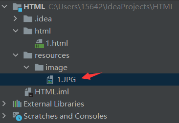
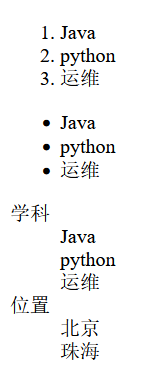
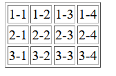
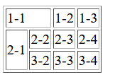
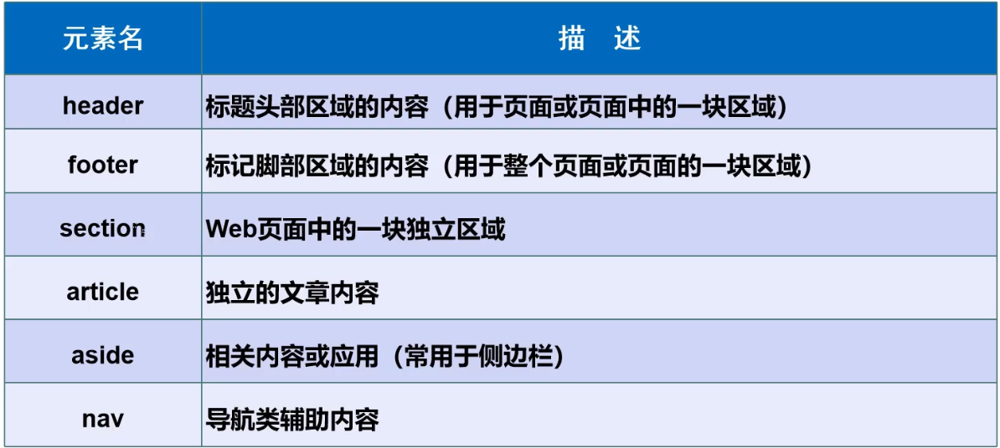
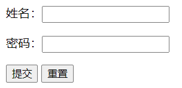
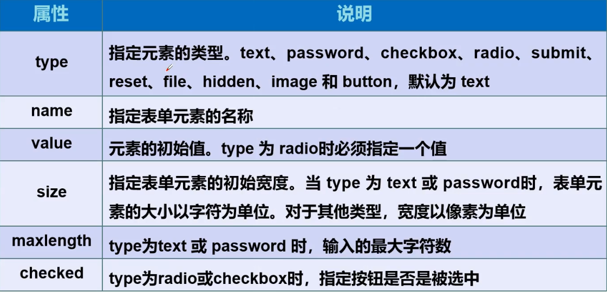
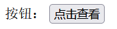
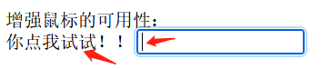

##  1. 初识HTMl

什么是HTML？

Hyper Text Markup Language : 超文本标记语言

- 超文本包括：文字、图片、音频、视频、动画等

目前使用的是HTML5，使用 W3C标准

W3C标准包括：

```
结构化标准语言（HTML、XML）
表现标准语言（CSS）
行为标准语言（DOM、ECMAScript）
```

常见IDE

```
记事本
Dreamweaver
IDEA
WebStorm
...
```

## 2. 网页基本元素

HTML基本结构

- 网页头部
- 主体部分

网页基本信息

- DOCTYPE声明：告诉浏览器，我们要使用什么规范

- `<title>`标签 ：网页标题

- `<meta>`标签：描述性标签，用来描述网站的一些信息

```html
<!DOCTYPE html>
<html lang="en">
<!--head标签代表网页头部-->
<head>
    <meta charset="UTF-8">
    <!--meta一般用来做SEO-->
    <meta name="keyboards" content="Java">
    <meta name="description" content="学习Java">
    <!--网页标题-->
    <title>Title</title>
</head>
<!--body标签代表网页主体-->
<body>
HelloWorld
</body>
</html>
```

## 3. 网页基本标签

标题标签

段落标签

换行标签

水平线标签

字体样式标签

注释和特殊符号

```html
<!DOCTYPE html>
<html lang="en">
<head>
    <meta charset="UTF-8">
    <title>基本标签</title>
</head>
<body>
<!--1、标题标签-->
<h1>一级标签</h1>
<h2>二级标签</h2>
<h6>六级标签</h6>

<!--2、段落标签-->
<p>
这是一整段这是一整段这是一整段这是一整段
    这是一整段这是一整段这是一整段
    这是一整段这是一整段
    这是一整段
    这是一整段
</p>
<p>第一段</p>
<p>第二段</p>
<p>第三段</p>

<!--3、换行标签-->
<!--br、hr是自闭合标签，习惯上最好加/结尾-->
第一行 <br/>
第二行
<!--4、水平线标签-->
<hr/>

<!--5、字体样式标签-->
粗体：<stronge>I LOVE YOU </stronge>
斜体：<em>I LOVE YOU </em>

<hr/>

<!--6、特殊符号-->
空 &nbsp;&nbsp;&nbsp;&nbsp;&nbsp;格：<br/>
大于号：&gt;      <br/>
小于号：&lt;     <br/>
版权符号：&copy;

<!--7、注释-->
</body>
</html>
```

## 4. 图像标签

常见图像格式：

- JPG
- GIF
- PNG
- BMP：位图
- …

语法：

```html
<body>

src：图像地址
alt：图像的替代文字（找不到该图片时，才会显示）
title：鼠标悬停提示文字
width:图像宽度
height:图像高度

</body>
```

练习：新建放置图片的目录


```html
<body>
<!--src:图片地址
        相对地址：../   1.html文件的上一级目录           
 (不推荐)绝对地址：C:\Users\15642\IdeaProjects\HTML\resources\image\1.JPG
-->


</body>
```

## 5. 链接标签

文本超链接：点击文本进行跳转

图像超链接：点击图片进行跳转

语法：

```html
<!--链接标签-->
<a href="path" target="目标窗口位置">链接文本或图像</a>
href：必填 ，表示要跳转到那个页面
target:表示窗口在哪里打开，默认是当前页面打开
       _blank：在新的标签页打开
       _self:在自己的网页中打开
```

练习：

```html
<body>

<!--文字超链接-->
<a href="http://www.baidu.com" target="_blank">点击我跳转到百度</a>

<br>

<!--图像超链接-->
<a href="http://www.baidu.com">
    
</a>

</body>
```

锚链接：

- 通过# 实现页面间的跳转
- 跳转到另一个页面指定的位置

练习：

```html
<body>

<!--
    锚链接
        1.需要一个标记
        2.然后跳转到标记
        3.使用 #
-->
<!--先设置一个标记-->
<a id="top">我是顶部</a>

<!--图片1-->
<p>
    <a href="http://www.baidu.com">
        
    </a>
</p>
<!--图片2-->
<p>
    <a href="http://www.baidu.com">
        
    </a>
</p>
<!--图片3-->
<p>
    <a href="http://www.baidu.com">
        
    </a>
</p>
<!--图片4-->
<p>
    <a href="http://www.baidu.com">
        
    </a>
</p>
<!--也可以跳转到另一个页面的指定位置 : href="2.html#top"-->
<a href="#top">跳转到顶部</a>

</body>
```

功能性链接

```html
<!--邮件链接：mailto-->
<a href="mailto:156420xxxx@qq.com">点击联系我！</a>
```

## 6. 行内元素和块元素

块元素

- 无论内容多少，该元素独占一行
- p标签、h1-h6…

行内元素

- 内容撑开宽度，左右都是行内元素的可以在排一行
- a 标签、strong 标签、em 标签…

## 7. 列表

列表的分类：

- 有序列表
- 无序列表
- 自定义列表

```html
<body>

<!--有序列表-->
<ol>
    <li>Java</li>
    <li>python</li>
    <li>运维</li>
</ol>
<!--无序列表-->
<ul>
    <li>Java</li>
    <li>python</li>
    <li>运维</li>
</ul>
<!--自定义列表
    dl：标签
    dt:列表名称
    dd：列表内容
-->
<dl>
    <dt>学科</dt>
        <dd>Java</dd>
        <dd>python</dd>
        <dd>运维</dd>
    <dt>位置</dt>
        <dd>北京</dd>
        <dd>珠海</dd>
</dl>

</body>
```

效果：


## 8. 表格

为什么使用表格？

- 简单通用
- 结构稳定

基本结构：

- 单元格
- 行 tr
- 列 td
- 跨行 rowspan
- 跨列 colspan

```html
<body>
<table border="1px"><!--加个边框-->
    <tr>
        <td>1-1</td>
        <td>1-2</td>
        <td>1-3</td>
        <td>1-4</td>
    </tr>

    <tr>
        <td>2-1</td>
        <td>2-2</td>
        <td>2-3</td>
        <td>2-4</td>
    </tr>

    <tr>
        <td>3-1</td>
        <td>3-2</td>
        <td>3-3</td>
        <td>3-4</td>
    </tr>

</table>

</body>
```

效果：


```html
<table border="1px"><!--加个边框-->
    <tr>
        <!--让这个单元格跨两列-->
        <td colspan="2">1-1</td>
        <td>1-2</td>
        <td>1-3</td>
    </tr>

    <tr>
        <!--让这个单元格跨两行-->
        <td rowspan="2">2-1</td>
        <td>2-2</td>
        <td>2-3</td>
        <td>2-4</td>
    </tr>

    <tr>
        <td>3-2</td>
        <td>3-3</td>
        <td>3-4</td>
    </tr>

</table>
```

效果：


## 9. 媒体元素

视频元素：video

音频元素：audio

```html
<!--媒体元素
视频：
    controls:滚动条
    autoplay：自动播放
-->
<video src="../resources/video/4.mp4" controls autoplay></video>

<audio src="../resources/audio/萤火虫和你.mp3" controls></audio>
```

## 10. 页面结构分析



```html
<body>
<header>
    <h2>网页头部</h2>
</header>

<section>
    <h2>网页主体部分</h2>
</section>

<footer>
    <h2>网页脚部</h2>
</footer>
</body>
```

## 11. iframe内联框架

语法：

```html
<iframe src="path" frameborder="0" name="mainFrame"></iframe>
        引用页面地址                 框架标示名
```


```html
<body>
<!--iframe内联框架-->
<iframe src="//player.bilibili.com/player.html?aid=68373450&bvid=BV12J41137hu&cid=118499718&page=1"
        scrolling="no"
        border="0"
        frameborder="no"
        framespacing="0"
        allowfullscreen="true">
</iframe>

<iframe src="https://www.bilibili.com/" frameborder="1px" name="mainFrame" width="400px" height="100px"></iframe>

<!--通过a标签往iframe里加东西-->
<iframe src="" frameborder="1px" name="hello" width="400px" height="300px"></iframe>
<!--通过target属性绑定指定的iframe-->
<a href="https://www.bilibili.com/" target="hello">点击我跳转到B站</a>

</body>
```

## 12. 初识表单post和get提交

表单语法：

```html
<!--初识表单post和get提交
    method:规定如何发送表单数据，常用值：：post、get
        get方式提交：可以在url中看到提交的信息
		post方式提交：比较安全，可以传输大文件
    action:表示向何处发送表单数据,可以是一个网站，或者一个请求处理地址
-->
<form method="get" action="2.基本标签.html">
    <!--文本输入框：text-->
    <p>姓名：<input type="text" name="username"></p>
    <!--密码框：password-->
    <p>密码：<input type="password" name="password"></p>

    <!--提交-->
    <input type="submit">
    <!--重置-->
    <input type="reset">
</form>
```

效果：



------

**表单元素格式**


## 13. 文本框和单选框

单选框：

```html
<!--单选框标签：
    input type="radio"
    value：单选框的值
    name：表示组，name相同为一个组，即只能选择一个
-->
<radio>
	<!--checked表示默认选中-->
    <input type="radio" value="boy" name="sex" checked/>男
    <input type="radio" value="girl" name="sex"/>女
</radio>
```

多选框：

```html
<!--多选框-->
<p> 爱好：
	<!--checked表示默认选中-->
    <input type="checkbox" value="sleep" name="hobby" checked>睡觉
    <input type="checkbox" value="book" name="hobby">看书
    <input type="checkbox" value="swimming" name="hobby">游泳
    <input type="checkbox" value="write" name="hobby">写作

</p>
```

## 14. 按钮和多选框

普通按钮：

```html
<!--按钮-->
<p> 按钮：
    <input type="button" name="btn1" value="点击查看">
</p>
```

效果：


------

图片按钮：

```html
<input type="image" name="bt2" src="../resources/image/1.jpg"><!--可以点击提交，相当于submit-->
```

下拉框：

```html
<p>国家：
    <select name="country">
        <option value="china">中国</option>
        <option value="us">美国</option>
        <!--selected表示默认选中-->
        <option value="ruishi" selected>瑞士</option>
    </select>
</p>
```

## 15. 文本域和文件域

文本域：

```html
<!--文本域-->
<p>反馈：
    <textarea name="textarea" cols="50" rows="10">文本内容</textarea>
</p>
```

文件域：

```html
<!--文件域-->
<input type="file" name="files">
```

## 16. 搜索框滑块和简单验证

```html
<!--邮件验证-->
<p> 邮箱：
    <input type="email" name="email">
</p>

<p> URL：
    <input type="url" name="url">
</p>

<p> number：
    <input type="number" name="number" max="100" min="0" step="10">
</p>

<!--滑块：-->
<p>音量：
    <input type="range" name="voice" min="0" max="10">
</p>

<!--搜索框-->
<p>搜索：
    <input type="search" name="search">
</p>
```

## 17. 表单的应用

- 隐藏域 hidden
- 只读 readonly
- 禁用 disabled

```html
<body>

    只读：
    <p>姓名：<input type="text" name="username" value="lisa" readonly></p>
    
    <p>禁用：
        <!--disabled可以放到任何地方，无法选择"男"-->
        <input type="radio" value="boy" name="sex" disabled/>男
        <input type="radio" value="girl" name="sex"/>女
    </p>
    
    <!--隐藏域：hidden，密码框不见了，但值依然在-->
    <p>密码：<input type="password" name="password" hidden value="123456"></p>

</body>
```

增强鼠标的可用性：

```html
<p>增强鼠标的可用性：<br>
    <label for="mark">你点我试试！！</label>
    <input type="text" id="mark">
</p>
```

点击文字，自动跳转到对应的输入框


## 18. 表单初级验证

思考：

- 减轻服务器的压力
- 安全性

常用方式：

- placeholder 提示信息
- required 元素不能为空，应用于所有的文本框中
- pattern 正则表达式

```html
<body>

    <p>姓名：
        <input type="text" name="username" placeholder="请输入用户名">
    </p>
    
    <p>姓名：
        <input type="text" name="username" placeholder="请输入用户名" required>
    </p>
    
    <p> 自定义邮箱：
        <input type="text" name="diyEmail" pattern="^\w+([-+.]\w+)*@\w+([-.]\w+)*\.\w+([-.]\w+)*$">
    </p>

</body>
```