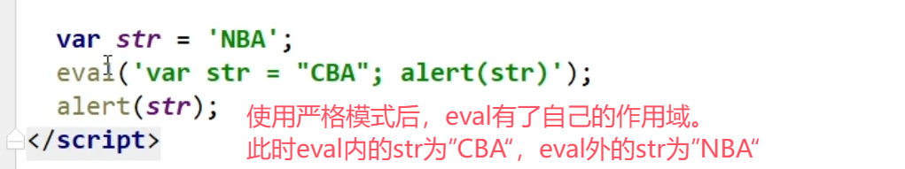
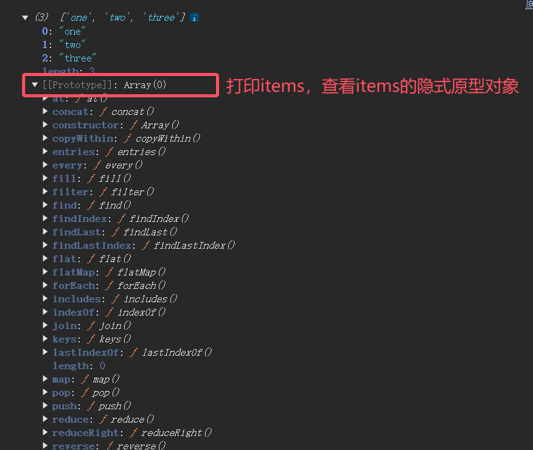

# ES5

> ES5部分笔记来自该视频的ES5部分：https://www.bilibili.com/video/BV14s411E7qf/?spm_id_from=333.999.0.0&vd_source=8db8b96215ac8720b334f74129448c4c

## 严格模式

1.理解:

- 除了正常运行模式(混杂模式)，ES5添加了第二种运行模式:"严格模式"(strict mode)
- 顾名思义，这种模式使得Javascript在更严格的语法条件下运行

2.目的/作用

- 消除Javascript语法的一些不合理、不严谨之处，减少一些怪异行为
- 消除代码运行的一些不安全之处，为代码的安全运行保驾护航
- 为未来新版本的Iavascript做好铺垫

3.使用

- 在全局或函数的第一条语句定义为:'usestrict';
- 如果浏览器不支持，只解析为一条简单的语句，没有任何副作用

4.语法和行为改变

- 必须用var声明变量
- 禁止自定义的函数中的this指向window 
- 创建eval作用域
- 对象不能有重名的属性

> - 必须用var声明变量
>
> 
>
> 
>
> 
>
> - 禁止自定义的函数中的this指向window 
>
> 
>
> 
>
> 
>
> - 创建eval作用域
>
> 在不使用严格模式时：
> 
>
> 使用严格模式后：
> 
>
> - 对象不能有重名的属性
>
> 

## JSON对象扩展

1.JSON.stringify( obj / arr )

- js对象(数组)转换为json对象(数组)

2.JSON.parse( json )

- json对象(数组)转换为js对象(数组)

> 使用示例：
>
> JSON.stringify()
>
> 
>
> JSON.parse
>
> 

## Object对象方法拓展

ES5给object扩展了一些静态方法，常用的2个:

1. **Object.create(prototype , [descriptors] )**

- 作用:以指定对象为原型创建新的对象
- 为新的对象指定新的属性，并对属性进行描述
  - value :指定值
  - writable :标识当前属性值是否是可修改的，默认为false
  - configurable:标识当前属性是否可以被删除，默认为false
  - enumerable:标识当前属性是否能用for in 枚举， 默认为false

> 补充：var result = Object.create(null)   这样写可以创建一个没有原型的对象，也就是说`result` 是一个完全空的对象，没有继承自 `Object.prototype`，没有默认的属性（如 `toString`、`hasOwnProperty` 等）。因为没有原型，因此更加轻量。

2. **Object.defineProperties(object,descriptors)**

- 作用:为指定对象定义扩展多个属性
  - get :用来获取当前属性值得回调函数
  - set : 修改当前属性值得触发的回调函数，并且实参即为修改后的值
- 存取器属性:setter,getter一个用来存值，一个用来取值

3. **对象本身的两个方法: get 和 set**

   - get propertyName(){} 用来得到当前属性值的回调函数

   - set propertyName(){} 用来监视当前属性值变化的回调函数

**Object.create(prototype , [descriptors] )使用示例**

```html
<script type="text/javascript">

    var obj = { username: 'dawu', age: 30 }
    var obj1 = Object.create(obj, {
        sex: {
            value: '男',
            writable: true,
            configurable: true,
            enumerable: true
        }
    })
    console.log(obj1.__proto__ === obj) //打印结果为true，说明obj1的__proto__就是obj

    console.log(obj1)
    obj1.sex = '女'  //因为设置了writable: true, 所以可以修改sex属性的值
    console.log(obj1.sex)
    // delete obj1.sex //因为设置了configurable: true, 所以可以删除sex属性
    // console.log(obj1) 
    for (var i in obj1) { //因为设置了enumerable: true, 所以可以遍历到sex属性 
        console.log(i)
    }
</script>
```

**Object.defineProperties(object,descriptors)使用示例**

```html
<script type="text/javascript">
    var obj2 = {
        firstName: 'kobe',
        lastName: 'bryant'
    }
    Object.defineProperties(obj2, {
        fullName: {
            get: function () { //获得扩展属性的值
                return this.firstName + this.lastName
            },
            set: function (data) {//监听扩展属性,当扩展属性发生变化时会自动调用,调用后会自动将变化的值作为实参注入到set函数
                var names = data.split(' ')
                this.firstName = names[0]
                this.lastName = names[1]
            }
        }
    })
    console.log(obj2.fullName) //调用了一次get方法
    obj2.fullName = 'tim duncan' //调用了一次set方法，并将'tim duncan'作为参数传递给set
    console.log(obj2.fullName) //调用了一次get方法
</script>

<!-- 对上述代码this的解释：因为set是一个方法（在对象内的函数就是方法），以方法的形式调用时，this就是调用方法的对象。
而set方法又被追加到了obj2对象身上，所以set方法的调用者时obj2，this指向的也是obj2 -->
```

对象本身的两个方法: get 和 set使用示例

```html
 <script type="text/javascript">
    var obj3 = {
        firstName: 'curry',
        lastName: 'stephen',
        get fullName() { //获得扩展属性的值
            return this.firstName + ' ' + this.lastName
        },
        set fullName(data) { //监听扩展属性，当扩展属性发生变化时会自动调用，自动调用后会自动将变化的值作为实参注入到set函数
            var names = data.split(' ')
            this.firstName = names[0]
            this.lastName = names[1]
        }
    }
    console.log(obj3.fullName) //调用了一次get方法
    obj3.fullName = 'kobe bryant' //调用了一次set方法，并将'tim duncan'作为参数传递给set
    console.log(obj3.fullName) //调用了一次get方法
</script>
```

## 数组的扩展

Array.prototype.indexOf(value) : 得到值在数组中的第一个下标
Array.prototype.lastIndexof(value) : 得到值在数组中的最后一个下标
Array.prototype.forEach(function(item，index)}) : 遍历数组
Array.prototype.map(function(item，index){}) : 遍历数组返回一个新的数组，返回加工之后的值返回条件为true的值
Array.prototype.filter(function(item,index){}}) : 遍历过滤出一个新的子数组，返回条件为true的值

> 上面的方法是给Array的实例用的。因为这些方法被加到了Array的显式原型身上，因此Array实例的隐式原型将自动拥有这些方法。

示例代码：

```html
<script type="text/javascript">
    var arr = [2, 4, 3, 1, 2, 6, 5, 4];
    console.log(arr.indexOf(4)); // 1
    console.log(arr.lastIndexOf(4)); // 7
    arr.forEach(function (item, index) { //正常输出每一项和每一项的下标
        console.log(item, index)
    })
    
    var arr1 = arr.map(function(item, index){ //arr.map返回一个新的数组，需要定义一个变量来接收
        return item + 10
    })
    console.log(arr1) //[12, 14, 13, 11, 12, 16, 15, 14]

    var arr2 = arr.filter(function(item, index){ //用一个变量接收
        return item > 3
    })
    console.log(arr2) //[4, 6, 5, 4]
</script>
```

## call、apply、bind用法详解

1. Function.prototype.bind( obj )：

* 作用：将函数内的this绑定为obj，并将函数返回

1. 面试题：区别 bind() 与 call() 和 apply() ?

* 都能指定函数中的this
* call() / apply() 是立即调用函数
* bind() 是将函数返回

代码示例：

**call 和 apply不传参：**

```html
<script type="text/javascript">
    var obj = {username:'kobe'}
    function foo (){
        console.log(this)
    }

    //不传入参数时，call和apply方法没有区别.都执行了foo函数，并且函数的this指向obj
    foo.call(obj)
    foo.apply(obj)
</script>
```

**call 和 apply 传参**

```html
<script type="text/javascript">
    var obj = {username:'kobe'}
    function foo (data){
        console.log(this)
    }

    //传入参数时，call和apply方法传入参数的形式不同
    foo.call(obj, 33) // 直接从第二个参数开始，依次传入
    foo.apply(obj, [33]) //第二个参数必须是数组，传入的数据放在数组里
</script>
```

**bind 不传参**

```html
<script type="text/javascript">
    var obj = {username:'kobe'}
    function foo (data){
        console.log(this)
    }

    //bind特点：绑定完this不会立即调用当前函数，而是将函数返回
    var bar = foo.bind(obj) //可以定义一个变量来接收bind返回的函数
    console.log(bar)

    foo.bind(obj)() //也可以直接调用bind返回的函数
</script>
```

**bind 传参**

```html
<script type="text/javascript">
    var obj = {username:'kobe'}
    function foo (data){
        console.log(this)
    }

    //bind特点：绑定完this不会立即调用当前函数，而是将函数返回
    //bind传参的方式和call一样
    foo.bind(obj, 33)() //直接调用bind返回的函数
</script>
```

**bind使用场景**

```html
<script type="text/javascript">
    //bind可以用在回调函数上。
    //因为回调函数需要回头再执行，不能立即执行，因此不能在回调函数上用apply或call
    //而bind不会执行函数，因此在回调函数上只能用bind
    setTimeout(function () {
        console.log(this)
    }.bind, 2000)
</script>
```

# ES6及之后

> ES6最好看阮一峰的教程，里边有很多细节是视频和笔记里没有的
> [ES6教程-阮一峰](https://es6.ruanyifeng.com/#README)

##  ECMAScript 6简介

ECMAScript 6.0（以下简称 ES6）是 JavaScript 语言的下一代标准，已经在 2015 年 6 月正式发布了。它的目标，是使得 JavaScript 语言可以用来编写复杂的大型应用程序，成为企业级开发语言。


## let和const命名

### let基本用法-块级作用域

在es6中可以使用let声明变量，用法类似于var

> ⚠️ let声明的变量，只在`let`命令所在的代码块内有效

```js
{
    let a = 10;
    var b = 20;
}
console.log(a); //a is not defined
console.log(b); //20
```

### 不存在变量提升

`var`命令会发生`变量提升`现象，即变量可以在声明之前使用，值为`undefined`。这种现象多多少少是有些奇怪的，按照一般的逻辑，变量应该在声明语句之后才可以使用。

为了纠正这种现象，let命令改变了语法行为，它所声明的变量一定在声明后使用，否则报错

```js
//var的情况
console.log(c);//输出undefined
var c = 30;


//let的情况
console.log(c);// 报错ReferenceError
let c = 30;
```

### 不允许重复声明

`let`不允许在相同作用域内，重复声明同一个变量

```js
let c = 10;
let c = 30;
console.log(c); //报错

function func(arg) {
  let arg; // 报错
}
```

### 不会影响作用域链

`let` 只影响变量的可访问范围（只在当前代码块中可访问），而不会添加、移除或修改作用域链。

举例解释：

```js
function test() {
    let x = 10;
    {
        let x = 20; // 块级作用域中重新声明了 x
        console.log(x); // 20 （当前块作用域中的变量）
    }
    console.log(x); // 10 （函数作用域中的变量）
}
test();

```

在块 `{ ... }` 内，`let x = 20` 的声明不会影响函数作用域的 `x`。
作用域链保持为：`块级作用域 → 函数作用域 → 全局作用域`。

### 暂时性死区

了解的一个名词，说的就是`let`和`const`命令声明变量的特征。

在代码块内，使用`let`命令声明变量之前，该变量都是不可用的。这在语法上，称为`暂时性死区`(temporal dead zone，简称 TDZ)

### 为什么需要块级作用域？

#### 原因一：内层变量可能会覆盖外层变量

```js
function foo(a){
    console.log(a);
    if(1===2){
        var a = 'hello 小马哥';
    }
}
var a = 10;
foo(a);
```

#### 原因二：用来计数的循环遍历泄露为全局变量

```js
var arr = []
for(var i = 0; i < 10; i++){
    arr[i] = function(){
        return i;
    }
}
console.log(arr[5]());
```

变量`i`只用来控制循环，但是循环结束后，它并没有消失，用于变量提升，泄露成了全局变量。

**解决循环计数问题**

```js
//解决方式一：使用闭包
var arr = []
for(var i = 0; i < 10; i++){
    arr[i] = (function(n){
        
        return function(){
            return n;
        }
    })(i)
}
//解决方式二：使用let声明i

var arr = []
for(let i = 0; i < 10; i++){
    arr[i] = function () {
        return i;
    }
}
```

### const基本用法-声明只读的常量

这意味着，`const`一旦声明变量，就必须立即初始化，不能留到以后赋值。对于`const`来说，只声明不赋值，就会报错。

```js
const a = 10;
a = 20;//报错

const b; //报错
```

### 与`let`命令相同点

- 块级作用域
- 暂时性死区
- 不可重复声明
- 不会影响作用域链

### `let`和`const`使用建议

> 在默认情况下用const,而只有你在知道变量值需要被修改的情况下使用let

## 模板字符串	

传统的 JavaScript 语言，输出模板通常是这样写的

```js
const oBox = document.querySelector('.box');
// 模板字符串
let id = 1,name = '小马哥';
let htmlTel = "<ul><li><p>id:" + id + "</p><p>name:" + name + "</p></li></ul>";
oBox.innerHTML = htmlTel;
```

上面的这种写法相当繁琐不方便,ES6引入了模板字符串解决这个问题

```js
let htmlTel = `<ul>
    <li>
    <p>id:${id}</p>
    <p>name:${name}</p>
    </li>
</ul>`;
```

## 解构赋值

解构赋值是对赋值运算符的一种扩展。它通常针对数组和对象进行操作。

> 优点：代码书写简洁且易读性高

### 数组解构

在以前，为变量赋值，只能直接指定值

```js
let a = 1;
let b = 2;
let c = 3;
```

ES6允许我们这样写:

```js
let [a,b,c] = [1,2,3];
```

> 如果解构不成功，变量的值就等于`undefined`

```js
let [foo] = [];
let [bar, foo] = [1];
foo`的值都会等于`undefined
```

### 对象解构

解构可以用于对象

```js
let node = {
    type:'identifier',
    name:'foo'
}

let {type,name} = node;
console.log(type,name)//identifier foo
```

对象的解构赋值时，可以对属性忽略和使用剩余运算符

```js
let obj = {
    a:{
        name:'张三'
    },
    b:[],
    c:'hello world'
}
//可忽略 忽略b,c属性
// let {a} = obj;
//剩余运算符 使用此法将其它属性展开到一个对象中存储
let {a,...res} = obj;
console.log(a,res);
```

**默认值**

```js
let {a,b = 10} = {a:20};
```

### 函数参数解构赋值

直接看例子

```js
function add([x, y]){
  return x + y;
}

add([1, 2]); // 3
```

使用默认值

```js
function addCart(n,num=0){
    return n+num;
}
addCart(10);//10
addCart(10,20); //30
```

### 用途

- 交换变量的值

  ```js
  let x = 1;
  let y = 2;
  let [x,y] = [y,x];
  ```

  上面代码交换变量`x`和`y`的值，这样的写法不仅简洁，而且易读，语义非常清晰。

- 从函数返回多个值

  函数只能返回一个值，如果要返回多个值，只能将它们放在数组或对象里返回。有了解构赋值，取出这些值就非常方便。

  ```js
  // 返回一个数组
  function example() {
    return [1, 2, 3];
  }
  let [a, b, c] = example();
  
  // 返回一个对象
  function example() {
    return {
      foo: 1,
      bar: 2
    };
  }
  let { foo, bar } = example();
  ```

- 函数参数的定义

  解构赋值可以方便地将一组参数与变量名对应起来。

  ```js
  // 参数是一组有次序的值
  function f([x, y, z]) { ... }
  f([1, 2, 3]);
  
  // 参数是一组无次序的值
  function f({x, y, z}) { ... }
  f({z: 3, y: 2, x: 1});
  ```

- 提取JSON数据

  解构赋值对提取 JSON 对象中的数据，尤其有用

  ```js
  let jsonData = {
    id: 42,
    status: "OK",
    data: [867, 5309]
  };
  
  //data: number 的意思是“将 jsonData 对象中的 data 属性的值赋给新的变量 number”。
  let { id, status, data: number } = jsonData;
  //对象的解构赋值的内部机制，是先找到同名属性，然后再	赋给对应的变量。真正被赋值的是后者，而不是前者
  console.log(id, status, number);
  // 42, "OK", [867, 5309]
  ```

- 函数参数的默认值

- 输入模块的指定方法

  加载模块时，往往需要指定输入哪些方法。解构赋值使得输入语句非常清晰。

  ```js
  const {ajax} = require('xxx')
  ajax()
  ```

## 函数的扩展

### 带参数默认值的函数

ES6之前，不能直接为函数的参数指定默认值，只能采用变通的方法

```js
function log(x,y){
    y = y || 'world';
    console.log(x,y);
}
log('hello');//hello world
log('hello','china') //hello china
log('hello','')//hello world
```

ES6 允许为函数的参数设置默认值，即直接写在参数定义的后面。

```js
function log(x, y = 'World') {
  console.log(x, y);
}

log('Hello') // Hello World
log('Hello', 'China') // Hello China
log('Hello', '') // Hello
```

> ES6 的写法还有两个好处：首先，阅读代码的人，可以立刻意识到哪些参数是可以省略的，不用查看函数体或文档；其次，有利于将来的代码优化，即使未来的版本在对外接口中，彻底拿掉这个参数，也不会导致以前的代码无法运行。

**默认的表达式可以是一个函数**

```js
function getVal(val) {
    return val + 5;
}
function add2(a, b = getVal(5)) {
    return a + b;
}
console.log(add2(10));
```

**小练习**

请问下面两种写法有什么区别？

```js
// 写法一
function m1({x = 0, y = 0} = {}) {
  return [x, y];
}

// 写法二
function m2({x, y} = { x: 0, y: 0 }) {
  return [x, y];
}
```

上面两种写法都对函数的参数设定了默认值，区别是写法一函数参数的默认值是空对象，但是设置了对象解构赋值的默认值；写法二函数参数的默认值是一个有具体属性的对象，但是没有设置对象解构赋值的默认值。

```js
// 函数没有参数的情况
m1() // [0, 0]
m2() // [0, 0]

// x 和 y 都有值的情况
m1({x: 3, y: 8}) // [3, 8]
m2({x: 3, y: 8}) // [3, 8]

// x 有值，y 无值的情况
m1({x: 3}) // [3, 0]
m2({x: 3}) // [3, undefined]

// x 和 y 都无值的情况
m1({}) // [0, 0];
m2({}) // [undefined, undefined]

m1({z: 3}) // [0, 0]
m2({z: 3}) // [undefined, undefined]
```

### rest参数

ES6 引入 rest 参数（形式为`...变量名`），用于获取函数的多余参数，这样就不需要使用`arguments`对象了。rest 参数搭配的变量是一个数组，该变量将多余的参数放入数组中。

```js
function add(...values) {
 
  let sum = 0;

  for (var val of values) {
    sum += val;
  }

  return sum;
}

add(2, 5, 3) // 10
```

上面代码的`add`函数是一个求和函数，利用 rest 参数，可以向该函数传入任意数目的参数。

### 箭头函数 

ES6允许使用箭头`=>`定义函数

```js
let f = v=>v;
//等同于
let f = function(v){
    return v;
}

// 有一个参数
let add = value => value;

// 有两个参数
let add = (value,value2) => value + value2;

let add = (value1,value2)=>{
    
    return value1 + value2;
} 
// 无参数
let fn = () => "hello world";

let doThing = () => {

}
//如果箭头函数直接返回一个对象，必须在对象外面加上括号，否则会报错。
let getId = id => ({id: id,name: 'mjj'}) //注意
let obj = getId(1);
```

### 箭头函数的作用

- 使表达更加简洁

  ```js
  const isEven = n => n % 2 == 0;
  const square = n => n * n;
  ```

- 简化回调函数

  ```js
  // 正常函数写法
  [1,2,3].map(function (x) {
    return x * x;
  });
  
  // 箭头函数写法
  [1,2,3].map(x => x * x);
  ```

### 使用注意点

- 没有this绑定

  > 箭头函数没有作用域链。因此箭头函数内部的this需要查找箭头函数外部的作用域

  ```js
  let PageHandler = {
      id:123,
      init:function(){
          //出现问题：this指向的是document对象，而document对象中不存在doSomething方法 
          document.addEventListener('click',function(event) {
              this.doSomeThings(event.type);
          },false);
      },
      doSomeThings:function(type){
          console.log(`事件类型:${type},当前id:${this.id}`);
      }
  }
  PageHandler.init();
  
  //解决this指向问题
  let PageHandler = {
      id: 123,
      init: function () {
          // ES5解决方法：使用bind来改变内部函数this的指向
          document.addEventListener('click', function (event) {
              this.doSomeThings(event.type);
          }.bind(this), false);
      },
      doSomeThings: function (type) {
          console.log(`事件类型:${type},当前id:${this.id}`);
      }
  }
  PageHandler.init();
  
  let PageHandler = {
      id: 123,
      init: function () {
          // ES6解决方法：使用箭头函数
          // 箭头函数没有this的指向，箭头函数内部的this值只能通过查找作用域链来确定
          // 如果箭头函数被一个非箭头函数所包括，那么this的值与该函数的所属对象相等，否则 则是全局的window对象
          document.addEventListener('click', (event) => {
              console.log(this);
              this.doSomeThings(event.type);
          }, false);
      },
      doSomeThings: function (type) {
          console.log(`事件类型:${type},当前id:${this.id}`);
      }
  }
  PageHandler.init();
  ```

- 箭头函数中没有arguments对象

  ```js
  var getVal = (a,b) => {
      console.log(arguments);
      return a + b;
  }
  console.log(getVal(1,2)); //arguments is not defined
  ```

- 箭头函数不能使用new关键字来实例化对象

  > function函数是一个对象，但箭头函数不是一个对象，箭头函数就是一个语法糖/表达式

  ```js
  let Person = ()=>{}
  let p1 = new Person();// Person is not a constructor
  ```

## 数组的扩展

`Array.from()`方法用于将伪数组转为真正的数组

```javascript
// Array.from()方法用于将伪数组转为真正的数组
function add() {
    // ES5 的写法，不宜阅读
    var arr1 = [].slice.call(argumets); // [1, 2, 3]
    console.log(arr1);
    // ES6 的写法
    let arr2 = Array.from(argumets); // [1, 2, 3]
    console.log(arr2);
}
add(1, 2, 3);


// 方法二：使用扩展运算符, 将伪数组转为真正的数组
// querySelectorAll()方法返回的是一个类似数组的对象
let lis = document.querySelectorAll('li');   
console.log([...lis]);

// Array.from()方法还可以接受第二个参数，对每个元素进行处理
let lis = document.querySelectorAll('li'); 
let names2 = Array.from(lis, s => s.textContent);
console.log(names2);
```

`Array.of()`方法用于将一组值，转换为数组

```javascript
// Array.of()方法用于将一组值，转换为数组
console.log(Array.of(3, 11, 20, [1, 2, 3], {id: 1})); //(5) [3, 11, 20, Array(3), {…}]
```

copyWithin(target, start = 0, end = this.length);  在当前数组内部，将指定位置的成员复制到其他位置（会覆盖原有成员），然后返回当前数组

- target（必需）：从该位置开始替换数据。如果为负值，表示倒数。
- start（可选）：从该位置开始读取数据，默认为 0。如果为负值，表示从末尾开始计算。
- end（可选）：到该位置前停止读取数据，默认等于数组长度。如果为负值，表示从末尾开始计算。

这三个参数都应该是数值，如果不是，会自动转为数值。

```javascript
// 表示将从 3 号位直到数组结束的成员（8,9,10），复制到从 0 号位开始的位置，结果覆盖了原来的 1, 2, 3。
[1, 2, 3, 8, 9, 10].copyWithin(0, 3);     // [8, 9, 10, 8, 9, 10];
```

find() 方法：找出第一个符合条件的数组成员，它的参数是一个回调函数。

findIndex() 方法：找出第一个符合条件的数组成员的索引

```javascript
let num = [1, 4, -5, 10, -4].find((n) => n < 0);    
console.log(num);            // -5

let numIdex = [1, 4, -5, 10, -4].findIndex((n) => n < 0);    
console.log(numIdex);        // 2
```

ES6 提供三个新的方法——`entries()`，`keys()`和`values()`——用于遍历数组。它们都返回一个遍历器对象，可以用`for...of`循环进行遍历，唯一的区别是

`keys()`是对键名的遍历、`values()`是对键值的遍历，`entries()`是对键值对的遍历

```javascript
for (let index of ['a', 'b'].keys()) {
  console.log(index);
}
// 0
// 1

for (let elem of ['a', 'b'].values()) {
  console.log(elem);
}
// 'a'
// 'b'

for (let [index, elem] of ['a', 'b'].entries()) {
  console.log(index, elem);
}
// 0 "a"
// 1 "b"

// 如果不使用for...of循环，可以手动调用遍历器对象的next方法，进行遍历
let letter = ['a', 'b', 'c'];
let entries = letter.entries();
console.log(entries.next().value); // [0, 'a']
console.log(entries.next().value); // [1, 'b']
console.log(entries.next().value); // [2, 'c']
```

includes() 返回一个布尔值，表示某个数组是否包含给定的值

注意：以前的 `indexOf`方法有两个缺点，一是不够语义化，它的含义是找到参数值的第一个出现位置，返回值是数组下标或-1，所以要去比较是否不等于`-1`，表达起来不够直观

```javascript
console.log([1, 2, 3].includes(2));     // true
console.log([1, 2, 3].includes(4));     // false
```


## 对象的扩展

### 属性的简洁表示法

```js
const name = '张三';
const age = 19;
const person = {
    name, //等同于name:name
    age, //等同于age:age
    // 方法也可以简写
    sayName() { //等同于 sayName: function(){...}
        console.log(this.name);
    }
}
person.sayName();
```

这种写法用于函数的返回值，将会非常方便。

```js
function getPoint() {
  const x = 1;
  const y = 10;
  return {x, y};  //等价于过去的 return {x:x, y:y}
}

getPoint()
// {x:1, y:10}
```

### 对象扩展运算符

```js
const [a, ...b] = [1, 2, 3];
a // 1
b // [2, 3]
```

#### 解构赋值

对象的解构赋值用于从一个对象取值，相当于将目标对象自身的所有可遍历的（enumerable）、但尚未被读取的属性，分配到指定的对象上面。所有的键和它们的值，都会拷贝到新对象上面。

```js
let { x, y, ...z } = { x: 1, y: 2, a: 3, b: 4 };
x // 1
y // 2
z // { a: 3, b: 4 }
```

> 解构赋值必须是最后一个参数，否则会报错
>
> ```js
> let { ...x, y, z } = obj; // 句法错误
> let { x, ...y, ...z } = obj; // 句法错误
> ```

### 扩展运算符

对象的扩展运算符（`...`）用于取出参数对象的所有可遍历属性，拷贝到当前对象之中。

```js
let z = { a: 3, b: 4 };
let n = { ...z };
n // { a: 3, b: 4 }
```

扩展运算符可以用于合并两个对象。

```js
let ab = { ...a, ...b };
// 等同于
let ab = Object.assign({}, a, b);
```

### 对象的方法

 **===  和 Object.is()**

```js
//Object.is()用于解决===的一些缺陷
console.log(NaN === NaN) // false
console.log(Object.is(NaN, NaN)) // true

console.log(+0, -0) //true
console.log(Object.is(+0, -0)) // false
//这两个结果中，Object.is()和 === 的结果都相反，是因为Object.is()方法解决了===的缺陷
```

**assign()**  常用

```js
//assign用于对象的合并（浅拷贝）
//Object.assign(target, obj1, obj2...) 将obj1, obj2...合并到target对象中，并返回合并后的新对象
let newObj = Object.assign({}, {a:1}, {b:2})
console.log(newObj) //{a:1, b:2}
```

## Sympol类型

- 它表示的是独一无二的值
- 最大的用途：用来定义对象的私有变量
- 如果用 Symbol 定义的是对象中的变量，取值时一定要用 [变量名] 
- 如果用 Symbol 定义的是对象中的变量，该变量不能作为key，无法用 for 循环遍历

注意： 这个数据类型实际开发中用的不多

```js
const name = Symbol('name');
const name2 = Symbol('name');
console.log(name === name2);          // false

// 用来定义对象的私有变量
let s1 = Symbol('s1'); 
console.log(s1);  // Symbol(s1)
let obj = {};
obj[s1] = '牛肉粉';       // 等价于 obj = {  [s1]: '牛肉粉'   }    
//如果用 Symbol 定义的是对象中的变量，取值时一定要用 [变量名] 
console.log(obj[s1]);
console.log(obj.s1);     // 会报错
// 如果用 Symbol 定义的是对象中的变量，该变量不能作为key，无法用 for 循环遍历
for(let key in obj){
    console.log(key);    // 没有输出
} 
console.log(Object.keys(obj));    // 输出一个空数组 []

//获取Sympol声明的属性
//Object.getOwnPropertySymbols
let s = Object.getOwnPropertySymbols(obj) //[Sympol(s1)]
//Reflect.ownKeys
let m = Reflect.ownKeys(obj)  //[Sympol(s1)]
```

## Map和Set方法

> Set 集合：表示无重复值的有序列表

```javascript
let set = new Set();
// 添加元素 add()
set.add(2);
set.add('4');
set.add('4');         // 这个4会被忽略，因为集合表示无重回复值的有序列表
console.log(set);     // set(2) {2, "4"}
// 也可以添加数组
set.add([1, 2, 3]);  
	

// 删除元素 delete()
set.delete(2);
console.log(set); // Set(2) {'4', Array(3)}
 
// 校验某个值是否在 set 中  has()
console.log(set.has('4'));    // 返回 true

// 访问集合的长度
console.log(set.size); // 2

// set 转换成 数组
let set2 = new Set([1, 2, 3, 4]);
console.log(set2) // Set(4) {1, 2, 3, 4}
// 使用扩展运算符
let arr = [...set2];
console.log(arr); // (4) [1, 2, 3, 4]
```

> Map：键值对的有序列表，键和值是任意类型

```javascript
let map = new Map();
// set() 设置值
map.set('name', '张三');
map.set('age', '20');
console.log(map);           // 输出 { 'name' => '张三', 'age' => '20'}
// 键和值可以是任意类型
map.set(['a', [1, 2, 3]], 'hello');

// get() 获取值
console.log(map.get('name'));     //张三

// has()  校验某个值是否在 map 中
console.log(map.has('name'));     //true

// delete()  删除值
map.delete('name');

// clear()  清除所有值
map.clear();
```

## Iterator （遍历器）

- 遍历器（Iterator）它是一种接口，为各种不同的数据结构提供统一的访问机制。任何数据结构只要部署 Iterator 接口，就可以完成遍历操作（即依次处理该数据结构的所有成员），快捷的访问数据。
- Iterator 的作用有三个：
  一是为各种数据结构，提供一个统一的、简便的访问接口；
  二是使得数据结构的成员能够按某种次序排列；
  三是 ES6 创造了一种新的遍历命令`for...of`循环，Iterator 接口主要供`for...of`消费。
- Iterator 的遍历过程是这样的。
  1. 创建一个指针对象，指向当前数据结构的起始位置。也就是说，遍历器对象本质上，就是一个指针对象。
  2. 第一次调用指针对象的`next`方法，可以将指针指向数据结构的第一个成员。
  3. 第二次调用指针对象的`next`方法，指针就指向数据结构的第二个成员。
  4. 不断调用指针对象的`next`方法，直到它指向数据结构的结束位置。
  5. 每一次调用`next`方法，都会返回数据结构的当前成员的信息。具体来说，就是返回一个包含`value`和`done`两个属性的对象。其中，`value`属性是当前成员的值，`done`属性是一个布尔值，表示遍历是否结束。

- 原生具备 Iterator 接口的数据结构如下。
  1. Array
  2. Map
  3. Set
  4. String
  5. TypedArray
  6. 函数的 arguments 对象
  7. NodeList 对象 

```js
let items = ['one', 'two', 'three'];
console.log(items);
//创建一个遍历器
//Sympol.iterator是对象中的Sympol类型，索引要用obj.[Sympol.iterator]的方式调用
let ite = items[Symbol.iterator]();
console.log(ite.next()) // { value: 'one', done: false }
console.log(ite.next()) // { value: 'two', done: false }
console.log(ite.next()) // { value: 'three', done: false }
console.log(ite.next()) // { value: undefined, done: true }
```



继续往下翻


## Generator函数（生成器）

### Generator函数基本语法

- 上一章说过，`Symbol.iterator`方法，等于该对象的遍历器生成函数，调用该函数会返回一个遍历器对象。
  而 Generator 函数也是遍历器生成函数，可以把 Generator 函数赋值给对象的`Symbol.iterator`属性，从而使得该对象具有 Iterator 接口，给不具备 Iterator 接口的数据结构（不自带`Symbol.iterator`方法）提供遍历操作。
- 形式上，Generator 函数是一个普通函数，但是有两个特征（区别）：
  一是，`function`关键字与函数名之间有一个星号 * ；
  二是，函数体内部使用`yield`表达式
- Generator 函数是分段执行的，只有调用`next`方法才会遍历下一个内部状态。`yield`是暂停执行标志，next()是恢复执行。
  当 next() 传入参数时，该参数就会被当作上一个 yield 表达式的返回值

```js
// 生成器函数:function关键字与函数名之间有一个星号 * ；函数体内部使用yield表达式
function* add() {
    console.log('start');
    // 这里的 x 不是 yield '2' 的返回值，它是下一个 next（）调用恢复执行时传入的参数值
    let x = yield '2';                 // yield 暂停执行标志
    console.log('one:' + x);
    let y = yield '3';                 // yield 暂停执行标志
    console.log('two:' + y);
    return x + y;
}
// 此处执行add方法只会返回一个遍历器对象，不会执行add函数内部的任何语句（不会执行console.log）
let fn = add()
// next() 恢复执行标志
console.log(fn.next());      // start      {value: '2', done: false}
// 当 next() 传入参数时，该参数就会被当作上一个 yield 表达式的返回值 ，即 x = 20, y = 30
console.log(fn.next(20));    // one:20     {value: '3', done: false}
console.log(fn.next(30));    // two:30     {value: '50', done: true}
```

### Generator函数使用场景

- 使用场景：为不具备 Iterator 接口的对象提供了遍历操作
- 原生的 JavaScript 对象没有遍历接口（不具备 `Symbol.iterator`方法），无法使用`for...of`循环。
  通过 Generator 函数为它加上这个接口，即将 Generator 函数加到对象的`Symbol.iterator`属性上面，就可以用了。

```js
//  Generator 生成器函数
function* objectEntries(obj){
    // 获取对象的所有 key 保存到数组 [name, age]
    const propKeys = Object.keys(obj);
    for(const propkey of propKeys){
        yield [propkey, obj[propkey]]
    }
}
const obj = {
    name: '牛肉粉',
    age: 18
}
// 把 Generator 生成器函数赋值给对象的Symbol.iterator属性, 为该对象加上遍历器接口
obj[Symbol.iterator] = objectEntries;
console.log(obj);
// objectEntries(obj) 等价于 obj[Symbol.iterator](obj) 
for(let [key, value] of objectEntries(obj)){ 
    console.log(`${key}: $value`);
}
```

### Generator函数的异步应用

- Generator 函数在ajax请求的异步应用，让异步代码同步化

```html
<!DOCTYPE html>
<html>

<head>
    <meta charset="UTF-8" />
    <title></title>
    <script src="https://cdn.bootcdn.net/ajax/libs/jquery/3.7.1/jquery.js"></script>
</head>

<body>  
    <script type="text/javascript">
        function* main() {
            let res = yield request('http://localhost:8121/api/user/get/login');
            console.log(res);
            console.log('数据加载完成,可以继续操作');
        }
        const ite = main();
        ite.next();

        function request(url) {
            $.ajax({
                url,
                method: 'get',
                success(res) {
                    ite.next(res);
                }
            })
        }
    </script>
</body>
</html>
```


-  Generator 函数在加载页面的异步应用

```javascript
// 1.加载 Loading...页面
// 2.数据加载完成...（异步操作）
// 3.Loading 关闭掉

function loadUI(){
    console.log('加载 Loading...页面');
}

function showData(){
    // 模拟数据加载异步操作
    setTimeout(() => {
        console.log('数据加载完成');
    },1000);
}

function hideUI(){
    console.log('隐藏 Loading...页面');
}

loadUI();
showData();
hideUI();
```


分析上图：我们的实际需求是加载数据完成后才关闭页面，但由于三个函数函数是同步执行的，数据加载需要时间，在数据未加载完成时，就已经隐藏loading页面。通过 Generator 函数可以解决这个问题

```javascript
function* load() {
    loadUI();
    yield showData();     
    hideUI();
}

const itLoad = load();
itLoad.next();

function loadUI(){
    console.log('加载 Loading...页面');
}

function showData(){
    // 模拟数据加载异步操作
    setTimeout(() => {
        console.log('数据加载完成');
        // 当数据返回后才执行下一步操作
        itLoad.next();
    },1000);
}

function hideUI(){
    console.log('隐藏 Loading...页面');
}
```


## Promise 对象

异步编程模块在前端开发中，显得越来越重要。从最开始的XHR到封装后的Ajax都在试图解决异步编程过程中的问题。随着ES6新标准的到来，处理异步数据流又有了新的解决方案。在传统的ajax请求中，当异步请求之间的数据存在依赖关系的时候，就可能产生不优雅的多层回调，俗称”回调地域“(callback hell)，这却让人望而生畏，Promise的出现让我们告别回调地域，写出更优雅的异步代码。

回调地狱带来的负面作用有以下几点：

- 代码臃肿。
- 可读性差。
- 耦合度过高，可维护性差。
- 代码复用性差。
- 容易滋生 bug。
- 只能在回调里处理异常。

> 在实践过程中，却发现Promise并不完美，Async/Await是近年来JavaScript添加的最革命性的的特性之一，**Async/Await提供了一种使得异步代码看起来像同步代码的替代方法**。接下来我们介绍这两种处理异步编程的方案。

### 什么是Promise

> Promise 是异步编程的一种解决方案：
>
> 从语法上讲，Promise是一个对象，通过它可以获取异步操作的消息；
>
> 从本意上讲，它是承诺，承诺它过一段时间会给你一个结果。
>
> promise有三种**状态**：**pending(等待态)，fulfilled(成功态)，rejected(失败态)**；
>
> 状态一旦改变，就不会再变。
>
> 创造promise实例后，它会立即执行。

看段习以为常的代码：

```js
// Promise是一个构造函数，自己身上有all,reject,resolve,race等方法，原型上有then、catch、finally方法
let p = new Promise((resolve, reject) => {

    /* 	let res = {
            ok:1,
            data:{
                name:"张三"
            }
        } */
    let res = {
        ok: 0,
        error: new Error('有错')
    }
    // 做一些异步操作
    setTimeout(() => {
        if (res.ok === 1) {
            resolve(res.data);
        } else {
            reject(res.error.message)
        }

    }, 1000)
})

p.then((data) => {
    console.log(data);
    return data;
}, (error) => {
    console.log(error)
}) 
```

改造代码，使Promise能够使用外界传入的参数

```js
function timeOut(ms) {
    return new Promise((resolve, reject) => {
        /* 	let res = {
                ok:1,
                data:{
                    name:"张三"
                }
            } */
        let res = {
            ok: 0,
            error: new Error('有错')
        }
        // 做一些异步操作
        setTimeout(() => {
            if (res.ok === 1) {
                resolve(res.data);
            } else {
                reject(res.error.message)
            }
        }, ms)
    })
}

timeOut(2000).then((data) => {
    console.log(data);
    return data;
}, (error) => {
    console.log(error)
}) 
```


### Promise的状态和值

`Promise`对象存在以下三种状态

- Pending(进行中)
- Fulfilled(已成功)
- Rejected(已失败)

> 状态只能由 `Pending` 变为 `Fulfilled` 或由 `Pending` 变为 `Rejected` ，且状态改变之后不会在发生变化，会一直保持这个状态。

`Promise`的值是指状态改变时传递给回调函数的值

上面例子中的参数为resolve和reject，他们都是函数，用他们可以改变Promise的状态和传入的Promise的值

```js
resolve 和 reject
```

- `resolve` : 将Promise对象的状态从 `Pending(进行中)` 变为 `Fulfilled(已成功)`
- `reject` : 将Promise对象的状态从 `Pending(进行中)` 变为 `Rejected(已失败)`
- `resolve` 和 `reject` 都可以传入任意类型的值作为实参，表示 `Promise` 对象成功`（Fulfilled）`和失败`（Rejected）`的值

### then方法

then()第一个参数是resolve回调函数，第二个参数可选，是reject状态的回调函数

```js
p.then((data)=>{
	console.log(data);
    return data
},(error)=>{
	console.log(error)
}).then(data=>{
    console.log(data);
})
```

promise的then方法返回一个promise对象，所以可以继续链式调用

上述代码我们可以继续改造，因为上述代码不能传参

```js
function timeout(ms) {
    return new Promise((resolve, reject) => {
        setTimeout(() => {
            resolve('hello world')
        }, ms);
    })
}
timeout(1000).then((value) => {
    console.log(value);
})
```

### then方法的规则

- `then`方法下一次的输入需要上一次的输出
- 如果一个promise执行完后 返回的还是一个promise，会把这个promise 的执行结果，传递给下一次`then`中
- 如果`then`中返回的不是Promise对象而是一个普通值，则会将这个结果作为下次then的成功的结果
- 如果当前`then`中失败了 会走下一个`then`的失败
- 如果返回的是undefined 不管当前是成功还是失败 都会走下一次的成功
- catch是错误没有处理的情况下才会走
- `then`中不写方法则值会穿透，传入下一个`then`中

### Promise封装XHR对象

```js
const getJSON = function (url) {
    return new Promise((resolve, reject) => {
        const xhr = new XMLHttpRequest();
        xhr.open('GET', url);
        xhr.onreadystatechange = handler;
        xhr.responseType = 'json';
        xhr.setRequestHeader('Accept', 'application/json');
        xhr.send();
        function handler() {
            console.log(this.readyState);
            if (this.readyState !== 4) {
                return;
            }
            if (this.status === 200) {
                resolve(this.response);
            } else {
                reject(new Error(this.statusText));
            }
        }
    })
}
getJSON('https://free-api.heweather.net/s6/weather/now?location=beijing&key=4693ff5ea653469f8bb0c29638035976')
    .then((res) => {
        console.log(res);
    }, function (error) {
        console.error(error);

    })

//then方法的链式调用
getJSON('https://free-api.heweather.net/s6/weather/now?location=beijing&key=4693ff5ea653469f8bb0c29638035976')
    .then((res) => {
        return res.HeWeather6;
    }).then((HeWeather6) => {
        console.log(HeWeather6);
    })
```

### catch方法

```js
catch(err=>{}) 方法等价于 then(null,err=>{})
getJSON('https://free-api.heweather.net/s6/weather/now?location=beijing&key=4693ff5ea653469f8bb0c29638035976')
    .then((json) => {
    console.log(json);
}).then(null,err=>{
    console.log(err);   
})
//等价于
getJSON('https://free-api.heweather.net/s6/weather/now?location=beijing&key=4693ff5ea653469f8bb0c29638035976')
    .then((json) => {
    console.log(json);
}).catch(err=>{
    console.log(err);   
})
```

### resove()

`resolve()`方法将现有对象转换成Promise对象，该实例的状态为fulfilled

```js
let p = Promise.resolve('foo');
//等价于 new Promise(resolve=>resolve('foo'));
p.then((val)=>{
    console.log(val);
})
```

### reject()

`reject()`方法返回一个新的Promise实例，该实例的状态为rejected

```js
let p2 = Promise.reject(new Error('出错了'));
//等价于 let p2 = new Promise((resolve,reject)=>reject(new Error('出错了)));
p2.catch(err => {
    console.log(err);
})
```

### all()方法

all()方法提供了并行执行异步操作的能力，并且在所有异步操作执行完后才执行回调

试想一个页面聊天系统，我们需要从两个不同的URL分别获得用户的的个人信息和好友列表，这两个任务是可以并行执行的，用Promise.all实现如下

```js
let meInfoPro = new Promise( (resolve, reject)=> {
    setTimeout(resolve, 500, 'P1');//setTimeout函数可以接收两个以上的参数，从第三个参数开始，传递的参数会被作为回调函数的参数传递
});
let youInfoPro = new Promise( (resolve, reject)=> {
    setTimeout(resolve, 600, 'P2');
});
// 同时执行p1和p2，并在它们都完成后执行then:
Promise.all([meInfoPro, youInfoPro]).then( (results)=> {
    console.log(results); // 获得一个Array: ['P1', 'P2']
});
```

### race()方法

有些时候，多个异步任务是为了容错。比如，同时向两个URL读取用户的个人信息，只需要获得先返回的结果即可。这种情况下，用Promise.race()实现：

```js
let meInfoPro1 = new Promise( (resolve, reject)=> {
    setTimeout(resolve, 500, 'P1'); 
});
let meInfoPro2 = new Promise( (resolve, reject)=> {
    setTimeout(resolve, 600, 'P2');
});
Promise.race([meInfoPro1, meInfoPro2]).then((result)=> {
    console.log(result); // P1
});
```

> **Promise.all接受一个promise对象的数组，待全部完成之后，统一执行success**;
>
> **Promise.race接受一个包含多个promise对象的数组，只要有一个完成，就执行success**

举个更具体的例子，加深对race()方法的理解	

当我们请求某个图片资源，会导致时间过长，给用户反馈

用race给某个异步请求设置超时时间，并且在超时后执行相应的操作

```js
function requestImg(imgSrc) {
   return new Promise((resolve, reject) => {
        var img = new Image();
        img.onload = function () {
            resolve(img);
        }
        img.src = imgSrc;
    });
}
//延时函数，用于给请求计时
function timeout() {
    return new Promise((resolve, reject) => {
        setTimeout(() => {
            reject('图片请求超时');
        }, 5000);
    });
}
Promise.race([requestImg('images/2.png'), timeout()]).then((data) => {
    console.log(data);
}).catch((err) => {
    console.log(err);
}); 
```


## async 函数

异步操作是JavaScript编程的麻烦事，很多人认为async函数是异步编程的解决方案

### Async/await介绍

- async/await是写异步代码的新方式，优于回调函数和Promise。
- async/await是基于Promise实现的，它不能用于普通的回调函数。
- async/await与Promise一样，是非阻塞的。
- async/await使得异步代码看起来像同步代码，再也没有回调函数。但是改变不了JS单线程、异步的本质。(**异步代码同步化**)

### Async/await的使用规则

1. **凡是在前面添加了async的函数在执行后都会自动返回一个Promise对象**

  ```js
async function test() {
    
}

let result = test()
console.log(result)  //即便代码里test函数什么都没返回，我们依然打出了Promise对象
  ```

2. **await必须在async函数里使用，不能单独使用**

  ```js
async test() {
    let result = await Promise.resolve('success')
    console.log(result)
}
test()
  ```

3. **await后面需要跟Promise对象，不然就没有意义，而且await后面的Promise对象不必写then，因为await的作用之一就是获取后面Promise对象成功状态传递出来的参数。**

  ```js
function fn() {
    return new Promise((resolve, reject) => {
        setTimeout(() => {
            resolve('success')
        })
    })
}

async test() {
    let result = await fn() //因为fn会返回一个Promise对象
    console.log(result)    //这里会打出Promise成功后传递过来的'success'
}

test()
  ```

### Async/Await的用法

- 使用await，函数必须用async标识
- await后面跟的是一个Promise实例

```js
function loadImg(src) {
    const promise = new Promise(function (resolve, reject) {
        const img = document.createElement('img')
        img.onload = function () {
            resolve(img)
        }
        img.onerror = function () {
            reject('图片加载失败')
        }
        img.src = src
    })
    return promise
}
const src1 = 'https://hcdn1.luffycity.com/static/frontend/index/banner@2x_1574647618.8112254.png'
const src2 = 'https://hcdn2.luffycity.com/media/frontend/index/%E7%94%BB%E6%9D%BF.png'
const load = async function () {
    const result1 = await loadImg(src1)
    console.log(result1)
    const result2 = await loadImg(src2)
    console.log(result2)
}
load()
```

**当函数执行的时候，一旦遇到 await 就会先返回，等到触发的异步操作完成，再接着执行函数体内后面的语句。**

### async/await的错误处理

关于错误处理，如规则3所说，await可以直接获取到后面Promise成功状态传递的参数，但是却捕捉不到失败状态。在这里，我们通过给包裹await的async函数添加try/catch方法来解决，因为根据规则一，async函数本身就会返回一个Promise对象。

```js
const load = async function () {
    try{
        const result1 = await loadImg(src1)
        console.log(result1)
        const result2 = await loadImg(src2)
        console.log(result2)
    }catch(err){
        console.log(err);
    }
}
load()
```

### 为什么Async/Await更好？

Async/Await较Promise有诸多好处，以下介绍其中三种优势：

- **简洁**

  使用Async/Await明显节约了不少代码。我们不需要写.then，不需要写匿名函数处理Promise的resolve值，也不需要定义多余的data变量，还避免了嵌套代码。

- **中间值**

  在前端编程中，我们偶尔会遇到这样一个场景：我们需要发送多个请求，而**后面请求的发送总是需要依赖上一个请求返回的数据**。对于这个问题，我们既可以用的Promise的链式调用来解决，也可以用async/await来解决，然而后者会更简洁些

```js
const makeRequest = () => {
  return promise1()
    .then(value1 => {
      return promise2(value1)
        .then(value2 => {        
          return promise3(value1, value2)
        })
    })
}
```

​		使用async/await的话，代码会变得异常简单和直观

```js
const makeRequest = async () => {
  const value1 = await promise1()
  const value2 = await promise2(value1)
  return promise3(value1, value2)
}
```

- **提高可读性**

下面示例中，需要获取数据，然后根据返回数据决定是直接返回，还是继续获取更多的数据。

```js
const makeRequest = () => {
  return getJSON()
    .then(data => {
      if (data.needsAnotherRequest) {
        return makeAnotherRequest(data)
          .then(moreData => {
            console.log(moreData)
            return moreData
          })
      } else {
        console.log(data)
        return data
      }
    })
}
```

代码嵌套（6层）可读性较差，它们传达的意思只是需要将最终结果传递到最外层的Promise。使用async/await编写可以大大地提高可读性:

```js
const makeRequest = async () => {
  const data = await getJSON()
  if (data.needsAnotherRequest) {
    const moreData = await makeAnotherRequest(data);
    console.log(moreData)
    return moreData
  } else {
    console.log(data)
    return data    
  }
}
```

## Class的基本用法

### 简介&基本使用

JavaScript语言中，生成实例对象的传统方法是通过构造函数

```js
function Person(name,age) {
    this.name = name;
    this.age = age;
}
Person.prototype.sayName  = function() {
    return this.name;   //以函数的形式调用时，this永远都是window s
}
let p = new Person('小马哥',18);
console.log(p);
```

上面这种写法跟传统的面向对象语言（比如 C++ 和 Java）差异很大，很容易让新学习这门语言的程序员感到困惑

ES6 提供了更接近传统语言的写法，引入了 Class（类）这个概念，作为对象的模板。通过`class`关键字，可以定义类。

基本上，ES6 的`class`可以看作只是一个语法糖，它的绝大部分功能，ES5 都可以做到，新的`class`写法只是让对象原型的写法更加清晰、更像面向对象编程的语法而已。上面的代码用 ES6 的`class`改写，就是下面这样

```js
// es6
class Person {
    // 实例化的时候会立即被调用
    constructor(name, age){
        this.name = name;
        this.age = age;
    }
    //等同于Person.prototype = function sayName(){}
    sayName(){
        return this.name;
    }
    sayAge(){
        return this.age;
    }
}
// 小技巧：通过 Objec.assign() 方法(详见对象的扩展功能)一次性向类中添加多个方法
/*
Object.assign(Person.prototype, {
    sayName(){
        return this.name;
    }
    sayAge(){
        return this.age;
    }
})
*/

let p = new Person('MyName',18);
console.log(p);
p.sayName();
p.sayAge();
```

> 类的方法内部如果含有`this`，它默认指向类的实例

定义类时，除了使用constructor为类指定属性，还可以使用直接赋值的方式为类指定属性（相当于追加属性，值写死）。

```js
// es6
class Person {
    //类中可以直接写赋值语句，如下代码的含义是：给Person的实例对象添加属性：键为name和age，值为“Link”和“100”
//类的实例对象身上添加属性,虽然可以在没有构造函数的情况下为属性赋值，但是没有构造函数，将无法为实例对象初始化自定义属性值。
	name = "Link";
    age = "100";

    //原本在类中定义方法的方式，会将方法添加到类的原型对象上，供所有实例对象使用。（每个实例对象公用原型对象中的方法）
    //这种在类中定义方法的方式，会将方法定义到类的实例对象。每个实例对象都会有这两个方法。
    sayName = () => {
        return this.name;
    }

	sayAge = () => {
        return this.age;
    }
}

let p = new Person();
console.log(p);
p.sayName();
p.sayAge();
```

在类的自身添加属性：static

```js
// es6
class Person {
	name = "Link";
    static age = "100";  //通过static关键字添加的属性在类的自身，不在类的原型对象上
}

let p = new Person();
console.log(p.name);
console.log(Person.age); //可以通过类直接访问static属性

```


### 类的继承

```js
class Animal {
    // 实例化的时候会立即被调用
    constructor(name, age){
        this.name = name;
        this.age = age;
    }
    sayName(){
        return this.name;
    }
    sayAge(){
        return this.age;
    }
}

class Dog extends Animal{
    constructor(name, age, color){
        // 如果 子类 继承了 父类，且 子类 中写了构造器，则 子类 构造器的 super 必须要调用
        super(name, age);  // 等同于 Animal.call(this,name,age); 继承父类的属性
        this.color = color;
    }
    // 子类自己的方法
    sayColor(){
        return `${this.name}是${this.age}岁了，它的颜色是${this.color}`;
    }
    // 重写父类的方法
    sayName(){
        // super 等同于 Animal
        return this.name + super.sayAge + this.color;
    }
}

let d1 = new Dog('小黄', 28, 'red');
console.log(d1.sayAge());     // 调用继承父类的方法
console.log(d1.sayColor());   // 调用子类自己的方法
console.log(d1.sayName());    // 调用重写父类的方法
```

### Class中this的指向

class中方法的this指向调用该方法的实例。

> 通过实例p1调用study方法，study方法的this指向的就是p1。


直接调用类中的方法时，方法的this指向undefined，因为类中的方法默认开启了局部的严格模式

> 通过const x = p1.study，将study方法赋值给了x，此时再执行x()，就相当于直接执行了study()方法。
> 直接执行study()方法时，方法中的this本应该和其它普通函数中的this一样，指向window。然而类中方法开启了局部严格模式，因此study()方法中的this无法指向window，最后就指向了undefined
>
> 
>
> 


## Module 模块化

### 概述

历史上，JavaScript 一直没有模块（module）体系，无法将一个大程序拆分成互相依赖的小文件，再用简单的方法拼装起来。其他语言都有这项功能，比如 Ruby 的`require`、Python 的`import`，甚至就连 CSS 都有`@import`，但是 JavaScript 任何这方面的支持都没有，这对开发大型的、复杂的项目形成了巨大障碍。

在 ES6 之前，社区制定了一些模块加载方案，最主要的有 CommonJS 和 AMD 两种。前者用于服务器，后者用于浏览器。ES6 在语言标准的层面上，实现了模块功能，而且实现得相当简单，完全可以取代 CommonJS 和 AMD 规范，成为浏览器和服务器通用的模块解决方案。

ES6 模块的设计思想是尽量的静态化，使得编译时就能确定模块的依赖关系，以及输入和输出的变量。CommonJS 和 AMD 模块，都只能在运行时确定这些东西。比如，CommonJS 模块就是对象，输入时必须查找对象属性。

### export命令

模块功能主要由两个命令构成：`export`和`import`。`export`命令用于规定模块的对外接口，`import`命令用于输入其他模块提供的功能。

一个模块就是一个独立的文件。该文件内部的所有变量，外部无法获取。如果你希望外部能够读取模块内部的某个变量，就必须使用`export`关键字输出该变量

```js
//module/index.js
export const name = 'zhangsan ';
export const age = 18;
export const color = 'red ';
export const sayName = function() {
    console.log(fristName);
}

//也可以这样
const name = 'zhangsan ';
const age = 18;
const color = 'red ';
const sayName = function() {
    console.log(fristName);
}
export {name,age,color,sayName}
```

### import命令

使用`export`命令定义了模块的对外接口以后，其他 JS 文件就可以通过`import`命令加载这个模块。

```js
//main.js
//import的顺序改变不会发生影响，import的变量名必须和export的变量名一致才能匹配。
//如果想更改import的变量名。只能使用as
import {name,age,color,sayName} from './modules/index.js';
```

如果想为输入的变量重新取一个名字，`import`命令要使用`as`关键字，将输入的变量重命名

```js
import * as obj from './modules/index.js';
console.log(obj);
```

### export default 命令

使用`export default`命令为模块指定默认输出

```js
//export-default.js
export default function(){
    console.log('foo');
}

//或者写成
function foo() {
  console.log('foo');
}

export default foo;
```

在其它模块加载该模块时，`import`命令可以为该匿名函数指定任意名字

```js
//import-default.js
import customName from './export-default.js'
customNmae();//foo
```

如果想在一条import语句中，同事输入默认方法和其他接口，可以写成下面这样

```js
import customName,{add} from 'export-default.js'
```

对应上面`export`语句如下

```js
//export-default.js
export default function(){
    console.log('foo');
}

export function add(){
    console.log('add')
}
```

`export default`也可以用来输出类。

```js
// MyClass.js
export default class Person{ ... }

// main.js
import Person from 'MyClass';
let o = new Person();
```
