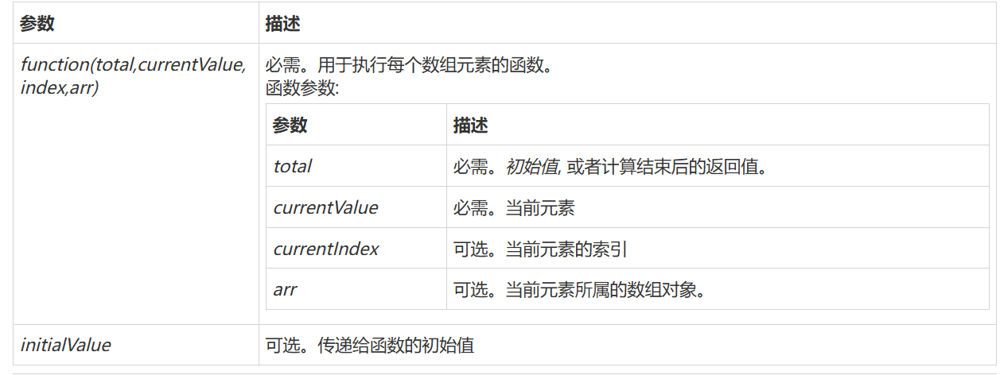

## 1、什么是JavaScript

### 1.1、概述

JavaScript是一门世界上最流行的脚本语言

Java、JavaScript

JavaScropt只用了10天就被开发出来了~

一个合格的后端人员，必须要精通JavaScript

### 1.2、历史

**ECMAScript**它可以理解为是JavaScript的一个标准

最新版本已经到es6版本~

但是大部分浏览器还只停留在支持es5代码上！

开发环境—线上环境，版本不一致

## 2、快速入门

### 2.1、引入JavaScript

1、内部标签

```html
<script>
    //......
</script>
```

2、外部引入

abc.js

```javascript
//...
```

test.html

```html
<script src="abc.js"></script>
```

测试代码

```html
<!DOCTYPE html>
<html lang="en">
<head>
    <meta charset="UTF-8">
    <title>Title</title>

    <!--script标签内，写JavaScript代码-->
    <!--<script>-->
    <!--    alert('hello,world');-->
    <!--</script>-->

    <!--外部引入-->
    <!--注意：script标签必须成对出现-->
    <script src="js/qj.js"></script>

    <!--不用定义type，也是默认显示javascript-->
    <script type="text/javascript">

    </script>

</head>
<body>

</body>
</html>
```

### 2.2、语法入门

```html
<!--JavaScript严格区分大小写-->
<script>
    // 1. 定义变量    变量类型 变量名=变量值；
    var score = 71;
    // alert(num);
    // 2. 条件控制
    if (score>60 && score<70){
        alert("60~70");
    }else if (score>70 && score<80){
        alert("70~80");
    }else{
        alert("other");
    }

    /*
    在浏览器的控制台打印变量！System.out.println();
    console.log(score)
     */
</script>
```

浏览器必备调试：


### 2.3、严格检查格式

```html
<!DOCTYPE html>
<html lang="en">
<head>
    <meta charset="UTF-8">
    <title>Title</title>

    <!--
    前提：IDEA 需要设置支持ES6语法
    严格检查模式，预防JavaScript的随意性导致产生的一些问题
    'user strict';

    必须写在JavaScript的第一行
    局部变量建议都是用 let 去定义~
    -->
    <script>
        'user strict';
        //全局变量
        let i = 1;
        // ES6 let
    </script>

</head>
<body>

</body>
</html>
```

## 3、数据类型

### 3.0、数据类型快速入门

**变量**

```javascript
var _$ = 111;
```

变量命名：

- 变量必须以字母开头
- 变量也能以 $ 和 _ 符号开头（不过我们不推荐这么做）
- 变量名称对大小写敏感（y 和 Y 是不同的变量）

**number**

js不区分小数和整数，Number

```javascript
123 // 整数123
123.1 // 浮点数123.1
1.123e3  // 科学计数法
-99 // 负数
NaN // not a number
Infinity // 表示无限大
```

**字符串**

‘abc’，“abc”，‘\n’

**布尔值**

true，false

**逻辑运算**

```
&&

||

！
```

**比较运算符**（重要！）

```javascript
== 等于（类型不一样，值一样，也会判断为true, 如1 = '1',结果为true）
=== 绝对等于（类型一样，值一样，结果为true）
!= 不等于
!==	不绝对等于（值和类型有一个不相等，或两个都不相等）
```

须知：

- NaN===NaN，这个与所有的数值都不相等，包括自己
- 只能通过isNaN（NaN）来判断这个数是否是NaN

**浮点数问题：**

```
console.log((1/3) === (1-2/3))
```

尽量避免使用浮点数进行运算，存在精度问题！

```html
Math.abs(1/3-(1-2/3))<0.00000001
```

**null和undefined**

* **null表示"没有对象"，即该处不应该有值。**典型用法是：

> （1） 作为函数的参数，表示该函数的参数不是对象。
>
> （2） 作为对象原型链的终点。

> ```javascript
> Object.getPrototypeOf(Object.prototype)
> // null
> ```

* **undefined表示"缺少值"，就是此处应该有一个值，但是还没有定义。**典型用法是：

  > （1）变量被声明了，但没有赋值时，就等于undefined。
  >
  > （2) 调用函数时，应该提供的参数没有提供，该参数等于undefined。
  >
  > （3）对象没有赋值的属性，该属性的值为undefined。
  >
  > （4）函数没有返回值时，默认返回undefined。

  > ```javascript
  > var i;
  > i // undefined
  > 
  > function f(x){console.log(x)}
  > f() // undefined
  > 
  > var  o = new Object();
  > o.p // undefined
  > 
  > var x = f();
  > x // undefined
  > ```

**数组**

Java的数组要一系列相同类型的对象~ JS中数组可以存储不同类型！

```javascript
//保证代码的可读性，尽量使用[]
var arr = [1,2,3,4,5,"hello",null,true]

new Array(1,123,124,5,6,"hello");
```

取数组下标：如果越界了，就会

```javascript
undefined
```

**对象**

对象是大括号，数组是中括号~~

> 每个属性之间使用逗号隔开，最后一个不需要添加

```javascript
// Person person = new Person(1,2,3,4,5);
var person = {
    name:"qinjiang",
    age:3,
    tags:['js','java','web','...']
}
```

**取对象的值**

```bash
person.name
> "qinjiang"
person.age
> 3
```

### 3.1、字符串

1、正常字符串我们使用单引号，或者双引号包裹

2、注意转义字符 \

```
\'
\n
\t
\u4e2d   \u####  Unicode字符
\x41     Ascll字符
```

3、多行字符串编写

```javascript
//tab 上面 esc键下面的 `
var msg =
    `hello
    world
    你好ya
    你好
    `
```

4、模版字符串

```javascript
//tab 上面 esc键下面
//普通的引号不能使用模板字符串
let name = "qinjiang";
let age = 3;

let msg = `你好呀，${name}`
```

5、字符串长度

```javascript
str.length  
```

6、字符串的可变性，不可变


7、大小写转换

```javascript
//注意，这里是方法，不是属性了
student.toUpperCase()
student.toLowerCase()
```

8、查找字符所在位置

```javascript
student.indexOf('t')
```

9、截取子字符串

```javascript
student.substring(1); //从下标为1截取到最后一个
student.substring(1,3); //截取范围[1,3)
```

### 3.2、数组

**Array可以包含任意的数据类型**

```javascript
var arr = [1,2,3,4,5,6]; // 通过下标取值和赋值
arr[0]
arr[0] = 1
```

#### 0、遍历数组

```javascript
var arr = [3,4,5]
// for...in 遍历下标
for (var x in arr){
    console.log(x)
}
// for...of 遍历元素
for (var x of arr){
    console.log(x)
}
```

#### 1、长度

```javascript
arr.length
```

注意：假如给 arr.length 赋值，数组大小就会发生变化~

 如果赋值过小，元素就会丢失

#### 2、indexOf，通过元素获得下标索引

```java
arr.indexof(2)
1
```

字符串的 “1” 和数字 1 是不同的

```javascript
 
arr.indexOf(1); //0
arr.indexOf('1'); //6
```

#### 3、slice() 截取Array的一部分，返回一个新数组，类似于String 中的substring

使用实例1

```js
function add() {
    // ES5 的写法，将伪数组转换为真正的数组
    var arr1 = [].slice.call(argumets); // [1, 2, 3]
    console.log(arr1);
}
add(1, 2, 3); //这里调用了add函数，所以arguments是[1,2,3]

/*因为call是函数的方法，不是数组的方法，所以不能直接使用[].call(...)
*/
```


#### 4、posh()，pop()

```
push: 压入到尾部
pop: 弹出尾部的一个元素
```

#### 5、unshift()，shift() 头部

```
unshift: 压入到头部
shift: 弹出头部的一个元素
```

#### 6、排序

```javascript
(3) ['B', 'C', 'A']
arr.sort()
(3) ['A', 'B', 'C']
```

#### 7、元素反转

```javascript
(3) ['A', 'B', 'C']
arr.reverse()
(3) ['C', 'B', 'A']
```

#### 8、concat()

```javascript
(3) ['C', 'B', 'A']
arr.concat([1,2,3])
(6) ['C', 'B', 'A', 1, 2, 3]
```

> 注意：concat() 并没有修改数组，只是会返回一个新的数组

#### 9、连接符 join

打印拼接数组，使用特定的字符串连接

```javascript
(3) ['C', 'B', 'A']
arr.join('-')
'C-B-A'
```

#### 10、多维数组

```javascript
arr = [[1,2],[3,4],["5","6"]]
arr[1][1]
4
```

数组：存储数据（如何存，如何取，方法都可以自己实现！）

#### 11、splice

语法：

```js
array.splice(index,howmany,item1,.....,itemX)
```

| 参数                  | 描述                                                         |
| :-------------------- | :----------------------------------------------------------- |
| *index*               | 必需。规定从何处添加/删除元素。 该参数是开始插入和（或）删除的数组元素的下标，必须是数字。 |
| *howmany*             | 可选。规定应该删除多少元素。必须是数字，但可以是 "0"。 如果未规定此参数，则删除从 index 开始到原数组结尾的所有元素。 |
| *item1*, ..., *itemX* | 可选。要添加到数组的新元素                                   |

实例：

```js
//从第三个位置开始删除数组后的两个元素：
var fruits = ["Banana", "Orange", "Apple", "Mango"];
fruits.splice(2,2);
```

> *fruits* 输出结果：
> Banana,Orange

#### 12、reduce

**定义和用法**

reduce() 方法接收一个函数作为累加器，数组中的每个值（从左到右）开始缩减，最终计算为一个值。

reduce() 可以作为一个高阶函数，用于函数的 compose。

**注意:** reduce() 对于空数组是不会执行回调函数的。

**语法**

```js
array.reduce(function(total, currentValue, currentIndex, arr), initialValue)
```

**参数**



**实例**

```html
//点击按钮后，将计算数组的和，结果为24.
//如果将number.reduce(getSum,0)改为number.reduce(getSum,1),最后的结果为25，因为加上了初始值1
<button onclick="myFunction()">点我</button>
 
<p>数组元素之和: <span id="demo"></span></p>
 
<script>
var numbers = [15.5, 2.3, 1.1, 4.7];
 
function getSum(total, num) {
    return total + Math.round(num);
}
function myFunction(item) {
    document.getElementById("demo").innerHTML = numbers.reduce(getSum, 0);
}
</script>
```


### 3.3、对象

若干个键值对

```javascript
var 对象名 = {
	属性名：属性值,
	属性名：属性值,
	属性名：属性值
}

//定义了一个person对象，它有四个属性
var person = {
    name:"Chaucer",
    age:3,
    email:"860670660@qq.com",
    score:0 
}
```

js中对象，｛…｝表示一个对象，键值对描述属性 xxxx:xxxx，多个属性之间使用逗号隔开，最后一个属性不加逗号！

JavaScript中的所有的键都是字符串，值是任意对象！

1、对象赋值

```javascript
person.name = "changsong"
'changsong'
person.name
'changsong'
```

2、使用一个不存在的对象属性，不会报错！

```
person.haha
undefined
```

3、动态的删减属性，通过delete删除对象的属性

```javascript
delete person.name
true
person
```

4、动态的添加，直接给新的属性添加指即可

```javascript
person.haha = "haha"
'haha'
person
```

5、判断属性值是否在这个对象中！xxx in xxx！

```javascript
'age' in person
true
'toString' in person
true
```

6、判断一个属性是否是这个对象自身拥有的 hasOwnProperty()

```javascript
person.hasOwnProperty('toString')
false
person.hasOwnProperty('age')
true
```

### 3.4、流程控制

if 判断

```javascript
var age = 3;
if (age>3){ //第一个判断
    alert("haha");
} else if (age<5) { //第二个判断
    alert("kuwa~");
} else{ //否则
    alert("kuwa~");
}
```

while循环，避免程序死循环

```javascript
while(age<100){
    age = age + 1;
    console.log(age);
}

do{
    age = age + 1;
    console.log(age);
}while(age<100)
```

for循环

```javascript
for (let i = 0; i < 100; i++) {
    console.log(i)
}
```

**forEach 循环**

> 5.1 引入

```javascript
var age = [12,3,12,3,12,3,123,451,41,1];

//函数
age.forEach(function(value)){
    console.log(value)
})
```

for…in

```javascript
//for(var index in object){}
//注意：下面代码中，num是age的索引
for (var num in age){
    if (age.hasOwnProperty(num)){
        console.log("存在")
        console.log(age[num])
    }
}
```


### 3.5、Map和Set

> ES6 的新特性~

Map:

```javascript
//ES6  Map
//学生的成绩，学生的名字
// var names = ["tom","jack","haha"];
// var score = [100,90,80];

var map = new Map([['tom',100] ,['jack',90],['haha',80]]);
name = map.get('tom');//通过key获得value
map.set('admin',123456);//新增或修改
map.delete("tom");//删除
```

Set: 无序不重复的集合

```javascript
var set = new Set([3,1,1,1,1])
set.add(2); //添加
set.delete(1); //删除
console.log(set.has(3)); //是否包含某个元素
```

### 3.6、iterator

> ES6 的新特性~

遍历数组

```javascript
var arr = [3,4,5]
// for...in 遍历下标
for (var x in arr){
    console.log(x)
}
// for...of 遍历元素
for (var x of arr){
    console.log(x)
}
```

使用iterator遍历迭代我们Map，Set！

遍历map

```javascript
var map = new Map([["tom",100],["jack",90],["haha",80]])
for (let x of map){
    console.log(x)
}
```

遍历set

```javascript
var set = new Set([5,6,7]);
for (let x of set){
    console.log(x)
}
```

## 4、函数

### 4.1、定义函数

**定义方式一**

```javascript
function abs(x){
    if(x>=0){
        return x;
    }else{
        return -x;
    }
}
```

一旦执行到 return 代表函数结束，返回结果！

如果没有执行return，函数执行完也会返回结果，结果就是 undefined

**定义方式二**

```javascript
var abs = function(x){
    if(x>=0){
        return x;
    }else{
        return -x;
    }
}
```

function(x){…} 这是一个匿名函数。但是可以把结果赋值给 abs，通过abs就可以调用函数！

方式一和方式二等价

> 调用函数

```javascript
abs(10) //10
abs(-10) //10
```

**参数的个数问题**

javascript 可以传任意个参数，也可以不传递参数！

1. 处理不传入参数的情况

```javascript
function abs(x){
    //手动抛出异常来判断
    if (typeof x != 'number'){
        throw 'Not a number'
    }
    if(x>=0){
        return x;
    }else{
        return -x;
    }
}
```

2. 处理传入太多参数的情况

`arguments ` 一个关键字；传递进来的所有的参数，都会放入arguments中，形成一个数组，但这个数组不是真的数组，是伪数组

```javascript
function abs(x){

    console.log("x=>"+x);

    //相当于遍历每个参数然后打印
    for (var i=0;i<arguments.length;i++){
        console.log(arguments[i]);
    }

    if(x>=0){
        return x;
    }else{
        return -x;
    }
}
```

arguments关键字存在的问题：arguments包含所有的参数，有时候想使用多余的参数来进行附加操作。需要排除已有的参数~而排除已有参数的操作需要写额外的代码。

rest 关键字弥补了arguments这一缺点。

以前获取多余的参数：

```javascript
if(arguments.length>2){
    for (var i =2; i<arguments.length;i++){
		//...
    }
}
```

现在获取多余的参数：ES6 引入的新特性，获取除了已经定义的参数之外的所有参数~ …

```javascript
function aaa(a,b,...rest){
    console.log("a=>"+a);
    console.log("a=>"+b);
    console.log(rest);
}
```

rest 参数只能写在最后面，必须使用 … 标识。

### 4.2、变量的作用域

**变量作用域总结**

1. var

>函数内 : 局部
>
>代码块内 : 全局
>
>函数和代码块外 : 全局

2. let

>函数内 : 局部
>
>代码块内 : 局部
>
>函数和代码块外 : 局部(被限定到该脚本文件或该模块中)

3. const

>函数内 : 局部
>
>代码块内 : 局部
>
>函数和代码块外 : 全局

4. 不使用关键字定义变量

   >函数内 : 全局
   >
   >代码块内 : 全局
   >
   >函数和代码块外 : 全局

在javascript中，var 定义变量实际是有作用域的。

* 假设在函数体中声明，则在函数体外不可以使用~ （非要想实现的话，后面可以研究一下闭包）

```javascript
function qj() {
    var x = 1;
    x = x + 1;
}

x = x + 2; //Uncaught ReferenceError: x is not
```

* 如果两个函数使用了相同的变量名，只要在函数内部，就不冲突

```javascript
function qj() {
    var x= 1;
    x = x+1;
}

function qj2() {
    var x = 'A';
    x = x + 1; 
}
```

* 内部函数可以访问外部函数的成员，反之则不行

```javascript
function qj() {
    var x= 1;

    // 内部函数可以访问外部函数的成员，反之则不行
    function qj2() {
        var y = x + 1;
    }

    var z = y + 1; // Uncaught ReferenceError: z is not defined
}
```

* 假设内外函数变量重名

```javascript
function qj() {
    var x= 1;

    function qj2() {
        var x = 'A';
        console.log('inner'+x); // innerA
    }
    console.log('outer'+x); // outer1
    qj2();
}

qj();
```

在JavaScript中函数查找变量从自身函数开始，由“内”内向"外"查找。假设外部存在这个同名的函数变量，则内部函数会屏蔽外部函数的变量。

* 提升变量的作用域

```javascript
function qj() {
    var x = "x" + y;
    console.log(x);
    var y = 'y';
}
//上面的代码等价于下面的代码
function qj2() {
    var y;

    var x = "x" + y;
    console.log(x);
    y = 'y';
}
```

结果：xundefined

说明：js 引擎自动提升了y的声明，但是不会提升变量y的赋值；

这个是在Javascript建立之初就存在的特性。

养成规范：所有的变量定义都放在函数的头部，不要乱放，便于代码维护；

```javascript
function qj2(){
    var x = 1,
        y = x + 1,
        z,i,a; // undefined
    
    //之后随便用
}
```

* 全局对象 window

```javascript
var x = 'xxx';
alert(x);
alert(window.x); // 默认所有的全局变量，都会自动绑定在window对象下；
```

* alert() 这个函数本身也是一个 window 对象

```javascript
var x = 'xxx';

window.alert(x);

var old_alert = window.alert;

window.alert = function (){

};

// 发现 alert() 失效了
window.alert(123);

// 恢复
window.alert = old_alert;
window.alert(456);
```

Javascript 实际上只有一个全局作用域，任何变量（函数也可以视为变量），假设没有在函数作用范围内找到，就会向外查找，如果在全局作用域都没有找到，报错 RefenceError

> 规范

由于我们所有的全局变量都会绑定到我们的 window 上。如果不同的js文件，使用了相同的全局变量，冲突~ 如何能够减少冲突？ 

```javascript
// 唯一全局变量
var KuangApp = {};

// 定义全局变量
KuangApp.name = 'kuangshen';
KuangApp.add = function (a,b) {
    return a + b;
}
```

把自己的代码全部放入自己定义的唯一空间名字中，降低全局命名冲突的问题~

jQuery 等价于 $

> 局部作用域 let

```javascript
function aaa() {
    for (var i = 0; i < 100; i++) {
        console.log(i);
    }
    console.log(i+1); // 问题？ i出了这个作用域还可以使用
}
```

ES6 let 关键字，解决局部作用域冲突问题！

```javascript
function aaa() {
    for (let i = 0; i < 100; i++) {
        console.log(i);
    }
    console.log(i+1); // Uncaught ReferenceError: i is not defined
}
```

建议大家都是用 let 去定义局部作用域的变量；

> 常量 const

在ES6之前，怎么定义常量，只要用全部大写字母命名的变量就是常量；建议不要修改这样的值

```javascript
var PI = '3.14';

console.log(PI);
PI = '213'; //可以改变这个值
console.log(PI);
```

在ES6 引入了常量关键字 const

```javascript
const PI = '3.14'; // 只读变量
console.log(PI);
PI = '123'; // 报错！！！
//Uncaught TypeError: Assignment to constant variable.
```

### 4.3、方法

* 定义方法

方法就是把函数放在对象的里面，对象只有两个东西：属性和方法

```javascript
var kuangshen = {
    name:'秦疆',
    birth:2020,
    //方法
    age:function (){
        // 今年 - 出生的年
        var now = new Date().getFullYear();
        return now - this.birth;
    }
}
// 属性
kuangshen.name
// 方法，一定要带（）
kuangshen.age()
```

* apply

在js中可以控制this指向！

```javascript
function getAge() {
    // 今年 - 出生的年
    var now = new Date().getFullYear();
    return now-this.birth;
}

var kuangshen = {
    name:'秦疆',
    birth:2020,
    //方法
    age:getAge,
}

// this指向kuangshen,参数为空
getAge.apply(kuangshen,[]);
```

### 4.4、函数自调用

> 原文地址：https://cloud.tencent.com/developer/article/1110522

JavaScript中匿名函数一种非常常见的用法就是自调函数，这种函数可以在定义之后自行调用。

自调函数常见形式是：

代码语言：javascript

复制

```javascript
(function(){
    alert("foo");
})()
```

光看这个形式，可能会让人以为是在函数体前后包个括号，然后后面通过括号运算符来立即调用函数，形式上说是对的，但是为什么要给函数包个括号？下面我们就来重新认识一下自调函数。 要理解自调函数，首先我们要理解两个概念

#### 函数声明

函数声明通常由一下几部分组成：

- function子句
- 函数名称
- 函数的参数
- 函数体
- return子句，默认返回值为undefined。

例子：

代码语言：javascript

复制

```javascript
function foo(a,b) {
    return a+b;
}
```

#### 函数表达式

函数声明容易理解，函数表达式就陌生多了。其实，这里说的函数表达式，顾名思义就是一种表达式，内容是函数。表达式就是那些个加减乘除之类的。

比如说下面这个例子：

代码语言：javascript

复制

```javascript
var foo = function (a,b) {
            return a+b;
          };
```

例子中，创建了一个匿名函数，然后把这个匿名函数的引用给了`foo`这个变量。 严格来说，这个例子不完全是函数表达式，去除`var foo`之后，剩下的就是一个函数表达式。

上面的例子要如何调用函数？很明显`foo(1,2)`就可以了，之前说过`foo`不过是那个匿名函数的引用，对foo使用括号运算符就可以调用这个匿名函数了。

既然如此，是不是也可以这样调用：

代码语言：javascript

复制

```javascript
d = function (a,b) {
    return a+b;
}(1,2)
```

这里变量d的值是3，因为此处等号是个二元运算符，所以看的可能不是太清楚，可以尝试改成如下形式：

代码语言：javascript

复制

```javascript
+ function (a,b) {
        return a+b;
    }(1,2)
```

控制台中运行会输出3，这就是一个自调函数。

#### 重新认识自调函数

分清楚函数声明和函数表达式之后，我们来重新认识自调函数。 先看几个例子：

代码语言：javascript

复制

```javascript
(function(a){
    console.log(a);   //123
})(123);

(function(a){
    console.log(a);   //123
}(123));

! function(a){
    console.log(a);   //123
}(123);

+ function(a){
    console.log(a);   //1234
}(123);

- function(a){
    console.log(a);   //123
}(123);

void function(a){
    console.log(a);   //123
}(123)
```

可以看出，要让匿名函数自调用，首先要把匿名函数变成函数表达式，而不能是函数声明。 而把函数声明变成函数表达式的方法就是在`function`关键字前面加点什么东西，例如括号，+,-,!,void,=,逗号,~……告诉js解析引擎，这个是一个函数表达式，可以通过`()`运算符来执行。

而加`()`是最安全的做法，因为加减号会影响返回值，而`void`会让返回值为`undefined`，所以括号用的最广泛，但我们要知道除了括号，别的也能实现自调函数。

#### 自调用函数解决setTimeout传参数

有时候我们需要循环设置`setTimeout`，并且每次执行的函数的参数还不一样，这个时候就是我们的自调函数大显身手的时候了：

代码语言：javascript

复制

```javascript
var i = 0, tmp = [1,2,3];
for(i,len=tmp.length;i<len;i++) {
    setTimeout(
        (function(txt){
          return function(){
            console.log(txt)
          }
        })(tmp[i]),
    1000*i);
}
```

控制台执行，可以看到依次打印出1，2，3 理解一下上面`setTimeout`的执行：

1. setTimeout里面把(function(){})()当成函数表达式执行，返回了一个匿名函数的引用；
2. 当延时结束的时候，由js解释器来执行这个函数引用。

这里要注意，返回的是函数的引用，不要单纯的理解为字符串的传递。

### 4.5、构造函数

构造函数示例：

```javascript
    //定义类型
    function Person(name, age) {
        this.name = name
        this.age = age
        this.setName = function (name) {
            this.name = name
        }
    }

    //通过构造函数创建对象。p1的类型为Person
    var p1 = new Person('Tom', 12)
    console.log(typeof(p1))  // Object （typeof不能判断对象的具体类型（见js高级））
    console.log(p1 instanceof Person) // true
```

对构造函数的解释：

> 以下内容来自ChatGPT

当你使用 `new` 关键字调用 `Person` 函数时，JavaScript 会将其作为一个 **构造函数** 来执行。这是 JavaScript 面向对象编程的一种方式。s

构造函数的工作原理

1. **创建一个新对象**：
   - 当你调用 `new Person()` 时，JavaScript 会自动创建一个新的空对象。
   - 这个新对象的原型（`__proto__`）会被设置为构造函数的原型（`Person.prototype`）。
2. **绑定 `this`**：
   - 构造函数中的 `this` 会指向这个新创建的对象。
3. **初始化属性和方法**：
   - 构造函数中的代码会被执行，通常用来为新对象添加属性和方法。
   - 例如，`this.name = name` 和 `this.age = age` 将这些属性赋值到新对象上。
4. **返回新对象**：
   - 如果构造函数没有显式返回对象，则默认返回这个新创建的对象。

## 5、内部对象

> 标准对象

```javascript
typeof 123
'number'
typeof '123'
'string'
typeof true
'boolean'
typeof NaN
'number'
typeof []
'object'
typeof {}
'object'
typeof Math.abs
'function'
typeof undefined
'undefined'
typeof null
'object'
```

### 5.1、Date

**基本使用**

```javascript
let timestamp = Date.now();//返回一个时间戳，以毫秒为单位。

var now = new Date(); //Mon Apr 18 2022 12:38:06 GMT+0800 (中国标准时间)
now.getFullYear(); //年
now.getMonth(); //月
now.getDate(); //日
now.getDay(); //星期几
now.getHours(); //时
now.getMinutes(); //分
now.getSeconds(); //秒

now.getTime(); //时间戳 全世界统一 1970 1.1 00：00：00 毫秒数

console.log(new Date(1650258624282))
```

转换

```javascript
now = new Date(1650258624282)
Mon Apr 18 2022 13:10:24 GMT+0800 (中国标准时间)

now.toLocaleString()
'2024/6/18 20:24:18'

now.toGMTString()
'Tue, 18 Jun 2024 12:24:18 GMT'
```

### 5.2、JSON

> json是什么

早期，所有的数据传输习惯使用 XML 文件！

- [JSON](https://baike.baidu.com/item/JSON)([JavaScript](https://baike.baidu.com/item/JavaScript) Object Notation, JS 对象简谱) 是一种轻量级的数据交换格式。
- 简洁和清晰的**层次结构**使得 JSON 成为理想的数据交换语言。
- 易于人阅读和编写，同时也易于机器解析和生成，并有效地提升网络传输效率。

在 JavaScript 一切皆为对象、任何js支持的类型都可以用JSON来表示；

格式：

- 对象都用｛｝
- 数组都用[]
- 所有的键值对都是用 key:value

JSON 和 JS 对象的转化

```javascript
var user = {
    name:"qinjiang",
    age:3,
    sex:"男"
}

// 对象转化为json字符串
var jsonUser = JSON.stringify(user);  // {"name":"qinjiang","age":3,"sex":"男"}

//json 字符串转化为对象 参数为 json 字符串
var obj = JSON.parse('{"name":"qinjiang","age":3,"sex":"男"}');
```

JSON 和 JS 对象的区别

```javascript
var obj = {a:'hello',b:'hellob'};

var json = '{"a":"hello", "b":"hellob"}';
```

5.3、Ajax

- 原生的js写法 xhr 异步请求
- jQuery 封装好的 方法 $(“#name”).ajax(“”)
- axios 请求

## 6、面向对象编程

javascript、java、c#… 面向对象；javascript有些区别

- 类：模版
- 对象：具体的实例

在 JavaScript这个需要大家换一下思路

* ES5及之前使用**原形**完成继承的功能：

```javascript
var Student = {
    name:"qinjiang",
    age:3,
    sex:"男",
    run:function () {
        console.log(this.name + "run...");
    }
    //相当于studnet对象的构造方法
    student:function Student(name) {
    	this.name = name;
	}
};

var xiaoming = {
    name: "xiaoming",
};

// 原型对象
xiaoming.__proto__ = Student;

var Bird = {
    fly:function () {
        console.log(this.name + "fly...");
    }
};

// 小明的原型变为Bird
xiaoming.__proto__ = Bird;


// 给student新增一个方法
Student.prototype.hello = function () {
    alert('Hello');
};
```

* ES6之后使用class实现继承

1、定义一个类，属性，方法

```javascript
// ES6之后 ========
// 定义一个学生的类
class Student{

    constructor(name) {
        this.name = name;
    }

    hello(){
        alert('hello')
    }

}

var xiaoming = new Student("xiaoming");
var xiaohong = new Student("xiaohong");
```

2、继承

```html
<script>

// ES6之后 ========
// 定义一个学生的类
class Student{	

    constructor(name) {
        this.name = name;
    }

    hello(){
        alert('hello')
    }

}

class XiaoStudent extends Student{
    //一个类只能有一个构造器
	constructor(name,grade) {
        super(name);
        this.grade = grade;
    }
    myGrade(){
        alert('我是一名小学生');
    }
}


var xiaoming = new Student("xiaoming");
var xiaohong = new XiaoStudent("xiaohong",1);
</script>
```

## 7、操作BOM对象（重点）

> 浏览器介绍

### JavaScript 和浏览器的关系？

JavaScript 诞生就是为了能够在浏览器中运行！

BOM：浏览器对象模型

- IE 6~11
- Chrome
- Safari
- FireFox Linux
- Opera

三方

- QQ浏览器
- 360浏览器

### window

Window 对象表示浏览器中打开的窗口。

如果文档包含框架（<frame> 或 <iframe> 标签），浏览器会为 HTML 文档创建一个 window 对象，并为每个框架创建一个额外的 window 对象。

```javascript
window.innerHeight
158
window.innerWidth
1440
window.outerHeight
924
window.outerWidth
1444
// 大家可以调整浏览器窗口试试。。
```

**Window对象属性**：

| 属性                                                         | 描述                                                         |
| :----------------------------------------------------------- | :----------------------------------------------------------- |
| [closed](https://www.runoob.com/jsref/prop-win-closed.html)  | 返回窗口是否已被关闭。                                       |
| [defaultStatus](https://www.runoob.com/jsref/prop-win-defaultstatus.html) | 设置或返回窗口状态栏中的默认文本。                           |
| [document](https://www.runoob.com/jsref/dom-obj-document.html) | 对 Document 对象的只读引用。(请参阅 [对象](https://www.runoob.com/jsref/dom-obj-document.html)) |
| [frames](https://www.runoob.com/jsref/prop-win-frames.html)  | 返回窗口中所有命名的框架。该集合是 Window 对象的数组，每个 Window 对象在窗口中含有一个框架。 |
| [history](https://www.runoob.com/jsref/obj-history.html)     | 对 History 对象的只读引用。请参阅 [History 对象](https://www.runoob.com/jsref/obj-history.html)。 |
| [innerHeight](https://www.runoob.com/jsref/prop-win-innerheight.html) | 返回窗口的文档显示区的高度。                                 |
| [innerWidth](https://www.runoob.com/jsref/prop-win-innerheight.html) | 返回窗口的文档显示区的宽度。                                 |
| [localStorage](https://www.runoob.com/jsref/prop-win-localstorage.html) | 在浏览器中存储 key/value 对。没有过期时间。                  |
| [length](https://www.runoob.com/jsref/prop-win-length.html)  | 设置或返回窗口中的框架数量。                                 |
| [location](https://www.runoob.com/jsref/obj-location.html)   | 用于窗口或框架的 Location 对象。请参阅 [Location 对象](https://www.runoob.com/jsref/obj-location.html)。 |
| [name](https://www.runoob.com/jsref/prop-win-name.html)      | 设置或返回窗口的名称。                                       |
| [navigator](https://www.runoob.com/jsref/obj-navigator.html) | 对 Navigator 对象的只读引用。请参阅 [Navigator 对象](https://www.runoob.com/jsref/obj-navigator.html)。 |
| [opener](https://www.runoob.com/jsref/prop-win-opener.html)  | 返回对创建此窗口的窗口的引用。                               |
| [outerHeight](https://www.runoob.com/jsref/prop-win-outerheight.html) | 返回窗口的外部高度，包含工具条与滚动条。                     |
| [outerWidth](https://www.runoob.com/jsref/prop-win-outerheight.html) | 返回窗口的外部宽度，包含工具条与滚动条。                     |
| [pageXOffset](https://www.runoob.com/jsref/prop-win-pagexoffset.html) | 设置或返回当前页面相对于窗口显示区左上角的 X 位置。          |
| [pageYOffset](https://www.runoob.com/jsref/prop-win-pagexoffset.html) | 设置或返回当前页面相对于窗口显示区左上角的 Y 位置。          |
| [parent](https://www.runoob.com/jsref/prop-win-parent.html)  | 返回父窗口。                                                 |
| [screen](https://www.runoob.com/jsref/obj-screen.html)       | 对 Screen 对象的只读引用。请参阅 [Screen 对象](https://www.runoob.com/jsref/obj-screen.html)。 |
| [screenLeft](https://www.runoob.com/jsref/prop-win-screenleft.html) | 返回相对于屏幕窗口的x坐标                                    |
| [screenTop](https://www.runoob.com/jsref/prop-win-screenleft.html) | 返回相对于屏幕窗口的y坐标                                    |
| [screenX](https://www.runoob.com/jsref/prop-win-screenx.html) | 返回相对于屏幕窗口的x坐标                                    |
| [sessionStorage](https://www.runoob.com/jsref/prop-win-sessionstorage.html) | 在浏览器中存储 key/value 对。 在关闭窗口或标签页之后将会删除这些数据。 |
| [screenY](https://www.runoob.com/jsref/prop-win-screenx.html) | 返回相对于屏幕窗口的y坐标                                    |
| [self](https://www.runoob.com/jsref/prop-win-self.html)      | 返回对当前窗口的引用。等价于 Window 属性。                   |
| [status](https://www.runoob.com/jsref/prop-win-status.html)  | 设置窗口状态栏的文本。                                       |
| [top](https://www.runoob.com/jsref/prop-win-top.html)        | 返回最顶层的父窗口。                                         |

**Window对象方法**：

| [alert()](https://www.runoob.com/jsref/met-win-alert.html)   | 显示带有一段消息和一个确认按钮的警告框。                     |
| ------------------------------------------------------------ | ------------------------------------------------------------ |
| [atob()](https://www.runoob.com/jsref/met-win-atob.html)     | 解码一个 base-64 编码的字符串。                              |
| [btoa()](https://www.runoob.com/jsref/met-win-btoa.html)     | 创建一个 base-64 编码的字符串。                              |
| [blur()](https://www.runoob.com/jsref/met-win-blur.html)     | 把键盘焦点从顶层窗口移开。                                   |
| [clearInterval()](https://www.runoob.com/jsref/met-win-clearinterval.html) | 取消由 setInterval() 设置的 timeout。                        |
| [clearTimeout()](https://www.runoob.com/jsref/met-win-cleartimeout.html) | 取消由 setTimeout() 方法设置的 timeout。                     |
| [close()](https://www.runoob.com/jsref/met-win-close.html)   | 关闭浏览器窗口。                                             |
| [confirm()](https://www.runoob.com/jsref/met-win-confirm.html) | 显示带有一段消息以及确认按钮和取消按钮的对话框。             |
| [createPopup()](https://www.runoob.com/jsref/met-win-createpopup.html) | 创建一个 pop-up 窗口。                                       |
| [focus()](https://www.runoob.com/jsref/met-win-focus.html)   | 把键盘焦点给予一个窗口。                                     |
| [getSelection](https://www.runoob.com/jsref/met-win-getselection.html)() | 返回一个 Selection 对象，表示用户选择的文本范围或光标的当前位置。 |
| [getComputedStyle()](https://www.runoob.com/jsref/jsref-getcomputedstyle.html) | 获取指定元素的 CSS 样式。                                    |
| [matchMedia()](https://www.runoob.com/jsref/met-win-matchmedia.html) | 该方法用来检查 media query 语句，它返回一个 MediaQueryList对象。 |
| [moveBy()](https://www.runoob.com/jsref/met-win-moveby.html) | 可相对窗口的当前坐标把它移动指定的像素。                     |
| [moveTo()](https://www.runoob.com/jsref/met-win-moveto.html) | 把窗口的左上角移动到一个指定的坐标。                         |
| [open()](https://www.runoob.com/jsref/met-win-open.html)     | 打开一个新的浏览器窗口或查找一个已命名的窗口。               |
| [print()](https://www.runoob.com/jsref/met-win-print.html)   | 打印当前窗口的内容。                                         |
| [prompt()](https://www.runoob.com/jsref/met-win-prompt.html) | 显示可提示用户输入的对话框。                                 |
| [resizeBy()](https://www.runoob.com/jsref/met-win-resizeby.html) | 按照指定的像素调整窗口的大小。                               |
| [resizeTo()](https://www.runoob.com/jsref/met-win-resizeto.html) | 把窗口的大小调整到指定的宽度和高度。                         |
| scroll()                                                     | 已废弃。 该方法已经使用了 [scrollTo()](https://www.runoob.com/jsref/met-win-scrollto.html) 方法来替代。 |
| [scrollBy()](https://www.runoob.com/jsref/met-win-scrollby.html) | 按照指定的像素值来滚动内容。                                 |
| [scrollTo()](https://www.runoob.com/jsref/met-win-scrollto.html) | 把内容滚动到指定的坐标。                                     |
| [setInterval()](https://www.runoob.com/jsref/met-win-setinterval.html) | 按照指定的周期（以毫秒计）来调用函数或计算表达式。           |
| [setTimeout()](https://www.runoob.com/jsref/met-win-settimeout.html) | 在指定的毫秒数后调用函数或计算表达式。                       |
| [stop()](https://www.runoob.com/jsref/met-win-stop.html)     | 停止页面载入。                                               |
| [postMessage()](https://www.runoob.com/jsref/met-win-postmessage.html) | 安全地实现跨源通信。                                         |

### Navigator（不建议使用）

Navigator，封装了浏览器的信息(Navigator是类, navigator是对象)

```javascript
navigator.appName
'Netscape'
navigator.appVersion
'5.0 (Windows NT 10.0; Win64; x64) AppleWebKit/537.36 (KHTML, like Gecko) Chrome/99.0.4844.51 Safari/537.36'
navigator.userAgent
'Mozilla/5.0 (Windows NT 10.0; Win64; x64) AppleWebKit/537.36 (KHTML, like Gecko) Chrome/99.0.4844.51 Safari/537.36'
navigator.platform
'Win32'
```

大多数时候，我们不会使用 navigator 对象，因为会被人为修改！

不建议使用这些属性来判断和编写代码

### screen

代表屏幕尺寸

```javascript
screen.width
1441
screen.height
960
```

### 	location（重要）

location 代表当前页面的URL信息

```javascript
host: "www.baidu.com"
href: "https://www.baidu.com"
protocol: "https:"
location.reload() //刷新网页
// 设置新的地址
location.assign('http://blog.kuangstudy.com/')
```

### document（内容；DOM）

document 代表当前的页面，HTML DOM文档树

```javascript
document.title
"百度一下，你就知道"
document.title='狂神说'
"狂神说"
```

获取具体的文档树节点

```html
<dl id="app">
    <dt>Java</dt>
    <dd>JavaSE</dd>
    <dd>JavaEE</dd>
</dl>

<script>
    var dl = document.getElementById('app');
</script>
```

获取cookie

```javascript
document.cookie
''
```

劫持 cookie 原理

www.taobao.com

```html
<script src="aa.js"></script>
<!--恶意人员：获取你的cookie上传到他的服务器>
```

服务器端可以设置 cookie：httpOnly

### history (不建议使用)

代表浏览器的历史记录

```javascript
history.back() //后退
history.forward() //前进
```

## 8、操作DOM对象（重点）

### 核心

浏览器网页就是一个Dom 树形结构！

- 更新：更新Dom节点
- 遍历Dom节点：得到Dom节点
- 删除：删除一个Dom节点
- 添加：添加一个新的节点

要操作一个Dom节点，就必须要先获得这个Dom节点

### 获得dom节点

```javascript
// 对应 css 选择器
var h1 = document.getElementsByTagName('h1')
var p1 = document.getElementById('p1')
var p2 = document.getElementsByClassName('p2')
var father = document.getElementById('father');

var childrens = father.children; //获取父节点下的所有子节点
// father.firstChild
// father.lastChild
```

这是原生代码，之后我们尽量都使用jQuery

### 更新节点

```html
<div id="id1">

</div>

<script>
    var id1 = document.getElementById('id1');
</script>
```

操作文本

- id1.innerText=‘456’ 修改文本的值
- id1.innerHTML=‘<Strong>123<Strong>’ 可以解析HTML文本标签 

操作css

```javascript
id1.style.color = 'red'; //属性使用 字符串 包裹
id1.style.fontSize = '200px'; // -转 驼峰命名问题
id1.style.padding = '2em';
```

### 删除节点

删除节点的步骤；先获取父节点，再通过父节点删除自己

```html
<div id="father">
    <h1>标题一</h1>
    <p id="p1">p1</p>
    <p class="p2">p2</p>
</div>

<script>
    var self = document.getElementById('p1');
    var father = p1.parentElement;
    father.removeChild(self);
    
    //删除是一个动态的过程
    father.removeChild(father.children[0])
    father.removeChild(father.children[1])
    father.removeChild(father.children[2])
</script>
```

注意：删除多个节点的时候，children 是在时刻变化的，删除节点的时候一定要注意

### 插入节点

我们获得了某个Dom节点，假设这个dom节点是空的，我们通过innerHTML 就可以增加一个元素了，但是这个DOM节点已经存在元素了，我们就不能这么做！会覆盖原来的节点

追加

```html
<p id="js">JavaScript</p>
<div id="list">
    <p id="se">JavaSE</p>
    <p id="ee">JavaEE</p>
    <p id="me">JavaME</p>
</div>

<script>

    var js = document.getElementById('js');
    var list = document.getElementById('list');
    
    list.appendChild(js);// 追加到后面
</script>
```

> 创建一个新的标签，实现插入

```html
<script>

    var js = document.getElementById('js');
    var list = document.getElementById('list');
    //通过JS 创建一个新的节点
    var newP = document.createElement('p');//创建一个p标签
    newP.id = 'newP';
    newP.innerText = 'Hello,Kuangshen';
    list.appendChild(newP);
    // 创建一个标签节点（通过这个属性，可以设置任意的值）
    var myScript = document.createElement('script');
    myScript.setAttribute('type','text/javascript');
    list.appendChild(newP);
    
    // 可以创建一个Style标签
    var myStyle = document.createElement('style');//创建一个空Style标签
    myStyle.setAttribute('type','text/css');
    myStyle.innerText = 'body{background-color:chartreuse;}';//设置标签内容

    document.getElementsByTagName('head')[0].appendChild(myStyle);
    
</script>
```

> insert

```javascript
var ee = document.getElementById('ee');
var js = document.getElementById('js');
var list = document.getElementById('list');
// 父节点.insertBefore(newNode,targetNode)
list.insertBefore(js,ee);
```


## DOM和BOM区别

| 特性         | DOM (Document Object Model)      | BOM (Browser Object Model)      |
| ------------ | -------------------------------- | ------------------------------- |
| **用途**     | 操作页面内容和结构               | 操作浏览器功能和窗口            |
| **对象**     | 文档元素（HTML或XML节点）        | 浏览器窗口、地址、历史、屏幕等  |
| **核心对象** | `document`                       | `window`                        |
| **示例功能** | 修改HTML、事件处理、样式动态调整 | 弹窗、URL跳转、定时器、历史管理 |


## 9、操作表单（验证）

> 表单是什么 form DOM 树

- 文本框 text
- 下拉框
- 单选框 radio
- 多选框 checkbox
- 隐藏域 hidden
- 密码框 password
- 。。。

表单的目的：提交信息

> 获得要提交的信息

```html
<form action="post">
    <p>
        <span>用户名：</span><input type="text" id="username">
    </p>

    <!--多选框的值，就是定义好的value-->
    <p>
        <span>性别：</span>
        <input type="radio" name="sex" value="man" id="boy"> 男
        <input type="radio" name="sex" value="woman" id="girl"> 女
    </p>
</form>

<script>
    var input_text = document.getElementById('username');
    var boy_radio = document.getElementById('boy');
    var girl_radio = document.getElementById('girl');

    // 得到输入框的值
    input_text.value
    // 修改输入框的值
    input_text.value = '41241'

    // 对于单选框，多选框等等固定的值，boy_radio.value只能取到当前的值
    boy_radio.checked; // 查看返回的结果，是否为true，如果为true，则被选中
    girl_radio.checked = true; // 赋值

</script>
```

> 提交表单，md5加密密码，表单优化

```html
<body>

<!--
表单绑定提交时间
onsubmit = 绑定一个提交检测的函数,true,false
将这个结果过返回给表单，使用 onsubmit 接收
οnsubmit="return aaa()"
-->

<form action="http://www.baidu.com/" method="post" onsubmit="return aaa()">
    <p>
        <span>用户名：</span>
        <input type="text" id="username" name="username">
    </p>
    <p>
        <span>密码：</span>
        <input type="password" id="input-password">
    </p>

    <input type="hidden" id="md5-password" name="password">

    <!--绑定事件 onclick 被点击-->
    <button type="submit">提交</button>
</form>

<script>
    function aaa() {
        alert(1);
        var uname = document.getElementById('username');
        var pwd = document.getElementById('input-password');
        var md5pwd = document.getElementById('md5-password');

        md5pwd.value = md5(pwd.value);
        // 可以校验判断表单内容，true就是通过提交，false，阻止提交
        return true;
    }
</script>
```

## 10、jQuery

JavaScript

jQuery库，里面存在大量的 JavaScript 函数

### 获取jQuery

```html
<!DOCTYPE html>
<html lang="en">
<head>
    <meta charset="UTF-8">
    <title>Title</title>
    <script src="lib/jquery-3.6.0.js"></script>
    <!-- 公式：$(selector).action() -->
</head>
<body>

<a href="" id="test-jquery">点我</a>

<script>
    

    //选择器就是css的选择器
    $('#test-jquery').click(function () {
        alert('hello,jQuery')
    })

</script>

</body>
</html>
```

> 选择器

```js
//原生js，选择器少，麻烦不好记
//标签
document.getElementsByTagName();
//id
document.getElementById();
//类
document.getElementsByClassName();

//jQuery  css中的选择器它全部都能用！
$('p').click() //标签选择器
$('#id1').click() //id选择器
$('.class1').click() //class选择器
```

文档工具栈：https://jquery.cuishifeng.cn/id.html

### 事件

鼠标事件，键盘事件，其他事件

获取当前鼠标的坐标：

```html
<!DOCTYPE html>
<html lang="en">
<head>
    <meta charset="UTF-8">
    <title>Title</title>
    <script src="lib/jquery-3.6.0.js"></script>
    <style>
        #divMove{
            width: 500px;
            height: 500px;
            border: 1px solid red;
        }
    </style>
</head>
<body>

<!--要求：获取鼠标当前的一个坐标-->
mouse: <span id="mouseMove"></span>
<div id="divMove">
在这里移动鼠标试试
</div>

<script>
    // 当网页元素加载完毕之后，响应事件
    $(function () {
        $('#divMove').mousemove(function (e) {
            $('#mouseMove').text('x:'+e.pageX + 'y:'+e.pageY)
        })
    });
</script>

</body>
</html>
```

### 操作DOM

节点文本操作

```js
$('#test-ul li[name=python]').text(); //获得值
$('#test-ul li[name=python]').text('设置值'); //设置值

$('#test-ul').html(); //获得值
$('#test-ul').html('<strong>123</strong>'); //设置值
```

css的操作

```js
$('#test-ul li[name=python]').css("color","red");
```

元素的显示和隐藏：本质 display: none ;

```js
$('#test-ul li[name=python]').show()
$('#test-ul li[name=python]').hide()
```

娱乐测试

```js
$(window).width();
$(window).height();
$('#test-ul li[name=python]').toggle();
```

未来 ajax ( ) ;

```js
$('#from').ajax()

$.ajax({ url: "test.html", context: document.body, success: function(){
    $(this).addClass("done");
}});
```

## 11、总结

1、如何巩固 JS （看 jQuery 源码，看游戏源码！）

2、巩固HTML、CSS（扒网站，全部down下来，然后对应修改看效果~）

# let和var的区别

在ES6之前，我们都是用var来声明变量，而且JS只有函数作用域和全局作用域，没有块级作用域，所以`{}`限定不了var声明变量的访问范围。
例如：

```javascript
{ 
  var i = 9;
} 
console.log(i);  // 9
```

ES6新增的`let`，可以声明块级作用域的变量。let声明的变量只在它所在的代码块有效。

```javascript
{ 
  let i = 9;     // i变量只在 花括号内有效！！！
} 
console.log(i);  // Uncaught ReferenceError: i is not defined
```

for循环的计数器，就很合适使用let命令。

```java
for (let i = 0; i < 10; i++) {
  // ...
}

console.log(i);
// ReferenceError: i is not defined
```

上面代码中，计数器i只在for循环体内有效，在循环体外引用就会报错。

下面的代码如果使用var，最后输出的是10。

```java
var a = [];
for (var i = 0; i < 10; i++) {
  a[i] = function () {
    console.log(i);
  };
}
a[6](); // 10
```

上面代码中，变量i是var命令声明的，在全局范围内都有效，所以全局只有一个变量i。每一次循环，变量i的值都会发生改变，而循环内被赋给数组a的函数内部的console.log(i)，里面的i指向的就是全局的i。也就是说，所有数组a的成员里面的i，指向的都是同一个i，导致运行时输出的是最后一轮的i的值，也就是 10。

如果使用let，声明的变量仅在块级作用域内有效，最后输出的是 6。

```java
var a = [];
for (let i = 0; i < 10; i++) {
  a[i] = function () {
    console.log(i);
  };
}
a[6](); // 6
```

上面代码中，变量i是let声明的，当前的i只在本轮循环有效，所以每一次循环的i其实都是一个新的变量，所以最后输出的是6。你可能会问，如果每一轮循环的变量i都是重新声明的，那它怎么知道上一轮循环的值，从而计算出本轮循环的值？这是因为 JavaScript 引擎内部会记住上一轮循环的值，初始化本轮的变量i时，就在上一轮循环的基础上进行计算。

另外，for循环还有一个特别之处，就是设置循环变量的那部分是一个父作用域，而循环体内部是一个单独的子作用域。

```java
for (let i = 0; i < 3; i++) {
  let i = 'abc';
  console.log(i);
}
// abc
// abc
// abc
```

上面代码正确运行，输出了 3 次abc。这表明函数内部的变量i与循环变量i不在同一个作用域，有各自单独的作用域。

# ES5和ES6的区别-稀土掘金

ES5和ES6是JavaScript语言的两个不同版本，它们之间有很多重要的区别。 首先，ES5是JavaScript的第五个修订版，于2009年发布。而ES6是JavaScript的第六个修订版，也称为ES2015，于2015年发布。 以下是ES5和ES6之间的一些主要区别：

⭐️变量声明方式：在ES5中，使用var关键字进行变量声明，而ES6引入了let和const关键字来声明变量。

⭐️块级作用域：在ES5中，只有全局作用域和函数作用域。而在ES6中，增加了块级作用域，这意味着对于在if、for、switch等代码块中声明的变量，在外部是不可见的。

⭐️箭头函数：ES6中新增了箭头函数，可以更简洁地定义函数，同时箭头函数没有自己的this，它的this绑定在父级作用域的this上。

⭐️字符串模板：ES6中新增了字符串模板功能，可以使用反引号(`)来定义多行文本和嵌入表达式。

⭐️类和继承：ES6中引入了class关键字来实现类和继承，使得面向对象编程更加方便。不再像**ES5**一样使用原型链实现继承

⭐️模块化：ES6中引入了模块化的概念，通过export和import关键字来实现模块的导出和引入。

⭐️解构赋值：ES6中引入了解构赋值语法，可以方便地从数组或对象中提取值并赋给变量。

⭐️Promise对象：ES6中引入了Promise对象，可以更加优雅地处理异步操作。

⭐️其他：ES6还新增了一些新的数据结构和方法，如Set、Map、Symbol等。同时对于函数参数的默认值、rest参数等也进行了增强和优化。

**总结**
es6比es5多出来的部分分两类
一类是语法，如箭头函数，解构；
一类是新的类、新的类方法、新的实例方法，如:Promise, Array.from, Array.prototype.find

