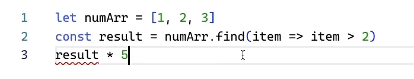

> 文档来源： https://www.bilibili.com/video/BV1gX4y177Kf/?share_source=copy_web&vd_source=2f53150f23426ed5ddde738e7faf9a21

## 类型推断

在JavaScript中，变量是弱类型的，可以随便书写变量，也可以在后期随便将变量赋值为任意类型。

但是在TypeScipt中不可以在后期赋值为任意类型。
在下面的实例中，TypeScript会将str推断为string类型。后期不能再将其它类型的值赋值给string类型的变量。


## 类型注解

限定变量类型：


限定变量类型并赋初始值


## 类型断言

下面这段代码报错的原因：
TypeScript推断 result 有可能为 undefined类型，undefined类型不能于number类型相乘。



如果我们确定result 一定为number类型，此时就可以像下图一样使用断言：
下图中断言的含义是为“我们断言result是一个number类型”


## 基础类型和联合类型

### TypeScript的基础类型：


### TypeScript的联合类型：

使用竖线“|”为变量分配多个类型。


关于null，null默认可以分配给任意一个类型，当在配置中配置了下图中的选项时，就不能将null分配给其他类型了。


### TypeScript具体值的限定

下图的代码表示：v5可以为 1、2、3中的一个数字。


## 数组、元组、枚举等

### 数组

在JavaScript中，数组可以存储不同类型的数据，如下图：

> 这种操作在实际开发中非常不建议使用


在TypeScript中可以使用下图的方式限定数组中元素的类型：

> 第一种数组表示arr是number类型组成的数组；
> 第二种数组表示啊arr1是string类型组成的数组；
> 这两种定义数组的方式都限定了数组中元素的个数


### 元组

定义一个元组:


定义一个元组，其中第三个number类型是可选的


### 枚举

定义一个枚举

> MyEnum.A取到的是0，
> MyEnum[0]取到的是A
>
> 


以上枚举代码编译为JavaScript代码后如下：


## 函数

定义一个函数


定义一个函数，为函数的参数设置默认值


定义一个函数，设置一个可选参数


定义一个函数，并设置剩余参数


## 接口

定义并使用接口：


## 接口继承

定义并使用接口


正确地使用子接口

 


## 类型别名

定义一个类型别名：


使用场景：

当需要定义多个类型为 string | number 的变量时，可以定义一个类型别名来代替 string | number

## 泛型

定义并使用泛型：


## 函数重载

JS不支持函数重载，TS中支持

定义函数重载，并使用函数：


## 类的定义

定义并实例化一个类： 

上面的类中有三个变量，其中aaa变量没有被使用，但是编译器没有报错。原因如下图所示，ts文件还没有被初始化：

> 如果在配置里开启了strict或者strictNullChecks的话，aaa变量就会报错


可以在终端中通过ts命令创建一个初始化的配置文件


创建完毕后aaa变量报错


原因是配置文件中的strict模式是开启的


如果把该配置注释掉，错误就消失了


定义一个类，设置必选属性，可选属性和默认值


## 类的修饰符

属性的默认修饰符为public, public修饰的属性在类的内部、类的实例、类的子类中都可以使用。

private 修饰的属性只在类的内部可以使用，在类的实例、类的子类中不可以使用。

protected 修饰的属性在类的内部、类的子类中可以使用，不能在类的实例中使用


static修饰符可以设置静态属性：


readonly修饰符修饰只读属性：


## 存取器

存取器类似于getter和setter，TypeScript中提供了一种单独的设置方法

定义一个类，类内部定义存取器。
在类的实例中使用存取器


## 抽象类

定义一个抽象类，，并继承抽象类。


抽象类的子类必须包含抽象类的所有抽象属性和抽象方法,否则会报错：


抽象类中也可以有普通的属性和方法，普通的属性和方法也可以被子类所继承


## 类实现接口

定义一个接口，并定义一个类实现这个接口。


一个类实现多个接口


## 泛型类

泛型类的定义和使用：


## 类型操作符

在 TypeScript 中，`&` 和` |` 是两个不同的类型操作符，用于处理**交叉类型**和**联合类型**。

### 1. 交叉类型 &

`&` 用于创建交叉类型，合并多个类型的属性。

如果一个值的类型是交叉类型 A & B，那么该值必须**同时满足类型 A 和类型 B** 的要求。

```typescript
type A = { propA: number };
type B = { propB: string };

type C = A & B;
// 结果类型 C：
// { propA: number, propB: string }
```

### 2. 联合类型 |

`| `用于创建联合类型，表示一个值的类型可以是多个类型之一。

如果一个值的类型是联合类型 A | B，那么该值**可以是类型 A 或者类型 B 中的任意一种**。

```typescript
type A = { propA: number };
type B = { propB: string };

type C = A | B;
// 结果类型 C：
// { propA: number } | { propB: string }
```

## 类型兼容性

类型兼容性在 TypeScript 中是一项基础概念，用于描述当一个类型的变量能否被分配给另一个类型的变量时应遵循的规则。这里有几个关键点需要理解：

- TypeScript 的类型兼容性是基于结构子类型的。如果类型 Y 有类型 X 所有的属性和方法，那么 X 可以被认为是 Y 的子类型。
- 当一个类型系统具有这样的特性时，它会检查值所具有的形状，而不是它们的显式类型。

以下是类型兼容性的一些实用例子：

### 接口兼容性

- 假设你有两个接口，`Interface A` 有属性 `x` 和 `y`；`Interface B` 只有属性 `x`：

  ```typescript
  interface A {
    x: number;
    y: number;
  }
  
  interface B {
    x: number;
  }
  
  let a: A = { x: 1, y: 2 };
  let b: B = { x: 3 };
  
  // B 可以赋值给 A，因为B至少有A所有的属性。
  a = b; // 没问题
  ```

### 函数兼容性

- 函数兼容性主要考虑参数列表和返回值类型：

  ```typescript
  let fn1 = (a: number) => 0;
  let fn2 = (b: number, s: string) => 0;
  
  fn2 = fn1; // 没问题，TypeScript使用鸭式辩型法，fn1的每个参数都能在fn2中找到对应。
  // fn1 = fn2; // 错误，fn2的每个参数找不到在fn1中的对应项。
  ```

### 枚举兼容性

- 枚举与数字类型互相兼容，但各个枚举之间不兼容：

  ```typescript
  enum Status {
    Uploading,
    Success,
    Failed,
  }
  let status = Status.Uploading;
  
  status = 1; // 数字赋值给枚举，没问题。
  // status = "string"; // 错误，字符串不能赋值给枚举。
  ```

### 类兼容性

- 类与对象字面量和接口兼容性很像，主要考虑其实例成员和方法：

  ```typescript
  class Animal {
    feet: number;
    constructor(name: string, numFeet: number) {}
  }
  
  class Size {
    feet: number;
    constructor(meters: number) {}
  }
  
  let a: Animal;
  let s: Size;
  
  a = s; // 没问题，因为s有a所有的属性。
  // s = a; // 同样没问题。
  ```

记住，TypeScript 的类型兼容性是基于结构型类型系统，这意味着当比较两个不同的类型时，TypeScript 会检查这两个类型的结构，而非它们声明时的类型名称。如果两个类型的内部结构"看起来"是兼容的，那么它们就是兼容的。

## 条件类型

条件类型是ts中非常强大的功能，形如：`T extends U ? X : Y`，表示如果`T`是`U`的子类，则返回类型为`X`，否则为`Y`。和三元表达式相似。

我们可以定义一个泛型类型`IsString`，根据`T`的类型，判断返回的具体类型是`true`还是`false`:

```typescript
type IsString<T> = T extends string ? true : false;

type A = IsString<string>; // true
type B = IsString<number>; // false
```

### 分布式条件类型

条件类型还有一个特性：分布式条件类型。在结合联合类型使用时（**只针对`extends`左边的联合类型**），分布式条件类型会被自动分发成联合类型。

| 分布式条件类型                                  | 等价于                                                       |
| ----------------------------------------------- | ------------------------------------------------------------ |
| `string extends T ? A : B`                      | `string extends T ? A : B`                                   |
| `(string | number) extends T ? A : B`           | `(string extends T ? A : B) | (number extends T ? A : B)`    |
| `(string | number | boolean) extends T ? A : B` | `(string extends T ? A : B) | (number extends T ? A : B) | (boolean extends T ? A : B)` |

假如我们有一个泛型类型`Without<T, U>`，用于筛选在`T`中但不在`U`中的类型:

```typescript
 type Without<T, U> = T extends U ? never : T;
```

我们可这样使用：

```typescript
 type A = Without<boolean | number | string, boolean>; // number | string
```

得到的结果是`number | string`。让我们一步一步分析：

1. 给泛型指定具体类型：

```typescript
 type A = Without<boolean | number | string, boolean>;   
```

1. 自动分发为联合类型：

```ts
 type A = Without<boolean, boolean>
          | Without<number, boolean>
          | Without<string, boolean>
```

1. 替换为具体的定义：

```ts
  type A = (boolean extends boolean ? never : boolean)
             | (number extends boolean ? never : number)
             | (string extends boolean ? never : string)
```

1. 计算结果：

```ts
  type A = never
             | number
             | string
```

1. 简化结果，过滤`never`:

```ts
  type A = number | string
```

在官方文档中提到，分布式条件类型是有前提的。**条件类型中待检查的类型（即`extends`左边的类型）必须是裸类型（`naked type parameter`）**。即没有被诸如数组，元组或者函数包裹。

```ts
 // naked type (裸类型)
type NakedType<T> = T extends boolean ? "yes" : "no";
type DistributedUsage = NakedType<number | boolean>; // "yes" | "no"

// wrapped type （包裹类型）
type WrappedType<T> = Array<T> extends Array<boolean> ? "yes" : "no";
type NonDistributedUsage = WrappedType<number | boolean>; // "no"
```

### infer

条件类型还可以在条件判断中声明泛型类型。通过使用`infer`关键字。

假如我们希望获取一个函数的返回值：

```ts
 type FunctionReturnType<T> = T extends (...args: any[]) => infer R ? R : T;

type Foo = FunctionReturnType<() => void>;  // void
type Bar = FunctionReturnType<(name: string) => string>; // string
type Buz = FunctionReturnType<(name: string, other: string) => boolean>; // boolean
```

`infer R`就是在条件判断中声明的新的泛型，它会根据实际传入的泛型类型推断出该泛型的具体类型。

多个相同泛型变量在协变的地方会被推断为联合类型，在逆变的地方会被推断为交叉类型。[协变和逆变章节](https://juejin.cn/post/6844904169921314829)对协变逆变有具体讲解。

```ts
 type Foo<T> = T extends { a: infer U; b: infer U } ? U : never;
type T10 = Foo<{ a: string; b: string }>; // string
type T11 = Foo<{ a: string; b: number }>; // string | number
 type Bar<T> = T extends { a: (x: infer U) => void; b: (x: infer U) => void }
  ? U
  : never;
type T20 = Bar<{ a: (x: string) => void; b: (x: string) => void }>; // string
type T21 = Bar<{
  a: (x: { name: string }) => void;
  b: (x: { age: number }) => void;
}>; // { name: string;} & { age: number;}
```

如果我们对函数重载使用`infer`，则会以最后一个重载类型定义为准：

```ts
declare function foo(x: string): number;
declare function foo(x: number): string;
declare function foo(x: string | number): string | number;
type T30 = ReturnType<typeof foo>; // string | number
```

> `ReturnType`是ts内置的工具类型，和本节中的`FunctionReturnType`功能一致。

## 装饰器

 装饰器是一种特殊类型的声明，它能够被附加到`类声明`、`方法`、`属性`或者`参数`上，

- 语法：装饰器使用 `@expression` 这种形式，`expression`求值后必须为一个函数，它会在运行时被调用，被装饰的声明信息做为参数传入
- 若要启用实验性的装饰器特性，必须`tsconfig.json`里启用`experimentalDecorators`编译器选项
- 常见的装饰器有: `类装饰器`、`属性装饰器`、`方法装饰器`、`参数装饰器`
- 装饰器的写法: 分为`普通装饰器(无法传参）`和`装饰器工厂(可以传参)`

### 1、装饰器的写法

#### 1.1 普通装饰器

```ts
interface Person {
  name: string
  age: string
}
function enhancer(target: any) {
  target.prototype.name = '金色小芝麻'
  target.prototype.age = '18'
}
@enhancer // 普通装饰器
class Person {
  constructor() { }
}
```

#### 1.2 装饰器工厂

```ts
interface Person {
    name: string
    age: number
}
// 利用函数柯里化解决传参问题， 向装饰器传入一些参数，也可以叫 参数注解
function enhancer(name: string) {
    return function enhancer(target: any) {
      // 这个 name 就是装饰器的元数据，外界传递进来的参数
      target.prototype.name = name
      target.prototype.age = 18
    }
}
@enhancer('小芝麻') // 在使用装饰器的时候, 为其指定元数据
class Person {
    constructor() {}
}
```

### 2、装饰器的分类

#### 2.1 类装饰器

> 类装饰器在类声明之前声明（紧靠着类声明），用来`监视`、`修改`或者`替换`类定义

- 类装饰器不能用在声明文件中( `.d.ts`)，也不能用在任何外部上下文中（比如`declare`的类）。
- 类装饰器表达式会在运行时当作函数被调用，类的构造函数作为其唯一的参数。
- 如果类装饰器返回一个值，它会使用提供的构造函数来替换类的声明。

```typescript
interface Person {
  name: string
  age: string
}
function enhancer(target: any) {
  target.xx = 'Person' ; // 给类增加属性
  target.prototype.name = '金色小芝麻'
  target.prototype.age = '18'
}
@enhancer // 名字随便起
class Person {
  constructor() { }
}
let p = new Person()
console.log(Person.name); // Person
console.log(p.age) // 18
```

#### 2.2 属性装饰器

- 属性装饰器用来装饰属性
- 属性装饰器表达式会在运行时当做函数被调用，传入下列两个参数
  - 第一个参数： 对于静态成员来说是类的构造函数，对于实例成员是类的原型对象
  - 第二个参数： 是属性的名称

```ts
function enhancer(target: any, propertyKey: string) {
  console.log(target); // Person {}
  console.log("key " + propertyKey); // key name
};
class Person {
  @enhancer
  name: string;
  constructor() {
    this.name = '金色小芝麻';
  }
}
const user = new Person();
user.name = '你好啊！'
console.log(user.name) // 你好啊！
```

#### 2.3 方法装饰器

- 方法装饰器用来装饰方法
  - 第一个参数： 对于静态成员来说是类的构造函数，对于实例成员是类的原型对象
  - 第二个参数： 是方法的名称
  - 第三个参数： 是方法的描述 修饰方法

```typescript
function enhancer(target: any, propertyKey: string, descriptor: PropertyDescriptor) {
  // target 如果装饰的是个普通属性的话，那么这个 target 指向类的原型 Person.prototype
 
  console.log(target); // Person { getName: [Function] }
  console.log("key " + propertyKey); // key getName
  console.log("desc " + JSON.stringify(descriptor)); // {"writable":true,"enumerable":true,"configurable":true}
};
class Person {
  name: string;
  constructor() {
    this.name = '金色小芝麻';
  }
  @enhancer
  getName() {
    return 'getName';
  }
}
const user = new Person();
user.getName = function () {
  return '金色小芝麻'
}
console.log(user.getName()); // '金色小芝麻'
```

修饰静态方法

```ts
// 声明装饰器修饰静态方法
function enhancer(target: any, propertyKey: string, descriptor: PropertyDescriptor) {
  // target 装饰的是一个类的属性static，那么这个 target 指向类的定义
  
  console.log(target); // [Function: Person] { getAge: [Function] }
  console.log("key " + propertyKey); // key getAge
  console.log("desc " + JSON.stringify(descriptor)); // {"writable":true,"enumerable":true,"configurable":true}
};
class Person {
  age: number = 18;
  constructor() {}
  @enhancer
  static getAge() {
    return 'static getAge';
  }
}
const user = new Person();
Person.getAge = function () {
  return '你好啊！'
}
console.log(Person.getAge()) // 你好啊！
```

#### 2.4 参数装饰器

- 参数装饰器用来装饰参数
  - 第一个参数： 对于静态成员来说是类的构造函数，对于实例成员是类的原型对象
  - 第二个参数： 成员的名字
  - 第三个参数： 参数在函数参数列表中的索引

```ts
function enhancer(target: any, propertyKey: string, parameterIndex: number) {
  console.log(target); // Person { getName: [Function] }
  console.log("key " + propertyKey); // key getName
  console.log("index " + parameterIndex); // index 0
};
class Person {
  name: string;
  constructor() {
    this.name = '你好啊！';
  }
  getName(@enhancer name: string){
    return name
  }
}
const user = new Person();
user.name = '金色小芝麻'
console.log(user.name) // '金色小芝麻'
```

#### 2.5 装饰器执行顺序

- 属性方法先执行，谁先写 先执行谁
- 方法的时候， 先参数在方法，而且一定会在一起
- 最后是类
- 如果同类型，先执行离类近的

### 3、装饰器的原理

我们以下列 类装饰器 为例：

```typescript
interface Person {
  name: string
  age: string
}
function enhancer(target: any) {
  target.xx = 'Person' ;
  target.prototype.name = '金色小芝麻'
  target.prototype.age = '18'
}
@enhancer // 名字随便起
class Person {
  constructor() { }
}
let p = new Person()
```

编译结果为：


我们先把装饰器的实现这部分代码拿出来稍微整理一下代码如下：

```ts
var __decorate =
  // 当前上下文是否有 __decorate 这个函数，如果有就返回这个函数，如果没有就定义一个
  //（ this && this.__decorate 的作用 ：为了避免重复声明）
  (this && this.__decorate) || function (decorators, target, key, desc) {
    /**
     * decorators: 装饰器数组, 
     * target: 构造函数, 
     * key: 方法名称,
     * desc: 方法描述
     */
    var c = arguments.length, // c: 当前参数的个数，此例中我们只传了两个参数，所以 c = 2 
        r = c < 3 ? target : desc === null ? desc = Object.getOwnPropertyDescriptor(target, key) : desc, // c < 3 所以 r = target(构造函数)
        d;
    // Reflect 详解：https://developer.mozilla.org/en-US/docs/Web/JavaScript/Reference/Global_Objects/Reflect
    // 如果系统支持反射，则直接使用Reflect.decorate(decorators,target, key, desc)方法。
    if (typeof Reflect === "object" && typeof Reflect.decorate === "function") { 
      r = Reflect.decorate(decorators, target, key, desc);
    } else {// 否则自行定义实现装饰器机制的代码。
      for (var i = decorators.length - 1; i >= 0; i--) {
        if (d = decorators[i]) { // 给 d 赋值为 装饰器数组中的每一项 并且 不为 undefined 
          // c < 3 执行 d(r) 
          r = (c < 3 ? d(r) : c > 3 ? d(target, key, r) : d(target, key)) || r;
        }
      }
    }
    return c > 3 && r && Object.defineProperty(target, key, r), r;
    // return c > 3 && r && Object.defineProperty(target, key, r), r; 
    // 等价于 =>
    // if(c > 3 && r) { 
    //    Object.defineProperty(target, key, r) 
    // }
    // return r
  };
var __metadata = (this && this.__metadata) || function (k, v) {
  if (typeof Reflect === "object" && typeof Reflect.metadata === "function") return Reflect.metadata(k, v);
};
function enhancer (target) {
  // target 接收的实参是： r (是 构造函数 Person)
  target.xx = 'Person'; // 给 Person 增加属性 
  target.prototype.name = '金色小芝麻'; // 给 Person 的原型 增加 name 属性 
  target.prototype.age = '18'; // 给 Person 的原型 增加 age 属性 
}
let Person = class Person {
  constructor() { }
};
Person = __decorate(
  // 传入两个实参，1、当前类使用的装饰器数组， 2、当前构造函数
  [enhancer, __metadata("design:paramtypes", []) ], Person
);
let p = new Person();
```

#### 3.1 执行步骤

- 1、定义一个 `__decorate` 函数(实现装饰器)

- 2、元数据我们暂时不考虑

- 3、定义一个 `enhancer` 函数

- 4、定义一个 `Person` 的 构造函数

- 5、给 

  ```
  Person
  ```

   重新赋值

  - 5.1 执行： `__decorate([ enhancer, __metadata("design:paramtypes", [])], Person);`


## 配置文件

如果一个目录下存在一个 `tsconfig.json` 文件，那么它意味着这个目录是 TypeScript 项目的根目录。`tsconfig.json` 文件中指定了用来编译这个项目的根文件和编译选项。 一个项目可以通过以下方式之一来编译：

- 不带任何输入文件的情况下调用 `tsc`，编译器会从当前目录开始去查找 `tsconfig.json文` 件，逐级向上搜索父目录。
- 不带任何输入文件的情况下调用 `tsc`，且使用命令行参数 `--project`（或 `-p` ）指定一个包含 `tsconfig.json` 文件的目录。

当命令行上指定了输入文件时，tsconfig.json文件会被忽略。

### 文件选项

#### files

它的含义是编译器需要编译的相对或绝对文件路径的单个文件列表。

```
 代码解读{
  "files": [
    "src/index.ts"
  ]
}
```

这时执行 `tsc` 命令，编译器会编译 `src/index.ts` 文件。

#### include

它的含义是编译器需要编译的文件或者目录。

```
 代码解读{
  "include": [
    "src"
  ]
}
```

这时执行 `tsc` 命令，编译器会编译 `src` 目录下的所有 `ts` 文件。

#### exclude

它的含义是编译器需要排除的文件或者目录。默认会排除 `node_modules` 目录下的所有文件。

```
 代码解读{
  "exclude": [
    "src/lib"
  ]
}
```

- 1. 如果 `files` 和 `includes` 都没有指定，编译器默认包含当前目录下所有的 `ts` 文件。（`.ts`、`.d.ts`、`.tsx`）
- 1. 如果 `exclude` 存在，`exclude` 配置优先级高于 `files` 和 `includes` 配置
- 1. `exclude` 和 `includes` 配置支持 glob 通配符：`*`、`?`、`**`

#### extends

我们可以把一些配置抽离出一个配置文件，再 `tsconfig.json` 文件引入，方便以后管理与维护。

```
 代码解读// tsconfig.json

{
  "extends": "./base.json"
}
```

在主配置文件中，设置文件选项会覆盖调继承文件中的相同的配置项。

#### compileOnSave

它可以让 IDE 在保存文件时，编译器自动编译。

```
 代码解读{
  "compileOnSave": true
}
```

目前只有个别 IDE 支持。

### 编译选项

大致配置如下所示：

```
 代码解读{
  "compilerOptions": {
    "incremental": true,                // 增量编译
    "tsBuildInfoFile": "./buildFile",   // 增量编译文件的存储位置
    "diagnostics": true,                // 打印编译信息

    "target": "es5",           // 目标语言的版本
    "module": "commonjs",      // 生成代码的模块标准
    "outFile": "./app.js",     // 将多个相互依赖的文件生成一个文件，可以用在 AMD 模块中

    "lib": [],                 // TS 需要引用的库，即声明文件，es5 默认 "dom", "es5", "scripthost"

    "allowJs": true,           // 允许编译 JS 文件（js、jsx）
    "checkJs": true,           // 允许在 JS 文件中报错，通常与 allowJS 一起使用
    "outDir": "./out",         // 指定输出目录
    "rootDir": "./",           // 指定输入文件目录（用于输出）

    "declaration": true,         // 生成声明文件
    "declarationDir": "./d",     // 声明文件的路径
    "emitDeclarationOnly": true, // 只生成声明文件
    "sourceMap": true,           // 生成目标文件的 sourceMap
    "inlineSourceMap": true,     // 生成目标文件的 inline sourceMap
    "declarationMap": true,      // 生成声明文件的 sourceMap
    "typeRoots": [],             // 声明文件目录，默认 node_modules/@types
    "types": [],                 // 声明文件包

    "removeComments": true,    // 删除注释

    "noEmit": true,            // 不输出文件
    "noEmitOnError": true,     // 发生错误时不输出文件

    "noEmitHelpers": true,     // 不生成 helper 函数，需额外安装 ts-helpers
    "importHelpers": true,     // 通过 tslib 引入 helper 函数，文件必须是模块

    "downlevelIteration": true,    // 降级遍历器的实现（es3/5）

    "strict": true,                        // 开启所有严格的类型检查
    "alwaysStrict": false,                 // 在代码中注入 "use strict";
    "noImplicitAny": false,                // 不允许隐式的 any 类型
    "strictNullChecks": false,             // 不允许把 null、undefined 赋值给其他类型变量
    "strictFunctionTypes": false,          // 不允许函数参数双向协变
    "strictPropertyInitialization": false, // 类的实例属性必须初始化
    "strictBindCallApply": false,          // 严格的 bind/call/apply 检查
    "noImplicitThis": false,               // 不允许 this 有隐式的 any 类型

    "noUnusedLocals": true,                // 检查只声明，未使用的局部变量
    "noUnusedParameters": true,            // 检查未使用的函数参数
    "noFallthroughCasesInSwitch": true,    // 防止 switch 语句贯穿
    "noImplicitReturns": true,             // 每个分支都要有返回值

    "esModuleInterop": true,               // 允许 export = 导出，由import from 导入
    "allowUmdGlobalAccess": true,          // 允许在模块中访问 UMD 全局变量
    "moduleResolution": "node",            // 模块解析策略
    "baseUrl": "./",                       // 解析非相对模块的基地址
    "paths": {                             // 路径映射，相对于 baseUrl
      "jquery": ["node_modules/jquery/dist/jquery.slim.min.js"]
    },
    "rootDirs": ["src", "util"],           // 将多个目录放在一个虚拟目录下，用于运行时

    "listEmittedFiles": true,        // 打印输出的文件
    "listFiles": true,               // 打印编译的文件（包括引用的声明文件）
  }
}
```

接下来，我们会逐个分析上面的配置项。

#### incremental

它的含义是增量编译，TypeScript 编译器在第一次编译后会生成一个可以编译信息的文件，在之后的编译之后会根据这个文件提高编译的速度。该文件默认会在根目录下名称为 `tsconfig.tsbuildinfo`：

```
 代码解读{
  "program": {
    "fileInfos": {
      "../../../../../usr/local/lib/node_modules/typescript/lib/lib.d.ts": {
        "version": "49ff9798f592c8b7e628fd881401e68810c1b3589ecd7a41b32b3c287374cde0",
        "signature": "49ff9798f592c8b7e628fd881401e68810c1b3589ecd7a41b32b3c287374cde0"
      },
      "../../../../../usr/local/lib/node_modules/typescript/lib/lib.es5.d.ts": {
        "version": "ff5688d6b2fcfef06842a395d7ff4d5730d45b724d4c48913118c889829052a1",
        "signature": "ff5688d6b2fcfef06842a395d7ff4d5730d45b724d4c48913118c889829052a1"
      },
      "../../../../../usr/local/lib/node_modules/typescript/lib/lib.dom.d.ts": {
        "version": "2d53f3741e5a4f78a90f623387d71a1cc809bb258f10cdaec034b67cbf71022f",
        "signature": "2d53f3741e5a4f78a90f623387d71a1cc809bb258f10cdaec034b67cbf71022f"
      },
      "../../../../../usr/local/lib/node_modules/typescript/lib/lib.webworker.importscripts.d.ts": {
        "version": "fe4e59403e34c7ff747abe4ff6abbc7718229556d7c1a5b93473fb53156c913b",
        "signature": "fe4e59403e34c7ff747abe4ff6abbc7718229556d7c1a5b93473fb53156c913b"
      },
      "../../../../../usr/local/lib/node_modules/typescript/lib/lib.scripthost.d.ts": {
        "version": "b9faa17292f17d2ad75e34fac77dd63a6403af1dba02d39cd0cbb9ffdf3de8b9",
        "signature": "b9faa17292f17d2ad75e34fac77dd63a6403af1dba02d39cd0cbb9ffdf3de8b9"
      },
      "./src/index.ts": {
        "version": "a0e2a405f15ab7f6218e22c622acc2706d51eae2aa90f302f81f68628e22cd55",
        "signature": "ec8f4696ee1308e5fbc9f50626f5677f0f15bd7c228311cbcc0669233461fa1d"
      }
    },
    "options": {
      "incremental": true,
      "configFilePath": "./tsconfig.json"
    },
    "referencedMap": {},
    "exportedModulesMap": {},
    "semanticDiagnosticsPerFile": [
      "../../../../../usr/local/lib/node_modules/typescript/lib/lib.d.ts",
      "./src/index.ts",
      "../../../../../usr/local/lib/node_modules/typescript/lib/lib.es5.d.ts",
      "../../../../../usr/local/lib/node_modules/typescript/lib/lib.dom.d.ts",
      "../../../../../usr/local/lib/node_modules/typescript/lib/lib.webworker.importscripts.d.ts",
      "../../../../../usr/local/lib/node_modules/typescript/lib/lib.scripthost.d.ts"
    ]
  },
  "version": "3.6.2"
}
```

#### tsBuildInfoFile

可以修改增量编译文件的存储文件夹和文件名

#### diagnostics

打印编译信息。

```
 代码解读Files:            6
Lines:        24817
Nodes:       111372
Identifiers:  41045
Symbols:      27914
Types:         8268
Memory used: 68338K
I/O read:     0.01s
I/O write:    0.00s
Parse time:   0.42s
Bind time:    0.23s
Check time:   1.13s
Emit time:    0.02s
Total time:   1.80s
```

#### target

设置目标语言的版本，可设置为 `ES3`、`ES5` 和 `ES2015` 等等，默认为 `ES3`。

#### module

设置生成代码的模块标准，可以设置为 `CommonJS`、`AMD` 和 `UMD` 等等。

#### outFile

将多个相互依赖的文件生成一个文件，可以用在 AMD 模块中。

我们创建两个文件，分别为 `index.ts` 和 `amd.ts`，如下所示：

```
 代码解读// ./src/index.ts
import a = require('./amd')

let str: string = 'abc'
 代码解读// ./src/amd.ts

let amd: number = 0

export = amd
```

`index.ts` 引入 `amd.ts`，我们再设置一下 `tsconfig.json` 文件。

```
 代码解读{
  "compilerOptions": {
    "module": "amd",
    "outFile": "./app.js"
  }
}
```

然后在命令行执行 `tsc` 命令，编译器会将两个 `ts` 文件合并编译成一个 `app.js` 文件。

```
 代码解读define("amd", ["require", "exports"], function (require, exports) {
    "use strict";
    var amd = 0;
    return amd;
});
define("index", ["require", "exports"], function (require, exports) {
    "use strict";
    exports.__esModule = true;
    var str = 'abc';
});
```

#### lib

指定 `ts` 需要引用的库，即声明文件，若 `target` 设置为 `es5` 时，`lib` 默认为 `["dom", "es5", "scripthost"]`。

例如，我们想在 `ts` 中使用 es2019 的方法。可以在 `lib` 配置里添加 `es2019`。

#### allowJs

允许编译器编译 JS 文件（js、jsx）。

#### checkJs

允许在 JS 文件中报错，通常与 allowJS 一起使用。

#### outDir

指定输出目录

#### rootDir

指定输入文件目录

#### declaration

编译器编译时，允许生成声明文件（`.d.ts`）。

#### declarationDir

指定声明文件的生成的目录。

#### emitDeclarationOnly

编译器编译时，只允许生成声明文件。

#### sourceMap

编译器编译时，生成目标文件的 sourceMap 文件。

#### inlineSourceMap

编译器编译时，将 sourceMap 生成在 `js` 文件中。

#### declarationMap

编译器编译时，生成声明文件的 sourceMap。

#### typeRoots

设置声明文件目录，默认 `node_modules/@types`

#### types

这是声明文件包，如果设置了某一个声明文件，那么编译器只会加载这个声明文件。

#### removeComments

是否删除注释

#### noEmit

执行 `tsc` 不会输出任何文件

#### noEmitOnError

发生错误时不输出文件

#### noEmitHelpers

设置为 `true` 时，不生成 `helper` 函数。先看下面示例：

```
 class B {}

class A extends B {}

export = A
```

我们创建了一个模块。然后在控制台执行 `tsc`，下面就是编译后的结果：

```
 "use strict";
var __extends = (this && this.__extends) || (function () {
    var extendStatics = function (d, b) {
        extendStatics = Object.setPrototypeOf ||
            ({ __proto__: [] } instanceof Array && function (d, b) { d.__proto__ = b; }) ||
            function (d, b) { for (var p in b) if (b.hasOwnProperty(p)) d[p] = b[p]; };
        return extendStatics(d, b);
    };
    return function (d, b) {
        extendStatics(d, b);
        function __() { this.constructor = d; }
        d.prototype = b === null ? Object.create(b) : (__.prototype = b.prototype, new __());
    };
})();
var B = /** @class */ (function () {
    function B() {
    }
    return B;
}());
var A = /** @class */ (function (_super) {
    __extends(A, _super);
    function A() {
        return _super !== null && _super.apply(this, arguments) || this;
    }
    return A;
}(B));
module.exports = A;
```

编译器会自动生成 `__extends`。

如果我们将 noEmitHelpers 这个配置设置为 `true` 之后。编译后的结果如下：

```
 代码解读"use strict";
var B = /** @class */ (function () {
    function B() {
    }
    return B;
}());
var A = /** @class */ (function (_super) {
    __extends(A, _super);
    function A() {
        return _super !== null && _super.apply(this, arguments) || this;
    }
    return A;
}(B));
module.exports = A;
```

上面的编译后的结果中 `__extends` 未定义。`ts` 已经为开发者定义了一个配置项，方便解决该问题。 就是接下来要介绍的配置 `importHelpers`。

#### importHelpers

通过 `tslib` 引入 `helper` 函数，文件必须是模块。编译结果如下：

```
 代码解读"use strict";
var tslib_1 = require("tslib");
var B = /** @class */ (function () {
    function B() {
    }
    return B;
}());
var A = /** @class */ (function (_super) {
    tslib_1.__extends(A, _super);
    function A() {
        return _super !== null && _super.apply(this, arguments) || this;
    }
    return A;
}(B));
module.exports = A;
```

若提示 `tslib` 未找到时，可以手动安装它。

#### downlevelIteration

降级遍历器的实现，下面是一个 `es6` 语法：

```
 代码解读let a = [1, 2, 3]
let b = [4, ...a]
```

我们打开这项配置，进行编译后结果如下：

```
 代码解读var __read = (this && this.__read) || function (o, n) {
    var m = typeof Symbol === "function" && o[Symbol.iterator];
    if (!m) return o;
    var i = m.call(o), r, ar = [], e;
    try {
        while ((n === void 0 || n-- > 0) && !(r = i.next()).done) ar.push(r.value);
    }
    catch (error) { e = { error: error }; }
    finally {
        try {
            if (r && !r.done && (m = i["return"])) m.call(i);
        }
        finally { if (e) throw e.error; }
    }
    return ar;
};
var __spread = (this && this.__spread) || function () {
    for (var ar = [], i = 0; i < arguments.length; i++) ar = ar.concat(__read(arguments[i]));
    return ar;
};
var a = [1, 2, 3];
var b = __spread([4], a);
```

会生成两个 `helper` 函数。

#### strict

表示开启所有严格的类型检查，若 `strict` 为 true，`alwaysStrict`、`noImplicitAny`、`strictNullChecks`、`strictFunctionTypes`、`strictPropertyInitialization`、`strictBindCallApply` 和 `noImplicitThis` 选项默认都为 true。

#### alwaysStrict

在代码中注入 `use strict`。

#### noImplicitAny

不允许隐式的 `any` 类型。

#### strictNullChecks

不允许把 `null`、`undefined` 赋值给其他类型变量。

#### strictFunctionTypes

不允许函数参数双向协变。

#### strictPropertyInitialization

类的实例属性必须初始化。

#### strictBindCallApply

严格的 `bind`、`call`、`apply` 检查。

```
 function add (a: number, b: number) {
  return a + b
}

add.call(undefined, 1, '2')
// Error: Argument of type '"2"' is not assignable to parameter of type 'number'.
```

#### noImplicitThis

不允许 `this` 有隐式的 `any` 类型。

```
 class A {
  name: string = 'abc'
  getName () {
    return function () {
      console.log(this.name)
    }
  }
}
// Error: 'this' implicitly has type 'any' because it does not have a type annotation.
```

#### noUnusedLocals

检查只声明，未使用的局部变量

#### noUnusedParameters

检查未使用的函数参数

#### noFallthroughCasesInSwitch

防止 switch 语句贯穿

#### noImplicitReturns

每个分支都要有返回值

#### esModuleInterop

允许 `export =` 方式导出，也可以用 `import =` 的方式导入。

#### allowUmdGlobalAccess

允许在模块中访问 UMD 全局变量

#### moduleResolution

模块解析策略，这里提供两种解析策略 `node` 和 `classic`，`ts` 默认使用 `node` 解析策略。

- **classic** 模块解析策略

适用于 `AMD`、`System`、`ES2015`

如果一个模块使用相对方式导入时，`ts` 就会依次解析同级目录 `.ts`、`.d.ts` 文件。

```
 // /root/src/moduleA.ts

import { b } from './moduleB'

/**
 * /root/src/moduleB.ts
 * /root/src/moduleB.d.ts
 */
```

如果使用非相对方式导入时如下， `ts` 会从当前目录的 `node_modules` 目录里查找，如果未找到，会依次向上级目录查找。

```
 代码解读// /root/src/moduleA.ts

import { b } from 'moduleB'

/**
 * /root/src/node_modules/moduleB.ts
 * /root/src/node_modules/moduleB.d.ts
 * 
 * /root/node_modules/moduleB.ts
 * /root/node_modules/moduleB.d.ts
 * 
 * /node_modules/moduleB.ts
 * /node_modules/moduleB.d.ts
 */
```

- **node** 模块解析策略

使用相对方式导入

```
 代码解读// /root/src/moduleA.ts

import { b } from './moduleB'

/**
 * /root/src/moduleB.ts
 * /root/src/moduleB.tsx
 * /root/src/moduleB.d.ts
 * /root/src/moduleB/package.json ( types 属性)
 * /root/src/moduleB/index.ts
 * /root/src/moduleB/index.tsx
 * /root/src/moduleB/index.d.ts
 */
```

使用非相对方式导入

```
 代码解读// /root/src/moduleA.ts

import { b } from 'moduleB'

/**
 * /root/src/node_modules/moduleB.ts
 * /root/src/node_modules/moduleB.tsx
 * /root/src/node_modules/moduleB.d.ts
 * /root/src/node_modules/package.json ( types 属性)
 * /root/src/node_modules/index.ts
 * /root/src/node_modules/index.tsx
 * /root/src/node_modules/index.d.ts
 * 
 * 依次向上目录查找
 */
```

#### baseUrl

解析非相对模块的基地址，默认为当前目录

#### paths

路径映射，相对于 baseUrl。比如示例中我们想引入 jquery 精简版本，可以制定它的相对路径。

#### rootDirs

将多个目录放在一个虚拟目录下，用于运行时。

比如 我们创建量以下两个文件。

```
 // /util/a.ts
let a: string = 'A'
export = a
 // /src/index.ts
import a from './a'
```

注意在引入 `a` 时，是引入的当前目录。因为当 `rootDirs` 设置了 `src` 和 `util` 目录时，编译器默认它们属于同级目录。

#### listEmittedFiles

打印输出的文件。

#### listFiles

打印编译的文件，包括引用的声明文件。


...