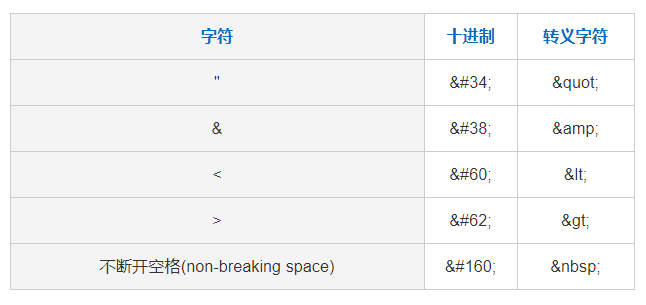
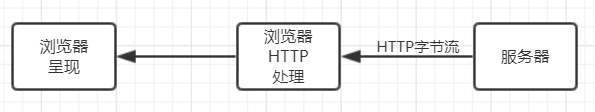
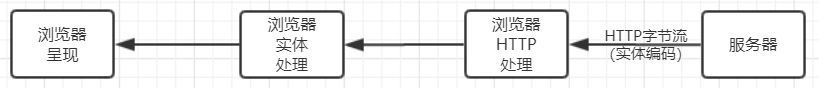

# **FreeMarker 简介**

> 教程来源： http://www.freemarker.net/
>
> 对于模板引擎属于前端还是后端。**模板引擎既可以归为前端，也可以归为后端，具体取决于它的使用场景和架构。**
> 因为模板引擎不是纯后端技术，因此将其放在前端范围内
>
> **FreeMarker** 是一个基于 Java 的模板引擎，主要用于生成动态页面或其他基于模板的内容，比如 HTML、XML、JSON 等。由于它是为 Java 设计的，其核心依赖 Java 虚拟机（JVM），所以原生支持的语言范围是与 JVM 兼容的语言，例如 Kotlin、Scala 等。

FreeMarker 是一个用 Java 语言编写的模板引擎，它基于模板来生成文本输出。其原理如下图所示：


## **第一节：FreeMarker发展历史**

FreeMarker最初的设计，是被用来在MVC模式的Web开发框架中生成HTML页面的，没有被绑定到Servlet或HTML或任意Web相关的东西上，它也可以用于非Web应用环境中。

1999年末，FreeMarker的第一个版本出现在SourceForge网站上，FreeMarker 1 版本包含了FreeMarker最基本的语法。

2002年初，引入JavaCC，FreeMarker的核心代码（语法和编译）进行重构，虽然对FreeMarker 1尽量做到向后兼容，但几乎是完全重写了，自此之后，FreeMarker进入了2.0时代。

2015年7月1日，FreeMarker经过投票进入了Apache Incubator（Apache 孵化器），开启了新的历史进程。

2018年3月21日，FreeMarker在Apache Incubator中升级为顶级项目。强者自带实力，头衔只是锦上添花。

二十年的春夏秋冬，二十年的风霜雨雪，有多少少年变成了油腻大叔，有多少梦想渐行渐远，但是FreeMarker的生命依旧青春，从历史中走来，面向未来而从容，我相信FreeMarker依然强大。

## **第二节：FreeMarker下载**

Apache FreeMarker 是一个模板引擎，它仅是一个jar包，基于模板，生成文本输出（HTML网页、电子邮件、配置文件、源代码等） 。

**1、FreeMarker依赖介绍**

FreeMarker没有其他的任何依赖，仅仅依赖Java自身。

**2、FreeMarker向后兼容**

在FreeMarker 2.3.0（2004）之前，具有不同第二版本号（例如，2.2.x和2.3.x）的版本不完全兼容。

FreeMarker 2.3.x系列在向后兼容性方面相当保守，你可以用一个新版本的FreeMarker.jar替换旧版本的FreeMarker.jar，而不会破坏任何内容。

**3、FreeMarker最新版本**

最新版本是：FreeMarker 2.3.29，发布于：2019-08-17。需要：J2SE 1.5 或更高版本

**4、FreeMarker最新版本下载链接**

**4.1、二进制文件和说明文档**

[官方二进制文件和说明文档下载链接](https://www.apache.org/dyn/closer.cgi/FreeMarker/engine/2.3.29/binaries/apache-FreeMarker-2.3.29-bin.tar.gz)

**4.2、源码文件**

[官方源码文件下载链接](https://www.apache.org/dyn/closer.cgi/FreeMarker/engine/2.3.29/source/apache-FreeMarker-2.3.29-src.tar.gz)

**5、FreeMarker maven仓库**

```xml
<dependency>
  <groupId>org.FreeMarker</groupId>
  <artifactId>FreeMarker</artifactId>
  <version>2.3.29</version>
</dependency>
```

## **第三节：FreeMarker工作原理**

**1、什么是FreeMarker？**

FreeMarker是一个用Java语言编写的模板引擎，它基于模板来生成文本输出。其原理如下图所示：


**1.1、FreeMarker模板组成部分**

FreeMarker模板文件主要由如下4个部分组成:

（1）文本：直接输出的部分

（2）注释：使用<#-- ... -->格式做注释，里面内容不会输出

（3）插值：即${...}或#{...}格式的部分，类似于占位符，将使用数据模型中的部分替代输出

（4）FTL指令：即FreeMarker指令，全称是：FreeMarker Template Language，和HTML标记类似，但名字前加#予以区分，不会输出

下面是一个FreeMarker模板的例子，包含了以上所说的4个部分：

```html
<html>
<head>
<title>Welcome to FreeMarker 中文官网</title><br> 
</head> 
<body>
<#-- 注释部分 --> 
<#-- 下面使用插值 --> 
<h1>Welcome ${user} !</h1><br> 
<p>We have these animals:<br> 
<u1>
<#-- 使用FTL指令 --> 
<#list animals as being><br> 
  <li>${being.name} for ${being.price} Euros<br> 
<#list>
<u1>
</body> 
</html> 
```

**1.2、FreeMarker与Web容器无关**

FreeMarker与Web容器无关，即在Web运行时，它并不知道Servlet或HTTP，故此FreeMarker不仅可以用作表现层的实现技术，而且还可以用于生成XML，JSP或Java等各种文本文件。

在Java Web领域，FreeMarker是应用广泛的模板引擎，主要用于MVC中的view层，生成html展示数据给客户端，可以完全替代JSP。

总之，FreeMarker是一个模板引擎，一个基于模板生成文本输出的通用工具，使用纯Java编写，模板中没有业务逻辑，外部Java程序通过数据库操作等生成数据传入模板（template）中，然后输出页面。它能够生成各种文本：HTML、XML、RTF、Java源代码等等，而且不需要Servlet环境，并且可以从任何源载入模板，如本地文件、数据库等等。

**2、FreeMarker有什么优点？**

FreeMarker的诞生是为了取代JSP。虽然JSP功能强大，可以写Java代码实现复杂的逻辑处理，但是页面会有大量业务逻辑，不利于维护和阅读，更不利于前后台分工，容易破坏MVC结构，所以舍弃JSP，选择使用FreeMarker是大势所趋。当前很多企业使用FreeMarker取代JSP，FreeMarker有众多的优点，如下所示：

（1）很好地分离表现层和业务逻辑。

JSP功能很强大，它可以在前台编写业务逻辑代码，但这也带来了一个很大的弊端——页面内容杂乱，可读性差，这将会大大增加后期的维护难度。而FreeMarker职责明确，功能专注，仅仅负责页面的展示，从而去掉了繁琐的逻辑代码。FreeMarker的原理就是：模板+数据模型=输出，模板只负责数据在页面中的表现，不涉及任何的逻辑代码，而所有的逻辑都是由数据模型来处理的。用户最终看到的输出是模板和数据模型合并后创建的。

（2）提高开发效率。

众所周知，JSP在第一次执行的时候需要转换成Servlet类，之后的每次修改都要编译和转换。这样就造成了每次修改都需要等待编译的时间，效率低下。而FreeMarker模板技术并不存在编译和转换的问题，所以就不会存在上述问题。相比而言，使用FreeMarker可以提高一定的开发效率。

（3）明确分工。

JSP页面前后端的代码写到了一起，耦合度很高，前端开发需要熟悉后台环境，需要去调试，而后台开发人员需要去做不熟悉的前端界面设计。对两者而言，交替性的工作需要花费一定的学习成本，效率低下。而使用FreeMarker后，前后端完全分离，大家各干各的，互不影响。

（4）简单易用，功能强大

FreeMarker支持JSP标签，宏定义比JSP Tag方便，同时内置了大量常用功能，比如html过滤，日期金额格式化等等。FreeMarker代码十分简洁，上手快，使用非常方便。


## **第四节：FreeMarker的用法介绍**

**FreeMarker的安装**

FreeMarker没有其他的任何依赖，仅仅依赖Java自身。

最新版本是：FreeMarker 2.3.28，发布于：2018-04-04。需要：J2SE 1.5 或更高版本

把FreeMarker的jar包添加到工程中，Maven工程添加依赖

```xml
<dependency>
  <groupId>org.FreeMarker</groupId>
  <artifactId>FreeMarker</artifactId>
  <version>2.3.28</version>
</dependency>
```

**FreeMarker工作原理**

FreeMarker是一个用Java语言编写的模板引擎，它基于模板来生成文本输出。其原理如下图所示：


**FreeMarker使用步骤：**

第一步：创建一个Configuration对象，直接new一个对象。构造方法的参数就是FreeMarker对应的版本号。

第二步：设置模板文件所在的路径。

第三步：设置模板文件使用的字符集。一般就是utf-8.

第四步：加载一个模板，创建一个模板对象。

第五步：创建一个模板使用的数据集，可以是pojo也可以是map。一般是Map。

第六步：创建一个Writer对象，一般创建一FileWriter对象，指定生成的文件名。

第七步：调用模板对象的process方法输出文件。

第八步：关闭流。

**FreeMarker的具体使用过程：**

```java
// 第一步：创建一个Configuration对象，直接new一个对象。构造方法的参数就是FreeMarker对于的版本号。
Configuration configuration = new Configuration(Configuration.getVersion());

// 第二步：设置模板文件所在的路径。
configuration.setDirectoryForTemplateLoading(new File("/WEB-INF/ftl"));

// 第三步：设置模板文件使用的字符集。一般就是utf-8.
configuration.setDefaultEncoding("utf-8");

// 第四步：加载一个模板，创建一个模板对象。
Template template = configuration.getTemplate("hello.ftl");

// 第五步：创建一个模板使用的数据集，可以是pojo也可以是map。一般是Map。
Map dataModel = new HashMap<>();
//向数据集中添加数据
dataModel.put("hello", "this is my first FreeMarker test.");

// 第六步：创建一个Writer对象，一般创建一FileWriter对象，指定生成的文件名。
Writer out = new FileWriter(new File("/hello.html"));

// 第七步：调用模板对象的process方法输出文件。
template.process(dataModel, out);

// 第八步：关闭流。
out.close();
```

**FreeMarker 的Hello World程序：**

第一步：引入jar包

第二步：编写模板文件hello.ftl

```html
<#ftl attributes={"content_type":"text/html; charset=UTF-8"}>
<?xml version="1.0" encoding="utf-8"?>
<html>
<head>
<meta http-equiv="Content-Type" content="text/html; charset=UTF-8">
<title>Insert title here</title>
</head>
<body>
${hello}!
</body>
</html>
```

第三步：编写数据模型

```java
public class TestFreeMarker {

    public static void main(String[] args) throws Exception {
        Configuration cfg = new Configuration();
        cfg.setDirectoryForTemplateLoading(new File("E:/ftl"));
        Template template = cfg.getTemplate("hello.ftl");
        Map map = new HashMap();
        map.put("hello", "Hello FreeMarker!"); 
       
        StringWriter stringWriter = new StringWriter();
        template.process(map, stringWriter);
        String resultStr = stringWriter.toString();
        System.out.println(resultStr);
        
    }
}
```

结果：

```html
<?xml version="1.0" encoding="utf-8"?>
<html>
<head>
<meta http-equiv="Content-Type" content="text/html; charset=UTF-8">
<title>Hello World</title>
</head>
<body>
Hello FreeMarker!
</body>
</html>
	
```

## **第五节：FreeMarker的HTML转义**

**1、HTML的实体转义**

HTML的转义字符有下面几个：




为什么在HTML源码中写入>，而在页面将显示为>，原理如下所示：

不带HTML实体编码的示意图：




带HTML实体编码的示意图：




**2、FreeMarker的HTML转义**

比如，某个用户把自己的用户名写成a标签，最后显示出来的用户名就是一个超链接。例如：

```java
/传递的参数
map.put("name", "<a href=\"www.baidu.com\">这是一段带有攻击性的字符串请点击</a>");
```

页面代码：

```html
<html>
<head>
<meta charset="utf-8">
<title>测试</title>

</head>
<body>
${map.name}
<br/>
</body>
</html>
```

有两种解决方案：

（1）在字符串后面加?html

```bash
${map.name?html}
```

（2）使用<#escape>转义

值得注意的就是，<#escape>仅仅只对当前文件中的值做转义，而不会去处理嵌套的其它文件（Include）和宏

```html
<#-- escape标签将Html代码作为字符串直接显示于页面 -->
<#escape x as x?html>
    <p>特殊字符串: ${map.value1}</p>
    <p>特殊字符串: ${map.value2}</p>
    <p>特殊字符串: ${map.value3}</p>
    <p>特殊字符串: ${map.value4}</p>
    <#-- 内部不需要转义则的部分使用<#noEscape>标签-->
    <p>取消转义 <#noEscape>${map.value5}</#noEscape></p>
</#escape>
```

## **第六节：FreeMarker 大于号>、小于号 <的使用 ：与标签括号<>冲突的问题**

**一、FreeMarker 解决冲突有两种方法：**

1、用符号代替，例如：> gt，>= gte，< lt，<= lte

2、加括号 <#if(x>y)>

**二、详细说明**

在FreeMarker中，比较数据的大小时候，要注意大于号（>）的使用。如果不注意，程序就会发生异常信息，如下面的例子：

```html
<#assign x = 4>
<#if x>5 >
     x >5
```

以上的方式进行比较，就会发生异常，原因是FreeMarker内部的解析处理原因，x>5中的大于号将会跟<#if中的小于号进行配对，导致解析出现问题。针对这种情况，有两种方式解决：

方法一：加上括号。

```html
<# assign x = 4>
<#if (x>5) >
     x > 5
```

方法二：使用gt符号。

```html
<# assign x = 4>
<#if x gt 5 >
     x > 5
```

**总结一下：**

使用>=和>的时候有一点小问题。FreeMarker解释>的时候可以把它当作FTL标签的结束符。为了避免这种问题，不得不将表达式放到括号内：<#if (x > y) >，另外，可以使用lt代替<，lte代替<=，gt代替>，gte代替>=。

## **第七节：FreeMarker 插值${} 的新认识**

**1、插值的定义**

插值，其表示为：${...}的格式。

**2、FreeMarker中的插值**

在FreeMarker模板语言中，插值${...}将使用数据模型中的部分替代输出。

**3、Scala中的插值**

Scala有一个很方便的特性：字符串插值。字符串插值能在字符串的字面量中内嵌变量和表达式。如下代码所示：

```scala
object Clock {
    def main(args: Array[String]){
        var n : Int = 1
        while( n <= 60 ){
            println(s"${n} second.")
            n += 1
        }
    }
}
```

在这段代码中，字符串字面量 s"${n} second."中直接使用了变量n。字符串前附加的插值操作符，神奇地完成了这一转变。而在Java中，通常需要使用显式的连接操作，比如"Hello " + n + " second."，才能达到同样的效果。

**3、MyBatis中的插值**

${}是字符串替换，往往与#{}相混淆，而#{}是预编译处理命令。#{}多用于命令场景，同理，#{}在FreeMarker中表示FreeMarker指令，即FTL指令。

## **第八节：FreeMarker assign 指令介绍**

**一、FreeMarker assign 简单使用**

assign指令用于为该模板页面创建或替换一个顶层变量，或者创建或替换多个变量等。它的最简单的语法如下:

```html
<#assign name=value [in namespacehash]>,
```

这个用法用于指定一个名为name的变量，该变量的值为value。此外，FreeMarker允许在使用assign指令里增加in子句。in子句用于将创建的name变量放入namespacehash命名空间中。

FreeMarker assign 指令用于在页面上定义一个变量，而变量又分为下面两种类型：

（1）定义简单类型

```html
<#assign name="Tom">

my name is ${name}
```

（2）定义对象类型

```html
<#assign info={"mobile":"xxxxxx","address":"china"} >

my mobile is ${info.mobile}, my address is ${info.address}
```

**二、FreeMarker assign 语法介绍（4种形式）**

```html
<#assign name1=value1 name2=value2 ... nameN=valueN>

<#assign same as above... in namespacehash>

<#assign name>
capture this
</#assign>

<#assign name in namespacehash>
capture this
</#assign>
```

**三、FreeMarker assign 多变量定义**

比如：变量 seq 存储一个序列：

```html
<#assign seq = ["foo", "bar", "baz"]>
```

比如：变量 x 中存储增长的数字：

```html
<#assign x++>
```

作为一个方便的特性，可以使用一个 assign 标记来进行多次定义，如下所示：

```html
<#assign
seq = ["foo", "bar", "baz"]
x++
```

**四、FreeMarker assign 变量+命名空间**

assign 指令在命名空间中创建变量。通常它在当前的命名空间 (也就是和标签所在模板关联的命名空间)中创建变量。但如果你是用了 in namespacehash， 那么你可以用另外一个命名空间来创建/替换变量。比如，这里你在命名空间中 /mylib.ftl 创建/替换了变量 bgColor：

```html
<#import "/mylib.ftl" as my>
<#assign bgColor="red" in my>
```

**五、FreeMarker assign 复杂变量**

assign 的极端使用是捕捉它的开始标记和结束标记中间生成的输出时。 也就是说，在标记之间打印的东西将不会在页面上显示， 但是会存储在变量中。比如：

```html
<#macro myMacro>foo</#macro>
<#assign x>
  <#list 1..3 as n>
    ${n} <@myMacro />
  </#list>
</#assign>

Number of words: ${x?word_list?size}
${x}
```

将会输出：

```
Number of words: 6
1 foo
2 foo
3 foo
```

## **第九节：FreeMarker判断对象是否为空的方法**

FreeMarker与Web容器无关，即在Web运行时，它并不知道Servlet或HTTP。它不仅可以用作表现层的实现技术，而且还可以用于生成XML，JSP或Java等。FreeMarker中显示某对象使用${name}，但如果name为null，FreeMarker就会报错。需要进行空值判断，例如需要判断对象是否为空：

```html
<#if name??>
……
</#if>
```

当然也可以通过设置默认值${name!''}来避免对象为空的错误。如果name为空，就以默认值（"!"后的字符）显示。

如果对象是user，name为user的属性的情况，user，name都有可能为空，那么可以写成${(user.name)!''}，表示user或者name为null，都显示为空。

我们知道：一个不存在的变量和一个是null值的变量，对于FreeMarker来说是一样的，都会报错的。所以，对于null或者miss value，有以下三种解决方案：

（1）!：default value operator，语法结构为：unsafe_expr!default_expr，比如 ${mouse!"No mouse."} 当mouse不存在时，返回default value；

(product.color)!"red" 这种方式，能够处理product或者color为miss value的情况；而product.color!"red"将只处理color为miss value的情况

（2）??: Missing value test operator ，测试是否为missing value

unsafe_expr?? ：product.color??将只测试color是否为null；(unsafe_expr)??：(product.color)??将测试product和color是否存在null

```html
<#if mouse??>
    Mouse found
<#else>
    No mouse found
</#if>
Creating mouse...
<#assign mouse = "Jerry">
<#if mouse??>
    Mouse found
<#else>
    No mouse found
</#if>
```

（3）?exists:旧版本的用法

以上通过三种方法介绍了FreeMarker判断对象是否为空的方法，希望大家有所收获。

## **第十节：FreeMarker数字格式化深入理解**

**FreeMarker数字格式化的必要性**

FreeMarker在解析数据格式的时候，自动默认将数字按3为分割（1，000），这个问题给操作带来一定的额外处理，解决方法有如下几种：

1、在模板中直接加.toString()转化数字为字符串，如：${languageList.id.toString()}；

2、在FreeMarker配置文件FreeMarker.properties加number_format=#或者number_format=0；

3、在模板中直接加<#setting number_format="#">或者<#setting number_format="0">，如：

```html
<#if AdminLanguagePaginationMsg?exists> 
<#setting number_format="#">
```

**一、使用内建函数c**

不管其表现形式是怎样的，例如："123,456.123,456"、"123456.123456"、"000123456.123456000"、"123,456.123456"、"1,2345,6.123456"等，只要小数分割符是'.'，它就能转化成计算机能够识别的字符串形式，而且都是123456.123456，计算机处理的时候是没有那些所谓的千位分隔符的（空格或逗号），而且计算机支持的最大的小数点后面的位数是16位，目前来说，已经够我们用了。

假设strmun是一个字符串形式的数字，则可以这样写${strnum?c}。例如：${"123,456.123,456"?c}值为123456.123456

**二、使用预定义的数字格式**

FreeMarker中预定义了三种数字格式：number，currency（货币）和percent(百分比)，其中number为默认的数字格式转换。例如：

```bash
<#assign tempNum=20>

${tempNum}    
${tempNum?string.number}或${tempNum?string("number")}  //结果为20
${tempNum?string.currency}或${tempNum?string("currency")} //结果为￥20.00
${tempNum?string. percent}或${tempNum?string("percent")} //结果为2,000%
```

实际上我们在日常的开发过程中遇到的比较多的问题就是货币的展示，对于货币而言，在不同的地区是有不同的符号的。因此，FreeMarker为我们提供了方便的方式实现。

```
<#assign x=42> 
${x?string.currency}
```

上述的表达式最终的结果将是￥42.00，这个功能看起来很不错！

**三、使用类似于Java中数字格式语法形式**

例如："0.#"，左边的'0'的个数代表整数部分最少为多少位，右边'#'的个数代表小数部分最多为多少位。

例如：",##0.0#" 表示整数部分的千位分割符是','，小数部分最多保留两位，最少保留一位；例如："0.##%"以百分比的形式表示，小数部分最多两位。

假设strnum是一个数字，则可以这样写${strnum?string(",##0.0#")}，例如${123456.123456?string(",##0.0#")}值为123,456.12

**四、局部设置**

如果在某个页面，或者某几个页面（其它页面可import进来），用到的数字格式化是相同的，可考虑统一配置数字的格式化形式

只需在用到需要格式化的数字之前设置就可以了，格式如下：<#settingnumber_format=",##0.##">其中",##0.##"的内容是采用类似于Java中数字格式的语法形式，也就是以上的第三点。

注意：

如果用在一个页面，则整个页面默认就是那种格式，除非用string函数覆盖了默认的格式，同样的，如果放在一个公共的页面，其它页面只要include它，也会是同样的格式。

**五、全局设置**

在所有的页面都默认提供数字的格式化形式。针对spring环境下，在FreeMarker的配置文件中设置其默认的数字格式化形式，如下：

```html
<propertyname="FreeMarkerSettings"> 
<props> 
..... 
<propkey="number_format">0.##</prop> 
...... 
</props> 
</property>
```

**六、四舍五入**

（1）round：四舍五入

（2）floor：向下取整

（3）ceiling：向上取整

```html
<#--FreeMarker中的round、floor和ceiling数字的舍入处理-->
<#--round:四舍五入-->
<#--floor:向下取整-->
<#--ceiling:向上取整-->

<#assign numList = [12,0.23,89,12.03,69.56,45.67,-0.56,-8.05,-89.56,4.69]/>
<#list numList as num>
 ${num} ?round=${num?round} ?floor=${num?floor} ?ceiling=${num?ceiling}
</#list>
```

结果为：

```
12 ?round=12 ?floor=12 ?ceiling=12
0.23 ?round=0 ?floor=0 ?ceiling=1
89 ?round=89 ?floor=89 ?ceiling=89
12.03 ?round=12 ?floor=12 ?ceiling=13
69.56 ?round=70 ?floor=69 ?ceiling=70
45.67 ?round=46 ?floor=45 ?ceiling=46
-0.56 ?round=-1 ?floor=-1 ?ceiling=0
-8.05 ?round=-8 ?floor=-9 ?ceiling=-8
-89.56 ?round=-90 ?floor=-90 ?ceiling=-89
4.69 ?round=5 ?floor=4 ?ceiling=5
```

## **第十一节：FreeMarker list 指令使用介绍：遍历和排序**

**一、FreeMarker list 指令简单介绍**

要想在FreeMarker中遍历list，必须通过使用list指令，即：<#list sequence as item>。其中sequence是集合(collection)的表达式，item是循环变量的名字，不能是表达式。当在遍历sequence时，会将遍历变量的值保存到item中。举个例子说明一下：<#list userList as user>。userList中封装了很多个User对象，我们在遍历userList时候，会将遍历的User对象的值，保存到上述的user变量中。那么在取值时，我们可以通过${user.userName }来获取User对象的userName属性值。

FreeMarker list 指令还隐含了两个循环变量：

（1）item_index：当前迭代项在所有迭代项中的位置，是数字值。

（2）item_has_next：用于判断当前迭代项是否是所有迭代项中的最后一项。

**注意：在使用上述两个循环变量时，一定要将item换成你自己定义的循环变量名，item其实就是前缀罢了。例如，如果你使用<# list list as l>定义，那么就要使用l_index，l_has_next。在循环过程中，如果您想跳出循环，那么可以使用结合break指令，即<#break>来完成。**

**二、FreeMarker list 指令的遍历操作**

2.1 简单遍历list:

```html
<#list userList as user>
    用户名：${user.userName}，密码：${user.userPassword}，年龄: ${user.age}
</#list>
```

2.2 FreeMarker遍历list并应用list隐含变量item_index：

```html
<#list userList as user>
    第${user_index+1}个用户用户名：${user.userName}，密码：${user.userPassword}，年龄: ${user.age}
</#list>
```

2.3 FreeMarker遍历list并应用list隐含变量item_has_next：

```html
<#list userList as user>
    用户名：${user.userName}，密码：${user.userPassword}，年龄: ${user.age}
    <#if !user_has_next>共有${userList?size}，最后一个用户是:${user.userName}</#if>
</#list>
```

**三、FreeMarker list 进行排序的函数介绍**

通常我们的排序操作都是通过DAO层来实现的，如果我们想随时更改我们的排序，那么就必须修改我们的DAO层代码，确实不方便。但FreeMarker为我们提供了这样的排序方法，解决了这个问题。

3.1 sort升序排序函数

sort对序列(sequence)进行排序，要求序列中的变量必须是：字符串（按首字母排序），数字，日期值。

```html
<#list list?sort as l>…
```

3.2 sort_by函数

sort_by有一个参数，该参数用于指定想要排序的子变量，排序是按照变量对应的值进行排序，如：<#list userList?sort_by("age") as user>。age是User对象的属性，排序是按age的值进行的。

3.3 reverse降序排序

函数<#list list?reverse as l>，reverse使用同sort相同。reverse还可以同sort_by一起使用如：想让用户按年龄降序排序，那么可以这个样写<#list userList?sort_by("age")?reverse as user>。

**四、FreeMarker list 进行排序**

FreeMarker遍历list并按用户年龄升序排序

```html
<#list userList?sort_by("age") as user>
用户名：${user.userName}，密码：${user.userPassword}，年龄: ${user.age}
</#list>
```

FreeMarker遍历list并按用户年龄降序排序

```html
<#list userList?sort_by("age")?reverse as user>
用户名：${user.userName}密码：${user.userPassword}年龄: ${user.age}
```

FreeMarker遍历list当用户年龄大于21岁时，停止输出，list中应用break:

```html
<#list userList?sort_by("age")?reverse as user>
    用户名：${user.userName}密码：${user.userPassword}年龄: ${user.age}
    <#if (user.age>21) ><#break></#if>
</#list>
```

## **第十二节：FreeMarker macro 宏定义**

**一、什么是宏？**

宏是和某个变量关联的模板片断，以便在模板中通过用户定义的指令使用该变量，而该变量表示模板片段。宏在FreeMarker模板中使用macro指令定义。

**二、宏的基本用法**

宏是和某个变量关联的模板片断，以便在模板中通过用户定义的指令使用该变量，而该变量表示模板片段。

```html
<#macro greet>     
     <font size="+2">Hello World!</font>     
</#macro>   
```

调用宏时，与使用FreeMarker的其他指令类似，只是使用@替代FTL标记中的#：<@greet>< /@greet>

**三、宏变量定义参数**

在macro指令中可以在宏变量之后定义参数，如：

```html
<#macro greet person>     
    <font size="+2">Hello ${person}!</font>     
</#macro>  
```

可以这样使用这个宏变量： <@greet person="Fred" />

但是下面的代码具有不同的意思：

```html
<@greet person=Fred />
```

这意味着将Fred变量的值传给person参数，该值不仅是字符串，还可以是其它类型，甚至是复杂的表达式。

宏可以有多参数，下面是一个例子：

```html
<#macro greet person color>     
 <font size="+2" color="${color}">Hello ${person}!</font>     
</#macro> 
```

可以这样使用该宏变量，其中参数的次序是无关的： <@greet person="Fred" color="black"/>

可以在定义参数时指定缺省值，否则，在调用宏的时候，必须对所有参数赋值：

```html
<#macro greet person color="black"> 
    <font size="+2" color="${color}">Hello ${person}!</font> 
</#macro>
```

注意：宏的参数是局部变量，只能在宏定义中有效。

**四、FreeMarker宏的嵌套内容**

FreeMarker的宏可以有嵌套内容，<#nested>指令会执行宏调用指令开始和结束标记之间的模板片断，举一个简单的例子：

```html
<#macro border> 
    <table border=4 cellspacing=0 cellpadding=4>
    <tr>
    <td> 
        <#nested>
    </td>        
    </tr>
    </table> 
</#macro>
```

执行宏调用： <@border>Hello World!< /@border>，输出结果：

```html
<table border=4 cellspacing=0 cellpadding=4>
<tr>
<td> 
    Hello World!
</td>        
</tr>
</table> 
```

4.1、<#nested>指令可以被多次调用，每次都会执行相同的内容。

```html
<#macro do_thrice> 
    <#nested> 
    <#nested> 
    <#nested> 
</#macro>
   
<@do_thrice> 
    Anything. 
</@do_thrice>
```

输出结果：Anything.Anything.Anything.

4.2、嵌套内容可以是有效的FTL，下面是一个有些复杂的例子，我们将上面三个宏组合起来：

```html
<@border> 
    <ul> 
    <@do_thrice> 
      <li><@greet person="Joe"/> 
    </@do_thrice> 
    </ul> 
</@border>
```

输出结果：

```html
<table border=4 cellspacing=0 cellpadding=4>
<tr>
<td> 
    <ul> 
      <li><font size="+2">Hello Joe!</font> 
      <li><font size="+2">Hello Joe!</font> 
      <li><font size="+2">Hello Joe!</font> 
    </ul> 
</td>
</tr>
</table>
 
```

4.3、宏定义中的局部变量对嵌套内容是不可见的，例如：

```html
<#macro repeat count> 
    <#local y = "test"> 
    <#list 1..count as x> 
      ${y} ${count}/${x}: <#nested> 
    </#list> 
  </#macro> 

<@repeat count=3>${y?default("?")} ${x?default("?")} ${count?default("?")}</@repeat> 
```

输出结果：

```
test 3/1: ? ? ?
test 3/2: ? ? ?
test 3/3: ? ? ?
```

4.4、在宏定义中使用循环变量

nested指令也可以有循环变量（循环变量的含义见下节），调用宏的时候在宏指令的参数后面依次列出循环变量的名字，格式如下：

```html
<@macro_name paramter list; loop variable list[,]>
```

例如：

```html
<#macro repeat count> 
    <#list 1..count as x> 
      <#nested x, x/2, x==count> 
    </#list> 
</#macro> 
  
<@repeat count=4 ; c, halfc, last> 
    ${c}. ${halfc}<#if last> Last!</#if> 
</@repeat> 
```

这里count是宏的参数，c，halfc，last则为循环变量，输出结果：

```
0.5
1
1.5
2
Last!
```

## **第十三节：FreeMarker的命名空间**

通常情况，FreeMarker只使用一个命名空间，称为主命名空间，但为了创建可重用的宏或其它变量的集合（通常称库），必须使用多命名空间，其目的是防止同名冲突。

**1、创建库**

下面是一个创建库的例子（假设保存在lib/my_test.ftl中）：

```html
<#macro copyright date> 
    <p>Copyright (C) ${date} FreeMarker中文官网. All rights reserved. 
    <br>Email: ${mail}
    </p> 
</#macro> 
<#assign mail = "admin@FreeMarker.cn"> 
```

代码说明：上面的库定义了一个宏变量和一个普通变量mail。

**2、导入库**

使用import指令导入库到模板中，FreeMarker会为导入的库创建新的名字空间，并可以通过import指令中指定的散列变量访问库中的变量，如下所示：

```html
<#import "/lib/my_test.ftl" as my> 
  
<#assign mail="root@FreeMarker.cn"> 
 
<@my.copyright date="2000-2020"/> 

${my.mail} 

${mail} 
```

输出结果：

```html
<p>Copyright (C) 2000-2020 FreeMarker中文官网. All rights reserved. 
    <br>Email: admin@FreeMarker.cn
</p> 

admin@FreeMarker.cn

root@FreeMarker.cn
```

可以看到例子中使用的两个同名变量并没有冲突，因为它们位于不同的名字空间。还可以使用assign指令在导入的命名空间中创建或替代变量，下面是一个例子：

```html
<#import "/lib/my_test.ftl" as my> 

${my.mail} 

<#assign mail="root@other.com" in my> 

${my.mail}
```

输出结果：

```
admin@FreeMarker.cn

root@other.com
```

**3、数据模型中的变量**

数据模型中的变量任何地方都可见，也包括不同的命名空间，如下所示：

```html
<#macro copyright date> 
    <p>Copyright (C) ${date} ${user}. All rights reserved.</p> 
</#macro> 
  
<#assign mail = "${user}@FreeMarker.cn"> 
```

假设数据模型中的user变量的值是admin，则下面的代码：

```html
<#import "/lib/my_test.ftl" as my> 
<@my.copyright date="2000-2020"/> 
${my.mail} 
```

输出结果：

```
<p>Copyright (C) 2000-2020 admin. All rights reserved.</p> 
admin@FreeMarker.cn
```

## **第十四节：FreeMarker模版中的变量详解**

在模板中定义的变量有三种类型：

plain变量：可以在模板的任何地方访问，包括使用include指令插入的模板，使用assign指令创建和替换。

局部变量：在宏定义体中有效，使用local指令创建和替换。

循环变量：只能存在于指令的嵌套内容，由指令（如list）自动创建；宏的参数是局部变量，而不是循环变量

局部变量隐藏（而不是覆盖）同名的plain变量；循环变量隐藏同名的局部变量和plain变量，下面是一个例子：

```html
<#assign x = "plain"> 
1.${x}  

<#macro test> 
    2. ${x}  
    <#local x = "local"> 
    3. ${x}  
    <#list ["loop"] as x> 
	 4. ${x}  
    </#list> 
    5. ${x}  
</#macro>

<@test/> 
    
6. ${x}  

<#list ["loop"] as x> 
    7. ${x} 
    <#assign x = "plain2"> 
    8. ${x}  
</#list> 
  
9. ${x}  
  
```

输出结果：

```
1. plain 
2. plain 
3. local 
4. loop 
5. local 
6. plain 
7. loop 
8. loop 
9. plain2 
```

内部循环变量隐藏同名的外部循环变量，如：

```html
<#list ["loop1"] as x> 
    ${x} 
    <#list ["loop2"] as x> 
      ${x} 
      <#list ["loop3"] as x> 
        ${x} 
      </#list> 
      ${x} 
    </#list> 
    ${x} 
</#list> 
```

输出结果：

```
loop1 
    loop2 
      loop3 
    loop2 
  loop1 
  
```

## **第十五节：FreeMarker模板和数据模型**

为模板准备的数据整体被称作为数据模型。数据模型是树形结构，就像硬盘上的文件夹和文件，在视觉效果上， 数据模型可以是：

```bash
(root)
  |
  +- user = "Big Joe"
  |
  +- latestProduct
      |
      +- url = "products/greenmouse.html"
      |
      +- name = "green mouse"

	  
```

模板 + 数据模型 = 输出，但是模板中的变量会隐藏（而不是覆盖）数据模型中同名变量，如果需要访问数据模型中的同名变量，使用特殊变量global，下面的例子假设数据模型中的user的值是Big Joe：

```html
<#assign user = "Joe Hider"> 

${user}          <#-- prints: Joe Hider --> 
${.global.user} <#-- prints: Big Joe --> 
```

