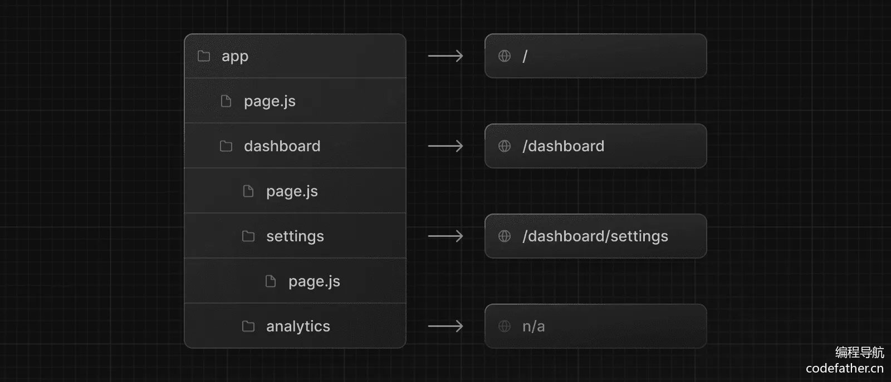
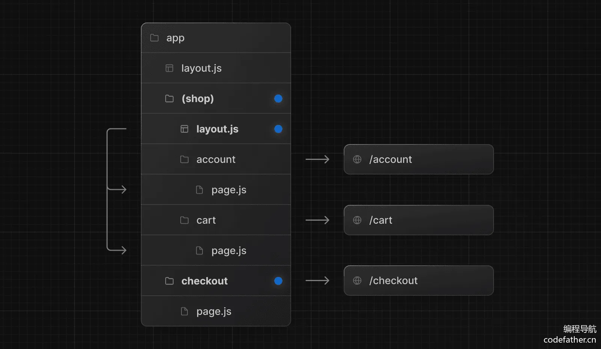

# Next.js开发规范

> 来自 智能面试刷题平台项目 第三期直播

对于一个新项目，定义统一的开发规范是至关重要的。一般我们可以通过使用的技术框架的官方文档找到官方推荐的 **最佳实践**。比如可以在 Next.js 官方文档搜索 “best practices”：


这种方式适合有一定水平和文档阅读能力的同学，下面鱼皮给大家分享一些开发规范。

## 1、约定式路由

Next.js 使用 **约定式路由**，根据文件夹的结构和名称，自动将对应的 URL 地址映射到页面文件。

常见的几种路由规则如下：

1）基础规则：以 app 目录作为根路径，根据文件夹的名称和嵌套层级，自动映射为 URL 地址。注意，只有目录下直接包含 page 文件（js、jsx、ts、tsx 都支持），才会被识别为路由。



2）路由组：可以通过 `(xxx)` 语法，创建一个路由组，不会被转化为路径，可用于对路由进行分组管理，比如同组路由使用同一套布局。



3）动态路由：可以通过 `[xxx]` 语法，让多个不同参数的 URL 复用同一个页面，比如 `app/question/[questionId]/page.tsx` 中 questionId 就是动态路由参数，可以匹配 `/question/1`、`/question/2` 等 URL 地址，在页面中可以获取到 questionId 并加载不同的题目。


```tsx
export default function Page({ params }: { params: { questionId: string } }) {
  return <div>我的题目: {params.questionId}</div>
}
```

以上只是 Next.js 的几种常用路由规则，还有其他的规则，详情可以见 Next.js 的官方文档：https://nextjs.org/docs/app/building-your-application/routing

## 2、静态资源

Next.js 约定在 `/public` 目录下存放静态资源。在其中新建 assets 目录，可以在里面存放图片等静态资源文件，比如网站的 Logo。

对应官方文档：https://nextjs.org/docs/app/building-your-application/optimizing/static-assets


然后就可以用 Next.js 的 `Image` 组件加载静态资源，比如：

```tsx
<Image src={`/assets/logo.png`} alt={alt} width="64" height="64" />
```

Next.js 会针对该组件进行特定的图像优化，提升性能。

注意，某些特殊的、常用的元信息文件不是放在 public 目录下，而是应该根据特定规则放在 app 目录下！

对应官方文档：https://nextjs.org/docs/app/api-reference/file-conventions/metadata

比如将 favicon.ico 放到 app 的根目录下，可展示站点小图标：


阿里云盘：https://www.alipan.com/s/S2xSEgiAMJs 提取码: 86ai

将 robots.txt 放到 app 的根目录下，可用于告诉搜索引擎爬虫能否访问特定的页面、以及站点地图的地址，比如：

```tsx
User-Agent: *
Allow: /
Disallow: /private/

Sitemap: https://mianshiya.com/sitemap.xml
```

## 3、文件组织形式

首先，项目中的每个页面和组件都是单独的文件夹。

基于 Next.js 的约定式路由，我们每个页面目录内需要添加 `page.tsx` 页面文件和 index.css 样式文件；每个组件目录内添加 `index.tsx` 页面文件和 index.css 样式文件。

对于项目中多页面公用的组件，放在 `src/components` 目录下；对于某个页面私有的组件，放在该页面的 components 目录下。

## 4、页面开发规范

Next.js 支持 React 的语法，可以用函数的方式声明页面和组件。每个页面的根元素必须有 id、每个组件根元素必须有 className，用于控制样式和快速定位。

**为了区分服务端和客户端渲染，每个页面（或组件）都必须在开头显示编写 "use client" 或 "use server"**

比如定义一个客户端渲染的页面，代码如下：

```tsx
"use client";
// 引入样式
import "./index.css";

// 主页
export default function HomePage() {
  return (
    <main id="homePage">
      <div>
        程序员鱼皮x编程导航的项目教程
      </div>
    </main>
  );
}
```

2）定义组件的时候，需要使用 TypeScript 声明组件属性的类型，比如：

```tsx
"use client";
import { Viewer } from "@bytemd/react";
import "./index.css";

interface Props {
  value?: string;
}

const MdViewer = (props: Props) => {
  const { value = "" } = props;

  return (
    <div className="md-viewer">
      <Viewer value={value} plugins={plugins} />
    </div>
  );
};

export default MdViewer;
```

## 5、其他注意事项

1）开发时要严格注意 TypeScript 的类型和编辑器的错误提示，并且定期打包构建。因为 Next.js 的构建要求非常严格，稍有不慎就会报错。构建报错的话，注意查看和处理构建中的报错信息。

2）在项目中慎用 window 等浏览器环境才支持的对象，服务端无法使用。注意保证客户端渲染页面和服务端渲染页面的一致性，否则会出现水合错误。

# Next.js中约定好的文件

> 内容来自ChatGPT

在 **Next.js** 中，除了 `page.tsx` 文件外，还有一些已经约定好具有特定功能的文件和文件夹结构。这些文件/文件夹具有特殊的功能或行为，Next.js 会根据它们的位置和用途进行自动处理。

以下是 Next.js 中常见的约定：

------

## 1. **`layout.tsx`**

- **功能**：定义应用程序的布局。

- **作用域**：作用于当前目录及其子目录的所有页面。

- 位置

  ：可以在 

  ```
  app
  ```

   文件夹的任意子目录中创建，例如：

  ```
  /app
    /dashboard
      layout.tsx
      page.tsx
  ```

- 示例

  ：

  ```tsx
  // layout.tsx
  export default function DashboardLayout({ children }: { children: React.ReactNode }) {
    return (
      <div>
        <header>Dashboard Header</header>
        <main>{children}</main>
      </div>
    );
  }
  ```

------

## 2. **`loading.tsx`**

- **功能**：定义加载状态页面（**Loading UI**）。

- **作用域**：适用于当前目录及其子目录的所有页面，显示在数据加载过程中。

- **位置**：如 `/app/dashboard/loading.tsx`。

- 示例

  ：

  ```tsx
  // loading.tsx
  export default function Loading() {
    return <div>Loading...</div>;
  }
  ```

------

## 3. **`error.tsx`**

- **功能**：定义错误边界的 UI。

- **作用域**：适用于当前目录及其子目录的所有页面，用于捕获运行时错误。

- **位置**：如 `/app/dashboard/error.tsx`。

- 示例

  ：

  ```tsx
  // error.tsx
  'use client';
  
  export default function Error({ error, reset }: { error: Error; reset: () => void }) {
    return (
      <div>
        <h2>Something went wrong!</h2>
        <button onClick={() => reset()}>Try again</button>
      </div>
    );
  }
  ```

------

## 4. **`not-found.tsx`**

- **功能**：定义 404（找不到页面）时显示的内容。

- **作用域**：适用于当前目录及其子目录的所有页面。

- **位置**：如 `/app/dashboard/not-found.tsx`。

- 示例

  ：

  ```tsx
  // not-found.tsx
  export default function NotFound() {
    return <h1>Page not found</h1>;
  }
  ```

------

## 5. **`head.tsx`**

- **功能**：设置当前页面的 `<head>` 内容，例如 `title` 和 `meta` 标签。

- **作用域**：仅作用于当前目录的页面。

- **位置**：如 `/app/dashboard/head.tsx`。

- 示例

  ：

  ```tsx
  // head.tsx
  export default function Head() {
    return (
      <>
        <title>Dashboard</title>
        <meta name="description" content="This is the dashboard page" />
      </>
    );
  }
  ```

------

## 6. **`global.css` 和模块化 CSS 文件**

- **功能**：设置全局样式或模块化样式。

- 文件约定

  ：

  - `global.css`：在 `/app` 文件夹外的 `styles` 文件夹中定义全局样式。
  - `[name].module.css`：模块化 CSS 文件，用于作用于特定组件。

- 示例

  ：

  ```
  /styles/global.css
  /styles/Button.module.css
  ```

------

## 7. **`middleware.ts`**

- **功能**：用于拦截请求并进行操作，例如重定向、身份验证等。

- **作用域**：全局应用程序级别，或者特定路径。

- **位置**：在项目根目录中，例如 `/middleware.ts`。

- 示例

  ：

  ```ts
  // middleware.ts
  import { NextResponse } from 'next/server';
  
  export function middleware(request: Request) {
    const url = request.nextUrl.clone();
    if (url.pathname === '/dashboard') {
      return NextResponse.redirect(new URL('/login', request.url));
    }
  }
  ```

------

## 8. **`route.ts`**

- **功能**：定义 API 路由（基于文件系统的 API）。

- **作用域**：`/app` 文件夹的子目录中定义的 `route.ts` 文件。

- 位置

  ：

  ```
  /app/api/hello/route.ts
  ```

- 示例

  ：

  ```ts
  // route.ts
  import { NextResponse } from 'next/server';
  
  export async function GET() {
    return NextResponse.json({ message: 'Hello, world!' });
  }
  ```

------

## 9. **`robots.txt` 和 `sitemap.xml`**

- 功能

  ：SEO 文件。

  - `robots.txt`：指定搜索引擎爬虫的行为。
  - `sitemap.xml`：提供站点的 URL 列表。

- **位置**：通常位于 `public` 文件夹中。

- 示例

  ：

  ```
  /public/robots.txt
  /public/sitemap.xml
  ```

------

## 10. **`favicon.ico` 和静态资源**

- **功能**：定义站点的图标以及其他静态资源。

- **位置**：通常位于 `public` 文件夹中。

- 示例

  ：

  ```
  /public/favicon.ico
  /public/images/logo.png
  ```

------

## 11. **`next.config.js`**

- **功能**：配置 Next.js 应用程序的行为，例如构建、优化、国际化等。

- **位置**：项目根目录。

- 示例

  ：

  ```js
  // next.config.js
  module.exports = {
    reactStrictMode: true,
    images: {
      domains: ['example.com'],
    },
  };
  ```

------

这些约定好的文件和目录结构使得 Next.js 应用更容易组织和扩展，同时减少了开发者需要编写样板代码的负担。

# Next.js中客户端组件和服务器组件对比

## 总体对比

| **特性**            | **客户端组件（Client Components）**                  | **服务器组件（Server Components）**            |
| ------------------- | ---------------------------------------------------- | ---------------------------------------------- |
| **运行环境**        | 浏览器                                               | 服务器                                         |
| **数据获取**        | 通过客户端 API 或异步请求获取数据                    | 可以直接访问数据库、API 或文件系统             |
| **状态管理**        | 使用 `useState`、`useReducer` 等                     | 不支持                                         |
| **事件处理**        | 支持（如 `onClick`）                                 | 不支持                                         |
| **生命周期方法**    | 支持 `useEffect`、`useLayoutEffect` 等               | 不支持                                         |
| **性能优化**        | 需要发送更多 JavaScript                              | 生成 HTML，减少客户端 JavaScript               |
| **浏览器 API 使用** | 支持（如 `window`、`document`、`localStorage`）      | 不支持                                         |
| **适用场景**        | 动态交互、多状态页面                                 | 静态内容、SEO 优化、多数据页面                 |
| **标记方式**        | 需要在顶部添加 `use client`                          | 默认（无需显式标记）                           |
| **钩子支持情况**    | 支持所有 React 钩子，包括 `useState`、`useEffect` 等 | 仅支持与服务器端静态行为相关的钩子（如 `use`） |

------

## 钩子的具体使用对比

| **钩子**                  | **客户端组件**                | **服务器组件**                   |
| ------------------------- | ----------------------------- | -------------------------------- |
| `useState`                | 用于管理组件内部状态          | 不支持                           |
| `useReducer`              | 用于复杂状态管理              | 不支持                           |
| `useEffect`               | 用于处理副作用，例如订阅事件  | 不支持                           |
| `useLayoutEffect`         | 用于在 DOM 完成布局后执行代码 | 不支持                           |
| `useRef`                  | 用于访问 DOM 节点或保存值     | 不支持                           |
| `useContext`              | 支持动态上下文的访问和更新    | 支持只读上下文（不能动态更新）   |
| `useMemo` / `useCallback` | 支持性能优化，缓存函数或值    | 不支持                           |
| `use`                     | 不适用                        | 支持，用于处理异步数据或 Promise |