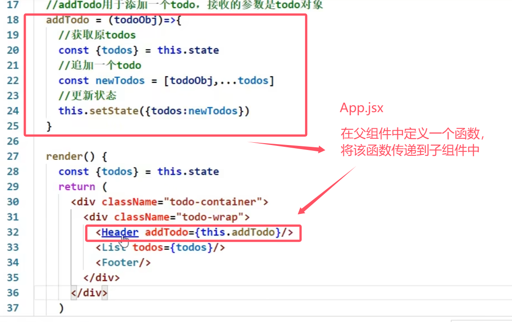

## 第3章 react应用（基于react脚手架）

使用脚手架开发的项目：模块化、组件化、工程化

### 3.1 前期准备

#### 3.1.1 安装node.js及npm

[安装教程](https://blog.csdn.net/ZHANGYANG_1109/article/details/121229581)

1. 下载.msi安装包 [node官网](http://nodejs.cn/download/)
2. 安装路径： D:\nodejs\
3. 查看是否安装成功：win+r输入cmd，输入命令node；查看npm版本 npm -v。node.js安装时会自动安装npm
4. 改变npm下载的模块包的默认存储地址：
   npm config set prefix “D:\nodejs\node_global”
   更改默认缓存位置：npm config set cache “D:\nodejs\node_cache”
   测试：npm list -global或者npm config get prefix或者npm config get cache
5. 更改环境变量
   控制面板–系统–高级系统设置–高级–环境变量
   1） 用户变量 path 中把 C:\Users\Administrator\AppData\Roaming\npm;—改为----D:\nodejs\node_global
   2）在系统变量中 新增变量NODE_PATH----- D:\nodejs\node_global\node_modules

**安装cnpm：** npm install -g cnpm --registry=https://registry.npm.taobao.org
**安装yarn：** 不推荐用npm i -g yarn 安装（但我是这样装的）
react扩展程序： **React Developer Tools**（facebook）

*问题：*

1. 安装了cnpm之后，才成功安装了 cnpm i -g create-react-app
2. cmd必须得以管理员模式运行才能使用npm命令。解决方式是将vscode以管理员模式运行，并用vscode运行npm命令

**全局安装react脚手架：** npm i -g create-react-app （不成功），得用 cnpm i -g create-react-app
**创建项目：** 切换到想创建项目的文件夹，使用命令create-react-app app_name

*换源：* 在这里建议把npm换源，使用国内镜像创建项目。因为使用脚手架配置项目的时候，需要下载的依赖实在太多，不换源的话很可能中途卡住就失败了。（没换）
*换源方式：* npm config set registry https://registry.npm.taobao.org
验证是否换源成功：npm config get registry
显示出上述地址的话就是换源成功了
[npm cnpm npx nvm区别](https://zhuanlan.zhihu.com/p/54998362)

**知识点：**

- vscode安装时勾选open with code
- react是SPA应用
- index.html文件中，%PUBLIC_URL% 代表public文件夹的路径
- robots.txt 爬虫规则文件
- export name 分别暴露；export default name 默认暴露
- import React，{Component} from ‘react’ :{Component}在react文件里分别暴露了

#### 3.1.2 react脚手架项目结构

- **public ---- 静态资源文件夹**
  favicon.icon ------ 网站页签图标
  index.html -------- 主页面
  logo192.png ------- logo图
  logo512.png ------- logo图
  manifest.json ----- 应用加壳的配置文件
  robots.txt -------- 爬虫协议文件
- **src ---- 源码文件夹**
  App.css -------- App组件的样式，App.js里引用
  App.js --------- App组件，子组件可以都写在components文件夹里，子组件文件夹首字母大写。路由组件写在pages文件夹中
  App.test.js ---- 用于给App做测试
  index.css ------ 样式，通用样式，入口文件里引用
  index.js ------- 入口文件
  logo.svg ------- logo图
  reportWebVitals.js-------页面性能分析文件(需要web-vitals库的支持)
  setupTests.js-------组件单元测试的文件(需要jest-dom库的支持)

**注意：**
组件js文件除了**首字母大写**，还可以将后缀改为**jsx**，来将组件和普通js文件进行区分

#### 3.1.3 样式模块化

```jsx
import name from './name.module.css'
className={name.title}
```

基本上不用，而是用[less](https://less.bootcss.com/)嵌套

- 安装VSCode插件 **ES7+ React/Redux/React-Native snippets**
  

#### 3.1.4 功能界面的组件化编码流程（通用）

1. 拆分组件: 拆分界面,抽取组件
2. 实现静态组件: 使用组件实现静态页面效果
3. 实现动态组件
   3.1 动态显示初始化数据
      3.1.1 数据类型
      3.1.2 数据名称
      3.1.3 保存在哪个组件?
   3.2 交互(从绑定事件监听开始)

### 3.2 案例：组件的组合使用——TodoList

#### 3.2.1 注意事项

- List给Item用props传递参数：

```jsx
todos.map(todo=>{
	return <Item key={todo.id} {...todo}/>
	})
```

其中 `{todos}=this.props` ，是 `todos`解构对象成数组，即 todos=[{},{}],todo代表todos数组中的每个元素（对象）。

`{...todo}`是在展开对象。原生js中，对象不能使用拓展运算符（数组和可遍历的伪数组可以）。而`{...obj}`是ES6语法，是一个复制对象。但是在这里，`{...todo}`并不是复制对象，因为这里的`{}`表示括号里面要写js表达式了，所以真正写的还是`...todo`，这里react+babel就允许用展开运算符展开对象，不能随便使用（不能用`console.log()`查看）,仅仅适用于标签传递数据时。

- 父组件向子组件传数据：直接在子组件标签中添加键值对形式的数据（`props`）
- **子组件向父组件传递数据**：父组件通过props给子组件传递一个函数，子组件在想要传递数据给父组件时，调用该函数
- 
  

- 生成时间戳:`Date.now()`
- UUID：生成唯一时间戳的库
  npm i uuid （库比较大）
  **npm i nanoid**（库小，很快安装）/ yarn add nanoid
  用法：

```jsx
import {nanoid} from 'nanoid'
//调用
nanoid()
```

- `str.trim()` 去除字符串的头尾空格
- `onMouseLeave={this.handleMouse(false)}`：小括号调用了函数，定义函数时要柯里化
- 状态在哪里，操作状态的方法就在哪里
  
- `window.confirm("确定删除吗")`：返回true或false
- 在react中，`<input type="checkbox"/>`若加了`checked`属性，则必须加`onChange`事件，不然无法改变勾选状态。`defaultChecked`只在第一次起效果。

#### 3.2.2 todoList案例相关知识点

1. 拆分组件、实现静态组件，注意：`className`、`style`的写法
2. 动态初始化列表，如何确定将数据放在哪个组件的`state`中？
   1）某个组件使用：放在其自身的`state`中
   2）某些组件使用：放在他们共同的父组件`state`中（官方称此操作为：状态提升）
3. 关于父子之间通信：
   1）【父组件】给【子组件】传递数据：通过props传递
   2）【子组件】给【父组件】传递数据：通过props传递，要求父提前给子传递一个函数
4. 注意`defaultChecked` 和 `checked`的区别，类似的还有：`defaultValue` 和 `value`
5. 状态在哪里，操作状态的方法就在哪里

