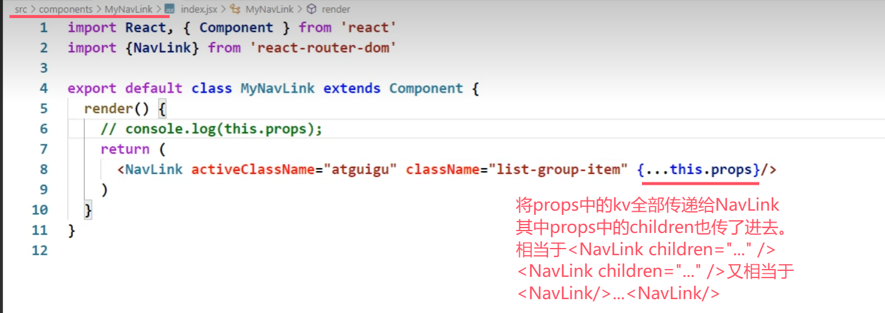
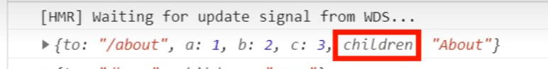
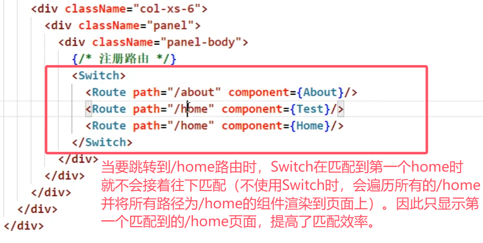
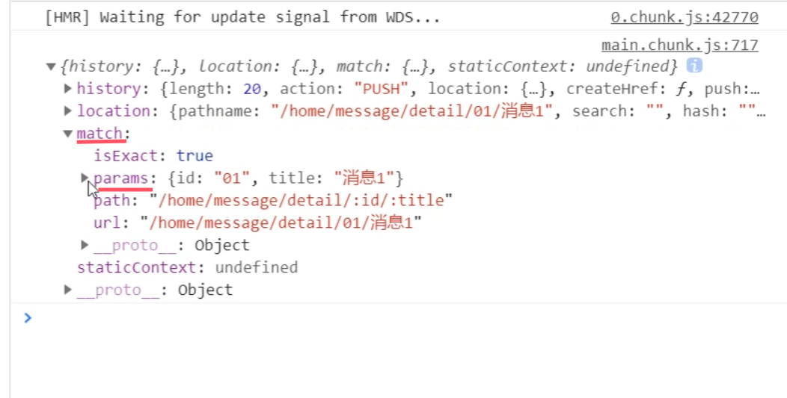
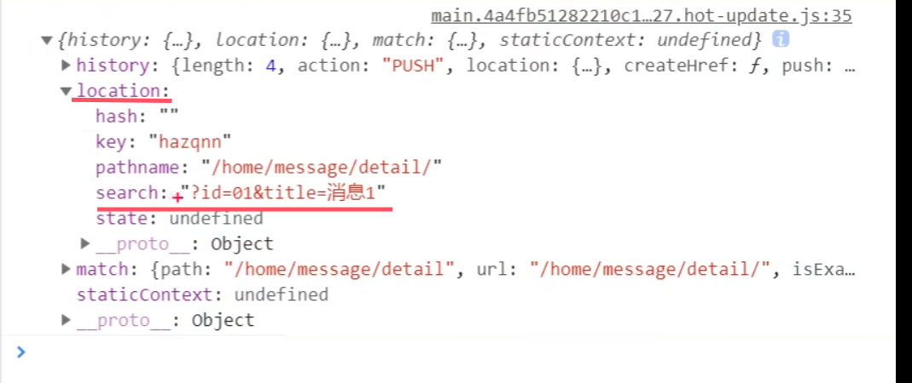
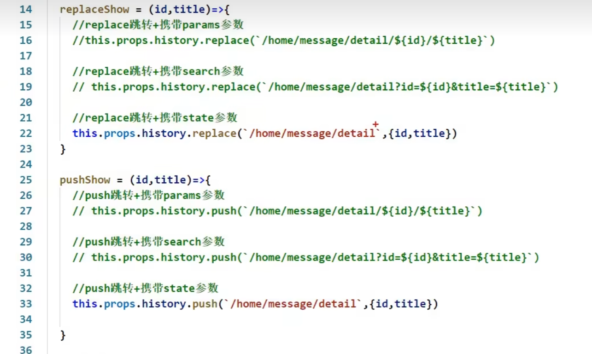
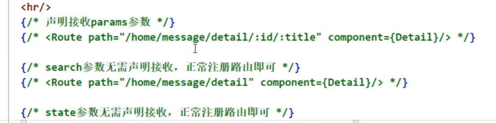
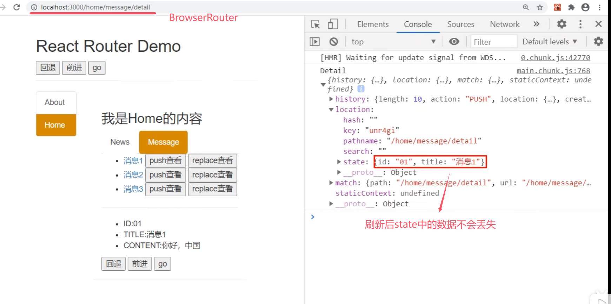

## 第5章 react路由（v5）

### 5.1. 相关理解

#### 5.1.1. SPA的理解

1. 单页Web应用（single page web application，SPA）。
2. 整个应用只有**一个**完整的页面。
3. 点击页面中的链接**不会刷新**页面，只会做页面的**局部更新**。
4. 数据都需要通过**ajax**请求获取, 并在前端异步展现。
5. 单页面、多组件

#### 5.1.2. 路由的理解

- 什么是路由?
  1. 一个路由就是一个映射关系(key:value)
  1. key为路径, value可能是function或component


- 路由分类

  1. 后端路由：

     1) 理解： value是function, 用来处理客户端提交的请求。
     2) 注册路由： router.get(path, function(req, res))
     3) 工作过程：当node接收到一个请求时, 根据请求路径找到匹配的路由, 调用路由中的函数来处理请求, 返回响应数据


    2. 前端路由：
       1) 浏览器端路由，value是component，用于展示页面内容。
       2) 注册路由: `<Route path="/test" component={Test}>`
       3) 工作过程：当浏览器的path变为/test时, 当前路由组件就会变为Test组件
       4) 前端路由也要靠BOM 上的 history

#### 5.1.3. react-router-dom的理解

1. react的一个**插件库**。
2. 专门用来实现一个SPA应用。
3. 基于react的项目基本都会用到此库。

**注意：**react-router总共有三种形式的库，适用于三种场景：

- web，对应的库名叫react-router-dom （当前学习）
- native
- anywhere（哪里都可以用）

### 5.2 路由的基本使用

1. 明确好界面中的导航区、展示区

2. 导航区的a标签改为Link标签

3. 展示区写Route标签进行路径的匹配（在呈现路由组件内容的位置注册路由）
   以前的版本

   ```jsx
   <Route path="/about" component={About}/>
   <Route path="/home" component={Home}/> 
   ```

   现在的版本 6.x.x

   ```jsx
   <Routes>
   	<Route path="/about" element={<About/>}/>
   	<Route path="/home" element={<Home/>}/>
   </Routes>
   ```

4. `<App/>`的最外侧包裹了一个`<BrowserRouter>`或`<HashRouter>`

注意：

- `import {Link,Route} from 'react-router-dom'` 分别暴露，用哪个组件取哪个组件 -
- 用`<HashRouter>`地址栏中 # 后面的内容不会作为资源发给服务器

### 5.3 路由组件与一般组件

1. 写法不同：
   一般组件：`<Demo/>`
   路由组件：`<Route path="/demo" component={Demo}/>`
2. 存放位置不同：
   一般组件：components
   路由组件：pages
3. 接收到的props不同：
   一般组件：写组件标签时传递了什么，就能收到什么
   路由组件：接收到三个固定的属性

```yml
history:
			go: ƒ go(n)
			goBack: ƒ goBack()
			goForward: ƒ goForward()
			push: ƒ push(path, state)
			replace: ƒ replace(path, state)
location:
			pathname: "/about"
			search: ""
			state: undefined
match:
			params: {}
			path: "/about"
			url: "/about"
			
# 实际上这三个属性会有更多子属性。这里只保留了最常用的子属性
```

### 5.4 NavLink及其封装

1. NavLink可以实现路由链接的高亮，通过**activeClassName**指定样式名
2. 标签体内容是一个特殊的标签属性，可以通过this.props.children获取。因此以下两段代码是等价的。

```jsx
<NavLink activeClassName="atguigu" className="list-group-item" children="About" />
<NavLink activeClassName="atguigu" className="list-group-item" to="/about">About</NavLink>
```

#### Nav的封装和使用

封装：将NavLink封装为一个组件



使用：像使用NavLink标签一样使用封装的标签

> MyNavLink标签包裹的内容也会传递给props，特殊的是会传递到props中的children属性中，无需自己指定key.
> 因此在MyNavLink中直接读取props.children属性，就可以读取到被MyNavLink标签包裹的内容
> 
>
> 


### 5.5 Switch

1. 注册路由时用Switch包裹所有路由
2. 通常情况下，path和component是一一对应的关系。
3. Switch可以提高路由匹配效率(**单一匹配**)。

> 因为一般情况下，path和component时一一对应的，因此在匹配到一个路径之后就可以停止匹配了。不需要考虑一个path对应多个component的情况，适合使用Switch来提高效率



### 5.6 解决样式丢失问题

1. 什么时候样式丢失？
   路由路径多级，且刷新的时候

2. 解决办法
   1）public/index.html 中 引入样式时不写 ./ 而是写 / （**常用**）。因为./是相对路径，去掉之后就是绝对路径，直接去localhost:3000下调文件

   ```jsx
   <link rel="stylesheet" href="/css/bootstrap.css">
   ```

   2）public/index.html 中 引入样式时不写 ./ 写 %PUBLIC_URL% （**常用**）。因为%PUBLIC_URL%代表public的绝对路径

   > 只适用于在React脚手架里这么写，别的地方写没用

   ```jsx
   <link rel="stylesheet" href="%PUBLIC_URL%/css/bootstrap.css">
   ```

   3）将`<BrowserRouter>`改为`<HashRouter>`

### 5.7 路由的模糊匹配与严格匹配

1. 默认使用的是模糊匹配（简单记：【输入的路径】必须包含要【匹配的路径】，且顺序要一致）

   ```jsx
   <MyNavLink to="/about/a/b">Home</MyNavLink>  //模糊匹配
   <Route path="/about" component={About}/>
   ```

2. 开启严格匹配：

```jsx
<Route exact={true} path="/about" component={About}/>
// exact={true}可以简写为exact
```

3. **严格匹配不要随便开启**，需要再开，有些时候开启会导致无法继续匹配二级路由

### 5.8 Redirect重定向

1. 一般写在所有路由注册的最下方，当所有路由都无法匹配时，跳转到Redirect指定的路由
2. 具体编码：

​	使用前先引入


```jsx
<Switch>
	<Route path="/about" component={About}/>
	<Route path="/home" component={Home}/>
	<Redirect to="/about"/>
</Switch>
```

### 5.8 嵌套路由（多级路由）

1. 注册子路由时要**写上父路由**的path值

```jsx
{/* 注册路由 */}
<Switch>
	<Route path="/home/news" component={News}/>
	<Route path="/home/message" component={Message}/>
	<Redirect to="/home/news"/>
</Switch>
```

2. 路由的匹配是按照**注册路由的顺序**进行的

### 5.9 向路由组件传递参数

#### 5.9.1 params参数（使用最多）

1. 路由链接(携带参数)：

```jsx
<Link to='/demo/test/tom/18'}>详情</Link>
```

2. 注册路由(声明接收)：

```jsx
<Route path="/demo/test/:name/:age" component={Test}/>
```

3. 接收参数：

   根据下图，可以看到通过params传递参数时，参数传递到了接收方组件的 **props属性的match属性的params属性中**。
   即接收方通过 `const {id,title} = this.props.match.params`这种形式就能够使用传递给自己的参数




#### 5.9.2 search参数（使用第二多）

1. 路由链接(携带参数)：

```jsx
<Link to='/demo/test/?name=tom&age=18'}>详情</Link>
//？前面加不加/
```

2. 注册路由(无需声明，正常注册即可)：

```jsx
<Route path="/demo/test" component={Test}/>
```

3. 接收参数：` const{id,title} = this.props.location.search`
   备注：获取到的search是**urlencoded编码**（即，`name=tom&age=18`）字符串，需要借助 querystring库（React脚手架已经自动下载好了）解析（`querystring.stringify(obj)`, `querystring.parse(str)`）。去掉问号用`qs.parse(str.slice(1))`
   

#### 5.9.3 state参数（使用最少）

> state参数不同于普通组件的state属性

1. 路由链接(携带参数)：

```jsx
<Link to={{pathname:'/demo/test',state:{name:'tom',age:18}}}>详情</Link>
```

2. 注册路由(无需声明，正常注册即可)：

```jsx
<Route path="/demo/test" component={Test}/>
```

3. 接收参数：`const{id,title} = this.props.location.state || {}`
   备注：**刷新也可以保留住参数** 
   

### 5.10 push和replace

1. 路由是对浏览器历史记录的操作，总共有两种操作，push（压栈）和replace（替代栈顶元素）。
2. 默认是push模式，要想开启replace模式，则在路由连接`<Link>`标签中加入`replace={true}`或`replace`

### 5.11 编程式路由导航

借助this.prosp.history对象上的API对操作路由跳转、前进、后退，而不用路由的`<Link>`和`<NavLink>`，但还是要注册路由

- this.prosp.history.push(path, state)
- this.prosp.history.replace(path, state)
- this.prosp.history.goBack()
- this.prosp.history.goForward()
- this.prosp.history.go(n)  //前进n步 （n为2，前进两步；n为-1，后退一步）

**replace和push实现三种传递参数的方式**：

三种方式传递参数：



三种方式定义路由：	



### 5.12 withRouter的使用

1. `withRouter`可以加工一般组件，让一般组件具备路由组件所特有的API

2. `withRouter`的返回值是一个新组件。

3. 在一般组件中要用到路由组件的props属性时引入。

   ```jsx
   import {withRouter} from 'react-router-dom'
   ```

   需要暴露

   ```jsx
   export default withRouter(Header) //传入一般组件，返回加工后的新组件。加工后的新组件 具备路由组件所特有的API
   ```

### 5.12 BrowserRouter与HashRouter的区别

1. 底层原理不一样：
   BrowserRouter使用的是H5的history API，**不兼容IE9及以下版本。**
   HashRouter使用的是URL的哈希值。

2. path表现形式不一样
   BrowserRouter的路径中没有#,例如：localhost:3000/demo/test
   HashRouter的路径包含#,例如：localhost:3000/#/demo/test

3. 刷新后对路由state参数的影响
   1）BrowserRouter没有任何影响，因为state保存在history对象中。
   2）HashRouter刷新后**会导致路由state参数的丢失**！！！

   **BrowserRouter刷新前后**：

   

   **HashRouter刷新前后**：

   

   

4. **备注：** HashRouter可以用于解决一些路径错误相关的问题。
