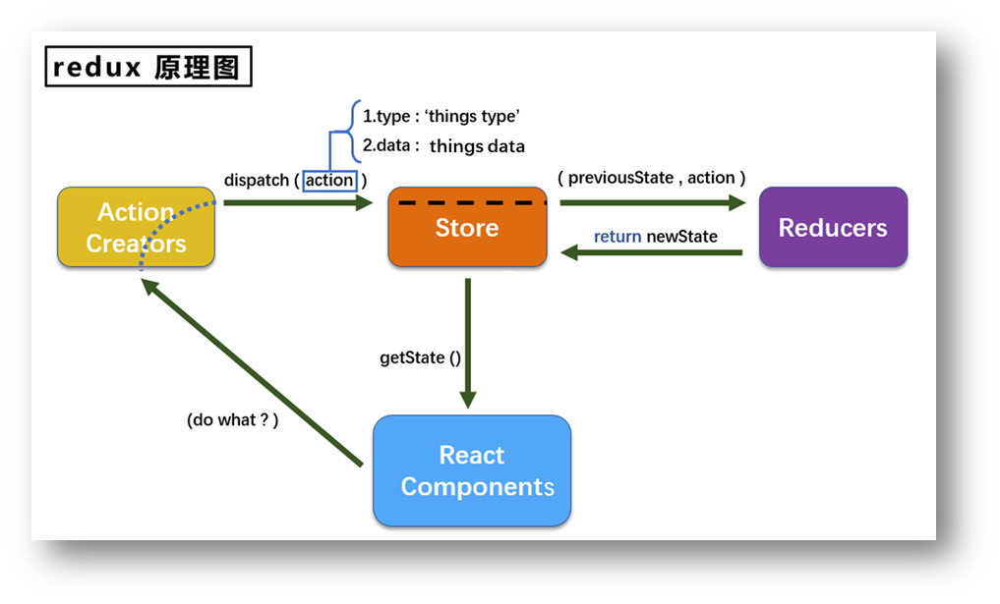
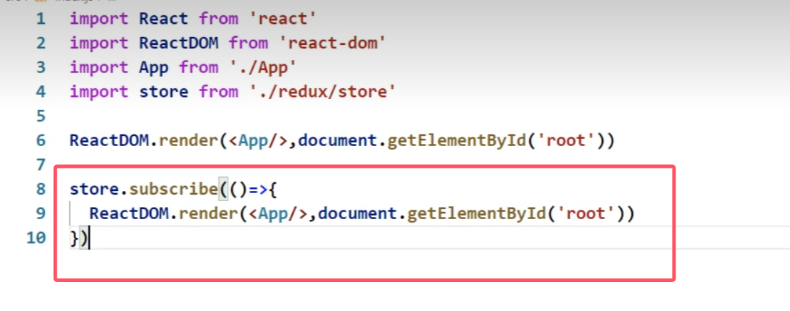
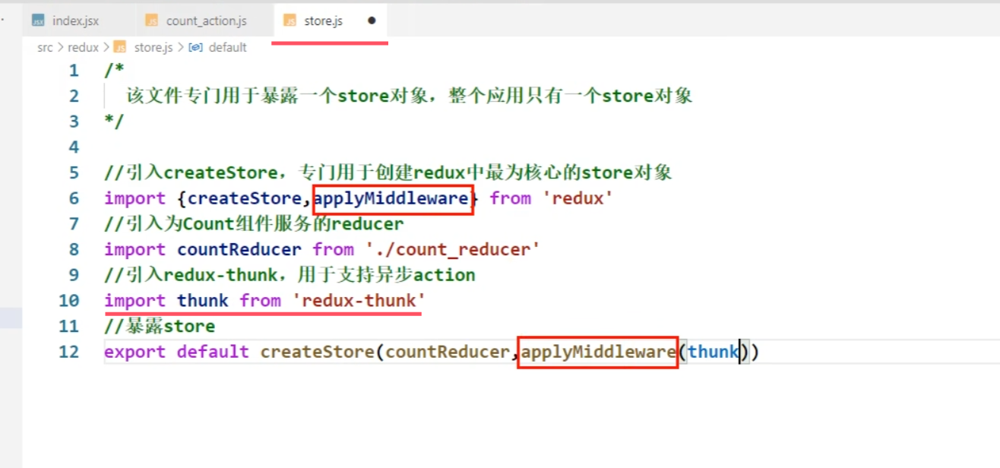
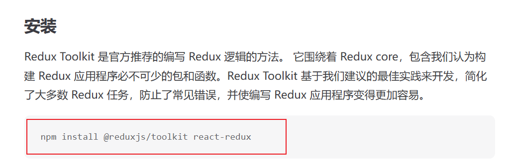
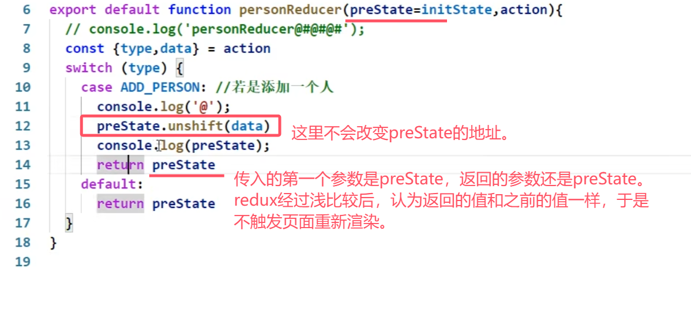
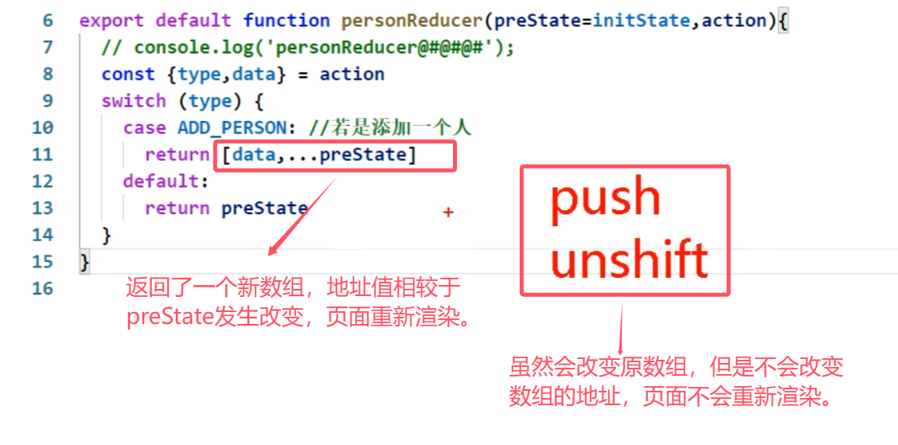
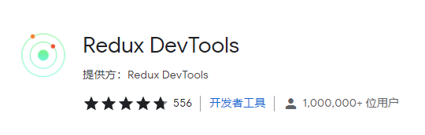

## 第7章 redux

### 7.1 redux理解

#### 7.1.1 学习文档

1. [英文文档](https://redux.js.org/): https://redux.js.org/
2. [中文文档](http://www.redux.org.cn/): http://www.redux.org.cn/
3. [Github](https://github.com/reactjs/redux): https://github.com/reactjs/redux

#### 7.1.2 redux简介

1. redux是一个专门用于做**状态管理**的JS库(**不是react插件库**)。
2. 它可以用在react, angular, vue等项目中, 但基本与react配合使用。
3. 作用: **集中式管理**react应用中**多个组件共享**的状态。

#### 7.1.3 什么情况下需要使用redux

1. 某个组件的状态，需要让其他组件可以随时拿到（**共享**）。
2. 一个组件需要改变另一个组件的状态（**通信**）。
3. 总体原则：能不用就不用, 如果不用比较吃力才考虑使用。

#### 7.1.4 redux工作流程



- `dispatch(action)`是一个函数，`action`是一个对象
- Action Creators（服务员）
  Store（老板）
  Reducers（厨师）

### 7.2 redux的三个核心概念

#### 7.2.1. action

1. 动作的**对象**
2. 包含2个属性
   `type`：标识属性, 值为字符串, 唯一, 必要属性
   `data`：数据属性, 值类型任意, 可选属性
3. 例子：`{ type: 'ADD_STUDENT',data:{name: 'tom',age:18} }`

#### 7.2.2. reducer

1. 用于**初始化**状态、**加工**状态。
2. 加工时，根据旧的state和action， 产生新的state的`纯函数`。
3. 有几个组件就有几个reducer？

#### 7.2.3. store

1. 将state、action、reducer联系在一起的**对象**

2. 如何得到此对象?

   ```jsx
    import {createStore} from 'redux'
    import reducer from './reducers'
   
    const store = createStore(reducer)
   ```

3. 此对象的功能?

   1) `getState()`: 得到state
   2) `dispatch(action)`: 分发action, 触发reducer调用, 产生新的state
   3) `subscribe(listener)`: 注册监听, 当产生了新的state时, 自动调用

### 7.3. redux的核心API

#### 7.3.1. createstore()

作用：创建包含指定reducer的store对象

#### 7.3.2. store对象

> store整个对象只有一个

1. 作用: redux库最核心的管理对象

2. 它内部维护着:

   1) state
   2) reducer

3. 核心方法:

   1) `getState()`
   2) `dispatch(action)`
   3) `subscribe(listener)` ：store监测redux里的状态变化，发生变化则会调用 `listener` 回调
      

4. 具体编码:

   1) `store.getState()`
   2) `store.dispatch({type:'INCREMENT', number})`
   3) 放在入口文件index.js中

   ```jsx
   store.subscribe(()=>{
   	ReactDOM.render(<App/>,document.getElementById('root'))
   })
   ```

#### 7.3.3. applyMiddleware()

作用：应用上基于redux的中间件(插件库)

##### 7.3.4. combineReducers()

作用：合并多个reducer函数

### 7.4 求和案例

#### 7.4.1 求和案例_redux精简版

> 首先执行  yarn add redux
> （该命令只安装了redux核心，并没有安装Redux Toolkit）
> 

1. 去除Count组件自身的状态

2. src下建立:

   ```jsx
   //文件
   -redux
   	-store.js
   	-count_reducer.js
   ```

3. store.js：
   1）引入redux中的`createStore`函数，创建一个store
   2）`createStore`调用时要传入一个为其服务的reducer
   3）记得暴露**store对象**（store.js默认暴露一个函数调用，函数返回一个对象，其他文件引入的时候将此对象命名为store）

4. count_reducer.js：
   1）reducer的本质是一个函数，接收：preState,action，返回加工后的状态
   2）reducer有两个作用：初始化状态，加工状态
   3）reducer被第一次调用时，是store自动触发的。传递的`preState`是`undefined`，传递的`action`是:`{type:'@@REDUX/INIT_a.2.b.4}`

5. 在index.js中监测store中状态的改变，一旦发生改变重新渲染

**备注**：redux只负责管理状态，至于状态的改变驱动着页面的展示，要靠我们自己写。

#### 7.4.2 求和案例_redux完整版

**新增文件**：

1. count_action.js 专门用于创建`action`对象
   注意：箭头函数返回一个对象时，要用`（）`包裹，不然会被识别为函数体的`{}`

```jsx
createIncrementAction = data => ({type:INCREMENT,data})
```

1. constant.js 放置容易写错的`type`值，目的只有一个：便于管理的同时防止程序员单词写错（要暴露）

#### 7.4.3 求和案例_redux异步action版（非必须）

1. 同步`action`：`action`的值是对象
   异步`action`：`action`的值是函数。异步`action`一般会调用同步`action`
2. 明确：延迟的动作（异步操作）不想交给组件自身，想交给`action`
3. 何时需要异步`action`：想要对状态进行操作，但是具体的数据靠异步任务返回。
4. 具体编码：
   1）**yarn add redux-thunk**，并配置在store中
   2）创建`action`的函数不再返回一般对象，而是一个函数，该函数中写异步任务。
   3）异步任务有结果后，分发一个同步的`action`去真正操作数据。
5. 备注：**异步`action`不是必须要写的**，完全可以自己等待异步任务的结果了再去分发同步`action`。

**引入thunk并使用**：



#### 7.4.4 求和案例_react-redux基本使用

> 需要安装 react-redux
> npm install react-redux
>
> 注意：
> npm install react-redux
> npm install @reduxjs/toolkit react-redux
> 这两个命令不完全一样。
>
> **`npm install react-redux`**
>
> - 仅安装了 `react-redux` 库。
> - **`react-redux`**：这是一个 React 的官方绑定库，用于在 React 应用中与 Redux 集成。它提供了 `Provider` 和 `useSelector`、`useDispatch` 等工具，简化了 Redux 的使用。
>
> ### **`npm install @reduxjs/toolkit react-redux`**
>
> - 同时安装了 `@reduxjs/toolkit` 和 `react-redux`。
> - **`@reduxjs/toolkit`**：这是 Redux 官方推荐的工具包，用于简化 Redux 的配置和使用，包括创建切片（slice）、简化 reducer 定义、内置中间件等功能。
> - **`react-redux`**：作为 React 和 Redux 的绑定库，同样会被安装。
>
> 


1. 明确两个概念：
   1）UI组件:不能使用任何redux的api，只负责页面的呈现、交互等。
   2）容器组件：负责和redux通信，将结果交给UI组件。

2. 如何创建一个容器组件—靠react-redux 的`connect`函数：

   ```jsx
   connect(mapStateToProps,mapDispatchToProps)(UI组件)
   ```

   1）`mapStateToProps`:映射状态，返回值是一个对象。返回的对象中的key就作为传递给UI组件props的key,value就作为传递给UI组件props的value
   2）`mapDispatchToProps`:映射操作状态的方法，返回值是一个对象。返回的对象中的key就作为传递给UI组件props的key,value就作为传递给UI组件props的value

3. **备注**：容器组件中的store是靠`props`传进去的，而不是在容器组件中直接引入

#### 7.4.5 求和案例_react-redux优化

1. 容器组件和UI组件整合一个文件

2. 若有多个容器组件，无需自己给每个容器组件传递store，给<App/>包裹一个`<Provider store={store}>`即可。

3. 使用了react-redux后也**不用再自己检测redux中状态的改变**了，容器组件可以自动完成这个工作。

4. **`mapDispatchToProps`也可以简单的写成一个对象**，因为react-redux可以自动`dispatch`

5. 一个组件要和react-redux“打交道”要经过哪几步？
   1）定义好UI组件—不暴露
   2）引入`connect`生成一个容器组件，并暴露，写法如下：

   ```jsx
   connect(
   	state => ({key:value}), //映射状态
   	{key:xxxxxAction} //映射操作状态的方法
   )(UI组件)
   ```

   3）在UI组件中通过`this.props.xxxxxxx`读取和操作状态

#### 7.4.6 求和案例_react-redux数据共享版

1. 定义一个Person组件，和Count组件通过redux共享数据。
2. 为Person组件编写：reducer、action，配置constant常量。
3. 重点：Person的reducer和Count的Reducer要使用`combineReducers`进行合并。合并后的总状态是一个**对象**！！！
4. 交给store的是总reducer，最后注意在组件中取出状态的时候，记得“取到位”。
5. reducers进行浅比较，数组、对象只比较地址，所以地址不变就不会重新渲染
   
   

6. **redux的reducer函数必须是一个纯函数**

#### 7.4.7 求和案例_react-redux开发者工具的使用

Redux DevTools


1. 引入库

```powershell
yarn add redux-devtools-extension
```

2. 在store.js中进行配置

```jsx
import {composeWithDevTools} from 'redux-devtools-extension'

export default createStore(allReducer,composeWithDevTools(applyMiddleware(thunk)))
```

#### 7.4.8 求和案例_react-redux最终版

1. 所有变量名字要规范，尽量触发对象的简写形式。
2. reducers文件夹中，编写index.js专门用于汇总并暴露所有的reducer

### 7.5 纯函数和高阶函数

#### 7.5.1. 纯函数

1. 一类特别的函数: 只要是**同样的输入**(实参)，必定得到**同样的输出**(返回)

   > 例如：无论何时向函数输入1，函数的输出都为1；无论何时向函数输入2，函数的输出都为2；这样的函数就是纯函数

2. 必须遵守以下一些约束

   1) **不得改写参数数据**
   2) 不会产生任何副作用，例如网络请求，输入和输出设备
   3) 不能调用Date.now()或者Math.random()等不纯的方法

3. **redux的reducer函数必须是一个纯函数**

#### 7.8.2. 高阶函数

1. 理解: 一类特别的函数
   1) 情况1: 参数是函数
   2) 情况2: 返回是函数
2. 常见的高阶函数:
   1) 定时器设置函数
   2) 数组的forEach()/map()/filter()/reduce()/find()/bind()
   3) promise
   4) react-redux中的connect函数
3. 作用: 能实现更加动态, 更加可扩展的功能

### 7.9 项目打包

1. 打包

   ```jsx
   npm run build
   ```

   生成build文件夹

2. 部署在服务器上
   1）阿里云线上服务器
   2）express（Node中快速搭建服务器的框架）搭建服务器
   3）借助第三方库库快速搭建：以指定的文件夹作为根目录快速开启一台服务器。如 serve

   ```jsx
   npm i serve -g  //全局安装
   // serve #直接运行serve命令是将当前目录作为根目录快速开启一台服务器
   serve build   // 将build目录作为根目录快速开启一台服务器
   ```

