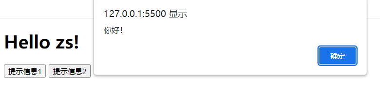
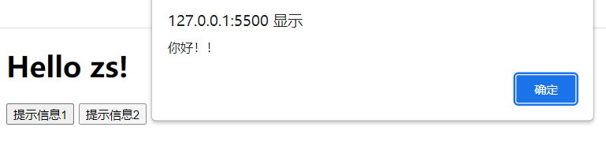
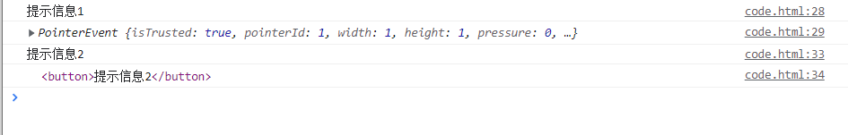
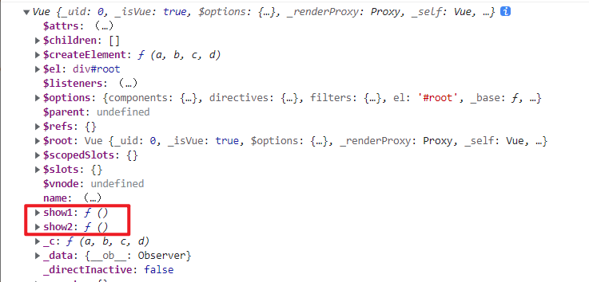
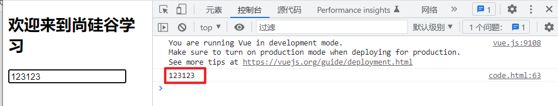
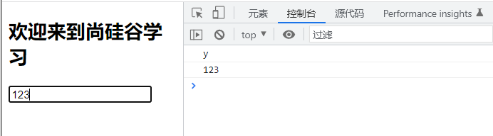

# 事件

## 1. 事件处理

### 1.1 事件绑定指令

vue提供了`v-on:`事件绑定指令，用来辅助程序员为DOM元素绑定事件监听。

原生的DOM对象有`onclick`、`oninput`等原生事件，在vue中可以使用`v-on:click`、`v-on:input`等来监听DOM元素的对应事件，并为其绑定相应的事件处理函数，其中事件处理函数需要在vue实例对象的`methods`节点中进行声明。

`v-on:` 简写为 `@`。

### 1.2 元素事件绑定代码示例

```html
<!DOCTYPE html>
<html lang="en">
<head>
  <meta charset="UTF-8">
  <meta http-equiv="X-UA-Compatible" content="IE=edge">
  <meta name="viewport" content="width=device-width, initial-scale=1.0">
  <title>Document</title>
</head>
<body>
  <div id="root">
    <h1>Hello {{name}}!</h1>
    <!-- 监听按钮的点击事件，同时为其绑定事件处理函数 show1 -->
    <button v-on:click="show1">提示信息1</button>
	<!-- @ 是v-on: 的简写 -->
    <button @click="show2">提示信息2</button>
  </div>

  <script src="https://cdn.jsdelivr.net/npm/vue@2.6.14/dist/vue.js"></script>
  <script>
    const vm = new Vue({
      el: '#root',
      data: {
        name: 'zs'
      },
      methods: {
        show1() {
          alert('你好！')
        },
        show2() {
          alert('你好！！')
        },
      },
    })
  </script>
</body>
</html>
```

> 
> 

### 1.3 事件处理函数的参数

事件处理函数不进行参数的传递，默认会有一个参数，即事件的触发对象。

```html
<!DOCTYPE html>
<html lang="en">
<head>
  <meta charset="UTF-8">
  <meta http-equiv="X-UA-Compatible" content="IE=edge">
  <meta name="viewport" content="width=device-width, initial-scale=1.0">
  <title>Document</title>
</head>
<body>
  <div id="root">
    <h1>Hello {{name}}!</h1>
    <!-- 监听按钮的点击事件，同时为其绑定事件处理函数 show1 -->
    <button v-on:click="show1">提示信息1</button>
    <!-- 监听按钮的点击事件，同时为其绑定事件处理函数 show1 -->
    <button @click="show2">提示信息2</button>
  </div>

  <script src="https://cdn.jsdelivr.net/npm/vue@2.6.14/dist/vue.js"></script>
  <script>
    const vm = new Vue({
      el: '#root',
      data: {
        name: 'zs'
      },
      methods: {
        show1(e) {
          alert('你好！')
          console.log('提示信息1')
          console.log(e)
        },
        show2(e) {
          alert('你好！！')
          console.log('提示信息2')
          console.log(e.target)
        },
      },
    })
  </script>
</body>
</html>
```

> 

向事件处理函数显示的传递事件的触发对象，可以在绑定事件处理函数时，传入参数`$event`作为事件触发对象。

```html
<!DOCTYPE html>
<html lang="en">
<head>
  <meta charset="UTF-8">
  <meta http-equiv="X-UA-Compatible" content="IE=edge">
  <meta name="viewport" content="width=device-width, initial-scale=1.0">
  <title>Document</title>
</head>
<body>
  <div id="root">
    <h1>Hello {{name}}!</h1>
    <!-- 监听按钮的点击事件，同时为其绑定事件处理函数 show1 -->
    <button v-on:click="show1($event)">提示信息1</button>
    <!-- 监听按钮的点击事件，同时为其绑定事件处理函数 show1 -->
    <button @click="show2">提示信息2</button>
  </div>

  <script src="https://cdn.jsdelivr.net/npm/vue@2.6.14/dist/vue.js"></script>
  <script>
    const vm = new Vue({
      el: '#root',
      data: {
        name: 'zs'
      },
      methods: {
        show1(e) {
          alert('你好！')
          console.log('提示信息1')
          console.log(e.target)
        },
        show2(e) {
          alert('你好！！')
          console.log('提示信息2')
          console.log(e.target)
        },
      },
    })
  </script>
</body>
</html>
```

> 

向事件处理函数传递其他参数的同时，传递事件的触发对象，此时，如果不显示的传递事件的触发对象，则事件的处理函数不会接收到事件触发对象这个参数。

```html
<!DOCTYPE html>
<html lang="en">
<head>
  <meta charset="UTF-8">
  <meta http-equiv="X-UA-Compatible" content="IE=edge">
  <meta name="viewport" content="width=device-width, initial-scale=1.0">
  <title>Document</title>
</head>
<body>
  <div id="root">
    <h1>Hello {{name}}!</h1>
    <!-- 监听按钮的点击事件，同时为其绑定事件处理函数 show1 -->
    <button v-on:click="show1($event, '张三')">提示信息1</button>
    <!-- 监听按钮的点击事件，同时为其绑定事件处理函数 show1 -->
    <button @click="show2('李四')">提示信息2</button>
  </div>

  <script src="https://cdn.jsdelivr.net/npm/vue@2.6.14/dist/vue.js"></script>
  <script>
    const vm = new Vue({
      el: '#root',
      data: {
        name: 'zs'
      },
      methods: {
        show1(e, uname) {
          alert('你好！')
          console.log('提示信息1   ' + uname)
          console.log(e.target)
        },
        show2(e, uname) {
          alert('你好！！')
          console.log('提示信息2 e   '+ e)
          console.log('提示信息2 uname   '+ uname)
        },
      },
    })
  </script>
</body>
</html>
```

> 

### 1.4 事件处理函数的this

事件处理函数如果写成普通函数，则事件处理函数的this指向vue实例对象；
如果事件处理函数写成箭头，则事件处理函数的this指向windows对象，因为箭头函数没有自己的this， 箭头函数会向外找this, 向外找到的this就是window。

```html
<!DOCTYPE html>
<html lang="en">
<head>
  <meta charset="UTF-8">
  <meta http-equiv="X-UA-Compatible" content="IE=edge">
  <meta name="viewport" content="width=device-width, initial-scale=1.0">
  <title>Document</title>
</head>
<body>
  <div id="root">
    <h1>Hello {{name}}!</h1>
    <button v-on:click="show1()">提示信息1</button>
    <button @click="show2()">提示信息2</button>
  </div>

  <script src="https://cdn.jsdelivr.net/npm/vue@2.6.14/dist/vue.js"></script>
  <script>
    const vm = new Vue({
      el: '#root',
      data: {
        name: 'zs'
      },
      methods: {
        show1() {
          console.log('普通函数形式的this：',this === vm)
        },
        show2: () => {
          console.log('箭头函数形式的this：',this)
        },
      },
    })
  </script>
</body>
</html>
```

> 

### 1.5 事件处理函数存放位置

事件处理函数定义后，最终会挂载到vue实例对象上。

> 事件处理函数不进行数据代理，只有写在data节点上的才会进行数据代理。

```html
<!DOCTYPE html>
<html lang="en">
<head>
  <meta charset="UTF-8">
  <meta http-equiv="X-UA-Compatible" content="IE=edge">
  <meta name="viewport" content="width=device-width, initial-scale=1.0">
  <title>Document</title>
</head>
<body>
  <div id="root">
    <h1>Hello {{name}}!</h1>
    <button v-on:click="show1()">提示信息1</button>
    <button @click="show2()">提示信息2</button>
  </div>

  <script src="https://cdn.jsdelivr.net/npm/vue@2.6.14/dist/vue.js"></script>
  <script>
    const vm = new Vue({
      el: '#root',
      data: {
        name: 'zs'
      },
      methods: {
        show1() {
          console.log(vm)
        },
        show2: () => {
          console.log('箭头函数形式的this：',this)
        },
      },
    })
  </script>
</body>
</html>
```

> 

## 2. 事件修饰符

在事件处理函数中调用`preventDefault()`(阻止默认行为)或 `stopPropagation()`(阻止冒泡)对事件的触发进行控制是非常常见的需求。

因此，vue提供了事件修饰符的概念，来辅助程序员更方便的对事件的触发进行控制。

| 事件修饰符            | 说明                                                  |
| --------------------- | ----------------------------------------------------- |
| **.prevent** （常用） | 阻止默认行为（例如:阻止a连接的跳转、阻止表单的提交等) |
| **.stop**  （常用）   | 阻止事件冒泡(事件的默认处理阶段为冒泡阶段)            |
| **.once** （常用）    | 绑定的事件只触发1次                                   |
| .capture              | 以捕获模式触发当前的事件处理函数                      |
| .self                 | 只有在event.target是当前元素自身时触发事件处理函数    |
| .passive              | 事件的默认行为立即执行，无需等待事件回调执行完毕      |


```html
<!DOCTYPE html>
<html>
	<head>
		<meta charset="UTF-8" />
		<title>事件修饰符</title>
		<script src="https://cdn.jsdelivr.net/npm/vue@2.6.14/dist/vue.js"></script>
		<style>
			*{
				margin-top: 20px;
			}
			.demo1{
				height: 50px;
				background-color: skyblue;
			}
			.box1{
				padding: 5px;
				background-color: skyblue;
			}
			.box2{
				padding: 5px;
				background-color: orange;
			}
			.list{
				width: 200px;
				height: 200px;
				background-color: peru;
				overflow: auto;
			}
			li{
				height: 100px;
			}
		</style>
	</head>
	<body>
		<div id="root">
			<h2>欢迎来到{{name}}学习</h2>
			<!-- 阻止默认事件 -->
	      <!-- a连接点击之后会进行页面的跳转，
	        使用 .prevent 进行修饰后，
	        点击之后不会进行页面的跳转-->
			<a href="http://www.atguigu.com" @click.prevent="showInfo">点我提示信息</a>

			<!-- 阻止事件冒泡 -->
	      <!-- 
	        事件捕获：
	        点击按钮事件的传递方向为 div => button 由外向内
	        事件冒泡：
	        点击按钮向进行事件的捕获，
	        随后进行事件的冒泡，事件的传递分向为 button => div 由内向外
	        事件调用处理函数进行处理，默认是在事件冒泡阶段
	        使用 .stop 修饰，可以阻止事件向外冒泡 -->
			<div class="demo1" @click="showInfo">
				<button @click.stop="showInfo">点我提示信息</button>
			</div>

			<!-- 事件只触发一次 -->
      	    <!-- 事件触发一次后，不再触发 -->
			<button @click.once="showInfo">点我提示信息</button>

			<!-- 使用事件的捕获模式 -->
      		<!-- 使事件调用处理函数处理在事件的捕获阶段而不是冒泡阶段 -->
			<div class="box1" @click.capture="showMsg(1)">
				div1
				<div class="box2" @click="showMsg(2)">
					div2
				</div>
			</div>

			<!-- 只有event.target是当前操作的元素时才触发事件 -->
	      <!-- 
	        由于事件默认情况下会出现冒泡，
	        所以外层的事件依旧会触发，但是外层的触发元素不是外层元素本身
	        而是内层元素
	        .self 进行修饰可以使 只有event.target是当前操作的元素时才触发事件
	       -->
			<div class="demo1" @click.self="showInfo">
				<button @click="showInfo">点我提示信息</button>
			</div>

			<!-- 事件的默认行为立即执行，无需等待事件回调执行完毕 -->
	      <!-- 
	        事件默认情况下会等待回调函数 demo() 执行完成才会触发自己的默认行为
	        如下代码，即函数执行完成才会进行滚动条的滚动
	        .passive 可以使默认行为先执行，即滚动条立即滚动
	       -->
			<ul @wheel.passive="demo" class="list">
				<li>1</li>
				<li>2</li>
				<li>3</li>
				<li>4</li>
			</ul>

		</div>
	</body>

	<script type="text/javascript">
		Vue.config.productionTip = false

		new Vue({
			el:'#root',
			data:{
				name:'尚硅谷'
			},
			methods:{
				showInfo(e){
					alert('同学你好！')
				},
				showMsg(msg){
					console.log(msg)
				},
				demo(){
					for (let i = 0; i < 100000; i++) {
						console.log('#')
					}
					console.log('累坏了')
				}
			}
		})
	</script>
</html>
```

对事件需要进行多种修饰，可以在事件后面添加多个事件修饰符，即事件修饰符可以连写。
例如，既要阻止冒泡，又要阻止默认事件：	

```html
<div class="demo1" @click="showInfo">
	<a href="http://www.atguigu.com" @click.stop.prevent="showInfo">点我提示信息</a>
</div>
```

## 3. 键盘事件

在监听键盘事件时，我们经常需要判断按键，根据按下的按键进行事件的处理。Vue为我们提供了一些常用的按键别名，此时，可以使用vue提供的别名为键盘相关的事件添加按键修饰符。

Vue中常用的按键别名：

| 按键 | 别名                              |
| ---- | --------------------------------- |
| 回车 | enter                             |
| 删除 | delete (捕获“删除”和“退格”键)     |
| 退出 | esc                               |
| 空格 | space                             |
| 换行 | tab (特殊，必须配合keydown去使用) |
| 上   | up                                |
| 下   | down                              |
| 左   | left                              |
| 右   | right                             |

> tab键可以将光标从当前元素切走，tab配合keyup使用，即要等tab键抬起才会触发事件，但是当我们按下tab键光标就会从当前元素切走，无法触发事件的处理函数。tab配合keydown使用，在按下的时候会调用处理函数，同时光标从当前元素切走，所以tab 特殊，必须配合keydown去使用。

> vue没有提供别名的按键，可以使用按键原始的key值进行绑定，但是对于那种按键由不同单词复合而成的需要进行转化，例如，大小写切换键`CapsLock` 转为`caps-lock`(短横线命名)。

- 获取按键名：`e.key`

- 获取按键编码：

  ```
  e.keyCode 
  ```

  - 其中，e为键盘事件

- 系统修饰键（用法特殊）：ctrl、alt、shift、meta(win键)

  - 配合keyup使用：按下修饰键的同时，再按下其他键，随后释放其他键，事件才被触发
  - 配合keydown使用：正常触发事件

自定义按键别名：

```properties
Vue.config.keyCodes.自定义键名 = 键码
```

代码示例：
实现功能，按下enter键在控制台输出在文本框输入的内容。

```html
<!DOCTYPE html>
<html>
	<head>
		<meta charset="UTF-8" />
		<title>键盘事件</title>
		<script src="https://cdn.jsdelivr.net/npm/vue@2.6.14/dist/vue.js"></script>
	</head>
	<body>
		<div id="root">
			<h2>欢迎来到{{name}}学习</h2>
			<input type="text" placeholder="按下回车提示输入" @keydown.enter="showInfo">
		</div>
	</body>

	<script type="text/javascript">
		Vue.config.productionTip = false

		new Vue({
			el:'#root',
			data:{
				name:'尚硅谷'
			},
			methods: {
				showInfo(e){
					console.log(e.target.value)
				}
			},
		})
	</script>
</html>
```

> 

键盘事件可以连写。比如需要实现，按下ctrl+y键才在控制台输出在文本框输入的内容。

```html
<!DOCTYPE html>
<html>
	<head>
		<meta charset="UTF-8" />
		<title>键盘事件</title>
		<script src="https://cdn.jsdelivr.net/npm/vue@2.6.14/dist/vue.js"></script>
	</head>
	<body>
		<div id="root">
			<h2>欢迎来到{{name}}学习</h2>
			<input type="text" placeholder="按下回车提示输入" @keydown.ctrl.y="showInfo">
		</div>
	</body>

	<script type="text/javascript">
		Vue.config.productionTip = false

		new Vue({
			el:'#root',
			data:{
				name:'尚硅谷'
			},
			methods: {
				showInfo(e){
					console.log(e.key)
					console.log(e.target.value)
				}
			},
		})
	</script>
</html>
```

> 

