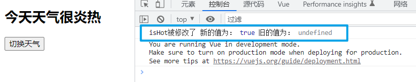

# 监视属性

## 1. 实现效果


## 2. methods + computed实现

```html
<!DOCTYPE html>
<html lang="en">
<head>
  <meta charset="UTF-8">
  <meta http-equiv="X-UA-Compatible" content="IE=edge">
  <meta name="viewport" content="width=device-width, initial-scale=1.0">
  <title>Document</title>
</head>
<body>
  <div id="root">
    <h2>今天天气很{{info}}</h2>
    <button @click="changeWeather">切换天气</button>
  </div>
</body>
<script src="https://cdn.jsdelivr.net/npm/vue@2.6.14/dist/vue.js"></script>
<script>
  const vm = new Vue({
    el: '#root',
    data: {
      // 标记天气是否炎热
      isHot: true
    },
    computed: {
      info() {
        return this.isHot ? '炎热' : '凉爽'
      }
    },
    methods: {
      // 修改天气
      changeWeather() {
        this.isHot = !this.isHot
      }
    },
  })
</script>
</html>
```

## 3. js表达式实现

```html
<!DOCTYPE html>
<html lang="en">
<head>
  <meta charset="UTF-8">
  <meta http-equiv="X-UA-Compatible" content="IE=edge">
  <meta name="viewport" content="width=device-width, initial-scale=1.0">
  <title>Document</title>
</head>
<body>
  <div id="root">
    <h2>今天天气很{{info}}</h2>
    <button @click="isHot = !isHot">切换天气</button>
  </div>
</body>
<script src="https://cdn.jsdelivr.net/npm/vue@2.6.14/dist/vue.js"></script>
<script>
  const vm = new Vue({
    el: '#root',
    data: {
      // 标记天气是否炎热
      isHot: true
    },
    computed: {
      info() {
        return this.isHot ? '炎热' : '凉爽'
      }
    }
  })
</script>
</html>
```

## 4. 监视属性实现

### 监视属性watch

监视属性watch：

​          1.当被监视的属性变化时, 回调函数自动调用, 进行相关操作

​          2.监视的属性必须存在，才能进行监视！！

​          3.监视的两种写法：

​              (1).new Vue时传入watch配置

​              (2).通过vm.$watch监视


上述效果实现的代码，是通过修改isHot的值，当isHot的值改变时，Vue会重新解析模板，由于计算属性info依赖于isHot，当isHot改变时，info会被重新调用，从而实现效果。

监视属性使用watch侦听器实现，侦听器允许开发者监视数据的变化，从而针对数据的变化做特定的操作。这样子就不用使用另外单独书写的函数针对数据的变化进行相应的处理。

### 4.1 handler()

handler()为属性侦听器的回调函数，当被监视的属性值变化时，回调函数会自动调用，进行相应的处理

```js
    watch: {
      isHot: {
        // 当被监视的属性值变化时，回调函数会自动调用，进行相应的处理
        handler() {
          console.log('isHot被修改了')
        }
      }
    }
```

> 

当被监视的属性值变化时，回调函数会自动调用，进行相应的处理，同时会向处理函数传入两个参数，第一个参数为改变后的值，第二个参数修改之前的值。

```js
    watch: {
      isHot: {
        // 当数据元素的值改变时，调用的处理函数为handler
        handler(newVal, oldVal) {
          console.log('isHot被修改了', '新的值为：', newVal, '旧的值为：', oldVal)
        }
      }
    }
```

> 

### 4.2 immediate

`immediate`，默认值为false。

immediate的值设置为true，初始化数据元素时，立即调用属性侦听器的回调函数handler()。

```js
    watch: {
      isHot: {
        // 初始化时，立即调用handler()
        immediate: true,
        // 当数据元素的值改变时，调用的处理函数为handler
        handler(newVal, oldVal) {
          console.log('isHot被修改了', '新的值为：', newVal, '旧的值为：', oldVal)
        }
      }
    }
```

> 

### 4.3 通过vue实例对象监视属性

> 这种写法用于最开始不知道要监视什么属性，后期知道要监视的属性，需要添加监视属性时使用。

```html
<!DOCTYPE html>
<html lang="en">
<head>
  <meta charset="UTF-8">
  <meta http-equiv="X-UA-Compatible" content="IE=edge">
  <meta name="viewport" content="width=device-width, initial-scale=1.0">
  <title>Document</title>
</head>
<body>
  <div id="root">
    <h2>今天天气很{{info}}</h2>
    <button @click="isHot = !isHot">切换天气</button>
  </div>
</body>
<script src="https://cdn.jsdelivr.net/npm/vue@2.6.14/dist/vue.js"></script>
<script>
  const vm = new Vue({
    el: '#root',
    data: {
      // 标记天气是否炎热
      isHot: true
    },
    computed: {
      info() {
        return this.isHot ? '炎热' : '凉爽'
      }
    }
  })

  // 使用vue实例监视属性必须保证vue实例已经创建完成
  // 调用$watch()方法实现
  // 第一个参数为需要进行监视的属性名
  // 第二个参数为对应的配置项
  vm.$watch('isHot', {
    // 初始化时，立即调用handler()
    immediate: true,
    // 当被监视的属性值变化时，回调函数会自动调用，进行相应的处理
    handler(newVal, oldVal) {
      console.log('isHot被修改了', '新的值为：', newVal, '旧的值为：', oldVal)
    }
  })
</script>
</html>
```

> 

### 4.4 深度监视

实现深度监视使用`deep`，默认值为false。vue提供的属性侦听器默认不能监视多级结构中某个属性的变化。

开启深度监视，能够监视多级结构中某个属性的变化。

> vue自身可以监测对象内部值的改变，即vue能够监视多级结构中某个属性的变化，但是vue提供的watch默认不可以。

```html
<!DOCTYPE html>
<html lang="en">
<head>
  <meta charset="UTF-8">
  <meta http-equiv="X-UA-Compatible" content="IE=edge">
  <meta name="viewport" content="width=device-width, initial-scale=1.0">
  <title>Document</title>
</head>
<body>
  <div id="root">
    <h2>a的值：{{num.a}}</h2>
    <button @click="num.a++">点击使a加一</button>
    <h2>b的值：{{num.b}}</h2>
    <button @click="num.b++">点击使b加一</button>
    <br><br>
    <button @click="num = {a: 666, b: 888}">点击修改num的值</button>
  </div>
</body>
<script src="https://cdn.jsdelivr.net/npm/vue@2.6.14/dist/vue.js"></script>
<script>
  const vm = new Vue({
    el: '#root',
    data: {
      isHot: true,
      num: {
        a: 1,
        b: 2
      }
    },
    watch: {
      // 监视num，当num里面的值修改了也视为num改变
      num: {
        deep: true,
        handler(newVal, oldVal) {
          console.log('num被修改了')
        }
      }
    }
  })
</script>
</html>
```

> 

### 4.5 监视属性的简写

如果监视属性不需要设置初始化立即调用监视属性的回调函数，也不需要设置深度监视，可以使用监视属性的简写形式。

```html
<!DOCTYPE html>
<html lang="en">
<head>
  <meta charset="UTF-8">
  <meta http-equiv="X-UA-Compatible" content="IE=edge">
  <meta name="viewport" content="width=device-width, initial-scale=1.0">
  <title>Document</title>
</head>
<body>
  <div id="root">
    <h2>今天天气很{{info}}</h2>
    <button @click="isHot = !isHot">切换天气</button>
  </div>
</body>
<script src="https://cdn.jsdelivr.net/npm/vue@2.6.14/dist/vue.js"></script>
<script>
  const vm = new Vue({
    el: '#root',
    data: {
      isHot: true,
      num: {
        a: 1,
        b: 2
      }
    },
    computed: {
      info() {
        return this.isHot ? '炎热' : '凉爽'
      }
    },
    watch: {
      // 完整写法：
      // isHot: {
      //   // immediate: true,
      //   // deep: true,
      //   handler(newVal, oldVal) {
      //     console.log('isHot被修改了', '新的值为：', newVal, '旧的值为：', oldVal)
      //   }  
      // }

      // 如果监视属性不需要设置初始化立即调用监视属性的回调函数
      // 也不需要设置深度监视，可以使用监视属性的简写形式
      // 此时的函数相当于原来的handler()
      isHot(newVal, oldVal) {
        console.log('isHot被修改了', '新的值为：', newVal, '旧的值为：', oldVal)
      }
    }
  })
</script>
</html>
```

> 

### 4.6 $watch()监视属性的简写

```html
<!DOCTYPE html>
<html lang="en">
<head>
  <meta charset="UTF-8">
  <meta http-equiv="X-UA-Compatible" content="IE=edge">
  <meta name="viewport" content="width=device-width, initial-scale=1.0">
  <title>Document</title>
</head>
<body>
  <div id="root">
    <h2>今天天气很{{info}}</h2>
    <button @click="isHot = !isHot">切换天气</button>
  </div>
</body>
<script src="https://cdn.jsdelivr.net/npm/vue@2.6.14/dist/vue.js"></script>
<script>
  const vm = new Vue({
    el: '#root',
    data: {
      isHot: true,
      num: {
        a: 1,
        b: 2
      }
    },
    computed: {
      info() {
        return this.isHot ? '炎热' : '凉爽'
      }
    }
  })

  // 完整写法：
  // vm.$watch('isHot', {
  //   // immediate: true,
  //   // deep: true,
  //   handler(newVal, oldVal) {
  //     console.log('isHot被修改了', '新的值为：', newVal, '旧的值为：', oldVal)
  //   }  
  // })

  // 简写形式
  vm.$watch('isHot', function() {
    console.log('isHot被修改了', '新的值为：', newVal, '旧的值为：', oldVal)
  })
</script>
</html>
```

> 

### 4.7 监视属性实现天气案例

```html
<!DOCTYPE html>
<html lang="en">
<head>
  <meta charset="UTF-8">
  <meta http-equiv="X-UA-Compatible" content="IE=edge">
  <meta name="viewport" content="width=device-width, initial-scale=1.0">
  <title>Document</title>
</head>
<body>
  <div id="root">
    <h2>今天天气很{{info}}</h2>
    <button @click="isHot = !isHot">切换天气</button>
  </div>
</body>
<script src="https://cdn.jsdelivr.net/npm/vue@2.6.14/dist/vue.js"></script>
<script>
  const vm = new Vue({
    el: '#root',
    data: {
      isHot: true,
      info: ''
    },
    watch: {
      isHot: {
        immediate: true,
        handler(newVal) {
          this.info = newVal ? '炎热' : '凉爽'
          console.log('当前的天气为：', this.info)
        }
      }
    }
  })
</script>
</html>
```

> 

## 5. 监视属性与计算属性的对比

computed和watch之间的区别：

​            1.computed能完成的功能，watch都可以完成。

​            2.watch能完成的功能，computed不一定能完成，例如：watch可以进行异步操作。

​        两个重要的小原则：

​              1.所被Vue管理的函数，最好写成普通函数，这样this的指向才是vm 或 组件实例对象。

​              2.所有不被Vue所管理的函数（定时器的回调函数、ajax的回调函数等、Promise的回调函数），最好写成箭头函数，

​                这样this的指向才是vm 或 组件实例对象。


### 5.1 监视属性实现姓名案例

```html
<!DOCTYPE html>
<html lang="en">
<head>
  <meta charset="UTF-8">
  <meta http-equiv="X-UA-Compatible" content="IE=edge">
  <meta name="viewport" content="width=device-width, initial-scale=1.0">
  <title>Document</title>
</head>
<body>
  <div id="root">
    姓：<input type="text" v-model="firstname"> <br><br>
    名：<input type="text" v-model="lastname"> <br><br>
    姓名：<span>{{fullname}}</span>
  </div>
</body>
<script src="https://cdn.jsdelivr.net/npm/vue@2.6.14/dist/vue.js"></script>
<script>
  const vm = new Vue({
    el: '#root',
    data: {
      firstname: '张',
      lastname: '三',
      fullname: '张-三'
    },
    watch: {
      firstname(newVal) {
        this.fullname = newVal + '-' + this.lastname
      },
      lastname(newVal) {
        this.fullname = this.firstname + '-' + newVal
      }
    }
  })
</script>
</html>
```

> 

### 5.2 案例结果显示延时

#### 5.2.1 监视属性实现

```html
<!DOCTYPE html>
<html lang="en">
<head>
  <meta charset="UTF-8">
  <meta http-equiv="X-UA-Compatible" content="IE=edge">
  <meta name="viewport" content="width=device-width, initial-scale=1.0">
  <title>Document</title>
</head>
<body>
  <div id="root">
    姓：<input type="text" v-model="firstname"> <br><br>
    名：<input type="text" v-model="lastname"> <br><br>
    姓名：<span>{{fullname}}</span>
  </div>
</body>
<script src="https://cdn.jsdelivr.net/npm/vue@2.6.14/dist/vue.js"></script>
<script>
  const vm = new Vue({
    el: '#root',
    data: {
      firstname: '张',
      lastname: '三',
      fullname: '张-三'
    },
    watch: {
      firstname(newVal) {
        // 定时器中的this
        // 由于箭头函数没有自己的this
        // 所以会向外寻找this，firstname()有自己的this，指向vue实例对象
        // vue实例对象上的函数都有自己this，指向vue实例对象
        // 如果vue实例对象上的函数写成箭头函数，则由原来的有自己的this变为没有自己的this
        // 此时this指向Windows
        setTimeout(()=>{
          // 这里指向vue实例对象，是由于外层的函数有this且指向vue实例对象
          this.fullname = newVal + '-' + this.lastname
        }, 1000)
      },
      lastname(newVal) {
        setTimeout(()=>{
          this.fullname = this.firstname + '-' + newVal
        }, 1000)
      }
    }
  })
</script>
</html>
```

> 

#### 5.2.2 计算属性实现

```html
<!DOCTYPE html>
<html lang="en">
<head>
  <meta charset="UTF-8">
  <meta http-equiv="X-UA-Compatible" content="IE=edge">
  <meta name="viewport" content="width=device-width, initial-scale=1.0">
  <title>Document</title>
</head>
<body>
  <div id="root">
    姓：<input type="text" v-model="firstname"> <br><br>
    名：<input type="text" v-model="lastname"> <br><br>
    姓名：<span>{{fullname}}</span>
  </div>
</body>
<script src="https://cdn.jsdelivr.net/npm/vue@2.6.14/dist/vue.js"></script>
<script>
  const vm = new Vue({
    el: '#root',
    data: {
      firstname: '张',
      lastname: '三',
    },
    computed: {
      fullname() {
        // 由于计算属性需要一个返回值
        // 但是延时需要在setTimeout中的回调函数进行处理
        // 处理后的返回值无法进行接收，所有该功能无法实现
        setTimeout(()=>{
          return this.firstname + '-' + this.lastname
        }, 1000)
        return 123
      }
    }
  })
</script>
</html>
```

> 

```js
    computed: {
      fullname() {
        // 使用如下的写法
        // 由于定时器的回调函数执行时间在return之后，所以还是无法实现需求
        let t = ''
        //这里写成箭头函数的原因：
        //箭头函数没有自己的this,因此这里使用this时，会向外寻找，向外寻找到fullName，fullName的this是vm，因此这里箭头函数的this是vm。如果写成普通函数，this就会指向setTimeout所在的对象，也就是window对象。
        setTimeout(()=>{
          t = this.firstname + '-' + this.lastname
        }, 1000)
        return t
      }
    }
```

### 5.3 监视属性与计算属性的对比总结

- computed和watch之间的区别：
  - computed能完成的功能，watch都可以完成
  - watch能完成的功能，computed不一定能完成，例如：watch可以进行异步操作
- 两个重要的小原则：
  - 所有被Vue管理的函数，最好写成普通函数，这样this的指向才是vue实例对象或 组件实例对象
  - 所有不被Vue所管理的函数（定时器的回调函数、ajax的回调函数等、Promise的回调函数），最好写成箭头函数，这样this的指向才是vue实例对象或 组件实例对象。

