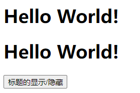
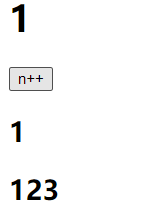
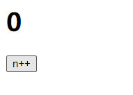
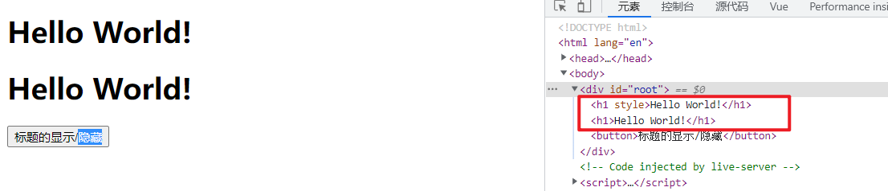

# 条件渲染

## 1. 使用v-show做条件渲染

```html
<!DOCTYPE html>
<html lang="en">
<head>
  <meta charset="UTF-8">
  <meta http-equiv="X-UA-Compatible" content="IE=edge">
  <meta name="viewport" content="width=device-width, initial-scale=1.0">
  <title>Document</title>	
</head>
<body>
  <div id="root">
    <h1 v-show="isShow">Hello World!</h1>
    <!-- 在v-show中也可以写表达式 -->
    <h1 v-show="1 == 1">Hello World!</h1>
    <button @click="changeIsShow">标题的显示/隐藏</button>
  </div>
</body>
<script src="https://cdn.jsdelivr.net/npm/vue@2.6.14/dist/vue.js"></script>
<script>
  const vm = new Vue({
    el: '#root',
    data: {
      // 用于控制是否显示
      isShow: true
    },
    methods: {
      // 改变标签元素状态
      changeIsShow() {
        this.isShow = !this.isShow
      }
    }
  })
</script>
</html>
```

> 
>
> 

## 2. 使用v-if做条件渲染

```html
<!DOCTYPE html>
<html lang="en">
<head>
  <meta charset="UTF-8">
  <meta http-equiv="X-UA-Compatible" content="IE=edge">
  <meta name="viewport" content="width=device-width, initial-scale=1.0">
  <title>Document</title>
</head>
<body>
  <div id="root">
    <h1 v-if="isShow">Hello World!</h1>
    <!-- 在v-if中也可以写表达式 -->
    <h1 v-if="1 == 1">Hello World!</h1>
    <button @click="changeIsShow">标题的显示/隐藏</button>
  </div>
</body>
<script src="https://cdn.jsdelivr.net/npm/vue@2.6.14/dist/vue.js"></script>
<script>
  const vm = new Vue({
    el: '#root',
    data: {
      // 用于控制是否显示
      isShow: true
    },
    methods: {
      // 改变标签元素状态
      changeIsShow() {
        this.isShow = !this.isShow
      }
    }
  })
</script>
</html>
```

> 
> 

## 3. v-else-if 与 v-else

> 注意：使用 v-else-if 与 v-else 的前面必须有 v-if ，否则会报错，且条件判断渲染也不能正常实现。

```html
<!DOCTYPE html>
<html lang="en">
<head>
  <meta charset="UTF-8">
  <meta http-equiv="X-UA-Compatible" content="IE=edge">
  <meta name="viewport" content="width=device-width, initial-scale=1.0">
  <title>Document</title>
</head>
<body>
  <div id="root">
    <h1>{{n}}</h1>
    <button @click="n++;">n++</button>
    <h2 v-if="n === 1">1</h2>
    <h2 v-else-if="n === 1">2</h2>
    <h2 v-else-if="n === 1">3</h2>
    <h2 v-else>else</h2>
  </div>
</body>
<script src="https://cdn.jsdelivr.net/npm/vue@2.6.14/dist/vue.js"></script>
<script>
  const vm = new Vue({
    el: '#root',
    data: {
      n: 0
    }
  })
</script>
</html>
```

> 
> 

> 注意：如果使用`v-if ... v-else-if ... v-else`中间不能被打断

```html
<!DOCTYPE html>
<html lang="en">
<head>
  <meta charset="UTF-8">
  <meta http-equiv="X-UA-Compatible" content="IE=edge">
  <meta name="viewport" content="width=device-width, initial-scale=1.0">
  <title>Document</title>
</head>
<body>
  <div id="root">
    <h1>{{n}}</h1>
    <button @click="n++;">n++</button>
    <h2 v-if="n === 1">1</h2>
    <h2>123</h2>
    <h2 v-else-if="n === 2">2</h2>
    <h2 v-else-if="n === 3">3</h2>
    <h2 v-else>else</h2>
  </div>
</body>
<script src="https://cdn.jsdelivr.net/npm/vue@2.6.14/dist/vue.js"></script>
<script>
  const vm = new Vue({
    el: '#root',
    data: {
      n: 0
    }
  })
</script>
</html>
```

> 
> 
> 

## 4. template

> div和template都可以用来包裹多个元素。
> 但是div会破坏原来元素的结构，原来的元素外层多了一层div
> template不会破坏原来元素的结构，渲染的结果中不会出现template

使用template标签可以实现同时控制多个元素的显示与隐藏，同时不影响元素标签之间的结构，但是template只能配合`v-if`使用，不能与`v-show`一起使用。

```html
<!DOCTYPE html>
<html lang="en">
<head>
  <meta charset="UTF-8">
  <meta http-equiv="X-UA-Compatible" content="IE=edge">
  <meta name="viewport" content="width=device-width, initial-scale=1.0">
  <title>Document</title>
</head>
<body>
  <div id="root">
    <h1>{{n}}</h1>
    <button @click="n++;">n++</button>
    <template v-if="n===1">
      <h2>1</h2>
      <h2>123</h2>
      <h2>2</h2>
      <h2>3</h2>
      <h2>else</h2>
    </template>
  </div>
</body>
<script src="https://cdn.jsdelivr.net/npm/vue@2.6.14/dist/vue.js"></script>
<script>
  const vm = new Vue({
    el: '#root',
    data: {
      n: 0
    }
  })
</script>
</html>
```

> 
>
> 渲染的结果中不存在<template>
>
> 

## 5. v-if 和 v-show 的区别

- 实现原理不同：

  - v-if 指令会动态地创建或移除 DOM 元素，从而控制元素在页面上的显示与隐藏；

  - v-show 指令会动态为元素添加或移除

     

    ```
    style="display: none;"
    ```

     

    样式，从而控制元素的显示与隐藏；

    ```html
    <!DOCTYPE html>
    <html lang="en">
    <head>
      <meta charset="UTF-8">
      <meta http-equiv="X-UA-Compatible" content="IE=edge">
      <meta name="viewport" content="width=device-width, initial-scale=1.0">
      <title>Document</title>
    </head>
    <body>
      <div id="root">
        <h1 v-show="isShow">Hello World!</h1>
        <h1 v-if="isShow">Hello World!</h1>
        <button @click="changeIsShow">标题的显示/隐藏</button>
      </div>
    </body>
    <script src="https://cdn.jsdelivr.net/npm/vue@2.6.14/dist/vue.js"></script>
    <script>
      const vm = new Vue({
        el: '#root',
        data: {
          isShow: true
        },
        methods: {
          changeIsShow() {
            this.isShow = !this.isShow
          }
        }
      })
    </script>
    </html>
    ```

    > 
    > 

- 性能消耗不同：

  - v-if 有更高的切换开销（进行动态的创建和移除元素），而 v-show 有更高的初始渲染开销（一开始就有进行元素的渲染，v-if为false一开始不会进行渲染）。
  - 如果需要非常频繁地切换，则使用 v-show 较好
  - 如果在运行时条件很少改变，则使用 v-if 较好

