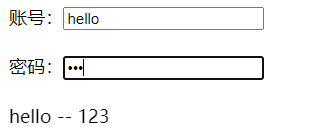
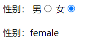
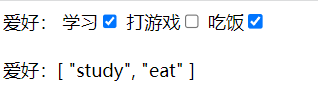
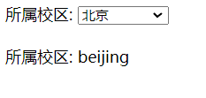
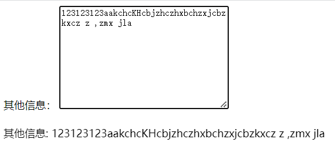
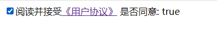
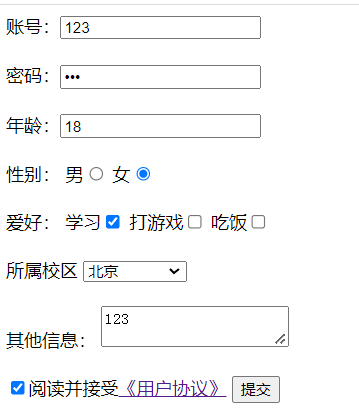
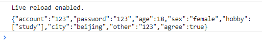

# v-model收集表单数据

------

## 1. 用于数据收集的页面

```html
<!DOCTYPE html>
<html>
	<head>
		<meta charset="UTF-8" />
		<title>收集表单数据</title>
		<script src="https://cdn.jsdelivr.net/npm/vue@2.6.14/dist/vue.js"></script>
	</head>
	<body>
		<!-- 准备好一个容器-->
		<div id="root">
			<form @submit.prevent="demo">
				账号：<input type="text" > <br/><br/>
				密码：<input type="password" > <br/><br/>
				年龄：<input type="number" > <br/><br/>
				性别：
				男<input type="radio" name="sex" >
				女<input type="radio" name="sex" > <br/><br/>
				爱好：
				学习<input type="checkbox" >
				打游戏<input type="checkbox" >
				吃饭<input type="checkbox" >
				<br/><br/>
				所属校区
				<select >
					<option value="">请选择校区</option>
					<option value="beijing">北京</option>
					<option value="shanghai">上海</option>
					<option value="shenzhen">深圳</option>
					<option value="wuhan">武汉</option>
				</select>
				<br/><br/>
				其他信息：
				<textarea ></textarea> <br/><br/>
				<input type="checkbox" >阅读并接受<a href="http://www.atguigu.com">《用户协议》</a>
				<button>提交</button>
			</form>
		</div>
	</body>
</html>
```

## 2. 输入框的数据收集

```html
<!DOCTYPE html>
<html lang="en">
  <head>
    <meta charset="UTF-8" />
    <meta http-equiv="X-UA-Compatible" content="IE=edge" />
    <meta name="viewport" content="width=device-width, initial-scale=1.0" />
    <title>Document</title>
  </head>
  <body>
    <div id="root">
      账号：<input type="text" v-model="account" /> <br /><br />
      密码：<input type="password" v-model="password" /> <br /><br />
      {{account}} -- {{password}}
    </div>
  </body>
  <script src="https://cdn.jsdelivr.net/npm/vue@2.6.14/dist/vue.js"></script>
  <script>
    const vm = new Vue({
      el: '#root',
      data: {
        account: '',
        password: ''
      },
    })
  </script>
</html>
```

> 

## 3. 单选框(radio)的数据收集

> 由于v-model默认收集的为表单的value属性的值，所以使用v-model收集单选框的数据时，需要先为单选框标签设置value及其对应的值。

```html
<!DOCTYPE html>
<html lang="en">
  <head>
    <meta charset="UTF-8" />
    <meta http-equiv="X-UA-Compatible" content="IE=edge" />
    <meta name="viewport" content="width=device-width, initial-scale=1.0" />
    <title>Document</title>
  </head>
  <body>
    <div id="root">
      性别：
      <!-- 
        由于v-model默认收集的为表单的value属性的值，
        所以要为单选框标签设置value及其对应的值。 

		将收集到的value值放到data中的sex
      -->
	  男<input type="radio" name="s" v-model="sex" value="male">
	  女<input type="radio" name="s" v-model="sex" value="female"> <br/><br/>
      性别：{{sex}}
    </div>
  </body>
  <script src="https://cdn.jsdelivr.net/npm/vue@2.6.14/dist/vue.js"></script>
  <script>
    const vm = new Vue({
      el: '#root',
      data: {
        // 性别默认为男性
        sex: 'male'
      },
    })
  </script>
</html>
```

> 

## 4. 复选框(checkbox)的数据收集

> 对于复选框，如果没有指定value属性，则v-model默认收集的为复选框表单上的checked属性的值(true/false)。
> 如果用于存放收集到的复选框信息的变量不为数组类型，会导致一个勾选全部勾选(v-model的双向绑定)。因为对于不为数组的变量只能放置一个值，所以v-model只能收集其中一个的checked属性的值，由于v-model的双向绑定性质，会导致其他选项出现同样的选择。
> 所以对于复选框也需要配置value属性及其值，同时收集数据的变量的数据类型要为数组类型。

```html
<!DOCTYPE html>
<html lang="en">
  <head>
    <meta charset="UTF-8" />
    <meta http-equiv="X-UA-Compatible" content="IE=edge" />
    <meta name="viewport" content="width=device-width, initial-scale=1.0" />
    <title>Document</title>
  </head>
  <body>
    <div id="root">
			爱好：
      <!-- 收集到的数据存放在hobby上 -->
      学习<input type="checkbox" v-model="hobby" value="study">
      打游戏<input type="checkbox" v-model="hobby" value="game">
      吃饭<input type="checkbox" v-model="hobby" value="eat">
      <br/><br/>
      爱好：{{hobby}}
    </div>
  </body>
  <script src="https://cdn.jsdelivr.net/npm/vue@2.6.14/dist/vue.js"></script>
  <script>
    const vm = new Vue({
      el: '#root',
      data: {
        // 对于复选框，用于存放收集数据的变量
        // 初始值要为数组
        hobby: []
      },
    })
  </script>
</html>
```

> 

## 5. 下拉选择框(select)的数据收集

```html
<!DOCTYPE html>
<html lang="en">
  <head>
    <meta charset="UTF-8" />
    <meta http-equiv="X-UA-Compatible" content="IE=edge" />
    <meta name="viewport" content="width=device-width, initial-scale=1.0" />
    <title>Document</title>
  </head>
  <body>
    <div id="root">
			所属校区: 
      <select v-model="city">
        <option value="">请选择校区</option>
        <option value="beijing">北京</option>
        <option value="shanghai">上海</option>
        <option value="shenzhen">深圳</option>
        <option value="wuhan">武汉</option>
      </select>
      <br/><br/>
      所属校区: {{city}}
    </div>
  </body>
  <script src="https://cdn.jsdelivr.net/npm/vue@2.6.14/dist/vue.js"></script>
  <script>
    const vm = new Vue({
      el: '#root',
      data: {
        // 默认选择 北京
        city: 'beijing'
      },
    })
  </script>
</html>
```

> 

## 6. textarea的数据收集

```html
<!DOCTYPE html>
<html lang="en">
  <head>
    <meta charset="UTF-8" />
    <meta http-equiv="X-UA-Compatible" content="IE=edge" />
    <meta name="viewport" content="width=device-width, initial-scale=1.0" />
    <title>Document</title>
  </head>
  <body>
    <div id="root">
			其他信息：
			<textarea v-model="other"></textarea> <br/><br/>
      其他信息: {{other}}
    </div>
  </body>
  <script src="https://cdn.jsdelivr.net/npm/vue@2.6.14/dist/vue.js"></script>
  <script>
    const vm = new Vue({
      el: '#root',
      data: {
        other: ''
      },
    })
  </script>
</html>
```

> 

## 7. 复选框收集checked值

```html
<input type="checkbox">阅读并接受<a href="http://www.atguigu.com">《用户协议》</a>
```

> 对于此种情况的复选框，我们只需要收集复选框选择/不选的信息即可，此时不要value值，所以不需要配置value值，可以直接收集其checked的值即可。

```html
<!DOCTYPE html>
<html lang="en">
  <head>
    <meta charset="UTF-8" />
    <meta http-equiv="X-UA-Compatible" content="IE=edge" />
    <meta name="viewport" content="width=device-width, initial-scale=1.0" />
    <title>Document</title>
  </head>
  <body>
    <div id="root">
			<input type="checkbox" v-model="agree">阅读并接受<a href="http://www.atguigu.com">《用户协议》</a>
      是否同意: {{agree}}
    </div>
  </body>
  <script src="https://cdn.jsdelivr.net/npm/vue@2.6.14/dist/vue.js"></script>
  <script>
    const vm = new Vue({
      el: '#root',
      data: {
        agree: ''
      },
    })
  </script>
</html>
```

> 

## 8. v-model修饰符

为了方便对用户输入的内容进行处理，vue 为 v-model 指令提供了 3 个修饰符，分别是：

| 修饰符  | 作用                           | 示例                             |
| ------- | ------------------------------ | -------------------------------- |
| .number | 自动将用户的输入值转为数值类型 | `<input v-model.number="age" />` |
| .trim   | 自动去除用户输入的首尾空白字符 | `<input v-model.trim="msg" />`   |
| .lazy   | 在失去焦点时更新数据           | `<input v-model.lazy="msg" />`   |

## 9. v-model收集表单数据完整代码

```html
<!DOCTYPE html>
<html>
  <head>
    <meta charset="UTF-8" />
    <title>收集表单数据</title>
    <script src="https://cdn.jsdelivr.net/npm/vue@2.6.14/dist/vue.js"></script>
  </head>
  <body>
    <!-- 准备好一个容器-->
    <div id="root">
		<!-- 阻止表的的默认事件 -->
      <form @submit.prevent="demo">
		<!-- v-model.trim 去除用户输入的两端的空白字符 -->
        账号：<input type="text" v-model.trim="userInfo.account" /> <br /><br />
        密码：<input type="password" v-model="userInfo.password" /> <br /><br />
		<!-- type="number" 只允许输入数字， v-model.number 将输入的内容的数据类型转为数字类型 -->
        年龄：<input type="number" v-model.number="userInfo.age" /> <br /><br />
        性别： 男<input type="radio" name="sex" v-model="userInfo.sex" value="male" /> 女<input type="radio" name="sex" v-model="userInfo.sex" value="female" /> <br /><br />
        爱好： 学习<input type="checkbox" v-model="userInfo.hobby" value="study" /> 打游戏<input type="checkbox" v-model="userInfo.hobby" value="game" /> 吃饭<input type="checkbox" v-model="userInfo.hobby" value="eat" /> <br /><br />
        所属校区
        <select v-model="userInfo.city">
          <option value="">请选择校区</option>
          <option value="beijing">北京</option>
          <option value="shanghai">上海</option>
          <option value="shenzhen">深圳</option>
          <option value="wuhan">武汉</option>
        </select>
        <br /><br />
        其他信息：
		<!-- v-model.lazy 在失去焦点时才进行数据的更新 -->
        <textarea v-model.lazy="userInfo.other"></textarea> <br /><br />
        <input type="checkbox" v-model="userInfo.agree" />阅读并接受<a href="http://www.atguigu.com">《用户协议》</a>
        <button>提交</button>
      </form>
    </div>
  </body>

  <script type="text/javascript">
    Vue.config.productionTip = false

    new Vue({
      el: '#root',
      data: {
		// 将用户信息写成对象形式
        userInfo: {
          account: '',
          password: '',
          age: 18,
          sex: 'female',
          hobby: [],
          city: 'beijing',
          other: '',
          agree: '',
        },
      },
      methods: {
        demo() {
			// 显示用户信息
          console.log(JSON.stringify(this.userInfo))
        },
      },
    })
  </script>
</html>
```

> 
> 

## 10. 总结 收集表单数据

- 若：`<input type="text"/>`，则v-model收集的是value值，用户输入的就是value值。

- 若：`<input type="radio"/>`，则v-model收集的是value值，且要给标签配置value值。

- 若：

  ```
  <input type="checkbox"/>
  ```

  - 1.没有配置input的value属性，那么收集的就是checked（勾选 or 未勾选，是布尔值）
  - 2.配置input的value属性:
    - (1)v-model的初始值是非数组，那么收集的就是checked（勾选 or 未勾选，是布尔值）
    - (2)v-model的初始值是数组，那么收集的的就是value组成的数组

- 备注：v-model的三个修饰符：

  - lazy：失去焦点再收集数据
  - number：输入字符串转为有效的数字
  - trim：输入首尾空格过滤

