# 自定义指令

------

## 1. 自定义指令

在vue中支持自定义指令，自定义指令声明在vue的directives节点中。

> 自定义指令本质为一个函数。

### 1.1 语法

定义自定义指令有两种形式的写法：

- 函数形式

  ```js
  new Vue({
  	directives: {
  		指令名(参数列表) {}
  	}
  })
  ```

- 对象形式

  ```js
  new Vue({
  	directives: {
  		指令名: {
  			// 指令与元素成功绑定时被调用
  			bind() {},
  			// 指令所在的元素被插入页面时调用
  			inserted() {},
  			// 指令所在的模板被重新解析时调用
  			update() {}
  		}
  	}
  })
  ```

使用自定义指令，需要使用`v-指令名`的形式。

### 1.2 自定义指令的参数

自定义指令的处理函数接收两个参数，第一个参数为使用自定义指令的DOM元素(element)，第二个参数为指令的绑定信息(binding)。

## 2. 自定义指令实现数值放大10倍

需要实现的需求：定义一个v-big指令，和v-text功能类似，但会把绑定的数值放大10倍。

### 2.1 查看自定义指令的参数

```html
<!DOCTYPE html>
<html lang="en">
  <head>
    <meta charset="UTF-8" />
    <meta http-equiv="X-UA-Compatible" content="IE=edge" />
    <meta name="viewport" content="width=device-width, initial-scale=1.0" />
    <title>Document</title>
  </head>
  <body>
    <div id="root">
      <h2>n的值为: {{n}}</h2>
      <h2>n放大10倍对应的值为: <span v-big="n"></span></h2>
      <button @click="n++">n++</button>
    </div>
  </body>
  <script src="https://cdn.jsdelivr.net/npm/vue@2.6.14/dist/vue.js"></script>
  <script>
    const vm = new Vue({
      el: '#root',
      data: {
        n: 0,
      },
      directives: {
        big(element, bingding) {
          console.log('element: ')
          console.log(element)
          console.log('binding: ')
          console.log(bingding)
        },
      },
    })
  </script>
</html>
```

> 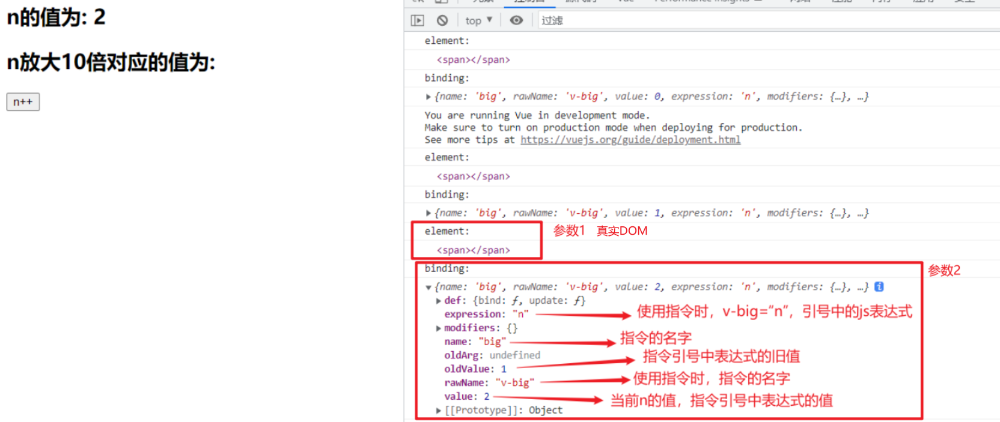

### 2.2 需求的实现

实现把绑定的数值放大10倍，然后将放大后的数值放到DOM元素上，需要我们操作DOM元素。

```html
<!DOCTYPE html>
<html lang="en">
  <head>
    <meta charset="UTF-8" />
    <meta http-equiv="X-UA-Compatible" content="IE=edge" />
    <meta name="viewport" content="width=device-width, initial-scale=1.0" />
    <title>Document</title>
  </head>
  <body>
    <div id="root">
      <h2>n的值为: {{n}}</h2>
      <h2>n放大10倍对应的值为: <span v-big="n"></span></h2>
      <button @click="n++">n++</button>
    </div>
  </body>
  <script src="https://cdn.jsdelivr.net/npm/vue@2.6.14/dist/vue.js"></script>
  <script>
    const vm = new Vue({
      el: '#root',
      data: {
        n: 0,
      },
      directives: {
        big(element, bingding) {
          // 操作DOM元素，将放大后的数值放入DOM元素中
          // bingding.value 获取当前指令绑定的表达式的值
          // element.innerText 将放大后的数值放入DOM元素中
          element.innerText = bingding.value * 10
        },
      },
    })
  </script>
</html>
```

> 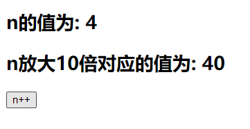

### 2.3 自定义指令调用的时机

#### 2.3.1 指令与元素成功绑定时（初始化页面）

```html
<!DOCTYPE html>
<html lang="en">
  <head>
    <meta charset="UTF-8" />
    <meta http-equiv="X-UA-Compatible" content="IE=edge" />
    <meta name="viewport" content="width=device-width, initial-scale=1.0" />
    <title>Document</title>
  </head>
  <body>
    <div id="root">
      <h2>n的值为: {{n}}</h2>
      <h2>n放大10倍对应的值为: <span v-big="n"></span></h2>
      <button @click="n++">n++</button>
    </div>
  </body>
  <script src="https://cdn.jsdelivr.net/npm/vue@2.6.14/dist/vue.js"></script>
  <script>
    const vm = new Vue({
      el: '#root',
      data: {
        n: 0,
      },
      directives: {
        big(element, bingding) {
          console.log('自定义指令 big 被调用...')
          element.innerText = bingding.value * 10
        },
      },
    })
  </script>
</html>
```

> 

#### 2.3.2 所在的模板被重新解析时

自定义指令被调用的时机，不仅是在与自定义指令相关的数据改变时，只要自定义指令所在的模板被重新解析，自定义指令就会被调用。

```html
<!DOCTYPE html>
<html lang="en">
  <head>
    <meta charset="UTF-8" />
    <meta http-equiv="X-UA-Compatible" content="IE=edge" />
    <meta name="viewport" content="width=device-width, initial-scale=1.0" />
    <title>Document</title>
  </head>
  <body>
    <div id="root">
      <h2>n的值为: {{n}}</h2>
      <h2>n放大10倍对应的值为: <span v-big="n"></span></h2>
      <button @click="n++">n++</button>
      <h2>x的值为: {{x}}</h2>
      <button @click="x++">x++</button>
    </div>
  </body>
  <script src="https://cdn.jsdelivr.net/npm/vue@2.6.14/dist/vue.js"></script>
  <script>
    const vm = new Vue({
      el: '#root',
      data: {
        n: 0,
        x: 100
      },
      directives: {
        big(element, bingding) {
          console.log('自定义指令 big 被调用...')
          element.innerText = bingding.value * 10
        },
      },
    })
  </script>
</html>
```

> 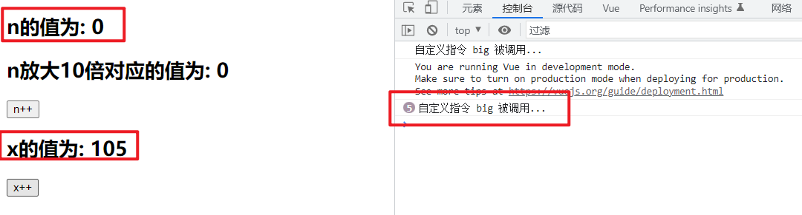

## 3. 自定义指令让其所绑定的input元素默认获取焦点

需要实现的需求：定义一个v-fbind指令，和v-bind功能类似，但可以让其所绑定的input元素默认获取焦点。

### 3.1 需求实现

```html
<!DOCTYPE html>
<html lang="en">
  <head>
    <meta charset="UTF-8" />
    <meta http-equiv="X-UA-Compatible" content="IE=edge" />
    <meta name="viewport" content="width=device-width, initial-scale=1.0" />
    <title>Document</title>
  </head>
  <body>
    <div id="root">
      <h2>n的值为: {{n}}</h2>
      <h2>n放大10倍对应的值为: <span v-big="n"></span></h2>
      <button @click="n++">n++</button> <br><br>
      <input type="text" v-fbind:value="n">
    </div>
  </body>
  <script src="https://cdn.jsdelivr.net/npm/vue@2.6.14/dist/vue.js"></script>
  <script>
    const vm = new Vue({
      el: '#root',
      data: {
        n: 0
      },
      directives: {
        big(element, bingding) {
          element.innerText = bingding.value * 10
        },
        // 让指令fbind所绑定的input元素默认获取焦点
        fbind(element, binding) {
          // 将n的值放入input中
          element.value = binding.value
          // 然后input获取焦点
          element.focus()
        }
      },
    })
  </script>
</html>
```

> 观察运行结果发现，input输入框并没有在最开始默认获取焦点，而是在点击按钮n+1后才自动获取焦点。
> 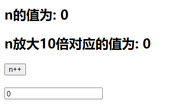
> 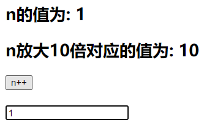

### 3.2 需求未实现的解释

通过操作DOM元素，让input输入框获取焦点，操作时，input输入框必须出现在页面上，否则input输入框获取焦点的代码不会在正常的时机生效，就达不到我们所需要的效果。

> 使用js操作DOM进行模拟

```html
<!DOCTYPE html>
<html>
	<head>
		<meta charset="UTF-8" />
		<title>Document</title>
	</head>
	<body>
		<button id="btn">创建一个输入框</button>
		
		<script type="text/javascript" >
			const btn = document.getElementById('btn')
			btn.onclick = ()=>{
				// 创建input输入框
				const input = document.createElement('input')
				// 输入框的value值默认为99
				input.value = 99
				// input输入框加入页面
				document.body.appendChild(input)
				// 输入框获取焦点
				input.focus()
				// 控制台输出打印新建的输入框的父元素
				console.log(input.parentElement)
			}
		</script>
	</body>
</html>
```

> 新建输入框并默认获取焦点的效果正常实现
> 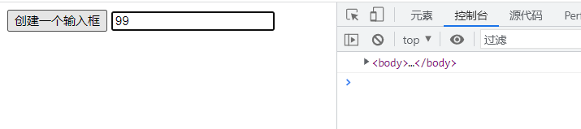

```html
<!DOCTYPE html>
<html>
	<head>
		<meta charset="UTF-8" />
		<title>Document</title>
	</head>
	<body>
		<button id="btn">创建一个输入框</button>
		
		<script type="text/javascript" >
			const btn = document.getElementById('btn')
			btn.onclick = ()=>{
				// 创建input输入框
				const input = document.createElement('input')
				// 输入框的value值默认为99
				input.value = 99

				// 输入框获取焦点
				input.focus()
				// 控制台输出打印新建的输入框的父元素
				console.log(input.parentElement)

				// input输入框加入页面
				document.body.appendChild(input)
				
			}
		</script>
	</body>
</html>
```

> 由于input输入框还未放入页面，所以无法操作input使其获取焦点，同时也无法获取input输入框的父元素。
> 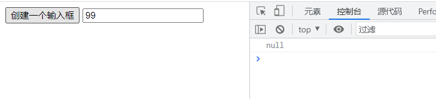

与上述示例代码同理，在页面进行初始化时，vue会先进行解析，页面解析完成后才会将元素放入页面并进行展示，vue在解析时会先将指令与元素进行绑定，这个时候自定义指令中的处理函数会先执行一次，但是此时由于页面中的元素还未在页面上，所以处理函数中的让输入框获取焦点的代码无法正常生效。

点击按钮n+1后，input输入框会获取焦点，是由于n值改变，vue会对页面重新进行解析，此时输入框已经出现在页面中了，所以获取焦点的代码能够生效。

### 3.3 对象形式自定义指令

> 为了解决该问题，可以使用对象形式自定义指令，在自定义指令对应的对象中，可以设置不同的函数，在自定义指令执行的不同时刻，vue会调用不同的函数。

对象形式自定义指令：

```html
<!DOCTYPE html>
<html lang="en">
  <head>
    <meta charset="UTF-8" />
    <meta http-equiv="X-UA-Compatible" content="IE=edge" />
    <meta name="viewport" content="width=device-width, initial-scale=1.0" />
    <title>Document</title>
  </head>
  <body>
    <div id="root">
      <h2>n的值为: {{n}}</h2>
      <h2>n放大10倍对应的值为: <span v-big="n"></span></h2>
      <button @click="n++">n++</button> <br /><br />
      <input type="text" v-fbind:value="n" />
    </div>
  </body>
  <script src="https://cdn.jsdelivr.net/npm/vue@2.6.14/dist/vue.js"></script>
  <script>
    const vm = new Vue({
      el: '#root',
      data: {
        n: 0,
      },
      directives: {
        big(element, bingding) {
          element.innerText = bingding.value * 10
        },
        // 对象形式自定义指令
        fbind: {
          // 指令与元素成功绑定时被调用
          bind() {
            console.log('bind')
          },
          // 指令所在的元素被插入页面时调用
          inserted() {
            console.log('inserted')
          },
          // 指令所在的模板被重新解析时调用
          update() {
            console.log('update')
          },
        },
      },
    })
  </script>
</html>
```

> 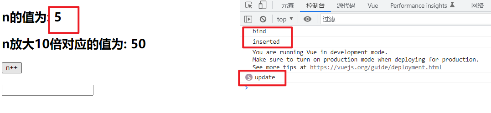

### 3.4 对象形式自定义指令实现需求

```html
<!DOCTYPE html>
<html lang="en">
  <head>
    <meta charset="UTF-8" />
    <meta http-equiv="X-UA-Compatible" content="IE=edge" />
    <meta name="viewport" content="width=device-width, initial-scale=1.0" />
    <title>Document</title>
  </head>
  <body>
    <div id="root">
      <h2>n的值为: {{n}}</h2>
      <h2>n放大10倍对应的值为: <span v-big="n"></span></h2>
      <button @click="n++">n++</button> <br /><br />
      <input type="text" v-fbind:value="n" />
    </div>
  </body>
  <script src="https://cdn.jsdelivr.net/npm/vue@2.6.14/dist/vue.js"></script>
  <script>
    const vm = new Vue({
      el: '#root',
      data: {
        n: 0,
      },
      directives: {
        big(element, bingding) {
          element.innerText = bingding.value * 10
        },
        // 对象形式自定义指令
        fbind: {
          // 指令与元素成功绑定时被调用
          bind(element,binding) {
            // 为input输入框的value赋值
            // 初始化input的value值
            element.value = binding.value
          },
          // 指令所在的元素被插入页面时调用
          inserted(element,binding) {
            // 默认初始获取焦点
            element.focus()
          },
          // 指令所在的模板被重新解析时调用
          update(element,binding) {
            // 重新解析模板时，更新input的value值
            element.value = binding.value
          },
        },
      },
    })
  </script>
</html>
```

> 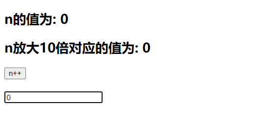
> 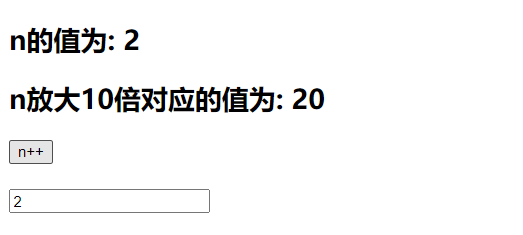

## 4. 自定义指令注意点

### 4.1 指令名多个单词之间使用短线符连接

指令名多个单词之间使用短线符连接之后，在自定义指令的声明定义时，需要使用引号进行包裹。

语法：

```js
      directives: {
        // 完整写法
        // 'big-number': function(element, bingding) {
        //   element.innerText = bingding.value * 10
        // },
        // 简写
        'big-number'(element, bingding) {
          element.innerText = bingding.value * 10
        },
      },
```


```html
<!DOCTYPE html>
<html lang="en">
  <head>
    <meta charset="UTF-8" />
    <meta http-equiv="X-UA-Compatible" content="IE=edge" />
    <meta name="viewport" content="width=device-width, initial-scale=1.0" />
    <title>Document</title>
  </head>
  <body>
    <div id="root">
      <h2>n的值为: {{n}}</h2>
      <h2>n放大10倍对应的值为: <span v-big-number="n"></span></h2>
      <button @click="n++">n++</button> <br /><br />
    </div>
  </body>
  <script src="https://cdn.jsdelivr.net/npm/vue@2.6.14/dist/vue.js"></script>
  <script>
    const vm = new Vue({
      el: '#root',
      data: {
        n: 0,
      },
      directives: {
        // 完整写法
        // 'big-number': function(element, bingding) {
        //   element.innerText = bingding.value * 10
        // },
        // 简写
        'big-number'(element, bingding) {
          element.innerText = bingding.value * 10
        },
      },
    })
  </script>
</html>
```

> 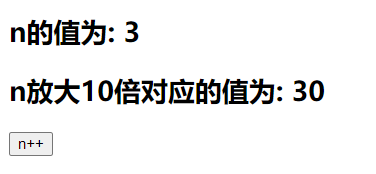

### 4.2 自定义指令中的this

自定义指令中的this都指向window，不指向vue实例对象。

```html
<!DOCTYPE html>
<html lang="en">
  <head>
    <meta charset="UTF-8" />
    <meta http-equiv="X-UA-Compatible" content="IE=edge" />
    <meta name="viewport" content="width=device-width, initial-scale=1.0" />
    <title>Document</title>
  </head>
  <body>
    <div id="root">
      <h2>n的值为: {{n}}</h2>
      <h2>n放大10倍对应的值为: <span v-big-number="n"></span></h2>
      <button @click="n++">n++</button> <br /><br />
    </div>
  </body>
  <script src="https://cdn.jsdelivr.net/npm/vue@2.6.14/dist/vue.js"></script>
  <script>
    const vm = new Vue({
      el: '#root',
      data: {
        n: 0,
      },
      directives: {
        // 简写
        'big-number'(element, bingding) {
          element.innerText = bingding.value * 10
          console.log(this)
        },
      },
    })
  </script>
</html>
```

> 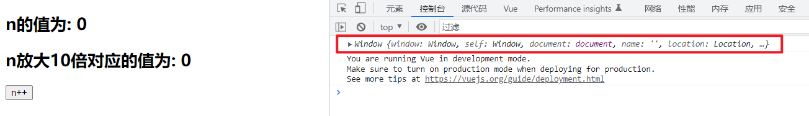

## 5. 定义全局自定义指令

### 5.1 语法

#### 5.1.1 函数形式

```js
Vue.directive( '指令名', 回调函数 )
```

#### 5.1.2 对象形式

```js
Vue.directive( '指令名', 配置对象 )
```

### 5.2 全局自定义指令实现需求

```html
<!DOCTYPE html>
<html lang="en">
  <head>
    <meta charset="UTF-8" />
    <meta http-equiv="X-UA-Compatible" content="IE=edge" />
    <meta name="viewport" content="width=device-width, initial-scale=1.0" />
    <title>Document</title>
  </head>
  <body>
    <div id="root">
      <h2>n的值为: {{n}}</h2>
      <h2>n放大10倍对应的值为: <span v-big="n"></span></h2>
      <button @click="n++">n++</button> <br /><br />
      <input type="text" v-fbind:value="n">
    </div>

    <hr />

    <div id="root2">
      <h2>n的值为: {{n}}</h2>
      <h2>n放大10倍对应的值为: <span v-big="n"></span></h2>
      <button @click="n++">n++</button> <br /><br />
      <input type="text" v-fbind:value="n">
    </div>
  </body>
  <script src="https://cdn.jsdelivr.net/npm/vue@2.6.14/dist/vue.js"></script>
  <script>
    // 定义全局自定义指令
    // 函数形式
    Vue.directive('big', function (element, bingding) {
      element.innerText = bingding.value * 10
    })
    // 配置对象形式
    Vue.directive('fbind', {
      bind(element, binding) {
        element.value = binding.value
      },
      inserted(element, binding) {
        element.focus()
      },
      update(element, binding) {
        element.value = binding.value
      },
    })

    const vm = new Vue({
      el: '#root',
      data: {
        n: 0,
      },
    })

    new Vue({
      el: '#root2',
      data: {
        n: 0,
      },
    })
  </script>
</html>
```

> 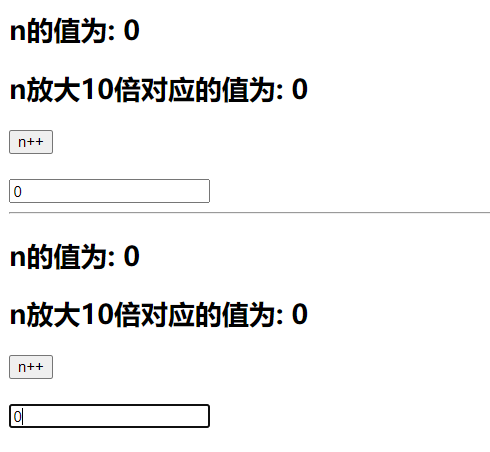

## 6. 自定义指令 总结

- 一、定义语法：

  - (1).局部指令：

    ```js
    new Vue({															
    	directives:{指令名:配置对象}     		
    }) 		
    ```

    ```js
    new Vue({
    	directives{指令名:回调函数}
    })
    ```

  - (2).全局指令：

    ```js
    Vue.directive(指令名,配置对象) 
    ```

    ```js
    Vue.directive(指令名,回调函数)
    ```

- 二、配置对象中常用的3个回调：

  - (1).bind：指令与元素成功绑定时调用。
  - (2).inserted：指令所在元素被插入页面时调用。
  - (3).update：指令所在模板结构被重新解析时调用。

- 三、备注：

  - 1.指令定义时不加v-，但使用时要加v-；
  - 2.指令名如果是多个单词，要使用kebab-case命名方式，不要用camelCase命名。

