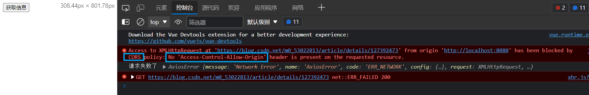
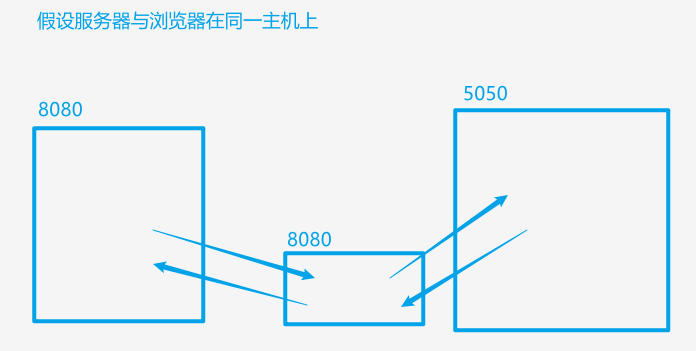
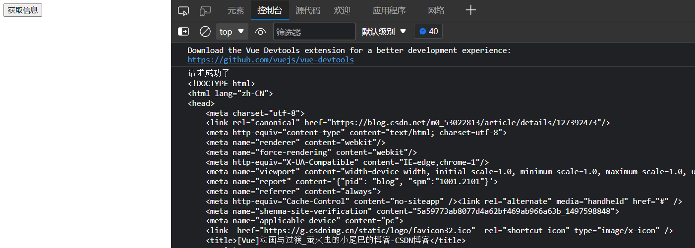
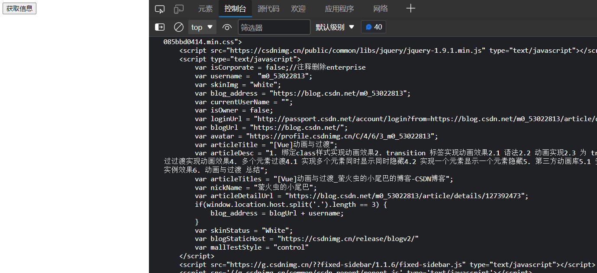

# 配置代理

------

   ## 1. 使用 axios 发送请求

   ### 1.1 安装 axios

   ```html
npm i axios
   ```

   ### 1.2 引入 axios

   ```js
import axios from 'axios'
   ```

   ### 1.3 发送请求

   ```html
<template>
  <div>
    <button @click="getMsg">获取信息</button>
  </div>
</template>

<script>
import axios from 'axios'

export default {
  name: 'App',
  methods: {
    getMsg() {
      axios.get('https://blog.csdn.net/m0_53022813/article/details/127392473').then(
        response=>{
          console.log('请求成功了', response.data)
        },
        error=>{
          console.log('请求失败了',error)
        }
      )
    }
  },
}
</script>
   ```

   > 观察结果，发生了跨域请求
   > 

   > 跨域请求：
   > 当请求地址与发送请求程序的协议名(http ftp等)、主机名(或IP地址)、端口号中有一个不一致会提示跨域请求。
   > 跨域请求的解决办法：
   > 1、cors，在服务器进行响应头设置
   > 2、jsonp，利用script标签中src属性引入外部资源不受同源策略限制，只能解决get的跨域请求
   > 3、代理服务器，浏览器在请求数据时，不直接向服务器请求，而是向代理服务器请求，代理服务器向服务器发起请求获取数据，然后把数据返回给浏览器。其中代理服务器与浏览器在同一主机上，同时端口号也一致，浏览器与代理服务器不会发生跨域请求；代理服务器与服务器之间的通信不存在跨域问题。
   > 

   > 这里使用代理服务器解决跨域问题

   ## 2. 借助vue-cli开启代理服务器

   通过 vue.config.js 修改脚手架配置开启代理服务器。

   > [vue-cli官网 开启代理服务器 配置参考](https://cli.vuejs.org/zh/config/#devserver-proxy)

   ### 2.1 方法一

   vue.config.js

   ```js
// 使用 @vue/cli-service 提供的 defineConfig 帮手函数，以获得更好的类型提示
// vue.config.js
const { defineConfig } = require('@vue/cli-service')

module.exports = defineConfig({
  // 选项
  pages: {
    index: {
      // page 的入口
      entry: 'src/my_main.js'
    }
  },
  // 关闭语法检查
  lintOnSave: false,
  // 开启代理服务器
  devServer: {
    // 设置代理服务器向服务器的请求地址，即向服务器发起请求
    // 只需要写到端口号
    proxy: 'https://blog.csdn.net'
  }
})
   ```

   > 修改 vue.config.js 配置文件，记得重启运行项目

   App.vue

   ```html
<template>
  <div>
    <button @click="getMsg">获取信息</button>
  </div>
</template>

<script>
import axios from 'axios'

export default {
  name: 'App',
  methods: {
    getMsg() {
      // 修改请求
      // 由原来的向服务器请求改为向代理服务器请求
      // 页面运行的地址 http://localhost:8080/
      // 所以代理服务器的地址也为 http://localhost:8080/
      // m0_53022813/article/details/127392473 资源路径不用修改
      axios.get('http://localhost:8080/m0_53022813/article/details/127392473').then(
        response=>{
          console.log('请求成功了', response.data)
        },
        error=>{
          console.log('请求失败了',error)
        }
      )
    }
  },
}
</script>
   ```

   > 请求成功，解决跨域问题
   > 

   方式一有两个缺点：
   1、当请求的资源本地就有，也就是项目对应的 public 中有相同名字的文件，代理服务器不会请求服务器，而是将本地的资源直接返回。
   2、只能配置一个代理服务器。
   3、不能灵活的控制请求是否走代理。

   ### 2.2 方法二

   vue.config.js

   ```js
// 使用 @vue/cli-service 提供的 defineConfig 帮手函数，以获得更好的类型提示
// vue.config.js
const { defineConfig } = require('@vue/cli-service')

module.exports = defineConfig({
  // 选项
  pages: {
    index: {
      // page 的入口
      entry: 'src/my_main.js'
    }
  },
  // 关闭语法检查
  lintOnSave: false,
  // 开启代理服务器
  // devServer: {
  //   // 设置代理服务器向服务器的请求地址，即向服务器发起请求
  //   // 只需要写到端口号
  //   proxy: 'https://blog.csdn.net'
  // },
  // 开启代理服务器 方法二
  devServer: {
    proxy: {
      // /api为请求前缀，可以改成其他名字
      // 只要请求资源路径的前缀为 /api 就通过代理服务器发送请求
      // 否则不通过代理服务器发送请求
      '/api': {
        // 设置代理服务器向服务器的请求地址，即向服务器发起请求
        target: 'https://blog.csdn.net',
        // 为路径重写，匹配api开头的字符串，并把api替换为空字符串，
        // 这样才能保证代理服务器转发给服务器的资源路径不带前边的前缀
        pathRewrite:{'^/api':''},
        // 用于支持websocket
        ws: true,
        // changeOrigin设置为true时，服务器收到的请求头中的host会与服务器一样
        //  changeOrigin设置为false时，服务器收到的请求头中的host为真实的请求来源地址
        //  changeOrigin默认值为true
        changeOrigin: true
      }
    }
  }
})
   ```

   > 修改 vue.config.js 配置文件，记得重启运行项目

   App.vue

   ```html
<template>
  <div>
    <button @click="getMsg">获取信息</button>
  </div>
</template>

<script>
import axios from 'axios'

export default {
  name: 'App',
  methods: {
    getMsg() {
      // 修改请求
      // 由原来的向服务器请求改为向代理服务器请求
      // 页面运行的地址 http://localhost:8080/
      // 所以代理服务器的地址也为 http://localhost:8080/
      // m0_53022813/article/details/127392473 资源路径需要添加对应的前缀
      axios.get('http://localhost:8080/api/m0_53022813/article/details/127392473').then(
        response=>{
          console.log('请求成功了', response.data)
        },
        error=>{
          console.log('请求失败了',error)
        }
      )
    }
  },
}
</script>
   ```

   > 请求成功
   > 

   ## 3. vue脚手架配置代理 总结

   ### 3.1 方法一

    在vue.config.js中添加如下配置：

   ```js
devServer:{
  proxy:"http://localhost:5000"
}
   ```

   说明：

      1. 优点：配置简单，请求资源时直接发给前端（8080）即可。
      2. 缺点：不能配置多个代理，不能灵活的控制请求是否走代理。
      3. 工作方式：若按照上述配置代理，当请求了前端不存在的资源时，那么该请求会转发给服务器 （优先匹配前端资源）

   ### 3.2 方法二

    编写vue.config.js配置具体代理规则：

   ```js
module.exports = {
	devServer: {
      proxy: {
      '/api1': {// 匹配所有以 '/api1'开头的请求路径
        target: 'http://localhost:5000',// 代理目标的基础路径
        changeOrigin: true,
        pathRewrite: {'^/api1': ''}
      },
      '/api2': {// 匹配所有以 '/api2'开头的请求路径
        target: 'http://localhost:5001',// 代理目标的基础路径
        changeOrigin: true,
        pathRewrite: {'^/api2': ''}
      }
    }
  }
}
/*
   changeOrigin设置为true时，服务器收到的请求头中的host为：localhost:5000
   changeOrigin设置为false时，服务器收到的请求头中的host为：localhost:8080
   changeOrigin默认值为true
*/
   ```

   说明：

      1. 优点：可以配置多个代理，且可以灵活的控制请求是否走代理。
      2. 缺点：配置略微繁琐，请求资源时必须加前缀。

   
