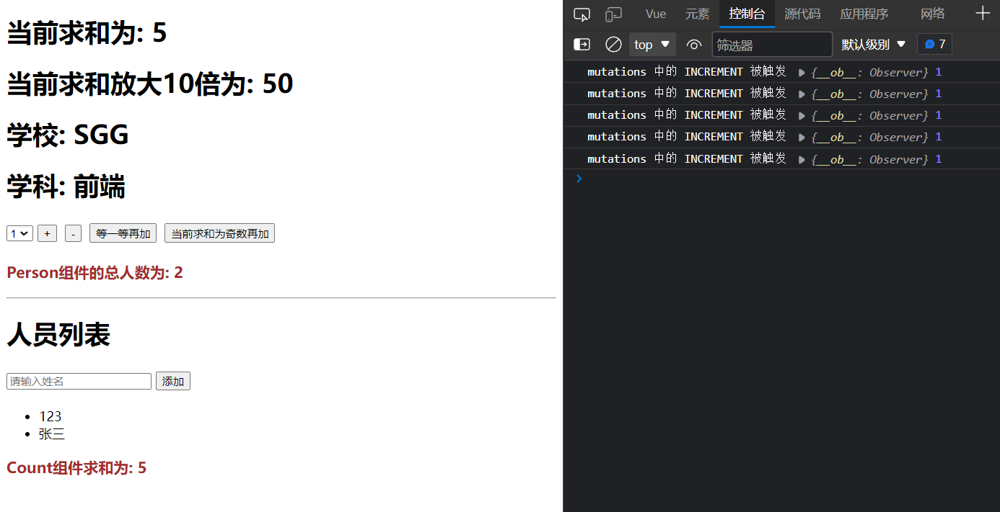

# 多组件共享数据与vuex模块化

## 1. 多组件共享数据案例

### 1.1 实现效果


### 1.2 代码实现

store/index.js

```js
// 该文件用于创建 vuex 中最为核心的 store

// 引入 vue
import Vue from 'vue'
// 引入 vuex
import Vuex from 'vuex'

// 使用 vuex
Vue.use(Vuex)

// 准备 actions 用于响应组件中的动作
const actions = {
  // 等一等再加
  incrementWait(context, value) {
    console.log('actions 中的 incrementWait 被触发', context, value)
    setTimeout(() => {
      context.commit('INCREMENTWAIT', value)
    }, 500);
  },
  // 当前求和为奇数再加
  incrementOdd(context, value) {
    console.log('actions 中的 incrementOdd 被触发', context, value)
    if (context.state.sum % 2) {
      context.commit('INCREMENTODD', value)
    }
  }
}
// 准备 mutations 用于操作数据 state
const mutations = {
  // 加法
  INCREMENT(store, value) {
    console.log('mutations 中的 INCREMENT 被触发', store, value)
    store.sum += value
  },
  // 减法
  DECREMENT(store, value) {
    console.log('mutations 中的 DECREMENT 被触发', store, value)
    store.sum -= value
  },
  // 等一等再加
  INCREMENTWAIT(store, value) {
    console.log('mutations 中的 INCREMENTWAIT 被触发', store, value)
    store.sum += value
  },
  // 当前求和为奇数再加
  INCREMENTODD(store, value) {
    console.log('mutations 中的 INCREMENTODD 被触发', store, value)
    store.sum += value
  },
  // 添加人员
  ADD_PERSON(state, person) {
    state.personList.unshift(person)
  }
}
// 准备 state 用于存储数据
const state = {
  // 当前求和
  sum: 0,
  school: 'SGG',
  subject: '前端',
  personList: [
    {id: '001', name: '张三'}
  ]
}

// getters 
const getters = {
  // 会有一个参数 state
  // 获取当前求和放大十倍后的值
  bigSum(state) {
    return state.sum * 10
  }
}

// 创建并导出 store
export default new Vuex.Store({
  actions,
  mutations,
  state,
  getters
})
```

main.js

```js
import Vue from 'vue'
import App from './App.vue'
// 引入 store
import store from './store'

//关闭vue的生产提示
Vue.config.productionTip = false

new Vue({
  render: h => h(App),
  store
}).$mount('#app')
```

App.vue

```html
<template>
  <div>
    <!-- 使用子组件 -->
    <Count></Count>
    <hr>
    <Person></Person>
  </div>
</template>

<script>
// 导入子组件
import Count from './components/Count.vue'
import Person from './components/Person.vue'

export default {
  name: 'App',
  // 注册子组件
  components: {
    Count,
    Person
  }
}
</script>
```

Count.vue

```html
<template>
  <div>
    <h1>当前求和为: {{sum}}</h1>
    <h1>当前求和放大10倍为: {{bigSum}}</h1>
    <h1>学校: {{school}}</h1>
    <h1>学科: {{subject}}</h1>
    <select v-model.number="n">
      <option value="1">1</option>
      <option value="2">2</option>
      <option value="3">3</option>
    </select>
    <button @click="INCREMENT(n)">+</button>
    <button @click="DECREMENT(n)">-</button>
    <button @click="incrementWait(n)">等一等再加</button>
    <button @click="incrementOdd(n)">当前求和为奇数再加</button>
    <h3>Person组件的总人数为: {{personList.length}}</h3>
  </div>
</template>

<script>
// 导入 mapState mapGetters
import { mapState, mapGetters } from 'vuex'
// 引入 mapMutations
import { mapMutations, mapActions } from 'vuex'

export default {
  name: 'Count',
  data() {
    return {
      n: 1
    }
  },
  computed: {
    // 借助mapState生成计算属性，从state中读取数据。（数组写法）
    ...mapState(['sum', 'school', 'subject', 'personList']),
    //借助mapGetters生成计算属性，从getters中读取数据。（数组写法）
    ...mapGetters(['bigSum'])
  },
  methods: {
    // 借助mapMutations生成对应的方法，方法中会调用commit去联系mutations(数组写法)
    ...mapMutations(['INCREMENT', 'DECREMENT']),
    // 借助mapActions生成对应的方法，方法中会调用dispatch去联系actions(数组写法)
    ...mapActions(['incrementWait', 'incrementOdd'])
  }
}
</script>

<style>
button {
  margin: 5px;
}

h3 {
  color: brown;
}
</style>
```

Person.vue

```html
<template>
  <div>
    <h1>人员列表</h1>
    <input type="text" placeholder="请输入姓名" v-model="name">
    <button @click="addPerson">添加</button>
    <ul>
      <li v-for="person in personList" :key="person.id">{{person.name}}</li>
    </ul>
    <h3>Count组件求和为: {{sum}}</h3>
  </div>
</template>

<script>
// 导入 mapState mapMutations
import {mapState, mapMutations} from 'vuex'
// 导入 nanoid 用于 id 的生成
import {nanoid} from 'nanoid'

export default {
  name: 'Person',
  data() {
    return {
      name: ''
    }
  },
  computed: {
    ...mapState(['personList', 'sum'])
  },
  methods: {
    addPerson() {
      const person = {
        id: nanoid(),
        name: this.name
      }
      this.ADD_PERSON(person)
      this.name = ''
    },
    ...mapMutations(['ADD_PERSON'])
  }
}
</script>

<style>

</style>
```

> 

## 2. vuex 模块化

vuex 模块化是将 vuex 中 actions、mutations、state、getters 中的数据和方法根据功能进行拆分。即和同一个功能相关的 actions、mutations、state、getters 放在一起。

### 2.1 vuex 模块化拆分

store/index.js

```js
// 该文件用于创建 vuex 中最为核心的 store

// 引入 vue
import Vue from 'vue'
// 引入 vuex
import Vuex from 'vuex'

// 使用 vuex
Vue.use(Vuex)

// 和计算相关的配置项
const acountOptions = {
  actions: {
    // 等一等再加
    incrementWait(context, value) {
      console.log('actions 中的 incrementWait 被触发', context, value)
      setTimeout(() => {
        context.commit('INCREMENTWAIT', value)
      }, 500);
    },
    // 当前求和为奇数再加
    incrementOdd(context, value) {
      console.log('actions 中的 incrementOdd 被触发', context, value)
      if (context.state.sum % 2) {
        context.commit('INCREMENTODD', value)
      }
    }
  },
  mutations: {
    // 加法
    INCREMENT(store, value) {
      console.log('mutations 中的 INCREMENT 被触发', store, value)
      store.sum += value
    },
    // 减法
    DECREMENT(store, value) {
      console.log('mutations 中的 DECREMENT 被触发', store, value)
      store.sum -= value
    },
    // 等一等再加
    INCREMENTWAIT(store, value) {
      console.log('mutations 中的 INCREMENTWAIT 被触发', store, value)
      store.sum += value
    },
    // 当前求和为奇数再加
    INCREMENTODD(store, value) {
      console.log('mutations 中的 INCREMENTODD 被触发', store, value)
      store.sum += value
    },
  },
  state: {
    sum: 0,
    school: 'SGG',
    subject: '前端',
  },
  getters: {
    bigSum(state) {
      return state.sum * 10
    }
  }
}

// 和人员相关的配置项
const personOptions = {
  actions: {},
  mutations: {
    // 添加人员
    ADD_PERSON(state, person) {
      state.personList.unshift(person)
    }
  },
  state: {
    personList: [
      { id: '001', name: '张三' }
    ]
  },
  getters: {}
}
```

### 2.2 使用模块化后的配置项

创建store实例对象时，使用模块化后的配置项，模块化后的配置项需要写在store的modules配置项中。

store/index.js

```js
// 创建并导出 store
export default new Vuex.Store({
  modules: {
    acount: acountOptions,
    person: personOptions
  }
})
```

### 2.2 开启命名空间

> 启用命名空间后，模块内的状态（state）、getters、mutations 和 actions 将被隔离，避免命名冲突，同时提供更清晰的访问路径。

```js
// 配置项开启命名空间
namespaced: true,
```

store/index.js

```js
// 和计算相关的配置项
const acountOptions = {
  namespaced: true,
  actions: {
    ......
  },
  mutations: {
    ......
  },
  state: {
    ......
  },
  getters: {
    ......
  }
}

// 和人员相关的配置项
const personOptions = {
  namespaced: true,
  actions: {},
  mutations: {
    ......
  },
  state: {
    ......
  },
  getters: {}
}
```

### 2.3 模块化后读取数据和方法

vuex 模块化使用 mapState、mapGetters、mapMutations、mapActions 读取数据和获取相应的方法，需要在数组和对象前面先传入一个参数，该参数为数据和方法对应所在的命名空间。

Count.vue

```html
<template>
  <div>
    <h1>当前求和为: {{sum}}</h1>
    <h1>当前求和放大10倍为: {{bigSum}}</h1>
    <h1>学校: {{school}}</h1>
    <h1>学科: {{subject}}</h1>
    <select v-model.number="n">
      <option value="1">1</option>
      <option value="2">2</option>
      <option value="3">3</option>
    </select>
    <button @click="INCREMENT(n)">+</button>
    <button @click="DECREMENT(n)">-</button>
    <button @click="incrementWait(n)">等一等再加</button>
    <button @click="incrementOdd(n)">当前求和为奇数再加</button>
    <h3>Person组件的总人数为: {{personList.length}}</h3>
  </div>
</template>

<script>
// 导入 mapState mapGetters
import { mapState, mapGetters } from 'vuex'
// 引入 mapMutations
import { mapMutations, mapActions } from 'vuex'

export default {
  name: 'Count',
  data() {
    return {
      n: 1
    }
  },
  computed: {
    // 借助mapState生成计算属性，从state中读取数据。（数组写法）
    ...mapState('acount',['sum', 'school', 'subject']),
    ...mapState('person',['personList']),
    //借助mapGetters生成计算属性，从getters中读取数据。（数组写法）
    ...mapGetters('acount',['bigSum'])
  },
  methods: {
    // 借助mapMutations生成对应的方法，方法中会调用commit去联系mutations(数组写法)
    ...mapMutations('acount',['INCREMENT', 'DECREMENT']),
    // 借助mapActions生成对应的方法，方法中会调用dispatch去联系actions(数组写法)
    ...mapActions('acount',['incrementWait', 'incrementOdd'])
  }
}
</script>

<style>
button {
  margin: 5px;
}

h3 {
  color: brown;
}
</style>
```

Person.vue

```html
<template>
  <div>
    <h1>人员列表</h1>
    <input type="text" placeholder="请输入姓名" v-model="name">
    <button @click="addPerson">添加</button>
    <ul>
      <li v-for="person in personList" :key="person.id">{{person.name}}</li>
    </ul>
    <h3>Count组件求和为: {{sum}}</h3>
  </div>
</template>

<script>
// 导入 mapState mapMutations
import {mapState, mapMutations} from 'vuex'
// 导入 nanoid 用于 id 的生成
import {nanoid} from 'nanoid'

export default {
  name: 'Person',
  data() {
    return {
      name: ''
    }
  },
  computed: {
    ...mapState('acount',['sum']),
    ...mapState('person',['personList'])
  },
  methods: {
    addPerson() {
      const person = {
        id: nanoid(),
        name: this.name
      }
      this.ADD_PERSON(person)
      this.name = ''
    },
    ...mapMutations('person', ['ADD_PERSON'])
  }
}
</script>

<style>

</style>
```

> 

## 3. 总结 多组件共享数据与vuex模块化

### 3.1. 目的

让代码更好维护，让多种数据分类更加明确。

### 3.2. 修改`store.js`

```javascript
   const countAbout = {
     namespaced:true,//开启命名空间
     state:{x:1},
     mutations: { ... },
     actions: { ... },
     getters: {
       bigSum(state){
          return state.sum * 10
       }
     }
   }
   
   const personAbout = {
     namespaced:true,//开启命名空间
     state:{ ... },
     mutations: { ... },
     actions: { ... }
   }
   
   const store = new Vuex.Store({
     modules: {
       countAbout,
       personAbout
     }
   })
```

### 3.3 开启命名空间后，组件中读取state数据

```js
   //方式一：自己直接读取
   this.$store.state.personAbout.list
   //方式二：借助mapState读取：
   ...mapState('countAbout',['sum','school','subject']),
```

### 3.4. 开启命名空间后，组件中读取getters数据：

```js
   //方式一：自己直接读取
   this.$store.getters['personAbout/firstPersonName']
   //方式二：借助mapGetters读取：
   ...mapGetters('countAbout',['bigSum'])
```

### 3.5. 开启命名空间后，组件中调用dispatch

```js
   //方式一：自己直接dispatch
   this.$store.dispatch('personAbout/addPersonWang',person)
   //方式二：借助mapActions：
   ...mapActions('countAbout',{incrementOdd:'jiaOdd',incrementWait:'jiaWait'})
```

### 3.6. 开启命名空间后，组件中调用commit

```js
   //方式一：自己直接commit
   this.$store.commit('personAbout/ADD_PERSON',person)
   //方式二：借助mapMutations：
   ...mapMutations('countAbout',{increment:'JIA',decrement:'JIAN'}),
```

