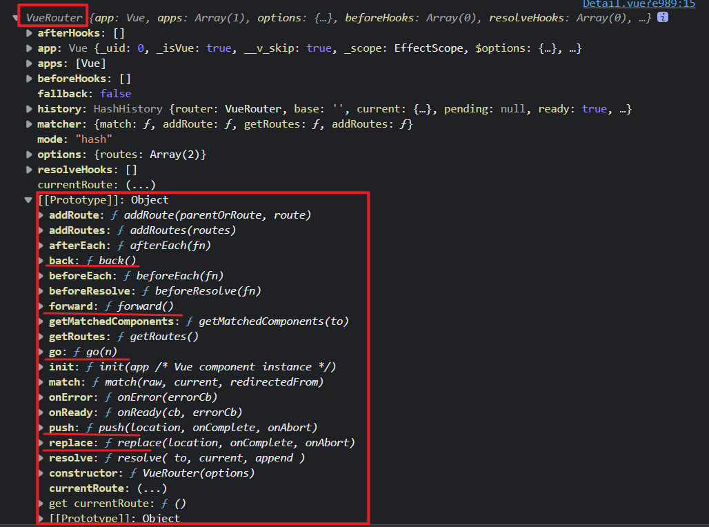

# 编程式路由导航

## 1. 声明式导航 & 编程式导航

### 1.1 声明式导航

通过点击链接实现导航的方式，叫做声明式导航。

例如： 普通网页中点击`<a>`链接、vue 项目中点击 `<router-link>`都属于声明式导航。

### 1.2 编程式导航

通过调用 API 方法实现导航的方式，叫做编程式导航。

例如： 普通网页中调用 location.href 跳转到新页面的方式，属于编程式导航。

## 2. vue-router 中的编程式导航 API

vue-router 提供了许多编程式导航的 API，vue-router 提供的编程式导航 API 都在 **vue-router 的原型对象上。** 

### 2.1 常用的编程式导航 API

1. `$router.push(地址)` 跳转到指定 hash 地址，并增加一条历史记录
2. `$router.replace(地址)` 跳转到指定的 hash 地址，并替换掉当前的历史记录
3. `$router.go(数值 n)` 实现导航历史前进、后退，n 为前进或后退的次数
4. `$router.back()` 在历史记录中，后退到上一个页面
5. `$router.forward()` 在历史记录中，前进到下一个页面

### 2.2 $router.push与$router.replace

调用 `$router.push()`方法或`$router.replace()`方法，可以跳转到指定的地址，从而展示对应的组件页面。

push 和 replace 的区别：

> push 会增加一条历史记录 replace 不会增加历史记录，而是替换掉当前的历史记录

```html
<template>
  <div class="home-container">
    <h3>Home 组件</h3>

    <hr />

    <button @click="gotoLk">通过 push 跳转到“洛基”页面</button>
    <button @click="gotoLk2">通过 replace 跳转到“洛基”页面</button>
  </div>
</template>

<script>
export default {
  name: 'Home',
  methods: {
    gotoLk() {
      // 通过编程式导航 API，导航跳转到指定的页面
      this.$router.push('/movie/1')
    },
    gotoLk2() {
    	// 通过编程式导航 API，导航跳转到指定的页面
      	this.$router.replace('/movie/1')
    }
  }
}
</script>

<style lang="less" scoped>
.home-container {
  min-height: 200px;
  background-color: pink;
  padding: 15px;
}
</style>
```

### 2.3 $router.go

调用 `$router.go()`方法，可以在浏览历史中前进和后退。`$router.go()`方法通过参数指定前进或后退的次数。参数为正数表示前进，参数为负数表示后退。

```html
<template>
  <div class="movie-container">
    <!-- this.$route 是路由的“参数对象” -->
    <!-- this.$router 是路由的“导航对象” -->
    <h3>Movie 组件 --- {{ $route.params.mid }} --- {{ mid }}</h3>
    <button @click="showThis">打印 this</button>
    <button @click="goback">后退</button>
  </div>
</template>

<script>
export default {
  name: 'Movie',
  // 接收 props 数据
  props: ['mid'],
  methods: {
    showThis() {
      console.log(this)
    },
    goback() {
      // go(-1) 表示后退一层
      // 如果后退的层数超过上限，则原地不动
      this.$router.go(-1)
    }
  }
}
</script>

<style lang="less" scoped>
.movie-container {
  min-height: 200px;
  background-color: lightsalmon;
  padding: 15px;
}
</style>
```

### 2.4 $router.back() & $router.forward()

在实际开发中，一般只会前进和后退一层页面。因此 vue-router 提供了如下两个便捷方法：`$router.back()` & `$router.forward()`

- `$router.back()` ：在历史记录中，后退到上一个页面
- `$router.forward()` ：在历史记录中，前进到下一个页面

```html
<template>
  <div class="movie-container">
    <!-- this.$route 是路由的“参数对象” -->
    <!-- this.$router 是路由的“导航对象” -->
    <h3>Movie 组件 --- {{ $route.params.mid }} --- {{ mid }}</h3>
    <button @click="showThis">打印 this</button>
    <button @click="goback">后退</button>
    <!-- 在行内使用编程式导航跳转的时候，this 必须要省略，否则会报错！ -->
    <button @click="$router.back()">back 后退</button>
    <button @click="$router.forward()">forward 前进</button>
  </div>
</template>

<script>
export default {
  name: 'Movie',
  // 接收 props 数据
  props: ['mid'],
  methods: {
    showThis() {
      console.log(this)
    },
    goback() {
      // go(-1) 表示后退一层
      // 如果后退的层数超过上限，则原地不动
      this.$router.go(-1)
    }
  }
}
</script>

<style lang="less" scoped>
.movie-container {
  min-height: 200px;
  background-color: lightsalmon;
  padding: 15px;
}
</style>
```

## 3. 总结 编程式路由导航

1. 作用：不借助`<router-link>`实现路由跳转，让路由跳转更加灵活

2. 具体编码：

   ```js
   //$router的两个API
   this.$router.push({
   	name:'xiangqing',
       params:{
           id:xxx,
           title:xxx
       }
   })
   
   this.$router.replace({
   	name:'xiangqing',
       params:{
           id:xxx,
           title:xxx
       }
   })
   this.$router.forward() //前进
   this.$router.back() //后退
   this.$router.go() //可前进也可后退
   ```

