# 路由守卫

## 1. 路由守卫

### 1.1 概念

路由守卫能够对路由进行权限控制，即在路由进行改变时，可以判断当前能否访问路由对应的组件。

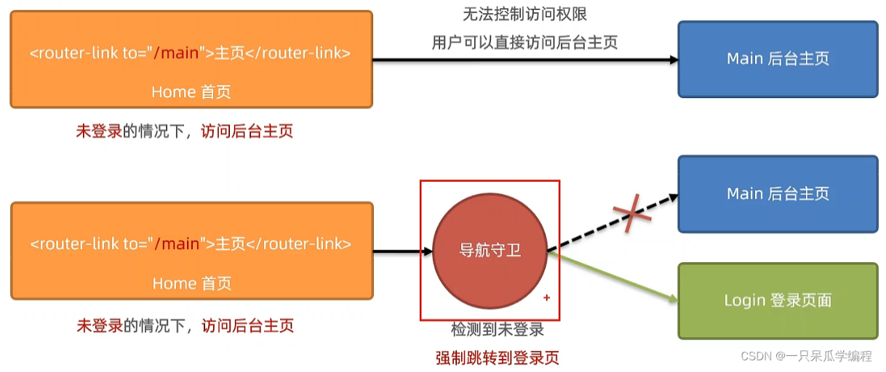

### 1.2 分类

路由守卫分为：全局守卫、独享守卫、组件内守卫。

## 2. 全局路由守卫

### 2.1 全局前置路由守卫

全局前置路由守卫会在初始化时被触发，在每次进行路由的切换前也会被触发。

```js
// 全局前置路由守卫
// 在初始化时被触发，在每次进行路由的切换前也会被触发
// 全局前置路由守卫的回调函数接收三个参数
// to：表示将要访问的路由的信息对象
// from：表示将要离开的路由的信息对象
// next：是一个函数，表示放行的意思，调用next()才可以访问to的路由
router.beforeEach((to, from, next) => {
  
})
router.beforeEach((to, from, next) => {
  console.log(to, from)
})
```

> 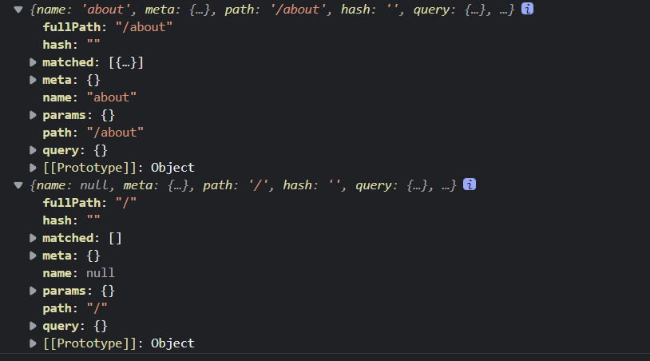

实现如果localStorage中存在school的值为SGG则可以对News组件和Message组件进行访问，如果school的值不为SGG则不能进行访问。其他组件可以不用判断直接放行。

router/index.js

```js
// 该文件专门用于创建整个应用的路由器
import VueRouter from 'vue-router'
//引入组件
import About from '../pages/About'
import Home from '../pages/Home'
import Message from '../pages/Message'
import News from '../pages/News'
import Detail from '../pages/Detail'

// 创建一个路由器
// 路由器的暴露需要在路由守卫之后，
// 否则路由守卫不会触发(路由守卫控制权限之前路由器已经被暴露出去了)
const router = new VueRouter({
  routes: [
    {
      name: 'about',
      path: '/about',
      component: About
    },
    {
      name: 'home',
      path: '/home',
      component: Home,
      children: [
        {
          name: 'news',
          path: 'news',
          component: News
        },
        {
          name: 'message',
          path: 'message',
          component: Message,
          children: [
            {
              name: 'messageDetail',
              path: 'detail',
              component: Detail,
              props($route) {
                return {
                  id: $route.query.id,
                  title: $route.query.title
                }
              },
            }
          ]
        }
      ]
    }
  ]
})

// 全局前置路由守卫
// 在初始化时被触发，在每次进行路由的切换前也会被触发
// 全局前置路由守卫的回调函数接收三个参数
// to：表示将要访问的路由的信息对象
// from：表示将要离开的路由的信息对象
// next：是一个函数，表示放行的意思，调用next()才可以访问to的路由
router.beforeEach((to, from, next) => {
  console.log(to)
  // 通过路由的name判断要前往的路由
  // 如果要访问 News Message 组件进行权限判断
  if (to.name === 'news' || to.name === 'message') {
    // 判断 school 的值是否为 SGG
    if (localStorage.getItem('school') === 'SGG') {
      next()
    } else {
      alert('school的值不为SGG，不能访问')
    }
  } else { // 访问其他组件直接放行
    next()
  }
})

// 保留路由器
export default router
```

> 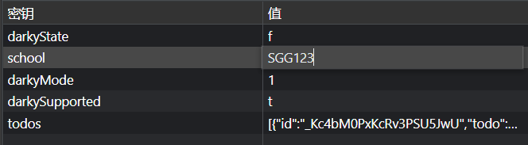 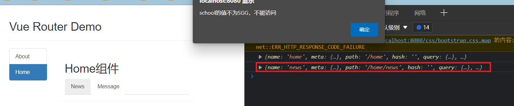 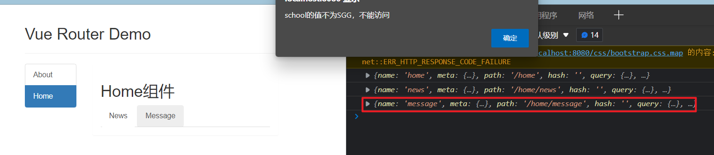 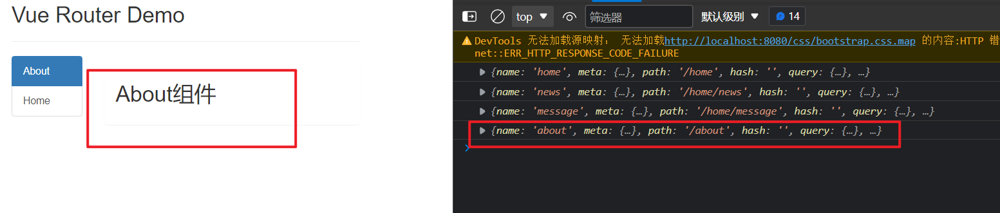

### 2.2 meta

在配置路由时，可以传入meta配置项，在meta配置项中可以写我们自己的数据，可以用于判断当前路由是否需要进行权限的判断。

```js
// 全局前置路由守卫
router.beforeEach((to, from, next) => {
  console.log(to)
  // 路由meta中的isAuth为true则要进行权限的控制
  if (to.meta.isAuth) {
    // 判断 school 的值是否为 SGG
    if (localStorage.getItem('school') === 'SGG') {
      next()
    } else {
      alert('school的值不为SGG，不能访问')
    }
  } else { // 访问其他组件直接放行
    next()
  }
})

// 创建一个路由器
const router = new VueRouter({
  routes: [
    {
      name: 'about',
      path: '/about',
      component: About,
      meta: {isAuth: false}
    },
    {
      name: 'home',
      path: '/home',
      component: Home,
      children: [
        {
          name: 'news',
          path: 'news',
          component: News,
          meta: {isAuth: true}
        },
        {
          name: 'message',
          path: 'message',
          component: Message,
          meta: {isAuth: true},
          children: [
            {
              name: 'messageDetail',
              path: 'detail',
              component: Detail,
              props($route) {
                return {
                  id: $route.query.id,
                  title: $route.query.title
                }
              },
            }
          ]
        }
      ]
    }
  ]
})
```

> 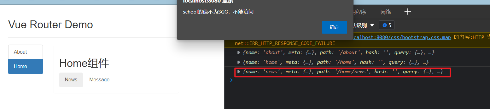

### 2.3 全局后置路由守卫

全局后置路由守卫会在初始化时被触发，在每次进行路由的切换后也会被触发。

```js
// 全局后置路由守卫
// 在初始化时被触发，在每次进行路由的切换后也会被触发
// 全局前置路由守卫的回调函数接收两个参数
// to：表示将要访问的路由的信息对象
// from：表示将要离开的路由的信息对象
// 全局后置路由守卫无 next
router.afterEach((to, from, next) => {
  console.log(to, from, next)
})
```

> 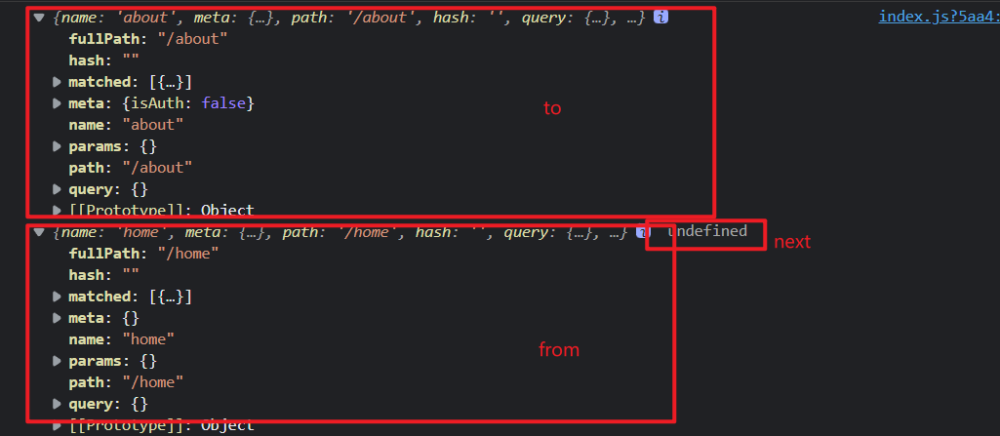

访问相关组件之后，实现页面标题根据当前不同组件进行切换。

```js
// 创建一个路由器
const router = new VueRouter({
  routes: [
    {
      name: 'about',
      path: '/about',
      component: About,
      meta: {isAuth: false, title: '关于'}
    },
    {
      name: 'home',
      path: '/home',
      component: Home,
      meta: {isAuth: false, title: '主页'},
      children: [
        {
          name: 'news',
          path: 'news',
          component: News,
          meta: {isAuth: true, title: '新闻'}
        },
        {
          name: 'message',
          path: 'message',
          component: Message,
          meta: {isAuth: true, title: '消息'},
          children: [
            {
              name: 'messageDetail',
              path: 'detail',
              component: Detail,
              meta: {isAuth: false, title: '详情'},
              props($route) {
                return {
                  id: $route.query.id,
                  title: $route.query.title
                }
              },
            }
          ]
        }
      ]
    }
  ]
})
// 全局后置路由守卫
router.afterEach((to, from, next) => {
  // console.log(to, from, next)
  // 切换页面的标题
  document.title = to.meta.title
})
```

> 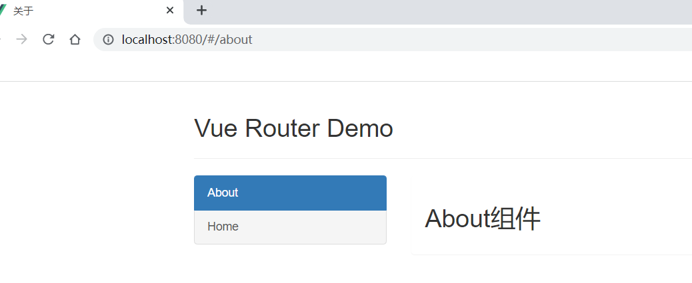 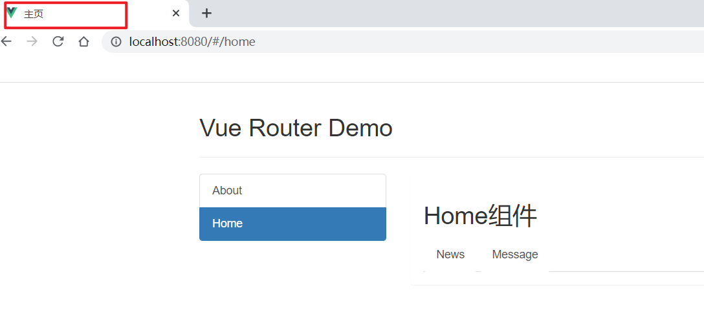

## 3. 独享路由守卫

独享路由守卫写在每个路由对应的配置中，即独享路由守卫是每个路由所独享的，独享路由守卫与全局前置路由守卫类似。

> 注意：独享路由守卫与全局路由守卫不一样，独享路由守卫不分前置和后置。

> 注释全局前置路由守卫

```js
// 创建一个路由器
const router = new VueRouter({
  routes: [
    ......
    {
      name: 'home',
      path: '/home',
      component: Home,
      meta: { isAuth: false, title: '主页' },
      children: [
        {
          name: 'news',
          path: 'news',
          component: News,
          meta: { isAuth: true, title: '新闻' },
          beforeEnter(to, from, next) {
            console.log(to, from)
            // 判断 school 的值是否为 SGG
            if (localStorage.getItem('school') === 'SGG') {
              next()
            } else {
              console.log('school的值不正确，不能访问')
              alert('school的值不正确，不能访问')
            }
          }
        },
        ......
          ]
        }
      ]
    }
  ]
})
```

> 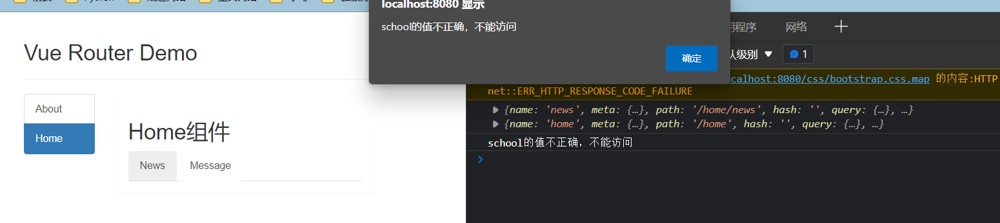

## 4. 组件内路由守卫

组件内路由守卫写在组件内，组件路由守卫有： 1.`beforeRouteEnter`：通过路由规则，进入该组件时被调用 2.`beforeRouteLeave`：通过路由规则，离开该组件时被调用

> 注释全局前置路由守卫与全局后置路由守卫

```html
<template>
  <div>
    <h2>About组件</h2>
  </div>
</template>

<script>
export default {
  name: 'About',
  beforeRouteEnter(to, from, next) {
    console.log('beforeRouteEnter')
    console.log(to)
    console.log(from)
    next()
  },
  beforeRouteLeave(to, from, next) {
    console.log('beforeRouteLeave')
    console.log(to)
    console.log(from)
    next()
  }
}
</script>

<style>

</style>
```

> 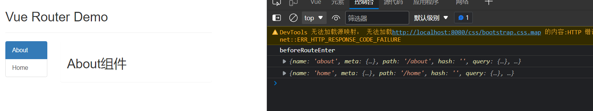 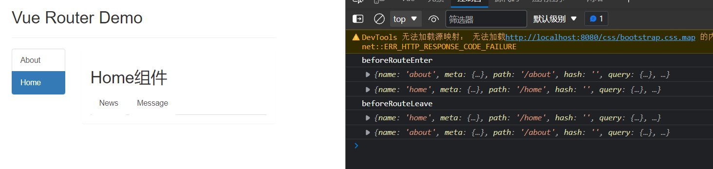

## 5. 总结 路由守卫

1. 作用：对路由进行权限控制

2. 分类：全局守卫、独享守卫、组件内守卫

3. 全局守卫:

   > 写在router/index.js 中 export default router之前

   ```js
   //全局前置守卫：初始化时执行、每次路由切换前执行
   router.beforeEach((to,from,next)=>{
   	console.log('beforeEach',to,from)
   	if(to.meta.isAuth){ //判断当前路由是否需要进行权限控制
   		if(localStorage.getItem('school') === 'atguigu'){ //权限控制的具体规则
   			next() //放行
   		}else{
   			alert('暂无权限查看')
   			// next({name:'guanyu'})
   		}
   	}else{
   		next() //放行
   	}
   })
   
   //全局后置守卫：初始化时执行、每次路由切换后执行
   router.afterEach((to,from)=>{
   	console.log('afterEach',to,from)
   	if(to.meta.title){ 
   		document.title = to.meta.title //修改网页的title
   	}else{
   		document.title = 'vue_test'
   	}
   })
   ```

4. 独享守卫:

   ```js
   beforeEnter(to,from,next){
   	console.log('beforeEnter',to,from)
   	if(to.meta.isAuth){ //判断当前路由是否需要进行权限控制
   		if(localStorage.getItem('school') === 'atguigu'){
   			next()
   		}else{
   			alert('暂无权限查看')
   			// next({name:'guanyu'})
   		}
   	}else{
   		next()
   	}
   }
   ```

5. 组件内守卫：

   ```js
   //进入守卫：通过路由规则，进入该组件时被调用
   beforeRouteEnter (to, from, next) {
   },
   //离开守卫：通过路由规则，离开该组件时被调用
   beforeRouteLeave (to, from, next) {
   }
   ```

