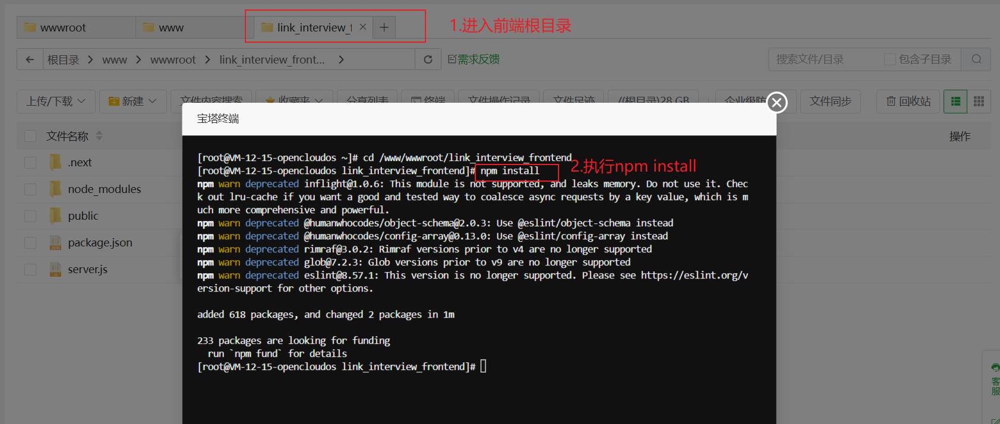
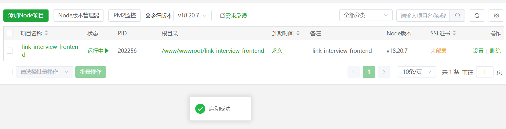

## 部署next项目报错 next start sh: line 1: next: command not found

背景: 使用宝塔面板在云服务器部署next项目时报错：`next start sh: line 1: next: command not found`

解决办法如图：

> 虽然本地打包之后，将node_modules文件夹打包了进去，但上传到服务器之后还是要执行 `npm install`

之后项目启动成功

