> 视频地址：https://www.bilibili.com/video/BV1wy4y1D7JT/?share_source=copy_web&vd_source=2f53150f23426ed5ddde738e7faf9a21
> 笔记地址：https://blog.csdn.net/qq_44870156/article/details/122735033

> 
>
> ------
>
> ### **React并不是框架、而是一个库**
>
> #### **核心设计理念：专注于视图层**
>
> React 的职责非常单一：**构建用户界面**，即 MVC 模型中的 "V"（视图层）。它不提供路由、状态管理、HTTP 请求等功能，而是依赖于外部库或工具（例如 React Router、Redux）来完成这些任务。
>
> #### **灵活性和可扩展性**
>
> - React 提供了基本的 UI 构建功能，你可以自由选择需要的工具来搭建项目架构。例如：
>   - 路由管理可以使用 React Router。
>   - 状态管理可以使用 Redux、MobX 或其他工具。
>   - 数据获取可以使用 Axios 或 Fetch API。
> - 这种灵活性允许开发者根据项目需求自定义技术栈，但也增加了复杂性，因为你需要自己做很多决定。
>
> #### **学习和开发体验**
>
> - React 更像是一块“拼图”，你需要自己找到其他拼图块来完成整个系统。
> - 由于它的模块化设计，React 不强制使用某种架构，提供了更多的自由度。
>
> 因此，React 是一个 **UI 构建库**，而不是一个覆盖所有需求的框架。

##  第1章 React简介

- 用于构建用户界面的jsx库（只关注页面），将数据渲染为HTML视图；
- 由Facebook开发且开源。
- [中文官网](https://react.docschina.org/)
  [英文官网](https://reactjs.org/)

React可以克服原生JS的以下缺点：

1. 原生JS操作DOM繁琐且效率低，因为用DOM-API操作UI；
2. JS直接操作DOM会使浏览器进行大量的重绘重排；
3. 原生JS没有组件化编码方案，代码复用率低

**react开发者工具**：Chrome插件 React Developer Tool（注意安装来源为facebook的）

### 1.1 React的特点

1. 采用组件化模式，声明式编码，提高开发效率及组件复用率;
2. 在React Native中可以使用React语法进行*移动端开发*；
3. 使用虚拟DOM+优秀的Diffing算法，尽量减少与真实DOM的交互。
   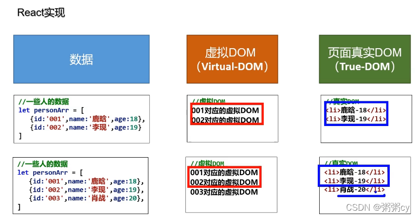
   对比两次生成的虚拟DOM，如果重复，直接用页面之前有的DOM，而不是全部重绘真实DOM

### 1.2 引入文件

- react.js （核心库）：核心库要在react-dom之前引入
- react-dom.js ：提供操作DOM的react扩展库
- babel.min.js：解析JSX语法代码转为JS代码的库，即ES6==>ES5;JSX==>JS

### 1.3 JSX

全称: jsx XML，是react定义的一种类似于XML的JS扩展语法，本质是`React.createElement(component, props, ...children)`方法的语法糖。JXS最终产生的虚拟DOM就是一个JS对象。

#### 1.3.1 为什么要用JSX

- 更加简单地创建虚拟DOM
  （1）使用JSX创建虚拟DOM
  
  （2）使用JS创建虚拟DOM（用原生JS，不用babel，开发中不使用)
  
- JSX创建虚拟DOM的方法是JS方法的语法糖

#### 1.3.2 JSX语法规则

- 定义虚拟DOM时不用写引号
- 标签中混入JS表达式时要用`{}`

```jsx
const VDOM=(
            <div>
                <h1>前端js框架列表</h1>
                <ul>
                    {
                        data.map((item,index)=>{
                            return <li key={index}>{item}</li>
                        })
                    }
                </ul>               
            </div>           
        )
```

> 遇到以 { 开头的代码，以JS语法解析，且标签中的js表达式必须用{ }包含，比如`<ul>`中的`{}`中的`{index}`和`{item}`
>
> **注：**`key={index}`：在进行组件遍历的时候必须要加一个key来区分每个组件

- CSS类名指定不用`class`，用`className`
- 内联样式要用`style={{key：value}}`的样式写，如`style={{color：‘white’，fontSize：20px}}`（fontSize这种由多个单词组成的要用小驼峰格式写）
- 虚拟DOM必须只有一个根标签
- 标签必须闭合，如 `<input type="test" />`
- 标签首字母
  （1）若小写字母开头，则转为html5中的同名元素，如html5中无该标签，则报错
  （2）若大写字母开头，react就去渲染对应的组件，若组件没有定义，则报错

**辨析【js表达式】和【js语句 (代码)】**

- 表达式：一个表达式可以产生一个值，可以放在任何需要值的地方，如
  （1）`a`
  （2）`a+b`
  （3）`demo(1)`
  （4）`arr.map()`
  （5）`function test () {}`
- 语句（代码）：如
  （1）`if () {}`
  （2）`for () {}`
  （3）`switch () {case:xxxx}`

### 1.4 虚拟DOM

1. 本质是Object，即一般对象（不是数组对象和函数对象）

2. 虚拟DOM比较“轻”，真实DOM比较“重”，因为虚拟DOM是react内部在用，无需真实DOM中那么多属性
   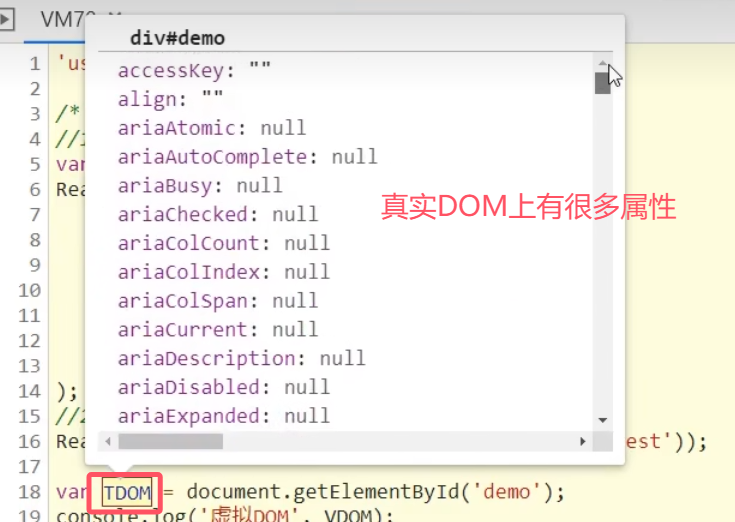

   

3. 虚拟DOM最终会被react转换为真实DOM呈现在页面上

### 1.5 模块与组件

#### 1.5.1 模块

- 向外界提供特定功能的js程序。随着业务逻辑增加，代码越来越多且复杂，此时js一般会拆成多个js文件来编写，一般一个js文件就是一个模块
- 作用：复用js，简化js的编写，提高js的运行效率
- 模块化：当应用的js都以模块来编写的, 这个应用就是一个模块化的应用

#### 1.5.2 组件

- 用来实现局部功能效果的代码和资源的集合(html/css/js/image等等)。比如一个功能齐全的Header栏就是一个组件。
- 复用编码, 简化项目编码, 提高运行效率
- 组件化：当应用是以多组件的方式实现, 这个应用就是一个组件化的应用

## 第2章 React面向组件编程

### 2.1 创建组件

#### 2.1.1 函数式组件

适用于简单组件（无`state`）

```jsx
<script type="text/babel">
		// 创建函数组件
		function MyComponent(){
			return <h2>我是用函数定义的组件(适用于【简单组件】的定义)</h2>
		}
		//2.渲染组件到页面
		ReactDOM.render(<MyComponent/>,document.getElementById('test'))
	</script>
```

**注意事项：**

- 函数中的`this`指向`undefined`，因为babel编译后开启了严格模式

本例中，执行了`ReactDOM.render(<MyComponent/>.......）`之后，发生了什么？

1. React解析组件标签，找到了MyComponent组件。
2. 发现组件是使用函数定义的，随后调用该函数，将返回的虚拟DOM转为真实DOM，随后呈现在页面中。

#### 2.1.2 类式组件

适用于复杂组件（有`state`）

```jsx
<script type="text/babel">
		//1.创建类式组件
		class MyComponent extends React.Component {
			render(){
				return <h2>我是用类定义的组件(适用于【复杂组件】的定义)</h2>
			}
		}
		//2.渲染组件到页面
		ReactDOM.render(<MyComponent/>,document.getElementById('test'))
		
	</script>
```

**注意事项：**

- 类式组件必须要继承react的内值类`React.Component`
- 一定要写`render`函数，且要有返回值
- `render`是放在类的原型对象上，供实例使用。
- `render`中的this指向类的实例对象（原因见下方） <=> 类式组件的实例对象。

本例中，执行了`ReactDOM.render(<MyComponent/>.......）`之后，发生了什么？

1. React解析组件标签，找到了MyComponent组件。
2. 发现组件是使用类定义的，随后`new`出来该类的实例，并通过该实例调用到原型上的`render`方法。
3. 将`render`返回的虚拟DOM转为真实DOM，随后呈现在页面中。

### 2.2 组件实例的三大属性

针对于类式组件，hooks可以让函数式组件也有三大属性

#### 2.2.1 state属性

##### 基本使用

- `state`是组件对象最重要的属性, 值是对象(可以包含多个key-value的组合)
- 组件被称为"状态机", 通过更新组件的`state`来**更新**对应的页面显示(重新渲染组件)

**代码实例：** 点击切换天气状态

**标准写法**

```jsx
<script type="text/babel">
		//1.创建组件
		class Weather extends React.Component{
			
			//构造器调用几次？ ———— 1次，只写了一个weather标签
			constructor(props){  //为了操作state
				console.log('constructor');
				super(props)
				//初始化状态
				this.state = {isHot:false,wind:'微风'}
				//解决changeWeather中this指向问题
				this.changeWeather = this.changeWeather.bind(this)
			}

			//render调用几次？ ———— 1+n次 1是初始化的那次 n是状态更新的次数
			render(){
				console.log('render');
				//读取状态
				const {isHot,wind} = this.state   //这种写法的依据?
				//复杂方法
				// const isHot = this.state.isHot;
				// const wind = this.state.wind;
				return <h1 onClick={this.changeWeather}>今天天气很{isHot ? '炎热' : '凉爽'}，{wind}</h1>
			}
			//、这里onclick是赋值语句，不能调用
			//changeWeather调用几次？ ———— 点几次调几次
			changeWeather(){
				//changeWeather放在哪里？ ———— Weather的原型对象上，供实例使用
				//由于changeWeather是作为onClick的回调，所以不是通过实例调用的，是直接调用
				//类中的方法默认开启了局部的严格模式，所以changeWeather中的this为undefined
				
				console.log('changeWeather');
				//获取原来的(isHot值
				const isHot = this.state.isHot
				//严重注意：状态必须通过setState进行更新,且更新是一种合并，不是替换（wind还在）。
				this.setState({isHot:!isHot})
				console.log(this);

				//严重注意：状态(state)不可直接更改，下面这行就是直接更改！！！
				//this.state.isHot = !isHot //这是错误的写法
			}
		}
		//2.渲染组件到页面
		ReactDOM.render(<Weather/>,document.getElementById('test'))
				
	</script>
```

注意事项：

- 在构造器`constructor`中初始化`state`，且要用对象形式初始化`state`
- 在`render`函数中创建虚拟DOM时，直接在标签中绑定事件，且事件写法不同于原生JS，如原生JS中的`onclick`事件，在react中要写成`onClick`，其他同理。
- `onClick={this.changeWeather}`是将`this.changeWeather`函数赋值给`onClick`，函数后面不能加括号，否则就是将函数返回值赋值
- 事件的回调函数要写在类中，此时它放在类的实例对象的原型链上，供实例使用。在本例中，由于`changeWeather`是作为`onClick`的回调，所以不是通过实例调用的，是直接调用，且类中的方法默认开启了局部的严格模式，所以其中`this`的指向不是实例对象，而是`undefined`。`render`函数也是放在对象的原型链上，但是它是由类的实例对象调用的，所以`this`指向实例对象
- 自定义的事件回调函数的`this`可以在构造器中用`bind`更改指向，生成的新函数直接在类中，所以`this`指向实例对象
- **注意：** 状态必须通过setState以对象的形式进行更新,且更新是一种合并，不是替换
- `const {isHot,wind} = this.state`是ES6中的对象解构，获取多个对象属性的方法

##### 简写方法（常用）

```jsx
<script type="text/babel">
		//1.创建组件
		class Weather extends React.Component{
			//初始化状态 类里可以直接写赋值语句，相当于追加属性（值写死）
			state = {isHot:false,wind:'微风'}

			render(){
				const {isHot,wind} = this.state
				return <h1 onClick={this.changeWeather}>今天天气很{isHot ? '炎热' : '凉爽'}，{wind}</h1>
			}

			//自定义方法————要用赋值语句的形式+箭头函数
			// changeWeather从原型上移到实例对象自身，外层函数的this就是箭头函数的this
			changeWeather = ()=>{
				const isHot = this.state.isHot
				this.setState({isHot:!isHot})
			}
		}
		//2.渲染组件到页面
		ReactDOM.render(<Weather/>,document.getElementById('test'))
				
```

注意事项：

- 类里可以直接写赋值语句，相当于追加属性（值写死），所以state可以直接在类里通过赋值的形式初始化，而不是在构造函数中
- 自定义回调函数的指向可以通过将箭头函数赋值的方式，从原型上转移到实例对象自身，箭头函数中`this`指向外层函数中的`this`，这里即为实例对象

##### 强烈注意：

1. 组件中`render`方法中的`this`为组件实例对象
2. 组件自定义的方法中`this`为`undefined`，如何解决？
   a) 强制绑定`this`: 通过函数对象的`bind()`
   （可在`constructor`中用`bind`，也可在绑定事件函数时用bind，即`onClick={this.changeWeather。bind(this)`）
   b) 箭头函数
3. state不能直接修改或更新，要借助 setState() 修改

#### 2.2.2 props属性

##### 基本使用

- 作用：通过标签属性（创建虚拟DOM时直接添加的数据）从组件外向组件内传递变化的数据
- 传递`props`，即传递标签属性，`props`批量传递标签属性
- 每个组件对象都会有`props`(properties的简写)属性
- 组件标签的所有属性都保存在`props`中
- **注意:** 组件内部不要修改`props`数据

**代码实例：** 自定义用来显示一个人员信息的组件

```jsx
<script type="text/babel">
		//创建组件
		class Person extends React.Component{
			render(){
				// console.log(this);
				const {name,age,sex} = this.props
				return (
					<ul>
						<li>姓名：{name}</li>
						<li>性别：{sex}</li>
						<li>年龄：{age+1}</li>
					</ul>
				)
			}
		}
		//渲染组件到页面
		ReactDOM.render(<Person name="jerry" age={19}  sex="男" speak={speak}/>,document.getElementById('test1'))
		ReactDOM.render(<Person name="tom" age={18} sex="女"/>,document.getElementById('test2'))

		const p = {name:'老刘',age:18,sex:'女'}
		ReactDOM.render(<Person {...p}/>,document.getElementById('test3'))
		
		function speak(){
			console.log('我说话了');
		}
	</script>
```

注意事项：

- 写入数据有两种方式：
  a）在虚拟DOM标签中直接写入数据，如`<Person name="18" age={18} sex="女"/>`（{18}代表是数值型，“18”代表是字符串）。`props`是对象，里面存储着键值对形式，`name="18"` 中，`name`是键，`"18"`是值
  b）在虚拟DOM标签中用扩展运算符展开对象，如`<Person {...p}/>`。`{...obj}`是ES6语法，是一个复制对象。但是在这里，`{...p}`并不是复制对象，因为这里的`{}`表示括号里面要写js表达式了，所以真正写的还是`...p`，这里react+babel就允许用展开运算符展开对象，不能随便使用（不能用`console.log()`查看）,仅仅适用于标签传递数据时。
- 数据会存入到类式组件`props`属性中，在`render`中可以通过`this.props`获取数据
- 内部读取某个属性值用`this.props.属性名`
- 组件类的构造函数`constructor`可省。

> 通常，在 react 中，构造函数仅用于以下两种情况： 
> a）通过给 `this.state` 赋值对象来初始化内部 `state`。
> b）为事件处理函数绑定实例 

##### 对props进行限制

首先要引入prop-types库，用于对组件标签属性进行限制

限制`props`有两种方法：
a）限制内容写在类外面

```jsx
Person.propTypes = {
			name:PropTypes.string.isRequired, //限制name必传，且为字符串
			sex:PropTypes.string,//限制sex为字符串
			age:PropTypes.number,//限制age为数值
			speak:PropTypes.func,//限制speak为函数
		}
		//指定默认标签属性值
Person.defaultProps = {
	sex:'男',//sex默认值为男
	age:18 //age默认值为18
}
```

b）限制内容写在类里面

```jsx
static propTypes = {
				name:PropTypes.string.isRequired, //限制name必传，且为字符串
				sex:PropTypes.string,//限制sex为字符串
				age:PropTypes.number,//限制age为数值
			}

			//指定默认标签属性值
static defaultProps = {
	sex:'男',//sex默认值为男
	age:18 //age默认值为18
}
```

注意事项：

- 首字母小写的`propTypes`是类里的属性
- 首字母大写的`PropTypes`是prop-types库里的内置对象
- React v15.5 开始已弃用的写法`name: React.PropTypes.string.isRequired`，改为引入prop-types库的方式

##### 函数组件使用props

三大属性中，只有`props`可以用于函数组件，因为函数可以接收参数，`state`和`refs`都不能用于函数组件。

```jsx
<script type="text/babel">
		//创建组件
		function Person (props){
			const {name,age,sex} = props
			return (
					<ul>
						<li>姓名：{name}</li>
						<li>性别：{sex}</li>
						<li>年龄：{age}</li>
					</ul>
				)
		}
		Person.propTypes = {
			name:PropTypes.string.isRequired, //限制name必传，且为字符串
			sex:PropTypes.string,//限制sex为字符串
			age:PropTypes.number,//限制age为数值
		}

		//指定默认标签属性值
		Person.defaultProps = {
			sex:'男',//sex默认值为男
			age:18 //age默认值为18
		}
		//渲染组件到页面
		ReactDOM.render(<Person name="jerry"/>,document.getElementById('test1'))
	</script>
```

注意事项：

- 限制`props`只能使用第一种方法

#### 2.2.3 refs属性

组件内的标签可以定义`ref`属性来标识自己。

`this.refs`拿到真实DOM

##### 字符串ref

```jsx
class Demo extends React.Component{
			//展示左侧输入框的数据
			showData = ()=>{
				console.log(this);
				const {input1} = this.refs //解构赋值，等价于this.refs.input1
				alert(input1.value)
			}
			//展示右侧输入框的数据
			showData2 = ()=>{
				console.log(this);
				const {input2} = this.refs
				alert(input2.value)
			}
			render(){
				return(
					<div>
						<input ref="input1" type="text" placeholder="点击按钮提示数据"/>&nbsp;
						<button onClick={this.showData}>点我提示左侧的数据</button>&nbsp;
						<input ref="input2" onBlur={this.showData2} type="text" placeholder="失去焦点提示数据"/>
					</div>
				)
			}
		}
		//渲染组件到页面
		ReactDOM.render(<Demo a="1" b="2"/>,document.getElementById('test'))
```

不被官方推荐，因为效率不高

##### 回调ref

**1.** 内联函数（推荐）

```jsx
<input ref={currentNode => this.input1 = currentNode } type="text" placeholder="点击按钮提示数据"/>&nbsp; 
{/*这里的this是指向实例对象，因为箭头函数没有指向，查找外侧的this指向*/}
```


注意：

- 函数中的参数`currentNode`是`ref`所在的节点
- 此时`input1`是类的属性，即**直接绑定到类里**，而不是像字符串ref一样添加到`refs`对象里

**2.** 类绑定函数

```jsx
saveInput = (c)=>{
				this.input1 = c;
				console.log('@',c);
			}
<input ref={this.saveInput} type="text"/>
```

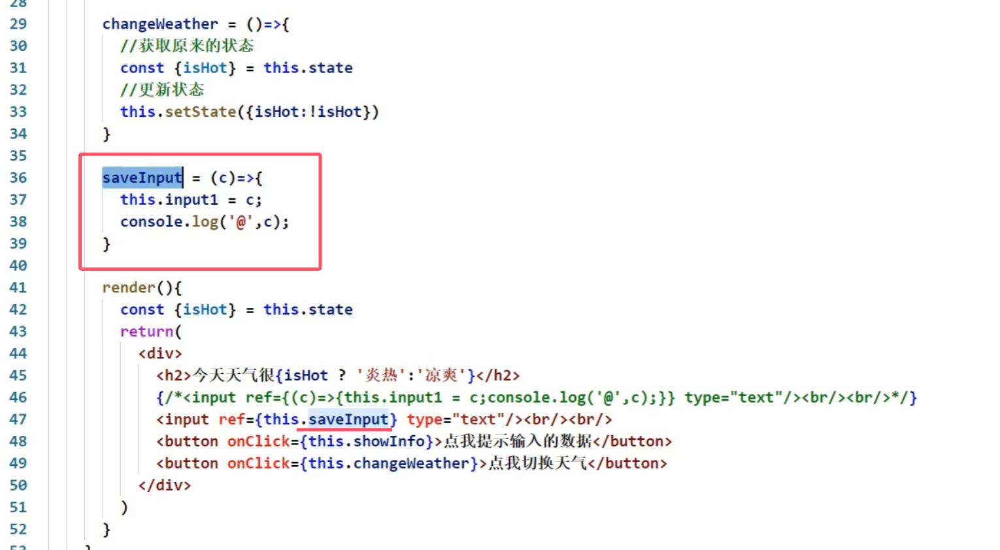

**3.** 回调ref中回调执行次数
内联函数更新时会执行两次，一次清空，一次执行函数，类绑定函数不会。

*交互和更改状态的区别：取决于是否修改`render`函数中节点的内容*

##### createRef（react最推荐）

```jsx
<script type="text/babel">
		class Demo extends React.Component{
			myRef = React.createRef()
			myRef2 = React.createRef()
			showData = ()=>{
				alert(this.myRef.current.value);
			}
			showData2 = ()=>{
				alert(this.myRef2.current.value);
			}
			render(){
				return(
					<div>
						<input ref={this.myRef} type="text" placeholder="点击按钮提示数据"/>&nbsp;
						<button onClick={this.showData}>点我提示左侧的数据</button>&nbsp;
						<input onBlur={this.showData2} ref={this.myRef2} type="text" placeholder="失去焦点提示数据"/>&nbsp;
					</div>
				)
			}
		}
		ReactDOM.render(<Demo a="1" b="2"/>,document.getElementById('test'))
	</script>
```

- `React.createRef`调用后可以返回一个容器，该容器可以存储被`ref`所标识的节点,该容器是“专人专用”的，有多少个节点表示`ref`，就要调用多少次 `React.createRef`

#### 2.2.4 事件处理

1. 通过`onXxx`属性指定事件处理函数(注意大小写)
   a）React使用的是自定义(合成)事件, 而不是使用的原生DOM事件——为了更好的兼容性
   b）React中的事件是通过事件委托方式处理的(委托给组件最外层的元素)———为了高效
2. 通过`event.target`得到发生事件的DOM元素对象。发生事件的元素就是操作的元素则可以省略ref。
3. **不要过度使用`ref`。**

### 2.3 受控组件和非受控组件

以表单提交案例为例

#### 2.3.1 非受控组件

用`ref`实现

页面中所有的输入类DOM现用现取，即通过`ref`标识DOM，进而获取数据

```jsx
<script type="text/babel">
		//创建组件
		class Login extends React.Component{
			handleSubmit = (event)=>{
				event.preventDefault() //阻止表单提交
				const {username,password} = this
				alert(`你输入的用户名是：${username.value},你输入的密码是：${password.value}`)
			}
			render(){
				return(
					<form onSubmit={this.handleSubmit}>
						用户名：<input ref={c => this.username = c} type="text" name="username"/>
						密码：<input ref={c => this.password = c} type="password" name="password"/>
						<button>登录</button>
					</form>
				)
			}
		}
		//渲染组件
		ReactDOM.render(<Login/>,document.getElementById('test'))
	</script>
```

知识点：

1. 表单`<form>`中都有`onSubmit`属性来控制提交之后的状态
2. 输入类DOM（如`<input>`）得有`name`属性才能通过GET请求获取到query参数（用？携带）
3. 删掉`action`无法阻止表单页面刷新以及地址栏更新，得要禁止默认事件`event.preventDefault()`
4. `<button>`的默认`type`属性值就是`submit`

#### 2.3.2 受控组件

用`onChange`+`state`实现
页面中所有的输入类DOM将数据存在`state`中

**更推荐用受控组件，减少`ref`的使用**

```jsx
<script type="text/babel">
		//创建组件
		class Login extends React.Component{

			//初始化状态
			state = {
				username:'', //用户名
				password:'' //密码
			}

			//保存用户名到状态中
			saveUsername = (event)=>{
				this.setState({username:event.target.value})
			}

			//保存密码到状态中
			savePassword = (event)=>{
				this.setState({password:event.target.value})
			}

			//表单提交的回调
			handleSubmit = (event)=>{
				event.preventDefault() //阻止表单提交
				const {username,password} = this.state
				alert(`你输入的用户名是：${username},你输入的密码是：${password}`)
			}

			render(){
				return(
					<form onSubmit={this.handleSubmit}>
						用户名：<input onChange={this.saveUsername} type="text" name="username"/>
						密码：<input onChange={this.savePassword} type="password" name="password"/>
						<button>登录</button>
					</form>
				)
			}
		}
		//渲染组件
		ReactDOM.render(<Login/>,document.getElementById('test'))
	</script>
```

### 2.4 高阶函数

如果一个函数符合下面2个规范中的任何一个，那该函数就是高阶函数。

1. 若A函数，接收的参数是一个函数，那么A就可以称之为高阶函数。
2. 若A函数，调用的返回值依然是一个函数，那么A就可以称之为高阶函数。
   常见的高阶函数有：`Promise`、`setTimeout`、`arr.map()`等等

函数的柯里化：通过函数调用继续返回函数的方式，实现多次接收参数最后统一处理的函数编码形式。

```jsx
function sum(a){
	return(b)=>{
		return (c)=>{
			return a+b+c
		}
	}
}
```

**用函数的柯里化实现受控组件**

为了不重复编写相似的代码，如`saveUsername`和`savePassword`

```jsx
<script type="text/babel">
		//创建组件
		class Login extends React.Component{
			//初始化状态
			state = {
				username:'', //用户名
				password:'' //密码
			}

			//保存表单数据到状态中（函数的柯里化）
			saveFormData = (dataType)=>{
                //这个函数会被返回并赋值给onChange，最终由react自动调用该函数，并自动传递event参数。
				return (event)=>{
					this.setState({[dataType]:event.target.value})
				}
			}

			//表单提交的回调
			handleSubmit = (event)=>{
				event.preventDefault() //阻止表单提交
				const {username,password} = this.state
				alert(`你输入的用户名是：${username},你输入的密码是：${password}`)
			}
			render(){
				return(
					<form onSubmit={this.handleSubmit}>
						用户名：<input onChange={this.saveFormData('username')} type="text" name="username"/>
						密码：<input onChange={this.saveFormData('password')} type="password" name="password"/>
						<button>登录</button>
					</form>
				)
			}
		}
		//渲染组件
		ReactDOM.render(<Login/>,document.getElementById('test'))
	</script>
```

- `this.saveFormData('username')`，有了小括号，立即调用，但是返回的还是一个函数，符合回调函数的要求
- `[dataType]`：调用变量形式的对象属性名
- `event`形参不需要实参，可以直接调用，所以event不能写进`this.saveFormData('username')`的参数中，得用柯里化形式来体现

**不用函数柯里化的实现方式**

只需改两处：

```jsx
saveFormData = (dataType,event)=>{
				this.setState({[dataType]:event.target.value})
			}
用户名：<input onChange={event => this.saveFormData('username',event) } type="text" name="username"/>
```

***两种方法都常用***

### 2.5 生命周期

#### 2.5.1 引入

1. 组件从创建到死亡它会经历一些特定的阶段。
2. React组件中包含一系列钩子函数(生命周期回调函数), 会在特定的时刻调用。
3. 我们在定义组件时，会在特定的生命周期回调函数中，做特定的工作。
4. 生命周期回调函数<=> 生命周期钩子函数<=>生命周期函数<=>生命周期钩子
5. 挂载 mount： 组件第一次被渲染到DOM中的时候，就为其设置一个计时器，叫挂载 `ReactDOM.render(<Life/>, document.querySelector('test'))`
6. 卸载 unmount：组件被删除时，应该清除计时器，在react中被称为卸载 `ReactDOM.unmountComponentAtNode(document.querySelector('test'))`

知识点：

- 行内样式写法：`style={{opacity:opacity}}`；
- 对象中属性名和属性值相同时触发简写：`{opacity：opacity}`简写为`{opacity}`
- `render`执行次数：1+n（初始化渲染+更新状态）

#### 2.5.2 react生命周期（旧）


三条线：

1. 父组件`render`–>`componentWillReceiveProps`–>`shouldComponentUpdate`–>`componentWillUpdate`–>`render`–>`componentDidUpdate`–>`componentWillUnmount`
2. `setState()`–>`shouldComponentUpdate`–>`componentWillUpdate`–>`render`–>`componentDidUpdate`–>`componentWillUnmount`
3. `forceUpdate()`–>`componentWillUpdate`–>`render`–>`componentDidUpdate`–>`componentWillUnmount`

**知识点：**

- `shouldComponentUpdate`返回值必须为`true`或`false`，若不写这个钩子，默认返回`true`
- `forceUpdate()`：强制更新。不更改任何状态中的数据，强制更新一下
- `componentWillReceiveProps`：在页面首次渲染时会不会调用componentWillReceiveProps。

**生命周期的三个阶段（旧）**

1. 初始化阶段: 由`ReactDOM.render()`触发—初次渲染
   1）`constructor()`
   2）`componentWillMount()`
   3）`render()`： **常用**，一定得调用
   4）`componentDidMount()`： **常用**，一般在这个钩子中做一些初始化的事，如开启定时器、发送网络请求、订阅消息
2. 更新阶段: 由组件内部`this.setSate()`或父组件重新`render`触发
   1）`shouldComponentUpdate()`
   2）`componentWillUpdate()`
   3）`render()`
   4）`componentDidUpdate()`
3. 卸载组件: 由`ReactDOM.unmountComponentAtNode()`触发
   1）`componentWillUnmount()` ：**常用**，一般在这个钩子中做一些收尾的事，如关闭定时器、取消订阅消息

#### 2.5.3 react生命周期（新）


- 17及以上版本`componentWillMount`、`componentWillUpdate`、`componentWillReceiveProps`三个钩子使用前要加UNSAFE_前缀才能使用，以后可能会被彻底废弃，不建议使用。
  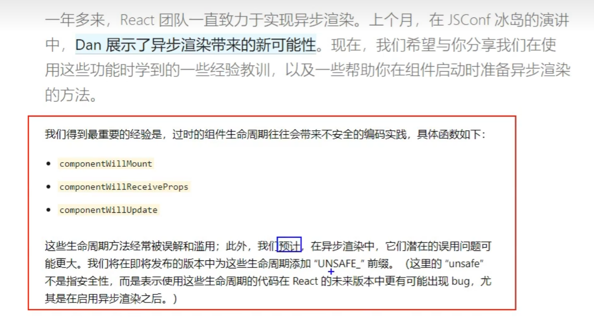
- 新的生命周期和旧的生命周期相比，除了即将废弃三个钩子，还添加了两个新的钩子`getDerivedStateFromProps`和`getSnapshotBeforeUpdate`
- `static getDerivedStateFromProps`：适用于罕见用例（**几乎不用**），返回`null`或state对象，state的值在任何时候都取决于`props`
- `getSnapshotBeforeUpdate(prevProps,prevState,)`：在更新之前获取快照，返回值传递给`componentDidUpdate(prevProps,prevState,snapshotValue)`

### 2.6 虚拟DOM与DOM Diffing算法

DOM Diffing算法对比的最小粒度是标签，且逐层对比


#### 2.6.1 key的作用

经典面试题：

1. react/vue中的key有什么作用？（key的内部原理是什么？）
2. 为什么遍历列表时，key最好不要用index?

**解释：**

- 虚拟DOM中key的作用：

1. 简单地说: key是虚拟DOM对象的标识, 在更新显示时key起着极其重要的作用。
2. 详细地说: 当状态中的数据发生变化时，react会根据【新数据】生成【新的虚拟DOM】, 随后React进行【新虚拟DOM】与【旧虚拟DOM】的diff比较，比较规则如下：
   a. 旧虚拟DOM中找到了与新虚拟DOM相同的key：
   (1) 若虚拟DOM中内容没变, 直接使用之前的真实DOM
   (2) 若虚拟DOM中内容变了, 则生成新的真实DOM，随后替换掉页面中之前的真实DOM
   b. 旧虚拟DOM中未找到与新虚拟DOM相同的key：
   根据数据创建新的真实DOM，随后渲染到到页面


- 用index作为key可能会引发的问题：

1. 若对数据进行：**逆序**添加、**逆序**删除等破坏顺序操作:
   会产生没有必要的真实DOM更新 ==> 界面效果没问题, 但效率低。
2. 如果结构中还包含输入类的DOM（如input，虚拟DOM中标签属性少，input没有value属性）：
   会产生错误DOM更新 ==> 界面有问题。
3. **注意！** 如果不存在对数据的逆序添加、逆序删除等破坏顺序操作，仅用于渲染列表用于展示，使用index作为key是没有问题的。

- 开发中如何选择key?

1. 最好使用每条数据的唯一标识作为key, 比如id、手机号、身份证号、学号等唯一值。
2. 如果确定只是简单的展示数据，用index也是可以的。

## 第3章 react应用（基于react脚手架）

使用脚手架开发的项目：模块化、组件化、工程化

### 3.1 前期准备

#### 3.1.1 安装node.js及npm

[安装教程](https://blog.csdn.net/ZHANGYANG_1109/article/details/121229581)

1. 下载.msi安装包 [node官网](http://nodejs.cn/download/)
2. 安装路径： D:\nodejs\
3. 查看是否安装成功：win+r输入cmd，输入命令node；查看npm版本 npm -v。node.js安装时会自动安装npm
4. 改变npm下载的模块包的默认存储地址：
   npm config set prefix “D:\nodejs\node_global”
   更改默认缓存位置：npm config set cache “D:\nodejs\node_cache”
   测试：npm list -global或者npm config get prefix或者npm config get cache
5. 更改环境变量
   控制面板–系统–高级系统设置–高级–环境变量
   1） 用户变量 path 中把 C:\Users\Administrator\AppData\Roaming\npm;—改为----D:\nodejs\node_global
   2）在系统变量中 新增变量NODE_PATH----- D:\nodejs\node_global\node_modules

**安装cnpm：** npm install -g cnpm --registry=https://registry.npm.taobao.org
**安装yarn：** 不推荐用npm i -g yarn 安装（但我是这样装的）
react扩展程序： **React Developer Tools**（facebook）

*问题：*

1. 安装了cnpm之后，才成功安装了 cnpm i -g create-react-app
2. cmd必须得以管理员模式运行才能使用npm命令。解决方式是将vscode以管理员模式运行，并用vscode运行npm命令

**全局安装react脚手架：** npm i -g create-react-app （不成功），得用 cnpm i -g create-react-app
**创建项目：** 切换到想创建项目的文件夹，使用命令create-react-app app_name

*换源：* 在这里建议把npm换源，使用国内镜像创建项目。因为使用脚手架配置项目的时候，需要下载的依赖实在太多，不换源的话很可能中途卡住就失败了。（没换）
*换源方式：* npm config set registry https://registry.npm.taobao.org
验证是否换源成功：npm config get registry
显示出上述地址的话就是换源成功了
[npm cnpm npx nvm区别](https://zhuanlan.zhihu.com/p/54998362)

**知识点：**

- vscode安装时勾选open with code
- react是SPA应用
- index.html文件中，%PUBLIC_URL% 代表public文件夹的路径
- robots.txt 爬虫规则文件
- export name 分别暴露；export default name 默认暴露
- import React，{Component} from ‘react’ :{Component}在react文件里分别暴露了

#### 3.1.2 react脚手架项目结构

- **public ---- 静态资源文件夹**
  favicon.icon ------ 网站页签图标
  index.html -------- 主页面
  logo192.png ------- logo图
  logo512.png ------- logo图
  manifest.json ----- 应用加壳的配置文件
  robots.txt -------- 爬虫协议文件
- **src ---- 源码文件夹**
  App.css -------- App组件的样式，App.js里引用
  App.js --------- App组件，子组件可以都写在components文件夹里，子组件文件夹首字母大写。路由组件写在pages文件夹中
  App.test.js ---- 用于给App做测试
  index.css ------ 样式，通用样式，入口文件里引用
  index.js ------- 入口文件
  logo.svg ------- logo图
  reportWebVitals.js-------页面性能分析文件(需要web-vitals库的支持)
  setupTests.js-------组件单元测试的文件(需要jest-dom库的支持)

**注意：**
组件js文件除了**首字母大写**，还可以将后缀改为**jsx**，来将组件和普通js文件进行区分

#### 3.1.3 样式模块化

```jsx
import name from './name.module.css'
className={name.title}
```

基本上不用，而是用[less](https://less.bootcss.com/)嵌套

- 安装VSCode插件 **ES7+ React/Redux/React-Native snippets**
  

#### 3.1.4 功能界面的组件化编码流程（通用）

1. 拆分组件: 拆分界面,抽取组件
2. 实现静态组件: 使用组件实现静态页面效果
3. 实现动态组件
   3.1 动态显示初始化数据
      3.1.1 数据类型
      3.1.2 数据名称
      3.1.3 保存在哪个组件?
   3.2 交互(从绑定事件监听开始)

### 3.2 案例：组件的组合使用——TodoList

#### 3.2.1 注意事项

- List给Item用props传递参数：

```jsx
todos.map(todo=>{
	return <Item key={todo.id} {...todo}/>
	})
```

其中 `{todos}=this.props` ，是 `todos`解构对象成数组，即 todos=[{},{}],todo代表todos数组中的每个元素（对象）。

`{...todo}`是在展开对象。原生js中，对象不能使用拓展运算符（数组和可遍历的伪数组可以）。而`{...obj}`是ES6语法，是一个复制对象。但是在这里，`{...todo}`并不是复制对象，因为这里的`{}`表示括号里面要写js表达式了，所以真正写的还是`...todo`，这里react+babel就允许用展开运算符展开对象，不能随便使用（不能用`console.log()`查看）,仅仅适用于标签传递数据时。

- 父组件向子组件传数据：直接在子组件标签中添加键值对形式的数据（`props`）
- **子组件向父组件传递数据**：父组件通过props给子组件传递一个函数，子组件在想要传递数据给父组件时，调用该函数
- 
  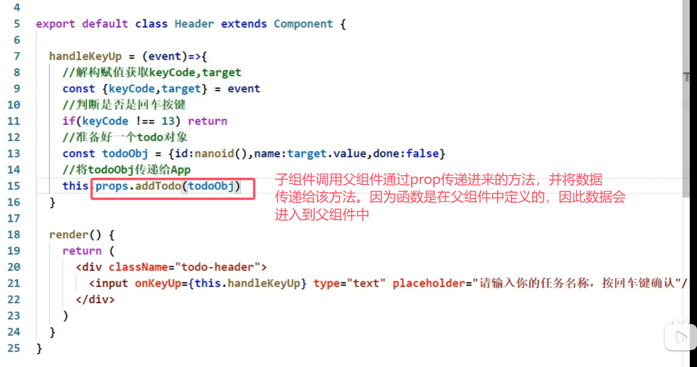

- 生成时间戳:`Date.now()`
- UUID：生成唯一时间戳的库
  npm i uuid （库比较大）
  **npm i nanoid**（库小，很快安装）/ yarn add nanoid
  用法：

```jsx
import {nanoid} from 'nanoid'
//调用
nanoid()
```

- `str.trim()` 去除字符串的头尾空格
- `onMouseLeave={this.handleMouse(false)}`：小括号调用了函数，定义函数时要柯里化
- 状态在哪里，操作状态的方法就在哪里
  
- `window.confirm("确定删除吗")`：返回true或false
- 在react中，`<input type="checkbox"/>`若加了`checked`属性，则必须加`onChange`事件，不然无法改变勾选状态。`defaultChecked`只在第一次起效果。

#### 3.2.2 todoList案例相关知识点

1. 拆分组件、实现静态组件，注意：`className`、`style`的写法
2. 动态初始化列表，如何确定将数据放在哪个组件的`state`中？
   1）某个组件使用：放在其自身的`state`中
   2）某些组件使用：放在他们共同的父组件`state`中（官方称此操作为：状态提升）
3. 关于父子之间通信：
   1）【父组件】给【子组件】传递数据：通过props传递
   2）【子组件】给【父组件】传递数据：通过props传递，要求父提前给子传递一个函数
4. 注意`defaultChecked` 和 `checked`的区别，类似的还有：`defaultValue` 和 `value`
5. 状态在哪里，操作状态的方法就在哪里

## 第4章 React ajax

### 4.1 理解

1. React本身只关注于界面, 并不包含发送ajax请求的代码
2. 前端应用需要通过ajax请求与后台进行交互(json数据)
3. react应用中需要集成第三方ajax库(或自己封装，但是基本不会自己封装)

### 4.2 实现

1. jQuery: 要操作DOM，并且比较重, 如果需要另外引入不建议使用
2. axios: 轻量级, 建议使用
   1）封装XmlHttpRequest对象的ajax
   2）promise风格
   3）可以用在浏览器端和node服务器端

### 4.3 配置代理

> 如果不配置代理，会发生跨域问题：
> 客户端将请求发给服务器时，服务器将数据返回，但因为服务器和客户端端口不一样，因此服务器返回的数据被客户端的ajax引擎拦在了外面。
> 配置代理服务器后，代理服务器和客户端在一个端口，
> 请求的发送的路径为 客户端 --> 代理服务器 --> 服务器
> 服务器响应的路径为 服务器 --> 代理服务器 --> 客户端
> 由于代理服务器没有ajax引擎，就算和服务器端口不一样，也不会拒绝接受服务器传来的数据。
> 由于代理服务器和客户端端口一样，客户端可以接收代理服务器传来的数据
>
> 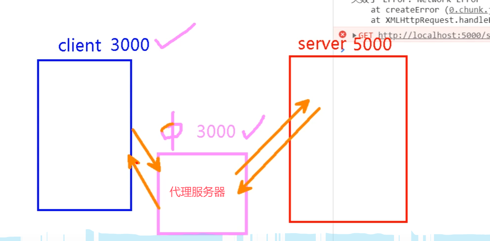


#### react脚手架配置代理总结

**方法一**

> 在package.json中追加如下配置

```json
"proxy":"http://localhost:5000"
```


说明：

1. 优点：配置简单，前端请求资源时可以不加任何前缀。
2. 缺点：不能配置多个代理。
3. 工作方式：上述方式配置代理，当请求了3000不存在的资源时，那么该请求会转发给5000 （优先匹配前端资源）

**方法二**

1. 第一步：创建代理配置文件

   ```
   在src下创建配置文件：src/setupProxy.js(不允许改名)
   ```

2. 编写setupProxy.js配置具体代理规则：

   ```js
   const proxy = require('http-proxy-middleware')
   
   module.exports = function(app) {
     app.use(
       proxy('/api1', {  //api1是需要转发的请求(所有带有/api1前缀的请求都会转发给5000)
         target: 'http://localhost:5000', //配置转发目标地址(能返回数据的服务器地址)
         changeOrigin: true, //控制服务器接收到的请求头中host字段的值
         /*
         	changeOrigin设置为true时，服务器收到的请求头中的host为：localhost:5000
         	changeOrigin设置为false时，服务器收到的请求头中的host为：localhost:3000
         	changeOrigin默认值为false，但我们一般将changeOrigin值设为true
         */
         pathRewrite: {'^/api1': ''} //重写请求路径，将/api1替换为空字符串，保证交给后台服务器的是正常请求地址(必须配置)
       }),
       proxy('/api2', { 
         target: 'http://localhost:5001',
         changeOrigin: true,
         pathRewrite: {'^/api2': ''}
       })
     )
   }
   ```

说明：

1. 优点：可以配置多个代理，可以灵活的控制请求是否走代理。
2. 缺点：配置繁琐，前端请求资源时必须加前缀。

#### 学习原生AJAX时，解决跨域问题是在server.js代码中加入以下代码（即在后端解决）

```js
  //设置响应头  设置允许跨域  
  response.setHeader('Access-Control-Allow-Origin', '*');
  //响应头
  response.setHeader('Access-Control-Allow-Headers', '*');
```

为CORS解决方案

**注意**：127.0.0.1和localhost的区别

1. 127.0.0.1 为保留地址，直白地说 127.0.0.1 就是一个 ip 地址，不同于其它 ip 地址的是它是一个指向本机的 ip 地址，也称为环回地址，该 ip 地址不能使用在公网 ip 上，对任何一台电脑来说,不管是否连接到INTERNET上，127.0.0.1 都是指向自己。
   事实上整个 127.* 网段都是环回地址，127.* ip 段都为保留地址，只是规则制定者将其中的 127.0.0.1 规定为指向本机自己。
2. 在电脑网络中，localhost 为“本地主机”，是给回路网络接口（loopback）的一个标准主机名，IPv4 相对应的地址为 127.0.0.1，IPv6 相对应的地址为 [::1]，这个名称也是一个保留域名。
   说白了就是 localhost 就是一个**本地域名**，不是地址。该本地域名指向的 ip 地址就是 127.0.0.1 ，也就是指向本机，localhost 更方便记忆与输入，因 hosts文件 定义了 localhost = 127.0.0.1 ，所以你只需要记住 localhost 就可以代表本机了。
3. 对机器来说，它需要通过 hosts 文件来定义 localhost = 127.0.0.1（多一次解析 ip 的步骤） ，才能知道 localhost 代表的是本机，机器只知道 127.0.0.1 代表本机，因此当你向 localhost 发消息的时候，机器会自动翻译后给127.0.0.1发消息。
4. 在实际工作中，localhost 是不经过网卡传输的，所以它不受网络防火墙和与网卡相关的种种限制，而 127.0.0.1 则要通过网卡传输数据，是必须依赖网卡的。这一点也是 localhost 和 127.0.0.1 的最大的区别，这就是为什么有时候用 localhost 可以访问，但用 127.0.0.1 就不可以的情况。

### 4.4 案例—github用户搜索

#### 4.4.1 axios发送请求

1. 连续解构赋值：

```jsx
const {keyWordElement:{value}} = this
```

相当于 `this.keyWordElement.value`，此时`keyWordElement`并没有被解构，只是写的过程，即

```jsx
console.log(keyWordElement) // undefined
const {keyWordElement:{value:keyWord}} = this
```

连续解构赋值+重命名

1. **状态中的数据驱动着页面的展示**
2. 连续写三元表达式

```jsx
isFirst ? <h2>欢迎使用，输入关键字，随后点击搜索</h2> :
isLoading ? <h2>Loading......</h2> :
err ? <h2 style={{color:'red'}}>{err}</h2> 
```

如果第一个判断为正确，就不会执行后面的代码了，所以**顺序很重要**

#### 4.4.2 消息订阅-发布机制（pubsub-js）

**使用：**

1. 工具库: PubSubJS
2. 下载: npm install pubsub-js --save
3. 使用:
   1) import PubSub from ‘pubsub-js’ //引入
   2) PubSub.subscribe(‘delete’, function(data){ }); //订阅
   3) PubSub.publish(‘delete’, data) //发布消息

**注意：**

4. 适用于任意组件之前的消息沟通
5. 谁用谁接，谁传谁发

#### 4.4.3 扩展：使用Fetch发送网络请求（用得不多）

- **发送AJAX请求的方法：**

1. 原生AJAX：xhr
2. jQuery：对xhr的封装
3. axios：对xhr的封装
4. fetch：不是库，是windows内置，且是Promise风格。**和xhr并列**

- fetch的特点关注分离
- fetch兼容性不高

#### 4.4 案例总结

1. 设计状态时要考虑全面，例如带有网络请求的组件，要考虑请求失败怎么办。

2. ES6小知识点：解构赋值+重命名
   let obj = {a:{b:1}}
   const {a} = obj; //传统解构赋值
   const {a:{b}} = obj; //连续解构赋值
   const {a:{b:value}} = obj; //连续解构赋值+重命名

3. 消息订阅与发布机制
   1.先订阅，再发布（理解：有一种隔空对话的感觉）
   2.适用于任意组件间通信
   3.要在组件的componentWillUnmount中取消订阅

   > 在组件卸载之前取消订阅，主要是为了**防止内存泄漏和避免潜在的错误**。
   > 如果组件在卸载之前没有取消订阅，即使组件已经销毁，其订阅回调仍然存在于内存中。将会出现如下结果
   >
   > - 发布消息时，仍会调用已卸载组件的回调函数。
   > - 由于组件实例已销毁，引用的资源无法被垃圾回收，导致内存泄漏。

4. fetch发送请求（关注分离的设计思想）

```jsx
	try {
		const response= await fetch(`/api1/search/users2?q=${keyWord}`)
		const data = await response.json()
		console.log(data);
	} catch (error) {
		console.log('请求出错',error);
	}
```

## 第5章 react路由（v5）

### 5.1. 相关理解

#### 5.1.1. SPA的理解

1. 单页Web应用（single page web application，SPA）。
2. 整个应用只有**一个**完整的页面。
3. 点击页面中的链接**不会刷新**页面，只会做页面的**局部更新**。
4. 数据都需要通过**ajax**请求获取, 并在前端异步展现。
5. 单页面、多组件

#### 5.1.2. 路由的理解

- 什么是路由?
  1. 一个路由就是一个映射关系(key:value)
  1. key为路径, value可能是function或component


- 路由分类

  1. 后端路由：

     1) 理解： value是function, 用来处理客户端提交的请求。
     2) 注册路由： router.get(path, function(req, res))
     3) 工作过程：当node接收到一个请求时, 根据请求路径找到匹配的路由, 调用路由中的函数来处理请求, 返回响应数据


    2. 前端路由：
       1) 浏览器端路由，value是component，用于展示页面内容。
       2) 注册路由: `<Route path="/test" component={Test}>`
       3) 工作过程：当浏览器的path变为/test时, 当前路由组件就会变为Test组件
       4) 前端路由也要靠BOM 上的 history

#### 5.1.3. react-router-dom的理解

1. react的一个**插件库**。
2. 专门用来实现一个SPA应用。
3. 基于react的项目基本都会用到此库。

**注意：**react-router总共有三种形式的库，适用于三种场景：

- web，对应的库名叫react-router-dom （当前学习）
- native
- anywhere（哪里都可以用）

### 5.2 路由的基本使用

1. 明确好界面中的导航区、展示区

2. 导航区的a标签改为Link标签

3. 展示区写Route标签进行路径的匹配（在呈现路由组件内容的位置注册路由）
   以前的版本

   ```jsx
   <Route path="/about" component={About}/>
   <Route path="/home" component={Home}/> 
   ```

   现在的版本 6.x.x

   ```jsx
   <Routes>
   	<Route path="/about" element={<About/>}/>
   	<Route path="/home" element={<Home/>}/>
   </Routes>
   ```

4. `<App/>`的最外侧包裹了一个`<BrowserRouter>`或`<HashRouter>`

注意：

- `import {Link,Route} from 'react-router-dom'` 分别暴露，用哪个组件取哪个组件 -
- 用`<HashRouter>`地址栏中 # 后面的内容不会作为资源发给服务器

### 5.3 路由组件与一般组件

1. 写法不同：
   一般组件：`<Demo/>`
   路由组件：`<Route path="/demo" component={Demo}/>`
2. 存放位置不同：
   一般组件：components
   路由组件：pages
3. 接收到的props不同：
   一般组件：写组件标签时传递了什么，就能收到什么
   路由组件：接收到三个固定的属性

```yml
history:
			go: ƒ go(n)
			goBack: ƒ goBack()
			goForward: ƒ goForward()
			push: ƒ push(path, state)
			replace: ƒ replace(path, state)
location:
			pathname: "/about"
			search: ""
			state: undefined
match:
			params: {}
			path: "/about"
			url: "/about"
			
# 实际上这三个属性会有更多子属性。这里只保留了最常用的子属性
```

### 5.4 NavLink及其封装

1. NavLink可以实现路由链接的高亮，通过**activeClassName**指定样式名
2. 标签体内容是一个特殊的标签属性，可以通过this.props.children获取。因此以下两段代码是等价的。

```jsx
<NavLink activeClassName="atguigu" className="list-group-item" children="About" />
<NavLink activeClassName="atguigu" className="list-group-item" to="/about">About</NavLink>
```

#### Nav的封装和使用

封装：将NavLink封装为一个组件


使用：像使用NavLink标签一样使用封装的标签

> MyNavLink标签包裹的内容也会传递给props，特殊的是会传递到props中的children属性中，无需自己指定key.
> 因此在MyNavLink中直接读取props.children属性，就可以读取到被MyNavLink标签包裹的内容
> 
>
> 

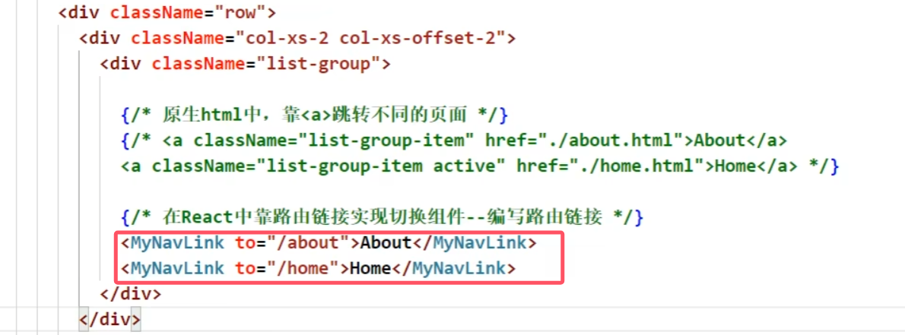

### 5.5 Switch

1. 注册路由时用Switch包裹所有路由
2. 通常情况下，path和component是一一对应的关系。
3. Switch可以提高路由匹配效率(**单一匹配**)。

> 因为一般情况下，path和component时一一对应的，因此在匹配到一个路径之后就可以停止匹配了。不需要考虑一个path对应多个component的情况，适合使用Switch来提高效率


### 5.6 解决样式丢失问题

1. 什么时候样式丢失？
   路由路径多级，且刷新的时候

2. 解决办法
   1）public/index.html 中 引入样式时不写 ./ 而是写 / （**常用**）。因为./是相对路径，去掉之后就是绝对路径，直接去localhost:3000下调文件

   ```jsx
   <link rel="stylesheet" href="/css/bootstrap.css">
   ```

   2）public/index.html 中 引入样式时不写 ./ 写 %PUBLIC_URL% （**常用**）。因为%PUBLIC_URL%代表public的绝对路径

   > 只适用于在React脚手架里这么写，别的地方写没用

   ```jsx
   <link rel="stylesheet" href="%PUBLIC_URL%/css/bootstrap.css">
   ```

   3）将`<BrowserRouter>`改为`<HashRouter>`

### 5.7 路由的模糊匹配与严格匹配

1. 默认使用的是模糊匹配（简单记：【输入的路径】必须包含要【匹配的路径】，且顺序要一致）

   ```jsx
   <MyNavLink to="/about/a/b">Home</MyNavLink>  //模糊匹配
   <Route path="/about" component={About}/>
   ```

2. 开启严格匹配：

```jsx
<Route exact={true} path="/about" component={About}/>
// exact={true}可以简写为exact
```

3. **严格匹配不要随便开启**，需要再开，有些时候开启会导致无法继续匹配二级路由

### 5.8 Redirect重定向

1. 一般写在所有路由注册的最下方，当所有路由都无法匹配时，跳转到Redirect指定的路由
2. 具体编码：

​	使用前先引入


```jsx
<Switch>
	<Route path="/about" component={About}/>
	<Route path="/home" component={Home}/>
	<Redirect to="/about"/>
</Switch>
```

### 5.8 嵌套路由（多级路由）

1. 注册子路由时要**写上父路由**的path值

```jsx
{/* 注册路由 */}
<Switch>
	<Route path="/home/news" component={News}/>
	<Route path="/home/message" component={Message}/>
	<Redirect to="/home/news"/>
</Switch>
```

2. 路由的匹配是按照**注册路由的顺序**进行的

### 5.9 向路由组件传递参数

#### 5.9.1 params参数（使用最多）

1. 路由链接(携带参数)：

```jsx
<Link to='/demo/test/tom/18'}>详情</Link>
```

2. 注册路由(声明接收)：

```jsx
<Route path="/demo/test/:name/:age" component={Test}/>
```

3. 接收参数：

   根据下图，可以看到通过params传递参数时，参数传递到了接收方组件的 **props属性的match属性的params属性中**。
   即接收方通过 `const {id,title} = this.props.match.params`这种形式就能够使用传递给自己的参数

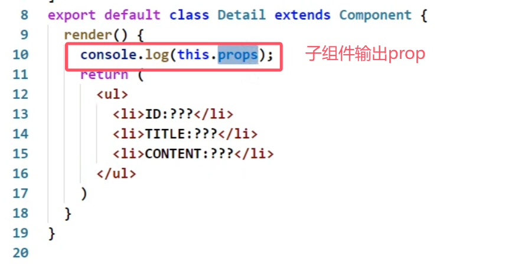


#### 5.9.2 search参数（使用第二多）

1. 路由链接(携带参数)：

```jsx
<Link to='/demo/test/?name=tom&age=18'}>详情</Link>
//？前面加不加/
```

2. 注册路由(无需声明，正常注册即可)：

```jsx
<Route path="/demo/test" component={Test}/>
```

3. 接收参数：` const{id,title} = this.props.location.search`
   备注：获取到的search是**urlencoded编码**（即，`name=tom&age=18`）字符串，需要借助 querystring库（React脚手架已经自动下载好了）解析（`querystring.stringify(obj)`, `querystring.parse(str)`）。去掉问号用`qs.parse(str.slice(1))`
   

#### 5.9.3 state参数（使用最少）

> state参数不同于普通组件的state属性

1. 路由链接(携带参数)：

```jsx
<Link to={{pathname:'/demo/test',state:{name:'tom',age:18}}}>详情</Link>
```

2. 注册路由(无需声明，正常注册即可)：

```jsx
<Route path="/demo/test" component={Test}/>
```

3. 接收参数：`const{id,title} = this.props.location.state || {}`
   备注：**刷新也可以保留住参数** 
   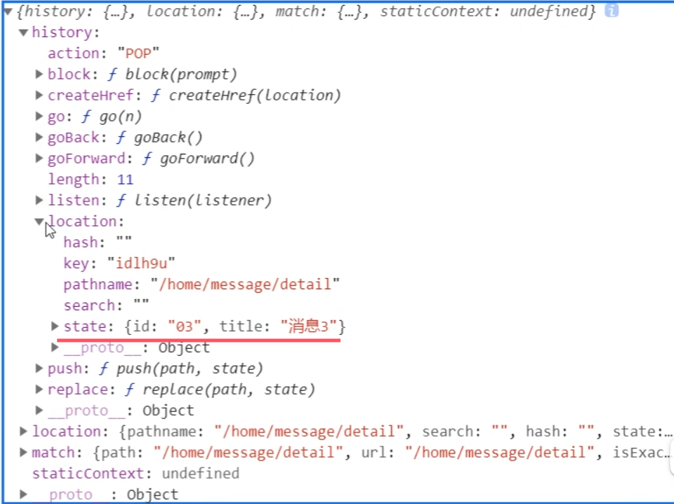

### 5.10 push和replace

1. 路由是对浏览器历史记录的操作，总共有两种操作，push（压栈）和replace（替代栈顶元素）。
2. 默认是push模式，要想开启replace模式，则在路由连接`<Link>`标签中加入`replace={true}`或`replace`

### 5.11 编程式路由导航

借助this.prosp.history对象上的API对操作路由跳转、前进、后退，而不用路由的`<Link>`和`<NavLink>`，但还是要注册路由

- this.prosp.history.push(path, state)
- this.prosp.history.replace(path, state)
- this.prosp.history.goBack()
- this.prosp.history.goForward()
- this.prosp.history.go(n)  //前进n步 （n为2，前进两步；n为-1，后退一步）

**replace和push实现三种传递参数的方式**：

三种方式传递参数：


三种方式定义路由：	


### 5.12 withRouter的使用

1. `withRouter`可以加工一般组件，让一般组件具备路由组件所特有的API

2. `withRouter`的返回值是一个新组件。

3. 在一般组件中要用到路由组件的props属性时引入。

   ```jsx
   import {withRouter} from 'react-router-dom'
   ```

   需要暴露

   ```jsx
   export default withRouter(Header) //传入一般组件，返回加工后的新组件。加工后的新组件 具备路由组件所特有的API
   ```

### 5.12 BrowserRouter与HashRouter的区别

1. 底层原理不一样：
   BrowserRouter使用的是H5的history API，**不兼容IE9及以下版本。**
   HashRouter使用的是URL的哈希值。

2. path表现形式不一样
   BrowserRouter的路径中没有#,例如：localhost:3000/demo/test
   HashRouter的路径包含#,例如：localhost:3000/#/demo/test

3. 刷新后对路由state参数的影响
   1）BrowserRouter没有任何影响，因为state保存在history对象中。
   2）HashRouter刷新后**会导致路由state参数的丢失**！！！

   **BrowserRouter刷新前后**：

   

   **HashRouter刷新前后**：

   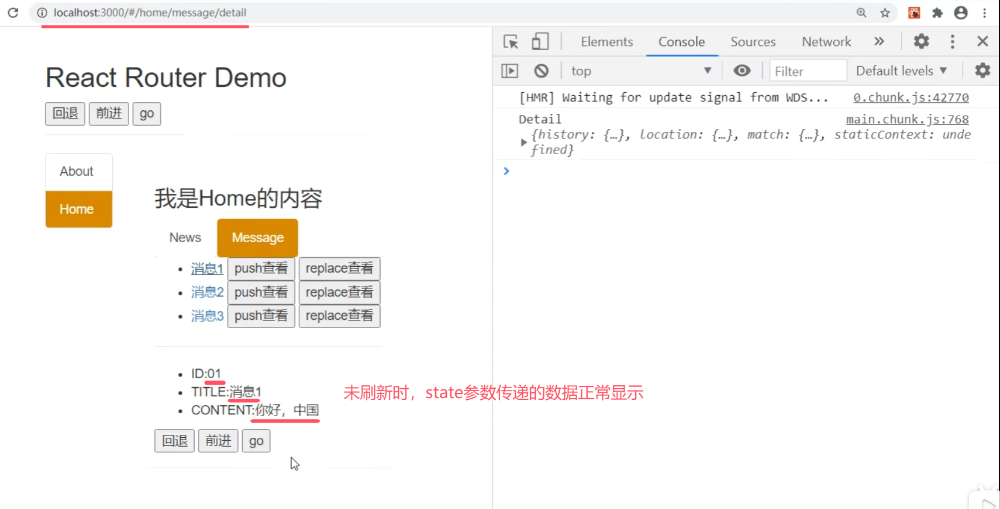

   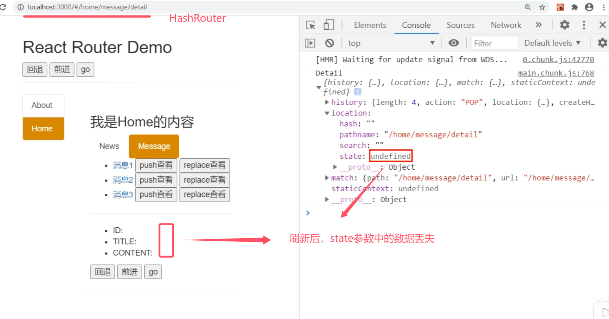

4. **备注：** HashRouter可以用于解决一些路径错误相关的问题。
