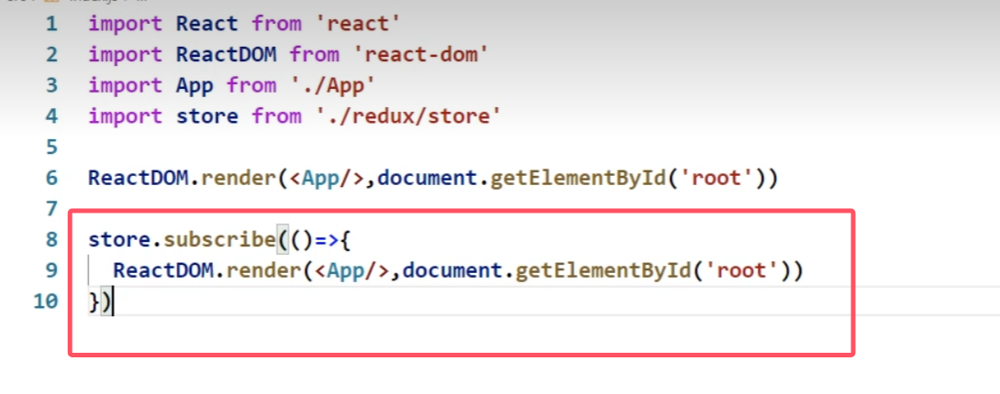
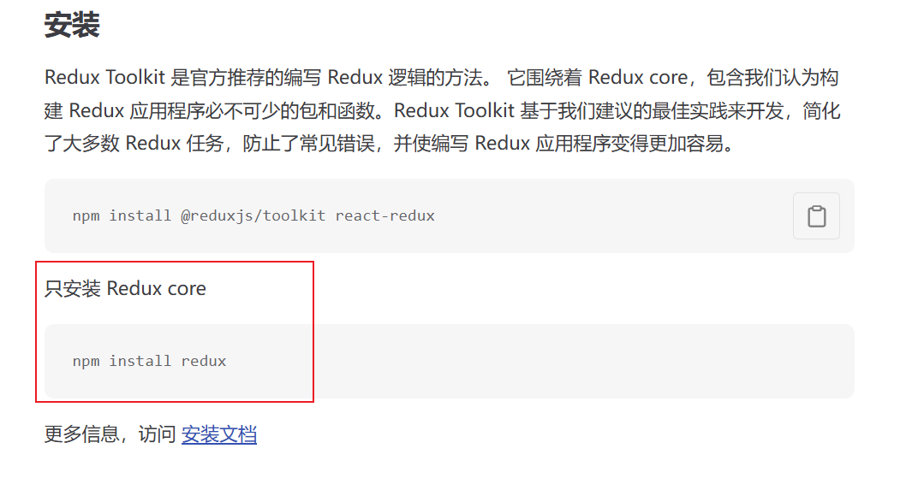
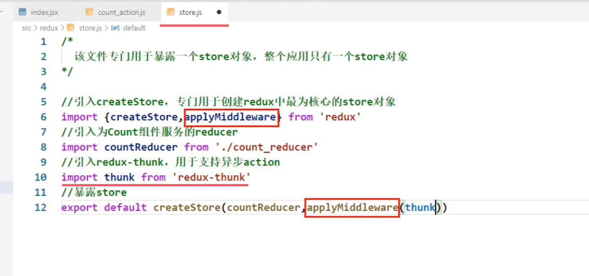
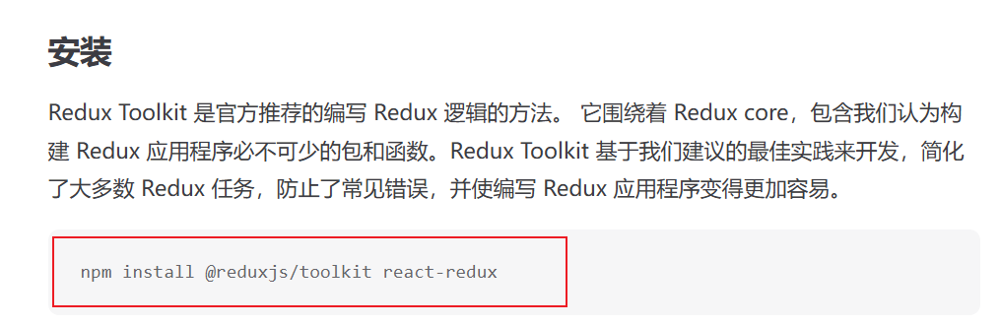
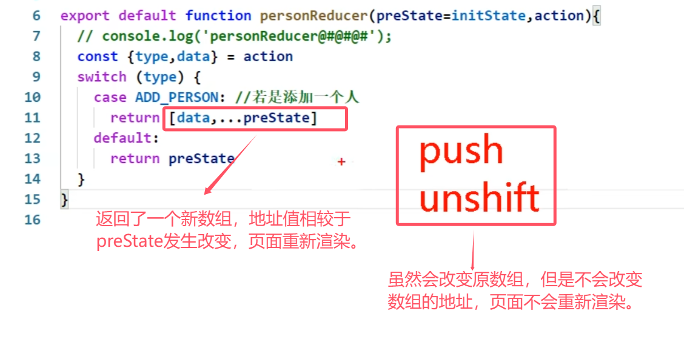
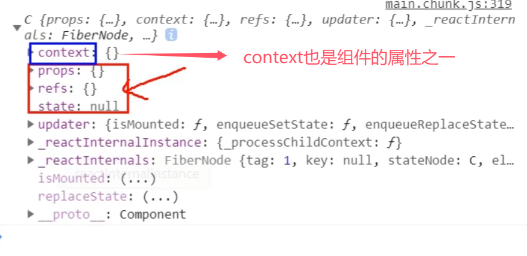
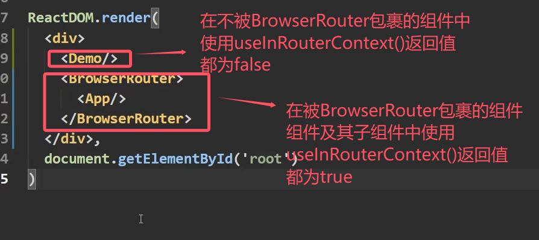

## 第6章 React UI组件库

### 6.1 简介

**material-ui(国外)**

1. [官网](http://www.material-ui.com/#/): http://www.material-ui.com/#/
2. [github](https://github.com/callemall/material-ui): https://github.com/callemall/material-ui

**ant-design(国内蚂蚁金服)**

1. [官网](https://ant.design/index-cn): https://ant.design/index-cn
2. [Github](https://github.com/ant-design/ant-design/): https://github.com/ant-design/ant-design/
3. 不是所有场景都使用，最适用于**后台管理系统**

### 6.2 使用

安装依赖:`npm install antd`
引入样式（不太合理，引入了全部组件的样式，应该**按需引入**）

```jsx
import '../node_modules/antd/dist/antd.css'
```

引入库：

```jsx
import { Button,DatePicker } from 'antd';
import {WechatOutlined,WeiboOutlined,SearchOutlined} from '@ant-design/icons'
```

学会查看官网文档
其他UI组件库：element ui、vant等

### 6.3 按需引入和自定义主题

**重点：** 学会查看[文档](https://ant.design/docs/react/use-with-create-react-app-cn)（3.x文档更清楚，且适用于4.x）

1. 安装依赖：`yarn add react-app-rewired customize-cra babel-plugin-import less less-loader`
2. 修改package.json

```jsx
"scripts": {
	"start": "react-app-rewired start",
	"build": "react-app-rewired build",
	"test": "react-app-rewired test",
	"eject": "react-scripts eject"
},
```

3. 根目录下创建config-overrides.js

```jsx
//配置具体的修改规则
const { override, fixBabelImports,addLessLoader} = require('customize-cra');
module.exports = override(
	fixBabelImports('import', {
		libraryName: 'antd',
		libraryDirectory: 'es',
		style: true,
	}),
	addLessLoader({
		lessOptions:{
			jsxEnabled: true,
			modifyVars: { '@primary-color': 'green' },
		}
	}),
);
```

4. 备注：不用在组件里亲自引入样式了，即：`import 'antd/dist/antd.css'`应该删掉

## 第7章 redux

### 7.1 redux理解

#### 7.1.1 学习文档

1. [英文文档](https://redux.js.org/): https://redux.js.org/
2. [中文文档](http://www.redux.org.cn/): http://www.redux.org.cn/
3. [Github](https://github.com/reactjs/redux): https://github.com/reactjs/redux

#### 7.1.2 redux简介

1. redux是一个专门用于做**状态管理**的JS库(**不是react插件库**)。
2. 它可以用在react, angular, vue等项目中, 但基本与react配合使用。
3. 作用: **集中式管理**react应用中**多个组件共享**的状态。

#### 7.1.3 什么情况下需要使用redux

1. 某个组件的状态，需要让其他组件可以随时拿到（**共享**）。
2. 一个组件需要改变另一个组件的状态（**通信**）。
3. 总体原则：能不用就不用, 如果不用比较吃力才考虑使用。

#### 7.1.4 redux工作流程


- `dispatch(action)`是一个函数，`action`是一个对象
- Action Creators（服务员）
  Store（老板）
  Reducers（厨师）

### 7.2 redux的三个核心概念

#### 7.2.1. action

1. 动作的**对象**
2. 包含2个属性
   `type`：标识属性, 值为字符串, 唯一, 必要属性
   `data`：数据属性, 值类型任意, 可选属性
3. 例子：`{ type: 'ADD_STUDENT',data:{name: 'tom',age:18} }`

#### 7.2.2. reducer

1. 用于**初始化**状态、**加工**状态。
2. 加工时，根据旧的state和action， 产生新的state的`纯函数`。
3. 有几个组件就有几个reducer？

#### 7.2.3. store

1. 将state、action、reducer联系在一起的**对象**

2. 如何得到此对象?

   ```jsx
    import {createStore} from 'redux'
    import reducer from './reducers'
   
    const store = createStore(reducer)
   ```

3. 此对象的功能?

   1) `getState()`: 得到state
   2) `dispatch(action)`: 分发action, 触发reducer调用, 产生新的state
   3) `subscribe(listener)`: 注册监听, 当产生了新的state时, 自动调用

### 7.3. redux的核心API

#### 7.3.1. createstore()

作用：创建包含指定reducer的store对象

#### 7.3.2. store对象

> store整个对象只有一个

1. 作用: redux库最核心的管理对象

2. 它内部维护着:

   1) state
   2) reducer

3. 核心方法:

   1) `getState()`
   2) `dispatch(action)`
   3) `subscribe(listener)` ：store监测redux里的状态变化，发生变化则会调用 `listener` 回调
      

4. 具体编码:

   1) `store.getState()`
   2) `store.dispatch({type:'INCREMENT', number})`
   3) 放在入口文件index.js中

   ```jsx
   store.subscribe(()=>{
   	ReactDOM.render(<App/>,document.getElementById('root'))
   })
   ```

#### 7.3.3. applyMiddleware()

作用：应用上基于redux的中间件(插件库)

##### 7.3.4. combineReducers()

作用：合并多个reducer函数

### 7.4 求和案例

#### 7.4.1 求和案例_redux精简版

> 首先执行  yarn add redux
> （该命令只安装了redux核心，并没有安装Redux Toolkit）
> 

1. 去除Count组件自身的状态

2. src下建立:

   ```jsx
   //文件
   -redux
   	-store.js
   	-count_reducer.js
   ```

3. store.js：
   1）引入redux中的`createStore`函数，创建一个store
   2）`createStore`调用时要传入一个为其服务的reducer
   3）记得暴露**store对象**（store.js默认暴露一个函数调用，函数返回一个对象，其他文件引入的时候将此对象命名为store）

4. count_reducer.js：
   1）reducer的本质是一个函数，接收：preState,action，返回加工后的状态
   2）reducer有两个作用：初始化状态，加工状态
   3）reducer被第一次调用时，是store自动触发的。传递的`preState`是`undefined`，传递的`action`是:`{type:'@@REDUX/INIT_a.2.b.4}`

5. 在index.js中监测store中状态的改变，一旦发生改变重新渲染

**备注**：redux只负责管理状态，至于状态的改变驱动着页面的展示，要靠我们自己写。

#### 7.4.2 求和案例_redux完整版

**新增文件**：

1. count_action.js 专门用于创建`action`对象
   注意：箭头函数返回一个对象时，要用`（）`包裹，不然会被识别为函数体的`{}`

```jsx
createIncrementAction = data => ({type:INCREMENT,data})
```

1. constant.js 放置容易写错的`type`值，目的只有一个：便于管理的同时防止程序员单词写错（要暴露）

#### 7.4.3 求和案例_redux异步action版（非必须）

1. 同步`action`：`action`的值是对象
   异步`action`：`action`的值是函数。异步`action`一般会调用同步`action`
2. 明确：延迟的动作（异步操作）不想交给组件自身，想交给`action`
3. 何时需要异步`action`：想要对状态进行操作，但是具体的数据靠异步任务返回。
4. 具体编码：
   1）**yarn add redux-thunk**，并配置在store中
   2）创建`action`的函数不再返回一般对象，而是一个函数，该函数中写异步任务。
   3）异步任务有结果后，分发一个同步的`action`去真正操作数据。
5. 备注：**异步`action`不是必须要写的**，完全可以自己等待异步任务的结果了再去分发同步`action`。

**引入thunk并使用**：



#### 7.4.4 求和案例_react-redux基本使用

> 需要安装 react-redux
> npm install react-redux
>
> 注意：
> npm install react-redux
> npm install @reduxjs/toolkit react-redux
> 这两个命令不完全一样。
>
> **`npm install react-redux`**
>
> - 仅安装了 `react-redux` 库。
> - **`react-redux`**：这是一个 React 的官方绑定库，用于在 React 应用中与 Redux 集成。它提供了 `Provider` 和 `useSelector`、`useDispatch` 等工具，简化了 Redux 的使用。
>
> ### **`npm install @reduxjs/toolkit react-redux`**
>
> - 同时安装了 `@reduxjs/toolkit` 和 `react-redux`。
> - **`@reduxjs/toolkit`**：这是 Redux 官方推荐的工具包，用于简化 Redux 的配置和使用，包括创建切片（slice）、简化 reducer 定义、内置中间件等功能。
> - **`react-redux`**：作为 React 和 Redux 的绑定库，同样会被安装。
>
> 


1. 明确两个概念：
   1）UI组件:不能使用任何redux的api，只负责页面的呈现、交互等。
   2）容器组件：负责和redux通信，将结果交给UI组件。

2. 如何创建一个容器组件—靠react-redux 的`connect`函数：

   ```jsx
   connect(mapStateToProps,mapDispatchToProps)(UI组件)
   ```

   1）`mapStateToProps`:映射状态，返回值是一个对象。返回的对象中的key就作为传递给UI组件props的key,value就作为传递给UI组件props的value
   2）`mapDispatchToProps`:映射操作状态的方法，返回值是一个对象。返回的对象中的key就作为传递给UI组件props的key,value就作为传递给UI组件props的value

3. **备注**：容器组件中的store是靠`props`传进去的，而不是在容器组件中直接引入

#### 7.4.5 求和案例_react-redux优化

1. 容器组件和UI组件整合一个文件

2. 若有多个容器组件，无需自己给每个容器组件传递store，给<App/>包裹一个`<Provider store={store}>`即可。

3. 使用了react-redux后也**不用再自己检测redux中状态的改变**了，容器组件可以自动完成这个工作。

4. **`mapDispatchToProps`也可以简单的写成一个对象**，因为react-redux可以自动`dispatch`

5. 一个组件要和react-redux“打交道”要经过哪几步？
   1）定义好UI组件—不暴露
   2）引入`connect`生成一个容器组件，并暴露，写法如下：

   ```jsx
   connect(
   	state => ({key:value}), //映射状态
   	{key:xxxxxAction} //映射操作状态的方法
   )(UI组件)
   ```

   3）在UI组件中通过`this.props.xxxxxxx`读取和操作状态

#### 7.4.6 求和案例_react-redux数据共享版

1. 定义一个Person组件，和Count组件通过redux共享数据。
2. 为Person组件编写：reducer、action，配置constant常量。
3. 重点：Person的reducer和Count的Reducer要使用`combineReducers`进行合并。合并后的总状态是一个**对象**！！！
4. 交给store的是总reducer，最后注意在组件中取出状态的时候，记得“取到位”。
5. reducers进行浅比较，数组、对象只比较地址，所以地址不变就不会重新渲染
   
   

6. **redux的reducer函数必须是一个纯函数**

#### 7.4.7 求和案例_react-redux开发者工具的使用

Redux DevTools


1. 引入库

```powershell
yarn add redux-devtools-extension
```

2. 在store.js中进行配置

```jsx
import {composeWithDevTools} from 'redux-devtools-extension'

export default createStore(allReducer,composeWithDevTools(applyMiddleware(thunk)))
```

#### 7.4.8 求和案例_react-redux最终版

1. 所有变量名字要规范，尽量触发对象的简写形式。
2. reducers文件夹中，编写index.js专门用于汇总并暴露所有的reducer

### 7.5 纯函数和高阶函数

#### 7.5.1. 纯函数

1. 一类特别的函数: 只要是**同样的输入**(实参)，必定得到**同样的输出**(返回)

   > 例如：无论何时向函数输入1，函数的输出都为1；无论何时向函数输入2，函数的输出都为2；这样的函数就是纯函数

2. 必须遵守以下一些约束

   1) **不得改写参数数据**
   2) 不会产生任何副作用，例如网络请求，输入和输出设备
   3) 不能调用Date.now()或者Math.random()等不纯的方法

3. **redux的reducer函数必须是一个纯函数**

#### 7.8.2. 高阶函数

1. 理解: 一类特别的函数
   1) 情况1: 参数是函数
   2) 情况2: 返回是函数
2. 常见的高阶函数:
   1) 定时器设置函数
   2) 数组的forEach()/map()/filter()/reduce()/find()/bind()
   3) promise
   4) react-redux中的connect函数
3. 作用: 能实现更加动态, 更加可扩展的功能

### 7.9 项目打包

1. 打包

   ```jsx
   npm run build
   ```

   生成build文件夹

2. 部署在服务器上
   1）阿里云线上服务器
   2）express（Node中快速搭建服务器的框架）搭建服务器
   3）借助第三方库库快速搭建：以指定的文件夹作为根目录快速开启一台服务器。如 serve

   ```jsx
   npm i serve -g  //全局安装
   // serve #直接运行serve命令是将当前目录作为根目录快速开启一台服务器
   serve build   // 将build目录作为根目录快速开启一台服务器
   ```

## 第8章 扩展

### 8.1 setState

**setState更新状态的2种写法**

1. `setState(stateChange, [callback])`------对象式的setState
   1）`stateChange`为状态改变对象(该对象可以体现出状态的更改)
   2）`callback`是可选的回调函数, 它在**状态更新完毕**、**界面也更新后**(`render`调用后)才被调用
2. `setState(updater, [callback])`------函数式的setState
   1）`updater`为返回`stateChange`对象的函数。
   2）`updater`可以接收到`state`和`props`。
   3）`callback`是可选的回调函数, 它在状态更新、界面也更新后(`render`调用后)才被调用。

**总结:**

1. 对象式的`setState`是函数式的`setState`的简写方式(语法糖)
2. 使用原则：
   1）如果新状态不依赖于原状态 = = => 使用对象方式
   2）如果新状态依赖于原状态 = = => 使用函数方式
   3）如果需要在`setState()`执行后获取最新的状态数据 ,  要在第二个`callback`函数中读取

### 8.2 lazyLoad

#### 路由组件的lazyLoad

1. 通过React的lazy函数配合import()函数动态加载路由组件 ===> 路由组件代码会被分开打包
2. 通过指定在加载得到路由打包文件前显示一个自定义loading界面

```jsx
	//1.通过React的lazy函数配合import()函数动态加载路由组件 ===> 路由组件代码会被分开打包
	const Login = lazy(()=>import('@/pages/Login')) //函数体不能加花括号
	
	//2.通过<Suspense>指定在加载得到路由打包文件前显示一个自定义loading界面
	<Suspense fallback={<h1>loading.....</h1>}>
        <Switch>
            <Route path="/xxx" component={Xxxx}/>
            <Redirect to="/login"/>
        </Switch>
    </Suspense>
```

------

### 8.3 Hooks

#### 8.3.1 React Hook/Hooks是什么?

1. Hook是React 16.8.0版本增加的新特性/新语法
2. 可以让你在函数组件中使用 state 以及其他的 React 特性

#### 8.3.2 三个常用的Hook

1. State Hook: `React.useState()`
2. Effect Hook: `React.useEffect()`
3. Ref Hook: `React.useRef()`

#### 8.3.3 State Hook

1. State Hook让函数组件也可以有state状态, 并进行状态数据的读写操作
2. 语法:

```jsx
const [xxx, setXxx] = React.useState(initValue)  
```

1. `useState()`说明:
   参数: 第一次初始化指定的值在内部作缓存	
   返回值: 包含2个元素的数组, 第1个为内部当前状态值, 第2个为更新状态值的函数
2. `setXxx()`的2种写法:
   `setXxx(newValue)`: 参数为非函数值, 直接指定新的状态值, 内部用其覆盖原来的状态值
   `setXxx(value => newValue)`: 参数为函数, 接收原本的状态值, 返回新的状态值, 内部用其覆盖原来的状态值

#### 8.3.4 Effect Hook

1. Effect Hook 可以让你在函数组件中执行副作用操作(**用于模拟类组件中的生命周期钩子**)
2. React中的副作用操作:
   发ajax请求数据获取
   设置订阅 / 启动定时器
   手动更改真实DOM（尽量避免）
3. 语法和说明:

```jsx
useEffect(() => {  //相当于componentDidUpdate 和 componentDidMount
    // 在此可以执行任何带副作用操作
  return () => {  //相当于componentWillUnmount 在组件卸载前执行
    // 在此做一些收尾工作, 比如清除定时器/取消订阅等
  }
}, [stateValue])  //在第二个数组参数中，可以指定要监视的state属性。 如果指定的是[], 回调函数只会在第一次render()后执行
```

```jsx
//当useEffect不写第二个参数时，useEffect会监视state中的所有属性
useEffect(() => { 
	console.log("@")
})
```

4. 可以把 useEffect Hook 看做如下三个函数的组合
   `componentDidMount()`
   `componentDidUpdate()`
   `componentWillUnmount()`

#### 8.3.5 Ref Hook

1. Ref Hook可以在函数组件中存储/查找组件内的标签或任意其它数据
2. 语法：

```jsx
const refContainer = useRef()  //声明

function show(){ //调用
    alert(myRef.current.value)
}  

return (
    <div>
        <input type="text" ref={myRef}/> {/* 使用refContainer */}
    </div>
)
```

3. 作用： 保存标签对象，功能与`React.createRef()`一样

### 8.4 Fragment

**使用**

```jsx
import {Fragment } from 'react'

//<Fragment></Fragment>和<></>之间有一些小区别

//类似于一个<div>
<Fragment></Fragment>    //可以添加一个属性 'key'，用于遍历

<></>  //不能添加任何属性
```

**作用**：可以不用必须有一个真实的DOM根标签了

### 8.5 Context



#### 8.5.1 理解

一种组件间通信方式, 常用于【祖组件】与【后代组件】间通信

#### 8.5.2 使用

1. 创建Context容器对象：

   ```jsx
   const XxxContext = React.createContext()  
   //const {Provider,Consumer} = XxxContext 也可以结构赋值
   ```

2. 渲染子组时，外面包裹`xxxContext.Provider`, 通过`value`属性给后代组件传递数据：

   ```jsx
   <xxxContext.Provider value={数据}>
   		子组件
   </xxxContext.Provider>
   ```

3. 后代组件读取数据：
   1） 第一种方式:仅适用于类组件

   ```jsx
     static contextType = xxxContext  // 声明接收context
   	  this.context // 读取context中的value数据
   ```

   2）第二种方式: 函数组件与类组件都可以

   ```jsx
    <xxxContext.Consumer>
   		 //组件中的函数
   	    {
   	      value => ( // value就是context中的value数据
   	        要显示的内容
   	      )
   	    }
     </xxxContext.Consumer>
   ```

**注意:** 在应用开发中**一般不用context**, 一般都用它的封装react插件（如，react-redux）

### 8.6 组件优化

**Component的2个问题**

1. 只要执行`setState()`，即使不改变状态数据, 组件也会重新render() ==> **效率低**
2. 只当前组件重新`render()`, 就会自动重新render子组件，纵使子组件没有用到父组件的任何数据 ==> **效率低**

**效率高的做法**

只有当组件的`state`或`props`数据发生改变时才重新`render()`

**原因**

Component中的`shouldComponentUpdate()`总是返回true

**解决**

1. **办法1**: 重写`shouldComponentUpdate()`方法
   比较新旧state或props数据, 如果有变化才返回true, 如果没有返回false

   ```jsx
   shouldComponentUpdate(nextProps,nextState){
   		// console.log(this.props,this.state); //目前的props和state
   		// console.log(nextProps,nextState); //接下要变化的目标props，目标state
   		return !this.state.carName === nextState.carName
   }
   ```

2. **办法2**: 使用`PureComponent`
   `PureComponent`重写了`shouldComponentUpdate()`, 只有state或props数据有变化才返回true

   ```jsx
   import React, { PureComponent } from 'react'
   //之前是import React, { Component } from 'react'
   ```

**注意:**

1. `PureComponent`，只是进行state和props数据的浅比较, 如果只是数据对象内部数据变了, 返回false

   ```jsx
   //错误示范：
   //通过这种方式改变state，由于新的state对象和旧的state对象地址值一样，因此PureComponent没有进行render
   const obj = this.state
   obj.carName = '迈巴赫'
   console.log(obj === this.state);
   this.setState(obj)
   ```

   ```jsx
   state = {carName:"奔驰c36",stus:['小张','小李','小王']}
   
   	addStu = ()=>{
           //被注释掉的是错误写法：
   		/* const {stus} = this.state
   		stus.unshift('小刘') //unshift不会更改原数组的地址，因此state中的stus地址值没有改变，PureComponent不会render
   		this.setState({stus}) */
   
   		const {stus} = this.state
   		this.setState({stus:['小刘',...stus]})
   	}
   ```

2. 不要直接修改state数据, 而是要产生新数据（新对象）。所以不能用`unshift`

3. 项目中一般使用`PureComponent`来优化

------

### 8.7 render props

#### 8.7.1 如何向组件内部动态传入带内容的结构(标签)?

1. Vue中:
   使用slot（插槽）技术, 也就是通过组件标签体传入结构

   ```jsx
   <A><B/></A>
   ```

2. React中：
   使用**children props**：通过组件标签体传入结构
   使用**render props**： 通过组件标签属性传入结构,而且可以携带数据，一般用render函数属性

#### 8.7.2 children props

```jsx
<A>
 </B>
</A>
	{this.props.children}
```

**问题**: 如果B组件需要A组件内的数据, ==> 做不到

#### 8.7.3 render props

```jsx
<A render={(data) => <C data={data} />} />
//相当于<A render={(data) => <C data={data}></C>}></A>
```

A组件: `{this.props.render(内部state数据)}`
C组件: 读取A组件传入的数据显示 `{this.props.data}`
**注意：** 只要组件不带内容，单标签和双标签实现效果相同（即`<A></A>`==`<A/>`）

### 8.8 错误边界

#### 8.8.1 理解

错误边界(Error boundary)：用来捕获**后代组件**错误，渲染出备用页面

#### 8.8.2 特点

1. 只能捕获**后代组件生命周期**产生的错误，不能捕获自己组件产生的错误和其他组件在合成事件、定时器中产生的错误
2. 只适用于生产环境（build打包），而不是开发环境

#### 8.8.3 使用方式

```jsx
getDerivedStateFromError`配合`componentDidCatch
// 生命周期函数，一旦后台组件报错，就会触发
static getDerivedStateFromError(error) {
    console.log(error);
    // 在render之前触发
    // 返回新的state
    return {
        hasError: true,
    };
}

componentDidCatch(error, info) {
    // 统计页面的错误。发送请求发送到后台去
    console.log(error, info);
}
```

### 8.9 组件通信方式总结

#### 8.9.1 组件间的关系：

- 父子组件
- 兄弟组件（非嵌套组件）
- 祖孙组件（跨级组件）

#### 8.9.2 几种通信方式：

1. props：
   1）children props
   2）render props
2. 消息订阅-发布：
   pubs-sub、event等等
3. 集中式管理：
   redux、dva等等
4. context:
   生产者-消费者模式

#### 8.9.2 比较好的搭配方式：

- 父子组件：props
- 兄弟组件：消息订阅-发布、集中式管理
- 祖孙组件(跨级组件)：消息订阅-发布、集中式管理、conText(开发用的少，封装插件用的多)

## 第9章 React Router 6 快速上手

### 9.1 概述

1. React Router 以三个不同的包发布到 npm 上，它们分别为：

   1）react-router: 路由的核心库，提供了很多的：组件、钩子。
   2） ***react-router-dom: 包含react-router所有内容，并添加一些专门用于 DOM 的组件，例如 `<BrowserRouter>`等** 。
   3） react-router-native: 包括react-router所有内容，并添加一些专门用于ReactNative的API，例如:`<NativeRouter>`等。

2. 与React Router 5.x 版本相比，改变了什么？

   1） 内置组件的变化：移除`<Switch/>` ，新增 `<Routes/>`等。

   2） 语法的变化：`component={About}` 变为 `element={<About/>}`等。

   3）.新增多个hook：`useParams`、`useNavigate`、`useMatch`等。

   4） **官方明确推荐函数式组件了！！！**

### 9.2 Component

#### 1. `<BrowserRouter>`

1. 说明：`<BrowserRouter> `用于包裹整个应用。

2. 示例代码：

   ```js
   import React from "react";
   import ReactDOM from "react-dom";
   import { BrowserRouter } from "react-router-dom";
   
   ReactDOM.render(
     <BrowserRouter>
       {/* 整体结构（通常为App组件） */}
     </BrowserRouter>,root
   );
   ```

#### 2. `<HashRouter>`

1. 说明：作用与`<BrowserRouter>`一样，但`<HashRouter>`修改的是地址栏的hash值。
2. 备注：6.x版本中`<HashRouter>`、`<BrowserRouter> `的用法与 5.x 相同。

#### 3. `<Routes/> 与 <Route/>`

1. v6版本中移出了先前的`<Switch>`，引入了新的替代者：`<Routes>`。

2. `<Routes>` 和 `<Route>`要配合使用，且必须要用`<Routes>`包裹`<Route>`。

3. `<Route>` 相当于一个 if 语句，如果其路径与当前 URL 匹配，则呈现其对应的组件。

4. `<Route caseSensitive>` 属性用于指定：匹配时是否区分大小写（默认为 false）。

5. 当URL发生变化时，`<Routes> `都会查看其所有子` <Route>` 元素以找到最佳匹配并呈现组件 。

6. `<Route>` 也可以嵌套使用，且可配合`useRoutes()`配置 “路由表” ，但需要通过 `<Outlet>` 组件来渲染其子路由。

7. 示例代码：

   ```js
   <Routes>
       /*path属性用于定义路径，element属性用于定义当前路径所对应的组件*/
       <Route path="/login" element={<Login />}></Route>
   
   		/*用于定义嵌套路由，home是一级路由，对应的路径/home*/
       <Route path="home" element={<Home />}>
          /*test1 和 test2 是二级路由,对应的路径是/home/test1 或 /home/test2*/
         <Route path="test1" element={<Test/>}></Route>
         <Route path="test2" element={<Test2/>}></Route>
    	</Route>
   	
   		//Route也可以不写element属性, 这时就是用于展示嵌套的路由 .所对应的路径是/users/xxx
       <Route path="users">
          <Route path="xxx" element={<Demo />} />
       </Route>
   </Routes>
   ```

#### 4. `<Link>`

1. 作用: 修改URL，且不发送网络请求（路由链接）。

2. 注意: 外侧需要用`<BrowserRouter>`或`<HashRouter>`包裹。

3. 示例代码：

   ```js
   import { Link } from "react-router-dom";
   
   function Test() {
     return (
       <div>
       	<Link to="/路径">按钮</Link>
       </div>
     );
   }
   ```

#### 5. `<NavLink>`

1. 作用: 与`<Link>`组件类似，且可实现导航的“高亮”效果。

2. 示例代码：

   ```jsx
   // 注意: NavLink默认类名是active，下面是指定自定义的className
   
   //自定义样式
   <NavLink
       to="login"
       className={({ isActive }) => {
           console.log('home', isActive)
           return isActive ? 'base one' : 'base'
       }}
   >login</NavLink>
   
   /*
   	默认情况下，当Home的子组件匹配成功，Home的导航也会高亮，
   	当NavLink上添加了end属性后，若Home的子组件匹配成功，则Home的导航没有高亮效果。
   */
   <NavLink to="home" end >home</NavLink>
   ```

   **注意：** 默认情况下，当Home的子组件匹配成功，Home的导航也会高亮，当NavLink上添加了end属性后，若Home的子组件匹配成功，则Home的导航没有高亮效果。

#### 6. `<Navigate>`

1. 作用：只要`<Navigate>`组件被渲染，就会修改路径，切换视图。

2. `replace`属性用于控制跳转模式（push 或 replace，默认是push）。

3. 示例代码：

   ```jsx
   import React,{useState} from 'react'
   import {Navigate} from 'react-router-dom'
   
   export default function Home() {
   	const [sum,setSum] = useState(1)
   	return (
   		<div>
   			<h3>我是Home的内容</h3>
   			{/* 根据sum的值决定是否切换视图 */}
   			{sum === 1 ? <h4>sum的值为{sum}</h4> : <Navigate to="/about" replace={true}/>}
   			<button onClick={()=>setSum(2)}>点我将sum变为2</button>
   		</div>
   	)
   }
   ```

#### 7. `<Outlet>`

1. 当`<Route>`产生嵌套时，渲染其对应的后续子路由。

2. 示例代码：

   ```js
   //根据路由表生成对应的路由规则
   const element = useRoutes([
     {
       path:'/about',
       element:<About/>
     },
     {
       path:'/home',
       element:<Home/>,
       children:[
         {
           path:'news',
           element:<News/>
         },
         {
           path:'message',
           element:<Message/>,
         }
       ]
     }
   ])
   
   //Home.js
   import React from 'react'
   import {NavLink,Outlet} from 'react-router-dom'
   
   export default function Home() {
   	return (
   		<div>
   			<h2>Home组件内容</h2>
   			<div>
   				<ul className="nav nav-tabs">
   					<li>
   						<NavLink className="list-group-item" to="news">News</NavLink>
   					</li>
   					<li>
   						<NavLink className="list-group-item" to="message">Message</NavLink>
   					</li>
   				</ul>
   				{/* 指定路由组件呈现的位置 */}
   				<Outlet />
   			</div>
   		</div>
   	)
   }
   ```

### 9.3 Hooks

**1-6常用**

#### 1. `useRoutes()`

1. 作用：根据**路由表**，动态创建`<Routes>`和`<Route>`。

2. 示例代码：

   ```jsx
   //路由表配置：src/routes/index.js
   import About from '../pages/About'
   import Home from '../pages/Home'
   import {Navigate} from 'react-router-dom'
   
   export default [
   	{
   		path:'/about',
   		element:<About/>
   		children：[    //子路由
       		{  
       		path:'news',
       		element:<News/>
       		}
   		]
   	},
   	{
   		path:'/home',
   		element:<Home/>
   	},
   	{
   		path:'/',
   		element:<Navigate to="/about"/>
   	}
   ]
   
   //App.jsx
   import React from 'react'
   import {NavLink,useRoutes} from 'react-router-dom'
   import routes from './routes'
   
   export default function App() {
   	//根据路由表生成对应的路由规则
   	const element = useRoutes(routes)  //一级路由用useRoutes()和element定位，子路由用<outlet />定位
   	return (
   		<div>
   			......
                 {/* 注册路由 */}
                 {element}
   		  	......
   		</div>
   	)
   }
   ```

   **注意：** 一级路由（App.js中）用useRoutes()和element定位，子路由用`<outlet />`定位

#### 2. `useNavigate()`

1. 作用：返回一个函数用来实现编程式导航。

2. 示例代码：

   ```js
   import React from 'react'
   import {useNavigate} from 'react-router-dom'
   
   export default function Demo() {
     const navigate = useNavigate()
     const handle = () => {
       //第一种使用方式：指定具体的路径
       navigate('/login', {
         replace: false,
         state: {a:1, b:2}
       }) 
       //第二种使用方式：传入数值进行前进或后退，类似于5.x中的 history.go()方法
       navigate(-1)
     }
     
     return (
       <div>
         <button onClick={handle}>按钮</button>
       </div>
     )
   }
   ```

#### 3. `useParams()`

1. 作用：回当前匹配路由的`params`参数，类似于5.x中的`match.params`。

2. 示例代码：

   ```jsx
   import React from 'react';
   import { Routes, Route, useParams } from 'react-router-dom';
   import User from './pages/User.jsx'
   
   function ProfilePage() {
     // 获取URL中携带过来的params参数
     let { id } = useParams();
   }
   
   function App() {
     return (
       <Routes>
         <Route path="users/:id" element={<User />}/>
       </Routes>
     );
   }
   ```

#### 4. `useSearchParams(search，setSearch)`

1. 作用：用于读取和修改当前位置的 URL 中的查询字符串。

2. 返回一个包含两个值的数组，内容分别为：当前的seaech参数、更新search的函数。

3. 示例代码：

   ```jsx
   import React from 'react'
   import {useSearchParams} from 'react-router-dom'
   
   export default function Detail() {
   	const [search,setSearch] = useSearchParams()
   	const id = search.get('id')
   	const title = search.get('title')
   	const content = search.get('content')
   	return (
   		<ul>
   			<li>
   				<button onClick={()=>setSearch('id=008&title=哈哈&content=嘻嘻')}>点我更新一下收到的search参数</button>
   			</li>
   			<li>消息编号：{id}</li>
   			<li>消息标题：{title}</li>
   			<li>消息内容：{content}</li>
   		</ul>
   	)
   }
   ```

#### 5. `useLocation()`

1. 作用：获取当前 location 信息，对标5.x中的路由组件的`location`属性。可以传递state参数

2. 示例代码：

   ```jsx
   import React from 'react'
   import {useLocation} from 'react-router-dom'
   
   export default function Detail() {
   const {state:{id,title,content}} = useLocation()
   	//const x = useLocation()
   	//console.log('@',x)
     // x就是location对象: 
   	/*
   		{
         hash: "",
         key: "ah9nv6sz",
         pathname: "/login",
         search: "?name=zs&age=18",
         state: {a: 1, b: 2}
       }
   	*/
   	return (
   		<ul>
   			<li>消息编号：{id}</li>
   			<li>消息标题：{title}</li>
   			<li>消息内容：{content}</li>
   		</ul>
   	)
   }
   
     
   ```

#### 6. `useMatch()`

1. 作用：返回当前匹配信息，对标5.x中的路由组件的`match`属性。

2. 示例代码：

   ```js
   <Route path="/login/:page/:pageSize" element={<Login />}/>
   <NavLink to="/login/1/10">登录</NavLink>
   
   export default function Login() {
     const match = useMatch('/login/:x/:y')
     console.log(match) //输出match对象
     //match对象内容如下：
     /*
     	{
         params: {x: '1', y: '10'}
         pathname: "/LoGin/1/10"  
         pathnameBase: "/LoGin/1/10"
         pattern: {
         	path: '/login/:x/:y', 
         	caseSensitive: false, 
         	end: false
         }
       }
     */
     return (
     	<div>
         <h1>Login</h1>
       </div>
     )
   }
   ```

#### 7. `useInRouterContext()`

 作用：如果组件在 `<Router>` 的上下文中呈现，则 `useInRouterContext` 钩子返回 true，否则返回 false。


#### 8. `useNavigationType()`

1. 作用：返回当前的导航类型（用户是如何来到当前页面的）。
2. 返回值：`POP`、`PUSH`、`REPLACE`。
3. 备注：`POP`是指在浏览器中直接打开了这个路由组件（刷新页面）。

#### 9. `useOutlet()`

1. 作用：用来呈现当前组件中渲染的嵌套路由。

2. 示例代码：

   ```js
   const result = useOutlet()
   console.log(result)
   // 如果嵌套路由没有挂载,则result为null
   // 如果嵌套路由已经挂载,则展示嵌套的路由对象
   ```

#### 10.`useResolvedPath()`

1. 作用：给定一个 URL值，解析其中的：path、search、hash值。