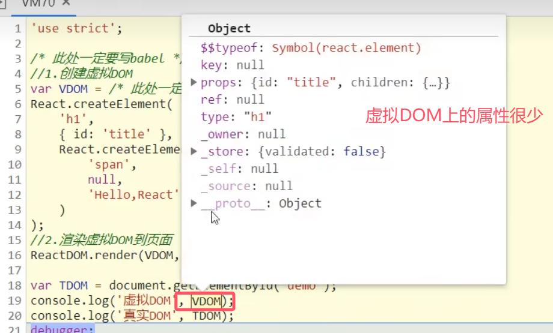

## 第1章 React简介

- 用于构建用户界面的jsx库（只关注页面），将数据渲染为HTML视图；
- 由Facebook开发且开源。
- [中文官网](https://react.docschina.org/)
  [英文官网](https://reactjs.org/)

React可以克服原生JS的以下缺点：

1. 原生JS操作DOM繁琐且效率低，因为用DOM-API操作UI；
2. JS直接操作DOM会使浏览器进行大量的重绘重排；
3. 原生JS没有组件化编码方案，代码复用率低

**react开发者工具**：Chrome插件 React Developer Tool（注意安装来源为facebook的）

### 1.1 React的特点

1. 采用组件化模式，声明式编码，提高开发效率及组件复用率;
2. 在React Native中可以使用React语法进行*移动端开发*；
3. 使用虚拟DOM+优秀的Diffing算法，尽量减少与真实DOM的交互。
   
   对比两次生成的虚拟DOM，如果重复，直接用页面之前有的DOM，而不是全部重绘真实DOM

### 1.2 引入文件

- react.js （核心库）：核心库要在react-dom之前引入
- react-dom.js ：提供操作DOM的react扩展库
- babel.min.js：解析JSX语法代码转为JS代码的库，即ES6==>ES5;JSX==>JS

### 1.3 JSX

全称: jsx XML，是react定义的一种类似于XML的JS扩展语法，本质是`React.createElement(component, props, ...children)`方法的语法糖。JXS最终产生的虚拟DOM就是一个JS对象。

#### 1.3.1 为什么要用JSX

- 更加简单地创建虚拟DOM
  （1）使用JSX创建虚拟DOM
  
  （2）使用JS创建虚拟DOM（用原生JS，不用babel，开发中不使用)
  
- JSX创建虚拟DOM的方法是JS方法的语法糖

#### 1.3.2 JSX语法规则

- 定义虚拟DOM时不用写引号
- 标签中混入JS表达式时要用`{}`

```jsx
const VDOM=(
            <div>
                <h1>前端js框架列表</h1>
                <ul>
                    {
                        data.map((item,index)=>{
                            return <li key={index}>{item}</li>
                        })
                    }
                </ul>               
            </div>           
        )
```

> 遇到以 { 开头的代码，以JS语法解析，且标签中的js表达式必须用{ }包含，比如`<ul>`中的`{}`中的`{index}`和`{item}`
>
> **注：**`key={index}`：在进行组件遍历的时候必须要加一个key来区分每个组件

- CSS类名指定不用`class`，用`className`
- 内联样式要用`style={{key：value}}`的样式写，如`style={{color：‘white’，fontSize：20px}}`（fontSize这种由多个单词组成的要用小驼峰格式写）
- 虚拟DOM必须只有一个根标签
- 标签必须闭合，如 `<input type="test" />`
- 标签首字母
  （1）若小写字母开头，则转为html5中的同名元素，如html5中无该标签，则报错
  （2）若大写字母开头，react就去渲染对应的组件，若组件没有定义，则报错

**辨析【js表达式】和【js语句 (代码)】**

- 表达式：一个表达式可以产生一个值，可以放在任何需要值的地方，如
  （1）`a`
  （2）`a+b`
  （3）`demo(1)`
  （4）`arr.map()`
  （5）`function test () {}`
- 语句（代码）：如
  （1）`if () {}`
  （2）`for () {}`
  （3）`switch () {case:xxxx}`

### 1.4 虚拟DOM

1. 本质是Object，即一般对象（不是数组对象和函数对象）

2. 虚拟DOM比较“轻”，真实DOM比较“重”，因为虚拟DOM是react内部在用，无需真实DOM中那么多属性
   

   

3. 虚拟DOM最终会被react转换为真实DOM呈现在页面上

### 1.5 模块与组件

#### 1.5.1 模块

- 向外界提供特定功能的js程序。随着业务逻辑增加，代码越来越多且复杂，此时js一般会拆成多个js文件来编写，一般一个js文件就是一个模块
- 作用：复用js，简化js的编写，提高js的运行效率
- 模块化：当应用的js都以模块来编写的, 这个应用就是一个模块化的应用

#### 1.5.2 组件

- 用来实现局部功能效果的代码和资源的集合(html/css/js/image等等)。比如一个功能齐全的Header栏就是一个组件。
- 复用编码, 简化项目编码, 提高运行效率
- 组件化：当应用是以多组件的方式实现, 这个应用就是一个组件化的应用

