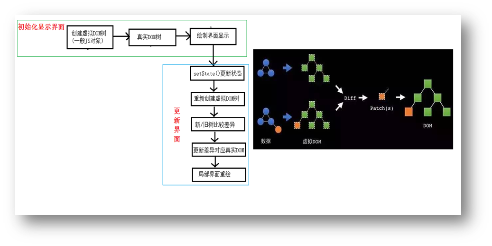

## 第2章 React面向组件编程

### 2.1 创建组件

#### 2.1.1 函数式组件

适用于简单组件（无`state`）

```jsx
<script type="text/babel">
		// 创建函数组件
		function MyComponent(){
			return <h2>我是用函数定义的组件(适用于【简单组件】的定义)</h2>
		}
		//2.渲染组件到页面
		ReactDOM.render(<MyComponent/>,document.getElementById('test'))
	</script>
```

**注意事项：**

- 函数中的`this`指向`undefined`，因为babel编译后开启了严格模式

本例中，执行了`ReactDOM.render(<MyComponent/>.......）`之后，发生了什么？

1. React解析组件标签，找到了MyComponent组件。
2. 发现组件是使用函数定义的，随后调用该函数，将返回的虚拟DOM转为真实DOM，随后呈现在页面中。

#### 2.1.2 类式组件

适用于复杂组件（有`state`）

```jsx
<script type="text/babel">
		//1.创建类式组件
		class MyComponent extends React.Component {
			render(){
				return <h2>我是用类定义的组件(适用于【复杂组件】的定义)</h2>
			}
		}
		//2.渲染组件到页面
		ReactDOM.render(<MyComponent/>,document.getElementById('test'))
		
	</script>
```

**注意事项：**

- 类式组件必须要继承react的内值类`React.Component`
- 一定要写`render`函数，且要有返回值
- `render`是放在类的原型对象上，供实例使用。
- `render`中的this指向类的实例对象（原因见下方） <=> 类式组件的实例对象。

本例中，执行了`ReactDOM.render(<MyComponent/>.......）`之后，发生了什么？

1. React解析组件标签，找到了MyComponent组件。
2. 发现组件是使用类定义的，随后`new`出来该类的实例，并通过该实例调用到原型上的`render`方法。
3. 将`render`返回的虚拟DOM转为真实DOM，随后呈现在页面中。

### 2.2 组件实例的三大属性

针对于类式组件，hooks可以让函数式组件也有三大属性

#### 2.2.1 state属性

##### 基本使用

- `state`是组件对象最重要的属性, 值是对象(可以包含多个key-value的组合)
- 组件被称为"状态机", 通过更新组件的`state`来**更新**对应的页面显示(重新渲染组件)

**代码实例：** 点击切换天气状态

**标准写法**

```jsx
<script type="text/babel">
		//1.创建组件
		class Weather extends React.Component{
			
			//构造器调用几次？ ———— 1次，只写了一个weather标签
			constructor(props){  //为了操作state
				console.log('constructor');
				super(props)
				//初始化状态
				this.state = {isHot:false,wind:'微风'}
				//解决changeWeather中this指向问题
				this.changeWeather = this.changeWeather.bind(this)
			}

			//render调用几次？ ———— 1+n次 1是初始化的那次 n是状态更新的次数
			render(){
				console.log('render');
				//读取状态
				const {isHot,wind} = this.state   //这种写法的依据?
				//复杂方法
				// const isHot = this.state.isHot;
				// const wind = this.state.wind;
				return <h1 onClick={this.changeWeather}>今天天气很{isHot ? '炎热' : '凉爽'}，{wind}</h1>
			}
			//、这里onclick是赋值语句，不能调用
			//changeWeather调用几次？ ———— 点几次调几次
			changeWeather(){
				//changeWeather放在哪里？ ———— Weather的原型对象上，供实例使用
				//由于changeWeather是作为onClick的回调，所以不是通过实例调用的，是直接调用
				//类中的方法默认开启了局部的严格模式，所以changeWeather中的this为undefined
				
				console.log('changeWeather');
				//获取原来的(isHot值
				const isHot = this.state.isHot
				//严重注意：状态必须通过setState进行更新,且更新是一种合并，不是替换（wind还在）。
				this.setState({isHot:!isHot})
				console.log(this);

				//严重注意：状态(state)不可直接更改，下面这行就是直接更改！！！
				//this.state.isHot = !isHot //这是错误的写法
			}
		}
		//2.渲染组件到页面
		ReactDOM.render(<Weather/>,document.getElementById('test'))
				
	</script>
```

注意事项：

- 在构造器`constructor`中初始化`state`，且要用对象形式初始化`state`
- 在`render`函数中创建虚拟DOM时，直接在标签中绑定事件，且事件写法不同于原生JS，如原生JS中的`onclick`事件，在react中要写成`onClick`，其他同理。
- `onClick={this.changeWeather}`是将`this.changeWeather`函数赋值给`onClick`，函数后面不能加括号，否则就是将函数返回值赋值
- 事件的回调函数要写在类中，此时它放在类的实例对象的原型链上，供实例使用。在本例中，由于`changeWeather`是作为`onClick`的回调，所以不是通过实例调用的，是直接调用，且类中的方法默认开启了局部的严格模式，所以其中`this`的指向不是实例对象，而是`undefined`。`render`函数也是放在对象的原型链上，但是它是由类的实例对象调用的，所以`this`指向实例对象
- 自定义的事件回调函数的`this`可以在构造器中用`bind`更改指向，生成的新函数直接在类中，所以`this`指向实例对象
- **注意：** 状态必须通过setState以对象的形式进行更新,且更新是一种合并，不是替换
- `const {isHot,wind} = this.state`是ES6中的对象解构，获取多个对象属性的方法

##### 简写方法（常用）

```jsx
<script type="text/babel">
		//1.创建组件
		class Weather extends React.Component{
			//初始化状态 类里可以直接写赋值语句，相当于追加属性（值写死）
			state = {isHot:false,wind:'微风'}

			render(){
				const {isHot,wind} = this.state
				return <h1 onClick={this.changeWeather}>今天天气很{isHot ? '炎热' : '凉爽'}，{wind}</h1>
			}

			//自定义方法————要用赋值语句的形式+箭头函数
			// changeWeather从原型上移到实例对象自身，外层函数的this就是箭头函数的this
			changeWeather = ()=>{
				const isHot = this.state.isHot
				this.setState({isHot:!isHot})
			}
		}
		//2.渲染组件到页面
		ReactDOM.render(<Weather/>,document.getElementById('test'))
				
```

注意事项：

- 类里可以直接写赋值语句，相当于追加属性（值写死），所以state可以直接在类里通过赋值的形式初始化，而不是在构造函数中
- 自定义回调函数的指向可以通过将箭头函数赋值的方式，从原型上转移到实例对象自身，箭头函数中`this`指向外层函数中的`this`，这里即为实例对象

##### 强烈注意：

1. 组件中`render`方法中的`this`为组件实例对象
2. 组件自定义的方法中`this`为`undefined`，如何解决？
   a) 强制绑定`this`: 通过函数对象的`bind()`
   （可在`constructor`中用`bind`，也可在绑定事件函数时用bind，即`onClick={this.changeWeather。bind(this)`）
   b) 箭头函数
3. state不能直接修改或更新，要借助 setState() 修改

#### 2.2.2 props属性

##### 基本使用

- 作用：通过标签属性（创建虚拟DOM时直接添加的数据）从组件外向组件内传递变化的数据
- 传递`props`，即传递标签属性，`props`批量传递标签属性
- 每个组件对象都会有`props`(properties的简写)属性
- 组件标签的所有属性都保存在`props`中
- **注意:** 组件内部不要修改`props`数据

**代码实例：** 自定义用来显示一个人员信息的组件

```jsx
<script type="text/babel">
		//创建组件
		class Person extends React.Component{
			render(){
				// console.log(this);
				const {name,age,sex} = this.props
				return (
					<ul>
						<li>姓名：{name}</li>
						<li>性别：{sex}</li>
						<li>年龄：{age+1}</li>
					</ul>
				)
			}
		}
		//渲染组件到页面
		ReactDOM.render(<Person name="jerry" age={19}  sex="男" speak={speak}/>,document.getElementById('test1'))
		ReactDOM.render(<Person name="tom" age={18} sex="女"/>,document.getElementById('test2'))

		const p = {name:'老刘',age:18,sex:'女'}
		ReactDOM.render(<Person {...p}/>,document.getElementById('test3'))
		
		function speak(){
			console.log('我说话了');
		}
	</script>
```

注意事项：

- 写入数据有两种方式：
  a）在虚拟DOM标签中直接写入数据，如`<Person name="18" age={18} sex="女"/>`（{18}代表是数值型，“18”代表是字符串）。`props`是对象，里面存储着键值对形式，`name="18"` 中，`name`是键，`"18"`是值
  b）在虚拟DOM标签中用扩展运算符展开对象，如`<Person {...p}/>`。`{...obj}`是ES6语法，是一个复制对象。但是在这里，`{...p}`并不是复制对象，因为这里的`{}`表示括号里面要写js表达式了，所以真正写的还是`...p`，这里react+babel就允许用展开运算符展开对象，不能随便使用（不能用`console.log()`查看）,仅仅适用于标签传递数据时。
- 数据会存入到类式组件`props`属性中，在`render`中可以通过`this.props`获取数据
- 内部读取某个属性值用`this.props.属性名`
- 组件类的构造函数`constructor`可省。

> 通常，在 react 中，构造函数仅用于以下两种情况： 
> a）通过给 `this.state` 赋值对象来初始化内部 `state`。
> b）为事件处理函数绑定实例 

##### 对props进行限制

首先要引入prop-types库，用于对组件标签属性进行限制

限制`props`有两种方法：
a）限制内容写在类外面

```jsx
Person.propTypes = {
			name:PropTypes.string.isRequired, //限制name必传，且为字符串
			sex:PropTypes.string,//限制sex为字符串
			age:PropTypes.number,//限制age为数值
			speak:PropTypes.func,//限制speak为函数
		}
		//指定默认标签属性值
Person.defaultProps = {
	sex:'男',//sex默认值为男
	age:18 //age默认值为18
}
```

b）限制内容写在类里面

```jsx
static propTypes = {
				name:PropTypes.string.isRequired, //限制name必传，且为字符串
				sex:PropTypes.string,//限制sex为字符串
				age:PropTypes.number,//限制age为数值
			}

			//指定默认标签属性值
static defaultProps = {
	sex:'男',//sex默认值为男
	age:18 //age默认值为18
}
```

注意事项：

- 首字母小写的`propTypes`是类里的属性
- 首字母大写的`PropTypes`是prop-types库里的内置对象
- React v15.5 开始已弃用的写法`name: React.PropTypes.string.isRequired`，改为引入prop-types库的方式

##### 函数组件使用props

三大属性中，只有`props`可以用于函数组件，因为函数可以接收参数，`state`和`refs`都不能用于函数组件。

```jsx
<script type="text/babel">
		//创建组件
		function Person (props){
			const {name,age,sex} = props
			return (
					<ul>
						<li>姓名：{name}</li>
						<li>性别：{sex}</li>
						<li>年龄：{age}</li>
					</ul>
				)
		}
		Person.propTypes = {
			name:PropTypes.string.isRequired, //限制name必传，且为字符串
			sex:PropTypes.string,//限制sex为字符串
			age:PropTypes.number,//限制age为数值
		}

		//指定默认标签属性值
		Person.defaultProps = {
			sex:'男',//sex默认值为男
			age:18 //age默认值为18
		}
		//渲染组件到页面
		ReactDOM.render(<Person name="jerry"/>,document.getElementById('test1'))
	</script>
```

注意事项：

- 限制`props`只能使用第一种方法

#### 2.2.3 refs属性

组件内的标签可以定义`ref`属性来标识自己。

`this.refs`拿到真实DOM

##### 字符串ref

```jsx
class Demo extends React.Component{
			//展示左侧输入框的数据
			showData = ()=>{
				console.log(this);
				const {input1} = this.refs //解构赋值，等价于this.refs.input1
				alert(input1.value)
			}
			//展示右侧输入框的数据
			showData2 = ()=>{
				console.log(this);
				const {input2} = this.refs
				alert(input2.value)
			}
			render(){
				return(
					<div>
						<input ref="input1" type="text" placeholder="点击按钮提示数据"/>&nbsp;
						<button onClick={this.showData}>点我提示左侧的数据</button>&nbsp;
						<input ref="input2" onBlur={this.showData2} type="text" placeholder="失去焦点提示数据"/>
					</div>
				)
			}
		}
		//渲染组件到页面
		ReactDOM.render(<Demo a="1" b="2"/>,document.getElementById('test'))
```

不被官方推荐，因为效率不高

##### 回调ref

**1.** 内联函数（推荐）

```jsx
<input ref={currentNode => this.input1 = currentNode } type="text" placeholder="点击按钮提示数据"/>&nbsp; 
{/*这里的this是指向实例对象，因为箭头函数没有指向，查找外侧的this指向*/}
```


注意：

- 函数中的参数`currentNode`是`ref`所在的节点
- 此时`input1`是类的属性，即**直接绑定到类里**，而不是像字符串ref一样添加到`refs`对象里

**2.** 类绑定函数

```jsx
saveInput = (c)=>{
				this.input1 = c;
				console.log('@',c);
			}
<input ref={this.saveInput} type="text"/>
```


**3.** 回调ref中回调执行次数
内联函数更新时会执行两次，一次清空，一次执行函数，类绑定函数不会。

*交互和更改状态的区别：取决于是否修改`render`函数中节点的内容*

##### createRef（react最推荐）

```jsx
<script type="text/babel">
		class Demo extends React.Component{
			myRef = React.createRef()
			myRef2 = React.createRef()
			showData = ()=>{
				alert(this.myRef.current.value);
			}
			showData2 = ()=>{
				alert(this.myRef2.current.value);
			}
			render(){
				return(
					<div>
						<input ref={this.myRef} type="text" placeholder="点击按钮提示数据"/>&nbsp;
						<button onClick={this.showData}>点我提示左侧的数据</button>&nbsp;
						<input onBlur={this.showData2} ref={this.myRef2} type="text" placeholder="失去焦点提示数据"/>&nbsp;
					</div>
				)
			}
		}
		ReactDOM.render(<Demo a="1" b="2"/>,document.getElementById('test'))
	</script>
```

- `React.createRef`调用后可以返回一个容器，该容器可以存储被`ref`所标识的节点,该容器是“专人专用”的，有多少个节点表示`ref`，就要调用多少次 `React.createRef`

#### 2.2.4 事件处理

1. 通过`onXxx`属性指定事件处理函数(注意大小写)
   a）React使用的是自定义(合成)事件, 而不是使用的原生DOM事件——为了更好的兼容性
   b）React中的事件是通过事件委托方式处理的(委托给组件最外层的元素)———为了高效
2. 通过`event.target`得到发生事件的DOM元素对象。发生事件的元素就是操作的元素则可以省略ref。
3. **不要过度使用`ref`。**

### 2.3 受控组件和非受控组件

以表单提交案例为例

#### 2.3.1 非受控组件

用`ref`实现

页面中所有的输入类DOM现用现取，即通过`ref`标识DOM，进而获取数据

```jsx
<script type="text/babel">
		//创建组件
		class Login extends React.Component{
			handleSubmit = (event)=>{
				event.preventDefault() //阻止表单提交
				const {username,password} = this
				alert(`你输入的用户名是：${username.value},你输入的密码是：${password.value}`)
			}
			render(){
				return(
					<form onSubmit={this.handleSubmit}>
						用户名：<input ref={c => this.username = c} type="text" name="username"/>
						密码：<input ref={c => this.password = c} type="password" name="password"/>
						<button>登录</button>
					</form>
				)
			}
		}
		//渲染组件
		ReactDOM.render(<Login/>,document.getElementById('test'))
	</script>
```

知识点：

1. 表单`<form>`中都有`onSubmit`属性来控制提交之后的状态
2. 输入类DOM（如`<input>`）得有`name`属性才能通过GET请求获取到query参数（用？携带）
3. 删掉`action`无法阻止表单页面刷新以及地址栏更新，得要禁止默认事件`event.preventDefault()`
4. `<button>`的默认`type`属性值就是`submit`

#### 2.3.2 受控组件

用`onChange`+`state`实现
页面中所有的输入类DOM将数据存在`state`中

**更推荐用受控组件，减少`ref`的使用**

```jsx
<script type="text/babel">
		//创建组件
		class Login extends React.Component{

			//初始化状态
			state = {
				username:'', //用户名
				password:'' //密码
			}

			//保存用户名到状态中
			saveUsername = (event)=>{
				this.setState({username:event.target.value})
			}

			//保存密码到状态中
			savePassword = (event)=>{
				this.setState({password:event.target.value})
			}

			//表单提交的回调
			handleSubmit = (event)=>{
				event.preventDefault() //阻止表单提交
				const {username,password} = this.state
				alert(`你输入的用户名是：${username},你输入的密码是：${password}`)
			}

			render(){
				return(
					<form onSubmit={this.handleSubmit}>
						用户名：<input onChange={this.saveUsername} type="text" name="username"/>
						密码：<input onChange={this.savePassword} type="password" name="password"/>
						<button>登录</button>
					</form>
				)
			}
		}
		//渲染组件
		ReactDOM.render(<Login/>,document.getElementById('test'))
	</script>
```

### 2.4 高阶函数

如果一个函数符合下面2个规范中的任何一个，那该函数就是高阶函数。

1. 若A函数，接收的参数是一个函数，那么A就可以称之为高阶函数。
2. 若A函数，调用的返回值依然是一个函数，那么A就可以称之为高阶函数。
   常见的高阶函数有：`Promise`、`setTimeout`、`arr.map()`等等

函数的柯里化：通过函数调用继续返回函数的方式，实现多次接收参数最后统一处理的函数编码形式。

```jsx
function sum(a){
	return(b)=>{
		return (c)=>{
			return a+b+c
		}
	}
}
```

**用函数的柯里化实现受控组件**

为了不重复编写相似的代码，如`saveUsername`和`savePassword`

```jsx
<script type="text/babel">
		//创建组件
		class Login extends React.Component{
			//初始化状态
			state = {
				username:'', //用户名
				password:'' //密码
			}

			//保存表单数据到状态中（函数的柯里化）
			saveFormData = (dataType)=>{
                //这个函数会被返回并赋值给onChange，最终由react自动调用该函数，并自动传递event参数。
				return (event)=>{
					this.setState({[dataType]:event.target.value})
				}
			}

			//表单提交的回调
			handleSubmit = (event)=>{
				event.preventDefault() //阻止表单提交
				const {username,password} = this.state
				alert(`你输入的用户名是：${username},你输入的密码是：${password}`)
			}
			render(){
				return(
					<form onSubmit={this.handleSubmit}>
						用户名：<input onChange={this.saveFormData('username')} type="text" name="username"/>
						密码：<input onChange={this.saveFormData('password')} type="password" name="password"/>
						<button>登录</button>
					</form>
				)
			}
		}
		//渲染组件
		ReactDOM.render(<Login/>,document.getElementById('test'))
	</script>
```

- `this.saveFormData('username')`，有了小括号，立即调用，但是返回的还是一个函数，符合回调函数的要求
- `[dataType]`：调用变量形式的对象属性名
- `event`形参不需要实参，可以直接调用，所以event不能写进`this.saveFormData('username')`的参数中，得用柯里化形式来体现

**不用函数柯里化的实现方式**

只需改两处：

```jsx
saveFormData = (dataType,event)=>{
				this.setState({[dataType]:event.target.value})
			}
用户名：<input onChange={event => this.saveFormData('username',event) } type="text" name="username"/>
```

***两种方法都常用***

### 2.5 生命周期

#### 2.5.1 引入

1. 组件从创建到死亡它会经历一些特定的阶段。
2. React组件中包含一系列钩子函数(生命周期回调函数), 会在特定的时刻调用。
3. 我们在定义组件时，会在特定的生命周期回调函数中，做特定的工作。
4. 生命周期回调函数<=> 生命周期钩子函数<=>生命周期函数<=>生命周期钩子
5. 挂载 mount： 组件第一次被渲染到DOM中的时候，就为其设置一个计时器，叫挂载 `ReactDOM.render(<Life/>, document.querySelector('test'))`
6. 卸载 unmount：组件被删除时，应该清除计时器，在react中被称为卸载 `ReactDOM.unmountComponentAtNode(document.querySelector('test'))`

知识点：

- 行内样式写法：`style={{opacity:opacity}}`；
- 对象中属性名和属性值相同时触发简写：`{opacity：opacity}`简写为`{opacity}`
- `render`执行次数：1+n（初始化渲染+更新状态）

#### 2.5.2 react生命周期（旧）


三条线：

1. 父组件`render`–>`componentWillReceiveProps`–>`shouldComponentUpdate`–>`componentWillUpdate`–>`render`–>`componentDidUpdate`–>`componentWillUnmount`
2. `setState()`–>`shouldComponentUpdate`–>`componentWillUpdate`–>`render`–>`componentDidUpdate`–>`componentWillUnmount`
3. `forceUpdate()`–>`componentWillUpdate`–>`render`–>`componentDidUpdate`–>`componentWillUnmount`

**知识点：**

- `shouldComponentUpdate`返回值必须为`true`或`false`，若不写这个钩子，默认返回`true`
- `forceUpdate()`：强制更新。不更改任何状态中的数据，强制更新一下
- `componentWillReceiveProps`：在页面首次渲染时会不会调用componentWillReceiveProps。

**生命周期的三个阶段（旧）**

1. 初始化阶段: 由`ReactDOM.render()`触发—初次渲染
   1）`constructor()`
   2）`componentWillMount()`
   3）`render()`： **常用**，一定得调用
   4）`componentDidMount()`： **常用**，一般在这个钩子中做一些初始化的事，如开启定时器、发送网络请求、订阅消息
2. 更新阶段: 由组件内部`this.setSate()`或父组件重新`render`触发
   1）`shouldComponentUpdate()`
   2）`componentWillUpdate()`
   3）`render()`
   4）`componentDidUpdate()`
3. 卸载组件: 由`ReactDOM.unmountComponentAtNode()`触发
   1）`componentWillUnmount()` ：**常用**，一般在这个钩子中做一些收尾的事，如关闭定时器、取消订阅消息

#### 2.5.3 react生命周期（新）


- 17及以上版本`componentWillMount`、`componentWillUpdate`、`componentWillReceiveProps`三个钩子使用前要加UNSAFE_前缀才能使用，以后可能会被彻底废弃，不建议使用。
  
- 新的生命周期和旧的生命周期相比，除了即将废弃三个钩子，还添加了两个新的钩子`getDerivedStateFromProps`和`getSnapshotBeforeUpdate`
- `static getDerivedStateFromProps`：适用于罕见用例（**几乎不用**），返回`null`或state对象，state的值在任何时候都取决于`props`
- `getSnapshotBeforeUpdate(prevProps,prevState,)`：在更新之前获取快照，返回值传递给`componentDidUpdate(prevProps,prevState,snapshotValue)`

### 2.6 虚拟DOM与DOM Diffing算法

DOM Diffing算法对比的最小粒度是标签，且逐层对比


#### 2.6.1 key的作用

经典面试题：

1. react/vue中的key有什么作用？（key的内部原理是什么？）
2. 为什么遍历列表时，key最好不要用index?

**解释：**

- 虚拟DOM中key的作用：

1. 简单地说: key是虚拟DOM对象的标识, 在更新显示时key起着极其重要的作用。
2. 详细地说: 当状态中的数据发生变化时，react会根据【新数据】生成【新的虚拟DOM】, 随后React进行【新虚拟DOM】与【旧虚拟DOM】的diff比较，比较规则如下：
   a. 旧虚拟DOM中找到了与新虚拟DOM相同的key：
   (1) 若虚拟DOM中内容没变, 直接使用之前的真实DOM
   (2) 若虚拟DOM中内容变了, 则生成新的真实DOM，随后替换掉页面中之前的真实DOM
   b. 旧虚拟DOM中未找到与新虚拟DOM相同的key：
   根据数据创建新的真实DOM，随后渲染到到页面


- 用index作为key可能会引发的问题：

1. 若对数据进行：**逆序**添加、**逆序**删除等破坏顺序操作:
   会产生没有必要的真实DOM更新 ==> 界面效果没问题, 但效率低。
2. 如果结构中还包含输入类的DOM（如input，虚拟DOM中标签属性少，input没有value属性）：
   会产生错误DOM更新 ==> 界面有问题。
3. **注意！** 如果不存在对数据的逆序添加、逆序删除等破坏顺序操作，仅用于渲染列表用于展示，使用index作为key是没有问题的。

- 开发中如何选择key?

1. 最好使用每条数据的唯一标识作为key, 比如id、手机号、身份证号、学号等唯一值。
2. 如果确定只是简单的展示数据，用index也是可以的。

