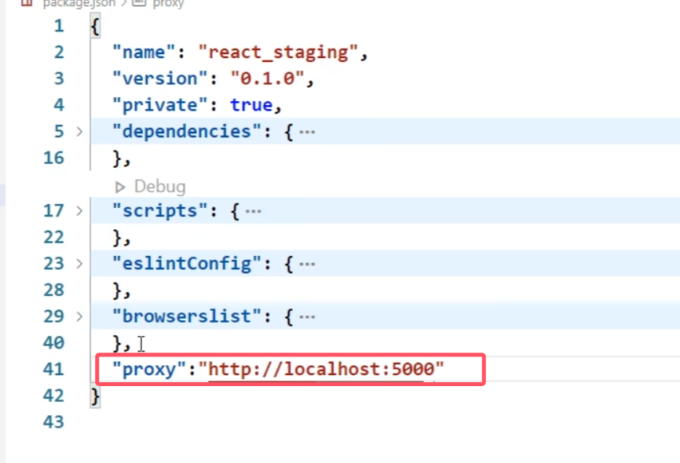

## 第4章 React ajax

### 4.1 理解

1. React本身只关注于界面, 并不包含发送ajax请求的代码
2. 前端应用需要通过ajax请求与后台进行交互(json数据)
3. react应用中需要集成第三方ajax库(或自己封装，但是基本不会自己封装)

### 4.2 实现

1. jQuery: 要操作DOM，并且比较重, 如果需要另外引入不建议使用
2. axios: 轻量级, 建议使用
   1）封装XmlHttpRequest对象的ajax
   2）promise风格
   3）可以用在浏览器端和node服务器端

### 4.3 配置代理

> 如果不配置代理，会发生跨域问题：
> 客户端将请求发给服务器时，服务器将数据返回，但因为服务器和客户端端口不一样，因此服务器返回的数据被客户端的ajax引擎拦在了外面。
> 配置代理服务器后，代理服务器和客户端在一个端口，
> 请求的发送的路径为 客户端 --> 代理服务器 --> 服务器
> 服务器响应的路径为 服务器 --> 代理服务器 --> 客户端
> 由于代理服务器没有ajax引擎，就算和服务器端口不一样，也不会拒绝接受服务器传来的数据。
> 由于代理服务器和客户端端口一样，客户端可以接收代理服务器传来的数据
>
> 


#### react脚手架配置代理总结

**方法一**

> 在package.json中追加如下配置

```json
"proxy":"http://localhost:5000"
```



说明：

1. 优点：配置简单，前端请求资源时可以不加任何前缀。
2. 缺点：不能配置多个代理。
3. 工作方式：上述方式配置代理，当请求了3000不存在的资源时，那么该请求会转发给5000 （优先匹配前端资源）

**方法二**

1. 第一步：创建代理配置文件

   ```
   在src下创建配置文件：src/setupProxy.js(不允许改名)
   ```

2. 编写setupProxy.js配置具体代理规则：

   ```js
   const proxy = require('http-proxy-middleware')
   
   module.exports = function(app) {
     app.use(
       proxy('/api1', {  //api1是需要转发的请求(所有带有/api1前缀的请求都会转发给5000)
         target: 'http://localhost:5000', //配置转发目标地址(能返回数据的服务器地址)
         changeOrigin: true, //控制服务器接收到的请求头中host字段的值
         /*
         	changeOrigin设置为true时，服务器收到的请求头中的host为：localhost:5000
         	changeOrigin设置为false时，服务器收到的请求头中的host为：localhost:3000
         	changeOrigin默认值为false，但我们一般将changeOrigin值设为true
         */
         pathRewrite: {'^/api1': ''} //重写请求路径，将/api1替换为空字符串，保证交给后台服务器的是正常请求地址(必须配置)
       }),
       proxy('/api2', { 
         target: 'http://localhost:5001',
         changeOrigin: true,
         pathRewrite: {'^/api2': ''}
       })
     )
   }
   ```

说明：

1. 优点：可以配置多个代理，可以灵活的控制请求是否走代理。
2. 缺点：配置繁琐，前端请求资源时必须加前缀。

#### 学习原生AJAX时，解决跨域问题是在server.js代码中加入以下代码（即在后端解决）

```js
  //设置响应头  设置允许跨域  
  response.setHeader('Access-Control-Allow-Origin', '*');
  //响应头
  response.setHeader('Access-Control-Allow-Headers', '*');
```

为CORS解决方案

**注意**：127.0.0.1和localhost的区别

1. 127.0.0.1 为保留地址，直白地说 127.0.0.1 就是一个 ip 地址，不同于其它 ip 地址的是它是一个指向本机的 ip 地址，也称为环回地址，该 ip 地址不能使用在公网 ip 上，对任何一台电脑来说,不管是否连接到INTERNET上，127.0.0.1 都是指向自己。
   事实上整个 127.* 网段都是环回地址，127.* ip 段都为保留地址，只是规则制定者将其中的 127.0.0.1 规定为指向本机自己。
2. 在电脑网络中，localhost 为“本地主机”，是给回路网络接口（loopback）的一个标准主机名，IPv4 相对应的地址为 127.0.0.1，IPv6 相对应的地址为 [::1]，这个名称也是一个保留域名。
   说白了就是 localhost 就是一个**本地域名**，不是地址。该本地域名指向的 ip 地址就是 127.0.0.1 ，也就是指向本机，localhost 更方便记忆与输入，因 hosts文件 定义了 localhost = 127.0.0.1 ，所以你只需要记住 localhost 就可以代表本机了。
3. 对机器来说，它需要通过 hosts 文件来定义 localhost = 127.0.0.1（多一次解析 ip 的步骤） ，才能知道 localhost 代表的是本机，机器只知道 127.0.0.1 代表本机，因此当你向 localhost 发消息的时候，机器会自动翻译后给127.0.0.1发消息。
4. 在实际工作中，localhost 是不经过网卡传输的，所以它不受网络防火墙和与网卡相关的种种限制，而 127.0.0.1 则要通过网卡传输数据，是必须依赖网卡的。这一点也是 localhost 和 127.0.0.1 的最大的区别，这就是为什么有时候用 localhost 可以访问，但用 127.0.0.1 就不可以的情况。

### 4.4 案例—github用户搜索

#### 4.4.1 axios发送请求

1. 连续解构赋值：

```jsx
const {keyWordElement:{value}} = this
```

相当于 `this.keyWordElement.value`，此时`keyWordElement`并没有被解构，只是写的过程，即

```jsx
console.log(keyWordElement) // undefined
const {keyWordElement:{value:keyWord}} = this
```

连续解构赋值+重命名

1. **状态中的数据驱动着页面的展示**
2. 连续写三元表达式

```jsx
isFirst ? <h2>欢迎使用，输入关键字，随后点击搜索</h2> :
isLoading ? <h2>Loading......</h2> :
err ? <h2 style={{color:'red'}}>{err}</h2> 
```

如果第一个判断为正确，就不会执行后面的代码了，所以**顺序很重要**

#### 4.4.2 消息订阅-发布机制（pubsub-js）

**使用：**

1. 工具库: PubSubJS
2. 下载: npm install pubsub-js --save
3. 使用:
   1) import PubSub from ‘pubsub-js’ //引入
   2) PubSub.subscribe(‘delete’, function(data){ }); //订阅
   3) PubSub.publish(‘delete’, data) //发布消息

**注意：**

4. 适用于任意组件之前的消息沟通
5. 谁用谁接，谁传谁发

#### 4.4.3 扩展：使用Fetch发送网络请求（用得不多）

- **发送AJAX请求的方法：**

1. 原生AJAX：xhr
2. jQuery：对xhr的封装
3. axios：对xhr的封装
4. fetch：不是库，是windows内置，且是Promise风格。**和xhr并列**

- fetch的特点关注分离
- fetch兼容性不高

#### 4.4 案例总结

1. 设计状态时要考虑全面，例如带有网络请求的组件，要考虑请求失败怎么办。

2. ES6小知识点：解构赋值+重命名
   let obj = {a:{b:1}}
   const {a} = obj; //传统解构赋值
   const {a:{b}} = obj; //连续解构赋值
   const {a:{b:value}} = obj; //连续解构赋值+重命名

3. 消息订阅与发布机制
   1.先订阅，再发布（理解：有一种隔空对话的感觉）
   2.适用于任意组件间通信
   3.要在组件的componentWillUnmount中取消订阅

   > 在组件卸载之前取消订阅，主要是为了**防止内存泄漏和避免潜在的错误**。
   > 如果组件在卸载之前没有取消订阅，即使组件已经销毁，其订阅回调仍然存在于内存中。将会出现如下结果
   >
   > - 发布消息时，仍会调用已卸载组件的回调函数。
   > - 由于组件实例已销毁，引用的资源无法被垃圾回收，导致内存泄漏。

4. fetch发送请求（关注分离的设计思想）

```jsx
	try {
		const response= await fetch(`/api1/search/users2?q=${keyWord}`)
		const data = await response.json()
		console.log(data);
	} catch (error) {
		console.log('请求出错',error);
	}
```

