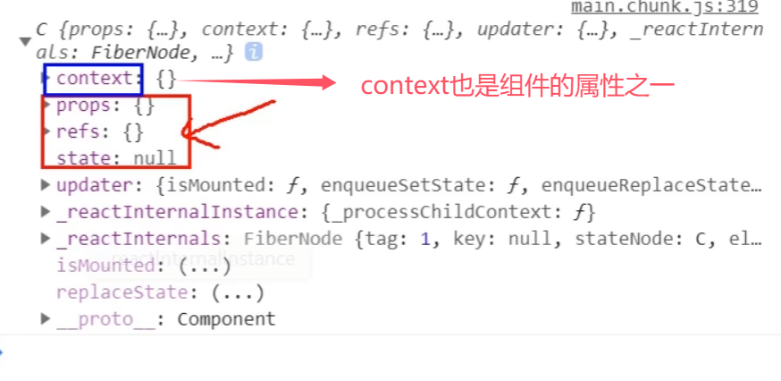

## 第8章 扩展

### 8.1 setState

**setState更新状态的2种写法**

1. `setState(stateChange, [callback])`------对象式的setState
   1）`stateChange`为状态改变对象(该对象可以体现出状态的更改)
   2）`callback`是可选的回调函数, 它在**状态更新完毕**、**界面也更新后**(`render`调用后)才被调用
2. `setState(updater, [callback])`------函数式的setState
   1）`updater`为返回`stateChange`对象的函数。
   2）`updater`可以接收到`state`和`props`。
   3）`callback`是可选的回调函数, 它在状态更新、界面也更新后(`render`调用后)才被调用。

**总结:**

1. 对象式的`setState`是函数式的`setState`的简写方式(语法糖)
2. 使用原则：
   1）如果新状态不依赖于原状态 = = => 使用对象方式
   2）如果新状态依赖于原状态 = = => 使用函数方式
   3）如果需要在`setState()`执行后获取最新的状态数据 ,  要在第二个`callback`函数中读取

### 8.2 lazyLoad

#### 路由组件的lazyLoad

1. 通过React的lazy函数配合import()函数动态加载路由组件 ===> 路由组件代码会被分开打包
2. 通过指定在加载得到路由打包文件前显示一个自定义loading界面

```jsx
	//1.通过React的lazy函数配合import()函数动态加载路由组件 ===> 路由组件代码会被分开打包
	const Login = lazy(()=>import('@/pages/Login')) //函数体不能加花括号
	
	//2.通过<Suspense>指定在加载得到路由打包文件前显示一个自定义loading界面
	<Suspense fallback={<h1>loading.....</h1>}>
        <Switch>
            <Route path="/xxx" component={Xxxx}/>
            <Redirect to="/login"/>
        </Switch>
    </Suspense>
```

------

### 8.3 Hooks

#### 8.3.1 React Hook/Hooks是什么?

1. Hook是React 16.8.0版本增加的新特性/新语法
2. 可以让你在函数组件中使用 state 以及其他的 React 特性

#### 8.3.2 三个常用的Hook

1. State Hook: `React.useState()`
2. Effect Hook: `React.useEffect()`
3. Ref Hook: `React.useRef()`

#### 8.3.3 State Hook

1. State Hook让函数组件也可以有state状态, 并进行状态数据的读写操作
2. 语法:

```jsx
const [xxx, setXxx] = React.useState(initValue)  
```

1. `useState()`说明:
   参数: 第一次初始化指定的值在内部作缓存	
   返回值: 包含2个元素的数组, 第1个为内部当前状态值, 第2个为更新状态值的函数
2. `setXxx()`的2种写法:
   `setXxx(newValue)`: 参数为非函数值, 直接指定新的状态值, 内部用其覆盖原来的状态值
   `setXxx(value => newValue)`: 参数为函数, 接收原本的状态值, 返回新的状态值, 内部用其覆盖原来的状态值

#### 8.3.4 Effect Hook

1. Effect Hook 可以让你在函数组件中执行副作用操作(**用于模拟类组件中的生命周期钩子**)
2. React中的副作用操作:
   发ajax请求数据获取
   设置订阅 / 启动定时器
   手动更改真实DOM（尽量避免）
3. 语法和说明:

```jsx
useEffect(() => {  //相当于componentDidUpdate 和 componentDidMount
    // 在此可以执行任何带副作用操作
  return () => {  //相当于componentWillUnmount 在组件卸载前执行
    // 在此做一些收尾工作, 比如清除定时器/取消订阅等
  }
}, [stateValue])  //在第二个数组参数中，可以指定要监视的state属性。 如果指定的是[], 回调函数只会在第一次render()后执行
```

```jsx
//当useEffect不写第二个参数时，useEffect会监视state中的所有属性
useEffect(() => { 
	console.log("@")
})
```

4. 可以把 useEffect Hook 看做如下三个函数的组合
   `componentDidMount()`
   `componentDidUpdate()`
   `componentWillUnmount()`

#### 8.3.5 Ref Hook

1. Ref Hook可以在函数组件中存储/查找组件内的标签或任意其它数据
2. 语法：

```jsx
const refContainer = useRef()  //声明

function show(){ //调用
    alert(myRef.current.value)
}  

return (
    <div>
        <input type="text" ref={myRef}/> {/* 使用refContainer */}
    </div>
)
```

3. 作用： 保存标签对象，功能与`React.createRef()`一样

### 8.4 Fragment

**使用**

```jsx
import {Fragment } from 'react'

//<Fragment></Fragment>和<></>之间有一些小区别

//类似于一个<div>
<Fragment></Fragment>    //可以添加一个属性 'key'，用于遍历

<></>  //不能添加任何属性
```

**作用**：可以不用必须有一个真实的DOM根标签了

### 8.5 Context



#### 8.5.1 理解

一种组件间通信方式, 常用于【祖组件】与【后代组件】间通信

#### 8.5.2 使用

1. 创建Context容器对象：

   ```jsx
   const XxxContext = React.createContext()  
   //const {Provider,Consumer} = XxxContext 也可以结构赋值
   ```

2. 渲染子组时，外面包裹`xxxContext.Provider`, 通过`value`属性给后代组件传递数据：

   ```jsx
   <xxxContext.Provider value={数据}>
   		子组件
   </xxxContext.Provider>
   ```

3. 后代组件读取数据：
   1） 第一种方式:仅适用于类组件

   ```jsx
     static contextType = xxxContext  // 声明接收context
   	  this.context // 读取context中的value数据
   ```

   2）第二种方式: 函数组件与类组件都可以

   ```jsx
    <xxxContext.Consumer>
   		 //组件中的函数
   	    {
   	      value => ( // value就是context中的value数据
   	        要显示的内容
   	      )
   	    }
     </xxxContext.Consumer>
   ```

**注意:** 在应用开发中**一般不用context**, 一般都用它的封装react插件（如，react-redux）

### 8.6 组件优化

**Component的2个问题**

1. 只要执行`setState()`，即使不改变状态数据, 组件也会重新render() ==> **效率低**
2. 只当前组件重新`render()`, 就会自动重新render子组件，纵使子组件没有用到父组件的任何数据 ==> **效率低**

**效率高的做法**

只有当组件的`state`或`props`数据发生改变时才重新`render()`

**原因**

Component中的`shouldComponentUpdate()`总是返回true

**解决**

1. **办法1**: 重写`shouldComponentUpdate()`方法
   比较新旧state或props数据, 如果有变化才返回true, 如果没有返回false

   ```jsx
   shouldComponentUpdate(nextProps,nextState){
   		// console.log(this.props,this.state); //目前的props和state
   		// console.log(nextProps,nextState); //接下要变化的目标props，目标state
   		return !this.state.carName === nextState.carName
   }
   ```

2. **办法2**: 使用`PureComponent`
   `PureComponent`重写了`shouldComponentUpdate()`, 只有state或props数据有变化才返回true

   ```jsx
   import React, { PureComponent } from 'react'
   //之前是import React, { Component } from 'react'
   ```

**注意:**

1. `PureComponent`，只是进行state和props数据的浅比较, 如果只是数据对象内部数据变了, 返回false

   ```jsx
   //错误示范：
   //通过这种方式改变state，由于新的state对象和旧的state对象地址值一样，因此PureComponent没有进行render
   const obj = this.state
   obj.carName = '迈巴赫'
   console.log(obj === this.state);
   this.setState(obj)
   ```

   ```jsx
   state = {carName:"奔驰c36",stus:['小张','小李','小王']}
   
   	addStu = ()=>{
           //被注释掉的是错误写法：
   		/* const {stus} = this.state
   		stus.unshift('小刘') //unshift不会更改原数组的地址，因此state中的stus地址值没有改变，PureComponent不会render
   		this.setState({stus}) */
   
   		const {stus} = this.state
   		this.setState({stus:['小刘',...stus]})
   	}
   ```

2. 不要直接修改state数据, 而是要产生新数据（新对象）。所以不能用`unshift`

3. 项目中一般使用`PureComponent`来优化

------

### 8.7 render props

#### 8.7.1 如何向组件内部动态传入带内容的结构(标签)?

1. Vue中:
   使用slot（插槽）技术, 也就是通过组件标签体传入结构

   ```jsx
   <A><B/></A>
   ```

2. React中：
   使用**children props**：通过组件标签体传入结构
   使用**render props**： 通过组件标签属性传入结构,而且可以携带数据，一般用render函数属性

#### 8.7.2 children props

```jsx
<A>
 </B>
</A>
	{this.props.children}
```

**问题**: 如果B组件需要A组件内的数据, ==> 做不到

#### 8.7.3 render props

```jsx
<A render={(data) => <C data={data} />} />
//相当于<A render={(data) => <C data={data}></C>}></A>
```

A组件: `{this.props.render(内部state数据)}`
C组件: 读取A组件传入的数据显示 `{this.props.data}`
**注意：** 只要组件不带内容，单标签和双标签实现效果相同（即`<A></A>`==`<A/>`）

### 8.8 错误边界

#### 8.8.1 理解

错误边界(Error boundary)：用来捕获**后代组件**错误，渲染出备用页面

#### 8.8.2 特点

1. 只能捕获**后代组件生命周期**产生的错误，不能捕获自己组件产生的错误和其他组件在合成事件、定时器中产生的错误
2. 只适用于生产环境（build打包），而不是开发环境

#### 8.8.3 使用方式

```jsx
getDerivedStateFromError`配合`componentDidCatch
// 生命周期函数，一旦后台组件报错，就会触发
static getDerivedStateFromError(error) {
    console.log(error);
    // 在render之前触发
    // 返回新的state
    return {
        hasError: true,
    };
}

componentDidCatch(error, info) {
    // 统计页面的错误。发送请求发送到后台去
    console.log(error, info);
}
```

### 8.9 组件通信方式总结

#### 8.9.1 组件间的关系：

- 父子组件
- 兄弟组件（非嵌套组件）
- 祖孙组件（跨级组件）

#### 8.9.2 几种通信方式：

1. props：
   1）children props
   2）render props
2. 消息订阅-发布：
   pubs-sub、event等等
3. 集中式管理：
   redux、dva等等
4. context:
   生产者-消费者模式

#### 8.9.2 比较好的搭配方式：

- 父子组件：props
- 兄弟组件：消息订阅-发布、集中式管理
- 祖孙组件(跨级组件)：消息订阅-发布、集中式管理、conText(开发用的少，封装插件用的多)

