#  创建Vue3.0工程

##  创建Vue3项目

###  vue-cli

使用vue-cli创建Vue3项目，需要确保vue-cli版本在4.5.0以上。

```bash
## 查看@vue/cli版本，确保@vue/cli版本在4.5.0以上
vue --version
vue -V

## 安装或者升级@vue/cli
npm install -g @vue/cli
```

使用vue-cli创建Vue3项目

```bash
vue create vue3_study
```


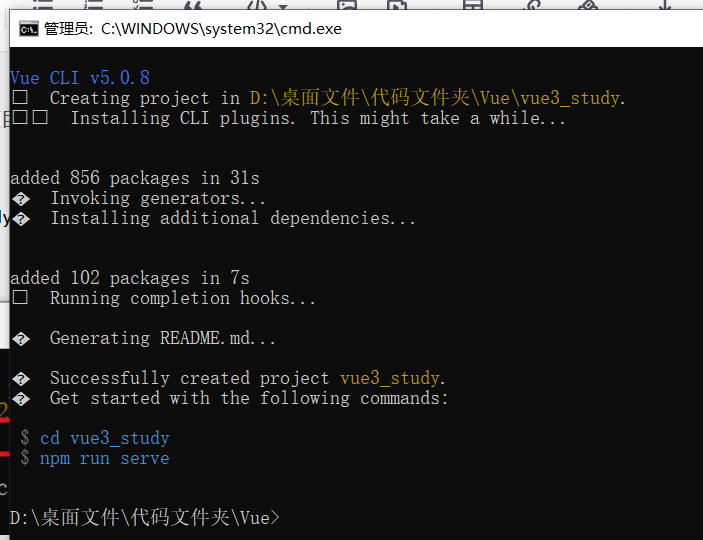

###  vite

vite创建Vue3项目步骤：

```bash
## 创建工程
npm init vite-app <project-name>
## 进入工程目录
cd <project-name>
## 安装依赖
npm install
## 运行
npm run dev
npm init vite-app vue3_study_vite
```

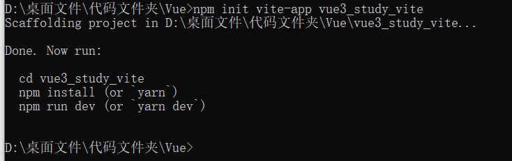

```bash
cd vue3_study_vite
npm i
```


```bash
npm run dev
```


##  项目结构

> 使用的为vue-cli创建的项目

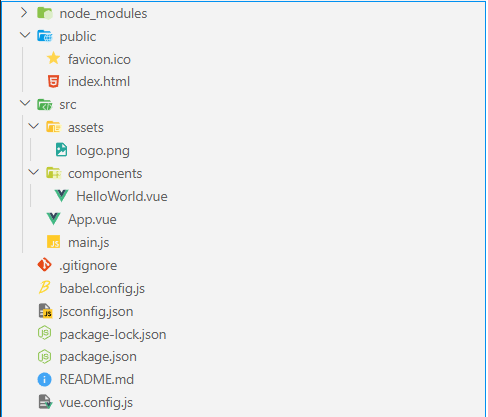

src\main.js

```js
// 引入的为一个名为createApp的工厂函数，不再是Vue构造函数（原本是import Vue  from 'vue'）
import { createApp } from 'vue'
import App from './App.vue'

// 创建应用实例对象，类似于Vue2中的vm，但是更“轻”，并挂载根标签
createApp(App).mount('#app')
```

src\App.vue

```html
<template>
  <!-- Vue3组件中的模板结构可以没有根标签 -->
  
  <HelloWorld msg="Welcome to Your Vue.js App"/>
</template>
```

##  Vue3开发者工具的安装

可参考：[[Vue\]开发环境搭建](https://blog.csdn.net/m0_53022813/article/details/124612823)

# 常用的Composition API

##  初识setup

- setup是Vue3.0中一个新的配置项，值为一个函数。setup是所有Composition API（组合API）“ 表演的舞台 ”。组件中所用到的：数据、方法、计算属性等等，均要配置在setup中。

- setup函数的两种返回值：

  - 若返回一个对象，则对象中的属性、方法, 在模板中均可以直接使用。（常用）

    ```html
    <template>
      <h1>个人介绍</h1>
      <h2>name: {{name}}</h2>
      <h2>age: {{age}}</h2>
      <button @click="sayHello">打招呼</button>
    </template>
    
    <script>
    export default {
      name: 'App',
      // 测试setup, 不考虑响应式
      setup() {
        // 数据
        let name = 'ZS'
        let age = 22
    
        // 方法
        function sayHello() {
          alert(`my name is ${name}, I am ${age}, hello`)
        }
    
        // 返回一个对象
        return {
          name,
          age,
          sayHello
        }
      }
    }
    </script>
    ```

    

  - 若返回一个渲染函数：则可以自定义渲染内容。（不常用）

    ```html
    <template>
      <h1>个人介绍</h1>
      <h2>name: {{name}}</h2>
      <h2>age: {{age}}</h2>
      <button @click="sayHello">打招呼</button>
    </template>
    
    <script>
    import {h} from 'vue' // 导入渲染函数
    
    export default {
      name: 'App',
      // 测试setup, 不考虑响应式
      setup() {
        // 数据
        let name = 'ZS'
        let age = 22
    
        // 方法
        function sayHello() {
          alert(`my name is ${name}, I am ${age}, hello`)
        }
    
        // 返回一个对象
        // return {
        //   name,
        //   age,
        //   sayHello
        // }
    
        // 返回一个函数(渲染函数)
        // h1为渲染到页面的标签，hello world为渲染内容
        // h1为渲染到页面的标签，hello world为渲染内容
        return ()=>{ return h('h1', 'hello world') }
      }
    }
    </script>
    ```

    

- 在Vue3中仍然可以使用Vue2的配置项

  ```html
  <template>
    <h1>个人介绍</h1>
    <h2>name: {{name}}</h2>
    <h2>age: {{age}}</h2>
    <h2>sex: {{sex}}</h2>
    <button @click="sayHello">打招呼 vue3</button>
    <button @click="sayWelcome">打招呼 vue2</button>
  </template>
  
  <script>
  export default {
    name: 'App',
    data() {
      return {
        sex: 'male'
      }
    },
    methods: {
      sayWelcome() {
        alert('hello world vue2')
      }
    },
    // 测试setup, 不考虑响应式
    setup() {
      // 数据
      let name = 'ZS'
      let age = 22
      // 方法
      function sayHello() {
        alert(`my name is ${name}, I am ${age}, hello`)
      }
      // 返回一个对象
      return {
        name,
        age,
        sayHello
      }
    }
  }
  </script>
  ```

  

- **setup尽量不要与Vue2.x配置混用**。Vue2.x配置（data、methos、computed…）中可以访问到setup中的属性、方法。但在setup中不能访问到Vue2.x配置（data、methos、computed…）。

  ```html
  <template>
    <h1>个人介绍</h1>
    <h2>name: {{name}}</h2>
    <h2>age: {{age}}</h2>
    <h2>sex: {{sex}}</h2>
    <button @click="sayHello">打招呼 vue3</button>
    <button @click="sayWelcome">打招呼 vue2</button>
    <button @click="test1">vue2配置项读取setup属性方法</button>
    <button @click="test2">setup配置项读取vue2配置项属性方法</button>
  </template>
  
  <script>
  export default {
    name: 'App',
    data() {
      return {
        sex: 'male'
      }
    },
    methods: {
      sayWelcome() {
        alert('hello world vue2')
      },
      test1() {
        console.log(this.name)
        console.log(this.age)
        console.log(this.sayHello)
      }
    },
    // 测试setup, 不考虑响应式
    setup() {
      // 数据
      let name = 'ZS'
      let age = 22
      // 方法
      function sayHello() {
        alert(`my name is ${name}, I am ${age}, hello`)
      }
      function test2() {
        console.log(this.sex)
        console.log(this.sayWelcome)
      }
      // 返回一个对象
      return {
        name,
        age,
        sayHello,
        test2,
      }
    }
  }
  </script>
  ```

  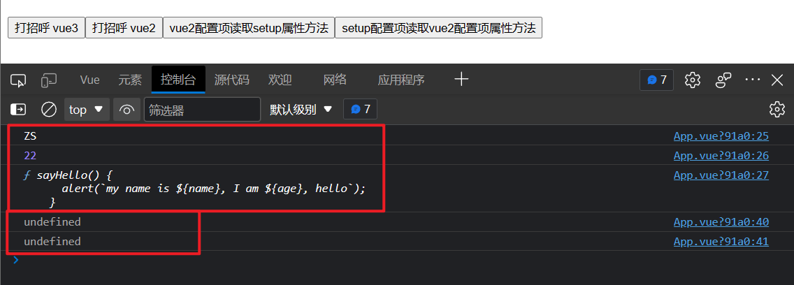

- Vue2配置项如果与setup中的属性或方法冲突，setup优先。即发生冲突时，以Vue3为主。

  ```html
  <template>
    <h1>a: {{a}}</h1>
  </template>
  
  <script>
  export default {
    name: 'App',
    data() {
      return {
        a: 100
      }
    },
    // 测试setup, 不考虑响应式
    setup() {
      // 数据
      let a = 200
      // 返回一个对象
      return {
        a
      }
    }
  }
  </script>
  ```

  

- setup不能是一个async函数，因为返回值不再是return的对象, 而是promise, 模板看不到return对象中的属性。（后期也可以返回一个Promise实例，但需要Suspense和异步组件的配合）

##  ref 函数

- 作用: 定义一个响应式的数据

- 语法:

   

  ```
  const xxx = ref(initValue)
  ```

  - 创建一个包含响应式数据的**引用对象（reference对象，简称ref对象）**。
  - JS中操作数据： `xxx.value`
  - 模板中读取数据: 不需要.value，直接：`<div>{{xxx}}</div>`

- 备注：

  - 接收的数据可以是：基本类型、也可以是对象类型。
  - 基本类型的数据：响应式依然是靠`Object.defineProperty()`的`get`与`set`完成的。
  - 对象类型的数据：内部 *“ 求助 ”* 了Vue3.0中的一个新函数—— `reactive`函数。

```html
<template>
  <h1>个人信息</h1>
  <p>name: {{name}}</p>
  <p>age: {{age}}</p>
  <p>job: {{job.type}}</p>
  <p>salary: {{job.salary}}</p>
  <button @click="changeInfo">修改信息</button>
</template>

<script>
import {ref} from 'vue'

export default {
  name: 'App',
  setup() {
    // 数据
    let name = ref('ZS')
    let age = ref(22)
    let job = ref({
      type: '前端工程师',
      salary: '30k'
    })

    // 方法
    function changeInfo() {
      name.value = 'LS'
      age.value = 30
      job.value.type = 'Java开发工程师'
      job.value.salary = '40k'
    }

    // 返回一个对象
    return {
      name,
      age,
      job,
      changeInfo
    }
  }
}
</script>
```


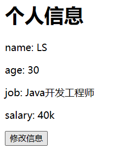

##  reactive函数

- 作用: 定义一个**对象类型**的响应式数据（基本类型不要用它，要用`ref`函数）
- 语法：`const 代理对象= reactive(源对象)`接收一个对象（或数组），返回一个**代理对象（Proxy的实例对象，简称proxy对象）**
- reactive定义的响应式数据是“深层次的”。
- 内部基于 ES6 的 Proxy 实现，通过代理对象操作源对象内部数据进行操作。

```html
<template>
  <h1>个人信息</h1>
  <p>name: {{name}}</p>
  <p>age: {{age}}</p>
  <p>job: {{job.type}}</p>
  <p>salary: {{job.salary}}</p>
  <p>hobby: {{hobby}}</p>
  <p>测试数据：{{job.a.b.c}}</p>
  <button @click="changeInfo">修改信息</button>
</template>

<script>
import {ref, reactive} from 'vue'

export default {
  name: 'App',
  setup() {
    // 数据
    let name = ref('ZS')
    let age = ref(22)
    let job = reactive({
      type: '前端工程师',
      salary: '30k',
      a: {
        b: {
          c: 1000
        }
      }
    })
    let hobby = reactive(['football', 'basketball'])

    // 方法
    function changeInfo() {
      name.value = 'LS'
      age.value = 30
      job.type = 'Java开发工程师'
      job.salary = '40k'
      job.a.b.c = 2000
      hobby[0] = 'reading'
    }

    // 返回一个对象
    return {
      name,
      age,
      job,
      hobby,
      changeInfo
    }
  }
}
</script>
```


## Vue3.0中的响应式原理

###  vue2.x的响应式

- 实现原理：

  - 对象类型：通过`Object.defineProperty()`对属性的读取、修改进行拦截（数据劫持）。

  - 数组类型：通过重写更新数组的一系列方法来实现拦截。（对数组的变更方法进行了包裹）。

    ```js
    Object.defineProperty(data, 'count', {
        get () {}, 
        set () {}
    })
    ```

- 存在问题：

  - 新增属性、删除属性, 界面不会更新。
    - 使用`this.$set(对象, '新属性名', '新属性值')`或`Vue.set(对象, '新属性名', '新属性值')`新增属性，使用`this.$delete(对象, '属性名')`或`Vue.$delete(对象, '属性名')`删除属性。
  - 直接通过下标修改数组, 界面不会自动更新。
    - 使用`this.$set(数组, 数组下标, ‘新值’)`或`数组.splice(下标, 下标+1, ‘新值’)`实现修改数组元素值。

###  Vue3.0的响应式

- 在Vue3中不存在“新增属性、删除属性时, 界面不会更新”与“直接通过下标修改数组, 界面不会自动更新”的问题。

  ```html
  <template>
    <h1>个人信息</h1>
    <p v-show="person.name">name: {{person.name}}</p>
    <p>age: {{person.age}}</p>
    <p v-show="person.sex">sex: {{person.sex}}</p>
    <p>hobby: {{person.hobby}}</p>
    <button @click="changeInfo">changeInfo</button>
    <button @click="addSex">addSex</button>
    <button @click="deleteName">deleteName</button>
  </template>
  
  <script>
  import {ref, reactive} from 'vue'
  
  export default {
    name: 'App',
    setup() {
      // 数据
      const person = reactive({
        name: 'ZS',
        age: 22,
        hobby: ['apple', 'orange']
      })
  
      // 方法
      function changeInfo() {
        person.hobby[0] = 'mango'
      }
      function addSex() {
        person.sex = 'male'
      }
      function deleteName() {
        delete person.name
      }
  
      // 返回一个对象
      return {
        person,
        changeInfo,
        addSex,
        deleteName,
      }
    }
  }
  </script>
  ```

  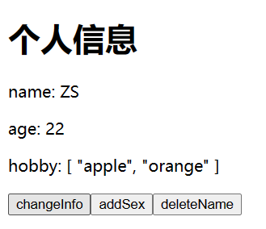
  

- 实现原理:

  - 通过Reflect（反射）: 对源对象的属性进行操作。

    ```js
    // Reflect（反射）
    // 读取对象指定属性的值
    Reflect.get(object, '属性名')
    // 修改对象指定属性的值
    Reflect.set(object, '属性名', '新属性值')
    // 删除对象指定属性
    Reflect.deleteProperty(object, '属性名')
    ```

    ```js
    //模拟Vue3中实现响应式
    //Proxy对属性的增删改查都可以监测得到
    //通过Reflect（反射）: 对源对象的属性进行操作。
    //#region 
    const p = new Proxy(person,{
    	//有人读取p的某个属性时调用
    	get(target,propName){
    		console.log(`有人读取了p身上的${propName}属性`)
    		return Reflect.get(target,propName)
    	},
    	//有人修改p的某个属性、或给p追加某个属性时调用
    	set(target,propName,value){
    		console.log(`有人修改了p身上的${propName}属性，我要去更新界面了！`)
    		Reflect.set(target,propName,value)
    	},
    	//有人删除p的某个属性时调用
    	deleteProperty(target,propName){
    		console.log(`有人删除了p身上的${propName}属性，我要去更新界面了！`)
    		return Reflect.deleteProperty(target,propName)
    	}
    })
    //#endregion
    ```

  - MDN文档中描述的Proxy与Reflect：

    - Proxy：https://developer.mozilla.org/zh-CN/docs/Web/JavaScript/Reference/Global_Objects/Proxy

    - Reflect：https://developer.mozilla.org/zh-CN/docs/Web/JavaScript/Reference/Global_Objects/Reflect

      ```js
      new Proxy(data, {
      	// 拦截读取属性值
          get (target, prop) {
          	return Reflect.get(target, prop)
          },
          // 拦截设置属性值或添加新属性
          set (target, prop, value) {
          	return Reflect.set(target, prop, value)
          },
          // 拦截删除属性
          deleteProperty (target, prop) {
          	return Reflect.deleteProperty(target, prop)
          }
      })
      
      proxy.name = 'tom'   
      ```

##  reactive对比ref

- 从定义数据角度对比：
  - ref用来定义：**基本类型数据**。
  - reactive用来定义：**对象（或数组）类型数据**。
  - 备注：ref也可以用来定义**对象（或数组）类型数据**, 它内部会自动通过`reactive`转为**代理对象**。
- 从原理角度对比：
  - ref通过`Object.defineProperty()`的`get`与`set`来实现响应式（数据劫持）。
  - reactive通过使用**Proxy**来实现响应式（数据劫持）, 并通过**Reflect**操作**源对象**内部的数据。
- 从使用角度对比：
  - ref定义的数据：操作数据**需要**`.value`，读取数据时模板中直接读取**不需要**`.value`。
  - reactive定义的数据：操作数据与读取数据：**均不需要**`.value`。
- 一般将数据封装在一个data对象中，利用reactive函数将该对象变为响应式数据对象

##  setup的两个注意点

- setup执行的时机
  - 在beforeCreate之前执行一次，this是undefined，在setup无法使用this。
- setup的参数
  - props：值为对象，包含：组件外部传递过来，且组件内部声明接收了的属性。
  - context：上下文对象
    - attrs: 值为对象，包含：组件外部传递过来，但没有在props配置中声明接收的属性, 相当于 `this.$attrs`。存放没有被组件props配置项接收的数据，如果组件外部传递过来的数据都被组件props配置项接收，则该对象为空。
    - slots: 收到的插槽内容, 相当于 `this.$slots`。Vue3中具名插槽使用`v-slot:插槽名`
    - emit: 分发自定义事件的函数, 相当于 `this.$emit`。Vue3绑定的自定义事件在组件中需要使用emits配置项接收。

App.vue

```html
<template>
	<Demo @hello="showHelloMsg" msg="你好啊" school="尚硅谷">
		<!-- Vue3中具名插槽使用 `v-slot:插槽名` -->
		<template v-slot:qwe>
			<span>尚硅谷</span>
		</template>
		<template v-slot:asd>
			<span>尚硅谷</span>
		</template>
	</Demo>
</template>

<script>
	import Demo from './components/Demo'
	export default {
		name: 'App',
		components:{Demo},
		setup(){
			// 自定义事件的处理函数
			function showHelloMsg(value){
				alert(`你好啊，你触发了hello事件，我收到的参数是:${value}！`)
			}
			return {
				showHelloMsg
			}
		}
	}
</script>
```

Demo.vue

```html
<template>
	<h1>一个人的信息</h1>
	<h2>姓名：{{person.name}}</h2>
	<h2>年龄：{{person.age}}</h2>
	<button @click="test">测试触发一下Demo组件的Hello事件</button>
</template>

<script>
	import {reactive} from 'vue'
	export default {
		name: 'Demo',
		props:['msg','school'],
		emits:['hello'], // 绑定的自定义事件在组件中需要使用emits配置项接收
		setup(props,context){
			// console.log('---setup---',props)
			// console.log('---setup---',context)
			// console.log('---setup---',context.attrs) //相当与Vue2中的$attrs
			// console.log('---setup---',context.emit) //触发自定义事件的。
			console.log('---setup---',context.slots) //插槽
			//数据
			let person = reactive({
				name:'张三',
				age:18
			})

			//方法
			function test(){
				// 触发自定义事件
				context.emit('hello',666)
			}

			//返回一个对象（常用）
			return {
				person,
				test
			}
		}
	}
</script>
```


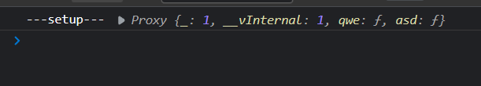

##  computed函数

- 与Vue2.x中computed配置功能一致，在Vue3中可以使用Vue2中的写法(向下兼容)。在Vue3中计算属性使用computed函数。

- 写法

  ```js
  import {computed} from 'vue'
  
  setup(){
      ...
  	//计算属性——简写
      let fullName = computed(()=>{
          return person.firstName + '-' + person.lastName
      })
      //计算属性——完整
      let fullName = computed({
          get(){
              return person.firstName + '-' + person.lastName
          },
          set(value){
              const nameArr = value.split('-')
              person.firstName = nameArr[0]
              person.lastName = nameArr[1]
          }
      })
  }
  ```

```html
<template>
	<h1>一个人的信息</h1>
    姓: <input type="text" v-model="person.firstName"><br/>
    名: <input type="text" v-model="person.lastName"><br/>
    <p>全名: {{person.fullName}}</p>
</template>

<script>
	import {reactive, computed} from 'vue'
	export default {
		name: 'Demo',
		setup(){
			//数据
			let person = reactive({
				firstName: '张',
        		lastName: '三'
			})

	      // 计算属性
	      person.fullName = computed(()=>{
	        return person.firstName + '-' + person.lastName
	      })

        //返回一个对象
        return {
            person,
        }
     }
	}
</script>
```


##  watch函数

- 与Vue2.x中watch配置功能一致，在Vue3中可以使用Vue2中的写法(向下兼容)。
- 两个小“坑”：
  - 监视reactive定义的响应式数据时：oldValue无法正确获取、强制开启了深度监视（deep配置失效）。
  - 监视reactive定义的响应式数据中某个属性时：deep配置有效。

```js
	//数据
 let sum = ref(0)
   let msg = ref('你好啊')
   let person = reactive({
   	name:'张三',
   	age:18,
   	job:{
   		j1:{
   			salary:20
   		}
   	}
   })

//情况一：监视ref定义的响应式数据
// 第一个参数为监视的数据，第二个参数为回调函数，第三个参数为配置属性
watch(sum,(newValue,oldValue)=>{
	console.log('sum变化了',newValue,oldValue)
},{immediate:true})

//情况二：监视多个ref定义的响应式数据	
// newValue,oldValue为数组类型数据
watch([sum,msg],(newValue,oldValue)=>{
	console.log('sum或msg变化了',newValue,oldValue)
}) 

/* 情况三：监视reactive定义的响应式数据
			若watch监视的是reactive定义的响应式数据，则无法正确获得oldValue！！
			如果需要获取监视对象中某个属性的oldValue，可以采用将该属性单独取出使用ref的形式
			若watch监视的是reactive定义的响应式数据，则强制开启了深度监视 
*/
// 如果监视的对象为使用ref函数实现响应式，则需要监视`变量.value`，对于对象类型数据ref借助了reactive
watch(person,(newValue,oldValue)=>{
	console.log('person变化了',newValue,oldValue)
},{immediate:true,deep:false}) //此处的deep配置不再奏效

//情况四：监视reactive定义的响应式数据中的某个属性
watch(()=>person.job,(newValue,oldValue)=>{
	console.log('person的job变化了',newValue,oldValue)
},{immediate:true,deep:true}) 

//情况五：监视reactive定义的响应式数据中的某些属性
watch([()=>person.job,()=>person.name],(newValue,oldValue)=>{
	console.log('person的job变化了',newValue,oldValue)
},{immediate:true,deep:true})

//特殊情况
// 监视reactive所定义的对象中的某个属性，且该属性也为对象类型
watch(()=>person.job,(newValue,oldValue)=>{
    console.log('person的job变化了',newValue,oldValue)
},{deep:true}) //此处由于监视的是reactive所定义的对象中的某个属性，所以deep配置有效
```

- 对于使用ref函数定义的数据，
  如果为基本数据类型，则使用watch监视时，不使用  `变量.value` 的形式，因为不能监视一个字面量，监视的需要为一个存放数据的结构；
  如果为对象类型，此时value的值为Proxy对象，如果没有开启深度监视，只要value对应的对象的引用没有改变相当于值没有修改，解决方法：
  1. 开启深度监视，监视Proxy对象中属性的变化
  2. 监视`变量.value`，由于Proxy对象时ref函数借助reactive函数生成的，监视`变量.value`相当于监视reactive函数生成的Proxy对象

##  watchEffect函数

- watch的套路是：既要指明监视的属性，也要指明监视的回调。

- watchEffect的套路是：不用指明监视哪个属性，监视的回调中用到哪个属性，那就监视哪个属性。

- watchEffect有点像computed：

  - 两个函数中所依赖的数据发生变化，都会重新执行一次回调。
  - 但computed注重的计算出来的值（回调函数的返回值），所以必须要写返回值。
  - 而watchEffect更注重的是过程（回调函数的函数体），所以不用写返回值。

  ```js
  //watchEffect所指定的回调中用到的数据只要发生变化，则直接重新执行回调。
  watchEffect(()=>{
      const x1 = sum.value	
      const x2 = person.age
      console.log('watchEffect配置的回调执行了')
  })
  ```

> 使用时注意事项：
>
> - watchEffect中的回调函数会在挂载时立即执行一次。因次要小心和onMounted一起使用，导致回调函数被调用两次。
> - watchEffect的回调函数在挂载时立即执行的机制 相当于watch函数加上immediate：true的配置。

##  生命周期

下面是Vue3实例生命周期的图表


- Vue3.0中可以继续使用Vue2.x中的生命周期钩子，但有有两个被更名：

  - `beforeDestroy`改名为 `beforeUnmount`

  - `destroyed`改名为 `unmounted`

    App.vue

    ```html
    <template>
    	<button @click="isShowDemo = !isShowDemo">切换隐藏/显示</button>
    	<Demo v-if="isShowDemo"/>
    </template>
    
    <script>
    	import {ref} from 'vue'
    	import Demo from './components/Demo'
    	export default {
    		name: 'App',
    		components:{Demo},
    		setup() {
    			let isShowDemo = ref(true)
    			return {isShowDemo}
    		}
    	}
    </script>
    ```

    Demo.vue

    ```html
    <template>
      <h2>当前求和为：{{sum}}</h2>
      <button @click="sum++">点我+1</button>
    </template>
    
    <script>
    import { ref } from 'vue'
    export default {
      name: 'Demo',
      setup() {
        //数据
        let sum = ref(0)
    
        //返回一个对象（常用）
        return { sum }
      },
      //通过配置项的形式使用生命周期钩子
      //#region
      beforeCreate() {
        console.log('---beforeCreate---')
      },
      created() {
        console.log('---created---')
      },
      beforeMount() {
        console.log('---beforeMount---')
      },
      mounted() {
        console.log('---mounted---')
      },
      beforeUpdate() {
        console.log('---beforeUpdate---')
      },
      updated() {
        console.log('---updated---')
      },
      beforeUnmount() {
        console.log('---beforeUnmount---')
      },
      unmounted() {
        console.log('---unmounted---')
      }
      //#endregion
    }
    </script>
    ```

    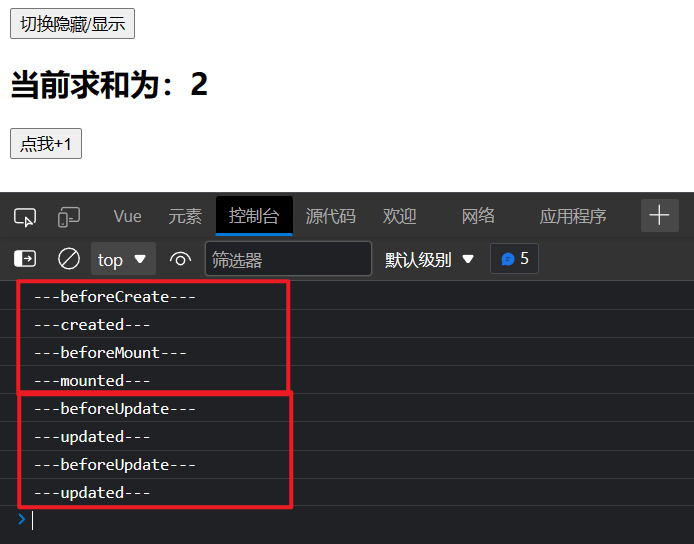
    

- Vue3.0也提供了 Composition API 形式的生命周期钩子，与Vue2.x中钩子对应关系如下：

  - `beforeCreate`===>`setup()`

  - `created`== = ===>`setup()`

  - `beforeCreate`与`created`没有对应组合式API，`setup()`相当于`beforeCreate`与`created`，对于配置项`setup()`的执行时机早于配置项`beforeCreate`与`created`。

  - `beforeMount` ===>`onBeforeMount`

  - `mounted` == === ==>`onMounted`

  - `beforeUpdate`===>`onBeforeUpdate`

  - `updated` ==== = ==>`onUpdated`

  - `beforeUnmount` ==>`onBeforeUnmount`

  - `unmounted` == == =>`onUnmounted`

  - 如果组合式API的生命周期与配置项形式的生命周期一起写，组合式API的生命周期的执行时机优先于配置项形式的生命周期。

  - 一般情况下统一使用组合式API的生命周期，或者统一使用配置项形式的生命周期

    ```html
    <template>
    	<h2>当前求和为：{{sum}}</h2>
    	<button @click="sum++">点我+1</button>
    </template>
    
    <script>
    	import {ref,onBeforeMount,onMounted,onBeforeUpdate,onUpdated,onBeforeUnmount,onUnmounted} from 'vue'
    	export default {
    		name: 'Demo',
    		
    		setup(){
    			console.log('---setup---')
    			//数据
    			let sum = ref(0)
    
    			//通过组合式API的形式去使用生命周期钩子
    			onBeforeMount(()=>{
    				console.log('---onBeforeMount---')
    			})
    			onMounted(()=>{
    				console.log('---onMounted---')
    			})
    			onBeforeUpdate(()=>{
    				console.log('---onBeforeUpdate---')
    			})
    			onUpdated(()=>{
    				console.log('---onUpdated---')
    			})
    			onBeforeUnmount(()=>{
    				console.log('---onBeforeUnmount---')
    			})
    			onUnmounted(()=>{
    				console.log('---onUnmounted---')
    			})
    
    			//返回一个对象（常用）
    			return {sum}
    		},
    		//通过配置项的形式使用生命周期钩子
    		//#region 
    		beforeCreate() {
    			console.log('---beforeCreate---')
    		},
    		created() {
    			console.log('---created---')
    		},
    		beforeMount() {
    			console.log('---beforeMount---')
    		},
    		mounted() {
    			console.log('---mounted---')
    		},
    		beforeUpdate(){
    			console.log('---beforeUpdate---')
    		},
    		updated() {
    			console.log('---updated---')
    		},
    		beforeUnmount() {
    			console.log('---beforeUnmount---')
    		},
    		unmounted() {
    			console.log('---unmounted---')
    		},
    		//#endregion
    	}
    </script>
    ```

    
    

##  自定义hook函数

- 什么是hook？—— 本质是一个函数，把setup函数中使用的Composition API进行了封装。
- 类似于vue2.x中的mixin。
- 自定义hook的优势: 复用代码, 让setup中的逻辑更清楚易懂。

src\hooks\usePoint.js

```js
import {reactive,onMounted,onBeforeUnmount} from 'vue'

export default function() {
	//实现鼠标“打点”相关的数据
	let point = reactive({
		x:0,
		y:0
	})

	//实现鼠标“打点”相关的方法
	function savePoint(event){
		point.x = event.pageX
		point.y = event.pageY
		console.log(event.pageX,event.pageY)
	}

	//实现鼠标“打点”相关的生命周期钩子
	onMounted(()=>{
		window.addEventListener('click',savePoint)
	})

	onBeforeUnmount(()=>{
		window.removeEventListener('click',savePoint)
	})

	return point
}
```

Demo.vue

```html
<template>
	<h2>当前求和为：{{sum}}</h2>
	<button @click="sum++">点我+1</button>
	<hr>
	<h2>当前点击时鼠标的坐标为：x：{{point.x}}，y：{{point.y}}</h2>
</template>

<script>
	import {ref} from 'vue'
	import usePoint from '../hooks/usePoint'
	export default {
		name: 'Demo',
		setup(){
			//数据
			let sum = ref(0)
			let point = usePoint()
			

			//返回一个对象（常用）
			return {sum,point}
		}
	}
</script>
```

##  toRef

- 作用：创建一个 ref 对象，其value值指向另一个对象中的某个属性。
- 语法：`const name = toRef(person,'name')`
- 应用: 要将响应式对象中的某个属性单独提供给外部使用时。
- 扩展：`toRefs`与`toRef`功能一致，但可以批量创建多个 ref 对象，创建一个对象中所有属性对应的 ref 对象，语法：`toRefs(person)`

```html
<template>
	<h4>{{person}}</h4>
	<h2>姓名：{{name}}</h2>
	<h2>年龄：{{age}}</h2>
	<h2>薪资：{{job.j1.salary}}K</h2>
	<button @click="name+='~'">修改姓名</button>
	<button @click="age++">增长年龄</button>
	<button @click="job.j1.salary++">涨薪</button>
</template>

<script>
	import {ref,reactive,toRef,toRefs} from 'vue'
	export default {
		name: 'Demo',
		setup(){
			//数据
			let person = reactive({
				name:'张三',
				age:18,
				job:{
					j1:{
						salary:20
					}
				}
			})

			// const name1 = person.name
			// console.log('%%%',name1)

			// const name2 = toRef(person,'name')
			// console.log('####',name2)

			const x = toRefs(person)
			console.log('******',x)

			//返回一个对象（常用）
			return {
				person,
				// name:toRef(person,'name'),
				// age:toRef(person,'age'),
				// salary:toRef(person.job.j1,'salary'),
				...toRefs(person)
			}
		}
	}
</script>
```


# 其它Composition API

##  shallowReactive 与 shallowRef

- shallowReactive：只处理对象最外层属性的响应式（浅响应式）。
- shallowRef：只处理基本数据类型的响应式, 不进行对象的响应式处理，对于对象类型数据直接将该对象作为ref对象的value的值。
- 什么时候使用?
  - 如果有一个对象数据，结构比较深, 但变化时只是最外层属性变化 ===> shallowReactive。
  - 如果有一个对象数据，后续功能不会修改该对象中的属性，而是生成新的对象来替换，即对于该对象数据在后续功能中不会修改其属性，而是会将该对象整个进行替换 ===> shallowRef。

##  readonly 与 shallowReadonly

- readonly 与 shallowReadonly 均接收一个响应式数据为参数。
- readonly: 让一个响应式数据变为只读的（深只读），传入的响应式数据不管有几层，都不能进行修改。
- shallowReadonly：让一个响应式数据变为只读的（浅只读），传入的响应式数据只有最外层数据不能进行修改。
- 应用场景: 不希望数据被修改时。将数据交给其他组件并且不希望这个组件对数据进行更改。

##  toRaw 与 markRaw

- toRaw：
  - toRaw 接收一个响应式对象为参数，只能接收reactive生成的响应式对象，不能处理ref生成的响应式数据
  - 作用：将一个由`reactive`生成的**响应式对象**转为**普通对象**。
  - 使用场景：用于读取响应式对象对应的普通对象，对这个普通对象的所有操作，不会引起页面更新。
- markRaw：
  - 接收一个对象类型数据为参数
  - 作用：标记一个对象，使其永远不会再成为响应式对象。向一个已经是响应式对象的数据追加一个属性，该属性的值为对象类型数据，vue会为其自动添加响应式，当不希望该属性的值为响应式时可以使用该函数，减小开销。
  - 应用场景:
    1. 有些值不应被设置为响应式的，例如复杂的第三方类库等，如果向响应式对象追加一个第三方类库对象(一般属性多且层次多)，开销会很大。
    2. 当渲染具有不可变数据源的大列表时，跳过响应式转换可以提高性能。

##  customRef

- 作用：创建一个自定义的 ref，并对其依赖项跟踪和更新触发进行显式控制。
- 实现防抖效果：

```html
  <template>
  	<input type="text" v-model="keyword">
  	<h3>{{keyword}}</h3>
  </template>
  
  <script>
  	import {ref,customRef} from 'vue'
  	export default {
  		name:'Demo',
  		setup(){
  			// let keyword = ref('hello') //使用Vue准备好的内置ref
  			//自定义一个myRef
  			function myRef(value,delay){
  				let timer
  				//通过customRef去实现自定义
  				return customRef((track,trigger)=>{
  					return{
  						get(){ // 读取数据时调用
  							track() //告诉Vue这个value值是需要被“追踪”的，告诉vue追踪数据的变化
  							return value
  						},
  						set(newValue){ // 修改数据时调用
  							clearTimeout(timer) // 触发就清除原先的定时器不执行之前定时器的回调
  							timer = setTimeout(()=>{
  								value = newValue // 修改数据
  								trigger() //告诉Vue去更新界面，重新解析模板
  							},delay)
  						}
  					}
  				})
  			}
  			let keyword = myRef('hello',500) //使用程序员自定义的ref
  			return {
  				keyword
  			}
  		}
  	}
  </script>
```

##  provide 与 inject

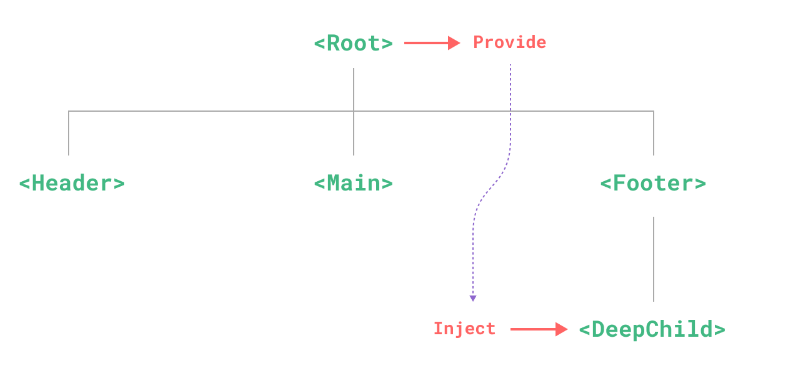

- 作用：实现**祖与后代组件间**通

- 套路：父组件有一个 `provide` 选项来提供数据，后代组件有一个 `inject` 选项来开始使用这些数据

> 注意点：
> 父组件也可以给子组件传递数据，不过父子组件间传递数据一般不用provide/inject，而用更简单的 props
> provide/inject的好处就是：如果用props传递数据，那么爷孙组件的数据就要从爷 -> 父 -> 孙这个顺序层层传递。
> provide/inject能直接从任何一个组件接收到祖组件的数据

- 具体写法：

  1. 祖组件中：

     ```js
     import {provide} from 'vue'
     
     setup(){
     	......
         let car = reactive({name:'奔驰',price:'40万'})
         // 给后代组件传递数据 
         // 第一个参数为对传递数据的命名，第二个参数为传递的数据
         provide('car',car)
         ......
     }
     ```

  2. 后代组件中：

     ```js
     import {inject} from 'vue'
     
     
     setup(props,context){
     	......
     	// 获取祖组件传递过来命名为car的数据
         const car = inject('car')
         return {car}
     	......
     }
     ```

##  响应式数据的判断

- isRef: 检查一个值是否为一个 ref 对象
- isReactive: 检查一个对象是否是由 `reactive` 创建的响应式代理
- isReadonly: 检查一个对象是否是由 `readonly` 创建的只读代理
- isProxy: 检查一个对象是否是由 `reactive` 或者 `readonly` 方法创建的代理


#  Composition API 的优势

##  Options API (配置式API / 选项式API)存在的问题

使用传统OptionsAPI中，新增或者修改一个需求，就需要分别在data，methods，computed里修改 。**同一个需求的数据、方法等较分散不集中。**


##  Composition API (组合式API)的优势

我们可以更加优雅的组织我们的代码，函数。让相关功能的代码更加有序的组织在一起。

> 想让组合式API发挥优势，必须借助hook函数

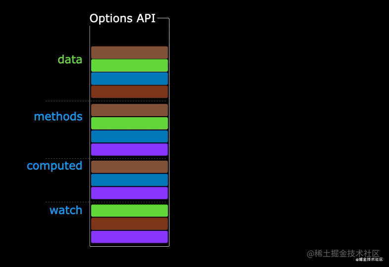


# 新的组件

##  Fragment

- 在Vue2中: 组件必须有一个根标签

- 在Vue3中: 组件可以没有根标签, 内部会将多个标签包含在一个Fragment虚拟元素中

- 好处: 减少标签层级, 减小内存占用

  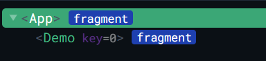

##  Teleport

- 什么是Teleport？—— `Teleport` 是一种能够将我们的**组件html结构**移动到指定位置的技术。

  ```html
  <!-- 移动位置可以标签元素或标签选择器 -->
  <teleport to="移动位置">
  	<div v-if="isShow" class="mask">
  		<div class="dialog">
  			<h3>我是一个弹窗</h3>
  			<button @click="isShow = false">关闭弹窗</button>
  		</div>
  	</div>
  </teleport>
  ```

```html
<template>
	<div>
		<button @click="isShow = true">点我弹个窗</button>
		<!-- 将html结构移动到body中 -->
		<teleport to="body">
			<div v-if="isShow" class="mask">
				<div class="dialog">
					<h3>我是一个弹窗</h3>
					<h4>一些内容</h4>
					<h4>一些内容</h4>
					<h4>一些内容</h4>
					<button @click="isShow = false">关闭弹窗</button>
				</div>
			</div>
		</teleport>
	</div>
</template>

<script>
	import {ref} from 'vue'
	export default {
		name:'Dialog',
		setup(){
			let isShow = ref(false)
			return {isShow}
		}
	}
</script>

<style>
	.mask{
		position: absolute;
		top: 0;bottom: 0;left: 0;right: 0;
		background-color: rgba(0, 0, 0, 0.5);
	}
	.dialog{
		position: absolute;
		top: 50%;
		left: 50%;
		transform: translate(-50%,-50%);
		text-align: center;
		width: 300px;
		height: 300px;
		background-color: green;
	}
</style>
```

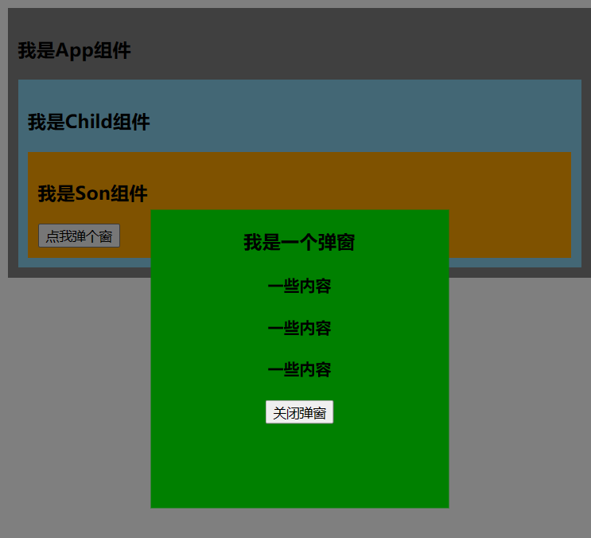

##  Suspense

```js
// 静态引入只要组件不引入成功，当前整个组件都不会进行显示
// import Child from './components/Child'//静态引入
// 异步引入引入的组件等加载完成再进行显示，当前组件可以不用等待引入成功即可先进行显示
import {defineAsyncComponent} from 'vue' 
const Child = defineAsyncComponent(()=>import('./components/Child')) //异步引入
```

- 当异步引入的组件引入完成，组件会突然显示，造成用户体验效果不佳

- Suspense 标签可以在等待异步组件时渲染一些额外内容，让应用有更好的用户体验

- 如果组件为异步引入且使用了Suspense，则组件的setup可以返回Promise实例对象，即当Suspense和异步组件配合时，setup可以是一个async函数。

- 使用步骤：

  - 异步引入组件

    ```js
    import {defineAsyncComponent} from 'vue'
    const Child = defineAsyncComponent(()=>import('./components/Child.vue'))
    ```

  - 使用`Suspense`包裹组件，并配置好`default`与 `fallback`

    ```html
    <template>
    	<div class="app">
    		<h3>我是App组件</h3>
    		<Suspense>
    		    <!-- 用于放置真正需要显示的组件 -->
    			<template v-slot:default>
    				<Child/>
    			</template>
    			<!-- 用于放置等待异步组件时渲染的内容 -->
    			<template v-slot:fallback>
    				<h3>加载中.....</h3>
    			</template>
    		</Suspense>
    	</div>
    </template>
    ```

# 其它

##  Vue3全局API的转移

- Vue 2.x 有许多全局 API 和配置。

  - 例如：注册全局组件、注册全局指令等。

    ```js
    //注册全局组件
    Vue.component('MyButton', {
      data: () => ({
        count: 0
      }),
      template: '<button @click="count++">Clicked {{ count }} times.</button>'
    })
    
    //注册全局指令
    Vue.directive('focus', {
      inserted: el => el.focus()
    }
    ```

- Vue3.0中对这些API做出了调整：

  - 将全局的API，即：`Vue.xxx`调整到应用实例（`app`）上

    | 2.x 全局 API（`Vue`）    | 3.x 实例 API (`app`)        |
    | ------------------------ | --------------------------- |
    | Vue.config.xxxx          | app.config.xxxx             |
    | Vue.config.productionTip | **移除**                    |
    | Vue.component            | app.component               |
    | Vue.directive            | app.directive               |
    | Vue.mixin                | app.mixin                   |
    | Vue.use                  | app.use                     |
    | Vue.prototype            | app.config.globalProperties |

##  Vue3其他改变

- data选项应始终被声明为一个函数。q

- 过度类名的更改：

  - Vue2.x写法

    ```properties
    .v-enter,
    .v-leave-to {
      opacity: 0;
    }
    .v-leave,
    .v-enter-to {
      opacity: 1;
    }
    ```

  - Vue3.x写法

    ```properties
    .v-enter-from,
    .v-leave-to {
      opacity: 0;
    }
    
    .v-leave-from,
    .v-enter-to {
      opacity: 1;
    }
    ```

- **移除**keyCode作为 v-on 的修饰符，同时也不再支持`config.keyCodes`，不支持自定义按键别名。

- **移除**`v-on.native`修饰符

  - 父组件中绑定事件

    ```html
    <my-component
      v-on:close="handleComponentEvent"
      v-on:click="handleNativeClickEvent"
    />
    ```

  - 子组件中声明自定义事件

    ```html
    <script>
      export default {
        emits: ['close'] // 子组件接收的事件为自定义事件，没有接收的事件为原生事件
      }
    </script>
    ```

- **移除**过滤器（filter）

  > 过滤器虽然这看起来很方便，但它需要一个自定义语法，打破大括号内表达式是 “只是 JavaScript” 的假设，这不仅有学习成本，而且有实现成本！建议用方法调用或计算属性去替换过滤器。

- …