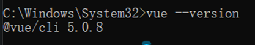
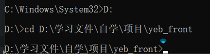
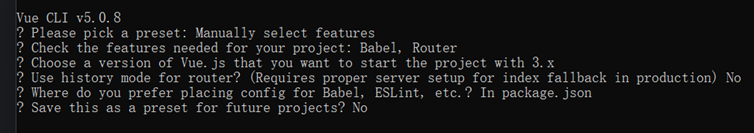
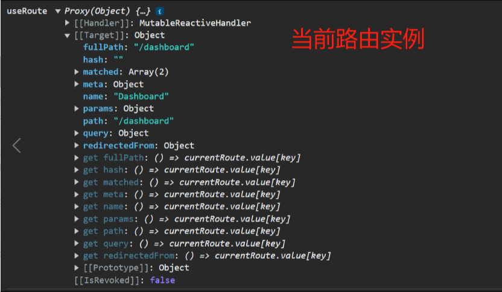
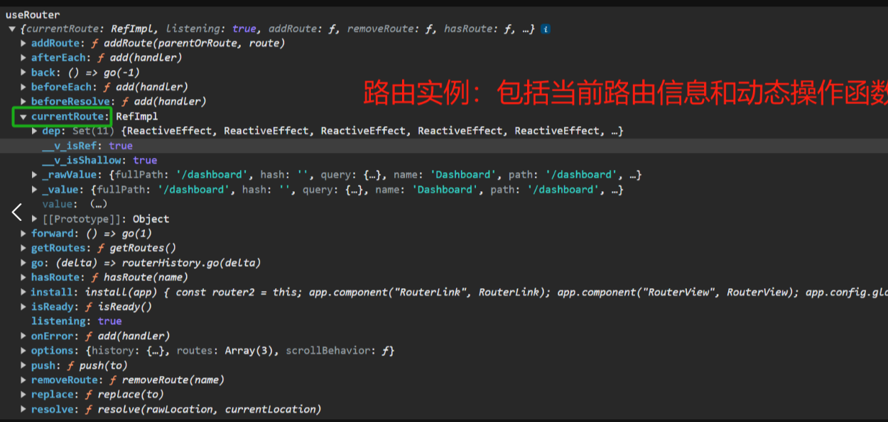

### 创建前端(Vue)项目过程


#### 查看Node.js版本的命令：

node -v 或 node –version

#### 创建vue前端项目过程

1. 安装Node.js(已安装，64位，新版本)
2. 通过 npm install -g @vue/cli安装新版本的vue cli，安装完成后使用vue –version查看是否安装成功，



3. 切换到工作目录



4. 在工作目录下输入 vue create yeb创建项目
5. 创建本项目过程中，所选择的设置



### useRoute 和 useRouter 的区别

#### 官方文档

https://router.vuejs.org/zh/api/#Functions-useRoute

#### useRoute 函数

`useRoute` 函数用于在组件中获取当前路由的信息，返回一个包含路由信息的对象。这个函数适用于那些不需要监听路由变化的场景，只是获取当前路由信息的静态数据。


**示例代码：**

```html
<template>
  <div>
    <!-- 当前路由信息展示 -->
    <h1>当前路由信息</h1>
    <p>路径：{{ route.path }}</p>
    <p>名称：{{ route.name }}</p>
    <!-- 其他路由信息 -->
  </div>
</template>

<script setup lang="ts">
import { useRoute } from 'vue-router';

// 使用 useRoute 函数获取当前路由信息
const route = useRoute();
</script>
```

在这个示例中，我们使用 `useRoute` 获取当前路由信息，并在模板中显示了一些路由属性，比如路径和名称。

#### useRouter 函数

`useRouter` 函数用于获取路由实例，可以通过它来进行一些动态的路由操作，比如跳转到新的路由。它返回一个包含路由实例的对象。其中包括`当前路由`信息。


**示例代码：**

```html
<template>
  <div>
    <!-- 路由操作 -->
    <h1>路由操作</h1>
    <button @click="navigateToHome">前往首页</button>
  </div>
</template>

<script setup lang="ts">
import { useRouter } from 'vue-router';

// 使用 useRouter 函数获取路由实例
const router = useRouter();

// 处理按钮点击事件，进行路由跳转到首页
const navigateToHome = () => {
  // 使用 router.push 进行路由跳转
  router.push('/');
};
</script>
```

在这个示例中，我们使用 `useRouter` 获取路由实例，并通过点击按钮触发 `navigateToHome `函数进行路由跳转。

#### useRoute 和 useRouter 区别

- `useRoute` 主要用于获取当前路由的信息，适用于静态展示当前路由信息的场景。
- `useRouter` 主要用于获取路由实例，适用于需要进行动态路由操作的场景，比如跳转到新的路由。

在一些场景中，我们可能需要同时使用这两个函数，例如在获取当前路由信息的同时，需要进行一些动态的路由操作。

**示例代码：**

```html
<template>
  <div>
    <!-- 显示当前路由信息 -->
    <h1>Current Route Information</h1>
    <p>Path: {{ route.path }}</p>
    <p>Name: {{ route.name }}</p>
    <!-- 其他路由信息 -->

    <!-- 跳转到 About 页面的按钮 -->
    <button @click="navigateToHome">前往首页</button>
  </div>
</template>

<script setup lang="ts">
import { useRoute, useRouter } from 'vue-router';

// 使用 useRoute 获取当前路由信息
const route = useRoute();

// 使用 useRouter 获取路由实例
const router = useRouter();

// 处理按钮点击事件，进行路由跳转
const navigateToHome= () => {
  // 使用 router.push 进行路由跳转
  router.push('/about');
};
</script>
```

在这个示例中，我们同时使用了 `useRoute` 获取当前路由信息和 `useRouter` 进行路由跳转。

#### 结语

总体而言，`useRoute` 和 `useRouter` 是 Vue Router 在 Composition API 中提供的两个重要的函数，它们分别用于获取当前路由信息和路由实例，为我们在组件中更方便地处理路由相关逻辑提供了强大的工具。