# 1.简介

## 1. 官网

1. 英文官网: https://vuejs.org/
2. 中文官网: https://cn.vuejs.org/

## 2. 介绍与描述

1. vue是一套用于动态构建用户界面的渐进式 JavaScript 框架
   渐进式：vue可以自底向上逐层的应用
   由一个个组件类似拼积木，逐层向上搭建，最后搭建出一个网页
2. 作者：尤雨溪

## 3. Vue的特点

### 3.1. 采用组件化模式，提高代码的复用率，让代码易于维护。

1. 组件化：
   将页面拆分成不同的部分，每个部分为一个组件，每个组件为一个单独的vue文件，每个vue文件的标签、样式、交互进行分开管理
2. 提高代码的复用率：当其他的页面也需要使用相同的组件时，直接引入写好的对应的组件即可
3. 代码易于维护：每个vue文件不同组件的标签、样式、交互进行单独管理，不会互相影响


### 3.2. 声明式编码，无需操作DOM，提高开发效率。

命令式编码：即一条命令实现对应的步骤，一个命令一个步骤
声明式编码：只需声明数据，然后将数据写入对应的标签位置即可

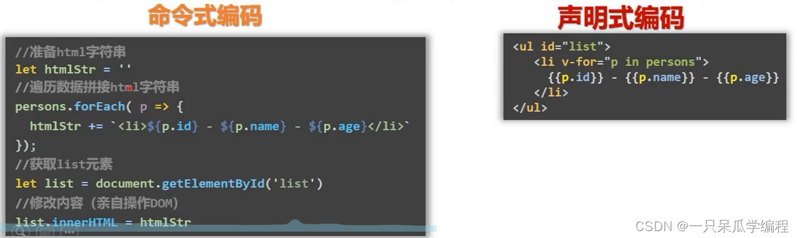

### 4. 使用虚拟DOM和Diff算法复用DOM

使用原生js将数据渲染到页面，当数据发生变化时，需要手动进行判断那些数据时新数据，重新进行渲染，或者将页面中的数据先进行删除再重新渲染改变后的数据。


vue会先把数据放到虚拟DOM中，再渲染到页面，当数据发生变化vue会使用Diff算法将新的虚拟DOM与旧虚拟DOM进行比较，数据没有变化的DOM继续复用即不发生改变，而新数据的DOM会将其渲染到页面对应的位置。

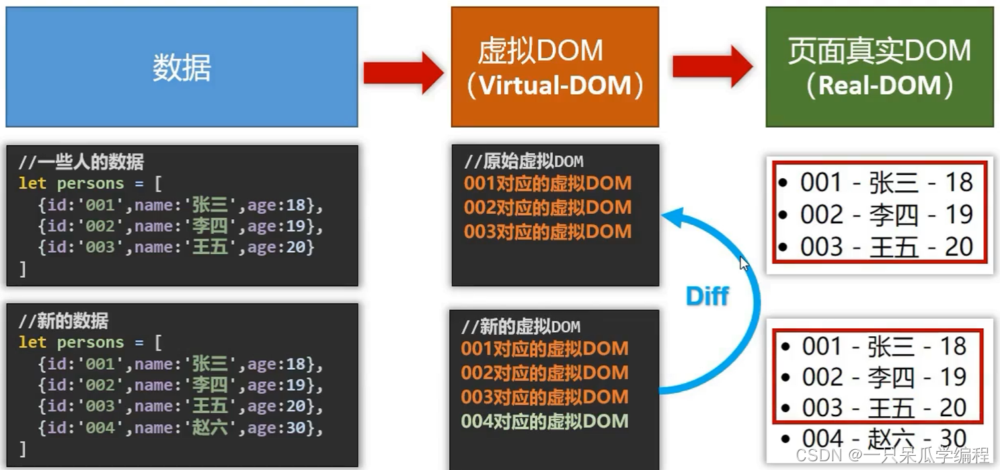

### 3.4. 遵循 MVVM 模式

MVVM是vue实现数据驱动视图和双向数据绑定的核心原理。
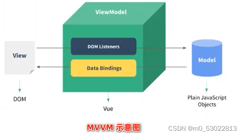
它把每个HTML页面拆分成三个部分：
**M**odel：当前页面渲染时所依赖的数据源。
**V**iew：当前页面所渲染的DOM结构。
**V**iew**M**odel：vue实例，MVVM的核心。

MVVM的工作原理：
ViewModel作为MVVM的核心，是它把当前页面的数据源(Model)和页面的结构(View)连接在了一起。


当数据源发生变化时，会被ViewModel监听到，VM会根据最新的数据源自动更新页面的结构。

当表单元素的值发生变化时，也会被VM监听到，VM会把变化过后最新的值自动同步到Model数据源中。

### 3.5. 编码简洁, 体积小, 运行效率高, 适合移动/PC端开发

### 3.6. 它本身只关注 UI, 也可以引入其它第三方库开发项目

1. vue-cli: vue 脚手架
2. vue-resource
3. axios
4. vue-router: 路由
5. vuex: 状态管理
6. element-ui: 基于 vue 的 UI 组件库(PC 端)
7. …

## 4. vue的特性

vue框架的特性主要体现在：

> 1.数据驱动视图
>
> > 使用vue的页面中，vue会监听数据的变化，自动重新渲染页面的结构(**数据驱动视图是单向的数据绑定**)
> > 
> > 数据发生变化，页面会自动重新渲染
>
> 2.双向数据绑定
>
> > 在填写表单时，双向数据绑定可以辅助开发者在不操作dom的前提下自动把用户填写的内容同步到数据源，开发者不用再手动操作dom
> > 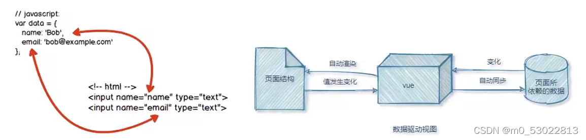

## 5. vue的版本

当前，vue 共有3个大版本，其中：

> 2.x版本的vue是目前企业级项目开发中的主流版本
> 3.x版本的vue 于 2020-09-19发布，生态还不完善，尚未在企业级项目开发中普及和推广
> 1.x版本的vue只乎被淘汰，不再建议学习与使用

vue3.x和vue2.x版本的对比：

> vue2.x中绝大多数的API与特性，在vue3.x中同样支持。同时，vue3.x中还新增了3.x所特有的功能、并废弃了某些2.x中的旧功能
>
> > 新增的功能例如:
> > 组合式API、多根节点组件、更好的 TypeScript支持等
>
> > 废弃的旧功能如下:
> > 过滤器、不再支持$on，$off和$once 实例方法等
>
> [详细的变更信息，请参考官方文档给出的迁移指南](https://v3.vuejs.org/guide/ migration/introduction.html)

## 6. 学习Vue之前要掌握的JavaScript基础知识

1. ES6语法规范
2. ES6模块化
3. 包管理器(npm yarn …) 一个即可
4. 原型、原型链
5. 数组常用方法
6. axios
7. promise

# 2.官网导航栏使用简介

## 1. 学习板块

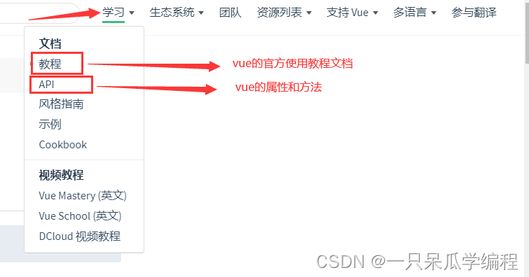


> 官方推荐代码编写技巧示例：
> 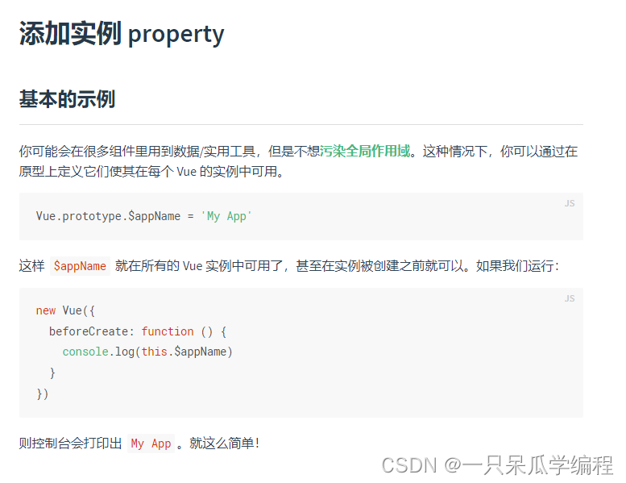

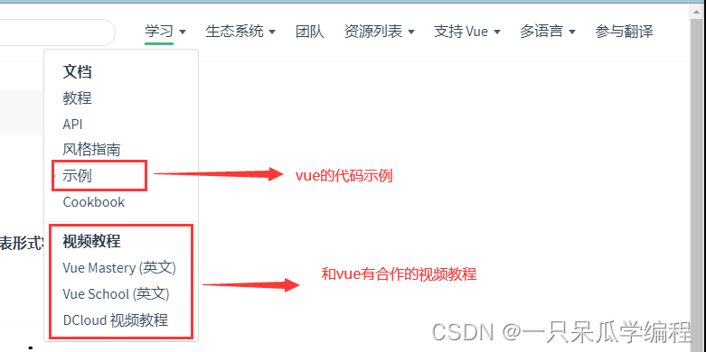

------

## 2. 生态系统板块


------

## 3. 资源列表板块

> vue官方推荐的一些好用的第三方包、组件库


# 3.开发环境搭建

## 1. Vue Devtools

直接在谷歌插件商店里可以搜到

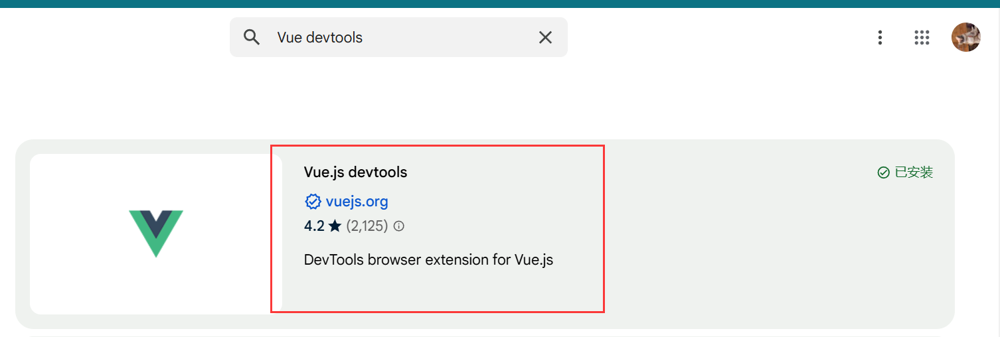

## 2. 下载并在页面引入 Vue

### 2.1 Vue的下载


> ps：后面会使用 vue-cli 或 vite（脚手架）直接构建 vue 项目，不用手动引入 vue。

> 下载的 vue 文件
> 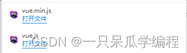
> 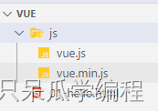

### 2.2 Vue的引入

```html
<!DOCTYPE html>
<html lang="en">
<head>
  <meta charset="UTF-8">
  <meta http-equiv="X-UA-Compatible" content="IE=edge">
  <meta name="viewport" content="width=device-width, initial-scale=1.0">
  <title>Document</title>
</head>
<body>
  
  <!-- 引入下载的 vue -->
  <!-- <script src="./js/vue.js"></script> -->
  <!-- 使用CDN引入 -->
  <script src="https://cdn.jsdelivr.net/npm/vue@2.6.14/dist/vue.js"></script>
</body>
</html>
```

### 2.3 页面控制台警告提示解决

> 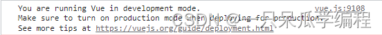


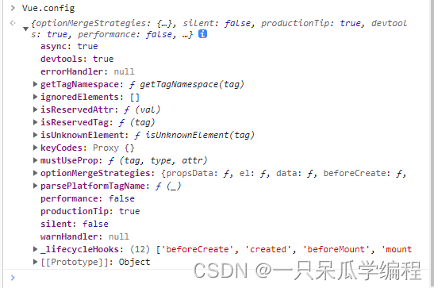

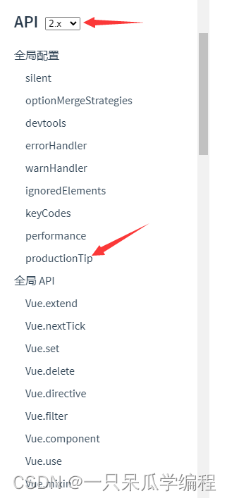

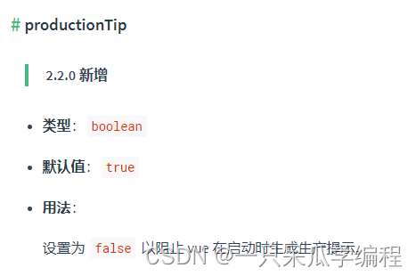

```html
<!DOCTYPE html>
<html lang="en">
<head>
  <meta charset="UTF-8">
  <meta http-equiv="X-UA-Compatible" content="IE=edge">
  <meta name="viewport" content="width=device-width, initial-scale=1.0">
  <title>Document</title>
</head>
<body>
  
  
  <!-- 引入下载的 vue -->
  <script src="./js/vue.js"></script>
  <!-- 使用CDN引入 -->
  <!-- <script src="https://cdn.jsdelivr.net/npm/vue@2.6.14/dist/vue.js"></script> -->
  <script>
    Vue.config.productionTip = false
  </script>
</body>
</html>
```


# 4.初始Vue--HelloWorld引入案例

------

## 1. Hello World 引入案例

1. 准备好一个 Vue 要控制的容器区域
2. 创建一个 Vue 实例对象
3. 选择 Vue 实例对象要控制的容器

```html
<!DOCTYPE html>
<html lang="en">
<head>
  <meta charset="UTF-8">
  <meta http-equiv="X-UA-Compatible" content="IE=edge">
  <meta name="viewport" content="width=device-width, initial-scale=1.0">
  <title>Document</title>
</head>
<body>
  <!-- 准备好一个 Vue 要控制的容器区域 -->
  <div id="app">
    <h1>Hello World</h1>
  </div>
  
  <!-- 引入下载的 vue -->
  <script src="./js/vue.js"></script>
  <!-- 使用CDN引入 -->
  <!-- <script src="https://cdn.jsdelivr.net/npm/vue@2.6.14/dist/vue.js"></script> -->
  <script>
    // 设置为 false 以阻止 vue 在启动时生成生产提示。
    Vue.config.productionTip = false

    // 创建一个 Vue 实例对象
    // Vue 构造函数中传入的参数为配置对象
    const app = new Vue( {
      // element -- el Vue实例对象要控制的容器
      // el 的值为 css 选择器( id 选择器 / 类选择器 )
      // 填入 js 的选择标签对象的方法也行
      // el: document.getElementById('app')
      // 一般写 css 选择器, 简单
      el: '#app'
    } )
  </script>
</body>
</html>
```


## 2. Vue 对页面数据的控制

1. 准备好 data 用于存放页面的数据
2. 将数据放入页面中使用插值表达式(后面会介绍)即 ‘{{ 对应数据的key }}’

```html
<!DOCTYPE html>
<html lang="en">
<head>
  <meta charset="UTF-8">
  <meta http-equiv="X-UA-Compatible" content="IE=edge">
  <meta name="viewport" content="width=device-width, initial-scale=1.0">
  <title>Document</title>
</head>
<body>
  <!-- 准备好一个 Vue 要控制的容器区域 -->
  <div id="app">
    <h1>Hello World</h1>
    <!-- 将数据放入页面中使用插值表达式即‘{{ 对应数据的key }}’ -->
    <h1>Hello {{ name }}</h1>
  </div>
  
  <!-- 引入下载的 vue -->
  <script src="./js/vue.js"></script>
  <!-- 使用CDN引入 -->
  <!-- <script src="https://cdn.jsdelivr.net/npm/vue@2.6.14/dist/vue.js"></script> -->
  <script>
    // 设置为 false 以阻止 vue 在启动时生成生产提示。
    Vue.config.productionTip = false

    // 创建一个 Vue 实例对象
    // Vue 构造函数中传入的参数为配置对象
    const app = new Vue( {
      // element -- el Vue实例对象要控制的容器
      // el 的值为 css 选择器( id 选择器 / 类选择器 )
      // 填入 js 的选择标签对象的方法也行
      // el: document.getElementById('app')
      // 一般写 css 选择器, 简单
      el: '#app',
      // data 用于存放页面的数据
      // data 中的数据供 el 所指向的容器使用
      // data 的值先写为对象(后面会写为函数, 后面会介绍)
      data: {
        // 数据为键值对
        name: '张三'
      }
    } ) 
  </script>
</body>
</html>
```


## 3. Vue 实例对象与对应控制区域的对应关系

### 3.1 一个 Vue 实例对象能否控制多个区域(容器)

```html
<!DOCTYPE html>
<html lang="en">
<head>
  <meta charset="UTF-8">
  <meta http-equiv="X-UA-Compatible" content="IE=edge">
  <meta name="viewport" content="width=device-width, initial-scale=1.0">
  <title>Document</title>
</head>
<body>
  <!-- 准备好一个 Vue 要控制的容器区域 -->
  <div class="app">
    <h1>Hello World -- 1</h1>
    <!-- 将数据放入页面中使用插值表达式即‘{{ 对应数据的key }}’ -->
    <h1>Hello {{ name }}</h1>
  </div>
  <br>
  <div class="app">
    <h1>Hello World -- 2</h1>
    <!-- 将数据放入页面中使用插值表达式即‘{{ 对应数据的key }}’ -->
    <h1>Hello {{ name }}</h1>
  </div>
  
  <!-- 引入下载的 vue -->
  <script src="./js/vue.js"></script>
  <script>
    // 设置为 false 以阻止 vue 在启动时生成生产提示。
    Vue.config.productionTip = false

    // 创建一个 Vue 实例对象
    const app = new Vue( {
      el: '.app',
      data: {
        name: '张三'
      }
    } ) 
  </script>
</body>
</html>
```

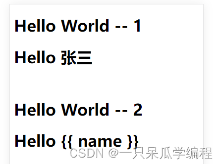

> 一个 Vue 实例对象只能控制一个区域，一个 Vue 实例对象只控制对应的第一个区域

### 3.2 一个容器能否由多个 Vue 实例控制

```html
<!DOCTYPE html>
<html lang="en">
<head>
  <meta charset="UTF-8">
  <meta http-equiv="X-UA-Compatible" content="IE=edge">
  <meta name="viewport" content="width=device-width, initial-scale=1.0">
  <title>Document</title>
</head>
<body>
  <!-- 准备好一个 Vue 要控制的容器区域 -->
  <div class="app">
    <h1>Hello World -- 1</h1>
    <h1>Hello {{ name }}</h1>
  </div>
  
  <!-- 引入下载的 vue -->
  <script src="./js/vue.js"></script>
  <script>
    // 设置为 false 以阻止 vue 在启动时生成生产提示。
    Vue.config.productionTip = false

    // 创建一个 Vue 实例对象
    const app1 = new Vue( {
      el: '.app',
      data: {
        name: '张三'
      }
    } ) 
  </script>

  <script>
    // 设置为 false 以阻止 vue 在启动时生成生产提示。
    Vue.config.productionTip = false

    // 创建一个 Vue 实例对象
    const app2 = new Vue( {
      el: '.app',
      data: {
        name: '李四'
      }
    } ) 
  </script>
</body>
</html>
```

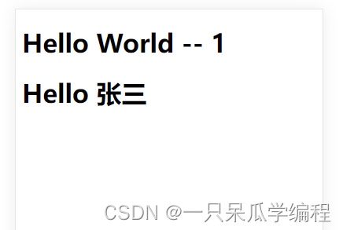

> 一个容器只由一个 Vue 实例进行控制，一个容器只由第一个 Vue 实例进行控制

> 由上述可得：
> Vue实例和容器是一 一对应的

## 4. 根据 Hello World 案例进行分析

### 4.1 插值语法中可以书写的数据格式

插值语法`{{}}`中可以书写js表达式。

表达式：
一个表达式会产生一个值，可以放在任何一个需要值的地方。
如：
（1）a
（2）a+b
（3）demo(1)
（4）x === y ? ‘a’ : ‘b’

### 4.2 根据案例进行分析


### 4.3 Vue 的 data 中数据发生变化，页面会发生对应的更新

打开 vue devtools 查看组件变量

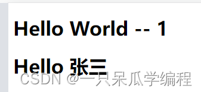
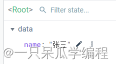

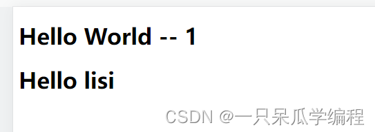

## 5. 总结

1. 想让 Vue 工作，就必须创建一个 Vue 实例，且要传入一个配置对象;
2. app 容器里的代码依然符合 html 规范，只不过混入了一些特殊的 Vue 语法;
3. app 容器里的代码被称为【Vue模板】
4. Vue实例和容器是一一对应的;
5. 真实开发中只有一个Vue实例，并且会配合着组件一起使用;
6. {{xxx}} 中的xxx要写js表达式，且xxx可以自动读取到data中的所有属性
7. 一旦data中的数据发生改变，那么页面中用到该数据的地方也会自动更新;

# 5.模板语法

## 1. Vue模板语法的分类

Vue模板语法主要分为两类：

1. 插值语法
2. 指令语法( v- 开头 )

## 2. 插值语法

### 2.1 引入

```html
<!DOCTYPE html>
<html lang="en">
<head>
  <meta charset="UTF-8">
  <meta http-equiv="X-UA-Compatible" content="IE=edge">
  <meta name="viewport" content="width=device-width, initial-scale=1.0">
  <title>Document</title>
  <script src="./js/vue.js"></script>
</head>
<body>
  <div id="app">
    <p>hello jack</p>
  </div>
  <script>
    new Vue( {
      el: '#app'
    } )
  </script>
</body>
</html>
```


### 2.2 插值语法实现

> 想要实现对 hello 后面名字的动态控制，就需要使用 vue 提供的插值语法 ---- 插值表达式 – {{}}。

> 使用{{}}可以将对应的值渲染到元素的内容节点中。

> 语法: `{{xxx}}`

```html
<!DOCTYPE html>
<html lang="en">
<head>
  <meta charset="UTF-8">
  <meta http-equiv="X-UA-Compatible" content="IE=edge">
  <meta name="viewport" content="width=device-width, initial-scale=1.0">
  <title>Document</title>
  <script src="./js/vue.js"></script>
</head>
<body>
  <div id="app">
    <p>hello {{name}}</p>
  </div>
  <script>
    new Vue( {
      el: '#app',
      // 声明页面的数据
      data: {
        name: 'marry'
      }
    } )
  </script>
</body>
</html>
```

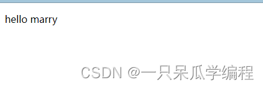

### 2.3 插值语法中书写js表达式

> 在vue提供的插值语法中，除了支持绑定简单的数据值外，还支持JavaScript表达式运算。

用法示例：

```html
<!DOCTYPE html>
<html lang="en">
<head>
    <meta charset="UTF-8">
    <meta name="viewport" content="width=device-width, initial-scale=1.0">
    <title>Document</title>
</head>
<body>
    <div id="app">
        <!-- 字符串的拼接 -->
        <p>{{ tips + '1' }}</p>
        <!-- ok未定义undefined 为false -->
        <p>{{ ok ? '1' : '2' }}</p>
        <!-- 字符串的反转 -->
        <p>{{ tips.split('').reverse().join('') }}</p>
    </div>
    <script src="https://cdn.jsdelivr.net/npm/vue@2/dist/vue.js"></script>
    <script>
        const vm = new Vue({
            el: "#app",
            data: {
                tips: "请输入..."
            }
        })
    </script>
</body>
</html>
```

> 

## 3. Vue指令

### 3.1 指令的概念

指令是Vue为开发者提供的模板语法，用于辅助开发者渲染页面的基本结构。

### 3.2 指令的分类

指令按照不同的用途可以分为如下6大类：

1. 内容渲染指令
2. 属性绑定指令
3. 事件绑定指令
4. 双向绑定指令
5. 条件渲染指令
6. 列表渲染指令

## 4. 内容渲染指令

> 插值语法是内容渲染指令中的一部分。

内容渲染指令是用来辅助开发者渲染DOM元素中的文本内容。

### 4.1常用的内容渲染指令：

> 1.v-text
> 2.{{ }}
> 3.v-html

### 4.2 v-text

用法示例：

```html
<!DOCTYPE html>
<html lang="en">
<head>
    <meta charset="UTF-8">
    <meta name="viewport" content="width=device-width, initial-scale=1.0">
    <title>Document</title>
</head>
<body>
    <div id="app">
        <!-- 要渲染的DOM -->
        <p v-text="username"></p>
    </div>
    <script src="https://cdn.jsdelivr.net/npm/vue@2/dist/vue.js"></script>
    <script>
        const vm = new Vue({
            el: '#app',
            // 要渲染的数据
            data: {
                username: '张三'
            }
        })
    </script>
</body>
</html>
```

> 

v-text的缺点：**会覆盖元素内部原有的内容**

### 4.3 {{}} 插值表达式

vue提供的{{}}语法是用来解决v-text会覆盖默认文本内容的问题，这种{{}}语法的专业名称是插值表达式。{{}}在实际开发中用的最多，只是内容的占位符，不会覆盖原有的内容。使用{{}}可以将对应的值渲染到元素的内容节点中。

用法示例：

```html
<!DOCTYPE html>
<html lang="en">
<head>
    <meta charset="UTF-8">
    <meta name="viewport" content="width=device-width, initial-scale=1.0">
    <title>Document</title>
</head>
<body>
    <div id="app">
        <p>姓名：{{ username }}</p>
        <p>性别：{{ gender }}</p>
    </div>

    <script src="https://cdn.jsdelivr.net/npm/vue@2/dist/vue.js"></script>
    <script>
        const vm = new Vue({
            el: '#app',
            data: {
                username: "lisi",
                gender: "男"
            }
        })
    </script>
</body>
</html>
```

> 

### 4.4 v-html

v-text和{{}}只能渲染纯文本内容，如果要把包含html标签的字符串渲染为页面的html元素，需要使用v-html。

用法示例：

```html
<!DOCTYPE html>
<html lang="en">
<head>
    <meta charset="UTF-8">
    <meta name="viewport" content="width=device-width, initial-scale=1.0">
    <title>Document</title>
</head>
<body>
    <div id="app">
        <div v-html="content"></div>
    </div>
    <script src="https://cdn.jsdelivr.net/npm/vue@2/dist/vue.js"></script>
    <script>
        const vm = new Vue({
            el: "#app",
            data: {
                content: "<h1>你好</h1>"
            }
        })
    </script>
</body>
</html>
```

> 

## 5. 指令语法

### 5.1 属性绑定指令

> 插值语法只能实现对标签的内容的渲染，如果要渲染标签的属性需要使用vue的指令语法----属性绑定指令。

#### 5.1.1 引入

```html
<!DOCTYPE html>
<html lang="en">
<head>
  <meta charset="UTF-8">
  <meta http-equiv="X-UA-Compatible" content="IE=edge">
  <meta name="viewport" content="width=device-width, initial-scale=1.0">
  <title>Document</title>
  <script src="./js/vue.js"></script>
</head>
<body>
  <div id="app">
    <p>hello {{name}}</p>
    <a href="www.baidu.com">百度超链接</a>
  </div>
  <script>
    new Vue( {
      el: '#app',
      // 声明页面的数据
      data: {
        name: 'marry'
      }
    } )
  </script>
</body>
</html>
```


> 想要实现对 a 标签属性的动态控制，需要使用属性绑定指令。

#### 5.1.2 属性绑定指令实现

> 正确的使用：

```html
<body>
  <div id="app">
    <p>hello {{name}}</p>
    <!-- 完整写法: <a v-bind:href="link"> -->
    <!-- v-bind: 可以简写为 ‘:’ -->
    <a :href="link">百度超链接</a>
  </div>
  <script>
    new Vue( {
      el: '#app',
      // 声明页面的数据
      data: {
        name: 'marry',
        link: 'www.baidu.com'
      }
    } )
  </script>
</body>
```


> 使用`v-bind:`属性绑定指令后，等号后面引号内的值会被认为js表达式执行

#### 5.1.3 属性绑定指令中使用js表达式

> 在属性绑定中一样可以使用JavaScript表达式。

> 在使用属性绑定期间，绑定内容需要进行动态拼接，则字符串的外面应该包裹单引号。

示例：

```html
<!DOCTYPE html>
<html lang="en">
<head>
    <meta charset="UTF-8">
    <meta name="viewport" content="width=device-width, initial-scale=1.0">
    <title>Document</title>
</head>
<body>
    <div id="app">
        <p :title=" 'tips' + 123 ">nihao</p>
    </div>
    <script src="https://cdn.jsdelivr.net/npm/vue@2/dist/vue.js"></script>
    <script>
        const vm = new Vue({
            el: "#app",
            data: {
                tips: "请输入..."
            }
        })
    </script>
</body>
</html>
```

> 

### 5.2 数据绑定

数据绑定分为：

1. 单向数据绑定
2. 双向数据绑定

#### 5.2.1 单向数据绑定

> 单向数据绑定 ---- 使用 v-bind 指令

```html
<body>
  <div id="app">
    单向数据绑定：<input type="text" v-bind:value="t" >
  </div>
  <script>
    new Vue( {
      el: '#app',
      // 声明页面的数据
      data: {
        t: ''
      }
    } )
  </script>
</body>
```

> 在Vue开发者工具中修改t的值
> 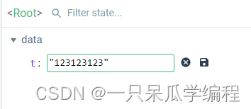
> 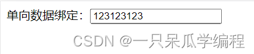
> 在输入框中修改t的值
> 
> 
> v-bind 为单向数据绑定，vue中的数据发生变化，页面中的数据会进行更新；但是页面中的数据发生变化，vue中的数据不会同步进行更新。
> 

#### 5.2.2 双向数据绑定

> 双向数据绑定使用 v-model

```html
<body>
  <div id="app">
    单向数据绑定：<input type="text" v-bind:value="t" >
    <br>
    双向数据绑定：<input type="text" v-model:value="t" >
  </div>
  <script>
    new Vue( {
      el: '#app',
      // 声明页面的数据
      data: {
        t: ''
      }
    } )
  </script>
</body>
```

> 在Vue开发者工具中修改t的值
> 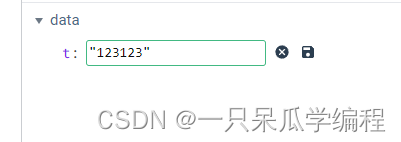
> 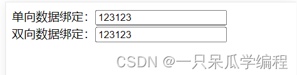
> 在“双向数据绑定”对应的输入框中修改t的值
> 
> 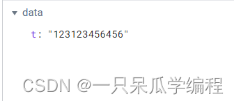
> v-model 为双向数据绑定，vue中的数据发生变化，页面中的数据会进行更新；页面中的数据发生变化，vue中的数据也会同步进行更新。单向数据绑定对应的输入框也会进行更新是由于 v-bind 指令。
> 

> 注意：
> v-model指令只能配合表单元素(输入类元素，元素要能够输入)一起使用。

> v-model 默认监听的为value的值
> `v-model:value="t"`
> 可以简写为
> `v-model=“t”`

```html
<body>
  <div id="app">
    <!-- v-bind:value="t" 简写为 :value="t" -->
    单向数据绑定：<input type="text" v-bind:value="t" >
    <br>
    <!-- v-model:value 简写为 v-model -->
    双向数据绑定：<input type="text" v-model="t" >
  </div>
  <script>
    new Vue( {
      el: '#app',
      // 声明页面的数据
      data: {
        t: ''
      }
    } )
  </script>
</body>
```

# 6.el 与 data 的两种写法

## 1. el 的写法

### 1.1 写法1

> 在实例化Vue对象的时候，传入配置对象，使用el属性绑定vue实例需要控制的容器。

```html
<body>
  <div id="app">

  </div>
  <script>
    new Vue( {
      el: '#app'
    } )
  </script>
</body>
```

### 1.2 写法2

> 使用Vue上的`$mount`方法将vue实例对象挂载到容器上。

```html
<body>
  <div id="app">

  </div>
  <script>
    const app = new Vue( {
      
    } )
    app.$mount( '#app' )
  </script>
</body>
```

> el 的写法，二者可以任选其一(两种写法没什么区别)

> 第二中写法更加灵活，比如，可以用于实现异步操作。

```html
<body>
  <div id="app">

  </div>
  <script>
    const app = new Vue( {
      
    } )
    // app.$mount( '#app' )
    // 一秒之后才将vue实例与容器关联
    setTimeout( ()=>{
      app.$mount( '#app' )
    }, 1000 )
  </script>
</body>
```

## 2. data 的写法

### 2.1 写法1

> 对象式(在组件化写法中，不适用，组件化中只适用第二中写法)

```html
<body>
  <div id="app">

  </div>
  <script>
    const app = new Vue( {
      data: {
        
      }
    } )
    app.$mount( '#app' )
  </script>
</body>
```

### 2.2 写法2

> 函数式
> 必须有一个返回值，返回值为对象

```html
<body>
  <div id="app">

  </div>
  <script>
    const app = new Vue( {
      data: function() {
        return {
          
        }
      }
    } )
    app.$mount( '#app' )
  </script>
</body>
```

> data函数中的this指向vue实例
> data 函数由vue实例调用
> **data函数不能写成箭头函数**，箭头函数没有自己的this，this会指向window，this不再指向Vue实例

简写：

```html
<body>
  <div id="app">

  </div>
  <script>
    const app = new Vue( {
      data() {
        return {

        }
      }
    } )
    app.$mount( '#app' )
  </script>
</body>
```

# 7.理解MVVM


MVVM模型

●M：模型 Model，data中的数据

●V：视图 View，模板代码

●VM：视图模型 ViewModel，Vue实例

观察发现


将实例赋值给变量vm，并打印vm

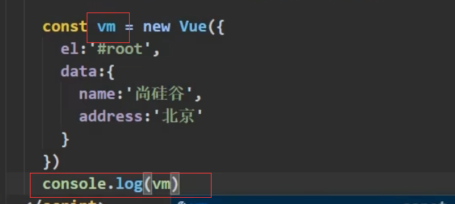

可以发现打印的vm中有data


vm身上所有的属性 及Vue原型身上所有的属性，在 Vue模板中都可以直接使用


> 根据
> “可以发现打印的vm中有data”
> “vm身上所有的属性 及Vue原型身上所有的属性，在 Vue模板中都可以直接使用”
> 这两个现象可以得到结论：之所以vue模板可以使用data中的数据，是因为data中的数据被放在了vm里，而vue模板又可以直接使用vm中的内容，因此vue模板能使用vm内的数据

# 8.数据代理

## 1. Object.defineProperty()方法

该方法用于给对象添加属性。

```js
Object.defineProperty()

需要传入三个参数：
1. 需要进行属性添加的对象
2. 将要添加到对象的新属性名
3. 配置对象，在配置对象中可以指定新属性的值
```

### 1.1 使用Object.defineProperty()向对象中添加属性

```html
  <script>
    let person = {
      name: 'zs',
      sex: 'male'
    }
    // 向person对象中新添加一个age属性
    Object.defineProperty(person, 'age', {
      value: 18
    })
    console.log(person)
  </script>
```

> 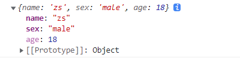

### 1.2 使用Object.defineProperty()添加的属性默认不可枚举

使用Object.defineProperty()添加的属性默认不可枚举，即使用Object.defineProperty()添加的属性默认是不能进行遍历的。

```html
  <script>
    let person = {
      name: 'zs',
      sex: 'male'
    }
    // 向person对象中新添加一个age属性
    Object.defineProperty(person, 'age', {
      value: 18
    })
    console.log(person)
    console.log(Object.keys(person))
    for (let key in person) {
      console.log(key, person[key])
    }
  </script>
```

> 

### 1.3 使Object.defineProperty()添加的属性可枚举

默认情况下，使用Object.defineProperty()添加的属性是不可枚举的，在添加属性的时候，配置对象中 enumerable 的值设置为 true，则使用Object.defineProperty()添加的属性可以枚举。

```html
  <script>
    let person = {
      name: 'zs',
      sex: 'male'
    }
    // 向person对象中新添加一个age属性
    Object.defineProperty(person, 'age', {
      value: 18,
      // enumerable 控制属性是否可以枚举，默认值为 false
      enumerable: true
    })
    console.log(person)
    console.log(Object.keys(person))
    for (let key in person) {
      console.log(key, person[key])
    }
  </script>
```

> 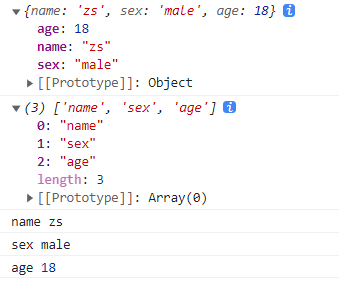

### 1.4 使Object.defineProperty()添加的属性值可以修改

默认情况下，使用Object.defineProperty()添加的属性的值是不可以修改的。

> 

要使Object.defineProperty()添加的属性值可以修改，在添加属性时，配置对象的 writable 的值设置为 true，使用Object.defineProperty()添加的属性值可以修改。

```html
  <script>
    let person = {
      name: 'zs',
      sex: 'male'
    }
    // 向person对象中新添加一个age属性
    Object.defineProperty(person, 'age', {
      value: 18,
      // enumerable 控制属性是否可以枚举，默认值为 false
      enumerable: true,
      // 控制属性值是否可以被修改，默认值为 false
      writable: true
    })

  </script>
```

> 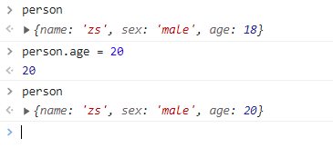

### 1.5 使Object.defineProperty()添加的属性可以删除

默认情况下，使用Object.defineProperty()添加的属性的值是不可以删除的。

> 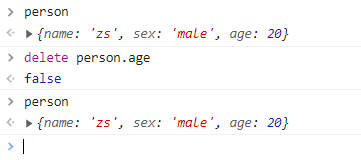

要使Object.defineProperty()添加的属性值可以删除，在添加属性时，配置对象的 configurable 的值设置为 true，使用Object.defineProperty()添加的属性值可以删除。

```html
  <script>
    let person = {
      name: 'zs',
      sex: 'male'
    }
    // 向person对象中新添加一个age属性
    Object.defineProperty(person, 'age', {
      value: 18,
      // enumerable 控制属性是否可以枚举，默认值为 false
      enumerable: true,
      // 控制属性值是否可以被修改，默认值为 false
      writable: true,
      // 控制属性是否可以被删除，默认值为 false
      configurable: true
    })

  </script>
```

> 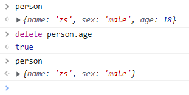

### 1.6 新添加的属性赋值为另外定义的变量

向对象中新添加的属性赋值为另外定义的变量，当变量的值发生改变时，对象中的新属性值也会对应的发生变化。

```html
  <script>
    let number = 18
    let person = {
      name: 'zs',
      sex: 'male'
    }
    // 向person对象中新添加一个age属性
    Object.defineProperty(person, 'age', {
      // value: 18,
      // // enumerable 控制属性是否可以枚举，默认值为 false
      // enumerable: true,
      // // 控制属性值是否可以被修改，默认值为 false
      // writable: true,
      // // 控制属性是否可以被删除，默认值为 false
      // configurable: true

      // 当读取person的age属性的时候，get函数(getter)会被调用，且返回值就是age的值
      // get: function() {
      //   console.log('读取age属性')
      //   return number
      // }
      // 简写
      get() {
        console.log('读取age属性')
        return number
      },

      // 修改person的age属性的时候，set函数(setter)会被调用，且会收到修改的具体值
      set(value) {
        console.log('修改了age的属性值:', value)
      }
    })
  </script>
```

> 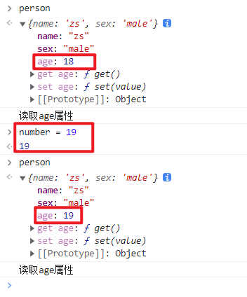

### 1.7 修改新添加的属性值同时修改对应的变量

当对象中新添加的属性值发生改变时，对应的变量值也会对应的发生变化。

```html
  <script>
    let number = 18
    let person = {
      name: 'zs',
      sex: 'male'
    }
    // 向person对象中新添加一个age属性
    Object.defineProperty(person, 'age', {
      // value: 18,
      // // enumerable 控制属性是否可以枚举，默认值为 false
      // enumerable: true,
      // // 控制属性值是否可以被修改，默认值为 false
      // writable: true,
      // // 控制属性是否可以被删除，默认值为 false
      // configurable: true

      // 当读取person的age属性的时候，get函数(getter)会被调用，且返回值就是age的值
      // get: function() {
      //   console.log('读取age属性')
      //   return number
      // }
      // 简写
      get() {
        console.log('读取age属性')
        return number
      },

      // 修改person的age属性的时候，set函数(setter)会被调用，且会收到修改的具体值
      set(value) {
        console.log('修改了age的属性值:', value)
        number = value
      }
    })
  </script>
```

> 

> person 和 number 通过 Object.defineProperty() 中的 getter 和 setter 进行了关联。

## 2. 数据代理

数据代理：通过一个对象代理对另一个对象中属性的操作(读/写)

```html
  <script>
    let obj1 = {
      x: 100
    }
    let obj2 = {
      y: 200
    }
    // 通过obj2代理对obj1中x的操作(读/写)
    Object.defineProperty(obj2, 'x', {
      get() {
        return obj1.x
      },
      set(val) {
        obj1.x = val
      }
    })
  </script>
```

> 

## 3. Vue中的数据代理

```html
  <div id="root">
    <h1>学校名称：{{name}}</h1>
    <h1>学校地址：{{address}}</h1>
  </div>

  <script src="https://cdn.jsdelivr.net/npm/vue@2.6.14/dist/vue.js"></script>
  <script>
    const vm = new Vue({
      el: '#root',
      data: {
        name: '学校名称',
        address: '学校地址'
      }
    })
  </script>
```

> 
> 

观察发现，vue实例中data的属性值的存在方式与通过Object.defineProperty()采用getter和setter向一个对象中添加一个变量作为属性的存在方式类似。

vue是通过Object.defineProperty()将data中的属性追加到Vue实例中，再采用getter和setter读写data中的属性。

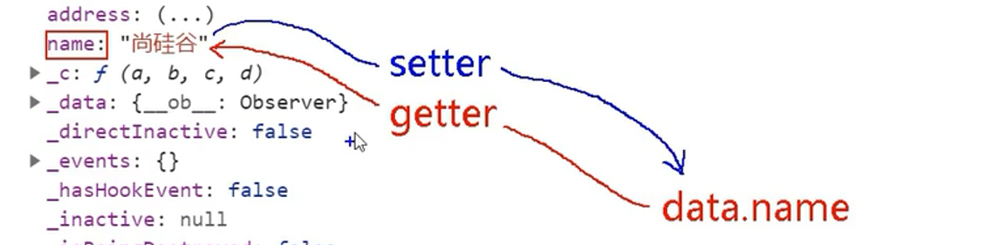

> Vue实例对象中的`_data`就是我们创建Vue实例时所写的配置对象中的data

```html
<body>
  <div id="root">
    <h1>学校名称：{{name}}</h1>
    <h1>学校地址：{{address}}</h1>
  </div>

  <script src="https://cdn.jsdelivr.net/npm/vue@2.6.14/dist/vue.js"></script>
  <script>
    let data = {
      name: '学校名称',
      address: '学校地址'
    }
    const vm = new Vue({
      el: '#root',
      data 
    })
  </script>
</body>
```

> 

验证Vue中getter和setter：

```html
<body>
  <div id="root">
    <h1>学校名称：{{name}}</h1>
    <h1>学校地址：{{address}}</h1>
  </div>

  <script src="https://cdn.jsdelivr.net/npm/vue@2.6.14/dist/vue.js"></script>
  <script>
    let data = {
      name: '学校名称',
      address: '学校地址'
    }
    const vm = new Vue({
      el: '#root',
      data 
    })
  </script>
</body>
```

> 

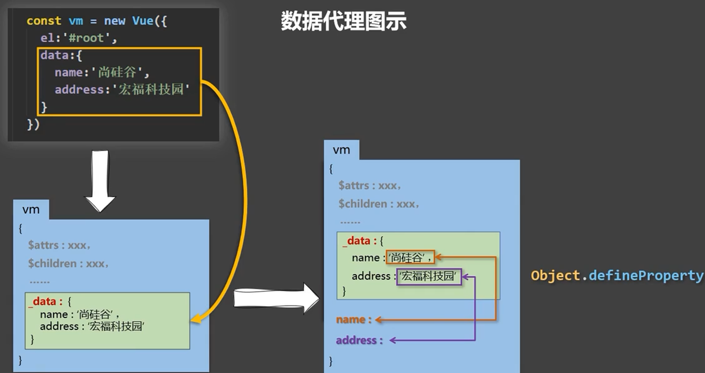

Vue实例对象中的`_data`不完全是我们所写的data，vue对其进行了数据劫持处理，为了能够实现在数据发生变化的时候，能够检测到数据发生了改变，从而页面的中对应的显示数据也能发生变化，实现页面的更新，实现页面的响应式操作。


# 9.事件

## 1. 事件处理

### 1.1 事件绑定指令

vue提供了`v-on:`事件绑定指令，用来辅助程序员为DOM元素绑定事件监听。

原生的DOM对象有`onclick`、`oninput`等原生事件，在vue中可以使用`v-on:click`、`v-on:input`等来监听DOM元素的对应事件，并为其绑定相应的事件处理函数，其中事件处理函数需要在vue实例对象的`methods`节点中进行声明。

`v-on:` 简写为 `@`。

### 1.2 元素事件绑定代码示例

```html
<!DOCTYPE html>
<html lang="en">
<head>
  <meta charset="UTF-8">
  <meta http-equiv="X-UA-Compatible" content="IE=edge">
  <meta name="viewport" content="width=device-width, initial-scale=1.0">
  <title>Document</title>
</head>
<body>
  <div id="root">
    <h1>Hello {{name}}!</h1>
    <!-- 监听按钮的点击事件，同时为其绑定事件处理函数 show1 -->
    <button v-on:click="show1">提示信息1</button>
	<!-- @ 是v-on: 的简写 -->
    <button @click="show2">提示信息2</button>
  </div>

  <script src="https://cdn.jsdelivr.net/npm/vue@2.6.14/dist/vue.js"></script>
  <script>
    const vm = new Vue({
      el: '#root',
      data: {
        name: 'zs'
      },
      methods: {
        show1() {
          alert('你好！')
        },
        show2() {
          alert('你好！！')
        },
      },
    })
  </script>
</body>
</html>
```

> 
> 

### 1.3 事件处理函数的参数

事件处理函数不进行参数的传递，默认会有一个参数，即事件的触发对象。

```html
<!DOCTYPE html>
<html lang="en">
<head>
  <meta charset="UTF-8">
  <meta http-equiv="X-UA-Compatible" content="IE=edge">
  <meta name="viewport" content="width=device-width, initial-scale=1.0">
  <title>Document</title>
</head>
<body>
  <div id="root">
    <h1>Hello {{name}}!</h1>
    <!-- 监听按钮的点击事件，同时为其绑定事件处理函数 show1 -->
    <button v-on:click="show1">提示信息1</button>
    <!-- 监听按钮的点击事件，同时为其绑定事件处理函数 show1 -->
    <button @click="show2">提示信息2</button>
  </div>

  <script src="https://cdn.jsdelivr.net/npm/vue@2.6.14/dist/vue.js"></script>
  <script>
    const vm = new Vue({
      el: '#root',
      data: {
        name: 'zs'
      },
      methods: {
        show1(e) {
          alert('你好！')
          console.log('提示信息1')
          console.log(e)
        },
        show2(e) {
          alert('你好！！')
          console.log('提示信息2')
          console.log(e.target)
        },
      },
    })
  </script>
</body>
</html>
```

> 

向事件处理函数显示的传递事件的触发对象，可以在绑定事件处理函数时，传入参数`$event`作为事件触发对象。

```html
<!DOCTYPE html>
<html lang="en">
<head>
  <meta charset="UTF-8">
  <meta http-equiv="X-UA-Compatible" content="IE=edge">
  <meta name="viewport" content="width=device-width, initial-scale=1.0">
  <title>Document</title>
</head>
<body>
  <div id="root">
    <h1>Hello {{name}}!</h1>
    <!-- 监听按钮的点击事件，同时为其绑定事件处理函数 show1 -->
    <button v-on:click="show1($event)">提示信息1</button>
    <!-- 监听按钮的点击事件，同时为其绑定事件处理函数 show1 -->
    <button @click="show2">提示信息2</button>
  </div>

  <script src="https://cdn.jsdelivr.net/npm/vue@2.6.14/dist/vue.js"></script>
  <script>
    const vm = new Vue({
      el: '#root',
      data: {
        name: 'zs'
      },
      methods: {
        show1(e) {
          alert('你好！')
          console.log('提示信息1')
          console.log(e.target)
        },
        show2(e) {
          alert('你好！！')
          console.log('提示信息2')
          console.log(e.target)
        },
      },
    })
  </script>
</body>
</html>
```

> 

向事件处理函数传递其他参数的同时，传递事件的触发对象，此时，如果不显示的传递事件的触发对象，则事件的处理函数不会接收到事件触发对象这个参数。

```html
<!DOCTYPE html>
<html lang="en">
<head>
  <meta charset="UTF-8">
  <meta http-equiv="X-UA-Compatible" content="IE=edge">
  <meta name="viewport" content="width=device-width, initial-scale=1.0">
  <title>Document</title>
</head>
<body>
  <div id="root">
    <h1>Hello {{name}}!</h1>
    <!-- 监听按钮的点击事件，同时为其绑定事件处理函数 show1 -->
    <button v-on:click="show1($event, '张三')">提示信息1</button>
    <!-- 监听按钮的点击事件，同时为其绑定事件处理函数 show1 -->
    <button @click="show2('李四')">提示信息2</button>
  </div>

  <script src="https://cdn.jsdelivr.net/npm/vue@2.6.14/dist/vue.js"></script>
  <script>
    const vm = new Vue({
      el: '#root',
      data: {
        name: 'zs'
      },
      methods: {
        show1(e, uname) {
          alert('你好！')
          console.log('提示信息1   ' + uname)
          console.log(e.target)
        },
        show2(e, uname) {
          alert('你好！！')
          console.log('提示信息2 e   '+ e)
          console.log('提示信息2 uname   '+ uname)
        },
      },
    })
  </script>
</body>
</html>
```

> 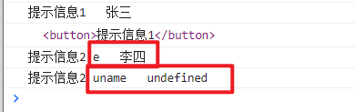

### 1.4 事件处理函数的this

事件处理函数如果写成普通函数，则事件处理函数的this指向vue实例对象；
如果事件处理函数写成箭头，则事件处理函数的this指向windows对象，因为箭头函数没有自己的this， 箭头函数会向外找this, 向外找到的this就是window。

```html
<!DOCTYPE html>
<html lang="en">
<head>
  <meta charset="UTF-8">
  <meta http-equiv="X-UA-Compatible" content="IE=edge">
  <meta name="viewport" content="width=device-width, initial-scale=1.0">
  <title>Document</title>
</head>
<body>
  <div id="root">
    <h1>Hello {{name}}!</h1>
    <button v-on:click="show1()">提示信息1</button>
    <button @click="show2()">提示信息2</button>
  </div>

  <script src="https://cdn.jsdelivr.net/npm/vue@2.6.14/dist/vue.js"></script>
  <script>
    const vm = new Vue({
      el: '#root',
      data: {
        name: 'zs'
      },
      methods: {
        show1() {
          console.log('普通函数形式的this：',this === vm)
        },
        show2: () => {
          console.log('箭头函数形式的this：',this)
        },
      },
    })
  </script>
</body>
</html>
```

> 

### 1.5 事件处理函数存放位置

事件处理函数定义后，最终会挂载到vue实例对象上。

> 事件处理函数不进行数据代理，只有写在data节点上的才会进行数据代理。

```html
<!DOCTYPE html>
<html lang="en">
<head>
  <meta charset="UTF-8">
  <meta http-equiv="X-UA-Compatible" content="IE=edge">
  <meta name="viewport" content="width=device-width, initial-scale=1.0">
  <title>Document</title>
</head>
<body>
  <div id="root">
    <h1>Hello {{name}}!</h1>
    <button v-on:click="show1()">提示信息1</button>
    <button @click="show2()">提示信息2</button>
  </div>

  <script src="https://cdn.jsdelivr.net/npm/vue@2.6.14/dist/vue.js"></script>
  <script>
    const vm = new Vue({
      el: '#root',
      data: {
        name: 'zs'
      },
      methods: {
        show1() {
          console.log(vm)
        },
        show2: () => {
          console.log('箭头函数形式的this：',this)
        },
      },
    })
  </script>
</body>
</html>
```

> 

## 2. 事件修饰符

在事件处理函数中调用`preventDefault()`(阻止默认行为)或 `stopPropagation()`(阻止冒泡)对事件的触发进行控制是非常常见的需求。

因此，vue提供了事件修饰符的概念，来辅助程序员更方便的对事件的触发进行控制。

| 事件修饰符            | 说明                                                  |
| --------------------- | ----------------------------------------------------- |
| **.prevent** （常用） | 阻止默认行为（例如:阻止a连接的跳转、阻止表单的提交等) |
| **.stop**  （常用）   | 阻止事件冒泡(事件的默认处理阶段为冒泡阶段)            |
| **.once** （常用）    | 绑定的事件只触发1次                                   |
| .capture              | 以捕获模式触发当前的事件处理函数                      |
| .self                 | 只有在event.target是当前元素自身时触发事件处理函数    |
| .passive              | 事件的默认行为立即执行，无需等待事件回调执行完毕      |


```html
<!DOCTYPE html>
<html>
	<head>
		<meta charset="UTF-8" />
		<title>事件修饰符</title>
		<script src="https://cdn.jsdelivr.net/npm/vue@2.6.14/dist/vue.js"></script>
		<style>
			*{
				margin-top: 20px;
			}
			.demo1{
				height: 50px;
				background-color: skyblue;
			}
			.box1{
				padding: 5px;
				background-color: skyblue;
			}
			.box2{
				padding: 5px;
				background-color: orange;
			}
			.list{
				width: 200px;
				height: 200px;
				background-color: peru;
				overflow: auto;
			}
			li{
				height: 100px;
			}
		</style>
	</head>
	<body>
		<div id="root">
			<h2>欢迎来到{{name}}学习</h2>
			<!-- 阻止默认事件 -->
	      <!-- a连接点击之后会进行页面的跳转，
	        使用 .prevent 进行修饰后，
	        点击之后不会进行页面的跳转-->
			<a href="http://www.atguigu.com" @click.prevent="showInfo">点我提示信息</a>

			<!-- 阻止事件冒泡 -->
	      <!-- 
	        事件捕获：
	        点击按钮事件的传递方向为 div => button 由外向内
	        事件冒泡：
	        点击按钮向进行事件的捕获，
	        随后进行事件的冒泡，事件的传递分向为 button => div 由内向外
	        事件调用处理函数进行处理，默认是在事件冒泡阶段
	        使用 .stop 修饰，可以阻止事件向外冒泡 -->
			<div class="demo1" @click="showInfo">
				<button @click.stop="showInfo">点我提示信息</button>
			</div>

			<!-- 事件只触发一次 -->
      	    <!-- 事件触发一次后，不再触发 -->
			<button @click.once="showInfo">点我提示信息</button>

			<!-- 使用事件的捕获模式 -->
      		<!-- 使事件调用处理函数处理在事件的捕获阶段而不是冒泡阶段 -->
			<div class="box1" @click.capture="showMsg(1)">
				div1
				<div class="box2" @click="showMsg(2)">
					div2
				</div>
			</div>

			<!-- 只有event.target是当前操作的元素时才触发事件 -->
	      <!-- 
	        由于事件默认情况下会出现冒泡，
	        所以外层的事件依旧会触发，但是外层的触发元素不是外层元素本身
	        而是内层元素
	        .self 进行修饰可以使 只有event.target是当前操作的元素时才触发事件
	       -->
			<div class="demo1" @click.self="showInfo">
				<button @click="showInfo">点我提示信息</button>
			</div>

			<!-- 事件的默认行为立即执行，无需等待事件回调执行完毕 -->
	      <!-- 
	        事件默认情况下会等待回调函数 demo() 执行完成才会触发自己的默认行为
	        如下代码，即函数执行完成才会进行滚动条的滚动
	        .passive 可以使默认行为先执行，即滚动条立即滚动
	       -->
			<ul @wheel.passive="demo" class="list">
				<li>1</li>
				<li>2</li>
				<li>3</li>
				<li>4</li>
			</ul>

		</div>
	</body>

	<script type="text/javascript">
		Vue.config.productionTip = false

		new Vue({
			el:'#root',
			data:{
				name:'尚硅谷'
			},
			methods:{
				showInfo(e){
					alert('同学你好！')
				},
				showMsg(msg){
					console.log(msg)
				},
				demo(){
					for (let i = 0; i < 100000; i++) {
						console.log('#')
					}
					console.log('累坏了')
				}
			}
		})
	</script>
</html>
```

对事件需要进行多种修饰，可以在事件后面添加多个事件修饰符，即事件修饰符可以连写。
例如，既要阻止冒泡，又要阻止默认事件：	

```html
<div class="demo1" @click="showInfo">
	<a href="http://www.atguigu.com" @click.stop.prevent="showInfo">点我提示信息</a>
</div>
```

## 3. 键盘事件

在监听键盘事件时，我们经常需要判断按键，根据按下的按键进行事件的处理。Vue为我们提供了一些常用的按键别名，此时，可以使用vue提供的别名为键盘相关的事件添加按键修饰符。

Vue中常用的按键别名：

| 按键 | 别名                              |
| ---- | --------------------------------- |
| 回车 | enter                             |
| 删除 | delete (捕获“删除”和“退格”键)     |
| 退出 | esc                               |
| 空格 | space                             |
| 换行 | tab (特殊，必须配合keydown去使用) |
| 上   | up                                |
| 下   | down                              |
| 左   | left                              |
| 右   | right                             |

> tab键可以将光标从当前元素切走，tab配合keyup使用，即要等tab键抬起才会触发事件，但是当我们按下tab键光标就会从当前元素切走，无法触发事件的处理函数。tab配合keydown使用，在按下的时候会调用处理函数，同时光标从当前元素切走，所以tab 特殊，必须配合keydown去使用。

> vue没有提供别名的按键，可以使用按键原始的key值进行绑定，但是对于那种按键由不同单词复合而成的需要进行转化，例如，大小写切换键`CapsLock` 转为`caps-lock`(短横线命名)。

- 获取按键名：`e.key`

- 获取按键编码：

  ```
  e.keyCode 
  ```

  - 其中，e为键盘事件

- 系统修饰键（用法特殊）：ctrl、alt、shift、meta(win键)

  - 配合keyup使用：按下修饰键的同时，再按下其他键，随后释放其他键，事件才被触发
  - 配合keydown使用：正常触发事件

自定义按键别名：

```properties
Vue.config.keyCodes.自定义键名 = 键码
```

代码示例：
实现功能，按下enter键在控制台输出在文本框输入的内容。

```html
<!DOCTYPE html>
<html>
	<head>
		<meta charset="UTF-8" />
		<title>键盘事件</title>
		<script src="https://cdn.jsdelivr.net/npm/vue@2.6.14/dist/vue.js"></script>
	</head>
	<body>
		<div id="root">
			<h2>欢迎来到{{name}}学习</h2>
			<input type="text" placeholder="按下回车提示输入" @keydown.enter="showInfo">
		</div>
	</body>

	<script type="text/javascript">
		Vue.config.productionTip = false

		new Vue({
			el:'#root',
			data:{
				name:'尚硅谷'
			},
			methods: {
				showInfo(e){
					console.log(e.target.value)
				}
			},
		})
	</script>
</html>
```

> 

键盘事件可以连写。比如需要实现，按下ctrl+y键才在控制台输出在文本框输入的内容。

```html
<!DOCTYPE html>
<html>
	<head>
		<meta charset="UTF-8" />
		<title>键盘事件</title>
		<script src="https://cdn.jsdelivr.net/npm/vue@2.6.14/dist/vue.js"></script>
	</head>
	<body>
		<div id="root">
			<h2>欢迎来到{{name}}学习</h2>
			<input type="text" placeholder="按下回车提示输入" @keydown.ctrl.y="showInfo">
		</div>
	</body>

	<script type="text/javascript">
		Vue.config.productionTip = false

		new Vue({
			el:'#root',
			data:{
				name:'尚硅谷'
			},
			methods: {
				showInfo(e){
					console.log(e.key)
					console.log(e.target.value)
				}
			},
		})
	</script>
</html>
```

> 

# 10.计算属性

> 通过一个姓名案例引出讲解计算属性

## 1 实现效果

> 可以单独的输入姓或者输入名。最后页面会呈现将姓和名组合起来的效果。


为了更好的理解计算属性，先通过插值语法实现上述效果，再使用methods实现上述效果，最后再使用计算属性。

## 2 插值语法实现

```html
<!DOCTYPE html>
<html lang="en">
<head>
  <meta charset="UTF-8">
  <meta http-equiv="X-UA-Compatible" content="IE=edge">
  <meta name="viewport" content="width=device-width, initial-scale=1.0">
  <title>Document</title>
</head>
<body>
  <!-- 准备容器 -->
  <div id="root">
    姓：<input type="text" v-model="firstName"> <br><br>
    名：<input type="text" v-model="lastName"> <br><br>
    姓名：<span>{{firstName}}-{{lastName}}</span>
  </div>
  <!-- 引入vue -->
  <script src="https://cdn.jsdelivr.net/npm/vue@2.6.14/dist/vue.js"></script>
  <script>
    new Vue({
      el: '#root',
      data: {
        firstName: '张',
        lastName:'三'
      }
    })
  </script>
</body>
</html>
```


如果现在有个需求：
输出显示的全名的姓太长时，需要保留前三个字符，且需要对保留下来的字符进行反转等操作。

```html
姓名：<span>{{firstName.slice(0,3).split('').reverse().join('')}}-{{lastName}}</span>
```

此时虽然能够实现需求，但是插值表达式中的js表达式太长，不易阅读。同时该种写法vue也不推荐，虽然不会报错。


在vue2文档官网的风格指南中，不推荐在模板中写复杂的表达式。


## 3 methods实现

> 在插值表达式中调用对应的method来处理全名的输出显示。

```html
<!DOCTYPE html>
<html lang="en">
<head>
  <meta charset="UTF-8">
  <meta http-equiv="X-UA-Compatible" content="IE=edge">
  <meta name="viewport" content="width=device-width, initial-scale=1.0">
  <title>Document</title>
</head>
<body>
  <!-- 准备容器 -->
  <div id="root">
    姓：<input type="text" v-model="firstName"> <br><br>
    名：<input type="text" v-model="lastName"> <br><br>
    姓名：<span>{{ fullName() }}</span>
  </div>
  <!-- 引入vue -->
  <script src="https://cdn.jsdelivr.net/npm/vue@2.6.14/dist/vue.js"></script>
  <script>
    new Vue({
      el: '#root',
      data: {
        firstName: '张',
        lastName:'三'
      },
      methods: {
        fullName() {
          console.log('fullName方法被调用了...')
          return this.firstName + '-' + this.lastName
        }
      },
    })
  </script>
</body>
</html>
```

> 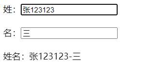

> 此时如果要实现输出显示的全名保留前三个字符，且需要对保留下来的字符进行反转等操作。代码可以写在对应的方法中，在插值表达式中只有一个方法的调用，不会新增其他代码。

使用methods能够实现的原理：

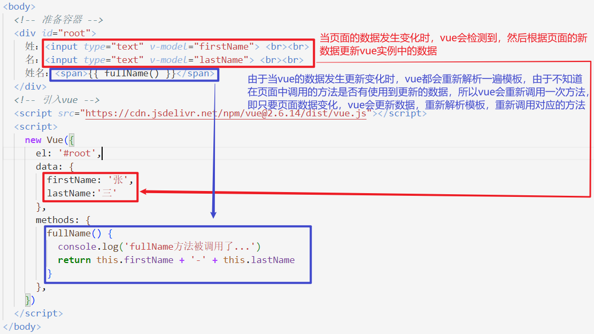

> 

## 4 计算属性实现

> 在vue中，只要是写在data中的，vue都认为是属性。
> 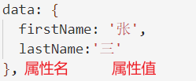

### 计算属性

​          1.定义：要用的属性不存在，要通过已有属性计算得来。

​          2.原理：底层借助了Objcet.defineproperty方法提供的getter和setter。

​          3.get函数什么时候执行？

​                (1).初次读取时会执行一次。

​                (2).当依赖的数据发生改变时会被再次调用。

​          4.优势：与methods实现相比，内部有缓存机制（复用），效率更高，调试方便。

​          5.备注：

​              1.计算属性最终会出现在vm上，直接读取使用即可。

​              2.如果计算属性要被修改，那必须写set函数去响应修改，且set中要引起计算时依赖的数据发生改变。


在vue中，计算属性写在配置项`computed`中，配置项`computed`需要书写成对象形式。

### get方法

如果要使用计算属性，那么需要在计算属性中实现`get()`方法：

```js
computed: {
	// 由于计算属性的处理可能很复杂，所以写成对象的形式
	fullName: {
	  // 当计算属性被读取时，get函数会被调用，且返回值作为计算属性的值
	  get() {
	    console.log('get被调用')
	    return this.firstName + '-' + this.lastName
	  }
	}
},
```

使用计算属性的方式与使用data中的属性的方式一样，直接使用即可。

```html
<!DOCTYPE html>
<html lang="en">
<head>
  <meta charset="UTF-8">
  <meta http-equiv="X-UA-Compatible" content="IE=edge">
  <meta name="viewport" content="width=device-width, initial-scale=1.0">
  <title>Document</title>
</head>
<body>
  <!-- 准备容器 -->
  <div id="root">
    姓：<input type="text" v-model="firstName"> <br><br>
    名：<input type="text" v-model="lastName"> <br><br>
    姓名：<span>{{ fullName }}</span>
  </div>
  <!-- 引入vue -->
  <script src="https://cdn.jsdelivr.net/npm/vue@2.6.14/dist/vue.js"></script>
  <script>
    const vm = new Vue({
      el: '#root',
      data: {
        firstName: '张',
        lastName:'三'
      },
      computed: {
        // 由于计算属性的处理可能很复杂，所以写成对象的形式
        fullName: {
          // 当计算属性被读取时，get函数会被调用，且返回值作为计算属性的值
          get() {
            console.log('get被调用')
            return this.firstName + '-' + this.lastName
          }
        }
      }
    })
  </script>
</body>
</html>
```

> 

> 由于计算属性会在处理完成后被挂载到vue的实例对象上，所以使用计算属性的方式与使用data中的属性的方式一样，直接使用即可。
> 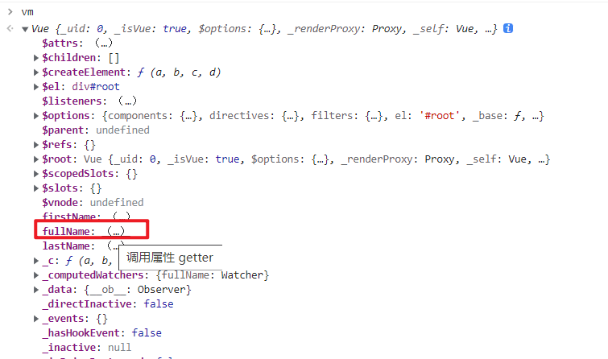

`get()`被调用的时机：

1. 初次读取计算属性

   > 

2. 计算属性所依赖的数据发生变化

   > 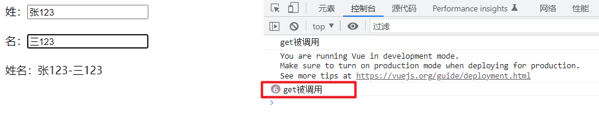

> 计算属性中函数(写成普通函数的形式)的this执行vue实例对象。

计算属性相比于methods的优势：

1. 计算属性会将结果缓存，只要计算属性所依赖的属性不改变，get方法就不会被调用。

   ```html
   <!-- 准备容器 -->
     <div id="root">
       姓：<input type="text" v-model="firstName"> <br><br>
       名：<input type="text" v-model="lastName"> <br><br>
       姓名：<span>{{ fullName }}</span>
       姓名：<span>{{ fullName }}</span>
       姓名：<span>{{ fullName }}</span>
       姓名：<span>{{ fullName }}</span>
     </div>
   ```

   > 

2. 相对于methods，计算属性的效率更高，因为methods不存在缓存，所以每次调用方法，方法都会重新执行一次，而计算属性只要依赖的数据不发生变化，计算属性的计算过程只有在第一次读取时执行。

### set方法

修改计算属性，需要在计算属性中定义`set()`函数：

> 当计算属性被修改时，set()会被调用

```js
      computed: {
        // 由于计算属性的处理可能很复杂，所以写成对象的形式
        fullName: {
          // 当计算属性被读取时，get函数会被调用，且返回值作为计算属性的值
          // get被调用的时机：1.初次读取计算属性 2.计算属性所依赖的数据发生变化
          get() {
            console.log('get被调用')
            return this.firstName + '-' + this.lastName
          },
          // 当计算属性被修改时，set()会被调用
          // val为修改后的计算属性值
          set(val) {
            // 由于计算属性依赖firstName lastName
            // 所以修改计算属性必须通过修改firstName lastName实现
            strArr = val.split("-")
            this.firstName = strArr[0]
            this.lastName = strArr[1]
          }
        }
      }
```

> 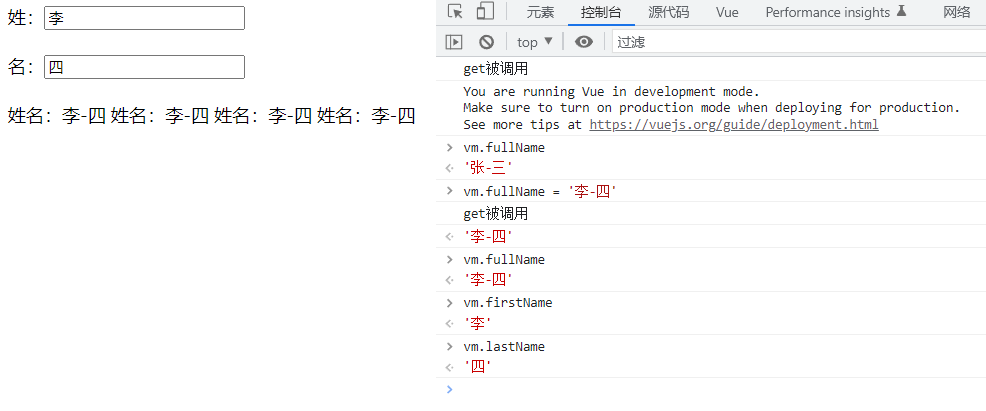

> 计算属性底层借助了Object.defineproperty方法提供的getter和setter。

## 5 计算属性简写

> 计算属性更多是用于数据的展示，很少用于数据的修改。

当我们确定计算属性只读不改，才可以使用计算属性的简写形式。

简写形式就是把计算属性写成函数形式，此时计算属性函数相当于之前对象形式写法里面的`get()`函数。

```js
      computed: {
        // 计算属性完整写法：
        // fullName: {
        //   get() {
        //     console.log('get被调用')
        //     return this.firstName + '-' + this.lastName
        //   },
        //   set(val) {
        //     strArr = val.split("-")
        //     this.firstName = strArr[0]
        //     this.lastName = strArr[1]
        //   }
        // }

        // 计算属性简写：
        fullName() {
          console.log('get被调用')
          return this.firstName + '-' + this.lastName
        }
      }
```

调用简写的计算属性时，不要写成 {{ fullName() }} 的形式。

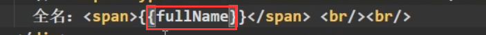

> 

# 11.监视属性

## 1. 实现效果

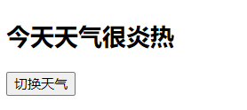
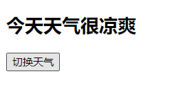

## 2. methods + computed实现

```html
<!DOCTYPE html>
<html lang="en">
<head>
  <meta charset="UTF-8">
  <meta http-equiv="X-UA-Compatible" content="IE=edge">
  <meta name="viewport" content="width=device-width, initial-scale=1.0">
  <title>Document</title>
</head>
<body>
  <div id="root">
    <h2>今天天气很{{info}}</h2>
    <button @click="changeWeather">切换天气</button>
  </div>
</body>
<script src="https://cdn.jsdelivr.net/npm/vue@2.6.14/dist/vue.js"></script>
<script>
  const vm = new Vue({
    el: '#root',
    data: {
      // 标记天气是否炎热
      isHot: true
    },
    computed: {
      info() {
        return this.isHot ? '炎热' : '凉爽'
      }
    },
    methods: {
      // 修改天气
      changeWeather() {
        this.isHot = !this.isHot
      }
    },
  })
</script>
</html>
```

## 3. js表达式实现

```html
<!DOCTYPE html>
<html lang="en">
<head>
  <meta charset="UTF-8">
  <meta http-equiv="X-UA-Compatible" content="IE=edge">
  <meta name="viewport" content="width=device-width, initial-scale=1.0">
  <title>Document</title>
</head>
<body>
  <div id="root">
    <h2>今天天气很{{info}}</h2>
    <button @click="isHot = !isHot">切换天气</button>
  </div>
</body>
<script src="https://cdn.jsdelivr.net/npm/vue@2.6.14/dist/vue.js"></script>
<script>
  const vm = new Vue({
    el: '#root',
    data: {
      // 标记天气是否炎热
      isHot: true
    },
    computed: {
      info() {
        return this.isHot ? '炎热' : '凉爽'
      }
    }
  })
</script>
</html>
```

## 4. 监视属性实现

### 监视属性watch

监视属性watch：

​          1.当被监视的属性变化时, 回调函数自动调用, 进行相关操作

​          2.监视的属性必须存在，才能进行监视！！

​          3.监视的两种写法：

​              (1).new Vue时传入watch配置

​              (2).通过vm.$watch监视


上述效果实现的代码，是通过修改isHot的值，当isHot的值改变时，Vue会重新解析模板，由于计算属性info依赖于isHot，当isHot改变时，info会被重新调用，从而实现效果。

监视属性使用watch侦听器实现，侦听器允许开发者监视数据的变化，从而针对数据的变化做特定的操作。这样子就不用使用另外单独书写的函数针对数据的变化进行相应的处理。

### 4.1 handler()

handler()为属性侦听器的回调函数，当被监视的属性值变化时，回调函数会自动调用，进行相应的处理

```js
    watch: {
      isHot: {
        // 当被监视的属性值变化时，回调函数会自动调用，进行相应的处理
        handler() {
          console.log('isHot被修改了')
        }
      }
    }
```

> 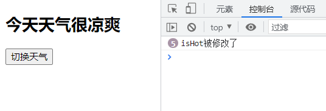

当被监视的属性值变化时，回调函数会自动调用，进行相应的处理，同时会向处理函数传入两个参数，第一个参数为改变后的值，第二个参数修改之前的值。

```js
    watch: {
      isHot: {
        // 当数据元素的值改变时，调用的处理函数为handler
        handler(newVal, oldVal) {
          console.log('isHot被修改了', '新的值为：', newVal, '旧的值为：', oldVal)
        }
      }
    }
```

> 

### 4.2 immediate

`immediate`，默认值为false。

immediate的值设置为true，初始化数据元素时，立即调用属性侦听器的回调函数handler()。

```js
    watch: {
      isHot: {
        // 初始化时，立即调用handler()
        immediate: true,
        // 当数据元素的值改变时，调用的处理函数为handler
        handler(newVal, oldVal) {
          console.log('isHot被修改了', '新的值为：', newVal, '旧的值为：', oldVal)
        }
      }
    }
```

> 

### 4.3 通过vue实例对象监视属性

> 这种写法用于最开始不知道要监视什么属性，后期知道要监视的属性，需要添加监视属性时使用。

```html
<!DOCTYPE html>
<html lang="en">
<head>
  <meta charset="UTF-8">
  <meta http-equiv="X-UA-Compatible" content="IE=edge">
  <meta name="viewport" content="width=device-width, initial-scale=1.0">
  <title>Document</title>
</head>
<body>
  <div id="root">
    <h2>今天天气很{{info}}</h2>
    <button @click="isHot = !isHot">切换天气</button>
  </div>
</body>
<script src="https://cdn.jsdelivr.net/npm/vue@2.6.14/dist/vue.js"></script>
<script>
  const vm = new Vue({
    el: '#root',
    data: {
      // 标记天气是否炎热
      isHot: true
    },
    computed: {
      info() {
        return this.isHot ? '炎热' : '凉爽'
      }
    }
  })

  // 使用vue实例监视属性必须保证vue实例已经创建完成
  // 调用$watch()方法实现
  // 第一个参数为需要进行监视的属性名
  // 第二个参数为对应的配置项
  vm.$watch('isHot', {
    // 初始化时，立即调用handler()
    immediate: true,
    // 当被监视的属性值变化时，回调函数会自动调用，进行相应的处理
    handler(newVal, oldVal) {
      console.log('isHot被修改了', '新的值为：', newVal, '旧的值为：', oldVal)
    }
  })
</script>
</html>
```

> 

### 4.4 深度监视

实现深度监视使用`deep`，默认值为false。vue提供的属性侦听器默认不能监视多级结构中某个属性的变化。

开启深度监视，能够监视多级结构中某个属性的变化。

> vue自身可以监测对象内部值的改变，即vue能够监视多级结构中某个属性的变化，但是vue提供的watch默认不可以。

```html
<!DOCTYPE html>
<html lang="en">
<head>
  <meta charset="UTF-8">
  <meta http-equiv="X-UA-Compatible" content="IE=edge">
  <meta name="viewport" content="width=device-width, initial-scale=1.0">
  <title>Document</title>
</head>
<body>
  <div id="root">
    <h2>a的值：{{num.a}}</h2>
    <button @click="num.a++">点击使a加一</button>
    <h2>b的值：{{num.b}}</h2>
    <button @click="num.b++">点击使b加一</button>
    <br><br>
    <button @click="num = {a: 666, b: 888}">点击修改num的值</button>
  </div>
</body>
<script src="https://cdn.jsdelivr.net/npm/vue@2.6.14/dist/vue.js"></script>
<script>
  const vm = new Vue({
    el: '#root',
    data: {
      isHot: true,
      num: {
        a: 1,
        b: 2
      }
    },
    watch: {
      // 监视num，当num里面的值修改了也视为num改变
      num: {
        deep: true,
        handler(newVal, oldVal) {
          console.log('num被修改了')
        }
      }
    }
  })
</script>
</html>
```

> 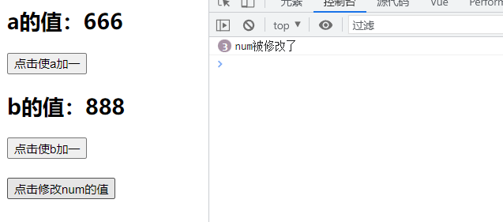

### 4.5 监视属性的简写

如果监视属性不需要设置初始化立即调用监视属性的回调函数，也不需要设置深度监视，可以使用监视属性的简写形式。

```html
<!DOCTYPE html>
<html lang="en">
<head>
  <meta charset="UTF-8">
  <meta http-equiv="X-UA-Compatible" content="IE=edge">
  <meta name="viewport" content="width=device-width, initial-scale=1.0">
  <title>Document</title>
</head>
<body>
  <div id="root">
    <h2>今天天气很{{info}}</h2>
    <button @click="isHot = !isHot">切换天气</button>
  </div>
</body>
<script src="https://cdn.jsdelivr.net/npm/vue@2.6.14/dist/vue.js"></script>
<script>
  const vm = new Vue({
    el: '#root',
    data: {
      isHot: true,
      num: {
        a: 1,
        b: 2
      }
    },
    computed: {
      info() {
        return this.isHot ? '炎热' : '凉爽'
      }
    },
    watch: {
      // 完整写法：
      // isHot: {
      //   // immediate: true,
      //   // deep: true,
      //   handler(newVal, oldVal) {
      //     console.log('isHot被修改了', '新的值为：', newVal, '旧的值为：', oldVal)
      //   }  
      // }

      // 如果监视属性不需要设置初始化立即调用监视属性的回调函数
      // 也不需要设置深度监视，可以使用监视属性的简写形式
      // 此时的函数相当于原来的handler()
      isHot(newVal, oldVal) {
        console.log('isHot被修改了', '新的值为：', newVal, '旧的值为：', oldVal)
      }
    }
  })
</script>
</html>
```

> 

### 4.6 $watch()监视属性的简写

```html
<!DOCTYPE html>
<html lang="en">
<head>
  <meta charset="UTF-8">
  <meta http-equiv="X-UA-Compatible" content="IE=edge">
  <meta name="viewport" content="width=device-width, initial-scale=1.0">
  <title>Document</title>
</head>
<body>
  <div id="root">
    <h2>今天天气很{{info}}</h2>
    <button @click="isHot = !isHot">切换天气</button>
  </div>
</body>
<script src="https://cdn.jsdelivr.net/npm/vue@2.6.14/dist/vue.js"></script>
<script>
  const vm = new Vue({
    el: '#root',
    data: {
      isHot: true,
      num: {
        a: 1,
        b: 2
      }
    },
    computed: {
      info() {
        return this.isHot ? '炎热' : '凉爽'
      }
    }
  })

  // 完整写法：
  // vm.$watch('isHot', {
  //   // immediate: true,
  //   // deep: true,
  //   handler(newVal, oldVal) {
  //     console.log('isHot被修改了', '新的值为：', newVal, '旧的值为：', oldVal)
  //   }  
  // })

  // 简写形式
  vm.$watch('isHot', function() {
    console.log('isHot被修改了', '新的值为：', newVal, '旧的值为：', oldVal)
  })
</script>
</html>
```

> 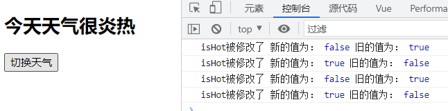

### 4.7 监视属性实现天气案例

```html
<!DOCTYPE html>
<html lang="en">
<head>
  <meta charset="UTF-8">
  <meta http-equiv="X-UA-Compatible" content="IE=edge">
  <meta name="viewport" content="width=device-width, initial-scale=1.0">
  <title>Document</title>
</head>
<body>
  <div id="root">
    <h2>今天天气很{{info}}</h2>
    <button @click="isHot = !isHot">切换天气</button>
  </div>
</body>
<script src="https://cdn.jsdelivr.net/npm/vue@2.6.14/dist/vue.js"></script>
<script>
  const vm = new Vue({
    el: '#root',
    data: {
      isHot: true,
      info: ''
    },
    watch: {
      isHot: {
        immediate: true,
        handler(newVal) {
          this.info = newVal ? '炎热' : '凉爽'
          console.log('当前的天气为：', this.info)
        }
      }
    }
  })
</script>
</html>
```

> 

## 5. 监视属性与计算属性的对比

computed和watch之间的区别：

​            1.computed能完成的功能，watch都可以完成。

​            2.watch能完成的功能，computed不一定能完成，例如：watch可以进行异步操作。

​        两个重要的小原则：

​              1.所被Vue管理的函数，最好写成普通函数，这样this的指向才是vm 或 组件实例对象。

​              2.所有不被Vue所管理的函数（定时器的回调函数、ajax的回调函数等、Promise的回调函数），最好写成箭头函数，

​                这样this的指向才是vm 或 组件实例对象。


### 5.1 监视属性实现姓名案例

```html
<!DOCTYPE html>
<html lang="en">
<head>
  <meta charset="UTF-8">
  <meta http-equiv="X-UA-Compatible" content="IE=edge">
  <meta name="viewport" content="width=device-width, initial-scale=1.0">
  <title>Document</title>
</head>
<body>
  <div id="root">
    姓：<input type="text" v-model="firstname"> <br><br>
    名：<input type="text" v-model="lastname"> <br><br>
    姓名：<span>{{fullname}}</span>
  </div>
</body>
<script src="https://cdn.jsdelivr.net/npm/vue@2.6.14/dist/vue.js"></script>
<script>
  const vm = new Vue({
    el: '#root',
    data: {
      firstname: '张',
      lastname: '三',
      fullname: '张-三'
    },
    watch: {
      firstname(newVal) {
        this.fullname = newVal + '-' + this.lastname
      },
      lastname(newVal) {
        this.fullname = this.firstname + '-' + newVal
      }
    }
  })
</script>
</html>
```

> 

### 5.2 案例结果显示延时

#### 5.2.1 监视属性实现

```html
<!DOCTYPE html>
<html lang="en">
<head>
  <meta charset="UTF-8">
  <meta http-equiv="X-UA-Compatible" content="IE=edge">
  <meta name="viewport" content="width=device-width, initial-scale=1.0">
  <title>Document</title>
</head>
<body>
  <div id="root">
    姓：<input type="text" v-model="firstname"> <br><br>
    名：<input type="text" v-model="lastname"> <br><br>
    姓名：<span>{{fullname}}</span>
  </div>
</body>
<script src="https://cdn.jsdelivr.net/npm/vue@2.6.14/dist/vue.js"></script>
<script>
  const vm = new Vue({
    el: '#root',
    data: {
      firstname: '张',
      lastname: '三',
      fullname: '张-三'
    },
    watch: {
      firstname(newVal) {
        // 定时器中的this
        // 由于箭头函数没有自己的this
        // 所以会向外寻找this，firstname()有自己的this，指向vue实例对象
        // vue实例对象上的函数都有自己this，指向vue实例对象
        // 如果vue实例对象上的函数写成箭头函数，则由原来的有自己的this变为没有自己的this
        // 此时this指向Windows
        setTimeout(()=>{
          // 这里指向vue实例对象，是由于外层的函数有this且指向vue实例对象
          this.fullname = newVal + '-' + this.lastname
        }, 1000)
      },
      lastname(newVal) {
        setTimeout(()=>{
          this.fullname = this.firstname + '-' + newVal
        }, 1000)
      }
    }
  })
</script>
</html>
```

> 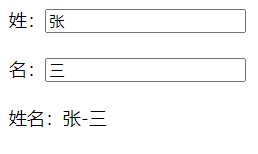

#### 5.2.2 计算属性实现

```html
<!DOCTYPE html>
<html lang="en">
<head>
  <meta charset="UTF-8">
  <meta http-equiv="X-UA-Compatible" content="IE=edge">
  <meta name="viewport" content="width=device-width, initial-scale=1.0">
  <title>Document</title>
</head>
<body>
  <div id="root">
    姓：<input type="text" v-model="firstname"> <br><br>
    名：<input type="text" v-model="lastname"> <br><br>
    姓名：<span>{{fullname}}</span>
  </div>
</body>
<script src="https://cdn.jsdelivr.net/npm/vue@2.6.14/dist/vue.js"></script>
<script>
  const vm = new Vue({
    el: '#root',
    data: {
      firstname: '张',
      lastname: '三',
    },
    computed: {
      fullname() {
        // 由于计算属性需要一个返回值
        // 但是延时需要在setTimeout中的回调函数进行处理
        // 处理后的返回值无法进行接收，所有该功能无法实现
        setTimeout(()=>{
          return this.firstname + '-' + this.lastname
        }, 1000)
        return 123
      }
    }
  })
</script>
</html>
```

> 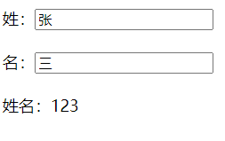

```js
    computed: {
      fullname() {
        // 使用如下的写法
        // 由于定时器的回调函数执行时间在return之后，所以还是无法实现需求
        let t = ''
        //这里写成箭头函数的原因：
        //箭头函数没有自己的this,因此这里使用this时，会向外寻找，向外寻找到fullName，fullName的this是vm，因此这里箭头函数的this是vm。如果写成普通函数，this就会指向setTimeout所在的对象，也就是window对象。
        setTimeout(()=>{
          t = this.firstname + '-' + this.lastname
        }, 1000)
        return t
      }
    }
```

### 5.3 监视属性与计算属性的对比总结

- computed和watch之间的区别：
  - computed能完成的功能，watch都可以完成
  - watch能完成的功能，computed不一定能完成，例如：watch可以进行异步操作
- 两个重要的小原则：
  - 所有被Vue管理的函数，最好写成普通函数，这样this的指向才是vue实例对象或 组件实例对象
  - 所有不被Vue所管理的函数（定时器的回调函数、ajax的回调函数等、Promise的回调函数），最好写成箭头函数，这样this的指向才是vue实例对象或 组件实例对象。

# 12.样式绑定

绑定样式：

​          1. class样式

​                写法:class="xxx" xxx可以是字符串、对象、数组。

​                    字符串写法适用于：类名不确定，要动态获取。

​                    对象写法适用于：要绑定多个样式，个数不确定，名字也不确定。

​                    数组写法适用于：要绑定多个样式，个数确定，名字也确定，但不确定用不用。

​          2. style样式

​                :style="{fontSize: xxx}"其中xxx是动态值。

​                :style="[a,b]"其中a、b是样式对象。

------

## 1. 绑定class样式

### 1.1 class 样式

```html
		<style>
			/* 继承样式 */
			.basic{
				width: 400px;
				height: 100px;
				border: 1px solid black;
			}
			/* 心情样式 */
			.happy{
				border: 4px solid red;;
				background-color: rgba(255, 255, 0, 0.644);
				background: linear-gradient(30deg,yellow,pink,orange,yellow);
			}
			.sad{
				border: 4px dashed rgb(2, 197, 2);
				background-color: gray;
			}
			.normal{
				background-color: skyblue;
			}

			.atguigu1{
				background-color: yellowgreen;
			}
			.atguigu2{
				font-size: 30px;
				text-shadow:2px 2px 10px red;
			}
			.atguigu3{
				border-radius: 20px;
			}
		</style>
```

### 1.2 绑定class样式字符串写法

> 字符串写法适用于样式类名不确定需要动态指定的情况

```html
<!DOCTYPE html>
<html lang="en">
<head>
  <meta charset="UTF-8">
  <meta http-equiv="X-UA-Compatible" content="IE=edge">
  <meta name="viewport" content="width=device-width, initial-scale=1.0">
  <title>Document</title>
  <style>
    /*  */
    .basic{
      width: 400px;
      height: 100px;
      border: 1px solid black;
    }
    
    .happy{
      border: 4px solid red;;
      background-color: rgba(255, 255, 0, 0.644);
      background: linear-gradient(30deg,yellow,pink,orange,yellow);
    }
    .sad{
      border: 4px dashed rgb(2, 197, 2);
      background-color: gray;
    }
    .normal{
      background-color: skyblue;
    }

    .atguigu1{
      background-color: yellowgreen;
    }
    .atguigu2{
      font-size: 30px;
      text-shadow:2px 2px 10px red;
    }
    .atguigu3{
      border-radius: 20px;
    }
  </style>
</head>
<body>
  <div id="root">
    <!-- 盒子具有默认样式basic normal -->
    <!-- :class 用于动态绑定样式 字符串写法  适用于样式类名不确定需要动态指定 -->
    <!-- 点击该盒子时候样式会发生改变，随机修改心情样式 -->
    <div class="basic" :class="mood" @click="changeMood">{{name}}</div>
  </div>
</body>
<script src="https://cdn.jsdelivr.net/npm/vue@2.6.14/dist/vue.js"></script>
<script>
  const vm = new Vue({
    el: '#root',
    data: {
      name: 'zszszs',
      // 默认的心情样式为normal
      mood: 'normal'
    },
    methods: {
      changeMood() {
        // 汇总已有的心情样式
        const moodArr = ['normal', 'sad', 'happy']
        // 随机生成 0 1 2
        const idx = Math.floor(Math.random()*3)
        // 修改心情
        this.mood = moodArr[idx]
      }
    },
  })
</script>
</html>
```

> 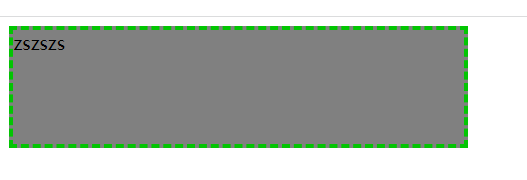

### 1.3 绑定class样式数组写法

> 数组写法适用于要绑定的样式个数不确定、名字也不确定的情况

```html
<!DOCTYPE html>
<html lang="en">
<head>
  <meta charset="UTF-8">
  <meta http-equiv="X-UA-Compatible" content="IE=edge">
  <meta name="viewport" content="width=device-width, initial-scale=1.0">
  <title>Document</title>
  <style>
    /*  */
    .basic{
      width: 400px;
      height: 100px;
      border: 1px solid black;
    }
    
    .happy{
      border: 4px solid red;;
      background-color: rgba(255, 255, 0, 0.644);
      background: linear-gradient(30deg,yellow,pink,orange,yellow);
    }
    .sad{
      border: 4px dashed rgb(2, 197, 2);
      background-color: gray;
    }
    .normal{
      background-color: skyblue;
    }

    .atguigu1{
      background-color: yellowgreen;
    }
    .atguigu2{
      font-size: 30px;
      text-shadow:2px 2px 10px red;
    }
    .atguigu3{
      border-radius: 20px;
    }
  </style>
</head>
<body>
  <div id="root">
    <!-- :class 用于动态绑定样式  字符串写法  适用于样式类名不确定需要动态指定 -->
    <div class="basic" :class="mood" @click="changeMood">{{name}}</div> <br>

    <!-- :class 用于动态绑定样式  数组写法  适用于要绑定的样式个数不确定、名字也不确定 -->
    <!-- 数组写法改变样式，可以对数组中的样式名元素就行修改操作，移除或添加 -->
    <div class="basic" :class="classArr" @click="changeMood">{{name}}</div>
  </div>
</body>
<script src="https://cdn.jsdelivr.net/npm/vue@2.6.14/dist/vue.js"></script>
<script>
  const vm = new Vue({
    el: '#root',
    data: {
      name: 'zszszs',
      // 默认的心情样式为 normal
      mood: 'normal',
      // 样式数组
      classArr: ['atguigu1', 'atguigu2', 'atguigu3']
    },
    methods: {
      changeMood() {
        const moodArr = ['normal', 'sad', 'happy']
        const idx = Math.floor(Math.random()*3)
        this.mood = moodArr[idx]
      }
    },
  })
</script>
</html>
```

> 

### 1.4 绑定class样式对象写法

> 对象写法适用于要绑定的样式个数确定、名字确定，但是需要动态决定样式用不用的情况

```html
<!DOCTYPE html>
<html lang="en">
<head>
  <meta charset="UTF-8">
  <meta http-equiv="X-UA-Compatible" content="IE=edge">
  <meta name="viewport" content="width=device-width, initial-scale=1.0">
  <title>Document</title>
  <style>
    /*  */
    .basic{
      width: 400px;
      height: 100px;
      border: 1px solid black;
    }
    
    .happy{
      border: 4px solid red;;
      background-color: rgba(255, 255, 0, 0.644);
      background: linear-gradient(30deg,yellow,pink,orange,yellow);
    }
    .sad{
      border: 4px dashed rgb(2, 197, 2);
      background-color: gray;
    }
    .normal{
      background-color: skyblue;
    }

    .atguigu1{
      background-color: yellowgreen;
    }
    .atguigu2{
      font-size: 30px;
      text-shadow:2px 2px 10px red;
    }
    .atguigu3{
      border-radius: 20px;
    }
  </style>
</head>
<body>
  <div id="root">
    <!-- :class 用于动态绑定样式  字符串写法  适用于样式类名不确定需要动态指定 -->
    <div class="basic" :class="mood" @click="changeMood">{{name}}</div> <br>

    <!-- :class 用于动态绑定样式  数组写法  适用于要绑定的样式个数不确定、名字也不确定 -->
    <div class="basic" :class="classArr" >{{name}}</div> <br>

    <!-- :class 用于动态绑定样式  对象写法  适用于要绑定的样式个数确定、名字确定，但是需要动态决定用不用 -->
    <div class="basic" :class="classObj" >{{name}}</div>
  </div>
</body>
<script src="https://cdn.jsdelivr.net/npm/vue@2.6.14/dist/vue.js"></script>
<script>
  const vm = new Vue({
    el: '#root',
    data: {
      name: 'zszszs',
      // 默认的心情样式为 normal
      mood: 'normal',
      // 样式数组
      classArr: ['atguigu1', 'atguigu2', 'atguigu3'],
      // 样式对象
      // 默认样式都不使用
      // 需要使用的样式只需要将样式对应的值更改为true即可
      classObj: {
        atguigu1: false,
        atguigu2: false,
        atguigu3: false
      }
    },
    methods: {
      changeMood() {
        const moodArr = ['normal', 'sad', 'happy']
        const idx = Math.floor(Math.random()*3)
        this.mood = moodArr[idx]
      }
    },
  })
</script>
</html>
```

> 

## 2. 绑定style样式

### 2.1 绑定style样式对象写法

绑定style样式对象写法，style样式对象写在data中，对象中写样式及其对应的值。

> 如果原来的样式不同单词之间使用`-`进行连接，需要更改为小驼峰的写法。如：`font-size` 改写为 `fontSize`

```html
<!DOCTYPE html>
<html lang="en">
<head>
  <meta charset="UTF-8">
  <meta http-equiv="X-UA-Compatible" content="IE=edge">
  <meta name="viewport" content="width=device-width, initial-scale=1.0">
  <title>Document</title>
  <style>
    /* 基础样式 */
    .basic{
      width: 400px;
      height: 100px;
      border: 1px solid black;
    }
  </style>
</head>
<body>
  <div id="root">
    <div class="basic" :style="styleObj">{{name}}</div>
  </div>
</body>
<script src="https://cdn.jsdelivr.net/npm/vue@2.6.14/dist/vue.js"></script>
<script>
  const vm = new Vue({
    el: '#root',
    data: {
      name: 'ZSZSZS',
      // style样式
      styleObj: {
        fontSize: '40px',
        color: 'red'
      }
    }
  })
</script>
</html>
```

> 

### 2.2 绑定style样式数组写法

#### 2.2.1 写法1

```html
<!DOCTYPE html>
<html lang="en">
<head>
  <meta charset="UTF-8">
  <meta http-equiv="X-UA-Compatible" content="IE=edge">
  <meta name="viewport" content="width=device-width, initial-scale=1.0">
  <title>Document</title>
  <style>
    /* 基础样式 */
    .basic{
      width: 400px;
      height: 100px;
      border: 1px solid black;
    }
  </style>
</head>
<body>
  <div id="root">
    <div class="basic" :style="[styleObj1, styleObj2]">{{name}}</div>
  </div>
</body>
<script src="https://cdn.jsdelivr.net/npm/vue@2.6.14/dist/vue.js"></script>
<script>
  const vm = new Vue({
    el: '#root',
    data: {
      name: 'ZSZSZS',
      styleObj1: {
        fontSize: '40px',
        color: 'red'
      },
      styleObj2: {
        backgroundColor: 'orange'
      }
    }
  })
</script>
</html>
```

> 

#### 2.2.2 写法2

```html
<!DOCTYPE html>
<html lang="en">
<head>
  <meta charset="UTF-8">
  <meta http-equiv="X-UA-Compatible" content="IE=edge">
  <meta name="viewport" content="width=device-width, initial-scale=1.0">
  <title>Document</title>
  <style>
    /* 基础样式 */
    .basic{
      width: 400px;
      height: 100px;
      border: 1px solid black;
    }
  </style>
</head>
<body>
  <div id="root">
    <div class="basic" :style="styleArr">{{name}}</div>
  </div>
</body>
<script src="https://cdn.jsdelivr.net/npm/vue@2.6.14/dist/vue.js"></script>
<script>
  const vm = new Vue({
    el: '#root',
    data: {
      name: 'ZSZSZS',
      styleArr: [
        {
          fontSize: '40px',
          color: 'black'
        },
        {
          backgroundColor: 'red'
        }
      ]
    }
  })
</script>
</html>
```

> 


