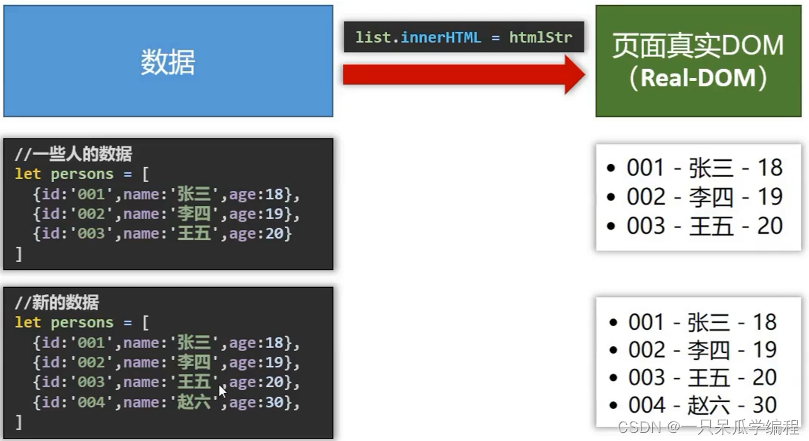

# 简介

## 1. 官网

1. 英文官网: https://vuejs.org/
2. 中文官网: https://cn.vuejs.org/

## 2. 介绍与描述

1. vue是一套用于动态构建用户界面的渐进式 JavaScript 框架
   渐进式：vue可以自底向上逐层的应用
   由一个个组件类似拼积木，逐层向上搭建，最后搭建出一个网页
2. 作者：尤雨溪

## 3. Vue的特点

### 3.1. 采用组件化模式，提高代码的复用率，让代码易于维护。

1. 组件化：
   将页面拆分成不同的部分，每个部分为一个组件，每个组件为一个单独的vue文件，每个vue文件的标签、样式、交互进行分开管理
2. 提高代码的复用率：当其他的页面也需要使用相同的组件时，直接引入写好的对应的组件即可
3. 代码易于维护：每个vue文件不同组件的标签、样式、交互进行单独管理，不会互相影响

### 3.2. 声明式编码，无需操作DOM，提高开发效率。

命令式编码：即一条命令实现对应的步骤，一个命令一个步骤
声明式编码：只需声明数据，然后将数据写入对应的标签位置即可

### 4. 使用虚拟DOM和Diff算法复用DOM

使用原生js将数据渲染到页面，当数据发生变化时，需要手动进行判断那些数据时新数据，重新进行渲染，或者将页面中的数据先进行删除再重新渲染改变后的数据。

vue会先把数据放到虚拟DOM中，再渲染到页面，当数据发生变化vue会使用Diff算法将新的虚拟DOM与旧虚拟DOM进行比较，数据没有变化的DOM继续复用即不发生改变，而新数据的DOM会将其渲染到页面对应的位置。

### 3.4. 遵循 MVVM 模式

MVVM是vue实现数据驱动视图和双向数据绑定的核心原理。

它把每个HTML页面拆分成三个部分：
**M**odel：当前页面渲染时所依赖的数据源。
**V**iew：当前页面所渲染的DOM结构。
**V**iew**M**odel：vue实例，MVVM的核心。

MVVM的工作原理：
ViewModel作为MVVM的核心，是它把当前页面的数据源(Model)和页面的结构(View)连接在了一起。

当数据源发生变化时，会被ViewModel监听到，VM会根据最新的数据源自动更新页面的结构。

当表单元素的值发生变化时，也会被VM监听到，VM会把变化过后最新的值自动同步到Model数据源中。

### 3.5. 编码简洁, 体积小, 运行效率高, 适合移动/PC端开发

### 3.6. 它本身只关注 UI, 也可以引入其它第三方库开发项目

1. vue-cli: vue 脚手架
2. vue-resource
3. axios
4. vue-router: 路由
5. vuex: 状态管理
6. element-ui: 基于 vue 的 UI 组件库(PC 端)
7. …

## 4. vue的特性

vue框架的特性主要体现在：

> 1.数据驱动视图
>
> > 使用vue的页面中，vue会监听数据的变化，自动重新渲染页面的结构(**数据驱动视图是单向的数据绑定**)
> > 
> > 数据发生变化，页面会自动重新渲染
>
> 2.双向数据绑定
>
> > 在填写表单时，双向数据绑定可以辅助开发者在不操作dom的前提下自动把用户填写的内容同步到数据源，开发者不用再手动操作dom
> > 

## 5. vue的版本

当前，vue 共有3个大版本，其中：

> 2.x版本的vue是目前企业级项目开发中的主流版本
> 3.x版本的vue 于 2020-09-19发布，生态还不完善，尚未在企业级项目开发中普及和推广
> 1.x版本的vue只乎被淘汰，不再建议学习与使用

vue3.x和vue2.x版本的对比：

> vue2.x中绝大多数的API与特性，在vue3.x中同样支持。同时，vue3.x中还新增了3.x所特有的功能、并废弃了某些2.x中的旧功能
>
> > 新增的功能例如:
> > 组合式API、多根节点组件、更好的 TypeScript支持等
>
> > 废弃的旧功能如下:
> > 过滤器、不再支持$on，$off和$once 实例方法等
>
> [详细的变更信息，请参考官方文档给出的迁移指南](https://v3.vuejs.org/guide/ migration/introduction.html)

## 6. 学习Vue之前要掌握的JavaScript基础知识

1. ES6语法规范
2. ES6模块化
3. 包管理器(npm yarn …) 一个即可
4. 原型、原型链
5. 数组常用方法
6. axios
7. promise

