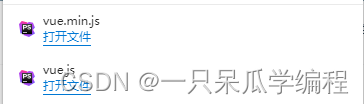
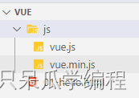
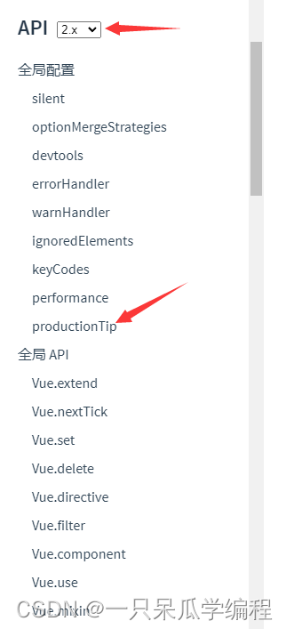

# 开发环境搭建

## 1. Vue Devtools

直接在谷歌插件商店里可以搜到


## 2. 下载并在页面引入 Vue

### 2.1 Vue的下载


> ps：后面会使用 vue-cli 或 vite（脚手架）直接构建 vue 项目，不用手动引入 vue。

> 下载的 vue 文件
> 
> 

### 2.2 Vue的引入

```html
<!DOCTYPE html>
<html lang="en">
<head>
  <meta charset="UTF-8">
  <meta http-equiv="X-UA-Compatible" content="IE=edge">
  <meta name="viewport" content="width=device-width, initial-scale=1.0">
  <title>Document</title>
</head>
<body>
  
  <!-- 引入下载的 vue -->
  <!-- <script src="./js/vue.js"></script> -->
  <!-- 使用CDN引入 -->
  <script src="https://cdn.jsdelivr.net/npm/vue@2.6.14/dist/vue.js"></script>
</body>
</html>
```

### 2.3 页面控制台警告提示解决

> 





```html
<!DOCTYPE html>
<html lang="en">
<head>
  <meta charset="UTF-8">
  <meta http-equiv="X-UA-Compatible" content="IE=edge">
  <meta name="viewport" content="width=device-width, initial-scale=1.0">
  <title>Document</title>
</head>
<body>
  
  
  <!-- 引入下载的 vue -->
  <script src="./js/vue.js"></script>
  <!-- 使用CDN引入 -->
  <!-- <script src="https://cdn.jsdelivr.net/npm/vue@2.6.14/dist/vue.js"></script> -->
  <script>
    Vue.config.productionTip = false
  </script>
</body>
</html>
```


