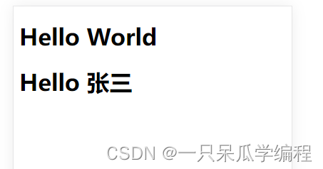
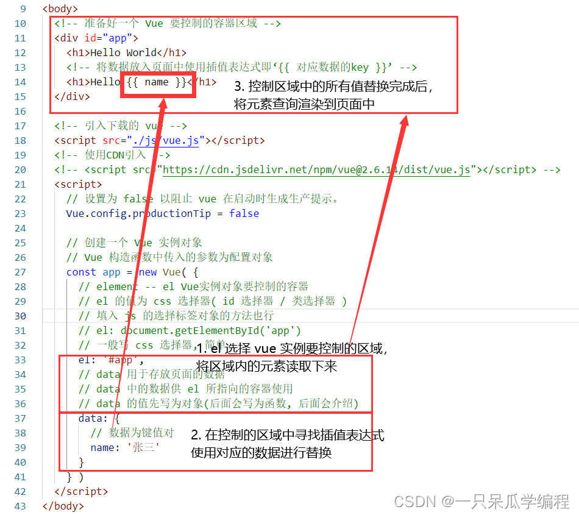
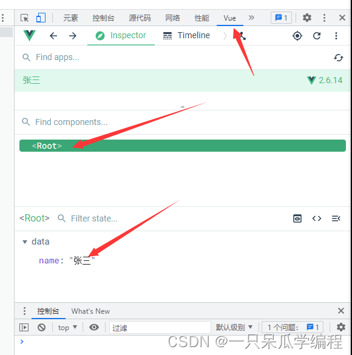
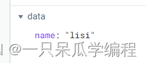

# 初始Vue--HelloWorld引入案例

------

## 1. Hello World 引入案例

1. 准备好一个 Vue 要控制的容器区域
2. 创建一个 Vue 实例对象
3. 选择 Vue 实例对象要控制的容器

```html
<!DOCTYPE html>
<html lang="en">
<head>
  <meta charset="UTF-8">
  <meta http-equiv="X-UA-Compatible" content="IE=edge">
  <meta name="viewport" content="width=device-width, initial-scale=1.0">
  <title>Document</title>
</head>
<body>
  <!-- 准备好一个 Vue 要控制的容器区域 -->
  <div id="app">
    <h1>Hello World</h1>
  </div>
  
  <!-- 引入下载的 vue -->
  <script src="./js/vue.js"></script>
  <!-- 使用CDN引入 -->
  <!-- <script src="https://cdn.jsdelivr.net/npm/vue@2.6.14/dist/vue.js"></script> -->
  <script>
    // 设置为 false 以阻止 vue 在启动时生成生产提示。
    Vue.config.productionTip = false

    // 创建一个 Vue 实例对象
    // Vue 构造函数中传入的参数为配置对象
    const app = new Vue( {
      // element -- el Vue实例对象要控制的容器
      // el 的值为 css 选择器( id 选择器 / 类选择器 )
      // 填入 js 的选择标签对象的方法也行
      // el: document.getElementById('app')
      // 一般写 css 选择器, 简单
      el: '#app'
    } )
  </script>
</body>
</html>
```


## 2. Vue 对页面数据的控制

1. 准备好 data 用于存放页面的数据
2. 将数据放入页面中使用插值表达式(后面会介绍)即 ‘{{ 对应数据的key }}’

```html
<!DOCTYPE html>
<html lang="en">
<head>
  <meta charset="UTF-8">
  <meta http-equiv="X-UA-Compatible" content="IE=edge">
  <meta name="viewport" content="width=device-width, initial-scale=1.0">
  <title>Document</title>
</head>
<body>
  <!-- 准备好一个 Vue 要控制的容器区域 -->
  <div id="app">
    <h1>Hello World</h1>
    <!-- 将数据放入页面中使用插值表达式即‘{{ 对应数据的key }}’ -->
    <h1>Hello {{ name }}</h1>
  </div>
  
  <!-- 引入下载的 vue -->
  <script src="./js/vue.js"></script>
  <!-- 使用CDN引入 -->
  <!-- <script src="https://cdn.jsdelivr.net/npm/vue@2.6.14/dist/vue.js"></script> -->
  <script>
    // 设置为 false 以阻止 vue 在启动时生成生产提示。
    Vue.config.productionTip = false

    // 创建一个 Vue 实例对象
    // Vue 构造函数中传入的参数为配置对象
    const app = new Vue( {
      // element -- el Vue实例对象要控制的容器
      // el 的值为 css 选择器( id 选择器 / 类选择器 )
      // 填入 js 的选择标签对象的方法也行
      // el: document.getElementById('app')
      // 一般写 css 选择器, 简单
      el: '#app',
      // data 用于存放页面的数据
      // data 中的数据供 el 所指向的容器使用
      // data 的值先写为对象(后面会写为函数, 后面会介绍)
      data: {
        // 数据为键值对
        name: '张三'
      }
    } ) 
  </script>
</body>
</html>
```



## 3. Vue 实例对象与对应控制区域的对应关系

### 3.1 一个 Vue 实例对象能否控制多个区域(容器)

```html
<!DOCTYPE html>
<html lang="en">
<head>
  <meta charset="UTF-8">
  <meta http-equiv="X-UA-Compatible" content="IE=edge">
  <meta name="viewport" content="width=device-width, initial-scale=1.0">
  <title>Document</title>
</head>
<body>
  <!-- 准备好一个 Vue 要控制的容器区域 -->
  <div class="app">
    <h1>Hello World -- 1</h1>
    <!-- 将数据放入页面中使用插值表达式即‘{{ 对应数据的key }}’ -->
    <h1>Hello {{ name }}</h1>
  </div>
  <br>
  <div class="app">
    <h1>Hello World -- 2</h1>
    <!-- 将数据放入页面中使用插值表达式即‘{{ 对应数据的key }}’ -->
    <h1>Hello {{ name }}</h1>
  </div>
  
  <!-- 引入下载的 vue -->
  <script src="./js/vue.js"></script>
  <script>
    // 设置为 false 以阻止 vue 在启动时生成生产提示。
    Vue.config.productionTip = false

    // 创建一个 Vue 实例对象
    const app = new Vue( {
      el: '.app',
      data: {
        name: '张三'
      }
    } ) 
  </script>
</body>
</html>
```


> 一个 Vue 实例对象只能控制一个区域，一个 Vue 实例对象只控制对应的第一个区域

### 3.2 一个容器能否由多个 Vue 实例控制

```html
<!DOCTYPE html>
<html lang="en">
<head>
  <meta charset="UTF-8">
  <meta http-equiv="X-UA-Compatible" content="IE=edge">
  <meta name="viewport" content="width=device-width, initial-scale=1.0">
  <title>Document</title>
</head>
<body>
  <!-- 准备好一个 Vue 要控制的容器区域 -->
  <div class="app">
    <h1>Hello World -- 1</h1>
    <h1>Hello {{ name }}</h1>
  </div>
  
  <!-- 引入下载的 vue -->
  <script src="./js/vue.js"></script>
  <script>
    // 设置为 false 以阻止 vue 在启动时生成生产提示。
    Vue.config.productionTip = false

    // 创建一个 Vue 实例对象
    const app1 = new Vue( {
      el: '.app',
      data: {
        name: '张三'
      }
    } ) 
  </script>

  <script>
    // 设置为 false 以阻止 vue 在启动时生成生产提示。
    Vue.config.productionTip = false

    // 创建一个 Vue 实例对象
    const app2 = new Vue( {
      el: '.app',
      data: {
        name: '李四'
      }
    } ) 
  </script>
</body>
</html>
```


> 一个容器只由一个 Vue 实例进行控制，一个容器只由第一个 Vue 实例进行控制

> 由上述可得：
> Vue实例和容器是一 一对应的

## 4. 根据 Hello World 案例进行分析

### 4.1 插值语法中可以书写的数据格式

插值语法`{{}}`中可以书写js表达式。

表达式：
一个表达式会产生一个值，可以放在任何一个需要值的地方。
如：
（1）a
（2）a+b
（3）demo(1)
（4）x === y ? ‘a’ : ‘b’

### 4.2 根据案例进行分析



### 4.3 Vue 的 data 中数据发生变化，页面会发生对应的更新

打开 vue devtools 查看组件变量






## 5. 总结

1. 想让 Vue 工作，就必须创建一个 Vue 实例，且要传入一个配置对象;
2. app 容器里的代码依然符合 html 规范，只不过混入了一些特殊的 Vue 语法;
3. app 容器里的代码被称为【Vue模板】
4. Vue实例和容器是一一对应的;
5. 真实开发中只有一个Vue实例，并且会配合着组件一起使用;
6. {{xxx}} 中的xxx要写js表达式，且xxx可以自动读取到data中的所有属性
7. 一旦data中的数据发生改变，那么页面中用到该数据的地方也会自动更新;

