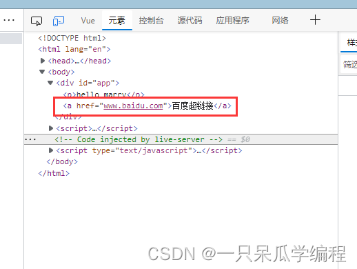
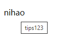
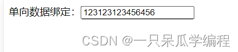
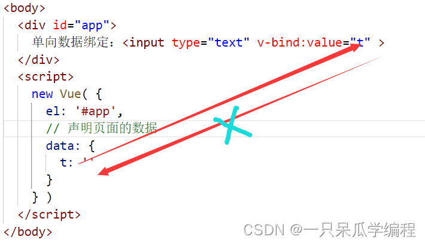

# 模板语法

## 1. Vue模板语法的分类

Vue模板语法主要分为两类：

1. 插值语法
2. 指令语法( v- 开头 )

## 2. 插值语法

### 2.1 引入

```html
<!DOCTYPE html>
<html lang="en">
<head>
  <meta charset="UTF-8">
  <meta http-equiv="X-UA-Compatible" content="IE=edge">
  <meta name="viewport" content="width=device-width, initial-scale=1.0">
  <title>Document</title>
  <script src="./js/vue.js"></script>
</head>
<body>
  <div id="app">
    <p>hello jack</p>
  </div>
  <script>
    new Vue( {
      el: '#app'
    } )
  </script>
</body>
</html>
```


### 2.2 插值语法实现

> 想要实现对 hello 后面名字的动态控制，就需要使用 vue 提供的插值语法 ---- 插值表达式 – {{}}。

> 使用{{}}可以将对应的值渲染到元素的内容节点中。

> 语法: `{{xxx}}`

```html
<!DOCTYPE html>
<html lang="en">
<head>
  <meta charset="UTF-8">
  <meta http-equiv="X-UA-Compatible" content="IE=edge">
  <meta name="viewport" content="width=device-width, initial-scale=1.0">
  <title>Document</title>
  <script src="./js/vue.js"></script>
</head>
<body>
  <div id="app">
    <p>hello {{name}}</p>
  </div>
  <script>
    new Vue( {
      el: '#app',
      // 声明页面的数据
      data: {
        name: 'marry'
      }
    } )
  </script>
</body>
</html>
```


### 2.3 插值语法中书写js表达式

> 在vue提供的插值语法中，除了支持绑定简单的数据值外，还支持JavaScript表达式运算。

用法示例：

```html
<!DOCTYPE html>
<html lang="en">
<head>
    <meta charset="UTF-8">
    <meta name="viewport" content="width=device-width, initial-scale=1.0">
    <title>Document</title>
</head>
<body>
    <div id="app">
        <!-- 字符串的拼接 -->
        <p>{{ tips + '1' }}</p>
        <!-- ok未定义undefined 为false -->
        <p>{{ ok ? '1' : '2' }}</p>
        <!-- 字符串的反转 -->
        <p>{{ tips.split('').reverse().join('') }}</p>
    </div>
    <script src="https://cdn.jsdelivr.net/npm/vue@2/dist/vue.js"></script>
    <script>
        const vm = new Vue({
            el: "#app",
            data: {
                tips: "请输入..."
            }
        })
    </script>
</body>
</html>
```

> 

## 3. Vue指令

### 3.1 指令的概念

指令是Vue为开发者提供的模板语法，用于辅助开发者渲染页面的基本结构。

### 3.2 指令的分类

指令按照不同的用途可以分为如下6大类：

1. 内容渲染指令
2. 属性绑定指令
3. 事件绑定指令
4. 双向绑定指令
5. 条件渲染指令
6. 列表渲染指令

## 4. 内容渲染指令

> 插值语法是内容渲染指令中的一部分。

内容渲染指令是用来辅助开发者渲染DOM元素中的文本内容。

### 4.1常用的内容渲染指令：

> 1.v-text
> 2.{{ }}
> 3.v-html

### 4.2 v-text

用法示例：

```html
<!DOCTYPE html>
<html lang="en">
<head>
    <meta charset="UTF-8">
    <meta name="viewport" content="width=device-width, initial-scale=1.0">
    <title>Document</title>
</head>
<body>
    <div id="app">
        <!-- 要渲染的DOM -->
        <p v-text="username"></p>
    </div>
    <script src="https://cdn.jsdelivr.net/npm/vue@2/dist/vue.js"></script>
    <script>
        const vm = new Vue({
            el: '#app',
            // 要渲染的数据
            data: {
                username: '张三'
            }
        })
    </script>
</body>
</html>
```

> 

v-text的缺点：**会覆盖元素内部原有的内容**

### 4.3 {{}} 插值表达式

vue提供的{{}}语法是用来解决v-text会覆盖默认文本内容的问题，这种{{}}语法的专业名称是插值表达式。{{}}在实际开发中用的最多，只是内容的占位符，不会覆盖原有的内容。使用{{}}可以将对应的值渲染到元素的内容节点中。

用法示例：

```html
<!DOCTYPE html>
<html lang="en">
<head>
    <meta charset="UTF-8">
    <meta name="viewport" content="width=device-width, initial-scale=1.0">
    <title>Document</title>
</head>
<body>
    <div id="app">
        <p>姓名：{{ username }}</p>
        <p>性别：{{ gender }}</p>
    </div>

    <script src="https://cdn.jsdelivr.net/npm/vue@2/dist/vue.js"></script>
    <script>
        const vm = new Vue({
            el: '#app',
            data: {
                username: "lisi",
                gender: "男"
            }
        })
    </script>
</body>
</html>
```

> 

### 4.4 v-html

v-text和{{}}只能渲染纯文本内容，如果要把包含html标签的字符串渲染为页面的html元素，需要使用v-html。

用法示例：

```html
<!DOCTYPE html>
<html lang="en">
<head>
    <meta charset="UTF-8">
    <meta name="viewport" content="width=device-width, initial-scale=1.0">
    <title>Document</title>
</head>
<body>
    <div id="app">
        <div v-html="content"></div>
    </div>
    <script src="https://cdn.jsdelivr.net/npm/vue@2/dist/vue.js"></script>
    <script>
        const vm = new Vue({
            el: "#app",
            data: {
                content: "<h1>你好</h1>"
            }
        })
    </script>
</body>
</html>
```

> 

## 5. 指令语法

### 5.1 属性绑定指令

> 插值语法只能实现对标签的内容的渲染，如果要渲染标签的属性需要使用vue的指令语法----属性绑定指令。

#### 5.1.1 引入

```html
<!DOCTYPE html>
<html lang="en">
<head>
  <meta charset="UTF-8">
  <meta http-equiv="X-UA-Compatible" content="IE=edge">
  <meta name="viewport" content="width=device-width, initial-scale=1.0">
  <title>Document</title>
  <script src="./js/vue.js"></script>
</head>
<body>
  <div id="app">
    <p>hello {{name}}</p>
    <a href="www.baidu.com">百度超链接</a>
  </div>
  <script>
    new Vue( {
      el: '#app',
      // 声明页面的数据
      data: {
        name: 'marry'
      }
    } )
  </script>
</body>
</html>
```


> 想要实现对 a 标签属性的动态控制，需要使用属性绑定指令。

#### 5.1.2 属性绑定指令实现

> 正确的使用：

```html
<body>
  <div id="app">
    <p>hello {{name}}</p>
    <!-- 完整写法: <a v-bind:href="link"> -->
    <!-- v-bind: 可以简写为 ‘:’ -->
    <a :href="link">百度超链接</a>
  </div>
  <script>
    new Vue( {
      el: '#app',
      // 声明页面的数据
      data: {
        name: 'marry',
        link: 'www.baidu.com'
      }
    } )
  </script>
</body>
```



> 使用`v-bind:`属性绑定指令后，等号后面引号内的值会被认为js表达式执行

#### 5.1.3 属性绑定指令中使用js表达式

> 在属性绑定中一样可以使用JavaScript表达式。

> 在使用属性绑定期间，绑定内容需要进行动态拼接，则字符串的外面应该包裹单引号。

示例：

```html
<!DOCTYPE html>
<html lang="en">
<head>
    <meta charset="UTF-8">
    <meta name="viewport" content="width=device-width, initial-scale=1.0">
    <title>Document</title>
</head>
<body>
    <div id="app">
        <p :title=" 'tips' + 123 ">nihao</p>
    </div>
    <script src="https://cdn.jsdelivr.net/npm/vue@2/dist/vue.js"></script>
    <script>
        const vm = new Vue({
            el: "#app",
            data: {
                tips: "请输入..."
            }
        })
    </script>
</body>
</html>
```

> 

### 5.2 数据绑定

数据绑定分为：

1. 单向数据绑定
2. 双向数据绑定

#### 5.2.1 单向数据绑定

> 单向数据绑定 ---- 使用 v-bind 指令

```html
<body>
  <div id="app">
    单向数据绑定：<input type="text" v-bind:value="t" >
  </div>
  <script>
    new Vue( {
      el: '#app',
      // 声明页面的数据
      data: {
        t: ''
      }
    } )
  </script>
</body>
```

> 在Vue开发者工具中修改t的值
> 
> 
> 在输入框中修改t的值
> 
> 
> v-bind 为单向数据绑定，vue中的数据发生变化，页面中的数据会进行更新；但是页面中的数据发生变化，vue中的数据不会同步进行更新。
> 

#### 5.2.2 双向数据绑定

> 双向数据绑定使用 v-model

```html
<body>
  <div id="app">
    单向数据绑定：<input type="text" v-bind:value="t" >
    <br>
    双向数据绑定：<input type="text" v-model:value="t" >
  </div>
  <script>
    new Vue( {
      el: '#app',
      // 声明页面的数据
      data: {
        t: ''
      }
    } )
  </script>
</body>
```

> 在Vue开发者工具中修改t的值
> 
> 
> 在“双向数据绑定”对应的输入框中修改t的值
> 
> 
> v-model 为双向数据绑定，vue中的数据发生变化，页面中的数据会进行更新；页面中的数据发生变化，vue中的数据也会同步进行更新。单向数据绑定对应的输入框也会进行更新是由于 v-bind 指令。
> 

> 注意：
> v-model指令只能配合表单元素(输入类元素，元素要能够输入)一起使用。

> v-model 默认监听的为value的值
> `v-model:value="t"`
> 可以简写为
> `v-model=“t”`

```html
<body>
  <div id="app">
    <!-- v-bind:value="t" 简写为 :value="t" -->
    单向数据绑定：<input type="text" v-bind:value="t" >
    <br>
    <!-- v-model:value 简写为 v-model -->
    双向数据绑定：<input type="text" v-model="t" >
  </div>
  <script>
    new Vue( {
      el: '#app',
      // 声明页面的数据
      data: {
        t: ''
      }
    } )
  </script>
</body>
```

