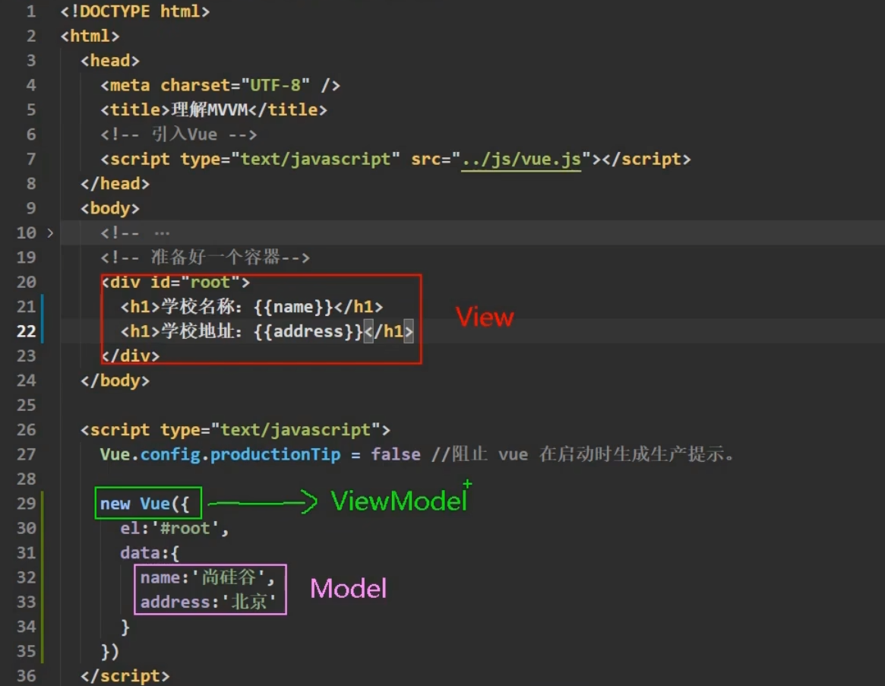
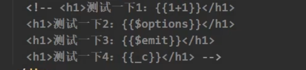

# 理解MVVM

MVVM模型

●M：模型 Model，data中的数据

●V：视图 View，模板代码

●VM：视图模型 ViewModel，Vue实例

观察发现

将实例赋值给变量vm，并打印vm

可以发现打印的vm中有data

vm身上所有的属性 及Vue原型身上所有的属性，在 Vue模板中都可以直接使用

> 根据
> “可以发现打印的vm中有data”
> “vm身上所有的属性 及Vue原型身上所有的属性，在 Vue模板中都可以直接使用”
> 这两个现象可以得到结论：之所以vue模板可以使用data中的数据，是因为data中的数据被放在了vm里，而vue模板又可以直接使用vm中的内容，因此vue模板能使用vm内的数据

