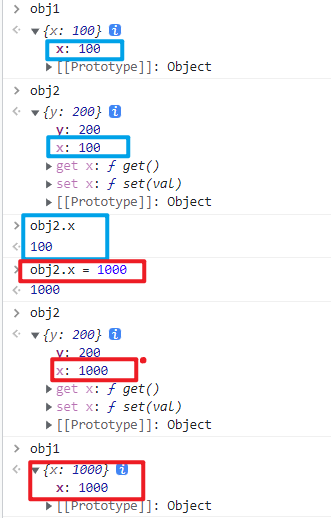
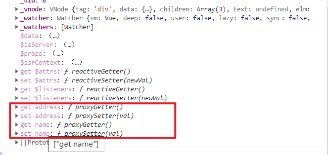
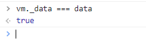
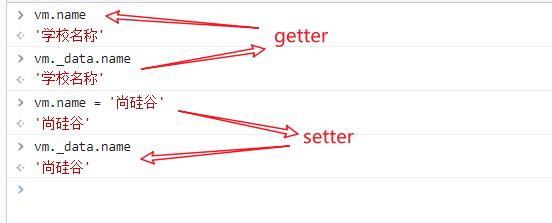

# 数据代理

## 1. Object.defineProperty()方法

该方法用于给对象添加属性。

```js
Object.defineProperty()

需要传入三个参数：
1. 需要进行属性添加的对象
2. 将要添加到对象的新属性名
3. 配置对象，在配置对象中可以指定新属性的值
```

### 1.1 使用Object.defineProperty()向对象中添加属性

```html
  <script>
    let person = {
      name: 'zs',
      sex: 'male'
    }
    // 向person对象中新添加一个age属性
    Object.defineProperty(person, 'age', {
      value: 18
    })
    console.log(person)
  </script>
```

> 

### 1.2 使用Object.defineProperty()添加的属性默认不可枚举

使用Object.defineProperty()添加的属性默认不可枚举，即使用Object.defineProperty()添加的属性默认是不能进行遍历的。

```html
  <script>
    let person = {
      name: 'zs',
      sex: 'male'
    }
    // 向person对象中新添加一个age属性
    Object.defineProperty(person, 'age', {
      value: 18
    })
    console.log(person)
    console.log(Object.keys(person))
    for (let key in person) {
      console.log(key, person[key])
    }
  </script>
```

> 

### 1.3 使Object.defineProperty()添加的属性可枚举

默认情况下，使用Object.defineProperty()添加的属性是不可枚举的，在添加属性的时候，配置对象中 enumerable 的值设置为 true，则使用Object.defineProperty()添加的属性可以枚举。

```html
  <script>
    let person = {
      name: 'zs',
      sex: 'male'
    }
    // 向person对象中新添加一个age属性
    Object.defineProperty(person, 'age', {
      value: 18,
      // enumerable 控制属性是否可以枚举，默认值为 false
      enumerable: true
    })
    console.log(person)
    console.log(Object.keys(person))
    for (let key in person) {
      console.log(key, person[key])
    }
  </script>
```

> 

### 1.4 使Object.defineProperty()添加的属性值可以修改

默认情况下，使用Object.defineProperty()添加的属性的值是不可以修改的。

> 

要使Object.defineProperty()添加的属性值可以修改，在添加属性时，配置对象的 writable 的值设置为 true，使用Object.defineProperty()添加的属性值可以修改。

```html
  <script>
    let person = {
      name: 'zs',
      sex: 'male'
    }
    // 向person对象中新添加一个age属性
    Object.defineProperty(person, 'age', {
      value: 18,
      // enumerable 控制属性是否可以枚举，默认值为 false
      enumerable: true,
      // 控制属性值是否可以被修改，默认值为 false
      writable: true
    })

  </script>
```

> 

### 1.5 使Object.defineProperty()添加的属性可以删除

默认情况下，使用Object.defineProperty()添加的属性的值是不可以删除的。

> 

要使Object.defineProperty()添加的属性值可以删除，在添加属性时，配置对象的 configurable 的值设置为 true，使用Object.defineProperty()添加的属性值可以删除。

```html
  <script>
    let person = {
      name: 'zs',
      sex: 'male'
    }
    // 向person对象中新添加一个age属性
    Object.defineProperty(person, 'age', {
      value: 18,
      // enumerable 控制属性是否可以枚举，默认值为 false
      enumerable: true,
      // 控制属性值是否可以被修改，默认值为 false
      writable: true,
      // 控制属性是否可以被删除，默认值为 false
      configurable: true
    })

  </script>
```

> 

### 1.6 新添加的属性赋值为另外定义的变量

向对象中新添加的属性赋值为另外定义的变量，当变量的值发生改变时，对象中的新属性值也会对应的发生变化。

```html
  <script>
    let number = 18
    let person = {
      name: 'zs',
      sex: 'male'
    }
    // 向person对象中新添加一个age属性
    Object.defineProperty(person, 'age', {
      // value: 18,
      // // enumerable 控制属性是否可以枚举，默认值为 false
      // enumerable: true,
      // // 控制属性值是否可以被修改，默认值为 false
      // writable: true,
      // // 控制属性是否可以被删除，默认值为 false
      // configurable: true

      // 当读取person的age属性的时候，get函数(getter)会被调用，且返回值就是age的值
      // get: function() {
      //   console.log('读取age属性')
      //   return number
      // }
      // 简写
      get() {
        console.log('读取age属性')
        return number
      },

      // 修改person的age属性的时候，set函数(setter)会被调用，且会收到修改的具体值
      set(value) {
        console.log('修改了age的属性值:', value)
      }
    })
  </script>
```

> 

### 1.7 修改新添加的属性值同时修改对应的变量

当对象中新添加的属性值发生改变时，对应的变量值也会对应的发生变化。

```html
  <script>
    let number = 18
    let person = {
      name: 'zs',
      sex: 'male'
    }
    // 向person对象中新添加一个age属性
    Object.defineProperty(person, 'age', {
      // value: 18,
      // // enumerable 控制属性是否可以枚举，默认值为 false
      // enumerable: true,
      // // 控制属性值是否可以被修改，默认值为 false
      // writable: true,
      // // 控制属性是否可以被删除，默认值为 false
      // configurable: true

      // 当读取person的age属性的时候，get函数(getter)会被调用，且返回值就是age的值
      // get: function() {
      //   console.log('读取age属性')
      //   return number
      // }
      // 简写
      get() {
        console.log('读取age属性')
        return number
      },

      // 修改person的age属性的时候，set函数(setter)会被调用，且会收到修改的具体值
      set(value) {
        console.log('修改了age的属性值:', value)
        number = value
      }
    })
  </script>
```

> 

> person 和 number 通过 Object.defineProperty() 中的 getter 和 setter 进行了关联。

## 2. 数据代理

数据代理：通过一个对象代理对另一个对象中属性的操作(读/写)

```html
  <script>
    let obj1 = {
      x: 100
    }
    let obj2 = {
      y: 200
    }
    // 通过obj2代理对obj1中x的操作(读/写)
    Object.defineProperty(obj2, 'x', {
      get() {
        return obj1.x
      },
      set(val) {
        obj1.x = val
      }
    })
  </script>
```

> 

## 3. Vue中的数据代理

```html
  <div id="root">
    <h1>学校名称：{{name}}</h1>
    <h1>学校地址：{{address}}</h1>
  </div>

  <script src="https://cdn.jsdelivr.net/npm/vue@2.6.14/dist/vue.js"></script>
  <script>
    const vm = new Vue({
      el: '#root',
      data: {
        name: '学校名称',
        address: '学校地址'
      }
    })
  </script>
```

> 
> 

观察发现，vue实例中data的属性值的存在方式与通过Object.defineProperty()采用getter和setter向一个对象中添加一个变量作为属性的存在方式类似。

vue是通过Object.defineProperty()将data中的属性追加到Vue实例中，再采用getter和setter读写data中的属性。


> Vue实例对象中的`_data`就是我们创建Vue实例时所写的配置对象中的data

```html
<body>
  <div id="root">
    <h1>学校名称：{{name}}</h1>
    <h1>学校地址：{{address}}</h1>
  </div>

  <script src="https://cdn.jsdelivr.net/npm/vue@2.6.14/dist/vue.js"></script>
  <script>
    let data = {
      name: '学校名称',
      address: '学校地址'
    }
    const vm = new Vue({
      el: '#root',
      data 
    })
  </script>
</body>
```

> 

验证Vue中getter和setter：

```html
<body>
  <div id="root">
    <h1>学校名称：{{name}}</h1>
    <h1>学校地址：{{address}}</h1>
  </div>

  <script src="https://cdn.jsdelivr.net/npm/vue@2.6.14/dist/vue.js"></script>
  <script>
    let data = {
      name: '学校名称',
      address: '学校地址'
    }
    const vm = new Vue({
      el: '#root',
      data 
    })
  </script>
</body>
```

> 


Vue实例对象中的`_data`不完全是我们所写的data，vue对其进行了数据劫持处理，为了能够实现在数据发生变化的时候，能够检测到数据发生了改变，从而页面的中对应的显示数据也能发生变化，实现页面的更新，实现页面的响应式操作。


