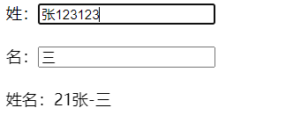
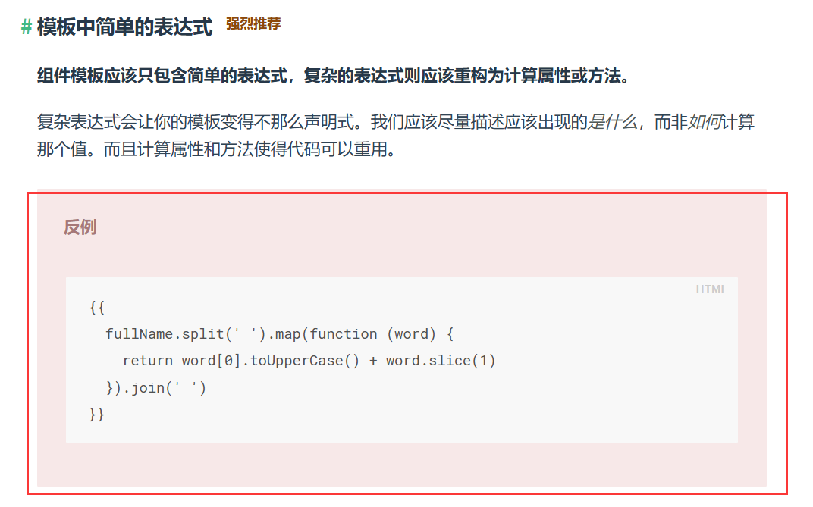

# 计算属性

> 通过一个姓名案例引出讲解计算属性

## 1 实现效果

> 可以单独的输入姓或者输入名。最后页面会呈现将姓和名组合起来的效果。


为了更好的理解计算属性，先通过插值语法实现上述效果，再使用methods实现上述效果，最后再使用计算属性。

## 2 插值语法实现

```html
<!DOCTYPE html>
<html lang="en">
<head>
  <meta charset="UTF-8">
  <meta http-equiv="X-UA-Compatible" content="IE=edge">
  <meta name="viewport" content="width=device-width, initial-scale=1.0">
  <title>Document</title>
</head>
<body>
  <!-- 准备容器 -->
  <div id="root">
    姓：<input type="text" v-model="firstName"> <br><br>
    名：<input type="text" v-model="lastName"> <br><br>
    姓名：<span>{{firstName}}-{{lastName}}</span>
  </div>
  <!-- 引入vue -->
  <script src="https://cdn.jsdelivr.net/npm/vue@2.6.14/dist/vue.js"></script>
  <script>
    new Vue({
      el: '#root',
      data: {
        firstName: '张',
        lastName:'三'
      }
    })
  </script>
</body>
</html>
```


如果现在有个需求：
输出显示的全名的姓太长时，需要保留前三个字符，且需要对保留下来的字符进行反转等操作。

```html
姓名：<span>{{firstName.slice(0,3).split('').reverse().join('')}}-{{lastName}}</span>
```

此时虽然能够实现需求，但是插值表达式中的js表达式太长，不易阅读。同时该种写法vue也不推荐，虽然不会报错。


在vue2文档官网的风格指南中，不推荐在模板中写复杂的表达式。




## 3 methods实现

> 在插值表达式中调用对应的method来处理全名的输出显示。

```html
<!DOCTYPE html>
<html lang="en">
<head>
  <meta charset="UTF-8">
  <meta http-equiv="X-UA-Compatible" content="IE=edge">
  <meta name="viewport" content="width=device-width, initial-scale=1.0">
  <title>Document</title>
</head>
<body>
  <!-- 准备容器 -->
  <div id="root">
    姓：<input type="text" v-model="firstName"> <br><br>
    名：<input type="text" v-model="lastName"> <br><br>
    姓名：<span>{{ fullName() }}</span>
  </div>
  <!-- 引入vue -->
  <script src="https://cdn.jsdelivr.net/npm/vue@2.6.14/dist/vue.js"></script>
  <script>
    new Vue({
      el: '#root',
      data: {
        firstName: '张',
        lastName:'三'
      },
      methods: {
        fullName() {
          console.log('fullName方法被调用了...')
          return this.firstName + '-' + this.lastName
        }
      },
    })
  </script>
</body>
</html>
```

> 

> 此时如果要实现输出显示的全名保留前三个字符，且需要对保留下来的字符进行反转等操作。代码可以写在对应的方法中，在插值表达式中只有一个方法的调用，不会新增其他代码。

使用methods能够实现的原理：


> 

## 4 计算属性实现

> 在vue中，只要是写在data中的，vue都认为是属性。
> 

### 计算属性

​          1.定义：要用的属性不存在，要通过已有属性计算得来。

​          2.原理：底层借助了Objcet.defineproperty方法提供的getter和setter。

​          3.get函数什么时候执行？

​                (1).初次读取时会执行一次。

​                (2).当依赖的数据发生改变时会被再次调用。

​          4.优势：与methods实现相比，内部有缓存机制（复用），效率更高，调试方便。

​          5.备注：

​              1.计算属性最终会出现在vm上，直接读取使用即可。

​              2.如果计算属性要被修改，那必须写set函数去响应修改，且set中要引起计算时依赖的数据发生改变。


在vue中，计算属性写在配置项`computed`中，配置项`computed`需要书写成对象形式。

### get方法

如果要使用计算属性，那么需要在计算属性中实现`get()`方法：

```js
computed: {
	// 由于计算属性的处理可能很复杂，所以写成对象的形式
	fullName: {
	  // 当计算属性被读取时，get函数会被调用，且返回值作为计算属性的值
	  get() {
	    console.log('get被调用')
	    return this.firstName + '-' + this.lastName
	  }
	}
},
```

使用计算属性的方式与使用data中的属性的方式一样，直接使用即可。

```html
<!DOCTYPE html>
<html lang="en">
<head>
  <meta charset="UTF-8">
  <meta http-equiv="X-UA-Compatible" content="IE=edge">
  <meta name="viewport" content="width=device-width, initial-scale=1.0">
  <title>Document</title>
</head>
<body>
  <!-- 准备容器 -->
  <div id="root">
    姓：<input type="text" v-model="firstName"> <br><br>
    名：<input type="text" v-model="lastName"> <br><br>
    姓名：<span>{{ fullName }}</span>
  </div>
  <!-- 引入vue -->
  <script src="https://cdn.jsdelivr.net/npm/vue@2.6.14/dist/vue.js"></script>
  <script>
    const vm = new Vue({
      el: '#root',
      data: {
        firstName: '张',
        lastName:'三'
      },
      computed: {
        // 由于计算属性的处理可能很复杂，所以写成对象的形式
        fullName: {
          // 当计算属性被读取时，get函数会被调用，且返回值作为计算属性的值
          get() {
            console.log('get被调用')
            return this.firstName + '-' + this.lastName
          }
        }
      }
    })
  </script>
</body>
</html>
```

> 

> 由于计算属性会在处理完成后被挂载到vue的实例对象上，所以使用计算属性的方式与使用data中的属性的方式一样，直接使用即可。
> 

`get()`被调用的时机：

1. 初次读取计算属性

   > 

2. 计算属性所依赖的数据发生变化

   > 

> 计算属性中函数(写成普通函数的形式)的this执行vue实例对象。

计算属性相比于methods的优势：

1. 计算属性会将结果缓存，只要计算属性所依赖的属性不改变，get方法就不会被调用。

   ```html
   <!-- 准备容器 -->
     <div id="root">
       姓：<input type="text" v-model="firstName"> <br><br>
       名：<input type="text" v-model="lastName"> <br><br>
       姓名：<span>{{ fullName }}</span>
       姓名：<span>{{ fullName }}</span>
       姓名：<span>{{ fullName }}</span>
       姓名：<span>{{ fullName }}</span>
     </div>
   ```

   > 

2. 相对于methods，计算属性的效率更高，因为methods不存在缓存，所以每次调用方法，方法都会重新执行一次，而计算属性只要依赖的数据不发生变化，计算属性的计算过程只有在第一次读取时执行。

### set方法

修改计算属性，需要在计算属性中定义`set()`函数：

> 当计算属性被修改时，set()会被调用

```js
      computed: {
        // 由于计算属性的处理可能很复杂，所以写成对象的形式
        fullName: {
          // 当计算属性被读取时，get函数会被调用，且返回值作为计算属性的值
          // get被调用的时机：1.初次读取计算属性 2.计算属性所依赖的数据发生变化
          get() {
            console.log('get被调用')
            return this.firstName + '-' + this.lastName
          },
          // 当计算属性被修改时，set()会被调用
          // val为修改后的计算属性值
          set(val) {
            // 由于计算属性依赖firstName lastName
            // 所以修改计算属性必须通过修改firstName lastName实现
            strArr = val.split("-")
            this.firstName = strArr[0]
            this.lastName = strArr[1]
          }
        }
      }
```

> 

> 计算属性底层借助了Object.defineproperty方法提供的getter和setter。

## 5 计算属性简写

> 计算属性更多是用于数据的展示，很少用于数据的修改。

当我们确定计算属性只读不改，才可以使用计算属性的简写形式。

简写形式就是把计算属性写成函数形式，此时计算属性函数相当于之前对象形式写法里面的`get()`函数。

```js
      computed: {
        // 计算属性完整写法：
        // fullName: {
        //   get() {
        //     console.log('get被调用')
        //     return this.firstName + '-' + this.lastName
        //   },
        //   set(val) {
        //     strArr = val.split("-")
        //     this.firstName = strArr[0]
        //     this.lastName = strArr[1]
        //   }
        // }

        // 计算属性简写：
        fullName() {
          console.log('get被调用')
          return this.firstName + '-' + this.lastName
        }
      }
```

调用简写的计算属性时，不要写成 {{ fullName() }} 的形式。


> 

