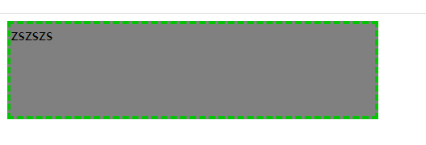
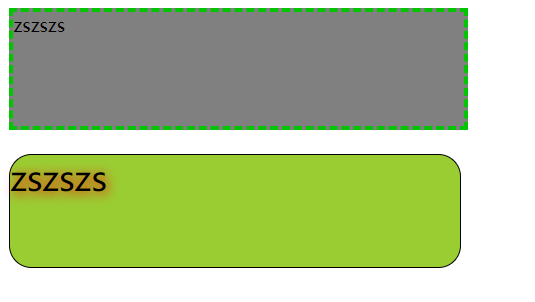
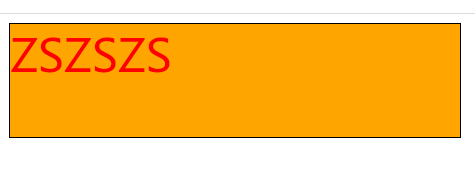
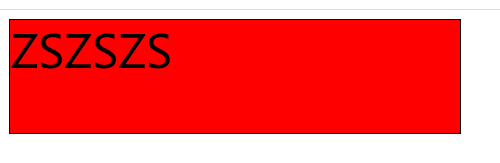

# 样式绑定

绑定样式：

​          1. class样式

​                写法:class="xxx" xxx可以是字符串、对象、数组。

​                    字符串写法适用于：类名不确定，要动态获取。

​                    对象写法适用于：要绑定多个样式，个数不确定，名字也不确定。

​                    数组写法适用于：要绑定多个样式，个数确定，名字也确定，但不确定用不用。

​          2. style样式

​                :style="{fontSize: xxx}"其中xxx是动态值。

​                :style="[a,b]"其中a、b是样式对象。

------

## 1. 绑定class样式

### 1.1 class 样式

```html
		<style>
			/* 继承样式 */
			.basic{
				width: 400px;
				height: 100px;
				border: 1px solid black;
			}
			/* 心情样式 */
			.happy{
				border: 4px solid red;;
				background-color: rgba(255, 255, 0, 0.644);
				background: linear-gradient(30deg,yellow,pink,orange,yellow);
			}
			.sad{
				border: 4px dashed rgb(2, 197, 2);
				background-color: gray;
			}
			.normal{
				background-color: skyblue;
			}

			.atguigu1{
				background-color: yellowgreen;
			}
			.atguigu2{
				font-size: 30px;
				text-shadow:2px 2px 10px red;
			}
			.atguigu3{
				border-radius: 20px;
			}
		</style>
```

### 1.2 绑定class样式字符串写法

> 字符串写法适用于样式类名不确定需要动态指定的情况

```html
<!DOCTYPE html>
<html lang="en">
<head>
  <meta charset="UTF-8">
  <meta http-equiv="X-UA-Compatible" content="IE=edge">
  <meta name="viewport" content="width=device-width, initial-scale=1.0">
  <title>Document</title>
  <style>
    /*  */
    .basic{
      width: 400px;
      height: 100px;
      border: 1px solid black;
    }
    
    .happy{
      border: 4px solid red;;
      background-color: rgba(255, 255, 0, 0.644);
      background: linear-gradient(30deg,yellow,pink,orange,yellow);
    }
    .sad{
      border: 4px dashed rgb(2, 197, 2);
      background-color: gray;
    }
    .normal{
      background-color: skyblue;
    }

    .atguigu1{
      background-color: yellowgreen;
    }
    .atguigu2{
      font-size: 30px;
      text-shadow:2px 2px 10px red;
    }
    .atguigu3{
      border-radius: 20px;
    }
  </style>
</head>
<body>
  <div id="root">
    <!-- 盒子具有默认样式basic normal -->
    <!-- :class 用于动态绑定样式 字符串写法  适用于样式类名不确定需要动态指定 -->
    <!-- 点击该盒子时候样式会发生改变，随机修改心情样式 -->
    <div class="basic" :class="mood" @click="changeMood">{{name}}</div>
  </div>
</body>
<script src="https://cdn.jsdelivr.net/npm/vue@2.6.14/dist/vue.js"></script>
<script>
  const vm = new Vue({
    el: '#root',
    data: {
      name: 'zszszs',
      // 默认的心情样式为normal
      mood: 'normal'
    },
    methods: {
      changeMood() {
        // 汇总已有的心情样式
        const moodArr = ['normal', 'sad', 'happy']
        // 随机生成 0 1 2
        const idx = Math.floor(Math.random()*3)
        // 修改心情
        this.mood = moodArr[idx]
      }
    },
  })
</script>
</html>
```

> 

### 1.3 绑定class样式数组写法

> 数组写法适用于要绑定的样式个数不确定、名字也不确定的情况

```html
<!DOCTYPE html>
<html lang="en">
<head>
  <meta charset="UTF-8">
  <meta http-equiv="X-UA-Compatible" content="IE=edge">
  <meta name="viewport" content="width=device-width, initial-scale=1.0">
  <title>Document</title>
  <style>
    /*  */
    .basic{
      width: 400px;
      height: 100px;
      border: 1px solid black;
    }
    
    .happy{
      border: 4px solid red;;
      background-color: rgba(255, 255, 0, 0.644);
      background: linear-gradient(30deg,yellow,pink,orange,yellow);
    }
    .sad{
      border: 4px dashed rgb(2, 197, 2);
      background-color: gray;
    }
    .normal{
      background-color: skyblue;
    }

    .atguigu1{
      background-color: yellowgreen;
    }
    .atguigu2{
      font-size: 30px;
      text-shadow:2px 2px 10px red;
    }
    .atguigu3{
      border-radius: 20px;
    }
  </style>
</head>
<body>
  <div id="root">
    <!-- :class 用于动态绑定样式  字符串写法  适用于样式类名不确定需要动态指定 -->
    <div class="basic" :class="mood" @click="changeMood">{{name}}</div> <br>

    <!-- :class 用于动态绑定样式  数组写法  适用于要绑定的样式个数不确定、名字也不确定 -->
    <!-- 数组写法改变样式，可以对数组中的样式名元素就行修改操作，移除或添加 -->
    <div class="basic" :class="classArr" @click="changeMood">{{name}}</div>
  </div>
</body>
<script src="https://cdn.jsdelivr.net/npm/vue@2.6.14/dist/vue.js"></script>
<script>
  const vm = new Vue({
    el: '#root',
    data: {
      name: 'zszszs',
      // 默认的心情样式为 normal
      mood: 'normal',
      // 样式数组
      classArr: ['atguigu1', 'atguigu2', 'atguigu3']
    },
    methods: {
      changeMood() {
        const moodArr = ['normal', 'sad', 'happy']
        const idx = Math.floor(Math.random()*3)
        this.mood = moodArr[idx]
      }
    },
  })
</script>
</html>
```

> 

### 1.4 绑定class样式对象写法

> 对象写法适用于要绑定的样式个数确定、名字确定，但是需要动态决定样式用不用的情况

```html
<!DOCTYPE html>
<html lang="en">
<head>
  <meta charset="UTF-8">
  <meta http-equiv="X-UA-Compatible" content="IE=edge">
  <meta name="viewport" content="width=device-width, initial-scale=1.0">
  <title>Document</title>
  <style>
    /*  */
    .basic{
      width: 400px;
      height: 100px;
      border: 1px solid black;
    }
    
    .happy{
      border: 4px solid red;;
      background-color: rgba(255, 255, 0, 0.644);
      background: linear-gradient(30deg,yellow,pink,orange,yellow);
    }
    .sad{
      border: 4px dashed rgb(2, 197, 2);
      background-color: gray;
    }
    .normal{
      background-color: skyblue;
    }

    .atguigu1{
      background-color: yellowgreen;
    }
    .atguigu2{
      font-size: 30px;
      text-shadow:2px 2px 10px red;
    }
    .atguigu3{
      border-radius: 20px;
    }
  </style>
</head>
<body>
  <div id="root">
    <!-- :class 用于动态绑定样式  字符串写法  适用于样式类名不确定需要动态指定 -->
    <div class="basic" :class="mood" @click="changeMood">{{name}}</div> <br>

    <!-- :class 用于动态绑定样式  数组写法  适用于要绑定的样式个数不确定、名字也不确定 -->
    <div class="basic" :class="classArr" >{{name}}</div> <br>

    <!-- :class 用于动态绑定样式  对象写法  适用于要绑定的样式个数确定、名字确定，但是需要动态决定用不用 -->
    <div class="basic" :class="classObj" >{{name}}</div>
  </div>
</body>
<script src="https://cdn.jsdelivr.net/npm/vue@2.6.14/dist/vue.js"></script>
<script>
  const vm = new Vue({
    el: '#root',
    data: {
      name: 'zszszs',
      // 默认的心情样式为 normal
      mood: 'normal',
      // 样式数组
      classArr: ['atguigu1', 'atguigu2', 'atguigu3'],
      // 样式对象
      // 默认样式都不使用
      // 需要使用的样式只需要将样式对应的值更改为true即可
      classObj: {
        atguigu1: false,
        atguigu2: false,
        atguigu3: false
      }
    },
    methods: {
      changeMood() {
        const moodArr = ['normal', 'sad', 'happy']
        const idx = Math.floor(Math.random()*3)
        this.mood = moodArr[idx]
      }
    },
  })
</script>
</html>
```

> 

## 2. 绑定style样式

### 2.1 绑定style样式对象写法

绑定style样式对象写法，style样式对象写在data中，对象中写样式及其对应的值。

> 如果原来的样式不同单词之间使用`-`进行连接，需要更改为小驼峰的写法。如：`font-size` 改写为 `fontSize`

```html
<!DOCTYPE html>
<html lang="en">
<head>
  <meta charset="UTF-8">
  <meta http-equiv="X-UA-Compatible" content="IE=edge">
  <meta name="viewport" content="width=device-width, initial-scale=1.0">
  <title>Document</title>
  <style>
    /* 基础样式 */
    .basic{
      width: 400px;
      height: 100px;
      border: 1px solid black;
    }
  </style>
</head>
<body>
  <div id="root">
    <div class="basic" :style="styleObj">{{name}}</div>
  </div>
</body>
<script src="https://cdn.jsdelivr.net/npm/vue@2.6.14/dist/vue.js"></script>
<script>
  const vm = new Vue({
    el: '#root',
    data: {
      name: 'ZSZSZS',
      // style样式
      styleObj: {
        fontSize: '40px',
        color: 'red'
      }
    }
  })
</script>
</html>
```

> 

### 2.2 绑定style样式数组写法

#### 2.2.1 写法1

```html
<!DOCTYPE html>
<html lang="en">
<head>
  <meta charset="UTF-8">
  <meta http-equiv="X-UA-Compatible" content="IE=edge">
  <meta name="viewport" content="width=device-width, initial-scale=1.0">
  <title>Document</title>
  <style>
    /* 基础样式 */
    .basic{
      width: 400px;
      height: 100px;
      border: 1px solid black;
    }
  </style>
</head>
<body>
  <div id="root">
    <div class="basic" :style="[styleObj1, styleObj2]">{{name}}</div>
  </div>
</body>
<script src="https://cdn.jsdelivr.net/npm/vue@2.6.14/dist/vue.js"></script>
<script>
  const vm = new Vue({
    el: '#root',
    data: {
      name: 'ZSZSZS',
      styleObj1: {
        fontSize: '40px',
        color: 'red'
      },
      styleObj2: {
        backgroundColor: 'orange'
      }
    }
  })
</script>
</html>
```

> 

#### 2.2.2 写法2

```html
<!DOCTYPE html>
<html lang="en">
<head>
  <meta charset="UTF-8">
  <meta http-equiv="X-UA-Compatible" content="IE=edge">
  <meta name="viewport" content="width=device-width, initial-scale=1.0">
  <title>Document</title>
  <style>
    /* 基础样式 */
    .basic{
      width: 400px;
      height: 100px;
      border: 1px solid black;
    }
  </style>
</head>
<body>
  <div id="root">
    <div class="basic" :style="styleArr">{{name}}</div>
  </div>
</body>
<script src="https://cdn.jsdelivr.net/npm/vue@2.6.14/dist/vue.js"></script>
<script>
  const vm = new Vue({
    el: '#root',
    data: {
      name: 'ZSZSZS',
      styleArr: [
        {
          fontSize: '40px',
          color: 'black'
        },
        {
          backgroundColor: 'red'
        }
      ]
    }
  })
</script>
</html>
```

> 


