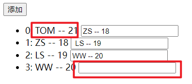
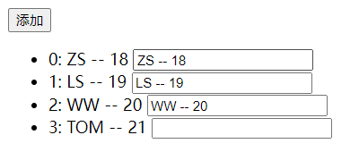
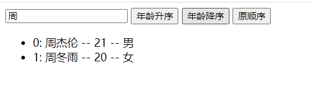

# 列表渲染

## 1. 列表渲染

### 1.1 v-for

vue 提供了 v-for 指令，用来辅助开发者基于数组、对象、字符串（用的很少）、指定次数（用的很少）等来循环渲染相似的 UI 结构。 v-for 指令需要使用`item in items` 或 `item of items` 的特殊语法，其中：

- items 是待循环的数据
- item 是当前的循环项

### 1.2 v-for 中的索引

v-for 指令除了可以获取当前正在循环的项，还支持一个可选的**第二个参数**，即当前项的索引。语法格式为 `(item, index) in items` 或 `(item, index) of items`。

> v-for 指令中的 item 项和 index 索引都是形参，可以根据需要进行重命名。例如 `(username, idx) in userlist`。

## 2. v-for 遍历数组

```html
<!DOCTYPE html>
<html lang="en">
<head>
  <meta charset="UTF-8">
  <meta http-equiv="X-UA-Compatible" content="IE=edge">
  <meta name="viewport" content="width=device-width, initial-scale=1.0">
  <title>Document</title>
</head>
<body>
  <div id="root">
    <ul>
      <li v-for="(person, index) in persons">
        [{{index}}] 姓名：{{person.name}} -- 年龄：{{person.age}}
      </li>
    </ul>

    <ul>
      <li v-for="(person, index) of persons">
        [{{index}}] 姓名：{{person.name}} -- 年龄：{{person.age}}
      </li>
    </ul>
  </div>
</body>
<script src="https://cdn.jsdelivr.net/npm/vue@2.6.14/dist/vue.js"></script>
<script>
  const vm = new Vue({
    el: '#root',
    data: {
      persons: [
        {id: 101, name: 'ZS', age: 18},
        {id: 102, name: 'LS', age: 19},
        {id: 103, name: 'WW', age: 20}
      ]
    }
  })
</script>
</html>
```

> 

## 3. v-for 遍历对象

> 使用 v-for 遍历对象，可以获取到三个参数，第一个参数为当前项的值，第二个参数为当前项对应的键，第三个参数为当前项的索引。

```html
<!DOCTYPE html>
<html lang="en">
<head>
  <meta charset="UTF-8">
  <meta http-equiv="X-UA-Compatible" content="IE=edge">
  <meta name="viewport" content="width=device-width, initial-scale=1.0">
  <title>Document</title>
</head>
<body>
  <div id="root">
    <ul>
      <li v-for="(value, key, index) in zs">
        {{index}} {{key}} : {{value}}
      </li>
    </ul>
  </div>
</body>
<script src="https://cdn.jsdelivr.net/npm/vue@2.6.14/dist/vue.js"></script>
<script>
  const vm = new Vue({
    el: '#root',
    data: {
      persons: [
        {id: 101, name: 'ZS', age: 18},
        {id: 102, name: 'LS', age: 19},
        {id: 103, name: 'WW', age: 20}
      ],
      zs: {id: 101, name: 'ZS', age: 18}
    }
  })
</script>
</html>
```

> 

## 4. v-for 遍历字符串(用得少)

> 使用 v-for 遍历字符串，可以获取到两个参数，第一个参数为当前正在遍历的字符，第二个参数为当前字符对应的索引或下标。

```html
<!DOCTYPE html>
<html lang="en">
<head>
  <meta charset="UTF-8">
  <meta http-equiv="X-UA-Compatible" content="IE=edge">
  <meta name="viewport" content="width=device-width, initial-scale=1.0">
  <title>Document</title>
</head>
<body>
  <div id="root">
    <ul>
      <li v-for="(char, index) in my_str">
        {{index}} -- {{char}}
      </li>
    </ul>
  </div>
</body>
<script src="https://cdn.jsdelivr.net/npm/vue@2.6.14/dist/vue.js"></script>
<script>
  const vm = new Vue({
    el: '#root',
    data: {
      persons: [
        {id: 101, name: 'ZS', age: 18},
        {id: 102, name: 'LS', age: 19},
        {id: 103, name: 'WW', age: 20}
      ],
      zs: {id: 101, name: 'ZS', age: 18},
      my_str: 'abcdefg'
    }
  })
</script>
</html>
```

> 

## 5. v-for 遍历指定次数(用得少)

> 使用 v-for 遍历指定次数，可以获取到两个参数，第一个参数为当前的数，第二个参数为当前的数对于的索引。

```html
<!DOCTYPE html>
<html lang="en">
<head>
  <meta charset="UTF-8">
  <meta http-equiv="X-UA-Compatible" content="IE=edge">
  <meta name="viewport" content="width=device-width, initial-scale=1.0">
  <title>Document</title>
</head>
<body>
  <div id="root">
    <ul>
      <li v-for="(number, index) in 3">
        {{index}} -- {{number}}
      </li>
    </ul>
  </div>
</body>
<script src="https://cdn.jsdelivr.net/npm/vue@2.6.14/dist/vue.js"></script>
<script>
  const vm = new Vue({
    el: '#root',
  })
</script>
</html>
```

> 

## 6. key的作用与原理

### 6.1 key

key 在 v-for 循环渲染中，可以为每个循环渲染出来的元素节点添加一个唯一的身份标识。

> 在使用 v-for 循环渲染时，最好写上 key

### 6.2 key错误演示

#### 6.2.1 index作为key

```html
<!DOCTYPE html>
<html lang="en">
<head>
  <meta charset="UTF-8">
  <meta http-equiv="X-UA-Compatible" content="IE=edge">
  <meta name="viewport" content="width=device-width, initial-scale=1.0">
  <title>Document</title>
</head>
<body>
  <div id="root">
    <button @click="addPerson">添加</button>
    <ul>
      <li v-for="(person, index) in persons" :key="index">
        {{index}}: {{person.name}} -- {{person.age}}
        <input type="text">
      </li>
    </ul>
  </div>
</body>
<script src="https://cdn.jsdelivr.net/npm/vue@2.6.14/dist/vue.js"></script>
<script>
  const vm = new Vue({
    el: '#root',
    data: {
      persons: [
        {id: 101, name: 'ZS', age: 18},
        {id: 102, name: 'LS', age: 19},
        {id: 103, name: 'WW', age: 20}
      ]
    },
    methods: {
      addPerson() {
        // 在数组的开头添加一人
        this.persons.unshift({id: 104, name: 'TOM', age: 21})
      }
    },
  })
</script>
</html>
```

> 

通过观察上面的代码和运行结果，发现新的人员信息和新的输入框在添加到页面后出现了显示位置不匹配的问题。

#### 6.2.2 不写key

```html
<!DOCTYPE html>
<html lang="en">
<head>
  <meta charset="UTF-8">
  <meta http-equiv="X-UA-Compatible" content="IE=edge">
  <meta name="viewport" content="width=device-width, initial-scale=1.0">
  <title>Document</title>
</head>
<body>
  <div id="root">
    <button @click="addPerson">添加</button>
    <ul>
      <li v-for="(person, index) in persons">
        {{index}}: {{person.name}} -- {{person.age}}
        <input type="text">
      </li>
    </ul>
  </div>
</body>
<script src="https://cdn.jsdelivr.net/npm/vue@2.6.14/dist/vue.js"></script>
<script>
  const vm = new Vue({
    el: '#root',
    data: {
      persons: [
        {id: 101, name: 'ZS', age: 18},
        {id: 102, name: 'LS', age: 19},
        {id: 103, name: 'WW', age: 20}
      ]
    },
    methods: {
      addPerson() {
        this.persons.unshift({id: 104, name: 'TOM', age: 21})
      }
    },
  })
</script>
</html>
```

> 

通过观察，发现新的人员信息和新的输入框在添加到页面后依旧出现了显示位置不匹配的问题。

#### 6.2.3 出现错误的解释

> 使用 v-for 进行循环渲染时，不写 key 时，vue 为自动为DOM元素设置一个 key ，key 的值为 index。即不写 key 与使用 index 作为 key 一样。


### 6.3 可以对数组数据进行唯一标识的作为key

#### 6.3.1 示例

> 在提供的数据数组中，每个对象的 id 可以对该对象进行唯一标识，所以可以使用 id 作为key。

```html
<!DOCTYPE html>
<html lang="en">
<head>
  <meta charset="UTF-8">
  <meta http-equiv="X-UA-Compatible" content="IE=edge">
  <meta name="viewport" content="width=device-width, initial-scale=1.0">
  <title>Document</title>
</head>
<body>
  <div id="root">
    <button @click="addPerson">添加</button>
    <ul>
      <li v-for="(person, index) in persons" :key="person.id">
        {{index}}: {{person.name}} -- {{person.age}}
        <input type="text">
      </li>
    </ul>
  </div>
</body>
<script src="https://cdn.jsdelivr.net/npm/vue@2.6.14/dist/vue.js"></script>
<script>
  const vm = new Vue({
    el: '#root',
    data: {
      persons: [
        {id: 101, name: 'ZS', age: 18},
        {id: 102, name: 'LS', age: 19},
        {id: 103, name: 'WW', age: 20}
      ]
    },
    methods: {
      addPerson() {
        this.persons.unshift({id: 104, name: 'TOM', age: 21})
      }
    },
  })
</script>
</html>
```

> 

提供观察结果发现，新的人员信息和新的输入框在加入页面显示后，没有出现不匹配的问题。

#### 6.3.2 解释


### 6.4 key的作用

1. 虚拟DOM中key的作用：
   - key是虚拟DOM对象的标识，当数据发生变化时，Vue会根据【新数据】生成【新的虚拟DOM】,随后Vue进行【新虚拟DOM】与【旧虚拟DOM】的差异比较，比较规则如下：
     - (1).旧虚拟DOM中找到了与新虚拟DOM相同的key：
       - ①.若虚拟DOM中内容没变, 直接使用之前的真实DOM！
       - ②.若虚拟DOM中内容变了, 则生成新的真实DOM，随后替换掉页面中之前的真实DOM。
     - (2).旧虚拟DOM中未找到与新虚拟DOM相同的key
       - 创建新的真实DOM，随后渲染到到页面。

### 6.5 用index作为key可能会引发的问题

1. 若对数据进行：逆序添加、逆序删除等破坏顺序操作:
   - 会产生没有必要的真实DOM更新 ==> 界面效果没问题, 但效率低。
2. 如果结构中还包含输入类的DOM：
   - 会产生错误DOM更新 ==> 界面有问题。

如果不对数据进行破坏顺序操作，则使用index作为key不会引发问题。

```html
<!DOCTYPE html>
<html lang="en">
<head>
  <meta charset="UTF-8">
  <meta http-equiv="X-UA-Compatible" content="IE=edge">
  <meta name="viewport" content="width=device-width, initial-scale=1.0">
  <title>Document</title>
</head>
<body>
  <div id="root">
    <button @click="addPerson">添加</button>
    <ul>
      <li v-for="(person, index) in persons" :key="idnex">
        {{index}}: {{person.name}} -- {{person.age}}
        <input type="text">
      </li>
    </ul>
  </div>
</body>
<script src="https://cdn.jsdelivr.net/npm/vue@2.6.14/dist/vue.js"></script>
<script>
  const vm = new Vue({
    el: '#root',
    data: {
      persons: [
        {id: 101, name: 'ZS', age: 18},
        {id: 102, name: 'LS', age: 19},
        {id: 103, name: 'WW', age: 20}
      ]
    },
    methods: {
      addPerson() {
        this.persons.push({id: 104, name: 'TOM', age: 21})
      }
    },
  })
</script>
</html>
```

> 

### 6.6 开发中如何选择key

1. 最好使用每条数据的唯一标识作为key，比如id、手机号、身份证号、学号等唯一值。
   1. 如果不存在对数据的逆序添加、逆序删除等破坏顺序操作，仅用于渲染列表用于展示，使用index作为key是没有问题的。

## 7. 列表过滤

### 7.1 监视属性实现

```html
<!DOCTYPE html>
<html lang="en">
  <head>
    <meta charset="UTF-8" />
    <meta http-equiv="X-UA-Compatible" content="IE=edge" />
    <meta name="viewport" content="width=device-width, initial-scale=1.0" />
    <title>Document</title>
  </head>
  <body>
    <div id="root">
      <!-- 使用 v-model 进行双向绑定 获取用户的输入 -->
      <input type="text" placeholder="请输入姓名..." v-model="keyWord" />
      <ul>
        <li v-for="(person, index) in filterPerson" :key="person.id">{{index}}: {{person.name}} -- {{person.age}} -- {{person.sex}}</li>
      </ul>
    </div>
  </body>
  <script src="https://cdn.jsdelivr.net/npm/vue@2.6.14/dist/vue.js"></script>
  <script>
    const vm = new Vue({
      el: '#root',
      data: {
        // 保存用户的输入
        keyWord: '',
        persons: [
          { id: '001', name: '马冬梅', age: 19, sex: '女' },
          { id: '002', name: '周冬雨', age: 20, sex: '女' },
          { id: '003', name: '周杰伦', age: 21, sex: '男' },
          { id: '004', name: '温兆伦', age: 22, sex: '男' },
        ],
        // 用于保存过滤后的数组
        filterPerson: [],
      },
      watch: {
        // 监视用户的输入
        keyWord: {
          // 初始化时立即执行一次，
          // 初始用户没有输入，使用空字符串进行过滤，所有的数组元素都保留
          // 显示数组中的全部元素
          immediate: true,
          handler(newVal) {
            // 对数组进行过滤，并将过滤后的结果保存到filterPerson中
            this.filterPerson = this.persons.filter((person) => {
              // 查询姓名中是否包含用户输入的字符串
              // 空字符串会返回0
              // 包含输入的字符串则返回对应的索引
              // 不包含返回-1
              return person.name.indexOf(newVal) !== -1
            })
          },
        },
      },
    })
  </script>
</html>
```

> 

### 7.2 计算属性实现

> 计算属性与监视属性都能实现的功能，优先使用计算属性。

```html
<!DOCTYPE html>
<html lang="en">
  <head>
    <meta charset="UTF-8" />
    <meta http-equiv="X-UA-Compatible" content="IE=edge" />
    <meta name="viewport" content="width=device-width, initial-scale=1.0" />
    <title>Document</title>
  </head>
  <body>
    <div id="root">
      <!-- 使用 v-model 进行双向绑定 获取用户的输入 -->
      <input type="text" placeholder="请输入姓名..." v-model="keyWord" />
      <ul>
        <li v-for="(person, index) in filterPerson" :key="person.id">{{index}}: {{person.name}} -- {{person.age}} -- {{person.sex}}</li>
      </ul>
    </div>
  </body>
  <script src="https://cdn.jsdelivr.net/npm/vue@2.6.14/dist/vue.js"></script>
  <script>
    const vm = new Vue({
      el: '#root',
      data: {
        // 保存用户的输入
        keyWord: '',
        persons: [
          { id: '001', name: '马冬梅', age: 19, sex: '女' },
          { id: '002', name: '周冬雨', age: 20, sex: '女' },
          { id: '003', name: '周杰伦', age: 21, sex: '男' },
          { id: '004', name: '温兆伦', age: 22, sex: '男' },
        ]
      },
      computed: {
        // 由于页面中使用到了该计算属性，所以页面初始化时会调用一次
        // 由于该计算属性使用了keyWord，所以当keyWord变化时，也会自动调用该计算属性
        filterPerson() {
          // 对数组进行过滤
          return this.persons.filter((person)=>{
            // 判断姓名是否包含用户的输入
            return person.name.indexOf(this.keyWord) !== -1
          })
        }
      }
    })
  </script>
</html>
```

> 

## 8. 列表排序

```html
<!DOCTYPE html>
<html lang="en">
  <head>
    <meta charset="UTF-8" />
    <meta http-equiv="X-UA-Compatible" content="IE=edge" />
    <meta name="viewport" content="width=device-width, initial-scale=1.0" />
    <title>Document</title>
  </head>
  <body>
    <div id="root">
      <!-- 使用 v-model 进行双向绑定 获取用户的输入 -->
      <input type="text" placeholder="请输入姓名..." v-model="keyWord" />
      <button @click="sortType = 2">年龄升序</button>
      <button @click="sortType = 1">年龄降序</button>
      <button @click="sortType = 0">原顺序</button>
      <ul>
        <li v-for="(person, index) in filterPerson" :key="person.id">{{index}}: {{person.name}} -- {{person.age}} -- {{person.sex}}</li>
      </ul>
    </div>
  </body>
  <script src="https://cdn.jsdelivr.net/npm/vue@2.6.14/dist/vue.js"></script>
  <script>
    const vm = new Vue({
      el: '#root',
      data: {
        // 保存用户的输入
        keyWord: '',
        // 数据显示的顺序
        // 默认为0(原顺序) 1降序 2升序
        sortType: 0,
        persons: [
          { id: '001', name: '马冬梅', age: 19, sex: '女' },
          { id: '002', name: '周冬雨', age: 20, sex: '女' },
          { id: '003', name: '周杰伦', age: 21, sex: '男' },
          { id: '004', name: '温兆伦', age: 22, sex: '男' },
        ],
      },
      computed: {
        filterPerson() {
          // 保存过滤后的数据
          const personArr = this.persons.filter((person) => {
            return person.name.indexOf(this.keyWord) !== -1
          })
          // 对过滤后的数据进行排序
          // 如果需要的数组顺序不为原顺序，则进行排序
          if (this.sortType) {
            // 排序
            personArr.sort((p1, p2) => {
              // 判断是要降序还是升序
              return this.sortType === 1 ? p2.age - p1.age : p1.age - p2.age
            })
          }
          // 然后数组
          return personArr
        },
      },
    })
  </script>
</html>
```

> 

