# Vue监测数据的原理

## 1. Vue数据更新时的一个问题

> 通过数组的索引对数组的元素进行修改，vue监测不到，不会对页面中的数据进行更新。

```html
<!DOCTYPE html>
<html>
	<head>
		<meta charset="UTF-8" />
		<title>更新时的一个问题</title>
		<script src="https://cdn.jsdelivr.net/npm/vue@2.6.14/dist/vue.js"></script>
	</head>
	<body>
		<!-- 准备好一个容器-->
		<div id="root">
			<h2>人员列表</h2>
			<button @click="updateMei">更新马冬梅的信息</button>
			<ul>
				<li v-for="(p,index) of persons" :key="p.id">
					{{p.name}}-{{p.age}}-{{p.sex}}
				</li>
			</ul>
		</div>

		<script type="text/javascript">
			Vue.config.productionTip = false
			
			const vm = new Vue({
				el:'#root',
				data:{
					persons:[
						{id:'001',name:'马冬梅',age:30,sex:'女'},
						{id:'002',name:'周冬雨',age:31,sex:'女'},
						{id:'003',name:'周杰伦',age:18,sex:'男'},
						{id:'004',name:'温兆伦',age:19,sex:'男'}
					]
				},
				methods: {
					updateMei(){
						// this.persons[0].name = '马老师' //奏效
						// this.persons[0].age = 50 //奏效
						// this.persons[0].sex = '男' //奏效
						//会发现使用此方法进行数据的更新不奏效，vue监测不到数据的改变
						this.persons[0] = {id:'001',name:'马老师',age:50,sex:'男'} 
					}
				}
			}) 

		</script>
</html>
```

> 观察运行结果发现，点击按钮后，对数组中的一个对象元素整个进行了更改，但是Vue并没有监测到，没有对页面进行更新。
> 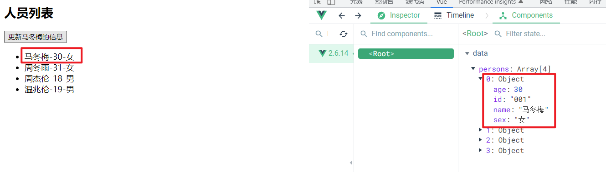
>
> 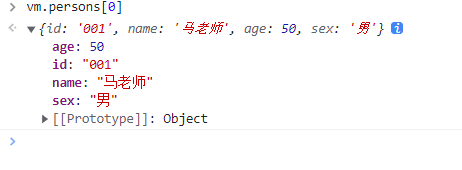

## 2. Vue监测对象数据的原理

> Vue监测对象类型的数据主要是通过Object.defineProperty()方法向vue实例对象中添加各个属性对应的getter和setter方法，当页面的数据发生更改时，会触发对应属性的setter方法，在setter方法中会调用方法重新进行模板的解析，从而实现页面数据的更新。

Vue监测对象数据的简单模拟：

> 注意：通过Object.defineProperty()方法向vue实例对象中添加各个属性对应的getter和setter方法实现数据的监视，不能在要监视的对象数据上直接操作，否则会死规(堆栈溢出)。
> 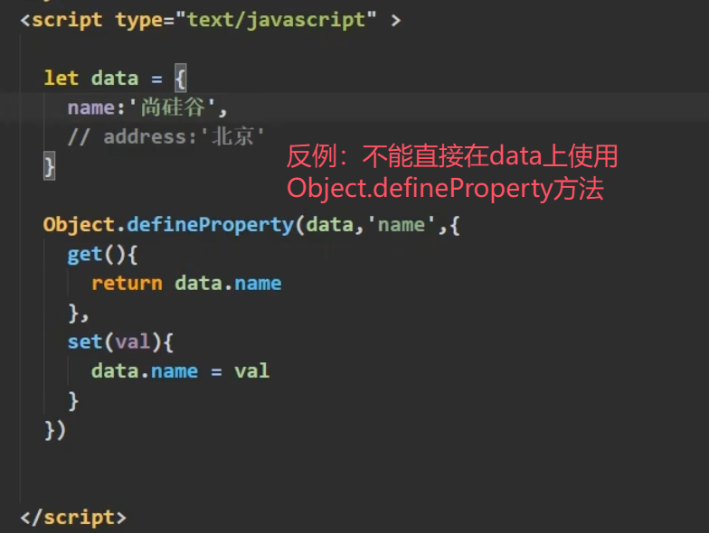

```html
<!DOCTYPE html>
<html>
	<head>
		<meta charset="UTF-8" />
		<title>Document</title>
	</head>
	<body>
		<script type="text/javascript" >
			// 对象类型的数据
			let data = {
				name:'尚硅谷',
				address:'北京',
			}

			// 声明一个构造器 
			// 用于构造监测 对象类型数据 的对象
			// obj为要监测的 对象类型数据
			function Observer(obj){
				// 汇总对象中所有的属性形成一个数组
				const keys = Object.keys(obj)
				// 遍历对象的每个属性
				// 在构造出来的监测对象(this/obs)上添加getter和setter方法
				// 用于监测 对象类型数据 中对应的属性
				keys.forEach((k)=>{
					// 使用Object.defineProperty()方法进行添加
					Object.defineProperty(this,k,{
						get(){
							return obj[k]
						},
						set(val){
							console.log(`${k}被改了，我要去解析模板，生成虚拟DOM.....我要开始忙了`)
							obj[k] = val
						}
					})
				}) 
			}

			// 创建一个监视的实例对象，用于监视data中属性的变化
			// 将要监测的对象类型数据 即data传入
			const obs = new Observer(data)		
			console.log(obs)	

			//准备一个vue实例对象
			let vm = {}
			// 将构建的监测实例对象挂载到vue实例对象中
			vm._data = data = obs
		</script>
	</body>
</html>
```

> Vue的数据监视的实现有两处比这里的模拟实现更完善。
>
> 1.vue更改属性的值可以直接使用vm.name = newValue实现，而这里的模拟实现只能通过vm._data.name = newValue实现
>
> 2.这只能实现一层数据的监视，vue能监视多层的数据，是由于vue采用递归的方式向对象内继续查找。
> 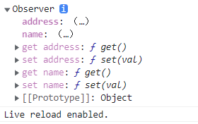

## 3. Vue.set()

`Vue.set()`方法，可以用于向**data中的对象数据**动态的添加属性。

> 不能使用该方法向vue实例对象上添加属性，也不能使用该方法向vue中的data添加属性。
> Vue.set(vm, ...)  --错误
> Vue.set(vm_ddata, ...)  --错误

语法：

```js
Vue.set(target, key, value)
```

- target：为要进行属性添加的对象数据
- key：为将要添加的属性名
- value：为将要添加的属性值

> vue 实例对象中的`$set()`方法与`Vue.set()`方法的用法一样。

```html
<!DOCTYPE html>
<html>
	<head>
		<meta charset="UTF-8" />
		<title>Vue监测数据改变的原理</title>
		<!-- 引入Vue -->
		<script src="https://cdn.jsdelivr.net/npm/vue@2.6.14/dist/vue.js"></script>
	</head>
	<body>
		<!-- 准备好一个容器-->
		<div id="root">
			<h1>学校信息</h1>
			<h2>学校名称：{{school.name}}</h2>
			<h2>学校地址：{{school.address}}</h2>
			<h2>校长是：{{school.leader}}</h2>
			<hr/>
			<h1>学生信息</h1>
			<button @click="addSex">添加一个性别属性，默认值是男</button>
			<h2>姓名：{{student.name}}</h2>
			<h2 v-if="student.sex">性别：{{student.sex}}</h2>
			<h2>年龄：真实{{student.age.rAge}}，对外{{student.age.sAge}}</h2>
			<h2>朋友们</h2>
			<ul>
				<li v-for="(f,index) in student.friends" :key="index">
					{{f.name}}--{{f.age}}
				</li>
			</ul>
		</div>
	</body>

	<script type="text/javascript">
		Vue.config.productionTip = false //阻止 vue 在启动时生成生产提示。

		const vm = new Vue({
			el:'#root',
			data:{
				school:{
					name:'尚硅谷',
					address:'北京',
				},
				student:{
					name:'tom',
					age:{
						rAge:40,
						sAge:29,
					},
					friends:[
						{name:'jerry',age:35},
						{name:'tony',age:36}
					]
				}
			},
			methods: {
				// 向学生对象中添加一个性别属性
				addSex(){
					// Vue.set(this.student,'sex','男')
					this.$set(this.student,'sex','男')
				}
			}
		})
	</script>
</html>
```

> 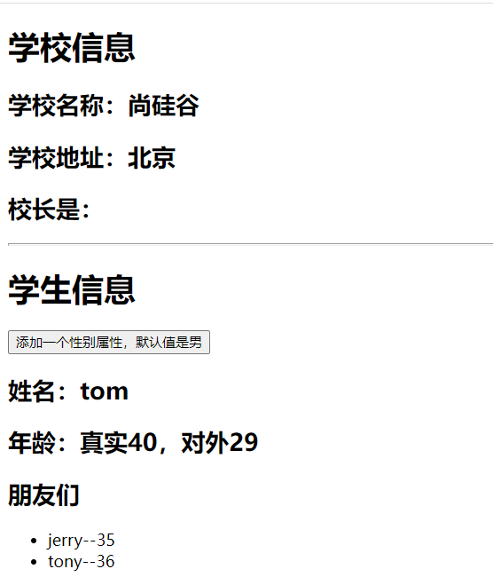
> 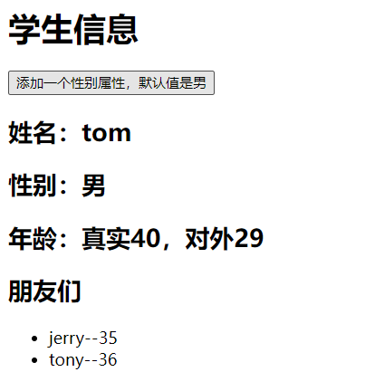

## 4. Vue监测数组数据的原理

在vue实例对象上的数组，不像对象类型的数据那样，会为对象数据中的每个属性添加一个getter和setter方法，vue不会为数组数据中的每个元素添加一个getter和setter，即没有数组索引所对应的getter和setter方法。

> 1 中vue数据更新时问题的解释。

> 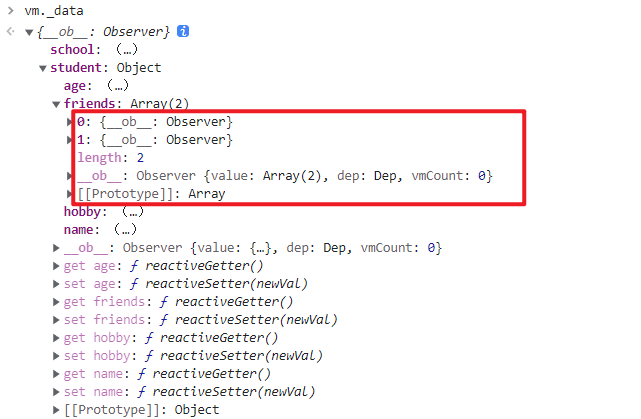

但是vue对数组Array上的会对原数组进行修改的方法进行了包装处理，使用vue包装的方法对数组进行修改，可以被vue监测到，从而实现页面的更新。

- Vue包装的Array方法如下：
  - push()
  - pop()
  - shift()
  - unshift()
  - splice()
  - sort()
  - reverse()

上面提到的方法在Vue官网上也提到了：
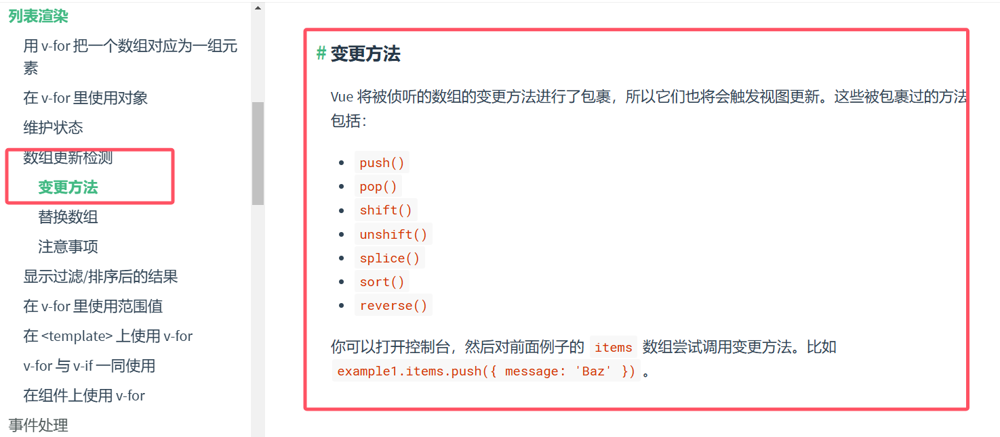

> 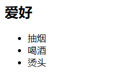
> 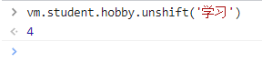
> 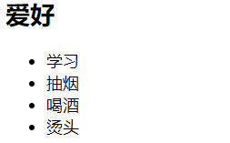

> 使用set方法对数组的元素进行修改，vue也可以监测得到
> 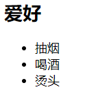
> 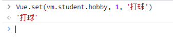
> 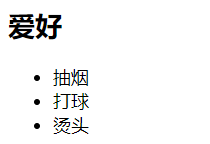

> 如果使用上述的方法向数组中添加对象类型的数据，vue为新的对象数据中的属性添加对应的getter和setter方法。
> 只要是对象类型的数据，就有属性对应的getter和setter。

## 5. 练习

### 5.1 题

```html
<!DOCTYPE html>
<html>
	<head>
		<meta charset="UTF-8" />
		<title>总结数据监视</title>
		<style>
			button{
				margin-top: 10px;
			}
		</style>
		<!-- 引入Vue -->
		<script src="https://cdn.jsdelivr.net/npm/vue@2.6.14/dist/vue.js"></script>
	</head>
	<body>
		<!-- 准备好一个容器-->
		<div id="root">
			<h1>学生信息</h1>
			<button @click="">年龄+1岁</button> <br/>
			<button @click="">添加性别属性，默认值：男</button> <br/>
			<button @click="">修改性别</button> <br/>
			<button @click="">在列表首位添加一个朋友</button> <br/>
			<button @click="">修改第一个朋友的名字为：张三</button> <br/>
			<button @click="">添加一个爱好</button> <br/>
			<button @click="">修改第一个爱好为：开车</button> <br/>
			<button @click="">过滤掉爱好中的抽烟</button> <br/>
			<h3>姓名：{{student.name}}</h3>
			<h3>年龄：{{student.age}}</h3>
			<h3 v-if="student.sex">性别：{{student.sex}}</h3>
			<h3>爱好：</h3>
			<ul>
				<li v-for="(h,index) in student.hobby" :key="index">
					{{h}}
				</li>
			</ul>
			<h3>朋友们：</h3>
			<ul>
				<li v-for="(f,index) in student.friends" :key="index">
					{{f.name}}--{{f.age}}
				</li>
			</ul>
		</div>
	</body>

	<script type="text/javascript">
		Vue.config.productionTip = false //阻止 vue 在启动时生成生产提示。

		const vm = new Vue({
			el:'#root',
			data:{
				student:{
					name:'tom',
					age:18,
					hobby:['抽烟','喝酒','烫头'],
					friends:[
						{name:'jerry',age:35},
						{name:'tony',age:36}
					]
				}
			},
			methods: {
				
			}
		})
	</script>
</html>
```

> 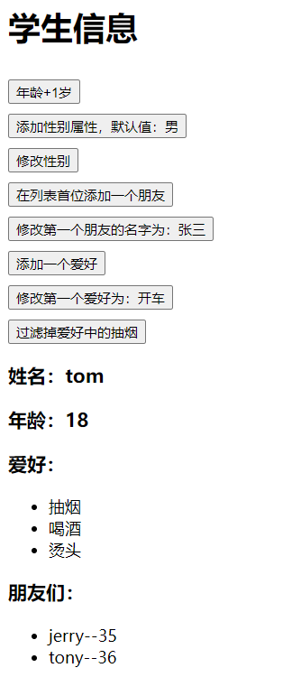

### 5.2 功能实现

```html
<!DOCTYPE html>
<html>
	<head>
		<meta charset="UTF-8" />
		<title>总结数据监视</title>
		<style>
			button{
				margin-top: 10px;
			}
		</style>
		<!-- 引入Vue -->
		<script src="https://cdn.jsdelivr.net/npm/vue@2.6.14/dist/vue.js"></script>
	</head>
	<body>
		<!-- 准备好一个容器-->
		<div id="root">
			<h1>学生信息</h1>
			<button @click="student.age++">年龄+1岁</button> <br/>
			<button @click="addSex">添加性别属性，默认值：男</button> <br/>
			<button @click="student.sex = '未知' ">修改性别</button> <br/>
			<button @click="addFriend">在列表首位添加一个朋友</button> <br/>
			<button @click="updateFirstFriendName">修改第一个朋友的名字为：张三</button> <br/>
			<button @click="addHobby">添加一个爱好</button> <br/>
			<button @click="updateHobby">修改第一个爱好为：开车</button> <br/>
			<button @click="removeSmoke">过滤掉爱好中的抽烟</button> <br/>
			<h3>姓名：{{student.name}}</h3>
			<h3>年龄：{{student.age}}</h3>
			<h3 v-if="student.sex">性别：{{student.sex}}</h3>
			<h3>爱好：</h3>
			<ul>
				<li v-for="(h,index) in student.hobby" :key="index">
					{{h}}
				</li>
			</ul>
			<h3>朋友们：</h3>
			<ul>
				<li v-for="(f,index) in student.friends" :key="index">
					{{f.name}}--{{f.age}}
				</li>
			</ul>
		</div>
	</body>

	<script type="text/javascript">
		Vue.config.productionTip = false //阻止 vue 在启动时生成生产提示。

		const vm = new Vue({
			el:'#root',
			data:{
				student:{
					name:'tom',
					age:18,
					hobby:['抽烟','喝酒','烫头'],
					friends:[
						{name:'jerry',age:35},
						{name:'tony',age:36}
					]
				}
			},
			methods: {
				addSex(){
					// 方法一
					// Vue.set(this.student,'sex','男')
					// 方法二
					this.$set(this.student,'sex','男')
				},
				addFriend(){
					this.student.friends.unshift({name:'jack',age:70})
				},
				updateFirstFriendName(){
					// 新添加的元素为对象类型，对象内的属性vue会添加数据监视
					this.student.friends[0].name = '张三'
				},
				addHobby(){
					this.student.hobby.push('学习')
				},
				updateHobby(){
					// 使用splice方法
					// this.student.hobby.splice(0,1,'开车')
					// Vue.set()
					// Vue.set(this.student.hobby,0,'开车')
					// vue实例对象的$set()方法
					this.$set(this.student.hobby,0,'开车')
				},
				removeSmoke(){
					// 由于vue对于filter修改数组没有监视，所以可以使用将过滤完成后的数组放回data实现数据更新
					this.student.hobby = this.student.hobby.filter((h)=>{
						return h !== '抽烟'
					})
				}
			}
		})
	</script>
</html>
```

> 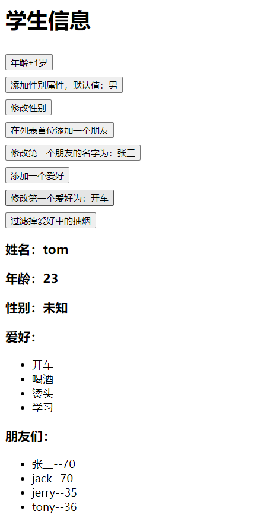

## 6. 总结 Vue监视数据的原理

1. vue会监视data中所有层次的数据。
2. 如何监测对象中的数据？
   - 通过setter实现监视，且要在new Vue时就传入要监测的数据。
     - (1).对象中后追加的属性，Vue默认不做响应式处理
     - (2).如需给后添加的属性做响应式，请使用如下API：
       - `Vue.set(target，propertyName/index，value)` 或
       - `vm.$set(target，propertyName/index，value)`
3. 如何监测数组中的数据？
   - 通过包裹数组更新元素的方法实现，本质就是做了两件事：
     - (1).调用原生对应的方法对数组进行更新。
     - (2).重新解析模板，进而更新页面。
4. 在Vue修改数组中的某个元素一定要用如下方法：
   - 1.使用这些API：push()、pop()、shift()、unshift()、splice()、sort()、reverse()
   - 2.`Vue.set()` 或 `vm.$set()`
   - 3.对于不会修改原数组的方法，如：filter()、concat() 和 slice()，它们不会变更原始数组，而总是返回一个新数组。当使用非变更方法时，可以用新数组替换旧数组

- 特别注意：`Vue.set()` 和 `vm.$set()` 不能给 vm 或 vm的根数据对象 添加属性 ！ ！ ！

> 数据劫持，数据由原来的形式变为具有getter和setter的形式。
> 当有人修改类数据，修改后的数据会被setter方法所获取(劫持)。
> 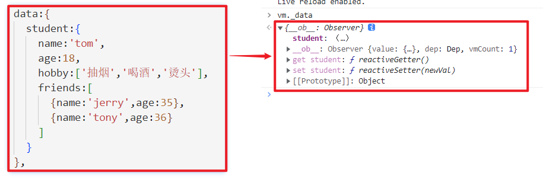

