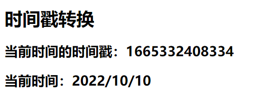

# 过滤器

## 1. 需要实现的案例效果


## 2. 时间格式化包

> 第三方包获取：[BootCDN](https://www.bootcdn.cn/)

### 2.1 moment.js

[moment.js](https://www.bootcdn.cn/moment.js/)

Moment.js 是一个 JavaScript 日期处理类库，用于解析、检验、操作、以及显示日期。

[moment.js中文文档](https://momentjs.bootcss.com/)

### 2.2 day.js

[day.js](https://www.bootcdn.cn/dayjs/)

Day.js 是一个轻量的处理时间和日期的 JavaScript 库，和 Moment.js 的 API 设计保持完全一样.

[day.js的GitHub仓库(参考文档)](https://github.com/iamkun/dayjs)

> 这里使用的是day.js

## 3. 计算属性与方法实现

### 3.1 计算属性实现

```html
<!DOCTYPE html>
<html lang="en">
<head>
  <meta charset= "UTF-8">
  <meta http-equiv="X-UA-Compatible" content="IE=edge">
  <meta name="viewport" content="width=device-width, initial-scale=1.0">
  <title>Document</title>
</head>
<body>
  <div id="root">
    <h1>时间戳转换</h1>
    <h2>当前时间的时间戳：{{time}}</h2>
    <h2>当前时间：{{nowDateTime}}</h2>
  </div>
</body>
<!-- 导入day.js -->
<script src="https://cdn.bootcdn.net/ajax/libs/dayjs/1.11.5/dayjs.min.js"></script>
<!-- 导入vue.js -->
<script src="https://cdn.jsdelivr.net/npm/vue@2.6.14/dist/vue.js"></script>
<script>
  const vm = new Vue({
    el: '#root',
    data: {
      // 当前时间的时间戳
      time: Date.now()
    },
    computed: {
      // 将时间戳转换指定格式的时间
      nowDateTime() {
        return dayjs(this.time).format('YYYY-MM-DD HH:mm:ss');
      }
    }
  })
</script>
</html>
```

> 

### 3.2 方法实现

```html
<!DOCTYPE html>
<html lang="en">
<head>
  <meta charset= "UTF-8">
  <meta http-equiv="X-UA-Compatible" content="IE=edge">
  <meta name="viewport" content="width=device-width, initial-scale=1.0">
  <title>Document</title>
</head>
<body>
  <div id="root">
    <h1>时间戳转换</h1>
    <h2>当前时间的时间戳：{{time}}</h2>
    <h2>当前时间：{{getDateTime()}}</h2>
  </div>
</body>
<!-- 导入day.js -->
<script src="https://cdn.bootcdn.net/ajax/libs/dayjs/1.11.5/dayjs.min.js"></script>
<!-- 导入vue.js -->
<script src="https://cdn.jsdelivr.net/npm/vue@2.6.14/dist/vue.js"></script>
<script>
  const vm = new Vue({
    el: '#root',
    data: {
      // 当前时间的时间戳
      time: Date.now()
    },
    methods: {
      // 将时间戳转换指定格式的时间
      getDateTime() {
        return dayjs(this.time).format('YYYY-MM-DD HH:mm:ss');
      }
    },
  })
</script>
</html>
```

> 

## 4. 过滤器

> Vue3弃用

过滤器（Filters）是 vue 为开发者提供的功能，常用于文本或数据的格式化。例如上述时间戳的格式化。

过滤器可以用在两个地方：插值表达式和 v-bind 属性绑定。

### 4.1 语法

过滤器应该被添加在 JavaScript 表达式的尾部，由“管道符 `|`”进行调用

> 过滤器的本质为函数

```js
使用在插值表达式中：

{{需要格式化的数据 | 过滤器函数}}
```

### 4.2 过滤器实现时间戳的转换

在 filters 节点中定义过滤器。

```html
<!DOCTYPE html>
<html lang="en">
<head>
  <meta charset= "UTF-8">
  <meta http-equiv="X-UA-Compatible" content="IE=edge">
  <meta name="viewport" content="width=device-width, initial-scale=1.0">
  <title>Document</title>
</head>
<body>
  <div id="root">
    <h1>时间戳转换</h1>
    <h2>当前时间的时间戳：{{time}}</h2>
    <!-- 通过管道符调用过滤器 -->
    <h2>当前时间：{{time | getDateTime}}</h2>
  </div>
</body>
<!-- 导入day.js -->
<script src="https://cdn.bootcdn.net/ajax/libs/dayjs/1.11.5/dayjs.min.js"></script>
<!-- 导入vue.js -->
<script src="https://cdn.jsdelivr.net/npm/vue@2.6.14/dist/vue.js"></script>
<script>
  const vm = new Vue({
    el: '#root',
    data: {
      // 当前时间的时间戳
      time: Date.now()
    },
    filters: {
      // 将时间戳转换指定格式的时间
      getDateTime() {
        return dayjs(this.time).format('YYYY-MM-DD HH:mm:ss');
      }
    }
  })
</script>
</html>
```

> 

### 4.3 过滤器的执行过程


### 4.4 向过滤器传递其他参数

> 现在要实现一个功能，在使用过滤器处理对应的数据时，可以传递参数来指定处理后的数据的格式。

```html
<!DOCTYPE html>
<html lang="en">
<head>
  <meta charset= "UTF-8">
  <meta http-equiv="X-UA-Compatible" content="IE=edge">
  <meta name="viewport" content="width=device-width, initial-scale=1.0">
  <title>Document</title>
</head>
<body>
  <div id="root">
    <h1>时间戳转换</h1>
    <h2>当前时间的时间戳：{{time}}</h2>
    <!-- 通过管道符调用过滤器 -->
    <!-- 需要进行格式化处理的数据vue会默认进行传递，不需要我们主动传递 -->
    <!-- 我们传递的其他参数会在需要进行格式化处理的数据之后 -->
    <h2>当前时间：{{time | getDateTime('YYYY/MM/DD')}}</h2>
  </div>
</body>
<!-- 导入day.js -->
<script src="https://cdn.bootcdn.net/ajax/libs/dayjs/1.11.5/dayjs.min.js"></script>
<!-- 导入vue.js -->
<script src="https://cdn.jsdelivr.net/npm/vue@2.6.14/dist/vue.js"></script>
<script>
  const vm = new Vue({
    el: '#root',
    data: {
      // 当前时间的时间戳
      time: Date.now()
    },
    filters: {
      // 将时间戳转换指定格式的时间
      // 第一个参数为需要进行格式化处理的数据
      // 第二个参数为指定的格式
      // 为了避免其他没有传递指定格式的调用，为formatStr设置默认值
      getDateTime(value, formatStr='YYYY-MM-DD HH:mm:ss') {
        return dayjs(value).format(formatStr);
      }
    }
  })
</script>
</html>
```

> 

### 4.5 串联调用过滤器

串联调用过滤器，过滤器的执行顺序为从左到右，第一个调用的过滤器的参数为将要进行格式化处理的数据，此后每个过滤器的参数为前一个过滤器的返回结果。

```html
<!DOCTYPE html>
<html lang="en">
<head>
  <meta charset= "UTF-8">
  <meta http-equiv="X-UA-Compatible" content="IE=edge">
  <meta name="viewport" content="width=device-width, initial-scale=1.0">
  <title>Document</title>
</head>
<body>
  <div id="root">
    <h1>时间戳转换</h1>
    <h2>当前时间的时间戳：{{time}}</h2>
    <h2>当前时间：{{time | getDateTime('YYYY/MM/DD') | mySlice}}</h2>
  </div>
</body>
<!-- 导入day.js -->
<script src="https://cdn.bootcdn.net/ajax/libs/dayjs/1.11.5/dayjs.min.js"></script>
<!-- 导入vue.js -->
<script src="https://cdn.jsdelivr.net/npm/vue@2.6.14/dist/vue.js"></script>
<script>
  const vm = new Vue({
    el: '#root',
    data: {
      time: Date.now()
    },
    filters: {
      getDateTime(value, formatStr='YYYY-MM-DD HH:mm:ss') {
        return dayjs(value).format(formatStr);
      },
      // 截取前四个字符
      mySlice(value) {
        return value.slice(0, 4)
      }
    }
  })
</script>
</html>
```

> 

### 4.6 定义全局过滤器

> 以上的过滤器都是定义在一个vue实例中，为局部过滤器。

定义全局过滤器的语法：

```html
Vue.filter('过滤器名', 对应的处理函数)
<!DOCTYPE html>
<html lang="en">
<head>
  <meta charset= "UTF-8">
  <meta http-equiv="X-UA-Compatible" content="IE=edge">
  <meta name="viewport" content="width=device-width, initial-scale=1.0">
  <title>Document</title>
</head>
<body>
  <div id="root">
    <h1>时间戳转换</h1>
    <h2>当前时间的时间戳：{{time}}</h2>
    <!-- mySlice为全局过滤器 -->
    <h2>当前时间：{{time | getDateTime('YYYY/MM/DD') | mySlice}}</h2>
  </div>

  <div id="root2">
    <h1>时间戳转换</h1>
    <h2>当前时间：{{time}}</h2>
    <!-- mySlice为全局过滤器 -->
    <h2>当前时间：{{time | mySlice}}</h2>
  </div>
</body>
<!-- 导入day.js -->
<script src="https://cdn.bootcdn.net/ajax/libs/dayjs/1.11.5/dayjs.min.js"></script>
<!-- 导入vue.js -->
<script src="https://cdn.jsdelivr.net/npm/vue@2.6.14/dist/vue.js"></script>
<script>
  // 定义全局过滤器
  Vue.filter('mySlice', function(value) {
    return value.slice(0, 4)
  })

  const vm = new Vue({
    el: '#root',
    data: {
      time: Date.now()
    },
    filters: {
      // 局部过滤器
      // 属于vm
      getDateTime(value, formatStr='YYYY-MM-DD HH:mm:ss') {
        return dayjs(value).format(formatStr);
      }
    }
  })

  const vm2 = new Vue({
    el: '#root2',
    data: {
      time: '2022/10/10'
    }
  })
</script>
</html>
```

> 

### 4.7 在v-bind中使用过滤器（几乎不会使用）

语法：

```html
v-bind:属性 = "xxx | 过滤器名"
<!DOCTYPE html>
<html lang="en">
<head>
  <meta charset= "UTF-8">
  <meta http-equiv="X-UA-Compatible" content="IE=edge">
  <meta name="viewport" content="width=device-width, initial-scale=1.0">
  <title>Document</title>
</head>
<body>
  <div id="root">
    <h1>时间戳转换</h1>
    <h2>当前时间的时间戳：{{time}}</h2>
    <h2>当前时间：{{time | getDateTime('YYYY/MM/DD') | mySlice}}</h2>
      <!-- 几乎不会使用bind的用法 -->
    <p :x="time | getDateTime('YYYY/MM/DD') | mySlice"></p>
  </div>
</body>
<!-- 导入day.js -->
<script src="https://cdn.bootcdn.net/ajax/libs/dayjs/1.11.5/dayjs.min.js"></script>
<!-- 导入vue.js -->
<script src="https://cdn.jsdelivr.net/npm/vue@2.6.14/dist/vue.js"></script>
<script>
  // 定义全局过滤器
  Vue.filter('mySlice', function(value) {
    return value.slice(0, 4)
  })

  const vm = new Vue({
    el: '#root',
    data: {
      time: Date.now()
    },
    filters: {
      // 局部过滤器
      // 属于vm
      getDateTime(value, formatStr='YYYY-MM-DD HH:mm:ss') {
        return dayjs(value).format(formatStr);
      }
    }
  })
</script>
</html>
```

> 

## 5. 总结 过滤器

- 定义：对要显示的数据进行特定格式化后再显示（适用于一些简单逻辑的处理）。
- 语法：
  - 1.注册过滤器：`Vue.filter(name,callback)` 或 `new Vue{filters:{}}`
  - 2.使用过滤器：`{{ xxx | 过滤器名}}` 或 `v-bind:属性 = "xxx | 过滤器名"`
- 备注：
  - 1.过滤器也可以接收额外参数、多个过滤器也可以串联
  - 2.并没有改变原本的数据, 是产生新的对应的数据

