# 生命周期

## 1. 生命周期

生命周期，又名：生命周期回调函数、生命周期函数、生命周期钩子。生命周期是Vue在关键时刻帮我们调用的一些特殊名称的函数。生命周期函数的名字不可更改，但函数的具体内容是程序员根据需求编写的。生命周期函数中的this指向是vm 或 组件实例对象。

> 生命周期函数的书写位置与data、methods同级

## 2. 生命周期流程


### 2.1 初始化

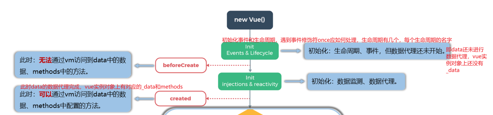

> 初始化阶段模板未解析，页面显示的内容为代码中的样式，代码写什么样就显示什么样。

#### 2.1.1 beforeCreate()

```html
<!DOCTYPE html>
<html lang="en">
<head>
  <meta charset= "UTF-8">
  <meta http-equiv="X-UA-Compatible" content="IE=edge">
  <meta name="viewport" content="width=device-width, initial-scale=1.0">
  <title>Document</title>
</head>
<body>
  <div id="root">
    <h2>n的值：{{n}}</h2>
    <button @click="add">点击n++</button>
  </div>
</body>
<script src="https://cdn.jsdelivr.net/npm/vue@2.6.14/dist/vue.js"></script>
<script>
  const vm = new Vue({
    el: '#root',
    data: {
      n: 0
    },
    methods: {
      add() {
        this.n++
      }
    },
    beforeCreate() {
      console.log('---- beforeCreate ----')
      // 访问vue实例中的data和methods
      console.log(this._data)
      console.log(this.n)
      console.log(this.add)
      debugger
    },
  })
</script>
</html>
```

> 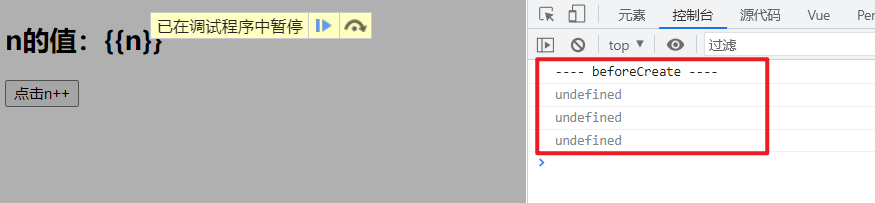

#### 2.1.2 created()

```html
<!DOCTYPE html>
<html lang="en">
<head>
  <meta charset= "UTF-8">
  <meta http-equiv="X-UA-Compatible" content="IE=edge">
  <meta name="viewport" content="width=device-width, initial-scale=1.0">
  <title>Document</title>
</head>
<body>
  <div id="root">
    <h2>n的值：{{n}}</h2>
    <button @click="add">点击n++</button>
  </div>
</body>
<script src="https://cdn.jsdelivr.net/npm/vue@2.6.14/dist/vue.js"></script>
<script>
  const vm = new Vue({
    el: '#root',
    data: {
      n: 0
    },
    methods: {
      add() {
        this.n++
      }
    },
    beforeCreate() {
      console.log('---- beforeCreate ----')
      // 访问vue实例中的data和methods
      // console.log(this._data)
      // console.log(this.n)
      // console.log(this.add)
      // debugger
    },
    created() {
      console.log('---- created ----')
      // 访问vue实例中的data和methods
      console.log(this._data)
      console.log(this.n)
      console.log(this.add)
      debugger
    },
  })
</script>
</html>
```

> 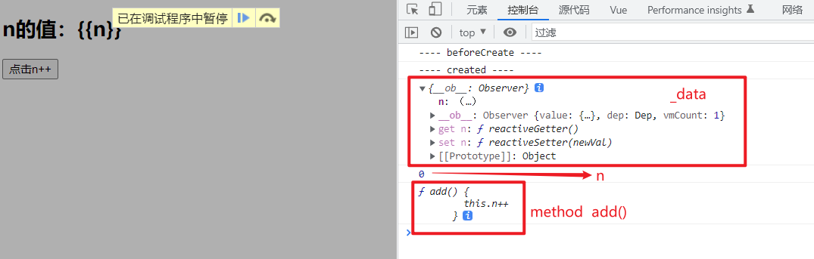

### 2.2 模板的编译

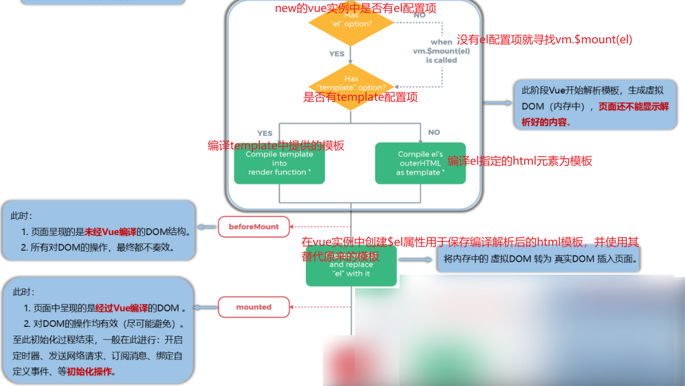

#### 2.2.1 outerHTML & innerHTML

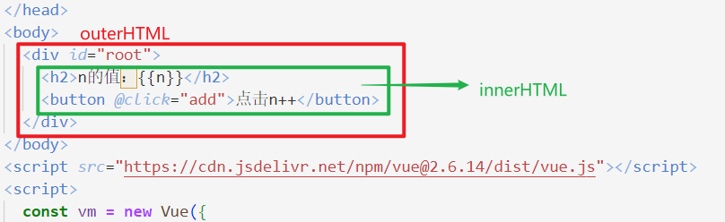

#### 2.2.2 beforeMount()

```js
    beforeMount() {
      console.log('---- beforeMount ----')
      debugger
    },
```

> 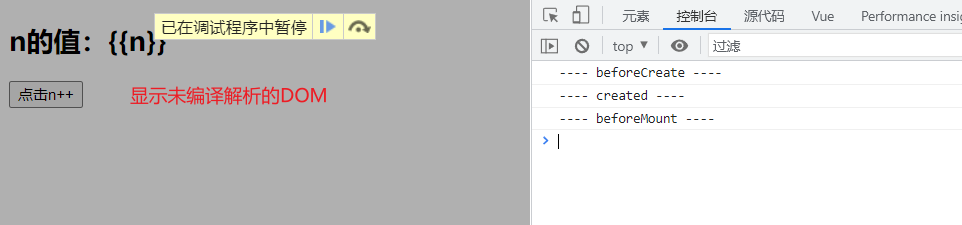

> 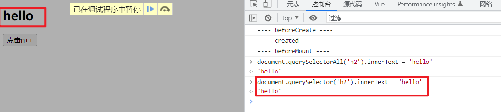
> 

#### 2.2.3 mounted()

```js
    mounted() {
      console.log('---- mounted ----')
      debugger
    },
```

> 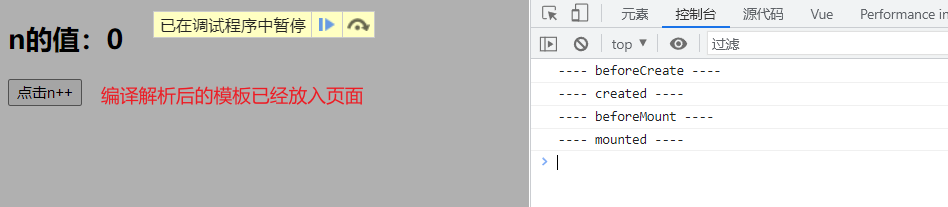

> 此时对DOM元素操作有效
> 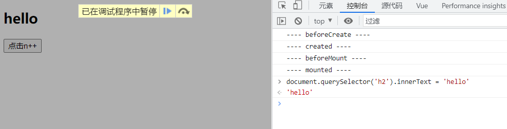
> 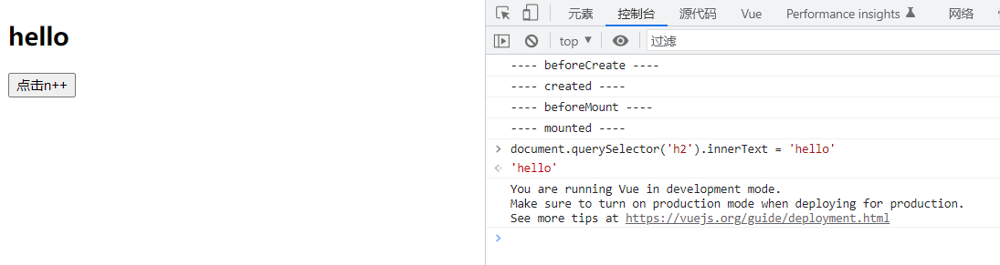

#### 2.2.4 template配置项提供模板

使用template配置项提供模板，提供的目标只能有一个根节点，使用template配置项提供模板，vue不会编译解析提前提供的容器，即只解析提供的innerHTML。

> 不能使用`template`标签作为根节点

> 不使用template配置项提供模板，vue编译解析的为outerHTML。
> 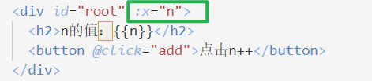
> 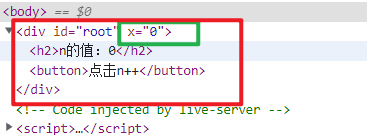

```html
<!DOCTYPE html>
<html lang="en">
<head>
  <meta charset= "UTF-8">
  <meta http-equiv="X-UA-Compatible" content="IE=edge">
  <meta name="viewport" content="width=device-width, initial-scale=1.0">
  <title>Document</title>
</head>
<body>
  <div id="root" :x="n">
    
  </div>
</body>
<script src="https://cdn.jsdelivr.net/npm/vue@2.6.14/dist/vue.js"></script>
<script>
  const vm = new Vue({
    el: '#root',
    // 字符串换行书写，使用es6的模板字符串
    template: `
    <div>
      <h2>n的值：{{n}}</h2>
      <button @click="add">点击n++</button>
    </div>
    `,
    data: {
      n: 0
    },
    methods: {
      add() {
        this.n++
      }
    },
    beforeCreate() {
      console.log('---- beforeCreate ----')
    },
    created() {
      console.log('---- created ----')
    },
    beforeMount() {
      console.log('---- beforeMount ----')
    },
    mounted() {
      console.log('---- mounted ----')
    },
  })
</script>
</html>
```

> 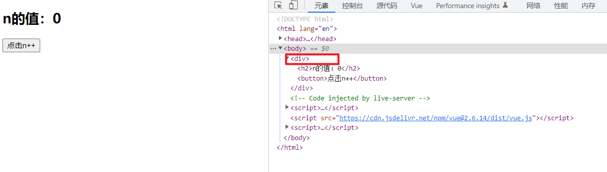

#### 2.2.5 $el

```js
    mounted() {
      console.log('---- mounted ----')
      console.log(this.$el)
      console.log(this.$el instanceof HTMLElement)
      // debugger
    },
```

> 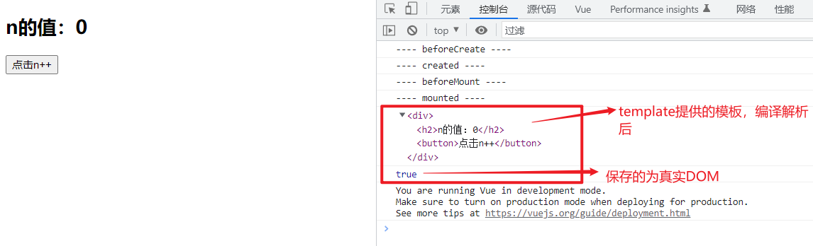

### 2.3 数据更新

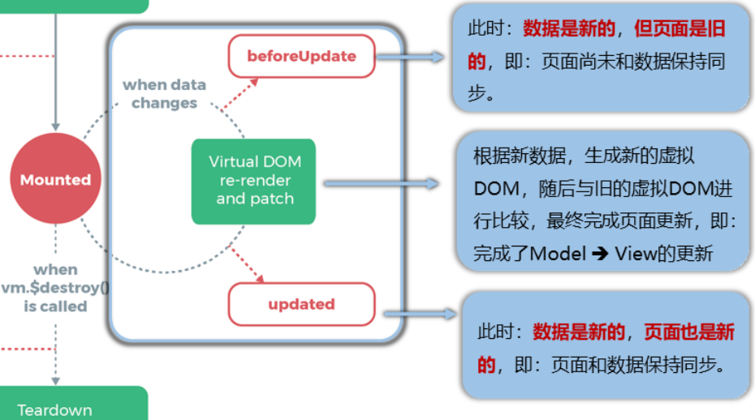

#### 2.3.1 beforeUpdate()

```js
    beforeUpdate() {
      console.log('---- beforeUpdate ----')
      // 打印更新后的数据
      console.log(this.n)
      debugger
    },
```

> 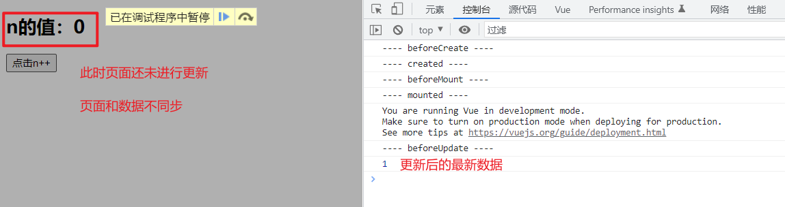

#### 2.3.2 update()

```js
    updated() {
      console.log('---- updated ----')
      // 打印更新后的数据
      console.log(this.n)
      debugger
    },
```

> 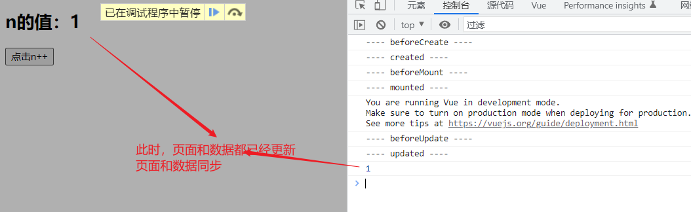

### 2.4 销毁

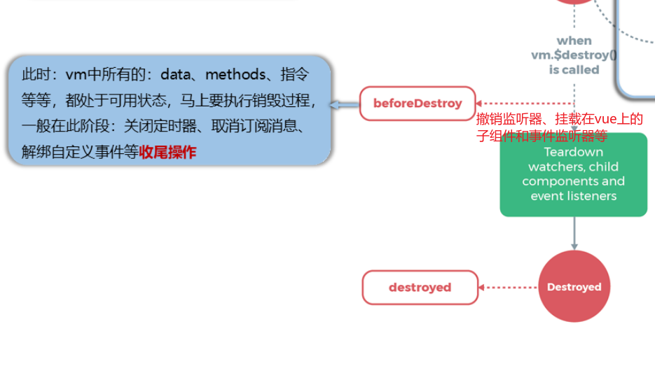

> 销毁vue实例对象，调用`vm.$destroy()`方法，在开发中一般不使用该方法。

#### 2.4.1 beforeDestroy()

```html
<!DOCTYPE html>
<html lang="en">
  <head>
    <meta charset="UTF-8" />
    <meta http-equiv="X-UA-Compatible" content="IE=edge" />
    <meta name="viewport" content="width=device-width, initial-scale=1.0" />
    <title>Document</title>
  </head>
  <body>
    <div id="root" :x="n">
      <h2>n的值：{{n}}</h2>
      <button @click="add">点击n++</button>
      <button @click="destroy">点击销毁</button>
    </div>
  </body>
  <script src="https://cdn.jsdelivr.net/npm/vue@2.6.14/dist/vue.js"></script>
  <script>
    const vm = new Vue({
      el: '#root',
      data: {
        n: 0,
      },
      methods: {
        add() {
          this.n++
        },
        // 销毁vue实例对象
        destroy() {
          this.$destroy()
        },
      },
      beforeCreate() {
        console.log('---- beforeCreate ----')
        // 访问vue实例中的data和methods
        // console.log(this._data)
        // console.log(this.n)
        // console.log(this.add)
        // debugger
      },
      created() {
        console.log('---- created ----')
        // 访问vue实例中的data和methods
        // console.log(this._data)
        // console.log(this.n)
        // console.log(this.add)
        // debugger
      },
      beforeMount() {
        console.log('---- beforeMount ----')
        // debugger
      },
      mounted() {
        console.log('---- mounted ----')
        // console.log(this.$el)
        // console.log(this.$el instanceof HTMLElement)
        // debugger
      },
      beforeUpdate() {
        console.log('---- beforeUpdate ----')
        // 打印更新后的数据
        // console.log(this.n)
        // debugger
      },
      updated() {
        console.log('---- updated ----')
        // 打印更新后的数据
        // console.log(this.n)
        // debugger
      },
      beforeDestroy() {
        console.log('---- beforeDestroy ----')
        // 此时data中的数据和methods中的方法还可以使用
        this.add()
        console.log(this.n)
        debugger
      },
    })
  </script>
</html>
```

> 

#### 2.4.2 destroy()

## 3. 生命周期 总结

> vue不同函数间使用同一个变量，可以将变量挂在vue实例上(this->vue实例vm)。

- 常用的生命周期钩子：
  - 1.mounted: 发送ajax请求、启动定时器、绑定自定义事件、订阅消息等【初始化操作】。
  - 2.beforeDestroy: 清除定时器、解绑自定义事件、取消订阅消息等【收尾工作】。
- 关于销毁Vue实例
  - 1.销毁后借助Vue开发者工具看不到任何信息。
  - 2.销毁后自定义事件会失效，但原生DOM事件依然有效。
  - 3.一般不会在beforeDestroy操作数据，因为即便操作数据，也不会再触发更新流程了。

