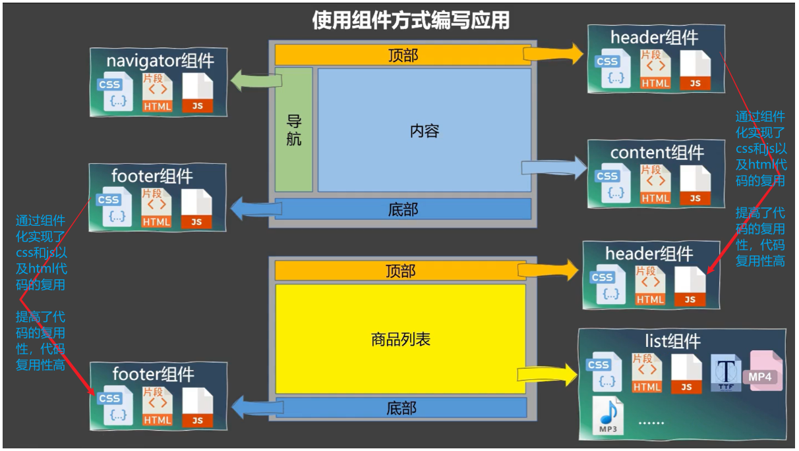
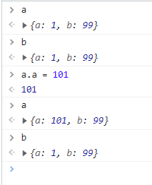
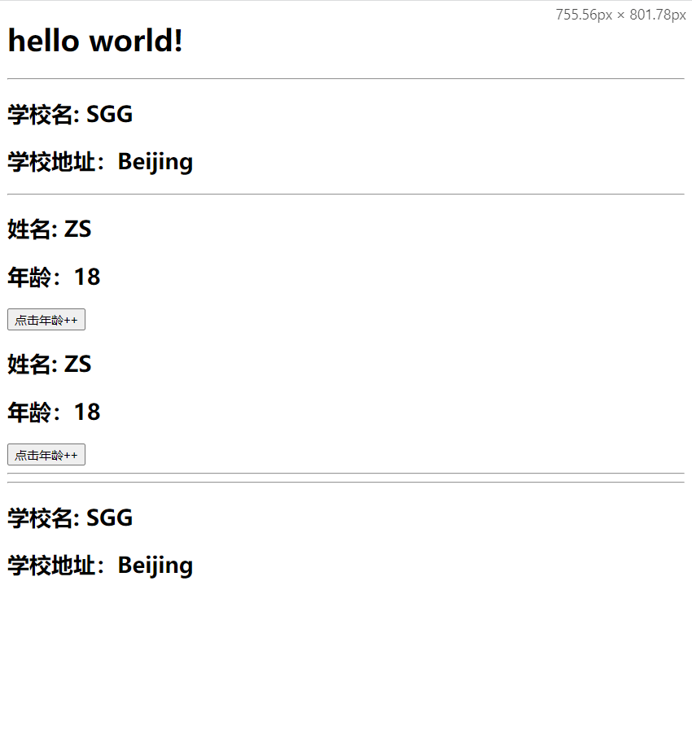
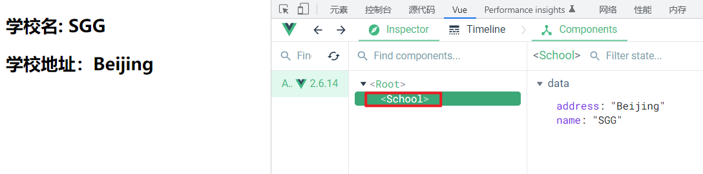
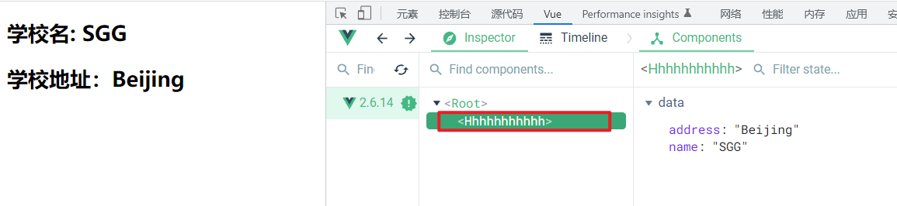
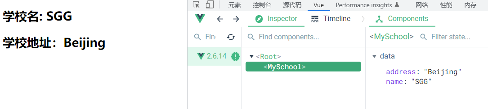
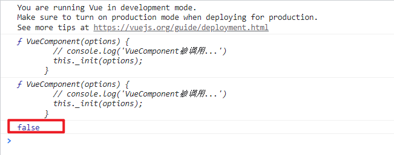
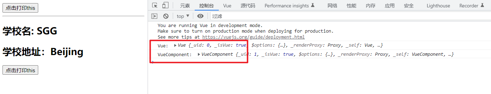
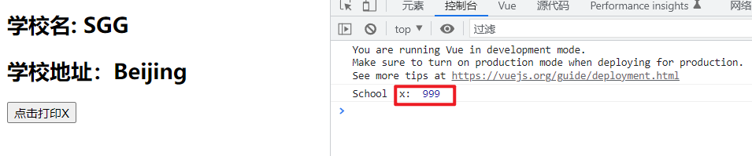

# 组件

## 1. 对组件的理解

### 1.1 传统方式编写网页


> 对于传统方式编写网页：
>
> 1. 实现了代码复用，页面的顶部和底部的css样式以及页面顶部和底部的js实现了代码的复用，但是页面的代码复用率不高，页面的结构代码html没有得到复用。
> 2. 页面的依赖关系混乱，一个页面引入多个css和js，一个css代码和js代码又被多个页面引用，如果此时css代码和js代码之间又存在相互引用，则此时代码间的关系更加混乱，这个情况下代码不利于维护，可能牵一发而动全身。
> 3. 上述图片中js代码实现了模块化。

> 模块化：当应用中的 js 都以模块来编写的，那这个应用就是一个模块化的应用。即将一个庞大的js代码文件，根据需求和功能进行模块的拆分，将一个庞大的js代码文件拆分成多个js代码文件。
> 模块：向外提供特定功能的 js 程序，一般就是一个 js 文件。
> 模块的作用：复用 js，简化 js 的编写，提高 js 运行效率。

### 1.2 组件方式编写页面



> 对于组件方式编写页面：
>
> 1. 整个组件，包含html、css、js，都能实现复用，需要某个组件时，只要将对应的组件整个引入即可，提高了代码的复用性。
> 2. 在组件化编程中，各个组件都有属于自己的html、css、js，每个组件之间不会相互影响，不会出现页面的依赖关系混乱，不利于维护的情况。
> 3. 在组件化编程中也可以实现模块化，在一个组件中，也可以将该组件的js代码进行拆分，根据功能和需求拆分多个js代码。
>    

> 组件化：当应用中的功能都是多组件的方式来编写的，那这个应用就是一个组件化的应用。即将一个页面拆分成多个部分(组件)，每个组件都有属于自己的代码和资源，单独编写自己的html、css、js。不同组件间可以进行引用。
> 组件：用来实现局部功能的代码和资源的集合（html/css/js/image…）
> 组件的作用：复用编码，简化项目编码，提高运行效率
> 

## 2. 定义/创建组件

在vue中，组件有两种形式，非单文件组件和单文件组件。

### 2.1 非单文件组件（几乎不用）

非单文件组件：一个文件中包含n个组件。

#### 2.1.1 创建组件

创建组件语法：

```javascript
const 组件名 = Vue.extend({
	// el: '' 在组件定义时，一定不要写el配置项，因为最终所有的组件都要被一个vm管理，由vm决定服务于哪个容器。
	// 组件控制的模板 html
    template: '',
	data() {
		return {
			k: v,
			k: v,
			...
		}
	}
})
```

- 在组件定义时，一定不要写el配置项，因为最终所有的组件都要被一个vm管理，由vm决定服务于哪个容器。

- 在组件定义时，data配置项一定要写成函数形式。

  - 如果写成对象形式，则多个组件都引用了该新组件，则多个组件的页面中的data都是对该新组件中data的引用，一个组件修改了值，另一个组件也会受到影响。

  - 如果写成函数形式，则每次都会返回一个新的data对象，不同组件之间不会互相影响。

    ```javascript
      function data() {
        return {
          a: 1,
          b: 99
        }
      }
    
      a = data()
      b = data()
    ```

    > 

```js
    // 创建学校组件
    const school = Vue.extend({
      // 组件控制的模板 html
      template: `
        <div>
          <h2>学校名: {{name}}</h2>
          <h2>学校地址：{{address}}</h2>  
        </div>
      `,
      // 组件控制模板的数据
      data() {
        return {
          name: 'SGG',
          address: 'Beijing'
        }
      }
    })

    // 创建学生组件
    const student = Vue.extend({
      // 组件控制的模板 html
      template: `
        <div>
          <h2>姓名: {{name}}</h2>
          <h2>年龄：{{age}}</h2>
          <button @click="age++">点击年龄++</button>
        </div>
      `,
      // 组件控制模板的数据
      data() {
        return {
          name: 'ZS',
          age: 18
        }
      }
    })
```

#### 2.1.2 注册组件(局部注册)

在vue实例vm中注册组件，使用`components`配置项。

语法：

```javascript
new Vue({
	el: '#root',
	components: {
		组件使用时的名字: 创建时的组件名,
		组件使用时的名字: 创建时的组件名,
		...
	}
})
new Vue({
	el: '#root',
	components: {
		// 组件使用时候的名字和创建时的组件名一致可以简写
		创建时的组件名,
		创建时的组件名,
		...
	}
})
    const vm = new Vue({
      el: '#root',
      // 由于只有一个vm，不会出现冲突
      // vm的data可以使用对象形式
      data: {
        msg: 'hello world!'
      },
      // 注册组件
      // 组件使用时候的名字和组件创建时候的名字一样
      components: {
        school,  //等价于：school:school
        student  //等价于：student:student
      } 
    })
```

#### 2.1.3 使用组件

使用组件，只需要在页面中需要使用组件的位置编写对应组件的组件标签即可。

```html
<组件使用时的名字></组件使用时的名字>
  <body>
    <div id="root">
      <h1>{{msg}}</h1>
      <hr />
      <school></school>
      <hr />
      <student></student>
      <!-- 组件的复用 -->
      <student></student>
    </div>
  </body>
```

> 

#### 2.1.4 页面完整代码

```html
<!DOCTYPE html>
<html lang="en">
  <head>
    <meta charset="UTF-8" />
    <meta http-equiv="X-UA-Compatible" content="IE=edge" />
    <meta name="viewport" content="width=device-width, initial-scale=1.0" />
    <title>Document</title>
  </head>
  <body>
    <div id="root">
      <h1>{{msg}}</h1>
      <hr />
      <school></school>
      <hr />
      <student></student>
      <student></student>
    </div>
  </body>
  <script src="https://cdn.jsdelivr.net/npm/vue@2.6.14/dist/vue.js"></script>
  <script>
    // 创建学校组件
    const school = Vue.extend({
      // 组件控制的模板 html
      template: `
        <div>
          <h2>学校名: {{name}}</h2>
          <h2>学校地址：{{address}}</h2>  
        </div>
      `,
      // 组件控制模板的数据
      data() {
        return {
          name: 'SGG',
          address: 'Beijing',
        }
      },
    })

    // 创建学生组件
    const student = Vue.extend({
      // 组件控制的模板 html
      template: `
        <div>
          <h2>姓名: {{name}}</h2>
          <h2>年龄：{{age}}</h2>
          <button @click="age++">点击年龄++</button>
        </div>
      `,
      // 组件控制模板的数据
      data() {
        return {
          name: 'ZS',
          age: 18,
        }
      },
    })

    const vm = new Vue({
      el: '#root',
      // 由于只有一个vm，不会出现冲突
      // vm的data可以使用对象形式
      data: {
        msg: 'hello world!',
      },
      // 注册组件
      // 组件使用时候的名字和组件创建时候的名字一样
      components: {
        school,
        student,
      },
    })
  </script>
</html>
```

#### 2.1.5 注册组件(全局注册)

语法：

```js
// 全局注册school组件
Vue.component('school', school)
```

示例

```html
<!DOCTYPE html>
<html lang="en">
  <head>
    <meta charset="UTF-8" />
    <meta http-equiv="X-UA-Compatible" content="IE=edge" />
    <meta name="viewport" content="width=device-width, initial-scale=1.0" />
    <title>Document</title>
  </head>
  <body>
    <div id="root">
      <h1>{{msg}}</h1>
      <hr />
      <school></school>
      <hr />
      <student></student>
      <student></student>
    </div>
    <hr><hr>
    <div id="root2">
        <!-- root2也可以使用全局组件school -->
      <school></school>
    </div>
  </body>
  <script src="https://cdn.jsdelivr.net/npm/vue@2.6.14/dist/vue.js"></script>
  <script>
    // 创建学校组件
    const school = Vue.extend({
      // 组件控制的模板 html
      template: `
        <div>
          <h2>学校名: {{name}}</h2>
          <h2>学校地址：{{address}}</h2>  
        </div>
      `,
      // 组件控制模板的数据
      data() {
        return {
          name: 'SGG',
          address: 'Beijing',
        }
      },
    })

    // 创建学生组件
    const student = Vue.extend({
      // 组件控制的模板 html
      template: `
        <div>
          <h2>姓名: {{name}}</h2>
          <h2>年龄：{{age}}</h2>
          <button @click="age++">点击年龄++</button>
        </div>
      `,
      // 组件控制模板的数据
      data() {
        return {
          name: 'ZS',
          age: 18,
        }
      },
    })

    Vue.component('school', school)

    const vm = new Vue({
      el: '#root',
      // 由于只有一个vm，不会出现冲突
      // vm的data可以使用对象形式
      data: {
        msg: 'hello world!',
      },
      // 注册组件
      // 组件使用时候的名字和组件创建时候的名字一样
      components: {
        student
      },
    })

    new Vue({
      el: '#root2'
    })
  </script>
</html>
```

> 

#### 2.1.6 非单文件组件 总结

- Vue中使用组件的三大步骤：
  - 一、定义组件(创建组件)
  - 二、注册组件
  - 三、使用组件(写组件标签)
- 一、如何定义一个组件？
  - 使用`Vue.extend(options)`创建，其中`options`和`new Vue(options)`时传入的那个`options`几乎一样，但也有点区别；
  - 区别如下：
    - 1.el不要写，为什么？ ——— 最终所有的组件都要经过一个vm的管理，由vm中的el决定服务哪个容器。
    - 2.data必须写成函数，为什么？ ———— 避免组件被复用时，数据存在引用关系。
  - 备注：使用`template`可以配置组件结构。
- 二、如何注册组件？
  - 1.局部注册：靠`new Vue`的时候传入`components`选项
  - 2.全局注册：靠`Vue.component('组件名',组件)`
- 三、编写组件标签：
  - `<school></school>`

### 2.2 组件的注意点

#### 2.2.1 组件的名称由一个单词组成

组件的名称由一个单词组成时，可以使用首字母大写的写法，这种写法可以与vue的开发者工具相呼应。

```html
<!DOCTYPE html>
<html lang="en">
  <head>
    <meta charset="UTF-8" />
    <meta http-equiv="X-UA-Compatible" content="IE=edge" />
    <meta name="viewport" content="width=device-width, initial-scale=1.0" />
    <title>Document</title>
  </head>
  <body>
    <div id="root">
      <School></School>
    </div>
  </body>
  <script src="https://cdn.jsdelivr.net/npm/vue@2.6.14/dist/vue.js"></script>
  <script>
    // 创建学校组件
    const school = Vue.extend({
      // 组件控制的模板 html
      template: `
        <div>
          <h2>学校名: {{name}}</h2>
          <h2>学校地址：{{address}}</h2>  
        </div>
      `,
      // 组件控制模板的数据
      data() {
        return {
          name: 'SGG',
          address: 'Beijing',
        }
      },
    })

    const vm = new Vue({
      el: '#root',
      data: {
        msg: 'hello world!',
      },
      components: {
        School: school
      },
    })
  </script>
</html>
```

> 

#### 2.2.2 组件的名称由多个单词组成

##### 2.2.2.1 写法一(kebab-case命名)

组件的名称由多个单词组成时，使用短线连接不同单词的写法。此时，组件名要使用引号进行包裹。这种写法vue开发者工具会将不同单词取出每个单词首字母大写进行显示。

```html
<!DOCTYPE html>
<html lang="en">
  <head>
    <meta charset="UTF-8" />
    <meta http-equiv="X-UA-Compatible" content="IE=edge" />
    <meta name="viewport" content="width=device-width, initial-scale=1.0" />
    <title>Document</title>
  </head>
  <body>
    <div id="root">
      <my-school></my-school>
    </div>
  </body>
  <script src="https://cdn.jsdelivr.net/npm/vue@2.6.14/dist/vue.js"></script>
  <script>
    // 创建学校组件
    const school = Vue.extend({
      // 组件控制的模板 html
      template: `
        <div>
          <h2>学校名: {{name}}</h2>
          <h2>学校地址：{{address}}</h2>  
        </div>
      `,
      // 组件控制模板的数据
      data() {
        return {
          name: 'SGG',
          address: 'Beijing',
        }
      },
    })

    const vm = new Vue({
      el: '#root',
      data: {
        msg: 'hello world!',
      },
      components: {
        'my-school': school
      },
    })
  </script>
</html>
```

> 

##### 2.2.2.2 写法二(CamelCase命名)

组件的名称由多个单词组成时，使用每个单词首字母大写的写法，**此种写法需要脚手架的环境下使用。**

```html
components: {
  MySchool: school
},
<MySchool></MySchool>
```

> 组件名尽可能回避HTML中已有的元素名称，例如：h2、H2都不行。

#### 2.2.3 组件的name配置项

可以使用name配置项指定组件在开发者工具中呈现的名字。

```html
<!DOCTYPE html>
<html lang="en">
  <head>
    <meta charset="UTF-8" />
    <meta http-equiv="X-UA-Compatible" content="IE=edge" />
    <meta name="viewport" content="width=device-width, initial-scale=1.0" />
    <title>Document</title>
  </head>
  <body>
    <div id="root">
      <my-school></my-school>
    </div>
  </body>
  <script src="https://cdn.jsdelivr.net/npm/vue@2.6.14/dist/vue.js"></script>
  <script>
    // 创建学校组件
    const school = Vue.extend({
      name: 'hhhhhhhhhhh',
      // 组件控制的模板 html
      template: `
        <div>
          <h2>学校名: {{name}}</h2>
          <h2>学校地址：{{address}}</h2>  
        </div>
      `,
      // 组件控制模板的数据
      data() {
        return {
          name: 'SGG',
          address: 'Beijing',
        }
      },
    })

    const vm = new Vue({
      el: '#root',
      data: {
        msg: 'hello world!',
      },
      components: {
        'my-school': school
      },
    })
  </script>
</html>
```

> 

#### 2.2.4 创建组件的简写形式

```js
const school = Vue.extend(options) 

可简写为：

const school = options
```

> ```
> const school = options`此种写法，在vue的底层会自动调用`Vue.extend()
> ```

```html
<!DOCTYPE html>
<html lang="en">
  <head>
    <meta charset="UTF-8" />
    <meta http-equiv="X-UA-Compatible" content="IE=edge" />
    <meta name="viewport" content="width=device-width, initial-scale=1.0" />
    <title>Document</title>
  </head>
  <body>
    <div id="root">
      <my-school></my-school>
    </div>
  </body>
  <script src="https://cdn.jsdelivr.net/npm/vue@2.6.14/dist/vue.js"></script>
  <script>
    // 创建学校组件
    const school = {
      name: 'MySchool',
      // 组件控制的模板 html
      template: `
        <div>
          <h2>学校名: {{name}}</h2>
          <h2>学校地址：{{address}}</h2>  
        </div>
      `,
      // 组件控制模板的数据
      data() {
        return {
          name: 'SGG',
          address: 'Beijing',
        }
      },
    }

    const vm = new Vue({
      el: '#root',
      data: {
        msg: 'hello world!',
      },
      components: {
        'my-school': school
      },
    })
  </script>
</html>
```

> 

### 2.3 组件的嵌套

> 注意：被使用的组件需要先定义，组件定义完成后才能进行注册使用。
> 组件在哪个组件管理的模块使用，就在哪个模块进行注册使用

> 在开发中，通常会定义一个名为App的组件，用于管理其他全部的组件，而App组件收到vm的管理。

```html
<!DOCTYPE html>
<html lang="en">
  <head>
    <meta charset="UTF-8" />
    <meta http-equiv="X-UA-Compatible" content="IE=edge" />
    <meta name="viewport" content="width=device-width, initial-scale=1.0" />
    <title>Document</title>
  </head>
  <body>
    <div id="root">
      
    </div>
  </body>
  <script src="https://cdn.jsdelivr.net/npm/vue@2.6.14/dist/vue.js"></script>
  <script>
    // 定义student组件 在school中注册使用
    const student = Vue.extend({
      name: 'Student',
      template: `
        <div>
          <h2>姓名: {{name}}</h2>
          <h2>年龄：{{age}}</h2>  
        </div>
      `,
      data() {
        return {
          name: 'ZS',
          age: 18,
        }
      },
    })

    // 定义school组件
    const school = Vue.extend({
      name: 'School',
      template: `
        <div>
          <h2>学校名: {{name}}</h2>
          <h2>学校地址：{{address}}</h2>
          <hr>
          <!-- 使用student组件 -->
          <student></student>  
        </div>
      `,
      data() {
        return {
          name: 'SGG',
          address: 'Beijing',
        }
      },
      components: {
        // 注册student组件
        student,
      },
    })

    // 定义hello组件 与school组件平级
    const hello = Vue.extend({
      name: 'Hello',
      template: `
        <div>
          <h1>Hello World!</h1>  
        </div>
      `,
    })

    // 定义app组件用于管理所有的组件
    const app = Vue.extend({
      name: 'App',
      template:`
        <div>
          <!-- 使用hello与student组件 -->
          <hello></hello>
          <school></school>  
        </div>
      `,
      components: {
        // 注册hello与school组件
        hello,
        school,
      }
    })

    const vm = new Vue({
      el: '#root',
      // 使用app组件
      template: `<app></app>`,
      components: {
        // 注册App组件
        app
      },
    })
  </script>
</html>
```

> 

### 2.4 VueComponent

#### 2.4.1 组件为VueComponent的构造函数

组件本质是一个名为VueComponent构造函数，且不是程序员定义的，是Vue.extend生成的。

> 在页面中使用了组件，才会进行vue组件实例对象的创建。

```js
// 定义school组件
const school = Vue.extend({
  name: 'School',
  template: `
    <div>
      <h2>学校名: {{name}}</h2>
      <h2>学校地址：{{address}}</h2> 
    </div>
  `,
  data() {
    return {
      name: 'SGG',
      address: 'Beijing',
    }
  }
})

console.log(school)
```

> 

```js
//Vue.js源码
Vue.extend = function (extendOptions) {
  /* ...... */ 

  var Sub = function VueComponent (options) {
    this._init(options);
  };
  
  /* ...... */

  return Sub
};
```

由Vue.extend()的源代码可知，在Vue.extend()内创建了一个VueComponent函数，并将该函数进行了返回。所以组件是一个名为VueComponent构造函数，且是由Vue.extend生成的。

#### 2.4.2 使用组件自动调用new VueComponent()

以school组件为例，我们只需要写`<school/>`或`<school></school>`，Vue解析时会帮我们创建 school 组件的实例对象 ，即Vue帮我们执行的：`new VueComponent(options)`。

修改vue.js中`Vue.extend()`源代码：

```js
var Sub = function VueComponent(options) {
    console.log('VueComponent被调用...')
    this._init(options);
};
```

使用两次school组件：

```html
<!DOCTYPE html>
<html lang="en">
  <head>
    <meta charset="UTF-8" />
    <meta http-equiv="X-UA-Compatible" content="IE=edge" />
    <meta name="viewport" content="width=device-width, initial-scale=1.0" />
    <title>Document</title>
  </head>
  <body>
    <div id="root">
      <school></school>
      <school></school>
    </div>
  </body>
  <!-- <script src="https://cdn.jsdelivr.net/npm/vue@2.6.14/dist/vue.js"></script> -->
  <script src="../js/vue.js"></script>
  <script>
    // 定义school组件
    const school = Vue.extend({
      name: 'School',
      template: `
        <div>
          <h2>学校名: {{name}}</h2>
          <h2>学校地址：{{address}}</h2> 
        </div>
      `,
      data() {
        return {
          name: 'SGG',
          address: 'Beijing',
        }
      }
    })

    console.log(school)

    const vm = new Vue({
      el: '#root',
      components: {
        school
      },
    })
  </script>
</html>
```

> 

#### 2.4.3 每次创建组件返回全新的VueComponent

每次调用Vue.extend，返回的都是一个全新的VueComponent。

```html
  <script>
    // 定义school组件
    const school = Vue.extend({
      name: 'School',
      template: `
        <div>
          <h2>学校名: {{name}}</h2>
          <h2>学校地址：{{address}}</h2> 
        </div>
      `,
      data() {
        return {
          name: 'SGG',
          address: 'Beijing',
        }
      }
    })

    // 定义hello组件
    const hello = Vue.extend({
      name: 'Hello',
      template: `
        <div>
          <h2>Hello World!</h2> 
        </div>
      `
    })


    console.log(school)
    console.log(hello)
    console.log(hello === school)
  </script>
```

> 

#### 2.4.4 this的指向

- (1).组件配置中：
  - data函数、methods中的函数、watch中的函数、computed中的函数 它们的this均是【VueComponent实例对象】。
- (2).new Vue(options)配置中：
  - data函数、methods中的函数、watch中的函数、computed中的函数 它们的this均是【Vue实例对象】。

```html
<!DOCTYPE html>
<html lang="en">
  <head>
    <meta charset="UTF-8" />
    <meta http-equiv="X-UA-Compatible" content="IE=edge" />
    <meta name="viewport" content="width=device-width, initial-scale=1.0" />
    <title>Document</title>
  </head>
  <body>
    <div id="root">
      <button @click="showThis">点击打印this</button>
      <hr />
      <school></school>
    </div>
  </body>
  <!-- <script src="https://cdn.jsdelivr.net/npm/vue@2.6.14/dist/vue.js"></script> -->
  <script src="../js/vue.js"></script>
  <script>
    // 定义school组件
    const school = Vue.extend({
      name: 'School',
      template: `
        <div>
          <h2>学校名: {{name}}</h2>
          <h2>学校地址：{{address}}</h2> 
          <button @click="showThis">点击打印this</button>
        </div>
      `,
      data() {
        return {
          name: 'SGG',
          address: 'Beijing',
        }
      },
      methods: {
        showThis() {
          console.log('VueComponent: ', this)
        },
      },
    })

    const vm = new Vue({
      el: '#root',
      components: {
        school,
      },
      methods: {
        showThis() {
          console.log('Vue: ', this)
        },
      },
    })
  </script>
</html>
```

> 

### 2.5 一个重要的内置关系

> [JavaScript高级 – 原型与原型链](D:\学习文件\自学\前端\03-04-JavaScript高级-尚硅谷.md)


在Vue中，VueComponent()的原型对象的原型对象为Vue()的原型对象。即组件的原型对象的原型对象为Vue()的原型对象。

```properties
VueComponent.prototype.__proto__ === Vue.prototype
```

> Vue()为vue实例的构造函数，VueComponent()为组件实例的构造函数。

这个重要的内置关系的作用：让组件实例对象（vc）可以访问到 Vue原型上的属性、方法。这样子就不用再VueComponent的原型对象上再添加一份与Vue原型对象上相同的属性和方法。


```html
<!DOCTYPE html>
<html lang="en">
  <head>
    <meta charset="UTF-8" />
    <meta http-equiv="X-UA-Compatible" content="IE=edge" />
    <meta name="viewport" content="width=device-width, initial-scale=1.0" />
    <title>Document</title>
  </head>
  <body>
    <div id="root">
      <school></school>
    </div>
  </body>
  <!-- <script src="https://cdn.jsdelivr.net/npm/vue@2.6.14/dist/vue.js"></script> -->
  <script src="../js/vue.js"></script>
  <script>
    // 向Vue的原型对象上添加属性x
    Vue.prototype.x = 999

    // 定义school组件
    const school = Vue.extend({
      name: 'School',
      template: `
        <div>
          <h2>学校名: {{name}}</h2>
          <h2>学校地址：{{address}}</h2> 
          <button @click="showX">点击打印X</button>
        </div>
      `,
      data() {
        return {
          name: 'SGG',
          address: 'Beijing',
        }
      },
      methods: {
        showX() {
          // 在组件实例对象中无x，会向VueComponent的原型对象查找
          // VueComponent的原型对象也无x，会向Vue的原型对象查找
          // 最终在Vue的原型对象中查找到x
          console.log('School  x: ', this.x)
        },
      },
    })

    const vm = new Vue({
      el: '#root',
      components: {
        school,
      }
    })
  </script>
</html>
```

> 

### 2.6 单文件组件

单文件组件：一个文件中只包含一个组件。

在单文件组件中，一个组件就是一个`.vue`文件。

> vue组件文件的命名
> 使用小写单词：
>
> 1. 单个单词：school.vue
> 2. 多个单词：my-school.vue
>
> 使用首字母大写单词：(推荐)
> 这种写法与vue开发者工具显示的组件名一致。
>
> 1. 单个单词：School.vue
> 2. 多个单词：MySchool.vue

#### 2.6.1 单文件组件代码的书写位置

```html
<template>
  <!-- vue2中组件结构中只能有一个根节点 -->
  <div>
    <!-- 组件的结构 -->
  </div>
</template>

<script>
  // 组件交互相关的代码
</script>

<style>
  /* 组件的样式 */
</style>
```

> .vue文件中，代码高亮显示插件
> 
> 安装该插件后，骨架代码快速生成：`<v + 回车`

#### 2.6.2 组件js代码的暴露

1.分别暴露

```html
<script>
  export 需要暴露的方法或变量
</script>
```

2.统一暴露

```html
<script>
  export {
	需要暴露的方法或变量,
	...
  }
</script>
```

3.默认暴露

> 当暴露的东西为一个时，一般使用默认暴露，引入时直接`import xxx from xxx`

```html
<script>
  export default 需要暴露的方法或变量
</script>
```

#### 2.6.3 组件的创建与使用

School组件：

```html
<template>
  <div class="demo">
    <h2>学校名: {{name}}</h2>
    <h2>学校地址：{{address}}</h2>
    <button @click="showX">点击打印X</button>
  </div>
</template>

<script>
// 由于只需要向外暴露一个VueComponent
// 所以使用默认暴露
// 由于vue.extend()可以省略
// 可以直接写组件的配置对象
// 注册组件使用组件时，vue.extend()会自动调用
export default {
  name: 'School',
  data() {
    return {
      name: 'SGG',
      address: 'Beijing'
    }
  },
  methods: {
    showX() {
      console.log('School  x: ', this.x)
    }
  }
}
</script>

<style>
.demo {
  background-color: orange;
}
</style>
```

Student组件：

```html
<template>
  <div>
    <h2>学生姓名：{{name}}</h2>
    <h2>学生年龄：{{age}}</h2>
  </div>
</template>

<script>
export default {
  name: 'Student',
  data() {
    return {
      name: '张三',
      age: 18
    }
  }
}
</script>

<style>
</style>
```

App组件：

```html
<template>
	<div>
		<School></School>
		<Student></Student>
	</div>
</template>

<script>
	//引入组件
	import School from './School.vue'
	import Student from './Student.vue'

	export default {
		name:'App',
		components:{
			School,
			Student
		}
	}
</script>
```

编写入口文件main.js，创建vue实例，注册App组件：

```js
// 导入App组件
import App from './App.vue'

new Vue({
	el:'#root',
	template:`<App></App>`,
	components:{App},
})
```

编写index.html页面，提供容器使用组件：

> 当前这个页面在浏览器不能正常运行，因为main.js中的import为es6语法，浏览器不支持解析es6语法。需要使用脚手架。

```html
<!DOCTYPE html>
<html>
	<head>
		<meta charset="UTF-8" />
		<title>练习一下单文件组件的语法</title>
	</head>
	<body>
		<!-- 准备一个容器 -->
		<div id="root"></div>
		<script type="text/javascript" src="../js/vue.js"></script>
		<script type="text/javascript" src="./main.js"></script>
	</body>
</html>
```

