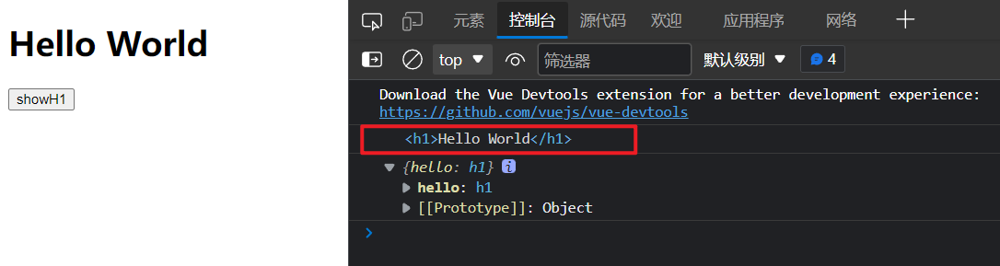
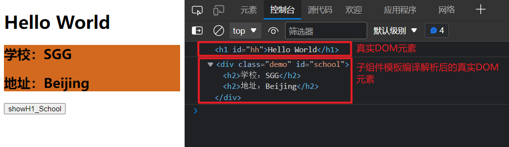

# ref属性

------

ref 属性被用来给元素或子组件注册引用信息（id的替代者），相当于对页面元素或子组件标识，使用 ref 属性标识页面元素或子组件之后，被标识的元素或子组件会被所在的组件实例对象收集，挂载在所在组件实例对象的`$ref`属性上。

## 1 ref 属性的使用方式

### 1.1 标识元素或子组件

标记 html 标签元素：

```html
<h1 ref="xxx">.....</h1>
```

标记子组件：

```html
<School ref="xxx"></School>
```

### 1.2 获取标识的元素或子组件

```js
this.$refs.xxx
```

> 其中，this为被标记的元素或子组件所在的组件实例对象。

## 2 使用 ref 属性标记 html 标签元素

ref 属性应用在 html 标签元素上，获取的是对应的真实 DOM 元素

```html
<template>
  <div>
    <h1 ref="hello">Hello World</h1>
    <button @click="showH1">showH1</button>
  </div>
</template>

<script>
export default {
  name: 'App'
  methods: {
    showH1() {
      console.log(this.$refs.hello)
      console.log(this.$refs)
    }
  }
}
</script>

<style>

</style>
```

> 

## 3 使用 ref 属性标记子组件

ref 属性应用在组件标签上，获取的是对应组件实例对象

MySchool组件：

```html
<template>
  <div class="demo">
    <h2>学校：{{name}}</h2>
    <h2>地址：{{address}}</h2>
  </div>
</template>

<script>
export default {
  name: 'MySchool',
  data() {
    return {
      name: 'SGG',
      address: 'Beijing'
    }
  },
}
</script>

<style>
  .demo {
    background-color: chocolate;
  }
</style>
```

App组件：

```html
<template>
  <div>
    <h1 ref="hello">Hello World</h1>
    <MySchool ref="myschool"></MySchool>
    <button @click="showH1">showH1</button> <br><br>
    <button @click="showMySchool">showMySchool</button>
  </div>
</template>

<script>
// 导入子组件
import MySchool from './components/MySchool.vue'

export default {
  name: 'App',
  components: {
    MySchool,
  },
  methods: {
    showH1() {
      console.log(this.$refs.hello)
      console.log(this.$refs)
    },
    showMySchool() {
      console.log(this.$refs.myschool)
      console.log(this.$refs)
    }
  }
}
</script>

<style>

</style>
```

> 

## 4 使用 id 获取元素或子组件

```html
<template>
  <div>
    <h1 ref="hello" id="hh">Hello World</h1>
    <MySchool ref="myschool" id="school"></MySchool>
    <button @click="showH1_School">showH1_School</button>
  </div>
</template>

<script>
// 导入子组件
import MySchool from './components/MySchool.vue'

export default {
  name: 'App',
  components: {
    MySchool
  },
  methods: {
    showH1_School() {
      console.log(document.getElementById('hh'))
      console.log(document.getElementById('school'))
    }
  }
}
</script>

<style>
</style>
```

> 

使用 ref 属性和使用 id 进行对比，使用 ref 属性不用自己操作 DOM 元素，**且使用 ref 属性获取子组件时**，**获取的为整个组件实例对象**而不是子组件编译解析后的模板，有利于后期对子组件进行操作。
