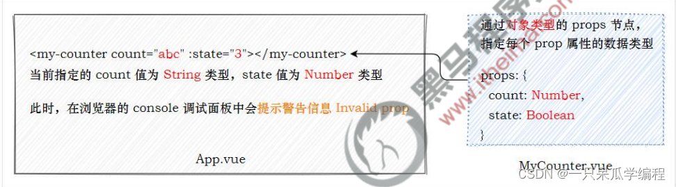

# props

### 1 组件的 props

为了提高组件的复用性，在封装 vue 组件时需要遵守如下的原则：

> 组件的 DOM 结构、Style 样式要尽量复用
> 组件中要展示的数据，尽量由组件的使用者提供

为了方便使用者为组件提供要展示的数据，vue 组件提供了 props 的概念。

props 是组件的自定义属性，组件的使用者可以通过 props 把数据传递到子组件内部，供子组件内部进行使用。

props 的作用：
父组件通过 props 向子组件传递要展示的数据。

props 的好处：
提高了组件的复用性。

### 2 在组件中声明 props

在封装 vue 组件时，可以把动态的数据项声明为 props 自定义属性。自定义属性可以在当前组件的模板结构中被直接使用。示例代码如下：

```html
<template>
  <div>
    <h3>标题：{{title}}</h3>
    <h5>作者：{{author}}</h5>
    <h6>发布时间：{{pubTime}}</h6>
  </div>
</template>

<script>
export default {
  name: 'MyArticle',
  // 外界可以传递指定的数据，到当前的组件中
  props: ['title', 'author', 'pubTime']
}
</script>
```

父组件向子组件传值，可以直接传值，也可以使用动态属性绑定。

可以使用 v-bind 属性绑定的形式，为组件动态绑定 props 的值。

```html
<template>
  <div>
    <h1>这是 App.vue 根组件</h1>
    <hr />
    <my-article :title="info.title" :author="'post by ' + info.author" pub-time="1989"></my-article>
  </div>
</template>

<script>
import MyArticle from './Article.vue'

export default {
  name: 'MyApp',
  data() {
    return {
      info: {
        title: 'abc',
        author: '123',
      },
    }
  },
  components: {
    MyArticle,
  },
}
</script>
```

> 使用v-bind指令的形式向子组件中的props配置项传递数据，传递的为js表达式的结果，如果没有使用v-bind，传递的为字符串类型的数据。

### 3 无法使用未声明的 props

如果父组件给子组件传递了未声明的 props 属性，则这些属性会被忽略，无法被子组件使用，示例代码如下：

```html
<template>
  <div>
    <h3>标题：{{title}}</h3>
    <h5>作者：{{author}}</h5>
    <h6>发布时间：{{pubTime}}</h6>
  </div>
</template>

<script>
export default {
  name: 'MyArticle',
  // 外界可以传递指定的数据，到当前的组件中
  props: ['title', 'author']
}
</script>


<template>
  <div>
    <h1>这是 App.vue 根组件</h1>
    <hr />
    <my-article :title="info.title" :author="'post by ' + info.author" pub-time="1989"></my-article>
  </div>
</template>

<script>
import MyArticle from './Article.vue'

export default {
  name: 'MyApp',
  data() {
    return {
      info: {
        title: 'abc',
        author: '123',
      },
    }
  },
  components: {
    MyArticle,
  },
}
</script>
```

在子组件中不存在pubTime。

### 4 props 的大小写命名

组件中如果使用“camelCase (驼峰命名法)”声明了 props 属性的名称，则有两种方式为其绑定属性的值：

```html
<template>
  <div>
    <h6>发布时间：{{pubTime}}</h6>
  </div>
</template>
<script>
export default {
  name: 'MyArticle',
  // 外界可以传递指定的数据，到当前的组件中
  props: ['pubTime']
}
</script>


<template>
  <div>
    <h1>这是 App.vue 根组件</h1>
    <hr />
    <my-article pub-time="1989"></my-article>
    <my-article pubTime="1989"></my-article>
  </div>
</template>

<script>
import MyArticle from './Article.vue'

export default {
  name: 'MyApp',
  data() {
    return {
      info: {
        title: 'abc',
        author: '123',
      },
    }
  },
  components: {
    MyArticle,
  },
}
</script>
```

### 5 props 验证

props 验证指的是：在封装组件时对外界传递过来的 props 数据进行合法性的校验，从而防止数据不合法的问题。

使用**数组类型的 props 节点**的缺点：无法为每个 prop 指定具体的数据类型。

### 6 对象类型的 props 节点

使用对象类型的 props 节点，可以对每个 prop 进行数据类型的校验



语法：

```yaml
// props: ['count', 'state'],
  props: {
    count: {
      type: Number
    },
    state: Boolean
  }
```


```html
<template>
  <div>
    <p>数量：{{ count }}</p>
    <p>状态：{{ state }}</p>
  </div>
</template>

<script>
export default {
  name: 'MyCount',
  // props: ['count', 'state'],
  props: {
    count: {
      type: Number
    },
    state: Boolean
  }
}
</script>

<style lang="less" scoped></style>
```

### 7 props 验证

对象类型的 props 节点提供了多种数据验证方案。

> ① 基础的类型检查
> ② 多个可能的类型
> ③ 必填项校验
> ④ 属性默认值
> ⑤ 自定义验证函数

### 8 基础的类型检查

可以直接为组件的 prop 属性指定基础的校验类型，从而防止组件的使用者为其绑定错误类型的数据。

#### 8.1 支持校验的基础类型

```javascript
String
Number
Boolean
Array
Object
Date
Function
Symbol
```

### 9 多个可能的类型

如果某个 prop 属性值的类型不唯一，此时可以通过数组的形式，为其指定多个可能的类型

info的值可能是字符串或数字

```properties
 info: [String, Number]
```

```html
<template>
  <div>
    <p>数量：{{ count }}</p>
    <p>状态：{{ state }}</p>
  </div>
</template>

<script>
export default {
  name: 'MyCount',
  // props: ['count', 'state'],
  props: {
    count: {
      type: Number
    },
    state: Boolean,
    info: [String, Number]
  },
}
</script>

<style lang="less" scoped></style>
```

### 10 必填项校验

如果组件的某个 prop 属性是必填项，必须让组件的使用者为其传递属性的值。

可以将其设置为必填项：

```yaml
count: {
      type: Number,
      required: true //count属性的值必须有
    },
```

```html
    
<template>
  <div>
    <p>数量：{{ count }}</p>
    <p>状态：{{ state }}</p>
  </div>
</template>

<script>
export default {
  name: 'MyCount',
  // props: ['count', 'state'],
  props: {
    count: {
      type: Number,
      required: true
    },
    state: Boolean,
    info: [String, Number]
  },
}
</script>

<style lang="less" scoped></style>
```

### 11 属性默认值

在封装组件时，可以为某个 prop 属性指定默认值。

```yaml
 count: {
      type: Number,
      required: true,
      default: 100 //如果没有传值，count默认为100
    },
```

```html
   
<template>
  <div>
    <p>数量：{{ count }}</p>
    <p>状态：{{ state }}</p>
  </div>
</template>

<script>
export default {
  name: 'MyCount',
  // props: ['count', 'state'],
  props: {
    count: {
      type: Number,
      required: true,
      default: 100
    },
    state: Boolean,
    info: [String, Number]
  },
}
</script>

<style lang="less" scoped></style>
```

### 12 自定义验证函数

在封装组件时，可以为 prop 属性指定自定义的验证函数，从而对 prop 属性的值进行更加精确的控制。

通过validator函数对type属性进行校验，value为传入给type的值，type的值为数组中的一个。
返回值为true表示验证通过，否则验证失败。

```yaml
  type: {
      validator(value) {
        return ['success', 'warning', 'danger'].indexOf(value) !== -1
      }
    }
```

```html
  
<template>
  <div>
    <p>数量：{{ count }}</p>
    <p>状态：{{ state }}</p>
  </div>
</template>

<script>
export default {
  name: 'MyCount',
  // props: ['count', 'state'],
  props: {
    count: {
      type: Number,
      required: true,
      default: 100
    },
    state: Boolean,
    info: [String, Number],
    myType: {
      validator(value) {
        return ['success', 'warning', 'danger'].indexOf(value) !== -1
      }
    }
  },
}
</script>

<style lang="less" scoped></style>

<!--
<MyCount :myType="'success'" />  合法
<MyCount :myType="'info'" /> 不合法
-->
```

### 13 props配置项的注意点

1. 不要修改props中的值，props是只读的，Vue底层会监测你对props的修改，如果进行了修改，就会发出警告，若业务需求确实需要修改，那么请复制props的内容到data中一份，然后去修改data中的数据。
2. 子组件接收到的数据是父组件传递数据的 **引用**，而不是拷贝。因此在子组件中修改props，父组件的相应的属性也会被改变
3. 如果data与props中存在同名的变量，那么会优先使用props中的数据，因为优先级props更高
4. props中不要使用已经被vue使用了的关键字作为接收父组件传递数据的变量名。

### 14 props实现子组件给父组件传递数据

使用props实现子组件给父组件传递数据有一个前提：父组件得提前给子组件一个函数，子组件在合适的时候调用函数

> 以下代码流程总结，父组件将方法传递给子组件，子组件再将数据作为参数传递给父组件传过来的方法。

**App.vue**

```html
<template>
	<div class="app">
		<h1>{{msg}}，学生姓名是:{{studentName}}</h1>

		<!-- 通过父组件给子组件传递函数类型的props实现：子给父传递数据 -->
		<School :getSchoolName="getSchoolName"/>
	</div>
</template>

<script>
	import Student from './components/Student'
	import School from './components/School'

	export default {
		name:'App',
		components:{School,Student},
		data() {
			return {
				msg:'你好啊！',
				studentName:''
			}
		},
		methods: {
            //父组件给子组件提供的函数
			getSchoolName(name){
				console.log('App收到了学校名：',name)
			},
		},s
	}
</script>

<style scoped>
	.app{
		background-color: gray;
		padding: 5px;
	}
</style>
```

**School.vue**

```html
<template>
	<div class="school">
		<h2>学校名称：{{name}}</h2>
		<h2>学校地址：{{address}}</h2>
		<button @click="sendSchoolName">把学校名给App</button>
	</div>
</template>

<script>
	export default {
		name:'School',
		props:['getSchoolName'],
		data() {
			return {
				name:'尚硅谷',
				address:'北京',
			}
		},
		methods: {
            //子组件调用sendSchoolName方法时，父组件的getSchoolName方法也被调用
			sendSchoolName(){
				this.getSchoolName(this.name)
			}
		},
	}
</script>

<style scoped>
	.school{
		background-color: skyblue;
		padding: 5px;
	}
</style>
```

