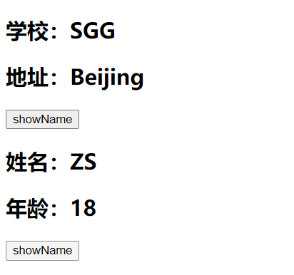
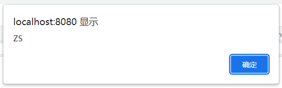
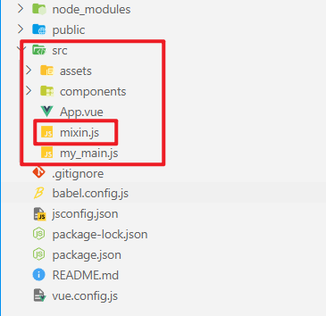
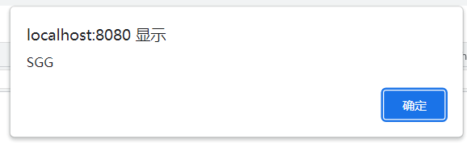
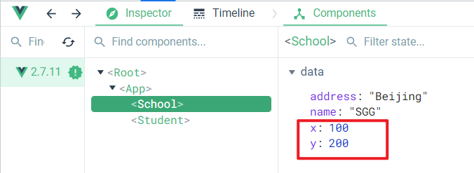
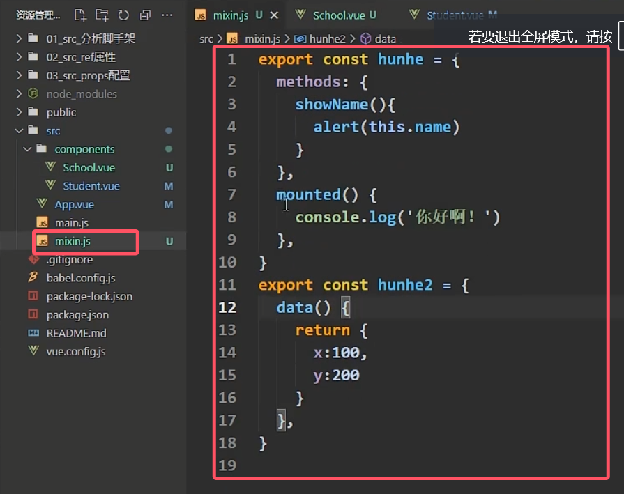
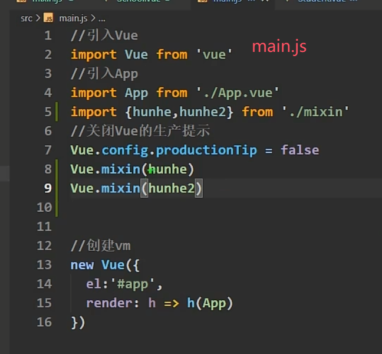
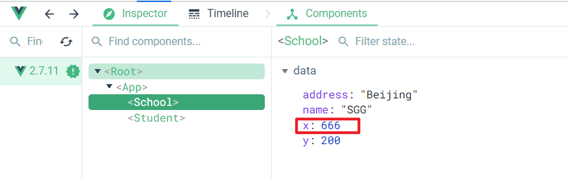
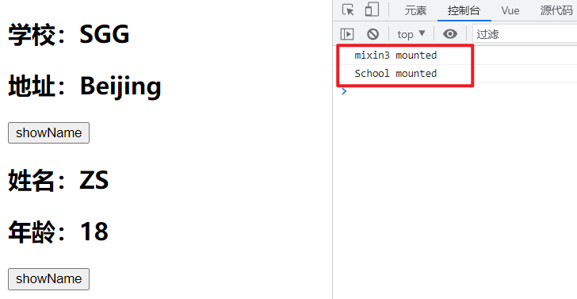

# mixin 混入

------

## 1. mixin 混入

mixin (混入)可以把多个组件共用的配置提取成一个混入对象，实现对组件配置项的复用。

## 2. 未使用混入的页面

App.vue

```html
<template>
  <div>
    <School></School>
    <Student></Student>
  </div>
</template>

<script>
// 导入子组件
import School from './components/School.vue'
import Student from './components/Student.vue'

export default {
  name: 'App',
  components: {
    School,
    Student
  }
}
</script>

<style>
</style>
```

> 

School.vue

```html
<template>
  <div class="demo">
    <h2>学校：{{name}}</h2>
    <h2>地址：{{address}}</h2>
    <button @click="showName">showName</button>
  </div>
</template>

<script>
export default {
  name: 'School',
  data() {
    return {
      name: 'SGG',
      address: 'Beijing'
    }
  },
  methods: {
    showName() {
      alert(this.name)
    }
  }
}
</script>

<style>
</style>
```

> 

Student.vue

```html
<template>
  <div>
    <h2>姓名：{{name}}</h2>
    <h2>年龄：{{age}}</h2>
    <button @click="showName">showName</button>
  </div>
</template>

<script>
export default {
  name: 'Student',
  data() {
    return {
      name: 'ZS',
      age: 18
    }
  },
  methods: {
    showName() {
      alert(this.name)
    }
  }
}
</script>

<style>
</style>
```

> 

> 观察代码发现在School组件和Student组件的方法代码一致，即两个组件的methods配置项代码一致，可以把多个组件共用的配置提取成一个混入对象。

## 3. 将相同的配置项抽取

> 在src目录下建立一个mixin.js文件，用于编写不同组件相同的配置项。
> 

mixin.js

```js
export const mixin = {
  methods: {
    showName() {
      alert(this.name)
    }
  }
}
```

## 4. mixin 混入的使用

在组件中使用mixin混入，需要先将其进行导入，然后再组件的配置项mixins中使用。

School.vue

```html
<template>
  <div class="demo">
    <h2>学校：{{name}}</h2>
    <h2>地址：{{address}}</h2>
    <button @click="showName">showName</button>
  </div>
</template>

<script>
// 导入mixin
import {mixin} from '../mixin'

export default {
  name: 'School',
  data() {
    return {
      name: 'SGG',
      address: 'Beijing'
    }
  },
  mixins: [mixin]
}
</script>

<style>
</style>
```

> 

Student.vue

```html
<template>
  <div>
    <h2>姓名：{{name}}</h2>
    <h2>年龄：{{age}}</h2>
    <button @click="showName">showName</button>
  </div>
</template>

<script>
import {mixin} from '../mixin'

export default {
  name: 'Student',
  data() {
    return {
      name: 'ZS',
      age: 18
    }
  },
  mixins: [mixin]
}
</script>

<style>
</style>
```

> 

在mixin混入中也可以编写组件的其他配置项。

mixin.js

```js
export const mixin = {
  methods: {
    showName() {
      alert(this.name)
    }
  }
}

export const mixin2 = {
  data() {
    return {
      x: 100,
      y: 200
    }
  },
}
```

School.vue

```html
<template>
  <div class="demo">
    <h2>学校：{{name}}</h2>
    <h2>地址：{{address}}</h2>
    <button @click="showName">showName</button>
  </div>
</template>

<script>
// 导入mixin
import {mixin, mixin2} from '../mixin'

export default {
  name: 'School',
  data() {
    return {
      name: 'SGG',
      address: 'Beijing'
    }
  },
  mixins: [mixin, mixin2]
}
</script>

<style>
</style>
```

> 

## 5.mixin全局混入

在main.js中通过 Vue.mixin(xxx) 进行混入





## 6. mixin中的配置项与组件的配置项冲突

### 6.1 普通配置项

当mixin中的普通配置项与组件的普通配置项发生冲突时，优先使用组件中自己的配置项。

School.vue

```html
<template>
  <div class="demo">
    <h2>学校：{{name}}</h2>
    <h2>地址：{{address}}</h2>
    <button @click="showName">showName</button>
  </div>
</template>

<script>
// 导入mixin
import {mixin, mixin2} from '../mixin'

export default {
  name: 'School',
  data() {
    return {
      name: 'SGG',
      address: 'Beijing',
      x: 666
    }
  },
  mixins: [mixin, mixin2]
}
</script>

<style>
</style>
```

> 

### 6.2 生命周期钩子

当mixin中的生命周期函数与组件中的周期函数发生冲突时，会先执行mixin中的生命周期函数，后执行组件自己的生命周期函数。

mixin.js

```js
export const mixin = {
  methods: {
    showName() {
      alert(this.name)
    }
  }
}

export const mixin2 = {
  data() {
    return {
      x: 100,
      y: 200
    }
  },
}

export const mixin3 = {
  mounted() {
    console.log('mixin3 mounted')
  }
}
```

School.vue

```html
<template>
  <div class="demo">
    <h2>学校：{{name}}</h2>
    <h2>地址：{{address}}</h2>
    <button @click="showName">showName</button>
  </div>
</template>

<script>
// 导入mixin
import {mixin, mixin2, mixin3} from '../mixin'

export default {
  name: 'School',
  data() {
    return {
      name: 'SGG',
      address: 'Beijing',
      x: 666
    }
  },
  mixins: [mixin, mixin2, mixin3],
  mounted() {
    console.log('School mounted')
  }
}
</script>

<style>
</style>
```

> 

## 7. mixin 总结

1. 功能：可以把多个组件共用的配置提取成一个混入对象

2. 使用方式：

   - 第一步定义混合：

     ```properties
     {
         data(){....},
         methods:{....}
         ....
     }
     ```

   - 第二步使用混入：

     全局混入：`Vue.mixin(xxx)`
     ​ 局部混入：`mixins:['xxx']`

